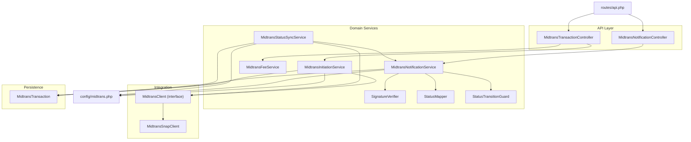
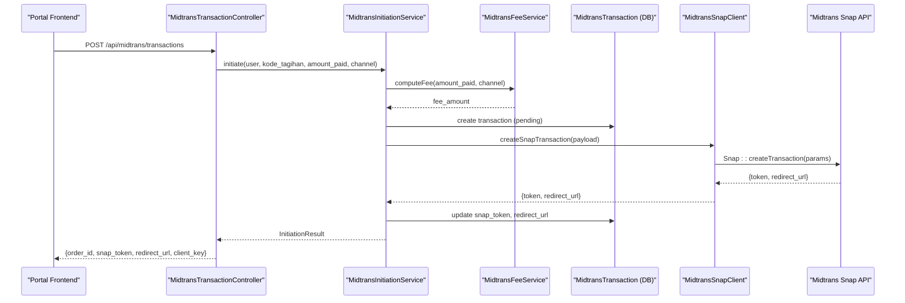
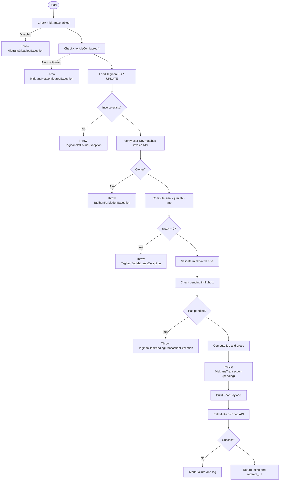
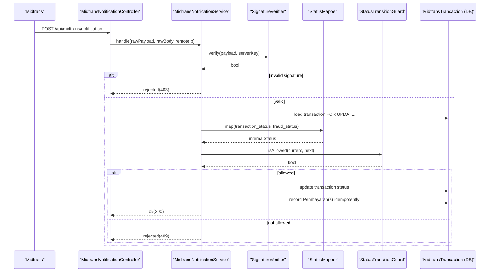
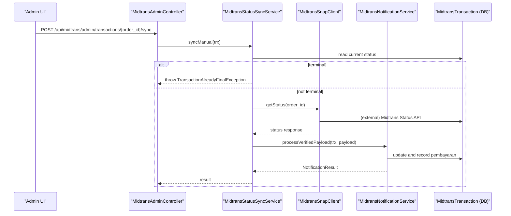
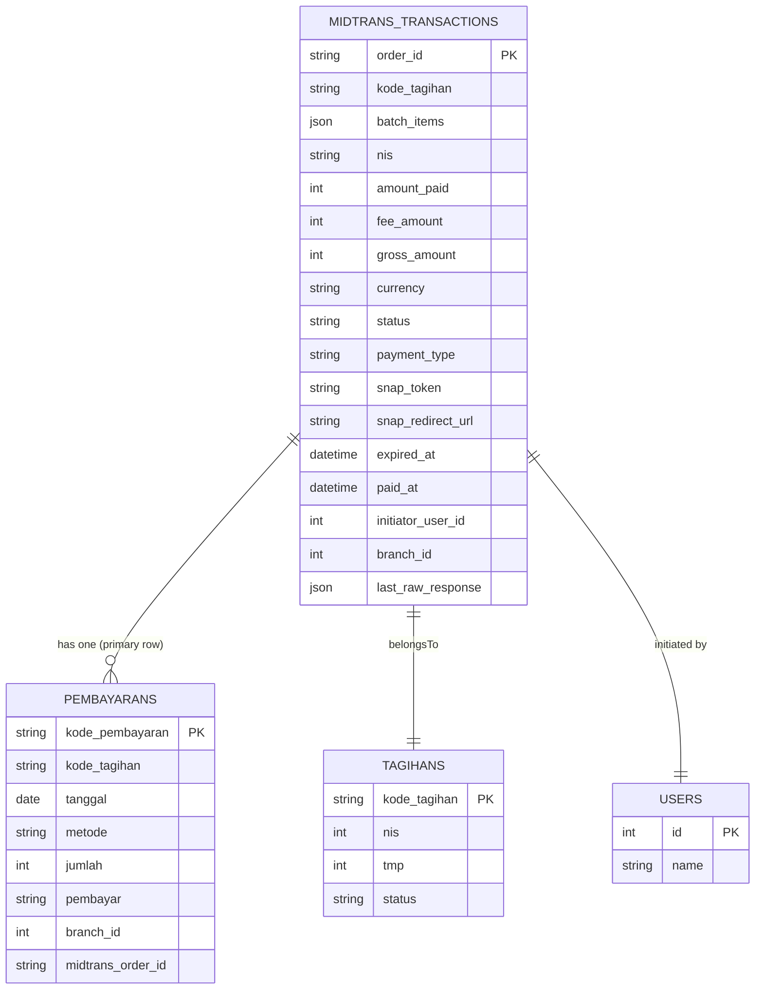
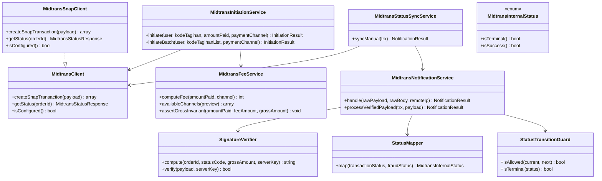
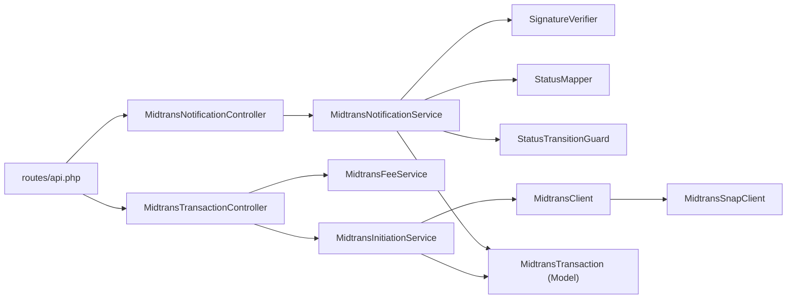

# Online Payments

<cite>
**Referenced Files in This Document**
- [MidtransClient.php](file://backend/app/Services/Midtrans/MidtransClient.php)
- [MidtransSnapClient.php](file://backend/app/Services/Midtrans/MidtransSnapClient.php)
- [MidtransInitiationService.php](file://backend/app/Services/Midtrans/MidtransInitiationService.php)
- [MidtransNotificationService.php](file://backend/app/Services/Midtrans/MidtransNotificationService.php)
- [MidtransStatusSyncService.php](file://backend/app/Services/Midtrans/MidtransStatusSyncService.php)
- [SignatureVerifier.php](file://backend/app/Services/Midtrans/SignatureVerifier.php)
- [StatusMapper.php](file://backend/app/Services/Midtrans/StatusMapper.php)
- [StatusTransitionGuard.php](file://backend/app/Services/Midtrans/StatusTransitionGuard.php)
- [MidtransInternalStatus.php](file://backend/app/Services/Midtrans/MidtransInternalStatus.php)
- [MidtransFeeService.php](file://backend/app/Services/Midtrans/MidtransFeeService.php)
- [MidtransTransactionController.php](file://backend/app/Http/Controllers/MidtransTransactionController.php)
- [MidtransNotificationController.php](file://backend/app/Http/Controllers/MidtransNotificationController.php)
- [MidtransTransaction.php](file://backend/app/Models/MidtransTransaction.php)
- [midtrans.php](file://backend/config/midtrans.php)
- [api.php](file://backend/routes/api.php)
</cite>

## Table of Contents
1. Introduction
2. Project Structure
3. Core Components
4. Architecture Overview
5. Detailed Component Analysis
6. Dependency Analysis
7. Performance Considerations
8. Troubleshooting Guide
9. Conclusion

## Introduction
This document explains the online payment processing flow integrated with Midtrans Snap. It covers transaction creation, payment link generation via Snap token, real-time status updates through webhooks and polling/sync, error handling strategies, retry mechanisms, idempotency, and security considerations including signature verification. It also documents partial payments (single-tagihan top-ups) and batch payments that settle multiple invoices in one checkout.

## Project Structure
The Midtrans integration is implemented as a set of services, controllers, models, configuration, and routes:
- Services orchestrate business logic for initiation, notifications, status sync, fee calculation, and state transitions.
- Controllers expose API endpoints for initiating payments, listing fee channels, checking status, and receiving webhooks.
- Models persist transaction metadata and relationships.
- Configuration centralizes credentials, fees, and feature flags.
- Routes wire HTTP endpoints to controllers.

**Diagram sources**
- [MidtransTransactionController.php:1-127](file://backend/app/Http/Controllers/MidtransTransactionController.php#L1-L127)
- [MidtransNotificationController.php:1-35](file://backend/app/Http/Controllers/MidtransNotificationController.php#L1-L35)
- [MidtransInitiationService.php:1-473](file://backend/app/Services/Midtrans/MidtransInitiationService.php#L1-L473)
- [MidtransNotificationService.php:1-284](file://backend/app/Services/Midtrans/MidtransNotificationService.php#L1-L284)
- [MidtransStatusSyncService.php:1-73](file://backend/app/Services/Midtrans/MidtransStatusSyncService.php#L1-L73)
- [MidtransFeeService.php:1-144](file://backend/app/Services/Midtrans/MidtransFeeService.php#L1-L144)
- [SignatureVerifier.php:1-34](file://backend/app/Services/Midtrans/SignatureVerifier.php#L1-L34)
- [StatusMapper.php:1-41](file://backend/app/Services/Midtrans/StatusMapper.php#L1-L41)
- [StatusTransitionGuard.php:1-77](file://backend/app/Services/Midtrans/StatusTransitionGuard.php#L1-L77)
- [MidtransClient.php:1-27](file://backend/app/Services/Midtrans/MidtransClient.php#L1-L27)
- [MidtransSnapClient.php:1-123](file://backend/app/Services/Midtrans/MidtransSnapClient.php#L1-L123)
- [MidtransTransaction.php:1-85](file://backend/app/Models/MidtransTransaction.php#L1-L85)
- [midtrans.php:1-130](file://backend/config/midtrans.php#L1-L130)
- [api.php:321-345](file://backend/routes/api.php#L321-L345)

**Section sources**
- [api.php:321-345](file://backend/routes/api.php#L321-L345)
- [midtrans.php:1-130](file://backend/config/midtrans.php#L1-L130)

## Core Components
- MidtransClient interface and MidtransSnapClient implementation encapsulate calls to Midtrans Snap and Status APIs, including environment setup and CA bundle configuration.
- MidtransInitiationService validates invoice eligibility, computes fees, persists transaction records, builds Snap payloads, and returns a Snap token and redirect URL.
- MidtransNotificationService verifies webhook signatures, maps statuses, enforces allowed transitions, updates transactions, and records payments idempotently.
- MidtransStatusSyncService polls Midtrans Status API for non-terminal transactions and delegates to notification service for consistent processing.
- SignatureVerifier implements constant-time signature verification using SHA-512 over order_id + status_code + gross_amount + server_key.
- StatusMapper translates Midtrans statuses to internal states; StatusTransitionGuard enforces valid state transitions.
- MidtransFeeService calculates per-channel admin fees and exposes channel metadata with previews.

**Section sources**
- [MidtransClient.php:1-27](file://backend/app/Services/Midtrans/MidtransClient.php#L1-L27)
- [MidtransSnapClient.php:1-123](file://backend/app/Services/Midtrans/MidtransSnapClient.php#L1-L123)
- [MidtransInitiationService.php:1-473](file://backend/app/Services/Midtrans/MidtransInitiationService.php#L1-L473)
- [MidtransNotificationService.php:1-284](file://backend/app/Services/Midtrans/MidtransNotificationService.php#L1-L284)
- [MidtransStatusSyncService.php:1-73](file://backend/app/Services/Midtrans/MidtransStatusSyncService.php#L1-L73)
- [SignatureVerifier.php:1-34](file://backend/app/Services/Midtrans/SignatureVerifier.php#L1-L34)
- [StatusMapper.php:1-41](file://backend/app/Services/Midtrans/StatusMapper.php#L1-L41)
- [StatusTransitionGuard.php:1-77](file://backend/app/Services/Midtrans/StatusTransitionGuard.php#L1-L77)
- [MidtransFeeService.php:1-144](file://backend/app/Services/Midtrans/MidtransFeeService.php#L1-L144)

## Architecture Overview
The system supports two primary flows:
- Payment Initiation: Client requests a Snap session; backend creates a transaction record and returns a token and redirect URL.
- Payment Confirmation: Midtrans sends a webhook; backend verifies signature, maps status, applies transition rules, and records payments. A manual sync endpoint can poll Midtrans for pending transactions.

**Diagram sources**
- [MidtransTransactionController.php:17-41](file://backend/app/Http/Controllers/MidtransTransactionController.php#L17-L41)
- [MidtransInitiationService.php:44-236](file://backend/app/Services/Midtrans/MidtransInitiationService.php#L44-L236)
- [MidtransFeeService.php:28-37](file://backend/app/Services/Midtrans/MidtransFeeService.php#L28-L37)
- [MidtransSnapClient.php:50-80](file://backend/app/Services/Midtrans/MidtransSnapClient.php#L50-L80)
- [MidtransTransaction.php:1-85](file://backend/app/Models/MidtransTransaction.php#L1-L85)

## Detailed Component Analysis

### Payment Initiation Flow
- Validates feature flag and configuration.
- Loads and locks the invoice (Tagihan), verifies ownership, computes remaining balance, and checks minimum/maximum amounts.
- Prevents concurrent in-flight transactions for the same invoice.
- Computes fee and gross amount, asserts invariant, generates order ID, and persists a pending transaction.
- Builds Snap payload with item details, customer details, expiry, callbacks, and enabled payments mapping.
- Calls Midtrans Snap API; on failure, marks transaction as failed and logs.

**Diagram sources**
- [MidtransInitiationService.php:44-236](file://backend/app/Services/Midtrans/MidtransInitiationService.php#L44-L236)

**Section sources**
- [MidtransInitiationService.php:44-236](file://backend/app/Services/Midtrans/MidtransInitiationService.php#L44-L236)
- [MidtransFeeService.php:28-37](file://backend/app/Services/Midtrans/MidtransFeeService.php#L28-L37)
- [MidtransSnapClient.php:50-80](file://backend/app/Services/Midtrans/MidtransSnapClient.php#L50-L80)

### Webhook Handling and Real-Time Status Updates
- Controller receives raw JSON body and passes it to the notification service.
- Service checks webhook_enabled, records inbound log, verifies signature, loads transaction with lock, and processes.
- Processing validates gross amount, maps status, enforces transition guard, updates transaction fields, and records Pembayaran(s).
- Idempotent: skips if a pembayaran already exists for the order; batch mode creates one pembayaran per item.

**Diagram sources**
- [MidtransNotificationController.php:20-33](file://backend/app/Http/Controllers/MidtransNotificationController.php#L20-L33)
- [MidtransNotificationService.php:31-150](file://backend/app/Services/Midtrans/MidtransNotificationService.php#L31-L150)
- [SignatureVerifier.php:22-32](file://backend/app/Services/Midtrans/SignatureVerifier.php#L22-L32)
- [StatusMapper.php:23-39](file://backend/app/Services/Midtrans/StatusMapper.php#L23-L39)
- [StatusTransitionGuard.php:62-67](file://backend/app/Services/Midtrans/StatusTransitionGuard.php#L62-L67)
- [MidtransTransaction.php:1-85](file://backend/app/Models/MidtransTransaction.php#L1-L85)

**Section sources**
- [MidtransNotificationController.php:20-33](file://backend/app/Http/Controllers/MidtransNotificationController.php#L20-L33)
- [MidtransNotificationService.php:31-150](file://backend/app/Services/Midtrans/MidtransNotificationService.php#L31-L150)
- [SignatureVerifier.php:22-32](file://backend/app/Services/Midtrans/SignatureVerifier.php#L22-L32)
- [StatusMapper.php:23-39](file://backend/app/Services/Midtrans/StatusMapper.php#L23-L39)
- [StatusTransitionGuard.php:62-67](file://backend/app/Services/Midtrans/StatusTransitionGuard.php#L62-L67)

### Manual Status Sync (Polling)
- Admin-triggered or background job can call sync for non-terminal transactions.
- Calls Midtrans Status API, logs outbound, synthesizes a webhook-like payload, and delegates to notification service for consistent processing.

**Diagram sources**
- [MidtransStatusSyncService.php:25-71](file://backend/app/Services/Midtrans/MidtransStatusSyncService.php#L25-L71)
- [MidtransSnapClient.php:85-109](file://backend/app/Services/Midtrans/MidtransSnapClient.php#L85-L109)
- [MidtransNotificationService.php:76-89](file://backend/app/Services/Midtrans/MidtransNotificationService.php#L76-L89)

**Section sources**
- [MidtransStatusSyncService.php:25-71](file://backend/app/Services/Midtrans/MidtransStatusSyncService.php#L25-L71)
- [MidtransSnapClient.php:85-109](file://backend/app/Services/Midtrans/MidtransSnapClient.php#L85-L109)

### Data Model Relationships

**Diagram sources**
- [MidtransTransaction.php:1-85](file://backend/app/Models/MidtransTransaction.php#L1-L85)

**Section sources**
- [MidtransTransaction.php:1-85](file://backend/app/Models/MidtransTransaction.php#L1-L85)

### Class Diagram of Key Components

**Diagram sources**
- [MidtransClient.php:1-27](file://backend/app/Services/Midtrans/MidtransClient.php#L1-L27)
- [MidtransSnapClient.php:1-123](file://backend/app/Services/Midtrans/MidtransSnapClient.php#L1-L123)
- [MidtransInitiationService.php:1-473](file://backend/app/Services/Midtrans/MidtransInitiationService.php#L1-L473)
- [MidtransNotificationService.php:1-284](file://backend/app/Services/Midtrans/MidtransNotificationService.php#L1-L284)
- [MidtransStatusSyncService.php:1-73](file://backend/app/Services/Midtrans/MidtransStatusSyncService.php#L1-L73)
- [SignatureVerifier.php:1-34](file://backend/app/Services/Midtrans/SignatureVerifier.php#L1-L34)
- [StatusMapper.php:1-41](file://backend/app/Services/Midtrans/StatusMapper.php#L1-L41)
- [StatusTransitionGuard.php:1-77](file://backend/app/Services/Midtrans/StatusTransitionGuard.php#L1-L77)
- [MidtransFeeService.php:1-144](file://backend/app/Services/Midtrans/MidtransFeeService.php#L1-L144)
- [MidtransInternalStatus.php:1-45](file://backend/app/Services/Midtrans/MidtransInternalStatus.php#L1-L45)

**Section sources**
- [MidtransInternalStatus.php:1-45](file://backend/app/Services/Midtrans/MidtransInternalStatus.php#L1-L45)

## Dependency Analysis
- Controllers depend on services; services depend on clients and utilities.
- The webhook path depends on signature verification and state machine enforcement.
- The sync path reuses the notification service’s shared processing logic after calling the status API.
- Configuration drives feature toggles, fees, and behavior.

**Diagram sources**
- [api.php:321-345](file://backend/routes/api.php#L321-L345)
- [MidtransTransactionController.php:1-127](file://backend/app/Http/Controllers/MidtransTransactionController.php#L1-L127)
- [MidtransNotificationController.php:1-35](file://backend/app/Http/Controllers/MidtransNotificationController.php#L1-L35)
- [MidtransInitiationService.php:1-473](file://backend/app/Services/Midtrans/MidtransInitiationService.php#L1-L473)
- [MidtransNotificationService.php:1-284](file://backend/app/Services/Midtrans/MidtransNotificationService.php#L1-L284)
- [MidtransClient.php:1-27](file://backend/app/Services/Midtrans/MidtransClient.php#L1-L27)
- [MidtransSnapClient.php:1-123](file://backend/app/Services/Midtrans/MidtransSnapClient.php#L1-L123)
- [MidtransTransaction.php:1-85](file://backend/app/Models/MidtransTransaction.php#L1-L85)

**Section sources**
- [api.php:321-345](file://backend/routes/api.php#L321-L345)

## Performance Considerations
- Database locking: Uses FOR UPDATE on critical rows to prevent race conditions during initiation and notification processing.
- Deadlock retries: Notification processing wraps DB operations in transactions with limited retries.
- Idempotency: Payment recording is guarded by unique constraints and explicit checks to avoid duplicate entries.
- Minimal external calls: Status sync avoids calling Midtrans when transaction is terminal.
- Logging: Outbound/inbound logs are recorded to aid observability without blocking core paths.

[No sources needed since this section provides general guidance]

## Troubleshooting Guide
Common issues and resolutions:
- Invalid signature: Ensure server key is correct and payload integrity is intact. The service rejects with 403 on mismatch.
- Amount mismatch: Gross amount must match expected value; otherwise, the request is rejected with 422.
- Invalid status transition: Enforced by state machine; investigate upstream Midtrans events and internal state.
- Order not found: Verify order_id exists and is active; webhook may be delayed or misrouted.
- Overpayment blocked: System prevents exceeding remaining balance; adjust payment amount or split into multiple transactions.
- Midtrans unavailable: Network or credential issues; check environment keys and connectivity.
- Transaction not yet processed: Midtrans may not have registered the transaction until buyer selects a payment method; use polling or wait for webhook.

Operational tips:
- Use admin sync endpoint to reconcile pending transactions.
- Inspect inbound/outbound logs for detailed payloads and errors.
- Confirm feature flags and webhook settings in configuration.

**Section sources**
- [MidtransNotificationService.php:31-150](file://backend/app/Services/Midtrans/MidtransNotificationService.php#L31-L150)
- [MidtransStatusSyncService.php:25-71](file://backend/app/Services/Midtrans/MidtransStatusSyncService.php#L25-L71)
- [MidtransSnapClient.php:85-109](file://backend/app/Services/Midtrans/MidtransSnapClient.php#L85-L109)

## Conclusion
The Midtrans integration provides a robust, secure, and auditable payment flow with strong safeguards against concurrency, invalid states, and tampering. It supports both single and batch payments, offers real-time updates via webhooks and manual sync, and maintains clear separation of concerns across controllers, services, and persistence layers. Proper configuration and monitoring ensure reliable operation in production environments.