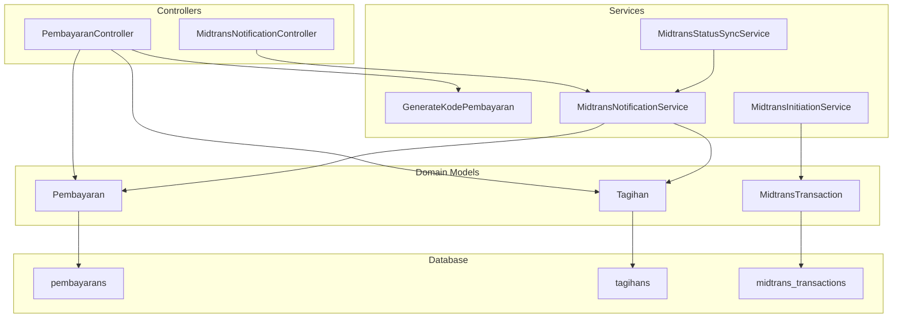
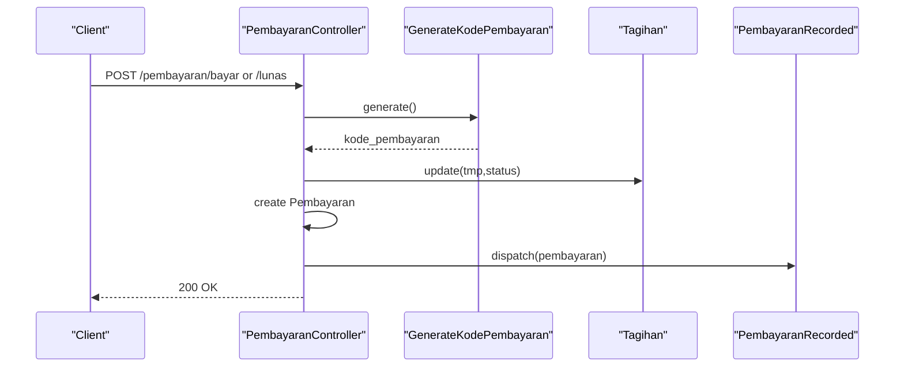
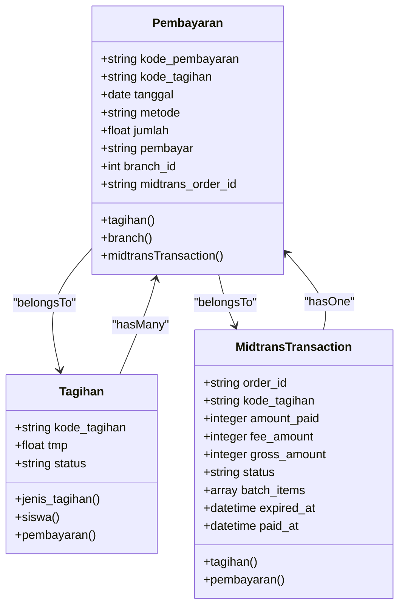
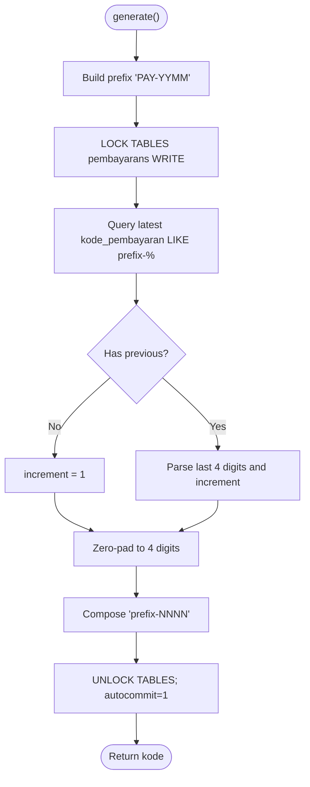
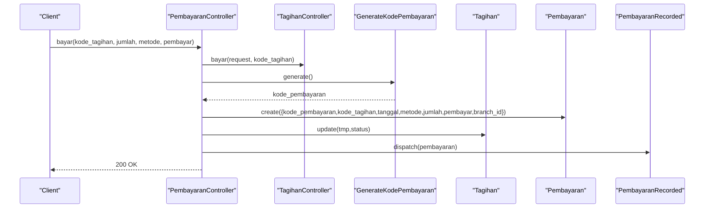
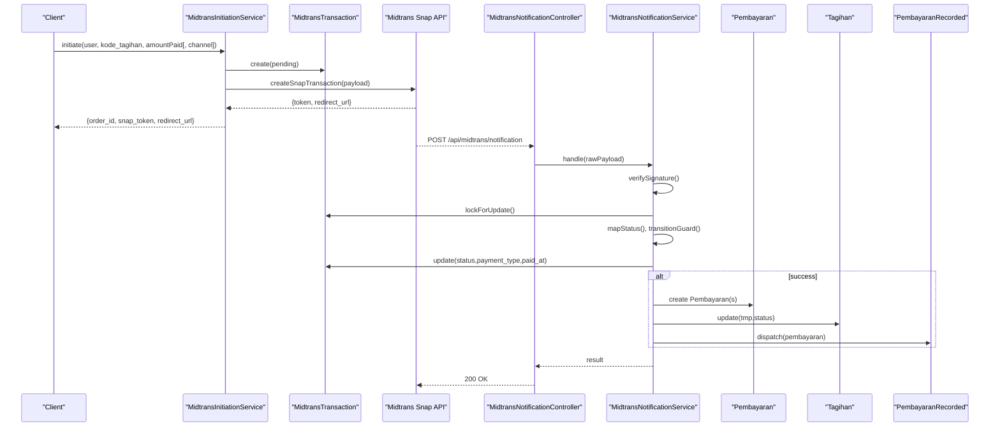
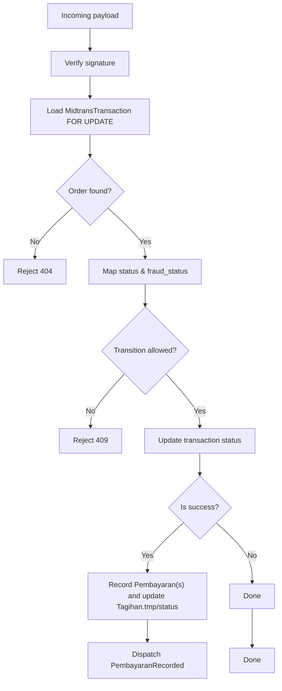
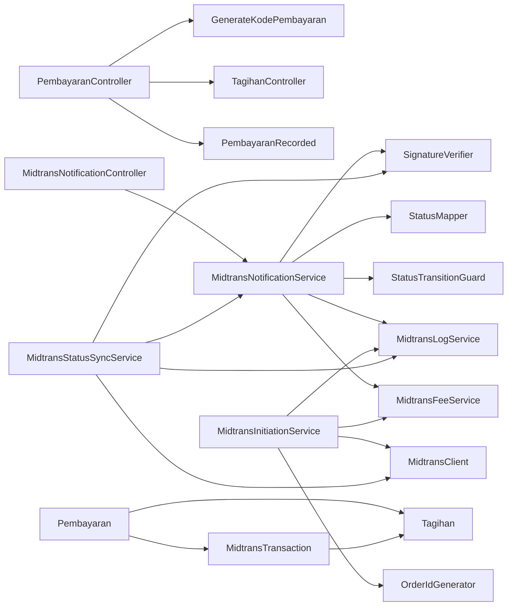

# Payment Processing (Pembayaran)

<cite>
**Referenced Files in This Document**
- [Pembayaran.php](file://backend/app/Models/Pembayaran.php)
- [Tagihan.php](file://backend/app/Models/Tagihan.php)
- [MidtransTransaction.php](file://backend/app/Models/MidtransTransaction.php)
- [2025_11_14_102319_create_pembayarans_table.php](file://backend/database/migrations/2025_11_14_102319_create_pembayarans_table.php)
- [2026_06_22_000003_add_midtrans_columns_to_pembayarans_table.php](file://backend/database/migrations/2026_06_22_000003_add_midtrans_columns_to_pembayarans_table.php)
- [2026_06_22_000001_create_midtrans_transactions_table.php](file://backend/database/migrations/2026_06_22_000001_create_midtrans_transactions_table.php)
- [GenerateKodePembayaran.php](file://backend/app/Services/GenerateKodePembayaran.php)
- [PembayaranController.php](file://backend/app/Http/Controllers/PembayaranController.php)
- [TagihanController.php](file://backend/app/Http/Controllers/TagihanController.php)
- [MidtransInitiationService.php](file://backend/app/Services/Midtrans/MidtransInitiationService.php)
- [MidtransNotificationService.php](file://backend/app/Services/Midtrans/MidtransNotificationService.php)
- [MidtransStatusSyncService.php](file://backend/app/Services/Midtrans/MidtransStatusSyncService.php)
- [MidtransNotificationController.php](file://backend/app/Http/Controllers/MidtransNotificationController.php)
- [PembayaranRecorded.php](file://backend/app/Events/PembayaranRecorded.php)
</cite>

## Table of Contents
1. [Introduction](#introduction)
2. [Project Structure](#project-structure)
3. [Core Components](#core-components)
4. [Architecture Overview](#architecture-overview)
5. [Detailed Component Analysis](#detailed-component-analysis)
6. [Dependency Analysis](#dependency-analysis)
7. [Performance Considerations](#performance-considerations)
8. [Troubleshooting Guide](#troubleshooting-guide)
9. [Conclusion](#conclusion)
10. [Appendices](#appendices)

## Introduction
This document explains the payment processing system centered on the Pembayaran model and its integration with invoices (Tagihan) and Midtrans online payments. It covers:
- Pembayaran data structure, codes, amounts, methods, and status linkage to Tagihan
- Partial payments and allocation logic
- Payment code generation and validation rules
- Transaction integrity constraints and idempotency
- Recording payments, reconciliation flows, and Midtrans synchronization
- Refund handling and audit trail for compliance

## Project Structure
The payment domain spans models, services, controllers, migrations, and events:
- Models: Pembayaran, Tagihan, MidtransTransaction
- Services: GenerateKodePembayaran, MidtransInitiationService, MidtransNotificationService, MidtransStatusSyncService
- Controllers: PembayaranController, MidtransNotificationController
- Migrations: pembayaran table creation and midtrans columns addition; midtrans_transactions table
- Events: PembayaranRecorded

**Diagram sources**
- [Pembayaran.php:1-53](file://backend/app/Models/Pembayaran.php#L1-L53)
- [Tagihan.php:1-60](file://backend/app/Models/Tagihan.php#L1-L60)
- [MidtransTransaction.php:1-85](file://backend/app/Models/MidtransTransaction.php#L1-L85)
- [GenerateKodePembayaran.php:1-48](file://backend/app/Services/GenerateKodePembayaran.php#L1-L48)
- [PembayaranController.php:1-496](file://backend/app/Http/Controllers/PembayaranController.php#L1-L496)
- [MidtransInitiationService.php:1-473](file://backend/app/Services/Midtrans/MidtransInitiationService.php#L1-L473)
- [MidtransNotificationService.php:1-284](file://backend/app/Services/Midtrans/MidtransNotificationService.php#L1-L284)
- [MidtransStatusSyncService.php:1-73](file://backend/app/Services/Midtrans/MidtransStatusSyncService.php#L1-L73)
- [MidtransNotificationController.php:1-35](file://backend/app/Http/Controllers/MidtransNotificationController.php#L1-L35)
- [2025_11_14_102319_create_pembayarans_table.php:1-34](file://backend/database/migrations/2025_11_14_102319_create_pembayarans_table.php#L1-L34)
- [2026_06_22_000003_add_midtrans_columns_to_pembayarans_table.php:1-37](file://backend/database/migrations/2026_06_22_000003_add_midtrans_columns_to_pembayarans_table.php#L1-L37)
- [2026_06_22_000001_create_midtrans_transactions_table.php:1-71](file://backend/database/migrations/2026_06_22_000001_create_midtrans_transactions_table.php#L1-L71)

**Section sources**
- [Pembayaran.php:1-53](file://backend/app/Models/Pembayaran.php#L1-L53)
- [Tagihan.php:1-60](file://backend/app/Models/Tagihan.php#L1-L60)
- [MidtransTransaction.php:1-85](file://backend/app/Models/MidtransTransaction.php#L1-L85)
- [2025_11_14_102319_create_pembayarans_table.php:1-34](file://backend/database/migrations/2025_11_14_102319_create_pembayarans_table.php#L1-L34)
- [2026_06_22_000003_add_midtrans_columns_to_pembayarans_table.php:1-37](file://backend/database/migrations/2026_06_22_000003_add_midtrans_columns_to_pembayarans_table.php#L1-L37)
- [2026_06_22_000001_create_midtrans_transactions_table.php:1-71](file://backend/database/migrations/2026_06_22_000001_create_midtrans_transactions_table.php#L1-L71)
- [GenerateKodePembayaran.php:1-48](file://backend/app/Services/GenerateKodePembayaran.php#L1-L48)
- [PembayaranController.php:1-496](file://backend/app/Http/Controllers/PembayaranController.php#L1-L496)
- [MidtransInitiationService.php:1-473](file://backend/app/Services/Midtrans/MidtransInitiationService.php#L1-L473)
- [MidtransNotificationService.php:1-284](file://backend/app/Services/Midtrans/MidtransNotificationService.php#L1-L284)
- [MidtransStatusSyncService.php:1-73](file://backend/app/Services/Midtrans/MidtransStatusSyncService.php#L1-L73)
- [MidtransNotificationController.php:1-35](file://backend/app/Http/Controllers/MidtransNotificationController.php#L1-L35)

## Core Components
- Pembayaran model: primary key is kode_pembayaran (string), fields include kode_tagihan, tanggal, metode (offline | online_midtrans), jumlah, pembayar, branch_id, midtrans_order_id (unique). Casts jumlah as float. Relationships: belongsTo Tagihan, Branch, MidtransTransaction.
- Tagihan model: tracks tmp (cumulative paid amount) and status (e.g., Lunas, Belum Lunas, Belum Dibayar). Relationship to JenisTagihan provides total biaya (jumlah).
- MidtransTransaction model: represents online checkout sessions with order_id, amount_paid, fee_amount, gross_amount, status transitions, batch_items for multi-tagihan settlements, and timestamps for expired_at/paid_at.

Key behaviors:
- Offline partial/full payments are recorded via PembayaranController.bayar/lunas/batchLunas, updating Tagihan.tmp and status accordingly.
- Online payments are initiated via MidtransInitiationService, then finalized by MidtransNotificationService upon webhook or manual sync, creating one or more Pembayaran records and updating Tagihan.tmp/status.

**Section sources**
- [Pembayaran.php:1-53](file://backend/app/Models/Pembayaran.php#L1-L53)
- [Tagihan.php:1-60](file://backend/app/Models/Tagihan.php#L1-L60)
- [MidtransTransaction.php:1-85](file://backend/app/Models/MidtransTransaction.php#L1-L85)
- [2025_11_14_102319_create_pembayarans_table.php:1-34](file://backend/database/migrations/2025_11_14_102319_create_pembayarans_table.php#L1-L34)
- [2026_06_22_000003_add_midtrans_columns_to_pembayarans_table.php:1-37](file://backend/database/migrations/2026_06_22_000003_add_midtrans_columns_to_pembayarans_table.php#L1-L37)
- [2026_06_22_000001_create_midtrans_transactions_table.php:1-71](file://backend/database/migrations/2026_06_22_000001_create_midtrans_transactions_table.php#L1-L71)

## Architecture Overview
End-to-end flows:
- Offline payment recording: controller validates request, generates unique payment code, persists Pembayaran, updates Tagihan.tmp/status, dispatches event.
- Online payment initiation: service validates ownership and amounts, creates MidtransTransaction, calls Snap API, returns redirect.
- Webhook/sync processing: service verifies signature, maps status, enforces transitions, updates transaction, and records Pembayaran(s) while updating Tagihan.tmp/status.

**Diagram sources**
- [PembayaranController.php:342-397](file://backend/app/Http/Controllers/PembayaranController.php#L342-L397)
- [GenerateKodePembayaran.php:14-45](file://backend/app/Services/GenerateKodePembayaran.php#L14-L45)
- [Tagihan.php:1-60](file://backend/app/Models/Tagihan.php#L1-L60)
- [PembayaranRecorded.php:1-17](file://backend/app/Events/PembayaranRecorded.php#L1-L17)

## Detailed Component Analysis

### Pembayaran Model and Schema
- Primary key: kode_pembayaran (char(30))
- Foreign key: kode_tagihan references tagihans.kode_tagihan
- Columns: tanggal (date), metode (enum offline|online_midtrans), jumlah (decimal), pembayar (string), branch_id (int), midtrans_order_id (string unique)
- Indexes: kode_tagihan, tanggal, metode; unique midtrans_order_id
- Relationships:
  - tagihan(): belongsTo(Tagihan)
  - branch(): belongsTo(Branch)
  - midtransTransaction(): belongsTo(MidtransTransaction) via midtrans_order_id -> order_id

**Diagram sources**
- [Pembayaran.php:1-53](file://backend/app/Models/Pembayaran.php#L1-L53)
- [Tagihan.php:1-60](file://backend/app/Models/Tagihan.php#L1-L60)
- [MidtransTransaction.php:1-85](file://backend/app/Models/MidtransTransaction.php#L1-L85)
- [2025_11_14_102319_create_pembayarans_table.php:1-34](file://backend/database/migrations/2025_11_14_102319_create_pembayarans_table.php#L1-L34)
- [2026_06_22_000003_add_midtrans_columns_to_pembayarans_table.php:1-37](file://backend/database/migrations/2026_06_22_000003_add_midtrans_columns_to_pembayarans_table.php#L1-L37)
- [2026_06_22_000001_create_midtrans_transactions_table.php:1-71](file://backend/database/migrations/2026_06_22_000001_create_midtrans_transactions_table.php#L1-L71)

**Section sources**
- [Pembayaran.php:1-53](file://backend/app/Models/Pembayaran.php#L1-L53)
- [2025_11_14_102319_create_pembayarans_table.php:1-34](file://backend/database/migrations/2025_11_14_102319_create_pembayarans_table.php#L1-L34)
- [2026_06_22_000003_add_midtrans_columns_to_pembayarans_table.php:1-37](file://backend/database/migrations/2026_06_22_000003_add_midtrans_columns_to_pembayarans_table.php#L1-L37)
- [2026_06_22_000001_create_midtrans_transactions_table.php:1-71](file://backend/database/migrations/2026_06_22_000001_create_midtrans_transactions_table.php#L1-L71)

### Payment Code Generation Service
- Generates sequential codes per month: PAY-YYMM-NNNN
- Uses explicit table lock to avoid race conditions when generating next sequence number
- Returns a unique string used as Pembayaran primary key

**Diagram sources**
- [GenerateKodePembayaran.php:14-45](file://backend/app/Services/GenerateKodePembayaran.php#L14-L45)

**Section sources**
- [GenerateKodePembayaran.php:1-48](file://backend/app/Services/GenerateKodePembayaran.php#L1-L48)

### Offline Payments: Recording and Allocation
- PembayaranController.bayar: validates non-lunas tagihan, ensures accumulated amount does not exceed biaya, creates Pembayaran, updates Tagihan.tmp/status via TagihanController.bayar, dispatches event.
- PembayaranController.lunas: ensures tagihan not already lunas, delegates full settlement to TagihanController.lunas, records Pembayaran, dispatches event.
- PembayaranController.batchLunas: processes multiple tagihan in a single DB transaction, computes each amount from jenis_tagihan.jumlah - tmp, sets status to Lunan, records Pembayaran for each, dispatches events.

**Diagram sources**
- [PembayaranController.php:342-397](file://backend/app/Http/Controllers/PembayaranController.php#L342-L397)
- [TagihanController.php:1-200](file://backend/app/Http/Controllers/TagihanController.php#L1-L200)
- [GenerateKodePembayaran.php:14-45](file://backend/app/Services/GenerateKodePembayaran.php#L14-L45)
- [PembayaranRecorded.php:1-17](file://backend/app/Events/PembayaranRecorded.php#L1-L17)

**Section sources**
- [PembayaranController.php:170-241](file://backend/app/Http/Controllers/PembayaranController.php#L170-L241)
- [PembayaranController.php:301-340](file://backend/app/Http/Controllers/PembayaranController.php#L301-L340)
- [PembayaranController.php:342-397](file://backend/app/Http/Controllers/PembayaranController.php#L342-L397)

### Online Payments: Initiation, Webhooks, and Reconciliation
- Initiation: MidtransInitiationService.validate feature flags, configuration, ownership, sisa (jumlah - tmp), min amount, no pending tx; compute fee/gross; persist MidtransTransaction; call Snap API; return token/redirect.
- Webhook/Sync: MidtransNotificationController receives payload; MidtransNotificationService verifies signature, locks transaction, maps status, enforces transition guard, updates transaction, and records Pembayaran(s). For batch transactions, it materializes one Pembayaran per item and updates each Tagihan.tmp/status. Idempotent via midtrans_order_id uniqueness and pre-check.
- Manual Sync: MidtransStatusSyncService queries Midtrans Status API and delegates to notification service’s processVerifiedPayload.

**Diagram sources**
- [MidtransInitiationService.php:44-237](file://backend/app/Services/Midtrans/MidtransInitiationService.php#L44-L237)
- [MidtransNotificationController.php:1-35](file://backend/app/Http/Controllers/MidtransNotificationController.php#L1-L35)
- [MidtransNotificationService.php:31-150](file://backend/app/Services/Midtrans/MidtransNotificationService.php#L31-L150)
- [MidtransTransaction.php:1-85](file://backend/app/Models/MidtransTransaction.php#L1-L85)
- [Pembayaran.php:1-53](file://backend/app/Models/Pembayaran.php#L1-L53)
- [Tagihan.php:1-60](file://backend/app/Models/Tagihan.php#L1-L60)
- [PembayaranRecorded.php:1-17](file://backend/app/Events/PembayaranRecorded.php#L1-L17)

**Section sources**
- [MidtransInitiationService.php:1-473](file://backend/app/Services/Midtrans/MidtransInitiationService.php#L1-L473)
- [MidtransNotificationController.php:1-35](file://backend/app/Http/Controllers/MidtransNotificationController.php#L1-L35)
- [MidtransNotificationService.php:1-284](file://backend/app/Services/Midtrans/MidtransNotificationService.php#L1-L284)
- [MidtransStatusSyncService.php:1-73](file://backend/app/Services/Midtrans/MidtransStatusSyncService.php#L1-L73)

### Payment Status Synchronization and Guardrails
- Status mapping and transition enforcement ensure only valid state changes occur.
- Gross amount verification prevents tampering.
- Pending transaction checks prevent duplicate checkouts for the same tagihan.
- Terminal states block further sync attempts.

**Diagram sources**
- [MidtransNotificationService.php:96-150](file://backend/app/Services/Midtrans/MidtransNotificationService.php#L96-L150)

**Section sources**
- [MidtransNotificationService.php:1-284](file://backend/app/Services/Midtrans/MidtransNotificationService.php#L1-L284)

### Refund Handling
- The Midtrans transaction status enum includes refund and partial_refund. The current notification flow focuses on success-based recording of Pembayaran and does not implement automatic reversal or credit memo creation for refunds.
- Operational guidance:
  - Monitor refund statuses via MidtransTransaction.status.
  - Implement business logic to adjust Tagihan.tmp and create corresponding accounting entries if required by policy.
  - Ensure idempotent adjustments and maintain an audit trail.

[No sources needed since this section provides general guidance]

### Audit Trail and Compliance
- MidtransTransaction.last_raw_response stores raw payloads for traceability.
- MidtransTransactionLog captures inbound/outbound logs for webhooks and status calls.
- PembayaranRecorded event can be leveraged to record downstream audit actions (e.g., notifications, receipts).

**Section sources**
- [MidtransTransaction.php:1-85](file://backend/app/Models/MidtransTransaction.php#L1-L85)
- [MidtransNotificationService.php:1-284](file://backend/app/Services/Midtrans/MidtransNotificationService.php#L1-L284)
- [PembayaranRecorded.php:1-17](file://backend/app/Events/PembayaranRecorded.php#L1-L17)

## Dependency Analysis
- Controller dependencies:
  - PembayaranController depends on GenerateKodePembayaran, TagihanController (for tmp/status updates), and events.
  - MidtransNotificationController depends on MidtransNotificationService.
- Service dependencies:
  - MidtransInitiationService depends on MidtransClient, MidtransFeeService, MidtransLogService, OrderIdGenerator.
  - MidtransNotificationService depends on SignatureVerifier, StatusMapper, StatusTransitionGuard, MidtransLogService, MidtransFeeService.
  - MidtransStatusSyncService depends on MidtransClient, MidtransNotificationService, MidtransLogService, SignatureVerifier.
- Data dependencies:
  - Pembayaran links to Tagihan and MidtransTransaction.
  - MidtransTransaction links to Tagihan and has many logs.

**Diagram sources**
- [PembayaranController.php:1-496](file://backend/app/Http/Controllers/PembayaranController.php#L1-L496)
- [MidtransNotificationController.php:1-35](file://backend/app/Http/Controllers/MidtransNotificationController.php#L1-L35)
- [MidtransNotificationService.php:1-284](file://backend/app/Services/Midtrans/MidtransNotificationService.php#L1-L284)
- [MidtransInitiationService.php:1-473](file://backend/app/Services/Midtrans/MidtransInitiationService.php#L1-L473)
- [MidtransStatusSyncService.php:1-73](file://backend/app/Services/Midtrans/MidtransStatusSyncService.php#L1-L73)
- [Pembayaran.php:1-53](file://backend/app/Models/Pembayaran.php#L1-L53)
- [Tagihan.php:1-60](file://backend/app/Models/Tagihan.php#L1-L60)
- [MidtransTransaction.php:1-85](file://backend/app/Models/MidtransTransaction.php#L1-L85)

**Section sources**
- [PembayaranController.php:1-496](file://backend/app/Http/Controllers/PembayaranController.php#L1-L496)
- [MidtransNotificationController.php:1-35](file://backend/app/Http/Controllers/MidtransNotificationController.php#L1-L35)
- [MidtransNotificationService.php:1-284](file://backend/app/Services/Midtrans/MidtransNotificationService.php#L1-L284)
- [MidtransInitiationService.php:1-473](file://backend/app/Services/Midtrans/MidtransInitiationService.php#L1-L473)
- [MidtransStatusSyncService.php:1-73](file://backend/app/Services/Midtrans/MidtransStatusSyncService.php#L1-L73)
- [Pembayaran.php:1-53](file://backend/app/Models/Pembayaran.php#L1-L53)
- [Tagihan.php:1-60](file://backend/app/Models/Tagihan.php#L1-L60)
- [MidtransTransaction.php:1-85](file://backend/app/Models/MidtransTransaction.php#L1-L85)

## Performance Considerations
- Use indexes on kode_tagihan, tanggal, metode, and midtrans_order_id to optimize lookups and filtering.
- Batch operations (batchLunas, batch initiation) reduce round-trips but require careful locking and transaction boundaries.
- Avoid N+1 queries by eager loading relationships in list endpoints.
- Keep database transactions short; offload heavy work (notifications, PDF generation) to background jobs/events where appropriate.

[No sources needed since this section provides general guidance]

## Troubleshooting Guide
Common issues and resolutions:
- Invalid signature on webhook: verify server key and payload integrity; check logs for rejection codes.
- Amount mismatch: ensure gross_amount in payload matches stored value; investigate rounding or fee calculation discrepancies.
- Invalid status transition: review current vs target status; confirm transition guard rules.
- Overpayment blocked: validate sisa against incoming amount; correct business inputs or adjust prior payments.
- Duplicate payment prevention: rely on idempotent checks using midtrans_order_id and existing Pembayaran rows.

Operational tips:
- Use manual sync to reconcile stuck transactions.
- Inspect last_raw_response and logs for exact payloads.
- Confirm branch scoping and user permissions when deleting online payments.

**Section sources**
- [MidtransNotificationService.php:31-150](file://backend/app/Services/Midtrans/MidtransNotificationService.php#L31-L150)
- [MidtransStatusSyncService.php:1-73](file://backend/app/Services/Midtrans/MidtransStatusSyncService.php#L1-L73)
- [PembayaranController.php:244-299](file://backend/app/Http/Controllers/PembayaranController.php#L244-L299)

## Conclusion
The payment system combines robust offline and online flows with strong integrity controls:
- Unique payment codes and atomic updates ensure consistency.
- Partial payments and batch settlements are supported with clear allocation logic.
- Midtrans integration uses signature verification, status mapping, and transition guards to maintain financial correctness.
- Audit trails and idempotency support compliance and operational reliability.

[No sources needed since this section summarizes without analyzing specific files]

## Appendices

### API Endpoints Summary
- GET /pembayaran/grouped: grouped view of students with their payments
- GET /pembayaran: paginated list of payments with filters and sorting
- POST /pembayaran/bayar/{kode_tagihan}: record partial payment
- POST /pembayaran/lunas/{kode_tagihan}: record full payment
- POST /pembayaran/batch-lunas: batch full payments
- DELETE /pembayaran/{kode_pembayaran}: delete payment (with permission checks)
- GET /pembayaran/kwitansi/{kode_pembayaran}: receipt resource
- GET /pembayaran/siswa-view: student portal view including pending Midtrans items
- POST /api/midtrans/notification: webhook handler

**Section sources**
- [PembayaranController.php:36-117](file://backend/app/Http/Controllers/PembayaranController.php#L36-L117)
- [PembayaranController.php:124-165](file://backend/app/Http/Controllers/PembayaranController.php#L124-L165)
- [PembayaranController.php:170-241](file://backend/app/Http/Controllers/PembayaranController.php#L170-L241)
- [PembayaranController.php:301-340](file://backend/app/Http/Controllers/PembayaranController.php#L301-L340)
- [PembayaranController.php:342-397](file://backend/app/Http/Controllers/PembayaranController.php#L342-L397)
- [PembayaranController.php:244-299](file://backend/app/Http/Controllers/PembayaranController.php#L244-L299)
- [PembayaranController.php:400-410](file://backend/app/Http/Controllers/PembayaranController.php#L400-L410)
- [PembayaranController.php:421-494](file://backend/app/Http/Controllers/PembayaranController.php#L421-L494)
- [MidtransNotificationController.php:1-35](file://backend/app/Http/Controllers/MidtransNotificationController.php#L1-L35)