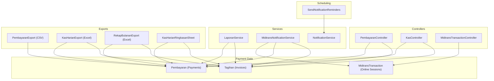
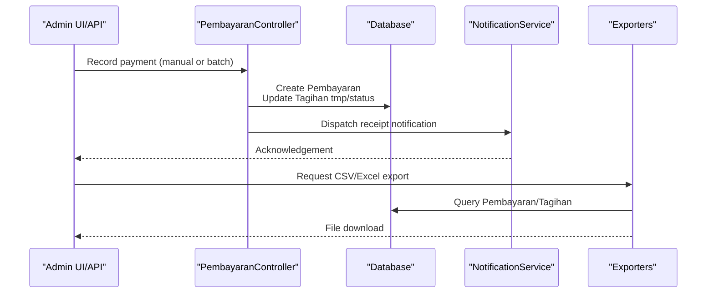
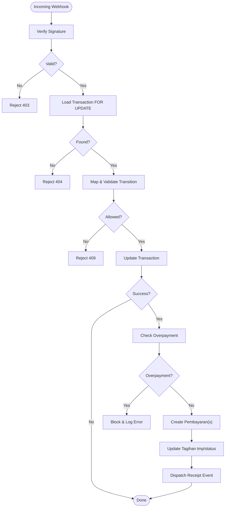
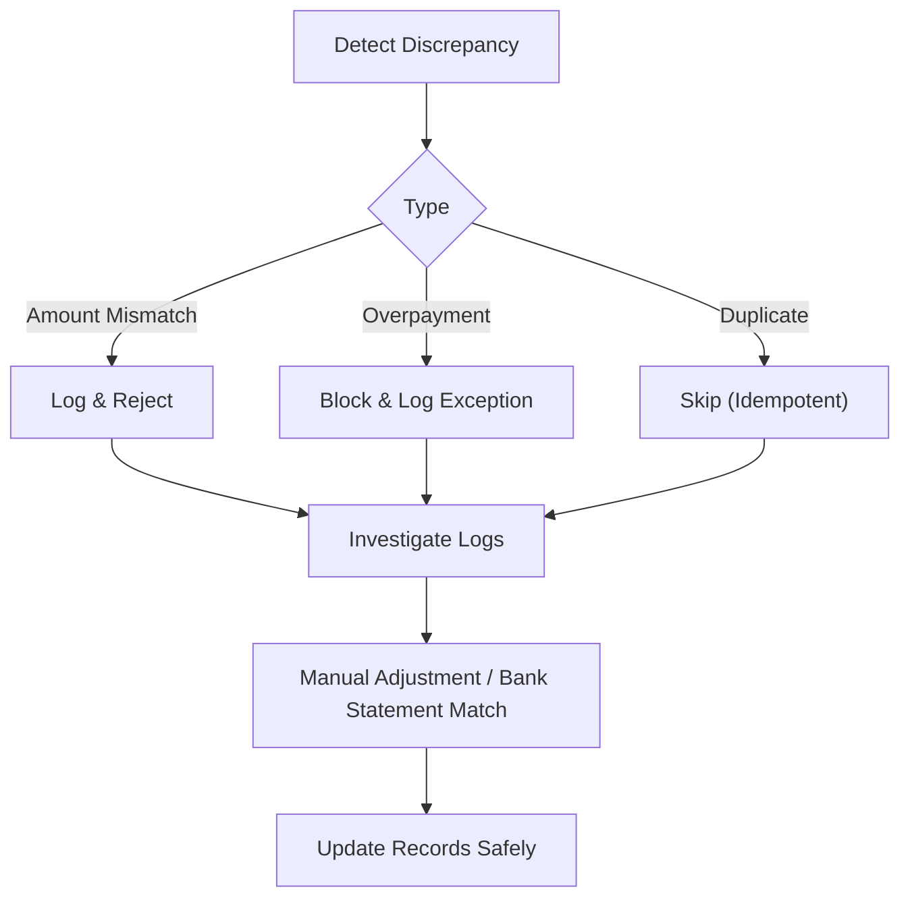
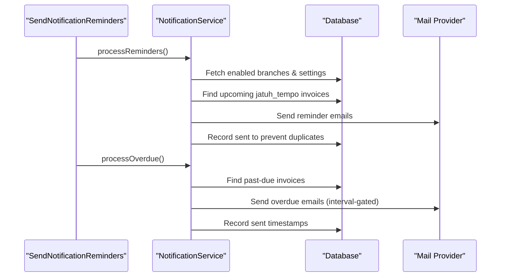
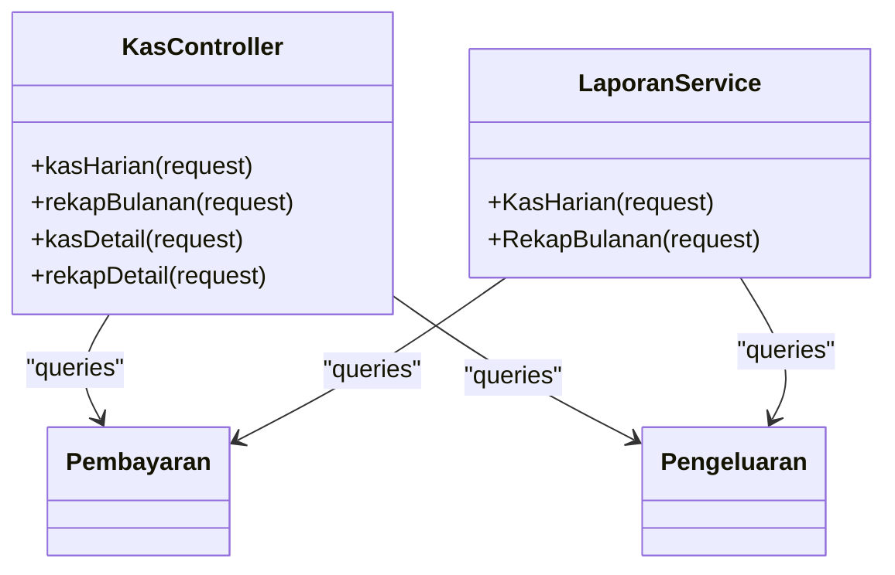
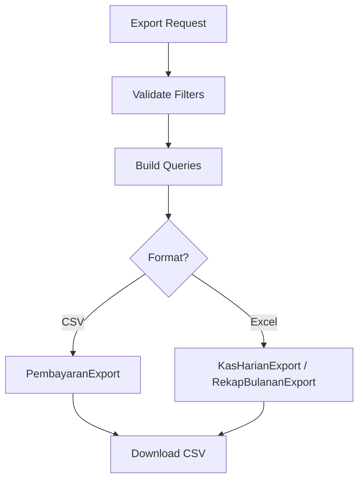
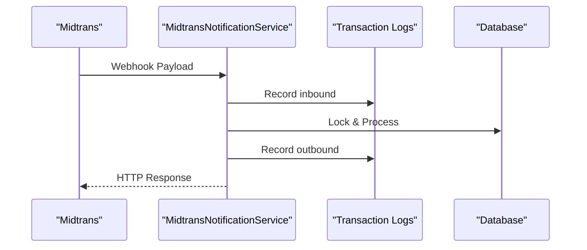
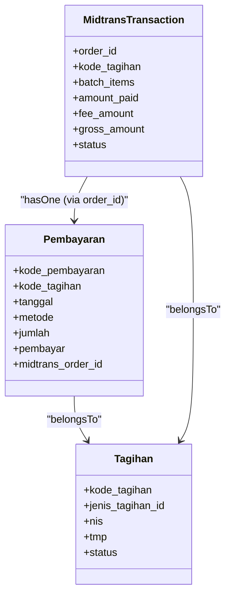

# Payment Reconciliation

<cite>
**Referenced Files in This Document**
- [Pembayaran.php](file://backend/app/Models/Pembayaran.php)
- [Tagihan.php](file://backend/app/Models/Tagihan.php)
- [MidtransTransaction.php](file://backend/app/Models/MidtransTransaction.php)
- [PembayaranController.php](file://backend/app/Controllers/PembayaranController.php)
- [KasController.php](file://backend/app/Controllers/KasController.php)
- [LaporanService.php](file://backend/app/Services/LaporanService.php)
- [MidtransNotificationService.php](file://backend/app/Services/Midtrans/MidtransNotificationService.php)
- [MidtransTransactionController.php](file://backend/app/Controllers/MidtransTransactionController.php)
- [SendNotificationReminders.php](file://backend/app/Console/Commands/SendNotificationReminders.php)
- [NotificationService.php](file://backend/app/Services/Notifications/NotificationService.php)
- [PembayaranExport.php](file://backend/app/Exports/PembayaranExport.php)
- [KasHarianExport.php](file://backend/app/Exports/KasHarianExport.php)
- [RekapBulananExport.php](file://backend/app/Exports/RekapBulananExport.php)
- [KasHarianRingkasanSheet.php](file://backend/app/Exports/Sheets/KasHarianRingkasanSheet.php)
- [ImportExportController.php](file://backend/app/Controllers/ImportExportController.php)
</cite>

## Table of Contents
1. Introduction
2. Project Structure
3. Core Components
4. Architecture Overview
5. Detailed Component Analysis
6. Dependency Analysis
7. Performance Considerations
8. Troubleshooting Guide
9. Conclusion

## Introduction
This document explains the payment reconciliation and financial reporting system. It covers how recorded payments are reconciled with actual bank statements, discrepancy detection and resolution workflows, payment status tracking, overdue identification, automated reminders, export capabilities (CSV and Excel), daily reconciliation reports, monthly summaries, audit trails, aging analysis, collection management, and compliance reporting.

The system supports:
- Manual and online payment recording
- Automated reconciliation via Midtrans webhooks
- Daily cashbook (Kas Harian) and monthly recap (Rekap Bulanan) reports
- Export to CSV and multi-sheet Excel for accounting integration
- Automated reminders and overdue notifications
- Audit trails for transactions and notifications

## Project Structure
Key modules involved in payment reconciliation and reporting:
- Models: Pembayaran (payments), Tagihan (invoices/bills), MidtransTransaction (online payment sessions)
- Controllers: PembayaranController (payment operations), KasController (reports), MidtransTransactionController (online payments)
- Services: LaporanService (reporting logic), MidtransNotificationService (webhook processing), NotificationService (reminders/overdue)
- Exports: PembayaranExport (CSV), KasHarianExport and RekapBulananExport (multi-sheet Excel), sheet classes
- Console Command: SendNotificationReminders (scheduled reminders/overdue)
- Import/Export Controller: ImportExportController (orchestrates exports and imports)

**Diagram sources**
- [Pembayaran.php:1-53](file://backend/app/Models/Pembayaran.php#L1-L53)
- [Tagihan.php:1-60](file://backend/app/Models/Tagihan.php#L1-L60)
- [MidtransTransaction.php:1-85](file://backend/app/Models/MidtransTransaction.php#L1-L85)
- [PembayaranController.php:1-496](file://backend/app/Controllers/PembayaranController.php#L1-L496)
- [KasController.php:1-334](file://backend/app/Controllers/KasController.php#L1-L334)
- [LaporanService.php:1-234](file://backend/app/Services/LaporanService.php#L1-L234)
- [MidtransNotificationService.php:1-284](file://backend/app/Services/Midtrans/MidtransNotificationService.php#L1-L284)
- [MidtransTransactionController.php:1-127](file://backend/app/Controllers/MidtransTransactionController.php#L1-L127)
- [SendNotificationReminders.php:1-25](file://backend/app/Console/Commands/SendNotificationReminders.php#L1-L25)
- [NotificationService.php:1-713](file://backend/app/Services/Notifications/NotificationService.php#L1-L713)
- [PembayaranExport.php:1-60](file://backend/app/Exports/PembayaranExport.php#L1-L60)
- [KasHarianExport.php:1-29](file://backend/app/Exports/KasHarianExport.php#L1-L29)
- [RekapBulananExport.php:1-29](file://backend/app/Exports/RekapBulananExport.php#L1-L29)
- [KasHarianRingkasanSheet.php:1-125](file://backend/app/Exports/Sheets/KasHarianRingkasanSheet.php#L1-L125)

**Section sources**
- [Pembayaran.php:1-53](file://backend/app/Models/Pembayaran.php#L1-L53)
- [Tagihan.php:1-60](file://backend/app/Models/Tagihan.php#L1-L60)
- [MidtransTransaction.php:1-85](file://backend/app/Models/MidtransTransaction.php#L1-L85)
- [PembayaranController.php:1-496](file://backend/app/Controllers/PembayaranController.php#L1-L496)
- [KasController.php:1-334](file://backend/app/Controllers/KasController.php#L1-L334)
- [LaporanService.php:1-234](file://backend/app/Services/LaporanService.php#L1-L234)
- [MidtransNotificationService.php:1-284](file://backend/app/Services/Midtrans/MidtransNotificationService.php#L1-L284)
- [MidtransTransactionController.php:1-127](file://backend/app/Controllers/MidtransTransactionController.php#L1-L127)
- [SendNotificationReminders.php:1-25](file://backend/app/Console/Commands/SendNotificationReminders.php#L1-L25)
- [NotificationService.php:1-713](file://backend/app/Services/Notifications/NotificationService.php#L1-L713)
- [PembayaranExport.php:1-60](file://backend/app/Exports/PembayaranExport.php#L1-L60)
- [KasHarianExport.php:1-29](file://backend/app/Exports/KasHarianExport.php#L1-L29)
- [RekapBulananExport.php:1-29](file://backend/app/Exports/RekapBulananExport.php#L1-L29)
- [KasHarianRingkasanSheet.php:1-125](file://backend/app/Exports/Sheets/KasHarianRingkasanSheet.php#L1-L125)

## Core Components
- Pembayaran (Payments): Stores individual payment records including amount, date, method, payer, and optional midtrans_order_id linking to online sessions.
- Tagihan (Invoices): Tracks invoice totals, accumulated payments (tmp), and status (e.g., paid/unpaid).
- MidtransTransaction: Represents online payment sessions, including batch items, amounts, fees, and lifecycle status.
- LaporanService: Computes daily and monthly financial summaries with running balances.
- KasController: Provides API endpoints for daily cashbook and monthly recap, plus detail views.
- MidtransNotificationService: Processes webhook payloads, validates signatures, enforces transitions, and records payments idempotently.
- NotificationService: Orchestrates reminder and overdue notifications with rate limiting, opt-out handling, and retry support.
- Exporters: Provide CSV and multi-sheet Excel outputs for payments and financial reports.

**Section sources**
- [Pembayaran.php:1-53](file://backend/app/Models/Pembayaran.php#L1-L53)
- [Tagihan.php:1-60](file://backend/app/Models/Tagihan.php#L1-L60)
- [MidtransTransaction.php:1-85](file://backend/app/Models/MidtransTransaction.php#L1-L85)
- [LaporanService.php:1-234](file://backend/app/Services/LaporanService.php#L1-L234)
- [KasController.php:1-334](file://backend/app/Controllers/KasController.php#L1-L334)
- [MidtransNotificationService.php:1-284](file://backend/app/Services/Midtrans/MidtransNotificationService.php#L1-L284)
- [NotificationService.php:1-713](file://backend/app/Services/Notifications/NotificationService.php#L1-L713)
- [PembayaranExport.php:1-60](file://backend/app/Exports/PembayaranExport.php#L1-L60)
- [KasHarianExport.php:1-29](file://backend/app/Exports/KasHarianExport.php#L1-L29)
- [RekapBulananExport.php:1-29](file://backend/app/Exports/RekapBulananExport.php#L1-L29)

## Architecture Overview
End-to-end flows for manual and online payments, reporting, and exports.

**Diagram sources**
- [PembayaranController.php:1-496](file://backend/app/Controllers/PembayaranController.php#L1-L496)
- [NotificationService.php:1-713](file://backend/app/Services/Notifications/NotificationService.php#L1-L713)
- [PembayaranExport.php:1-60](file://backend/app/Exports/PembayaranExport.php#L1-L60)
- [KasHarianExport.php:1-29](file://backend/app/Exports/KasHarianExport.php#L1-L29)
- [RekapBulananExport.php:1-29](file://backend/app/Exports/RekapBulananExport.php#L1-L29)

## Detailed Component Analysis

### Payment Recording and Status Tracking
- Manual payments:
  - Single payment endpoint creates a Pembayaran record, updates Tagihan tmp and status, and dispatches a receipt notification.
  - Batch payment endpoint performs multiple tagihan settlements within a single transaction, ensuring consistency.
  - Deletion guard prevents unsafe deletion of online payments without required permissions; adjusts Tagihan tmp/status accordingly.
- Online payments:
  - Initiation controller returns Snap token and metadata for portal use.
  - Webhook service verifies signature, maps statuses, enforces allowed transitions, and records Pembayaran idempotently.
  - Supports single and batch settlement; blocks overpayments and logs discrepancies.

**Diagram sources**
- [MidtransNotificationService.php:1-284](file://backend/app/Services/Midtrans/MidtransNotificationService.php#L1-L284)
- [MidtransTransaction.php:1-85](file://backend/app/Models/MidtransTransaction.php#L1-L85)
- [Pembayaran.php:1-53](file://backend/app/Models/Pembayaran.php#L1-L53)
- [Tagihan.php:1-60](file://backend/app/Models/Tagihan.php#L1-L60)

**Section sources**
- [PembayaranController.php:1-496](file://backend/app/Controllers/PembayaranController.php#L1-L496)
- [MidtransTransactionController.php:1-127](file://backend/app/Controllers/MidtransTransactionController.php#L1-L127)
- [MidtransNotificationService.php:1-284](file://backend/app/Services/Midtrans/MidtransNotificationService.php#L1-L284)

### Discrepancy Detection and Resolution Workflows
- Amount mismatch:
  - Webhook rejects if gross_amount does not match expected value; logs error details for investigation.
- Overpayment blocked:
  - System compares remaining balance against incoming amount; throws exception and logs when overpayment is attempted.
- Duplicate prevention:
  - Idempotent creation ensures same order_id does not create duplicate Pembayaran records.
- Resolution steps:
  - Investigate logs for rejected orders.
  - Adjust Tagihan tmp manually only after verifying external bank statement entries.
  - Use kas detail endpoints to drill down into specific dates/months.

**Diagram sources**
- [MidtransNotificationService.php:1-284](file://backend/app/Services/Midtrans/MidtransNotificationService.php#L1-L284)

**Section sources**
- [MidtransNotificationService.php:1-284](file://backend/app/Services/Midtrans/MidtransNotificationService.php#L1-L284)

### Automated Reminders and Overdue Notifications
- Scheduled command triggers reminder and overdue processing per branch settings.
- Reminder windows configurable by days before due date; deduplication via sent records.
- Overdue notifications respect configured intervals to avoid spamming.
- Rate limiting per branch and opt-out respected.

**Diagram sources**
- [SendNotificationReminders.php:1-25](file://backend/app/Console/Commands/SendNotificationReminders.php#L1-L25)
- [NotificationService.php:1-713](file://backend/app/Services/Notifications/NotificationService.php#L1-L713)

**Section sources**
- [SendNotificationReminders.php:1-25](file://backend/app/Console/Commands/SendNotificationReminders.php#L1-L25)
- [NotificationService.php:1-713](file://backend/app/Services/Notifications/NotificationService.php#L1-L713)

### Financial Reporting and Reconciliation Outputs
- Daily Cashbook (Kas Harian):
  - Aggregates pemasukan and pengeluaran per day with running global saldo.
  - Detail endpoint lists line items for a given date.
- Monthly Recap (Rekap Bulanan):
  - Aggregates monthly totals with cumulative saldo at month-end.
  - Detail endpoint lists line items for a given month/year.
- Reports also available via LaporanService for programmatic access.

**Diagram sources**
- [KasController.php:1-334](file://backend/app/Controllers/KasController.php#L1-L334)
- [LaporanService.php:1-234](file://backend/app/Services/LaporanService.php#L1-L234)

**Section sources**
- [KasController.php:1-334](file://backend/app/Controllers/KasController.php#L1-L334)
- [LaporanService.php:1-234](file://backend/app/Services/LaporanService.php#L1-L234)

### Export Functionality (CSV and Excel)
- PembayaranExport:
  - CSV export with headings for payment code, invoice code, student info, type, date, method, amount, payer.
  - Chunked reading for performance.
- KasHarianExport and RekapBulananExport:
  - Multi-sheet Excel with summary, income, and expense sheets.
  - Summary sheet includes per-day breakdown and totals.
- ImportExportController:
  - Orchestrates export requests, formats, and background job polling.

**Diagram sources**
- [PembayaranExport.php:1-60](file://backend/app/Exports/PembayaranExport.php#L1-L60)
- [KasHarianExport.php:1-29](file://backend/app/Exports/KasHarianExport.php#L1-L29)
- [RekapBulananExport.php:1-29](file://backend/app/Exports/RekapBulananExport.php#L1-L29)
- [KasHarianRingkasanSheet.php:1-125](file://backend/app/Exports/Sheets/KasHarianRingkasanSheet.php#L1-L125)
- [ImportExportController.php:1-316](file://backend/app/Controllers/ImportExportController.php#L1-L316)

**Section sources**
- [PembayaranExport.php:1-60](file://backend/app/Exports/PembayaranExport.php#L1-L60)
- [KasHarianExport.php:1-29](file://backend/app/Exports/KasHarianExport.php#L1-L29)
- [RekapBulananExport.php:1-29](file://backend/app/Exports/RekapBulananExport.php#L1-L29)
- [KasHarianRingkasanSheet.php:1-125](file://backend/app/Exports/Sheets/KasHarianRingkasanSheet.php#L1-L125)
- [ImportExportController.php:1-316](file://backend/app/Controllers/ImportExportController.php#L1-L316)

### Audit Trail Generation
- Midtrans transaction logs:
  - Inbound log captures raw payload and remote IP.
  - Outbound logs track state changes and responses.
- Notification logs:
  - Every send attempt is logged with status, reason, and errors.
- Payment deletion and adjustments:
  - Guardrails and exceptions provide clear failure points for auditing.

**Diagram sources**
- [MidtransNotificationService.php:1-284](file://backend/app/Services/Midtrans/MidtransNotificationService.php#L1-L284)
- [MidtransTransaction.php:1-85](file://backend/app/Models/MidtransTransaction.php#L1-L85)

**Section sources**
- [MidtransNotificationService.php:1-284](file://backend/app/Services/Midtrans/MidtransNotificationService.php#L1-L284)
- [NotificationService.php:1-713](file://backend/app/Services/Notifications/NotificationService.php#L1-L713)

### Payment Aging Analysis and Collection Management
- Aging buckets can be derived from Tagihan jatuh_tempo and current unpaid status.
- Use KasController detail endpoints to inspect unpaid invoices by date ranges.
- Combine with NotificationService’s overdue processing to prioritize collections.
- Export unpaid invoices via Tagihan export (supported by ImportExportController) for collection campaigns.

[No sources needed since this section provides general guidance]

### Examples of Reports
- Daily reconciliation report:
  - Use Kas Harian API to get daily totals and running saldo; export via KasHarianExport for detailed breakdown.
- Monthly summary:
  - Use Rekap Bulanan API to get monthly totals and cumulative saldo; export via RekapBulananExport.
- Audit trail:
  - Review Midtrans transaction logs and notification logs for all payment-related events.

**Section sources**
- [KasController.php:1-334](file://backend/app/Controllers/KasController.php#L1-L334)
- [KasHarianExport.php:1-29](file://backend/app/Exports/KasHarianExport.php#L1-L29)
- [RekapBulananExport.php:1-29](file://backend/app/Exports/RekapBulananExport.php#L1-L29)
- [MidtransNotificationService.php:1-284](file://backend/app/Services/Midtrans/MidtransNotificationService.php#L1-L284)
- [NotificationService.php:1-713](file://backend/app/Services/Notifications/NotificationService.php#L1-L713)

## Dependency Analysis
Core relationships between models and services:

**Diagram sources**
- [Pembayaran.php:1-53](file://backend/app/Models/Pembayaran.php#L1-L53)
- [Tagihan.php:1-60](file://backend/app/Models/Tagihan.php#L1-L60)
- [MidtransTransaction.php:1-85](file://backend/app/Models/MidtransTransaction.php#L1-L85)

**Section sources**
- [Pembayaran.php:1-53](file://backend/app/Models/Pembayaran.php#L1-L53)
- [Tagihan.php:1-60](file://backend/app/Models/Tagihan.php#L1-L60)
- [MidtransTransaction.php:1-85](file://backend/app/Models/MidtransTransaction.php#L1-L85)

## Performance Considerations
- Use chunked exports (chunkSize) for large datasets to reduce memory pressure.
- Prefer aggregated queries for daily/monthly summaries; avoid N+1 loads by eager-loading relationships where necessary.
- Leverage database indexes on frequently filtered columns (e.g., tanggal, branch_id, kode_tagihan).
- For high-volume webhooks, ensure lockForUpdate and short transactions to minimize contention.
- Schedule reminders/overdue jobs during off-peak hours to reduce load.

[No sources needed since this section provides general guidance]

## Troubleshooting Guide
Common issues and resolutions:
- Invalid signature on webhook:
  - Ensure server key configuration matches provider settings; check logs for rejection reasons.
- Amount mismatch:
  - Compare expected gross_amount with incoming payload; investigate initiation flow for rounding or fee differences.
- Overpayment blocked:
  - Verify Tagihan tmp and jenis_tagihan jumlah; adjust only after confirming bank statement alignment.
- Duplicate payments:
  - Confirm idempotency checks; review existing midtrans_order_id mappings.
- Missing notifications:
  - Check rate limits, opt-out settings, and email validity; use retryFailed to reprocess failed logs.

**Section sources**
- [MidtransNotificationService.php:1-284](file://backend/app/Services/Midtrans/MidtransNotificationService.php#L1-L284)
- [NotificationService.php:1-713](file://backend/app/Services/Notifications/NotificationService.php#L1-L713)

## Conclusion
The system provides robust mechanisms for recording payments, reconciling them with online providers, generating comprehensive financial reports, exporting data for accounting, and automating reminders and overdue notifications. Strong safeguards (signature verification, transition guards, overpayment blocking, idempotency) and extensive logging support reliable operations and compliance. Daily and monthly reports, along with detailed exports, enable effective reconciliation and auditability.