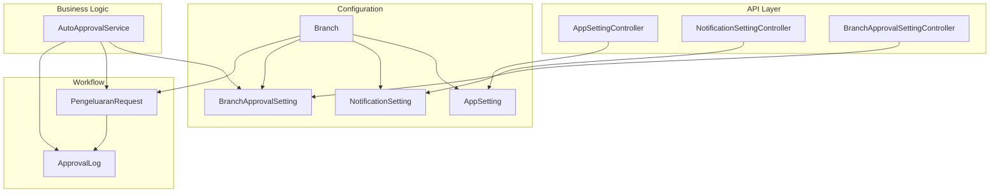
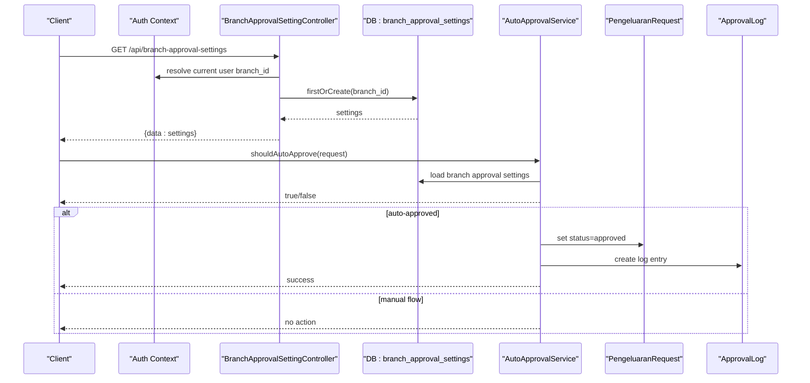
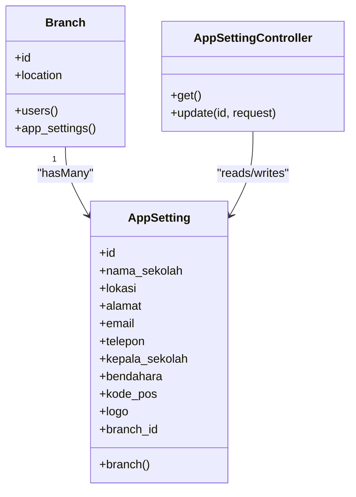
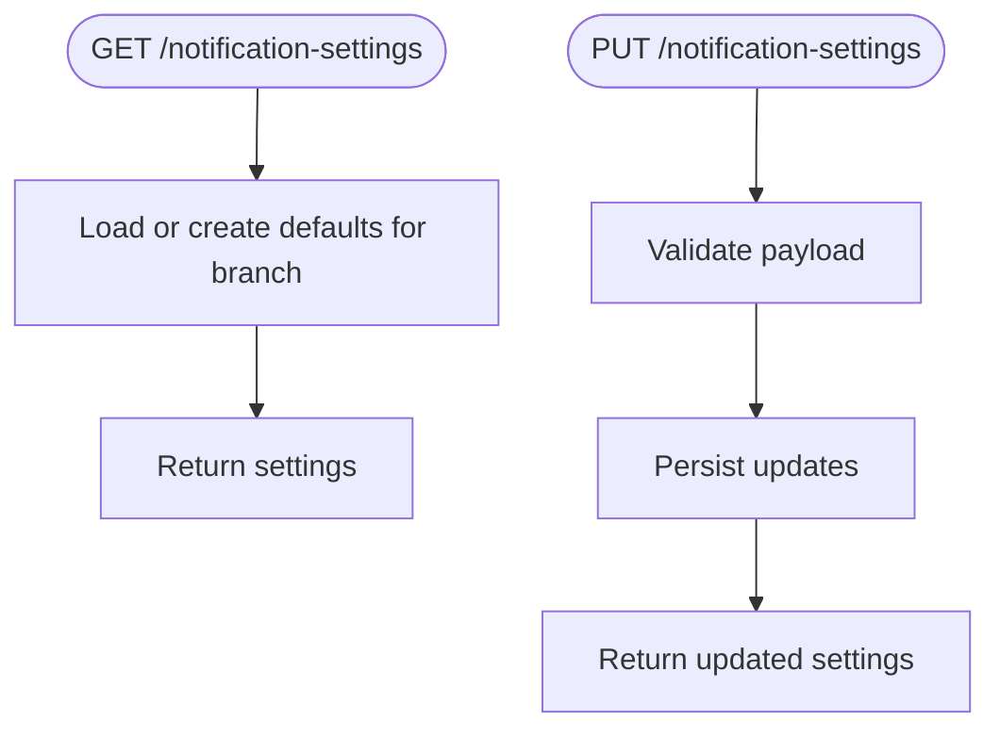
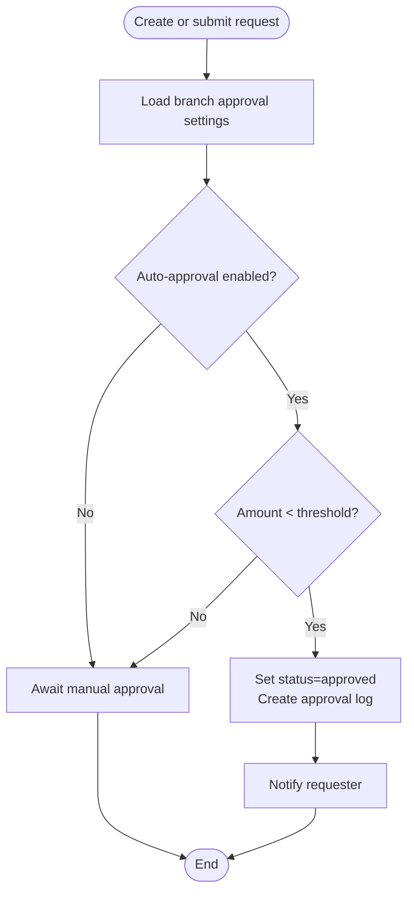
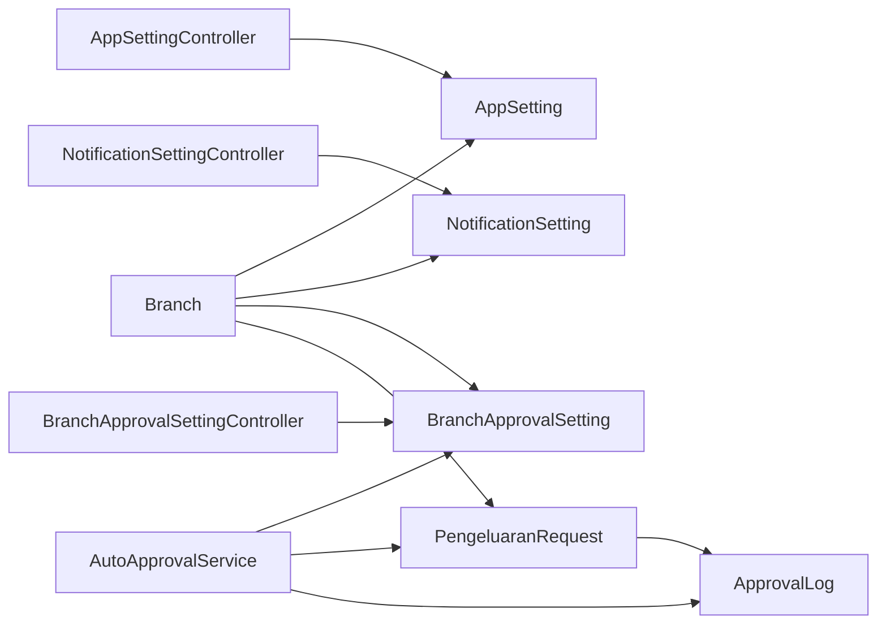
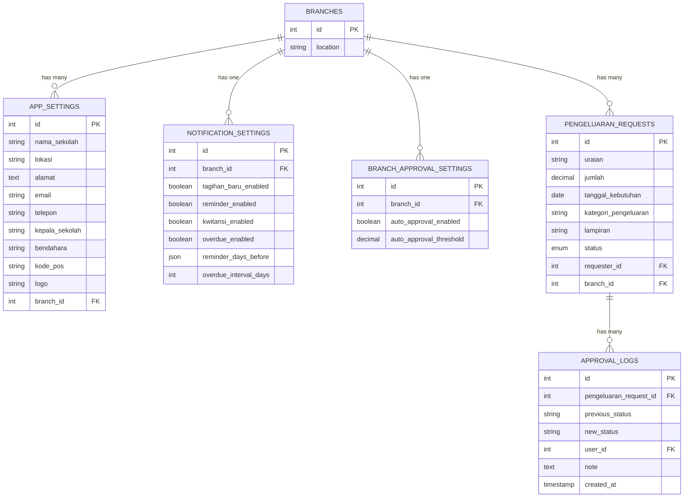

# System Configuration Tables

<cite>
**Referenced Files in This Document**
- [AppSetting.php](file://backend/app/Models/AppSetting.php)
- [Branch.php](file://backend/app/Models/Branch.php)
- [NotificationSetting.php](file://backend/app/Models/NotificationSetting.php)
- [BranchApprovalSetting.php](file://backend/app/Models/BranchApprovalSetting.php)
- [PengeluaranRequest.php](file://backend/app/Models/PengeluaranRequest.php)
- [ApprovalLog.php](file://backend/app/Models/ApprovalLog.php)
- [AppSettingController.php](file://backend/app/Http/Controllers/AppSettingController.php)
- [BranchApprovalSettingController.php](file://backend/app/Http/Controllers/BranchApprovalSettingController.php)
- [NotificationSettingController.php](file://backend/app/Http/Controllers/NotificationSettingController.php)
- [AutoApprovalService.php](file://backend/app/Services/AutoApprovalService.php)
- [2025_11_18_012716_create_app_settings_table.php](file://backend/database/migrations/2025_11_18_012716_create_app_settings_table.php)
- [2026_05_26_220002_create_branch_approval_settings_table.php](file://backend/database/migrations/2026_05_26_220002_create_branch_approval_settings_table.php)
- [2026_05_27_100100_create_notification_settings_table.php](file://backend/database/migrations/2026_05_27_100100_create_notification_settings_table.php)
- [2026_05_26_220000_create_pengeluaran_requests_table.php](file://backend/database/migrations/2026_05_26_220000_create_pengeluaran_requests_table.php)
- [2026_05_26_220001_create_approval_logs_table.php](file://backend/database/migrations/2026_05_26_220001_create_approval_logs_table.php)
</cite>

## Table of Contents
1. [Introduction](#introduction)
2. [Project Structure](#project-structure)
3. [Core Components](#core-components)
4. [Architecture Overview](#architecture-overview)
5. [Detailed Component Analysis](#detailed-component-analysis)
6. [Dependency Analysis](#dependency-analysis)
7. [Performance Considerations](#performance-considerations)
8. [Troubleshooting Guide](#troubleshooting-guide)
9. [Conclusion](#conclusion)
10. [Appendices](#appendices)

## Introduction
This document explains the system configuration and administrative tables that power multi-tenant behavior, flexible settings, notification preferences, and expense authorization workflows. It focuses on:
- App Settings for branch-scoped school information
- Branch Management as the tenant boundary
- Notification Settings for per-branch channel toggles and scheduling
- Approval Workflows for expense requests with optional auto-approval based on thresholds
It also shows how these components integrate with controllers and services to provide secure, role-aware access and programmatic APIs.

## Project Structure
The configuration and workflow features are implemented across models, migrations, controllers, and a service:
- Models define data structures and relationships (e.g., branch scoping)
- Migrations define schema and constraints
- Controllers expose API endpoints for reading/updating settings
- Services encapsulate business logic (e.g., auto-approval decisions)

**Diagram sources**
- [AppSetting.php:1-37](file://backend/app/Models/AppSetting.php#L1-L37)
- [Branch.php:1-64](file://backend/app/Models/Branch.php#L1-L64)
- [NotificationSetting.php:1-36](file://backend/app/Models/NotificationSetting.php#L1-L36)
- [BranchApprovalSetting.php:1-29](file://backend/app/Models/BranchApprovalSetting.php#L1-L29)
- [PengeluaranRequest.php:1-63](file://backend/app/Models/PengeluaranRequest.php#L1-L63)
- [ApprovalLog.php:1-37](file://backend/app/Models/ApprovalLog.php#L1-L37)
- [AppSettingController.php:1-72](file://backend/app/Http/Controllers/AppSettingController.php#L1-L72)
- [NotificationSettingController.php:1-47](file://backend/app/Http/Controllers/NotificationSettingController.php#L1-L47)
- [BranchApprovalSettingController.php:1-40](file://backend/app/Http/Controllers/BranchApprovalSettingController.php#L1-L40)
- [AutoApprovalService.php:1-44](file://backend/app/Services/AutoApprovalService.php#L1-L44)

**Section sources**
- [AppSetting.php:1-37](file://backend/app/Models/AppSetting.php#L1-L37)
- [Branch.php:1-64](file://backend/app/Models/Branch.php#L1-L64)
- [NotificationSetting.php:1-36](file://backend/app/Models/NotificationSetting.php#L1-L36)
- [BranchApprovalSetting.php:1-29](file://backend/app/Models/BranchApprovalSetting.php#L1-L29)
- [PengeluaranRequest.php:1-63](file://backend/app/Models/PengeluaranRequest.php#L1-L63)
- [ApprovalLog.php:1-37](file://backend/app/Models/ApprovalLog.php#L1-L37)
- [AppSettingController.php:1-72](file://backend/app/Http/Controllers/AppSettingController.php#L1-L72)
- [NotificationSettingController.php:1-47](file://backend/app/Http/Controllers/NotificationSettingController.php#L1-L47)
- [BranchApprovalSettingController.php:1-40](file://backend/app/Http/Controllers/BranchApprovalSettingController.php#L1-L40)
- [AutoApprovalService.php:1-44](file://backend/app/Services/AutoApprovalService.php#L1-L44)

## Core Components
- App Settings: Stores branch-specific school profile fields and logo path. Scoped by branch_id.
- Branch: The tenant root; all configuration and workflow entities are linked to a branch.
- Notification Settings: Per-branch toggles and schedules for notifications (new bills, reminders, receipts, overdue).
- Branch Approval Settings: Per-branch auto-approval policy including threshold.
- Expense Request and Approval Log: Track request lifecycle and audit trail.

Key behaviors:
- Multi-tenancy via branch_id foreign keys and controller-level scoping by authenticated user’s branch.
- Flexible settings via JSON columns (e.g., reminder_days_before) and boolean flags.
- Auto-approval decision logic isolated in a service for testability and reuse.

**Section sources**
- [AppSetting.php:1-37](file://backend/app/Models/AppSetting.php#L1-L37)
- [Branch.php:1-64](file://backend/app/Models/Branch.php#L1-L64)
- [NotificationSetting.php:1-36](file://backend/app/Models/NotificationSetting.php#L1-L36)
- [BranchApprovalSetting.php:1-29](file://backend/app/Models/BranchApprovalSetting.php#L1-L29)
- [PengeluaranRequest.php:1-63](file://backend/app/Models/PengeluaranRequest.php#L1-L63)
- [ApprovalLog.php:1-37](file://backend/app/Models/ApprovalLog.php#L1-L37)

## Architecture Overview
The configuration layer is organized around branches. Each branch has its own app settings, notification preferences, and approval policies. Controllers enforce branch scoping using the authenticated user’s branch context. Business rules like auto-approval are implemented in dedicated services.

**Diagram sources**
- [BranchApprovalSettingController.php:1-40](file://backend/app/Http/Controllers/BranchApprovalSettingController.php#L1-L40)
- [AutoApprovalService.php:1-44](file://backend/app/Services/AutoApprovalService.php#L1-L44)
- [PengeluaranRequest.php:1-63](file://backend/app/Models/PengeluaranRequest.php#L1-L63)
- [ApprovalLog.php:1-37](file://backend/app/Models/ApprovalLog.php#L1-L37)
- [2026_05_26_220002_create_branch_approval_settings_table.php:1-25](file://backend/database/migrations/2026_05_26_220002_create_branch_approval_settings_table.php#L1-L25)

## Detailed Component Analysis

### App Settings
Purpose:
- Store branch-specific school identity and contact details.
- Provide an API to read and update settings scoped to the authenticated user’s branch.

Data model highlights:
- Fields include school name, location, address, email, phone, principal, treasurer, postal code, logo, and branch_id.
- Relationship to Branch via belongsTo.

API behavior:
- Read endpoint returns settings for the current user’s branch.
- Update endpoint merges validated fields, handles logo file upload, persists branch_id from auth context, and returns updated resource.

**Diagram sources**
- [Branch.php:1-64](file://backend/app/Models/Branch.php#L1-L64)
- [AppSetting.php:1-37](file://backend/app/Models/AppSetting.php#L1-L37)
- [AppSettingController.php:1-72](file://backend/app/Http/Controllers/AppSettingController.php#L1-L72)

**Section sources**
- [AppSetting.php:1-37](file://backend/app/Models/AppSetting.php#L1-L37)
- [AppSettingController.php:1-72](file://backend/app/Http/Controllers/AppSettingController.php#L1-L72)
- [2025_11_18_012716_create_app_settings_table.php:1-36](file://backend/database/migrations/2025_11_18_012716_create_app_settings_table.php#L1-L36)

### Branch Management
Purpose:
- Acts as the tenant boundary. All configuration and workflow records are associated with a branch.

Relationships:
- One-to-many with users, students, classes, categories, charge types, charges, academic years, payments, expenses, and app settings.

Operational impact:
- Controllers use the authenticated user’s branch_id to scope queries and writes.
- Ensures strict isolation between branches.

**Section sources**
- [Branch.php:1-64](file://backend/app/Models/Branch.php#L1-L64)

### Notification Settings
Purpose:
- Manage per-branch notification preferences and schedules.

Key fields:
- Boolean toggles for new bill, reminder, receipt, and overdue notifications.
- JSON array for reminder days before due date.
- Integer for overdue interval days.

API behavior:
- Show endpoint ensures a default setting exists for the branch and returns it.
- Update endpoint validates input and persists changes.

**Diagram sources**
- [NotificationSettingController.php:1-47](file://backend/app/Http/Controllers/NotificationSettingController.php#L1-L47)
- [NotificationSetting.php:1-36](file://backend/app/Models/NotificationSetting.php#L1-L36)
- [2026_05_27_100100_create_notification_settings_table.php:1-35](file://backend/database/migrations/2026_05_27_100100_create_notification_settings_table.php#L1-L35)

**Section sources**
- [NotificationSetting.php:1-36](file://backend/app/Models/NotificationSetting.php#L1-L36)
- [NotificationSettingController.php:1-47](file://backend/app/Http/Controllers/NotificationSettingController.php#L1-L47)
- [2026_05_27_100100_create_notification_settings_table.php:1-35](file://backend/database/migrations/2026_05_27_100100_create_notification_settings_table.php#L1-L35)

### Approval Workflows (Expense Authorization)
Purpose:
- Control expense request lifecycle and optional automatic approvals based on branch policies.

Core tables:
- PengeluaranRequests: request details, amount, dates, category, attachment, status, requester, branch.
- ApprovalLogs: immutable audit trail of status transitions with actor and note.
- BranchApprovalSettings: per-branch auto-approval policy (enabled flag and threshold).

Process:
- Auto-approval decision checks branch settings and request amount against threshold.
- If approved automatically, status is updated and an audit log entry is created.

**Diagram sources**
- [AutoApprovalService.php:1-44](file://backend/app/Services/AutoApprovalService.php#L1-L44)
- [BranchApprovalSetting.php:1-29](file://backend/app/Models/BranchApprovalSetting.php#L1-L29)
- [PengeluaranRequest.php:1-63](file://backend/app/Models/PengeluaranRequest.php#L1-L63)
- [ApprovalLog.php:1-37](file://backend/app/Models/ApprovalLog.php#L1-L37)
- [2026_05_26_220000_create_pengeluaran_requests_table.php:1-33](file://backend/database/migrations/2026_05_26_220000_create_pengeluaran_requests_table.php#L1-L33)
- [2026_05_26_220001_create_approval_logs_table.php:1-29](file://backend/database/migrations/2026_05_26_220001_create_approval_logs_table.php#L1-L29)
- [2026_05_26_220002_create_branch_approval_settings_table.php:1-25](file://backend/database/migrations/2026_05_26_220002_create_branch_approval_settings_table.php#L1-L25)

**Section sources**
- [PengeluaranRequest.php:1-63](file://backend/app/Models/PengeluaranRequest.php#L1-L63)
- [ApprovalLog.php:1-37](file://backend/app/Models/ApprovalLog.php#L1-L37)
- [BranchApprovalSetting.php:1-29](file://backend/app/Models/BranchApprovalSetting.php#L1-L29)
- [AutoApprovalService.php:1-44](file://backend/app/Services/AutoApprovalService.php#L1-L44)
- [2026_05_26_220000_create_pengeluaran_requests_table.php:1-33](file://backend/database/migrations/2026_05_26_220000_create_pengeluaran_requests_table.php#L1-L33)
- [2026_05_26_220001_create_approval_logs_table.php:1-29](file://backend/database/migrations/2026_05_26_220001_create_approval_logs_table.php#L1-L29)
- [2026_05_26_220002_create_branch_approval_settings_table.php:1-25](file://backend/database/migrations/2026_05_26_220002_create_branch_approval_settings_table.php#L1-L25)

### Programmatic Access Examples
Note: These examples describe API usage patterns without embedding code.

- Accessing App Settings
  - Method: GET
  - Scope: Returns settings for the authenticated user’s branch.
  - Typical response: School profile fields and logo path.
  - Reference: [AppSettingController.get:17-33](file://backend/app/Http/Controllers/AppSettingController.php#L17-L33)

- Updating App Settings
  - Method: PUT/PATCH
  - Payload: Validated fields plus optional logo file.
  - Behavior: Updates non-file fields, replaces logo if provided, persists branch_id from auth context.
  - Reference: [AppSettingController.update:36-70](file://backend/app/Http/Controllers/AppSettingController.php#L36-L70)

- Managing Notification Preferences
  - Method: GET
  - Behavior: Ensures defaults exist for the branch and returns them.
  - Reference: [NotificationSettingController.show:12-27](file://backend/app/Http/Controllers/NotificationSettingController.php#L12-L27)
  - Method: PUT/PATCH
  - Behavior: Validates and persists updated preferences.
  - Reference: [NotificationSettingController.update:29-45](file://backend/app/Http/Controllers/NotificationSettingController.php#L29-L45)

- Configuring Approval Policies
  - Method: GET
  - Behavior: Returns branch approval settings, creating defaults if missing.
  - Reference: [BranchApprovalSettingController.show:11-21](file://backend/app/Http/Controllers/BranchApprovalSettingController.php#L11-L21)
  - Method: PUT/PATCH
  - Behavior: Validates and persists auto-approval policy.
  - Reference: [BranchApprovalSettingController.update:23-38](file://backend/app/Http/Controllers/BranchApprovalSettingController.php#L23-L38)

- Evaluating Auto-Approval
  - Service call: shouldAutoApprove(request)
  - Decision: Based on branch settings and request amount.
  - Side effects when approved: Status update and audit log creation.
  - Reference: [AutoApprovalService.shouldAutoApprove:12-23](file://backend/app/Services/AutoApprovalService.php#L12-L23), [AutoApprovalService.processAutoApproval:25-42](file://backend/app/Services/AutoApprovalService.php#L25-L42)

**Section sources**
- [AppSettingController.php:1-72](file://backend/app/Http/Controllers/AppSettingController.php#L1-L72)
- [NotificationSettingController.php:1-47](file://backend/app/Http/Controllers/NotificationSettingController.php#L1-L47)
- [BranchApprovalSettingController.php:1-40](file://backend/app/Http/Controllers/BranchApprovalSettingController.php#L1-L40)
- [AutoApprovalService.php:1-44](file://backend/app/Services/AutoApprovalService.php#L1-L44)

## Dependency Analysis
- Branch is the central tenant entity referenced by multiple configuration and workflow models.
- Controllers depend on models and rely on authentication context to enforce branch scoping.
- AutoApprovalService depends on BranchApprovalSetting and PengeluaranRequest, and creates ApprovalLog entries.

**Diagram sources**
- [Branch.php:1-64](file://backend/app/Models/Branch.php#L1-L64)
- [AppSetting.php:1-37](file://backend/app/Models/AppSetting.php#L1-L37)
- [NotificationSetting.php:1-36](file://backend/app/Models/NotificationSetting.php#L1-L36)
- [BranchApprovalSetting.php:1-29](file://backend/app/Models/BranchApprovalSetting.php#L1-L29)
- [PengeluaranRequest.php:1-63](file://backend/app/Models/PengeluaranRequest.php#L1-L63)
- [ApprovalLog.php:1-37](file://backend/app/Models/ApprovalLog.php#L1-L37)
- [AppSettingController.php:1-72](file://backend/app/Http/Controllers/AppSettingController.php#L1-L72)
- [NotificationSettingController.php:1-47](file://backend/app/Http/Controllers/NotificationSettingController.php#L1-L47)
- [BranchApprovalSettingController.php:1-40](file://backend/app/Http/Controllers/BranchApprovalSettingController.php#L1-L40)
- [AutoApprovalService.php:1-44](file://backend/app/Services/AutoApprovalService.php#L1-L44)

**Section sources**
- [Branch.php:1-64](file://backend/app/Models/Branch.php#L1-L64)
- [AppSetting.php:1-37](file://backend/app/Models/AppSetting.php#L1-L37)
- [NotificationSetting.php:1-36](file://backend/app/Models/NotificationSetting.php#L1-L36)
- [BranchApprovalSetting.php:1-29](file://backend/app/Models/BranchApprovalSetting.php#L1-L29)
- [PengeluaranRequest.php:1-63](file://backend/app/Models/PengeluaranRequest.php#L1-L63)
- [ApprovalLog.php:1-37](file://backend/app/Models/ApprovalLog.php#L1-L37)
- [AppSettingController.php:1-72](file://backend/app/Http/Controllers/AppSettingController.php#L1-L72)
- [NotificationSettingController.php:1-47](file://backend/app/Http/Controllers/NotificationSettingController.php#L1-L47)
- [BranchApprovalSettingController.php:1-40](file://backend/app/Http/Controllers/BranchApprovalSettingController.php#L1-L40)
- [AutoApprovalService.php:1-44](file://backend/app/Services/AutoApprovalService.php#L1-L44)

## Performance Considerations
- Use unique constraints on branch-scoped settings (e.g., one notification setting per branch) to avoid duplicates and simplify lookups.
- Index frequently filtered columns such as branch_id and status in workflow tables to speed up queries.
- Prefer firstOrCreate/updateOrCreate in controllers to reduce extra reads and race conditions.
- Cache frequently accessed branch settings at the application level if needed, with invalidation on updates.

[No sources needed since this section provides general guidance]

## Troubleshooting Guide
Common issues and resolutions:
- Missing App Settings for a branch
  - Symptom: 404 when retrieving settings.
  - Cause: No record exists for the current branch.
  - Resolution: Ensure a record exists or adjust the controller to create defaults similar to other settings.
  - Reference: [AppSettingController.get:17-33](file://backend/app/Http/Controllers/AppSettingController.php#L17-L33)

- Logo upload not persisting
  - Symptom: Logo field remains unchanged after update.
  - Cause: File not present or storage disk misconfiguration.
  - Resolution: Verify file presence and public storage disk configuration; ensure old files are cleaned up correctly.
  - Reference: [AppSettingController.update:54-64](file://backend/app/Http/Controllers/AppSettingController.php#L54-L64)

- Auto-approval not triggering
  - Symptom: Requests remain in submitted state.
  - Causes: Auto-approval disabled, threshold zero or less, or amount exceeds threshold.
  - Resolution: Enable auto-approval and set a positive threshold; verify request amount.
  - Reference: [AutoApprovalService.shouldAutoApprove:12-23](file://backend/app/Services/AutoApprovalService.php#L12-L23)

- Audit logs missing
  - Symptom: No approval history for a request.
  - Cause: Auto-approval path not executed or logging step skipped.
  - Resolution: Ensure processAutoApproval is invoked on successful auto-approval.
  - Reference: [AutoApprovalService.processAutoApproval:25-42](file://backend/app/Services/AutoApprovalService.php#L25-L42)

**Section sources**
- [AppSettingController.php:1-72](file://backend/app/Http/Controllers/AppSettingController.php#L1-L72)
- [AutoApprovalService.php:1-44](file://backend/app/Services/AutoApprovalService.php#L1-L44)

## Conclusion
The configuration and workflow subsystem leverages branch-scoped tables to implement multi-tenancy and role-based access control. Flexible settings are supported through typed casts and JSON fields. Controllers enforce scoping via the authenticated user’s branch, while services encapsulate complex decisions like auto-approval. This design promotes clarity, maintainability, and extensibility for future configuration needs.

[No sources needed since this section summarizes without analyzing specific files]

## Appendices

### Data Model Summary

**Diagram sources**
- [2025_11_18_012716_create_app_settings_table.php:1-36](file://backend/database/migrations/2025_11_18_012716_create_app_settings_table.php#L1-L36)
- [2026_05_27_100100_create_notification_settings_table.php:1-35](file://backend/database/migrations/2026_05_27_100100_create_notification_settings_table.php#L1-L35)
- [2026_05_26_220002_create_branch_approval_settings_table.php:1-25](file://backend/database/migrations/2026_05_26_220002_create_branch_approval_settings_table.php#L1-L25)
- [2026_05_26_220000_create_pengeluaran_requests_table.php:1-33](file://backend/database/migrations/2026_05_26_220000_create_pengeluaran_requests_table.php#L1-L33)
- [2026_05_26_220001_create_approval_logs_table.php:1-29](file://backend/database/migrations/2026_05_26_220001_create_approval_logs_table.php#L1-L29)