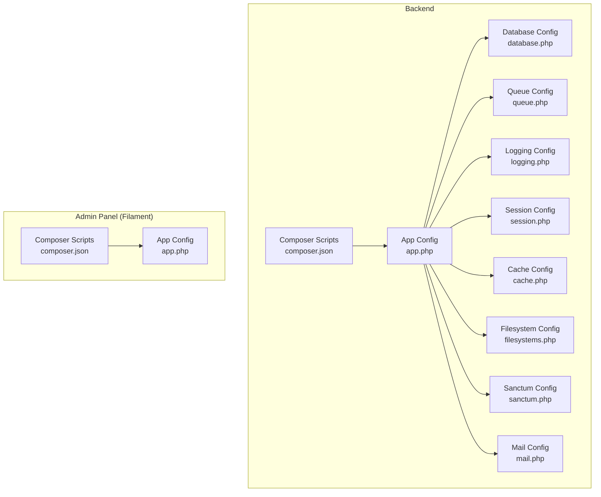
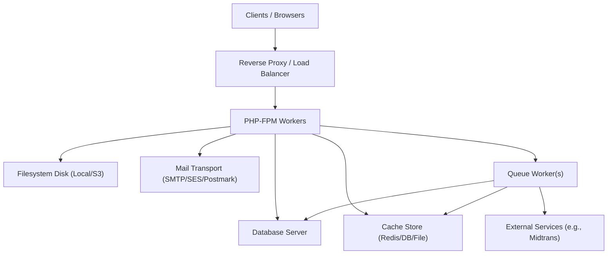
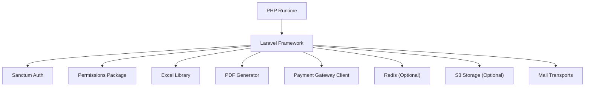

# Deployment & DevOps

<cite>
**Referenced Files in This Document**
- [backend/config/app.php](file://backend/config/app.php)
- [backend/config/database.php](file://backend/config/database.php)
- [backend/config/queue.php](file://backend/config/queue.php)
- [backend/config/logging.php](file://backend/config/logging.php)
- [backend/config/session.php](file://backend/config/session.php)
- [backend/config/cache.php](file://backend/config/cache.php)
- [backend/config/filesystems.php](file://backend/config/filesystems.php)
- [backend/config/sanctum.php](file://backend/config/sanctum.php)
- [backend/config/mail.php](file://backend/config/mail.php)
- [backend/composer.json](file://backend/composer.json)
- [frontend-v2/config/app.php](file://frontend-v2/config/app.php)
- [frontend-v2/composer.json](file://frontend-v2/composer.json)
</cite>

## Table of Contents
1. Introduction
2. Project Structure
3. Core Components
4. Architecture Overview
5. Detailed Component Analysis
6. Dependency Analysis
7. Performance Considerations
8. Troubleshooting Guide
9. Conclusion
10. Appendices

## Introduction
This document provides comprehensive deployment and DevOps guidance for the Handayani system, focusing on production configuration, environment variables, database optimization, queue workers, monitoring and logging, error tracking, performance profiling, containerization strategies, infrastructure requirements, SSL and secrets management, backup and disaster recovery, scaling, maintenance tasks, security hardening, vulnerability scanning, and compliance considerations for educational data protection.

The backend is a Laravel application with multiple configurable subsystems (database, cache, sessions, queues, mail, filesystems, authentication). The admin panel is implemented using Filament within a separate Laravel project under frontend-v2. Both projects are PHP 8.2+ based and rely on environment-driven configuration.

## Project Structure
At a high level:
- Backend API and services live under backend/.
- Admin panel (Filament-based) lives under frontend-v2/.
- Configuration files are centralized in each project’s config/ directory and driven by environment variables.
- Composer scripts define common setup and development workflows.

**Diagram sources**
- [backend/config/app.php:1-127](file://backend/config/app.php#L1-L127)
- [backend/config/database.php:1-184](file://backend/config/database.php#L1-L184)
- [backend/config/queue.php:1-130](file://backend/config/queue.php#L1-L130)
- [backend/config/logging.php:1-133](file://backend/config/logging.php#L1-L133)
- [backend/config/session.php:1-218](file://backend/config/session.php#L1-L218)
- [backend/config/cache.php:1-118](file://backend/config/cache.php#L1-L118)
- [backend/config/filesystems.php:1-81](file://backend/config/filesystems.php#L1-L81)
- [backend/config/sanctum.php:1-85](file://backend/config/sanctum.php#L1-L85)
- [backend/config/mail.php:1-119](file://backend/config/mail.php#L1-L119)
- [backend/composer.json:1-97](file://backend/composer.json#L1-L97)
- [frontend-v2/config/app.php:1-127](file://frontend-v2/config/app.php#L1-L127)
- [frontend-v2/composer.json:1-94](file://frontend-v2/composer.json#L1-L94)

**Section sources**
- [backend/config/app.php:1-127](file://backend/config/app.php#L1-L127)
- [backend/composer.json:1-97](file://backend/composer.json#L1-L97)
- [frontend-v2/config/app.php:1-127](file://frontend-v2/config/app.php#L1-L127)
- [frontend-v2/composer.json:1-94](file://frontend-v2/composer.json#L1-L94)

## Core Components
Production-ready configuration centers around these components:
- Application runtime settings (environment, URL, timezone, locale, encryption key, maintenance mode)
- Database connectivity and Redis integration
- Queue processing (database, Redis, SQS, Beanstalkd)
- Logging channels (stack, daily, stderr, syslog, Slack, Papertrail)
- Session storage (database, Redis)
- Cache stores (database, file, Redis, Memcached, DynamoDB)
- Filesystem disks (local/public/S3)
- Authentication (Sanctum stateful domains and token prefix)
- Mail transport (SMTP, SES, Postmark, Resend, log)

Key environment variables to configure per environment include APP_NAME, APP_ENV, APP_URL, APP_DEBUG, APP_KEY, APP_PREVIOUS_KEYS, APP_LOCALE, APP_FALLBACK_LOCALE, APP_FAKER_LOCALE, DB_* (connection, host, port, database, username, password, charset, collation), REDIS_* (client, host, port, username, password, db, cluster, prefix, backoff), QUEUE_CONNECTION and related queue options, LOG_CHANNEL, LOG_LEVEL, SESSION_DRIVER, CACHE_STORE, FILESYSTEM_DISK, SANCTUM_STATEFUL_DOMAINS, MAIL_* (mailer, host, port, username, password, scheme, url), AWS_* (for S3/DynamoDB/SQS), and others as needed.

Operational notes:
- Ensure APP_KEY is set and unique per environment.
- Keep APP_DEBUG disabled in production.
- Use persistent cache and session backends (Redis or database) for multi-process deployments.
- Configure queue workers to use appropriate retry_after values relative to job durations.
- Centralize logs via stack channel and forward to external systems if required.

**Section sources**
- [backend/config/app.php:1-127](file://backend/config/app.php#L1-L127)
- [backend/config/database.php:1-184](file://backend/config/database.php#L1-L184)
- [backend/config/queue.php:1-130](file://backend/config/queue.php#L1-L130)
- [backend/config/logging.php:1-133](file://backend/config/logging.php#L1-L133)
- [backend/config/session.php:1-218](file://backend/config/session.php#L1-L218)
- [backend/config/cache.php:1-118](file://backend/config/cache.php#L1-L118)
- [backend/config/filesystems.php:1-81](file://backend/config/filesystems.php#L1-L81)
- [backend/config/sanctum.php:1-85](file://backend/config/sanctum.php#L1-L85)
- [backend/config/mail.php:1-119](file://backend/config/mail.php#L1-L119)

## Architecture Overview
The production architecture typically includes:
- Web server (Nginx/Apache) terminating TLS and proxying to PHP-FPM
- Multiple PHP-FPM worker processes
- One or more queue workers (supervised by systemd or supervisor)
- Database (MySQL/MariaDB/PostgreSQL)
- Optional Redis for cache, sessions, and queues
- Object storage (S3-compatible) for public assets
- Centralized logging pipeline (syslog/stdout to collector)

[No sources needed since this diagram shows conceptual workflow, not actual code structure]

## Detailed Component Analysis

### Production Environment Variables and App Settings
- APP_ENV controls environment-specific behavior.
- APP_URL must reflect the production domain.
- APP_DEBUG should be false in production.
- APP_KEY must be generated and kept secret.
- APP_PREVIOUS_KEYS supports key rotation without breaking existing encrypted data.
- Timezone and locale are configured centrally.

Recommended production values:
- APP_ENV=production
- APP_DEBUG=false
- APP_URL=https://your-domain
- APP_KEY=<generated-key>
- APP_PREVIOUS_KEYS=<previous-keys-if-any>
- APP_LOCALE=id (or your target locale)
- APP_FALLBACK_LOCALE=id

**Section sources**
- [backend/config/app.php:1-127](file://backend/config/app.php#L1-L127)
- [frontend-v2/config/app.php:1-127](file://frontend-v2/config/app.php#L1-L127)

### Database Configuration and Optimization
Supported drivers include sqlite, mysql/mariadb, pgsql, sqlsrv. For production, prefer MySQL/MariaDB or PostgreSQL.

Key variables:
- DB_CONNECTION=mysql|pgsql
- DB_HOST, DB_PORT, DB_DATABASE, DB_USERNAME, DB_PASSWORD
- DB_CHARSET, DB_COLLATION (for MySQL)
- MYSQL_ATTR_SSL_CA (optional for MySQL SSL)
- PGSQL sslmode (prefer or require)

Optimization tips:
- Tune connection pooling at the database layer.
- Enable query caching where applicable.
- Use read replicas for heavy reporting workloads.
- Ensure proper indexing strategy aligned with migrations and queries.
- Set DB_FOREIGN_KEYS=true for data integrity.

**Section sources**
- [backend/config/database.php:1-184](file://backend/config/database.php#L1-L184)

### Queue Workers Setup
Default queue driver is database; alternatives include redis, sqs, beanstalkd.

Key variables:
- QUEUE_CONNECTION=database|redis|sqs|beanstalkd
- DB_QUEUE_TABLE, DB_QUEUE_RETRY_AFTER
- REDIS_QUEUE, REDIS_QUEUE_RETRY_AFTER
- SQS_* for Amazon SQS
- BEANSTALKD_* for Beanstalkd

Worker process management:
- Use systemd or supervisor to run php artisan queue:work or queue:listen with appropriate --tries and --timeout flags.
- Align retry_after with maximum job execution time.
- Monitor failed_jobs table or configured failed driver.

Batching:
- Job batching uses a dedicated database and table (job_batches).

**Section sources**
- [backend/config/queue.php:1-130](file://backend/config/queue.php#L1-L130)

### Logging and Monitoring
Channels available: single, daily, slack, papertrail, stderr, syslog, errorlog, null, emergency. Default is stack which composes multiple channels.

Key variables:
- LOG_CHANNEL=stack|daily|stderr|syslog|slack|papertrail
- LOG_LEVEL=info|debug|warning|error|critical
- LOG_STACK=comma-separated list of channels
- LOG_DAILY_DAYS for rotation
- LOG_SLACK_WEBHOOK_URL for Slack alerts
- PAPERTRAIL_URL/PAPERTRAIL_PORT for remote syslog

Recommendations:
- Use daily or stack with stderr/syslog for containerized environments.
- Forward logs to a central collector (e.g., CloudWatch, Datadog, ELK).
- Avoid debug-level logging in production unless necessary.

**Section sources**
- [backend/config/logging.php:1-133](file://backend/config/logging.php#L1-L133)

### Sessions and Caching
Sessions:
- Driver can be database or redis.
- For multi-process deployments, prefer redis or database-backed sessions.
- Control lifetime, cookie attributes (secure, http_only, same_site).

Caching:
- Stores include database, file, memcached, redis, dynamodb, octane.
- Use redis or memcached for high-performance caching.
- Prefix keys per app name to avoid collisions.

Key variables:
- SESSION_DRIVER, SESSION_LIFETIME, SESSION_SECURE_COOKIE, SESSION_HTTP_ONLY, SESSION_SAME_SITE
- CACHE_STORE, REDIS_CACHE_CONNECTION, MEMCACHED_*

**Section sources**
- [backend/config/session.php:1-218](file://backend/config/session.php#L1-L218)
- [backend/config/cache.php:1-118](file://backend/config/cache.php#L1-L118)

### Filesystem Disks and Storage
Disks:
- local/private and public for local storage
- s3 for cloud object storage

Key variables:
- FILESYSTEM_DISK=local|s3
- AWS_ACCESS_KEY_ID, AWS_SECRET_ACCESS_KEY, AWS_DEFAULT_REGION, AWS_BUCKET, AWS_URL, AWS_ENDPOINT

Operational steps:
- Create symbolic link from public/storage to storage/app/public.
- For S3, ensure IAM permissions and bucket policies allow public reads if needed.

**Section sources**
- [backend/config/filesystems.php:1-81](file://backend/config/filesystems.php#L1-L81)

### Authentication (Sanctum)
Stateful domains control SPA cookie-based auth. Token prefix helps prevent accidental commits of tokens.

Key variables:
- SANCTUM_STATEFUL_DOMAINS (comma-separated)
- SANCTUM_TOKEN_PREFIX (optional)

Security note:
- Restrict stateful domains to trusted origins only.
- Enforce HTTPS and secure cookies.

**Section sources**
- [backend/config/sanctum.php:1-85](file://backend/config/sanctum.php#L1-L85)

### Mail Configuration
Transports include SMTP, SES, Postmark, Resend, sendmail, log.

Key variables:
- MAIL_MAILER=smtp|ses|postmark|resend|sendmail|log
- MAIL_HOST, MAIL_PORT, MAIL_USERNAME, MAIL_PASSWORD, MAIL_SCHEME, MAIL_URL
- MAIL_FROM_ADDRESS, MAIL_FROM_NAME

Recommendations:
- Use transactional email providers (SES/Postmark) for reliability and deliverability.
- Route test emails to log channel during development.

**Section sources**
- [backend/config/mail.php:1-119](file://backend/config/mail.php#L1-L119)

### Composer Scripts and Build Process
Common scripts:
- setup: install dependencies, generate key, migrate, build assets
- dev: concurrently start server, queue listener, asset watcher
- post-update-cmd: publish assets
- post-root-package-install: copy .env.example and generate key

These scripts streamline deployment and development workflows.

**Section sources**
- [backend/composer.json:1-97](file://backend/composer.json#L1-L97)
- [frontend-v2/composer.json:1-94](file://frontend-v2/composer.json#L1-L94)

## Dependency Analysis
Runtime dependencies and integrations:
- PHP 8.2+
- Laravel framework
- Sanctum for API/session auth
- Excel and PDF generation libraries
- Permission package for role-based access
- Payment gateway client (Midtrans)
- Optional Redis, S3, SES, Postmark

**Diagram sources**
- [backend/composer.json:1-97](file://backend/composer.json#L1-L97)
- [frontend-v2/composer.json:1-94](file://frontend-v2/composer.json#L1-L94)

**Section sources**
- [backend/composer.json:1-97](file://backend/composer.json#L1-L97)
- [frontend-v2/composer.json:1-94](file://frontend-v2/composer.json#L1-L94)

## Performance Considerations
- Use Redis for cache and sessions to reduce database load.
- Prefer database-backed queues with adequate retry_after and worker concurrency.
- Enable opcode caching (OPcache) and tune PHP-FPM pm settings.
- Offload static assets to CDN and leverage browser caching.
- Use S3 for large file uploads/downloads to avoid disk I/O bottlenecks.
- Optimize database indexes and consider read replicas for reporting.
- Centralize logs and avoid excessive debug logging in production.

[No sources needed since this section provides general guidance]

## Troubleshooting Guide
Common issues and checks:
- Verify APP_KEY is set and valid; invalid keys cause decryption failures.
- Confirm database connectivity and credentials; check DB_* variables.
- Ensure queue tables exist (jobs, failed_jobs, job_batches) and workers are running.
- Validate log channel configuration and storage paths.
- Check session store availability and permissions.
- Review mail transport connectivity and credentials.
- Inspect failed jobs and reprocess or delete as appropriate.

Operational commands:
- Clear caches and configs when changing environment variables.
- Rebuild assets after updates.
- Monitor queue worker health and restart on failure.

**Section sources**
- [backend/config/app.php:1-127](file://backend/config/app.php#L1-L127)
- [backend/config/database.php:1-184](file://backend/config/database.php#L1-L184)
- [backend/config/queue.php:1-130](file://backend/config/queue.php#L1-L130)
- [backend/config/logging.php:1-133](file://backend/config/logging.php#L1-L133)
- [backend/config/session.php:1-218](file://backend/config/session.php#L1-L218)
- [backend/config/cache.php:1-118](file://backend/config/cache.php#L1-L118)
- [backend/config/filesystems.php:1-81](file://backend/config/filesystems.php#L1-L81)
- [backend/config/mail.php:1-119](file://backend/config/mail.php#L1-L119)

## Conclusion
Handayani’s production readiness hinges on correct environment configuration, robust queue processing, centralized logging, secure authentication, and scalable storage and caching. By following the guidelines above—especially around environment variables, worker supervision, SSL termination, secrets management, backups, and security hardening—you can deploy a reliable, maintainable, and compliant system suitable for educational data protection.

[No sources needed since this section summarizes without analyzing specific files]

## Appendices

### Practical Production Setup Examples

#### Infrastructure Requirements
- PHP 8.2+ with OPcache enabled
- Web server (Nginx/Apache) with PHP-FPM
- Database (MySQL/MariaDB or PostgreSQL)
- Optional Redis for cache, sessions, queues
- Optional S3-compatible storage
- Optional external logging aggregator

#### SSL Certificates
- Terminate TLS at reverse proxy (Nginx/Apache)
- Use automated certificate management (e.g., Let’s Encrypt)
- Redirect HTTP to HTTPS and enforce HSTS

#### Secrets Management
- Store sensitive values in environment variables or a secrets manager
- Never commit .env files to version control
- Rotate APP_KEY and previous keys carefully

#### Backup and Disaster Recovery
- Schedule regular database dumps and offsite replication
- Back up object storage buckets and local storage volumes
- Test restore procedures periodically
- Maintain documented RTO/RPO targets

#### Scaling Strategies
- Horizontal scaling of PHP-FPM workers behind a load balancer
- Separate queue workers into their own processes/nodes
- Scale database vertically or add read replicas
- Use Redis clusters for high-throughput caching and queuing

#### Maintenance Tasks
- Periodic dependency updates and security patches
- Asset rebuilds after updates
- Log rotation and retention policy enforcement
- Queue backlog monitoring and dead-letter handling
- Database index and statistics maintenance

#### Security Hardening and Compliance
- Disable debug mode and restrict error exposure
- Enforce HTTPS and secure cookies
- Apply least-privilege principles for database and storage accounts
- Implement input validation and CSRF protections
- Conduct vulnerability scanning and penetration testing
- Align with educational data protection standards (e.g., FERPA/GDPR-like practices)

[No sources needed since this section provides general guidance]