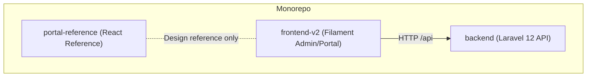
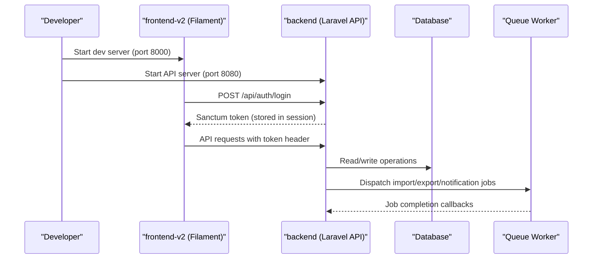
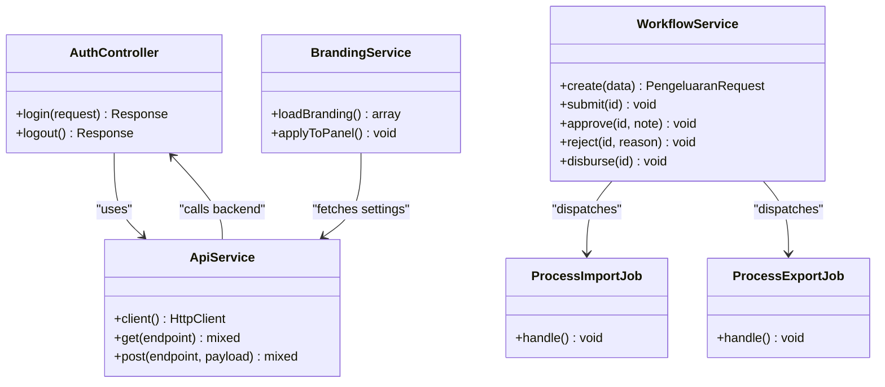
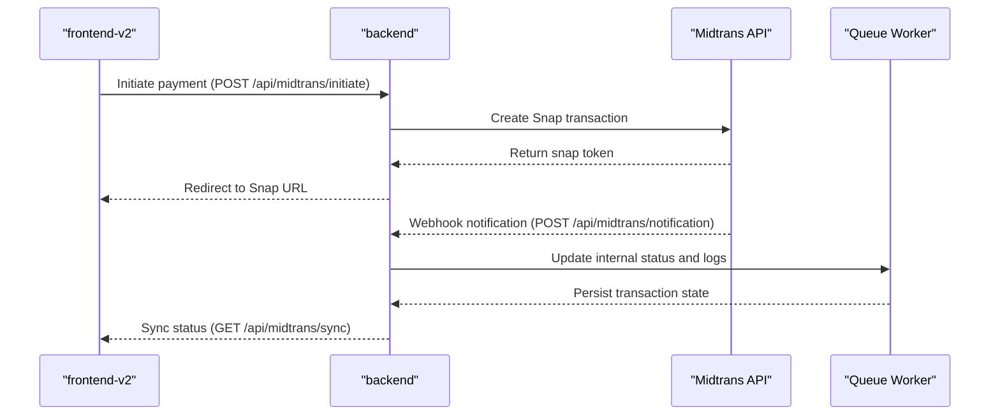
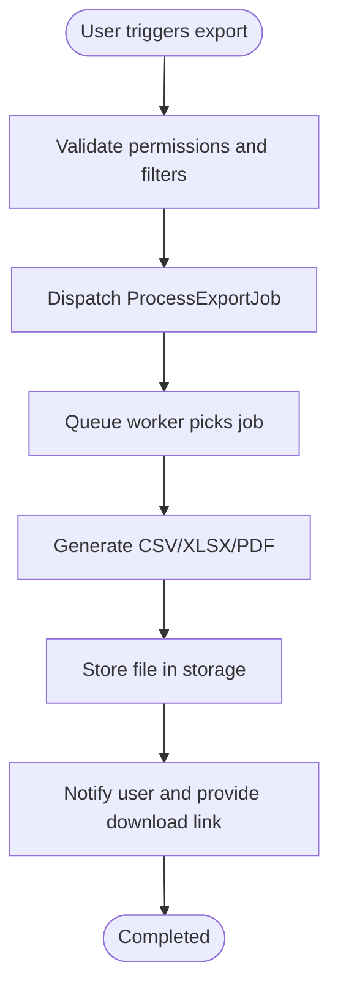
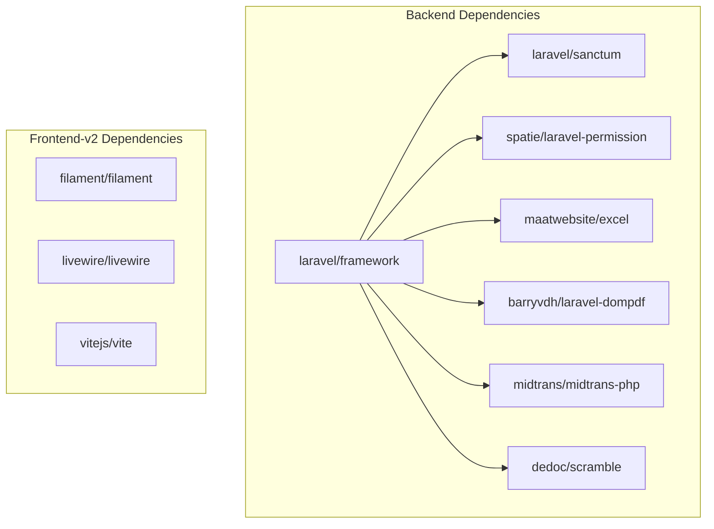

# Developer Guidelines

<cite>
**Referenced Files in This Document**
- [AGENTS.md](file://AGENTS.md)
- [composer.json](file://backend/composer.json)
- [.editorconfig](file://backend/.editorconfig)
- [README.md](file://backend/README.md)
- [ISSUE_REPORT.md](file://ISSUE_REPORT.md)
- [TESTING_GUIDE.md](file://TESTING_GUIDE.md)
- [config_documentation.md](file://config_documentation.md)
- [api.php](file://backend/routes/api.php)
- [AppServiceProvider.php](file://backend/app/Providers/AppServiceProvider.php)
- [Permission.php](file://backend/app/Enum/Permission.php)
- [Permissions.php](file://backend/app/Constant/Permissions.php)
- [DefaultRoles.php](file://backend/app/Enum/DefaultRoles.php)
- [AuthController.php](file://backend/app/Http/Controllers/AuthController.php)
- [ApiService.php](file://frontend-v2/app/Services/ApiService.php)
- [Login.php](file://frontend-v2/app/Filament/Pages/Auth/Login.php)
- [KasController.php](file://backend/app/Http/Controllers/KasController.php)
- [PdfGeneratorController.php](file://backend/app/Http/Controllers/PdfGeneratorController.php)
- [ProcessExportJob.php](file://backend/app/Jobs/ProcessExportJob.php)
- [ProcessImportJob.php](file://backend/app/Jobs/ProcessImportJob.php)
- [DatabaseSeeder.php](file://backend/database/seeders/DatabaseSeeder.php)
- [AdminPanelProvider.php](file://frontend-v2/app/Providers/Filament/AdminPanelProvider.php)
- [PortalPanelProvider.php](file://frontend-v2/app/Providers/Filament/PortalPanelProvider.php)
- [BrandingService.php](file://frontend-v2/app/Services/BrandingService.php)
- [handayani.php](file://frontend-v2/config/handayani.php)
- [midtrans.php](file://backend/config/midtrans.php)
- [PembayaranTest.php](file://backend/tests/Feature/PembayaranTest.php)
- [MidtransClient.php](file://backend/app/Services/Midtrans/MidtransClient.php)
- [MidtransNotificationService.php](file://backend/app/Services/Midtrans/MidtransNotificationService.php)
- [MidtransTransactionController.php](file://backend/app/Http/Controllers/MidtransTransactionController.php)
</cite>

## Table of Contents
1. Introduction
2. Project Structure
3. Core Components
4. Architecture Overview
5. Detailed Component Analysis
6. Dependency Analysis
7. Performance Considerations
8. Troubleshooting Guide
9. Conclusion
10. Appendices

## Introduction
This document provides comprehensive developer guidelines for contributing to the Handayani system. It covers code standards, naming conventions, architectural patterns, contribution workflow, release and version management, development environment setup, productivity tools, maintenance procedures, and long-term sustainability practices. The goal is to make contributions consistent, safe, and maintainable across the monorepo’s three applications: backend (Laravel API), frontend-v2 (Filament admin/portal), and portal-reference (React reference).

## Project Structure
The repository is a monorepo with clear separation of responsibilities:
- backend: Headless Laravel 12 API owning database schema, migrations, models, business rules, Sanctum authentication, and JSON API consumed by frontend-v2.
- frontend-v2: Laravel 12 + Filament 4 admin/portal UI that calls backend via ApiService and stores the Sanctum token in session.
- portal-reference: Standalone React + TanStack Start landing/profile reference built with Lovable; used as a design reference only.

**Diagram sources**
- [AGENTS.md](file://AGENTS.md)

Key entry points and organization:
- Backend API routes are defined under routes/api.php.
- Frontend-v2 panels are registered via AdminPanelProvider and PortalPanelProvider.
- Public pages live in frontend-v2 using standard controllers and Blade views.

**Section sources**
- [AGENTS.md](file://AGENTS.md)
- [api.php](file://backend/routes/api.php)
- [AdminPanelProvider.php](file://frontend-v2/app/Providers/Filament/AdminPanelProvider.php)
- [PortalPanelProvider.php](file://frontend-v2/app/Providers/Filament/PortalPanelProvider.php)

## Core Components
- Authentication and Authorization
  - Backend login logic resides in AuthController.php.
  - Permissions are defined as string-backed enum cases in Permission.php and grouped in Permissions.php.
  - Default roles are defined in DefaultRoles.php.
  - Superadmin bypass is configured in AppServiceProvider.php.
  - Frontend-v2 authenticates by posting credentials to backend and storing the Sanctum token in session via ApiService.php. Login page is in Login.php.

- Domain Services
  - Financial domain services include KasController.php for reports and PdfGeneratorController.php for PDF generation.
  - Import/export jobs are queued via ProcessImportJob.php and ProcessExportJob.php.

- Configuration and Feature Flags
  - Central feature toggles and branding configuration are documented in config_documentation.md and implemented in handayani.php.
  - Midtrans integration configuration is in midtrans.php.

- Testing and Issue Tracking
  - Testing guide and checklists are maintained in TESTING_GUIDE.md.
  - Outstanding issues and tasks are tracked in ISSUE_REPORT.md.

**Section sources**
- [AuthController.php](file://backend/app/Http/Controllers/AuthController.php)
- [Permission.php](file://backend/app/Enum/Permission.php)
- [Permissions.php](file://backend/app/Constant/Permissions.php)
- [DefaultRoles.php](file://backend/app/Enum/DefaultRoles.php)
- [AppServiceProvider.php](file://backend/app/Providers/AppServiceProvider.php)
- [ApiService.php](file://frontend-v2/app/Services/ApiService.php)
- [Login.php](file://frontend-v2/app/Filament/Pages/Auth/Login.php)
- [KasController.php](file://backend/app/Http/Controllers/KasController.php)
- [PdfGeneratorController.php](file://backend/app/Http/Controllers/PdfGeneratorController.php)
- [ProcessImportJob.php](file://backend/app/Jobs/ProcessImportJob.php)
- [ProcessExportJob.php](file://backend/app/Jobs/ProcessExportJob.php)
- [config_documentation.md](file://config_documentation.md)
- [handayani.php](file://frontend-v2/config/handayani.php)
- [midtrans.php](file://backend/config/midtrans.php)
- [TESTING_GUIDE.md](file://TESTING_GUIDE.md)
- [ISSUE_REPORT.md](file://ISSUE_REPORT.md)

## Architecture Overview
High-level architecture emphasizes a split responsibility model:
- backend owns the database and exposes a JSON API under /api.
- frontend-v2 is a stateless Filament UI that authenticates against backend and persists the Sanctum token in session.
- portal-reference is a visual reference only and should not be modified directly.

**Diagram sources**
- [AGENTS.md](file://AGENTS.md)
- [ApiService.php](file://frontend-v2/app/Services/ApiService.php)
- [AuthController.php](file://backend/app/Http/Controllers/AuthController.php)
- [ProcessImportJob.php](file://backend/app/Jobs/ProcessImportJob.php)
- [ProcessExportJob.php](file://backend/app/Jobs/ProcessExportJob.php)

## Detailed Component Analysis

### Contribution Workflow and Branching Strategy
- Repository layout and commands are centralized in AGENTS.md. Use it as the single source of truth for local development and common commands.
- Issue tracking is maintained in ISSUE_REPORT.md. Check this before starting any task and mark items complete only after actual fixes.
- Recommended branching strategy:
  - main: stable releases.
  - develop: integration branch for features.
  - feature/<short-description>: feature branches from develop.
  - hotfix/<issue-id>: hotfixes from main.
- Pull request procedure:
  - Create PR targeting develop or main depending on scope.
  - Ensure tests pass locally and CI passes if applicable.
  - Include screenshots or videos for UI changes.
  - Link related issue(s) from ISSUE_REPORT.md.
- Code review process:
  - Reviewers verify adherence to coding standards, permission enforcement, and migration correctness.
  - For financial and Midtrans changes, ensure edge cases and error handling are covered.

**Section sources**
- [AGENTS.md](file://AGENTS.md)
- [ISSUE_REPORT.md](file://ISSUE_REPORT.md)

### Coding Standards and Naming Conventions
- Editor configuration:
  - UTF-8 encoding, LF line endings, 4-space indentation, trim trailing whitespace, insert final newline.
  - YAML files use 2-space indentation.
- PHP formatting:
  - Use Laravel Pint for formatting. Run vendor/bin/pint in backend and frontend-v2 directories.
- JavaScript linting:
  - ESLint configuration in frontend/eslint.config.js enforces recommended rules and React hooks best practices.
- Naming conventions:
  - Controllers: PascalCase with descriptive nouns (e.g., PembayaranController).
  - Models: Singular PascalCase (e.g., Tagihan, Pembayaran).
  - Services: Action-oriented names (e.g., WorkflowService, BrandingService).
  - Requests: ResourceNameRequest pattern (e.g., SiswaRequest).
  - Jobs: Verb+Resource pattern (e.g., ProcessImportJob).
  - Enums and Constants: PascalCase with meaningful identifiers (e.g., Permission, Permissions).
- Documentation:
  - Keep READMEs updated per application.
  - Maintain config_documentation.md for feature flags and branding configuration.

**Section sources**
- [.editorconfig](file://backend/.editorconfig)
- [composer.json](file://backend/composer.json)
- [eslint.config.js](file://frontend/eslint.config.js)
- [config_documentation.md](file://config_documentation.md)

### Architectural Patterns
- Service Layer Pattern:
  - Business logic is encapsulated in services (e.g., BrandingService, WorkflowService).
- Request Validation Pattern:
  - Form requests validate inputs (e.g., SiswaRequest, TagihanRequest).
- Event-Listener Pattern:
  - Events like PembayaranRecorded trigger listeners such as SendKwitansiNotification.
- Observer Pattern:
  - Observers handle model lifecycle events (e.g., DashboardCacheObserver, SiswaObserver).
- Middleware and Gate-based Authorization:
  - Custom middleware (e.g., DenySiswaRole) and gates enforce access control.
- Queued Jobs:
  - Long-running tasks (imports, exports, notifications) are dispatched to queue workers.

**Diagram sources**
- [AuthController.php](file://backend/app/Http/Controllers/AuthController.php)
- [ApiService.php](file://frontend-v2/app/Services/ApiService.php)
- [BrandingService.php](file://frontend-v2/app/Services/BrandingService.php)
- [ProcessImportJob.php](file://backend/app/Jobs/ProcessImportJob.php)
- [ProcessExportJob.php](file://backend/app/Jobs/ProcessExportJob.php)

**Section sources**
- [AppServiceProvider.php](file://backend/app/Providers/AppServiceProvider.php)
- [DenySiswaRole.php](file://backend/app/Http/Middleware/DenySiswaRole.php)
- [SendKwitansiNotification.php](file://backend/app/Listeners/SendKwitansiNotification.php)
- [DashboardCacheObserver.php](file://backend/app/Observers/DashboardCacheObserver.php)
- [SiswaObserver.php](file://backend/app/Observers/SiswaObserver.php)

### Payment Integration (Midtrans)
- Configuration:
  - Backend Midtrans configuration is in midtrans.php.
- Client and Notification Handling:
  - MidtransClient.php handles API interactions.
  - MidtransNotificationService.php processes webhooks.
- Transaction Controller:
  - MidtransTransactionController.php exposes endpoints for initiation and status sync.
- Testing:
  - Feature tests cover payment flows (e.g., PembayaranTest.php).

**Diagram sources**
- [midtrans.php](file://backend/config/midtrans.php)
- [MidtransClient.php](file://backend/app/Services/Midtrans/MidtransClient.php)
- [MidtransNotificationService.php](file://backend/app/Services/Midtrans/MidtransNotificationService.php)
- [MidtransTransactionController.php](file://backend/app/Http/Controllers/MidtransTransactionController.php)
- [PembayaranTest.php](file://backend/tests/Feature/PembayaranTest.php)

**Section sources**
- [midtrans.php](file://backend/config/midtrans.php)
- [MidtransClient.php](file://backend/app/Services/Midtrans/MidtransClient.php)
- [MidtransNotificationService.php](file://backend/app/Services/Midtrans/MidtransNotificationService.php)
- [MidtransTransactionController.php](file://backend/app/Http/Controllers/MidtransTransactionController.php)
- [PembayaranTest.php](file://backend/tests/Feature/PembayaranTest.php)

### Reports, Imports, Exports, and PDF Generation
- Reports:
  - KasHarian and RekapBulanan endpoints are handled by KasController.php.
- PDF Generation:
  - PdfGeneratorController.php generates PDFs for reports and receipts.
- Background Jobs:
  - ProcessImportJob.php and ProcessExportJob.php manage large data operations asynchronously.

**Diagram sources**
- [KasController.php](file://backend/app/Http/Controllers/KasController.php)
- [PdfGeneratorController.php](file://backend/app/Http/Controllers/PdfGeneratorController.php)
- [ProcessExportJob.php](file://backend/app/Jobs/ProcessExportJob.php)

**Section sources**
- [KasController.php](file://backend/app/Http/Controllers/KasController.php)
- [PdfGeneratorController.php](file://backend/app/Http/Controllers/PdfGeneratorController.php)
- [ProcessImportJob.php](file://backend/app/Jobs/ProcessImportJob.php)
- [ProcessExportJob.php](file://backend/app/Jobs/ProcessExportJob.php)

### Development Environment Setup
- Prerequisites:
  - PHP 8.2+, Node.js, MariaDB/MySQL.
- Backend setup:
  - Install dependencies: composer install, npm install.
  - Copy .env.example to .env and generate key: php artisan key:generate.
  - Run migrations and seeders: php artisan migrate --seed.
  - Start API server on port 8080: php artisan serve --port=8080.
  - Start queue worker: php artisan queue:listen --tries=1.
- Frontend-v2 setup:
  - Install dependencies: composer install, npm install.
  - Copy .env.example to .env and generate key: php artisan key:generate.
  - Build assets: npm run build.
  - Start dev server: php artisan serve (default port 8000).
- Database:
  - Both backend and frontend-v2 share the same database; backend owns migrations.
- Default credentials:
  - Admin account seeded in DatabaseSeeder.php.

**Section sources**
- [AGENTS.md](file://AGENTS.md)
- [composer.json](file://backend/composer.json)
- [DatabaseSeeder.php](file://backend/database/seeders/DatabaseSeeder.php)

### Productivity Tools and IDE Configuration
- Formatting and linting:
  - PHP: Laravel Pint (vendor/bin/pint).
  - JavaScript: ESLint (npm run lint).
- Testing:
  - PHPUnit for backend tests (php artisan test).
  - Pest for frontend-v2 unit tests (vendor/bin/pest).
- Documentation:
  - Maintain READMEs per application and update config_documentation.md for feature flags.

**Section sources**
- [composer.json](file://backend/composer.json)
- [eslint.config.js](file://frontend/eslint.config.js)
- [TESTING_GUIDE.md](file://TESTING_GUIDE.md)

### Maintenance Procedures and Technical Debt Management
- Regular tasks:
  - Run permissions sync after adding new permissions: php artisan permissions:sync.
  - Prune Midtrans logs periodically: php artisan midtrans:prune-logs --days=180.
  - Clear caches when needed: php artisan route:clear && config:clear && view:clear.
- Technical debt:
  - Track issues in ISSUE_REPORT.md and address them systematically.
  - Refactor duplicated logic into traits/services following established patterns.
- Sustainability:
  - Keep feature flags in sync between .env and cached config.
  - Avoid modifying portal-reference directly; convert designs into frontend-v2 Blade + Tailwind v4 + Alpine.js per specs.

**Section sources**
- [AGENTS.md](file://AGENTS.md)
- [ISSUE_REPORT.md](file://ISSUE_REPORT.md)
- [config_documentation.md](file://config_documentation.md)

## Dependency Analysis
Backend dependencies include Laravel framework, Sanctum, Spatie permissions, Maatwebsite Excel, DOMPDF, Midtrans SDK, and Scramble for API docs. Frontend-v2 depends on Filament, Livewire, and Vite.

**Diagram sources**
- [composer.json](file://backend/composer.json)

**Section sources**
- [composer.json](file://backend/composer.json)

## Performance Considerations
- Use queues for heavy operations (imports, exports, notifications).
- Cache dashboard data where appropriate using observers.
- Optimize database queries with proper indexing and eager loading.
- Enable SPA prefetching selectively based on performance needs.

[No sources needed since this section provides general guidance]

## Troubleshooting Guide
- Common issues:
  - API down: Frontend displays persistent red notifications; ensure backend is running on port 8080.
  - Permission errors: Run php artisan permissions:sync after adding new permissions.
  - Midtrans webhook failures: Verify signature verification and log entries.
- Debugging steps:
  - Clear caches: php artisan route:clear && config:clear && view:clear.
  - Check queue worker logs for failed jobs.
  - Review API responses and network requests in browser dev tools.

**Section sources**
- [TESTING_GUIDE.md](file://TESTING_GUIDE.md)
- [AGENTS.md](file://AGENTS.md)

## Conclusion
These guidelines ensure consistent contributions, robust architecture, and sustainable maintenance practices. Follow the established patterns, adhere to coding standards, and leverage the provided tools and documentation to deliver high-quality features efficiently.

[No sources needed since this section summarizes without analyzing specific files]

## Appendices
- Quick command reference:
  - Backend: composer install, npm install, php artisan serve --port=8080, php artisan queue:listen --tries=1, php artisan test, vendor/bin/pint.
  - Frontend-v2: composer install, npm install, npm run build, php artisan serve, vendor/bin/pest, vendor/bin/pint.
- Feature flags:
  - Configure in handayani.php and .env variables as documented in config_documentation.md.

**Section sources**
- [AGENTS.md](file://AGENTS.md)
- [config_documentation.md](file://config_documentation.md)