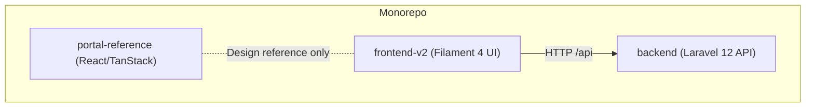
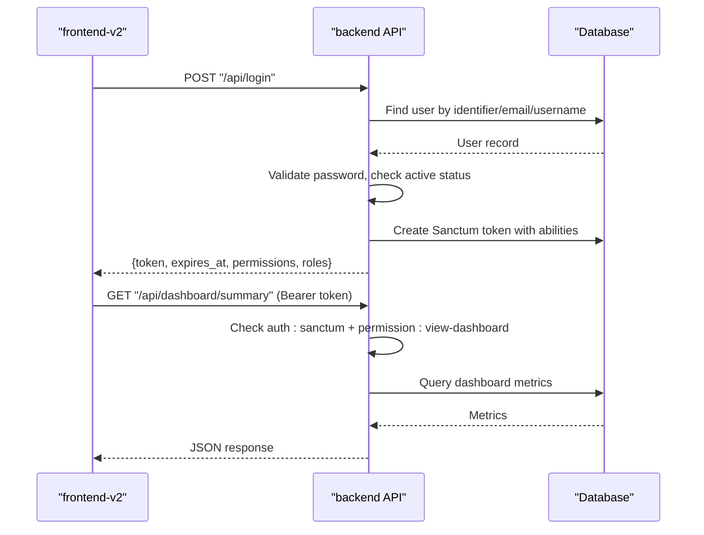
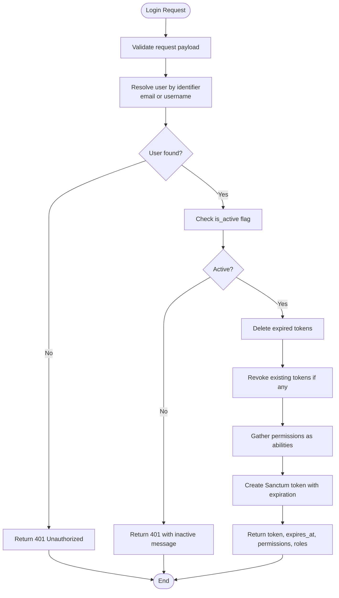
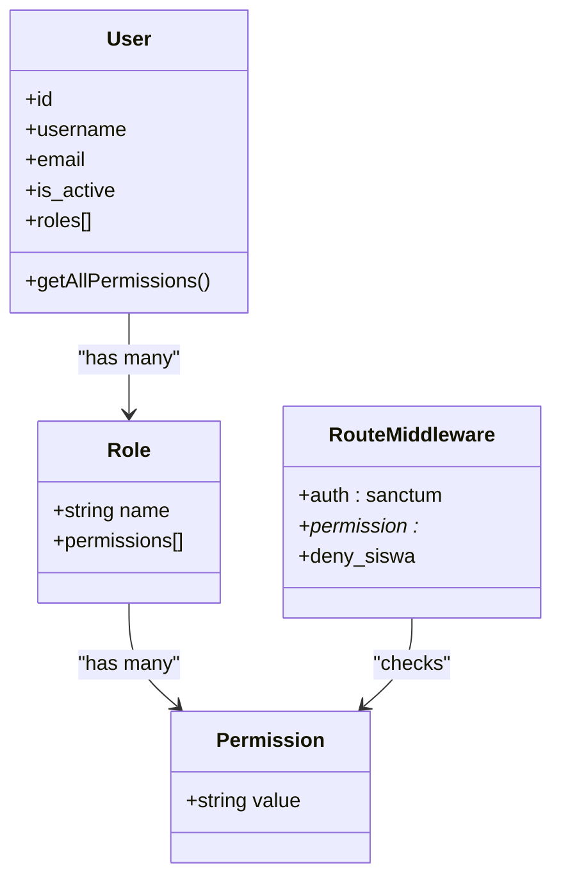
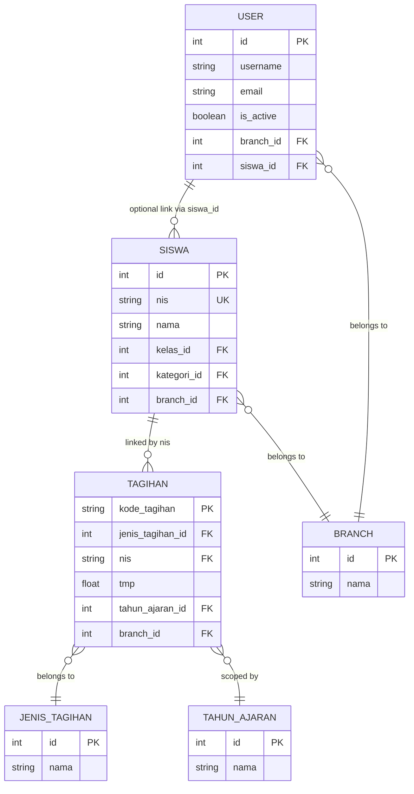
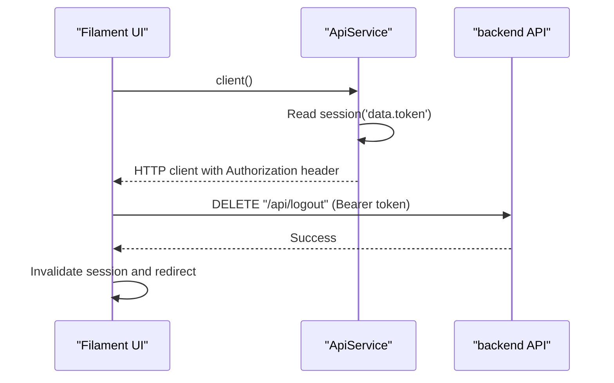
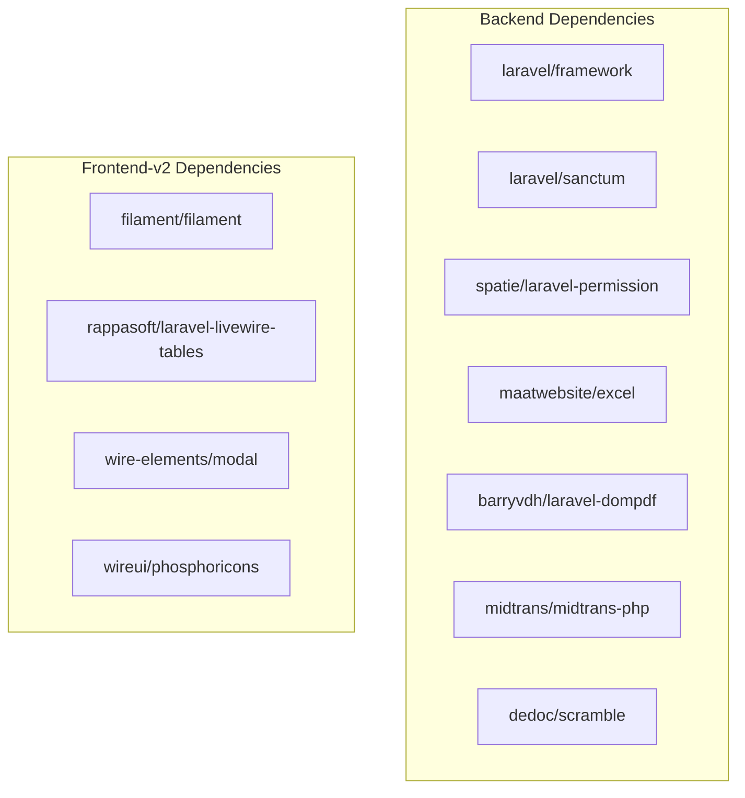

# Kiro Specifications & Documentation

<cite>
**Referenced Files in This Document**
- [AGENTS.md](file://AGENTS.md)
- [backend/composer.json](file://backend/composer.json)
- [frontend-v2/composer.json](file://frontend-v2/composer.json)
- [backend/routes/api.php](file://backend/routes/api.php)
- [backend/app/Http/Controllers/AuthController.php](file://backend/app/Http/Controllers/AuthController.php)
- [backend/app/Services/IdentifierService.php](file://backend/app/Services/IdentifierService.php)
- [backend/app/Enum/Permission.php](file://backend/app/Enum/Permission.php)
- [backend/app/Models/User.php](file://backend/app/Models/User.php)
- [backend/app/Models/Siswa.php](file://backend/app/Models/Siswa.php)
- [backend/app/Models/Tagihan.php](file://backend/app/Models/Tagihan.php)
- [frontend-v2/app/Services/ApiService.php](file://frontend-v2/app/Services/ApiService.php)
- [frontend-v2/routes/web.php](file://frontend-v2/routes/web.php)
</cite>

## Table of Contents
1. [Introduction](#introduction)
2. [Project Structure](#project-structure)
3. [Core Components](#core-components)
4. [Architecture Overview](#architecture-overview)
5. [Detailed Component Analysis](#detailed-component-analysis)
6. [Dependency Analysis](#dependency-analysis)
7. [Performance Considerations](#performance-considerations)
8. [Troubleshooting Guide](#troubleshooting-guide)
9. [Conclusion](#conclusion)
10. [Appendices](#appendices)

## Introduction
This document provides a comprehensive overview and technical specification for the Handayani project, focusing on its monorepo structure, backend API, Filament-based admin/portal frontend, and integration points. It explains how authentication, authorization, data models, and key workflows operate across components, with diagrams mapping to actual source files.

## Project Structure
The repository is a monorepo containing three independent applications:
- backend: Laravel 12 headless API owning the database schema, migrations, models, business logic, Sanctum authentication, and JSON API consumed by frontend-v2.
- frontend-v2: Laravel 12 + Filament 4 admin/portal UI that calls backend via ApiService and stores the Sanctum token in session.
- portal-reference/handayani-joyful-portal: Standalone React/TanStack reference site used as design inspiration; not wired to the API.

**Diagram sources**
- [AGENTS.md](file://AGENTS.md)

**Section sources**
- [AGENTS.md](file://AGENTS.md)

## Core Components
- Authentication: Backend login issues Sanctum tokens with abilities derived from user permissions. Identifier routing supports email or username login with constraints for admins.
- Authorization: Permission strings are defined centrally and enforced via middleware on routes. Roles include superadmin, admin, user, siswa.
- Data Models: User, Siswa, Tagihan define core relationships and scoping rules (e.g., Tagihan linked to Siswa via NIS).
- Frontend Integration: ApiService attaches the Bearer token from session and sets base URL for all API calls.

**Section sources**
- [backend/app/Http/Controllers/AuthController.php](file://backend/app/Http/Controllers/AuthController.php)
- [backend/app/Services/IdentifierService.php](file://backend/app/Services/IdentifierService.php)
- [backend/app/Enum/Permission.php](file://backend/app/Enum/Permission.php)
- [backend/app/Models/User.php](file://backend/app/Models/User.php)
- [backend/app/Models/Siswa.php](file://backend/app/Models/Siswa.php)
- [backend/app/Models/Tagihan.php](file://backend/app/Models/Tagihan.php)
- [frontend-v2/app/Services/ApiService.php](file://frontend-v2/app/Services/ApiService.php)

## Architecture Overview
High-level flow between frontend-v2 and backend:
- frontend-v2 authenticates by calling backend login, receives a Sanctum token, stores it in session, and forwards it via ApiService headers.
- All protected endpoints require auth:sanctum and often additional permission middleware.
- Public endpoints include password reset, unsubscribe, and Midtrans webhook.

**Diagram sources**
- [backend/routes/api.php](file://backend/routes/api.php)
- [backend/app/Http/Controllers/AuthController.php](file://backend/app/Http/Controllers/AuthController.php)
- [backend/app/Services/IdentifierService.php](file://backend/app/Services/IdentifierService.php)
- [frontend-v2/app/Services/ApiService.php](file://frontend-v2/app/Services/ApiService.php)

## Detailed Component Analysis

### Authentication Flow
Login validates credentials, enforces account activity, revokes expired tokens, creates a new Sanctum token with abilities equal to user permissions, and returns metadata including expiration and roles.

**Diagram sources**
- [backend/app/Http/Controllers/AuthController.php](file://backend/app/Http/Controllers/AuthController.php)
- [backend/app/Services/IdentifierService.php](file://backend/app/Services/IdentifierService.php)

**Section sources**
- [backend/app/Http/Controllers/AuthController.php](file://backend/app/Http/Controllers/AuthController.php)
- [backend/app/Services/IdentifierService.php](file://backend/app/Services/IdentifierService.php)

### Authorization Model
Permissions are enumerated centrally and enforced via route middleware. Roles group permissions; superadmin bypasses gates but still requires synced permissions for middleware checks.

**Diagram sources**
- [backend/app/Enum/Permission.php](file://backend/app/Enum/Permission.php)
- [backend/app/Models/User.php](file://backend/app/Models/User.php)
- [backend/routes/api.php](file://backend/routes/api.php)

**Section sources**
- [backend/app/Enum/Permission.php](file://backend/app/Enum/Permission.php)
- [backend/routes/api.php](file://backend/routes/api.php)
- [backend/app/Models/User.php](file://backend/app/Models/User.php)

### Data Models and Relationships
Key domain entities and their relationships:
- User has roles and permissions; belongs to Branch; optionally linked to Siswa.
- Siswa has parents (Ayah/Ibu/Wali), class, category, branch; bills (Tagihan) link via NIS.
- Tagihan links to JenisTagihan, Siswa (via NIS), TahunAjaran, Branch; has many Pembayaran.

**Diagram sources**
- [backend/app/Models/User.php](file://backend/app/Models/User.php)
- [backend/app/Models/Siswa.php](file://backend/app/Models/Siswa.php)
- [backend/app/Models/Tagihan.php](file://backend/app/Models/Tagihan.php)

**Section sources**
- [backend/app/Models/User.php](file://backend/app/Models/User.php)
- [backend/app/Models/Siswa.php](file://backend/app/Models/Siswa.php)
- [backend/app/Models/Tagihan.php](file://backend/app/Models/Tagihan.php)

### Frontend Integration (ApiService)
frontend-v2 uses ApiService to attach the Bearer token from session and set the base URL for all API requests. Logout clears session and attempts to revoke token on backend.

**Diagram sources**
- [frontend-v2/app/Services/ApiService.php](file://frontend-v2/app/Services/ApiService.php)
- [frontend-v2/routes/web.php](file://frontend-v2/routes/web.php)
- [backend/routes/api.php](file://backend/routes/api.php)

**Section sources**
- [frontend-v2/app/Services/ApiService.php](file://frontend-v2/app/Services/ApiService.php)
- [frontend-v2/routes/web.php](file://frontend-v2/routes/web.php)
- [backend/routes/api.php](file://backend/routes/api.php)

## Dependency Analysis
Backend dependencies include Laravel framework, Sanctum, Spatie permissions, Maatwebsite Excel, DOMPDF, Scramble docs, and Midtrans SDK. Frontend-v2 depends on Filament 4, Livewire tables, and modal packages.

**Diagram sources**
- [backend/composer.json](file://backend/composer.json)
- [frontend-v2/composer.json](file://frontend-v2/composer.json)

**Section sources**
- [backend/composer.json](file://backend/composer.json)
- [frontend-v2/composer.json](file://frontend-v2/composer.json)

## Performance Considerations
- Use queue workers for heavy tasks like exports, imports, and notifications to avoid blocking API responses.
- Cache dashboard summaries where appropriate to reduce repeated queries.
- Ensure proper indexing on frequently queried columns (e.g., NIS, kode_tagihan, tahun_ajaran_id).
- Keep Sanctum token expiration reasonable to balance security and UX.

[No sources needed since this section provides general guidance]

## Troubleshooting Guide
- Login failures: Verify IdentifierService resolution path (email vs username), ensure user is active, and confirm password hash matches.
- Permission errors: Confirm permissions are synced after adding cases to Permission enum; superadmin bypasses gates but still needs synced permissions for middleware.
- Token issues: Clear expired tokens and re-login; ensure frontend-v2 session contains the token and API_URL is correct.
- Database relations: Changing student NIS can break bill linkage due to Tagihan-Siswa relation on NIS.

**Section sources**
- [backend/app/Services/IdentifierService.php](file://backend/app/Services/IdentifierService.php)
- [backend/app/Http/Controllers/AuthController.php](file://backend/app/Http/Controllers/AuthController.php)
- [backend/app/Models/Tagihan.php](file://backend/app/Models/Tagihan.php)
- [frontend-v2/app/Services/ApiService.php](file://frontend-v2/app/Services/ApiService.php)

## Conclusion
Handayani’s architecture cleanly separates concerns: backend owns data and business logic, while frontend-v2 provides an interactive Filament interface. Centralized permissions, robust authentication, and clear model relationships support scalable administration and financial operations. Following the conventions and troubleshooting steps ensures reliable development and deployment.

[No sources needed since this section summarizes without analyzing specific files]

## Appendices
- Common commands and local development workflow are documented in AGENTS.md.
- Public landing page implementation guidelines and feature toggles are also covered there.

**Section sources**
- [AGENTS.md](file://AGENTS.md)