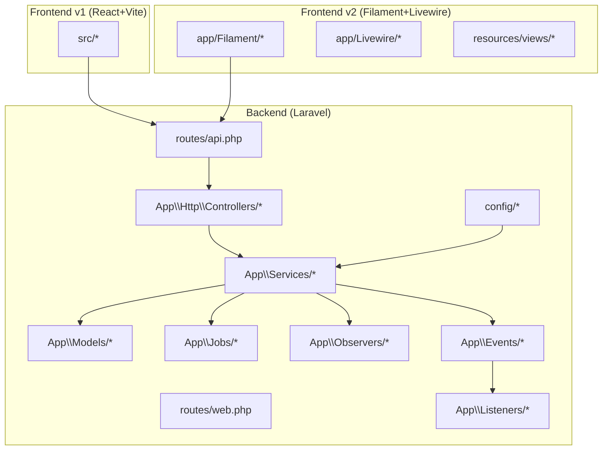
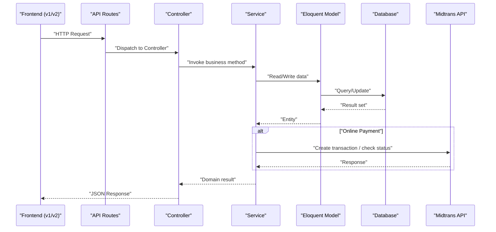
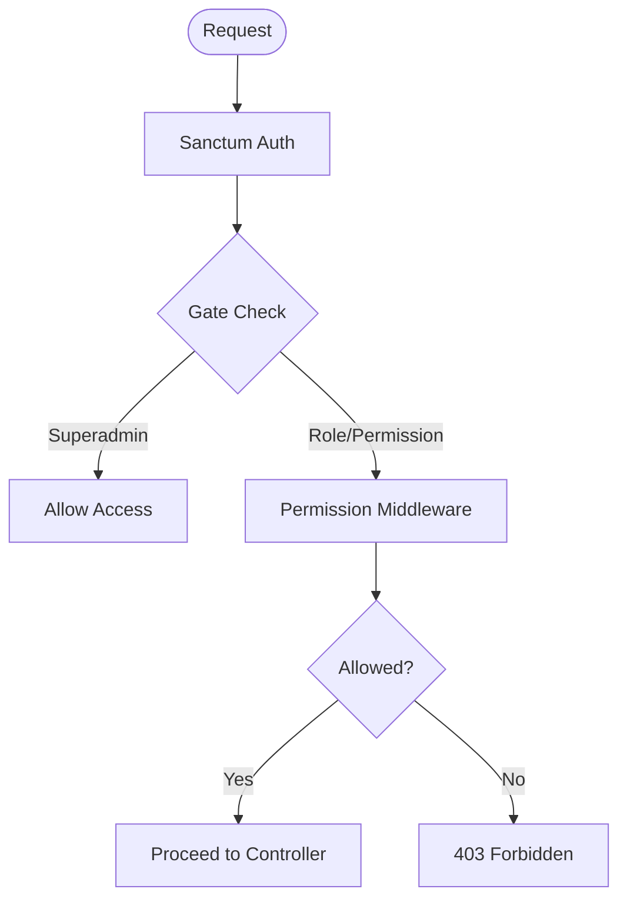
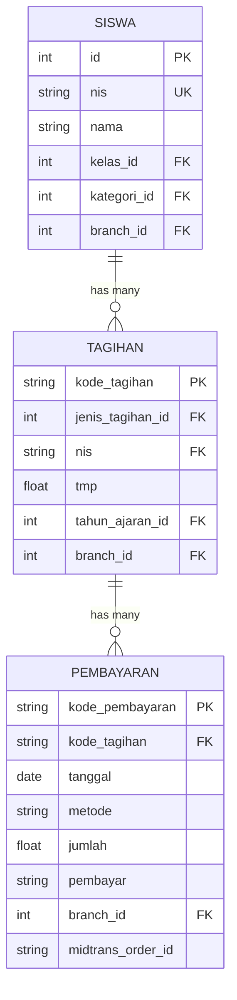
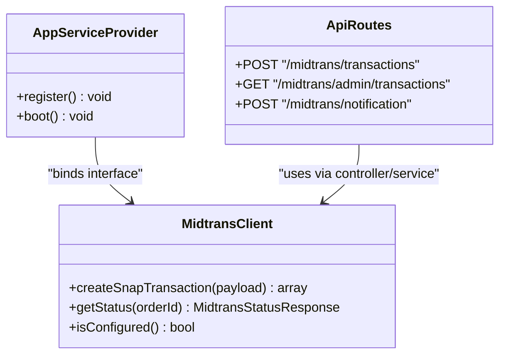
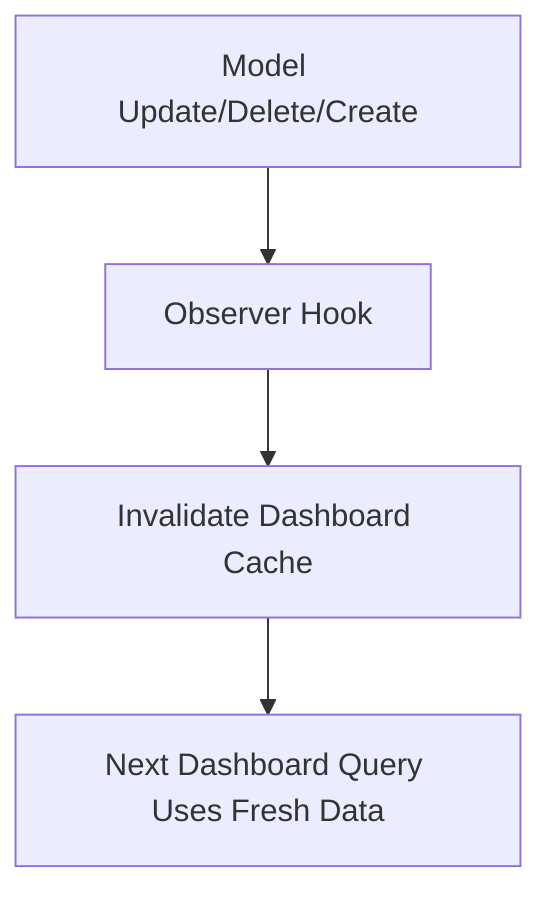
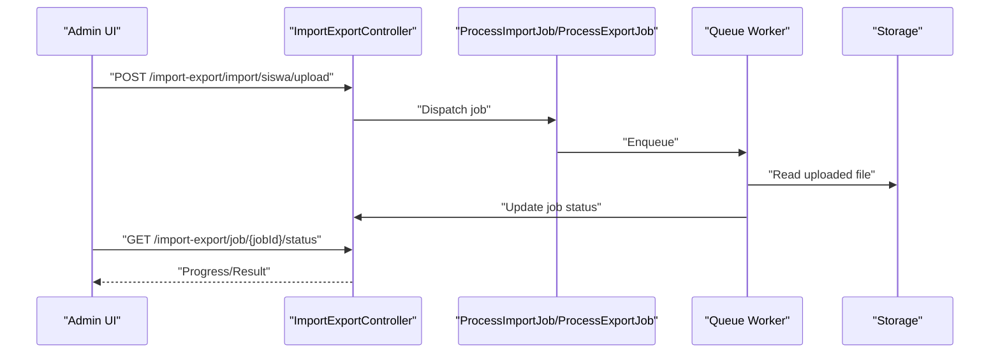
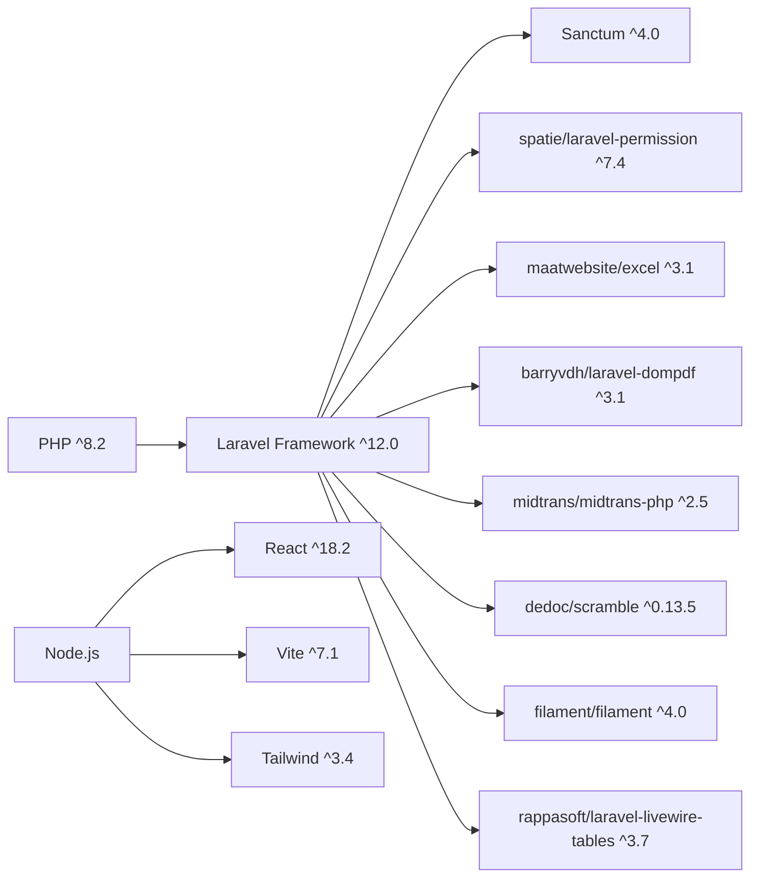

# Repository Documentation & Guides

<cite>
**Referenced Files in This Document**
- [backend/README.md](file://backend/README.md)
- [frontend/README.md](file://frontend/README.md)
- [frontend-v2/README.md](file://frontend-v2/README.md)
- [backend/composer.json](file://backend/composer.json)
- [frontend/package.json](file://frontend/package.json)
- [frontend-v2/composer.json](file://frontend-v2/composer.json)
- [backend/app/Providers/AppServiceProvider.php](file://backend/app/Providers/AppServiceProvider.php)
- [backend/routes/api.php](file://backend/routes/api.php)
- [backend/routes/web.php](file://backend/routes/web.php)
- [backend/config/app.php](file://backend/config/app.php)
- [backend/app/Models/Siswa.php](file://backend/app/Models/Siswa.php)
- [backend/app/Models/Pembayaran.php](file://backend/app/Models/Pembayaran.php)
- [backend/app/Models/Tagihan.php](file://backend/app/Models/Tagihan.php)
- [backend/app/Services/Midtrans/MidtransClient.php](file://backend/app/Services/Midtrans/MidtransClient.php)
</cite>

## Table of Contents
1. Introduction
2. Project Structure
3. Core Components
4. Architecture Overview
5. Detailed Component Analysis
6. Dependency Analysis
7. Performance Considerations
8. Troubleshooting Guide
9. Conclusion

## Introduction
This repository implements a school management system with three main parts:
- Backend API (Laravel 12): RESTful API for authentication, student billing, payments, reports, and administrative operations. It integrates Midtrans for online payments and uses Spatie Laravel Permission for role-based access control.
- Frontend v1 (React + Vite): A minimal React SPA intended to consume the backend API.
- Frontend v2 (Filament Admin + Livewire): An admin portal built on Filament with Livewire components, sharing business logic with the backend via API calls.

The system supports multi-branch operations, academic year scoping, import/export workflows, notifications, and approval workflows for expenditures.

[No sources needed since this section summarizes without analyzing specific files]

## Project Structure
High-level layout:
- backend: Laravel application providing APIs, services, models, controllers, jobs, queues, migrations, seeders, and configuration.
- frontend: React + Vite SPA project.
- frontend-v2: Filament-based admin panel using Livewire and Blade views.

**Diagram sources**
- [backend/routes/api.php:1-346](file://backend/routes/api.php#L1-L346)
- [backend/routes/web.php:1-11](file://backend/routes/web.php#L1-L11)
- [backend/app/Providers/AppServiceProvider.php:1-76](file://backend/app/Providers/AppServiceProvider.php#L1-L76)

**Section sources**
- [backend/README.md:1-60](file://backend/README.md#L1-L60)
- [frontend/README.md:1-17](file://frontend/README.md#L1-L17)
- [frontend-v2/README.md:1-60](file://frontend-v2/README.md#L1-L60)

## Core Components
- Authentication and Authorization
  - Sanctum-based API authentication.
  - Role and permission gates configured in service provider; superadmin bypasses all gates.
- Domain Models
  - Siswa (student), Tagihan (invoice/billing), Pembayaran (payment).
  - Relationships between students, invoices, payments, classes, categories, branches, and academic years.
- Services Layer
  - Business logic encapsulated in services (e.g., Midtrans integration, notifications, import/export).
- API Routes
  - Centralized route definitions under api.php with middleware for roles/permissions.
- Observers and Events
  - Observers for cache invalidation and model lifecycle hooks.
  - Events and listeners for notifications.

**Section sources**
- [backend/app/Providers/AppServiceProvider.php:1-76](file://backend/app/Providers/AppServiceProvider.php#L1-L76)
- [backend/routes/api.php:1-346](file://backend/routes/api.php#L1-L346)
- [backend/app/Models/Siswa.php:1-117](file://backend/app/Models/Siswa.php#L1-L117)
- [backend/app/Models/Tagihan.php:1-60](file://backend/app/Models/Tagihan.php#L1-L60)
- [backend/app/Models/Pembayaran.php:1-53](file://backend/app/Models/Pembayaran.php#L1-L53)

## Architecture Overview
The system follows a layered architecture:
- Presentation: React SPA (v1) and Filament Admin (v2) call the backend API.
- API Layer: Controllers handle HTTP requests, validate input, enforce permissions, and delegate to services.
- Service Layer: Encapsulates domain logic, external integrations (Midtrans), and orchestration across models and jobs.
- Data Layer: Eloquent models map to database tables; relationships define data associations.
- Cross-cutting: Observers, events/listeners, queues, and configuration.

**Diagram sources**
- [backend/routes/api.php:1-346](file://backend/routes/api.php#L1-L346)
- [backend/app/Providers/AppServiceProvider.php:1-76](file://backend/app/Providers/AppServiceProvider.php#L1-L76)
- [backend/app/Services/Midtrans/MidtransClient.php:1-27](file://backend/app/Services/Midtrans/MidtransClient.php#L1-L27)

## Detailed Component Analysis

### Authentication and Authorization
- Sanctum guards API endpoints; login/logout routes are defined.
- Superadmin bypass is implemented via Gate::before in AppServiceProvider.
- Middleware enforces role and permission checks per route group.

**Diagram sources**
- [backend/app/Providers/AppServiceProvider.php:1-76](file://backend/app/Providers/AppServiceProvider.php#L1-L76)
- [backend/routes/api.php:1-346](file://backend/routes/api.php#L1-L346)

**Section sources**
- [backend/app/Providers/AppServiceProvider.php:1-76](file://backend/app/Providers/AppServiceProvider.php#L1-L76)
- [backend/routes/api.php:1-346](file://backend/routes/api.php#L1-L346)

### Student Billing and Payments (Siswa, Tagihan, Pembayaran)
- Siswa has many Tagihan through nis; Tagihan has many Pembayaran; Pembayaran belongs to Tagihan and optionally to MidtransTransaction.
- Siswa provides a helper query for grouped payment history by method and academic year.

**Diagram sources**
- [backend/app/Models/Siswa.php:1-117](file://backend/app/Models/Siswa.php#L1-L117)
- [backend/app/Models/Tagihan.php:1-60](file://backend/app/Models/Tagihan.php#L1-L60)
- [backend/app/Models/Pembayaran.php:1-53](file://backend/app/Models/Pembayaran.php#L1-L53)

**Section sources**
- [backend/app/Models/Siswa.php:1-117](file://backend/app/Models/Siswa.php#L1-L117)
- [backend/app/Models/Tagihan.php:1-60](file://backend/app/Models/Tagihan.php#L1-L60)
- [backend/app/Models/Pembayaran.php:1-53](file://backend/app/Models/Pembayaran.php#L1-L53)

### Midtrans Integration
- Interface defines createSnapTransaction, getStatus, and isConfigured.
- AppServiceProvider binds MidtransClient to an implementation and validates environment settings at boot.
- API exposes initiation and admin endpoints for transactions; webhook endpoint handles Midtrans notifications.

**Diagram sources**
- [backend/app/Services/Midtrans/MidtransClient.php:1-27](file://backend/app/Services/Midtrans/MidtransClient.php#L1-L27)
- [backend/app/Providers/AppServiceProvider.php:1-76](file://backend/app/Providers/AppServiceProvider.php#L1-L76)
- [backend/routes/api.php:322-346](file://backend/routes/api.php#L322-L346)

**Section sources**
- [backend/app/Services/Midtrans/MidtransClient.php:1-27](file://backend/app/Services/Midtrans/MidtransClient.php#L1-L27)
- [backend/app/Providers/AppServiceProvider.php:1-76](file://backend/app/Providers/AppServiceProvider.php#L1-L76)
- [backend/routes/api.php:322-346](file://backend/routes/api.php#L322-L346)

### Observers and Cache Invalidation
- Observers registered for Siswa and dashboard-related models (Pembayaran, Tagihan, Pengeluaran) to invalidate cached dashboard data when entities change.

**Diagram sources**
- [backend/app/Providers/AppServiceProvider.php:59-64](file://backend/app/Providers/AppServiceProvider.php#L59-L64)

**Section sources**
- [backend/app/Providers/AppServiceProvider.php:59-64](file://backend/app/Providers/AppServiceProvider.php#L59-L64)

### Import/Export and Jobs
- Import/export functionality is exposed via API routes and backed by services and jobs.
- Job status polling is supported for long-running tasks.

**Diagram sources**
- [backend/routes/api.php:293-318](file://backend/routes/api.php#L293-L318)

**Section sources**
- [backend/routes/api.php:293-318](file://backend/routes/api.php#L293-L318)

## Dependency Analysis
Key runtime dependencies:
- Backend (PHP 8.2+, Laravel 12): Sanctum, Spatie Permission, Maatwebsite Excel, dompdf, Midtrans SDK, Scramble for API docs.
- Frontend v1 (Node): React 18, Vite, Tailwind, ESLint.
- Frontend v2 (PHP 8.2+, Laravel 12): Filament, Livewire Tables, Modal, Phosphor Icons.

**Diagram sources**
- [backend/composer.json:1-97](file://backend/composer.json#L1-L97)
- [frontend/package.json:1-34](file://frontend/package.json#L1-L34)
- [frontend-v2/composer.json:1-94](file://frontend-v2/composer.json#L1-L94)

**Section sources**
- [backend/composer.json:1-97](file://backend/composer.json#L1-L97)
- [frontend/package.json:1-34](file://frontend/package.json#L1-L34)
- [frontend-v2/composer.json:1-94](file://frontend-v2/composer.json#L1-L94)

## Performance Considerations
- Use queue workers for heavy imports/exports and PDF generation to avoid blocking HTTP requests.
- Leverage observers to keep dashboard caches consistent; ensure cache drivers are configured appropriately.
- Prefer indexed queries on frequently filtered columns (nis, branch_id, tahun_ajaran_id) and use eager loading where appropriate.
- Configure timezone and locale consistently to avoid unexpected formatting overhead.

[No sources needed since this section provides general guidance]

## Troubleshooting Guide
Common issues and resolutions:
- Midtrans configuration errors
  - Symptom: Invalid environment or missing credentials during boot.
  - Resolution: Ensure midtrans.enabled and midtrans.environment are valid; verify keys in config/services.
- Permission denied on admin routes
  - Symptom: 403 responses despite being logged in.
  - Resolution: Verify user roles/permissions; confirm superadmin bypass behavior and that required permissions exist.
- Dashboard data not refreshing
  - Symptom: Cached totals do not reflect recent changes.
  - Resolution: Confirm observers are registered and cache invalidation triggers are firing; clear app cache if necessary.
- Import/export job stuck
  - Symptom: Job status never updates.
  - Resolution: Ensure queue worker is running; check storage paths and permissions; inspect logs.

**Section sources**
- [backend/app/Providers/AppServiceProvider.php:66-74](file://backend/app/Providers/AppServiceProvider.php#L66-L74)
- [backend/routes/api.php:1-346](file://backend/routes/api.php#L1-L346)

## Conclusion
The Handayani system combines a robust Laravel backend with two frontends: a lightweight React SPA and a feature-rich Filament admin panel. The codebase emphasizes clear separation of concerns, strong authorization, and reliable integrations such as Midtrans. Observers and jobs support scalability and performance, while comprehensive API routes provide a stable contract for both frontends.

[No sources needed since this section summarizes without analyzing specific files]