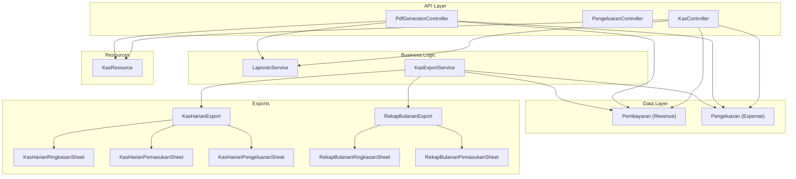
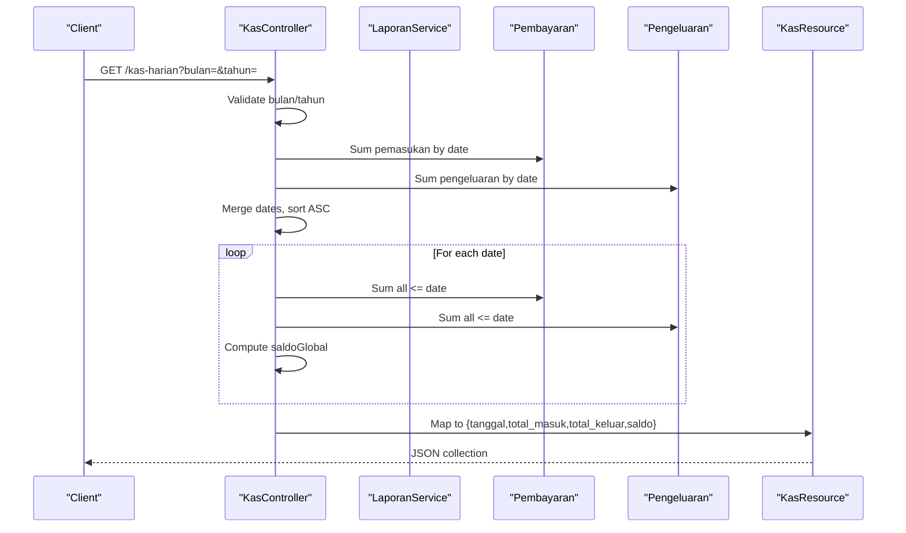
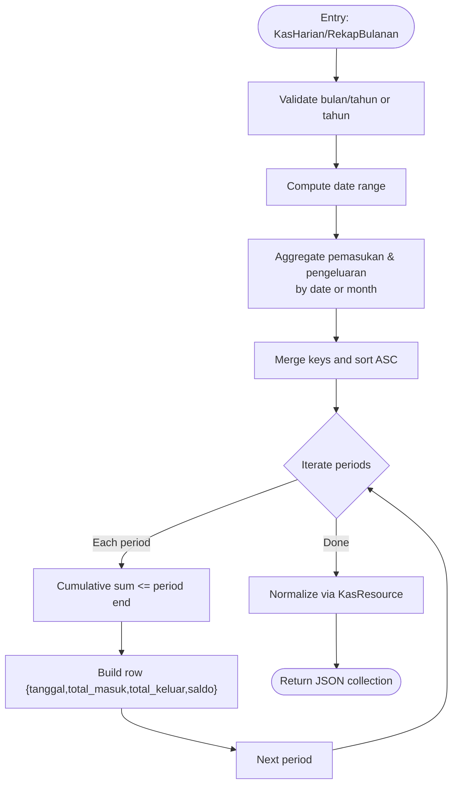
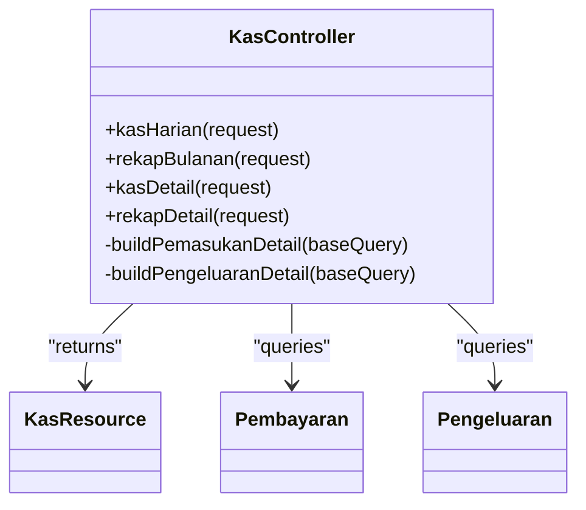
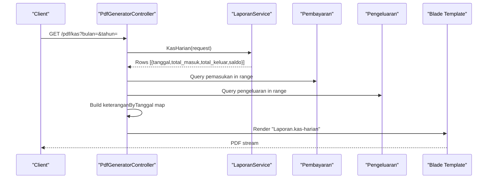
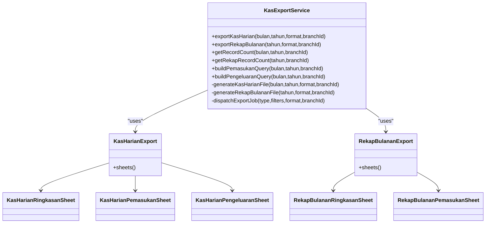
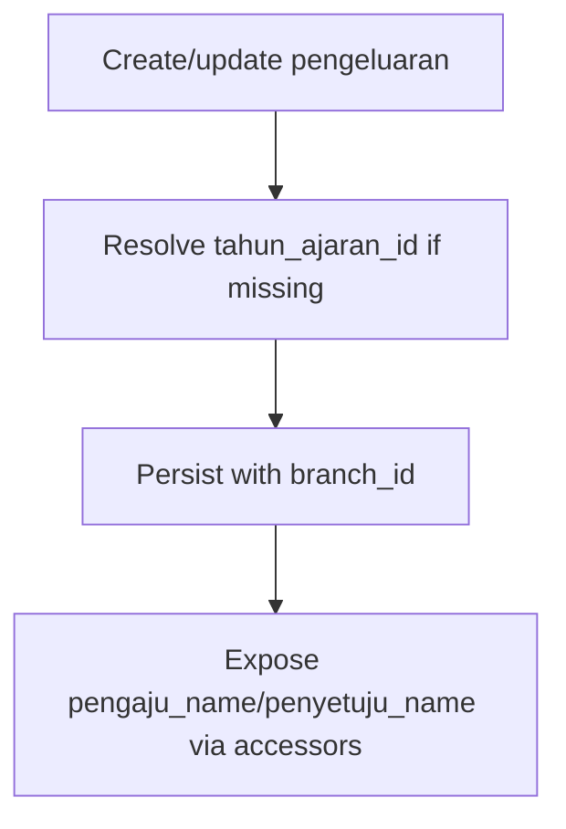
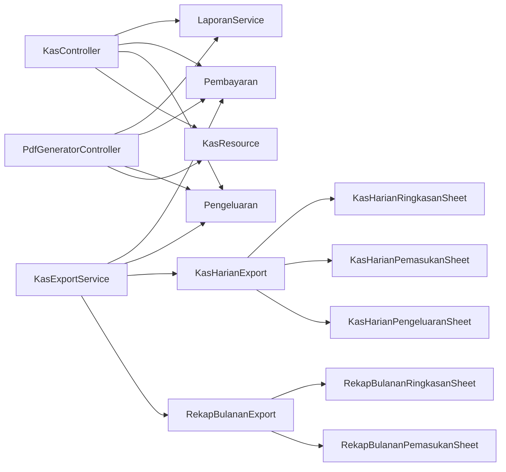

# Financial Reporting System

<cite>
**Referenced Files in This Document**
- [LaporanService.php](file://backend/app/Services/LaporanService.php)
- [KasController.php](file://backend/app/Http/Controllers/KasController.php)
- [PengeluaranController.php](file://backend/app/Http/Controllers/PengeluaranController.php)
- [PdfGeneratorController.php](file://backend/app/Http/Controllers/PdfGeneratorController.php)
- [KasExportService.php](file://backend/app/Services/ImportExport/KasExportService.php)
- [KasHarianExport.php](file://backend/app/Exports/KasHarianExport.php)
- [RekapBulananExport.php](file://backend/app/Exports/RekapBulananExport.php)
- [KasHarianRingkasanSheet.php](file://backend/app/Exports/Sheets/KasHarianRingkasanSheet.php)
- [RekapBulananRingkasanSheet.php](file://backend/app/Exports/Sheets/RekapBulananRingkasanSheet.php)
- [KasHarianPemasukanSheet.php](file://backend/app/Exports/Sheets/KasHarianPemasukanSheet.php)
- [KasHarianPengeluaranSheet.php](file://backend/app/Exports/Sheets/KasHarianPengeluaranSheet.php)
- [RekapBulananPemasukanSheet.php](file://backend/app/Exports/Sheets/RekapBulananPemasukanSheet.php)
- [KasResource.php](file://backend/app/Http/Resources/KasResource.php)
- [Pembayaran.php](file://backend/app/Models/Pembayaran.php)
- [Pengeluaran.php](file://backend/app/Models/Pengeluaran.php)
</cite>

## Table of Contents
1. Introduction
2. Project Structure
3. Core Components
4. Architecture Overview
5. Detailed Component Analysis
6. Dependency Analysis
7. Performance Considerations
8. Troubleshooting Guide
9. Conclusion

## Introduction
This document explains the financial reporting system of the Handayani platform with a focus on:
- LaporanService architecture for generating daily cash reports (Kas Harian) and monthly recap reports (Rekap Bulanan)
- Export services for Excel and PDF outputs, including multi-sheet Excel files and printable PDFs
- Revenue and expense tracking mechanisms, filtering by date ranges, and aggregation logic for financial metrics
- Practical examples for creating custom reports, exporting data, and integrating with the admin panel
- Kas (cash) management, payment categorization, and financial analytics features
- Report performance optimization and scheduling capabilities

## Project Structure
The financial reporting subsystem spans controllers, services, models, resources, export classes, and views:
- Controllers expose API endpoints for report generation and detail retrieval
- Services encapsulate business logic for aggregations and exports
- Models represent payments (revenue) and expenses (outflows)
- Resources normalize JSON responses for clients
- Export classes define Excel sheets and CSV formats
- PDF controller renders Blade templates into downloadable PDFs

**Diagram sources**
- [KasController.php:1-334](file://backend/app/Http/Controllers/KasController.php#L1-L334)
- [LaporanService.php:1-234](file://backend/app/Services/LaporanService.php#L1-L234)
- [PdfGeneratorController.php:1-205](file://backend/app/Http/Controllers/PdfGeneratorController.php#L1-L205)
- [KasExportService.php:1-319](file://backend/app/Services/ImportExport/KasExportService.php#L1-L319)
- [KasHarianExport.php:1-29](file://backend/app/Exports/KasHarianExport.php#L1-L29)
- [RekapBulananExport.php:1-29](file://backend/app/Exports/RekapBulananExport.php#L1-L29)
- [KasHarianRingkasanSheet.php:1-125](file://backend/app/Exports/Sheets/KasHarianRingkasanSheet.php#L1-L125)
- [RekapBulananRingkasanSheet.php:1-153](file://backend/app/Exports/Sheets/RekapBulananRingkasanSheet.php#L1-L153)
- [KasHarianPemasukanSheet.php:1-52](file://backend/app/Exports/Sheets/KasHarianPemasukanSheet.php#L1-L52)
- [KasHarianPengeluaranSheet.php:1-52](file://backend/app/Exports/Sheets/KasHarianPengeluaranSheet.php#L1-L52)
- [RekapBulananPemasukanSheet.php:1-52](file://backend/app/Exports/Sheets/RekapBulananPemasukanSheet.php#L1-L52)
- [KasResource.php:1-25](file://backend/app/Http/Resources/KasResource.php#L1-L25)
- [Pembayaran.php:1-53](file://backend/app/Models/Pembayaran.php#L1-L53)
- [Pengeluaran.php:1-81](file://backend/app/Models/Pengeluaran.php#L1-L81)

**Section sources**
- [KasController.php:1-334](file://backend/app/Http/Controllers/KasController.php#L1-L334)
- [LaporanService.php:1-234](file://backend/app/Services/LaporanService.php#L1-L234)
- [PdfGeneratorController.php:1-205](file://backend/app/Http/Controllers/PdfGeneratorController.php#L1-L205)
- [KasExportService.php:1-319](file://backend/app/Services/ImportExport/KasExportService.php#L1-L319)
- [KasHarianExport.php:1-29](file://backend/app/Exports/KasHarianExport.php#L1-L29)
- [RekapBulananExport.php:1-29](file://backend/app/Exports/RekapBulananExport.php#L1-L29)
- [KasHarianRingkasanSheet.php:1-125](file://backend/app/Exports/Sheets/KasHarianRingkasanSheet.php#L1-L125)
- [RekapBulananRingkasanSheet.php:1-153](file://backend/app/Exports/Sheets/RekapBulananRingkasanSheet.php#L1-L153)
- [KasHarianPemasukanSheet.php:1-52](file://backend/app/Exports/Sheets/KasHarianPemasukanSheet.php#L1-L52)
- [KasHarianPengeluaranSheet.php:1-52](file://backend/app/Exports/Sheets/KasHarianPengeluaranSheet.php#L1-L52)
- [RekapBulananPemasukanSheet.php:1-52](file://backend/app/Exports/Sheets/RekapBulananPemasukanSheet.php#L1-L52)
- [KasResource.php:1-25](file://backend/app/Http/Resources/KasResource.php#L1-L25)
- [Pembayaran.php:1-53](file://backend/app/Models/Pembayaran.php#L1-L53)
- [Pengeluaran.php:1-81](file://backend/app/Models/Pengeluaran.php#L1-L81)

## Core Components
- LaporanService: Provides KasHarian and RekapBulanan methods that aggregate revenue and expenses per day or month, compute running global balances, and return standardized resources.
- KasController: Exposes Kas Harian, Rekap Bulanan, and detail endpoints; mirrors service logic and returns KasResource collections.
- PdfGeneratorController: Generates PDFs for Kas Harian and Rekap Bulanan using Blade templates and enriches rows with transaction-level notes.
- KasExportService: Orchestrates Excel/CSV exports, supports queueing for large datasets, builds queries, and composes multi-sheet workbooks.
- Export Sheets: Define sheet titles, headings, mappings, and formatting for Ringkasan, Pemasukan, and Pengeluaran.
- Models: Pembayaran (revenue) and Pengeluaran (expense) provide relationships to tagihan, siswa, jenis_tagihan, and approval flows.
- KasResource: Normalizes response fields tanggal, total_masuk, total_keluar, saldo.

Key responsibilities:
- Filtering by branch_id and date ranges
- Aggregation by date/month
- Running balance computation
- Detail enrichment for exports and PDFs
- Queue-based export for large datasets

**Section sources**
- [LaporanService.php:14-130](file://backend/app/Services/LaporanService.php#L14-L130)
- [LaporanService.php:131-232](file://backend/app/Services/LaporanService.php#L131-L232)
- [KasController.php:20-127](file://backend/app/Http/Controllers/KasController.php#L20-L127)
- [KasController.php:131-222](file://backend/app/Http/Controllers/KasController.php#L131-L222)
- [KasController.php:232-332](file://backend/app/Http/Controllers/KasController.php#L232-L332)
- [PdfGeneratorController.php:65-109](file://backend/app/Http/Controllers/PdfGeneratorController.php#L65-L109)
- [KasExportService.php:35-75](file://backend/app/Services/ImportExport/KasExportService.php#L35-L75)
- [KasExportService.php:142-224](file://backend/app/Services/ImportExport/KasExportService.php#L142-L224)
- [KasHarianExport.php:11-27](file://backend/app/Exports/KasHarianExport.php#L11-L27)
- [RekapBulananExport.php:11-27](file://backend/app/Exports/RekapBulananExport.php#L11-L27)
- [KasHarianRingkasanSheet.php:12-124](file://backend/app/Exports/Sheets/KasHarianRingkasanSheet.php#L12-L124)
- [RekapBulananRingkasanSheet.php:14-152](file://backend/app/Exports/Sheets/RekapBulananRingkasanSheet.php#L14-L152)
- [KasHarianPemasukanSheet.php:11-51](file://backend/app/Exports/Sheets/KasHarianPemasukanSheet.php#L11-L51)
- [KasHarianPengeluaranSheet.php:11-51](file://backend/app/Exports/Sheets/KasHarianPengeluaranSheet.php#L11-L51)
- [RekapBulananPemasukanSheet.php:11-51](file://backend/app/Exports/Sheets/RekapBulananPemasukanSheet.php#L11-L51)
- [KasResource.php:8-24](file://backend/app/Http/Resources/KasResource.php#L8-L24)
- [Pembayaran.php:8-52](file://backend/app/Models/Pembayaran.php#L8-L52)
- [Pengeluaran.php:8-80](file://backend/app/Models/Pengeluaran.php#L8-L80)

## Architecture Overview
The system follows a layered approach:
- API layer (controllers) validates inputs, scopes queries by branch_id, and delegates to services
- Service layer computes aggregates and coordinates exports
- Data layer uses Eloquent models with relationships for rich details
- Export layer produces Excel (multi-sheet) and CSV outputs
- PDF layer renders Blade templates with enriched context

**Diagram sources**
- [KasController.php:20-127](file://backend/app/Http/Controllers/KasController.php#L20-L127)
- [LaporanService.php:14-130](file://backend/app/Services/LaporanService.php#L14-L130)
- [KasResource.php:8-24](file://backend/app/Http/Resources/KasResource.php#L8-L24)
- [Pembayaran.php:8-52](file://backend/app/Models/Pembayaran.php#L8-L52)
- [Pengeluaran.php:8-80](file://backend/app/Models/Pengeluaran.php#L8-L80)

## Detailed Component Analysis

### LaporanService
Responsibilities:
- KasHarian(Request): Validates month/year, computes daily totals, calculates running global balance up to each date, and returns KasResource collection
- RekapBulanan(Request): Validates year, aggregates per month, computes cumulative balance at month-end, and returns KasResource collection

Processing logic:
- Input validation ensures correct month (1–12) and four-digit year
- Date range calculation for month boundaries
- Grouped sums by date or month
- Global balance computed via cumulative sums up to current date or month-end
- Output normalized through KasResource

**Diagram sources**
- [LaporanService.php:14-130](file://backend/app/Services/LaporanService.php#L14-L130)
- [LaporanService.php:131-232](file://backend/app/Services/LaporanService.php#L131-L232)
- [KasResource.php:8-24](file://backend/app/Http/Resources/KasResource.php#L8-L24)

**Section sources**
- [LaporanService.php:14-130](file://backend/app/Services/LaporanService.php#L14-L130)
- [LaporanService.php:131-232](file://backend/app/Services/LaporanService.php#L131-L232)

### KasController
Responsibilities:
- kasHarian(Request): Mirrors service logic for daily cash report
- rekapBulanan(Request): Mirrors service logic for monthly recap
- kasDetail(Request): Returns detailed transactions for a specific date
- rekapDetail(Request): Returns detailed transactions for a specific month/year

Filtering and sorting:
- Branch-scoped queries using Auth::user()->branch_id
- Date filters for detail endpoints
- Sorting applied for consistent ordering

**Diagram sources**
- [KasController.php:20-127](file://backend/app/Http/Controllers/KasController.php#L20-L127)
- [KasController.php:131-222](file://backend/app/Http/Controllers/KasController.php#L131-L222)
- [KasController.php:232-332](file://backend/app/Http/Controllers/KasController.php#L232-L332)
- [KasResource.php:8-24](file://backend/app/Http/Resources/KasResource.php#L8-L24)
- [Pembayaran.php:8-52](file://backend/app/Models/Pembayaran.php#L8-L52)
- [Pengeluaran.php:8-80](file://backend/app/Models/Pengeluaran.php#L8-L80)

**Section sources**
- [KasController.php:20-127](file://backend/app/Http/Controllers/KasController.php#L20-L127)
- [KasController.php:131-222](file://backend/app/Http/Controllers/KasController.php#L131-L222)
- [KasController.php:232-332](file://backend/app/Http/Controllers/KasController.php#L232-L332)

### PdfGeneratorController
Responsibilities:
- exportKas(Request): Uses LaporanService to get Kas Harian rows, builds per-date keterangan map, and renders Blade template to PDF
- exportRekapBulanan(Request): Uses LaporanService to get Rekap Bulanan rows, builds per-month catatan map, and renders Blade template to PDF

PDF enrichment:
- Builds human-readable lines for each transaction grouped by date or month
- Uses Indonesian-localized date formats to match report rows

**Diagram sources**
- [PdfGeneratorController.php:65-109](file://backend/app/Http/Controllers/PdfGeneratorController.php#L65-L109)
- [PdfGeneratorController.php:118-156](file://backend/app/Http/Controllers/PdfGeneratorController.php#L118-L156)
- [PdfGeneratorController.php:163-203](file://backend/app/Http/Controllers/PdfGeneratorController.php#L163-L203)
- [LaporanService.php:14-130](file://backend/app/Services/LaporanService.php#L14-L130)
- [Pembayaran.php:8-52](file://backend/app/Models/Pembayaran.php#L8-L52)
- [Pengeluaran.php:8-80](file://backend/app/Models/Pengeluaran.php#L8-L80)

**Section sources**
- [PdfGeneratorController.php:65-109](file://backend/app/Http/Controllers/PdfGeneratorController.php#L65-L109)
- [PdfGeneratorController.php:118-156](file://backend/app/Http/Controllers/PdfGeneratorController.php#L118-L156)
- [PdfGeneratorController.php:163-203](file://backend/app/Http/Controllers/PdfGeneratorController.php#L163-L203)

### KasExportService and Export Sheets
Responsibilities:
- KasExportService:
  - exportKasHarian(bulan,tahun,format,branchId): Chooses sync or queued export based on record count threshold
  - exportRekapBulanan(tahun,format,branchId): Same pattern for yearly recap
  - buildPemasukanQuery/buildPengeluaranQuery: Construct branch-scoped queries
  - dispatchExportJob: Creates ExportJob record and queues ProcessExportJob for large datasets
- Export classes:
  - KasHarianExport: Multi-sheet workbook with Ringkasan, Pemasukan, Pengeluaran
  - RekapBulananExport: Multi-sheet workbook with Ringkasan, Pemasukan, Pengeluaran
  - Sheet implementations define headings, mapping, and formatting (wrap text, column width)

**Diagram sources**
- [KasExportService.php:35-75](file://backend/app/Services/ImportExport/KasExportService.php#L35-L75)
- [KasExportService.php:142-224](file://backend/app/Services/ImportExport/KasExportService.php#L142-L224)
- [KasExportService.php:288-317](file://backend/app/Services/ImportExport/KasExportService.php#L288-L317)
- [KasHarianExport.php:11-27](file://backend/app/Exports/KasHarianExport.php#L11-L27)
- [RekapBulananExport.php:11-27](file://backend/app/Exports/RekapBulananExport.php#L11-L27)
- [KasHarianRingkasanSheet.php:12-124](file://backend/app/Exports/Sheets/KasHarianRingkasanSheet.php#L12-L124)
- [KasHarianPemasukanSheet.php:11-51](file://backend/app/Exports/Sheets/KasHarianPemasukanSheet.php#L11-L51)
- [KasHarianPengeluaranSheet.php:11-51](file://backend/app/Exports/Sheets/KasHarianPengeluaranSheet.php#L11-L51)
- [RekapBulananRingkasanSheet.php:14-152](file://backend/app/Exports/Sheets/RekapBulananRingkasanSheet.php#L14-L152)
- [RekapBulananPemasukanSheet.php:11-51](file://backend/app/Exports/Sheets/RekapBulananPemasukanSheet.php#L11-L51)

**Section sources**
- [KasExportService.php:35-75](file://backend/app/Services/ImportExport/KasExportService.php#L35-L75)
- [KasExportService.php:142-224](file://backend/app/Services/ImportExport/KasExportService.php#L142-L224)
- [KasExportService.php:288-317](file://backend/app/Services/ImportExport/KasExportService.php#L288-L317)
- [KasHarianExport.php:11-27](file://backend/app/Exports/KasHarianExport.php#L11-L27)
- [RekapBulananExport.php:11-27](file://backend/app/Exports/RekapBulananExport.php#L11-L27)
- [KasHarianRingkasanSheet.php:12-124](file://backend/app/Exports/Sheets/KasHarianRingkasanSheet.php#L12-L124)
- [KasHarianPemasukanSheet.php:11-51](file://backend/app/Exports/Sheets/KasHarianPemasukanSheet.php#L11-L51)
- [KasHarianPengeluaranSheet.php:11-51](file://backend/app/Exports/Sheets/KasHarianPengeluaranSheet.php#L11-L51)
- [RekapBulananRingkasanSheet.php:14-152](file://backend/app/Exports/Sheets/RekapBulananRingkasanSheet.php#L14-L152)
- [RekapBulananPemasukanSheet.php:11-51](file://backend/app/Exports/Sheets/RekapBulananPemasukanSheet.php#L11-L51)

### Expense Tracking and Categorization
- PengeluaranController provides CRUD operations and filtering by date range and academic year (tahun_ajaran_id), with default active period resolution
- Pengeluaran model exposes pengaju_name and penyetuju_name attributes derived from related requests and approvals

**Diagram sources**
- [PengeluaranController.php:25-88](file://backend/app/Http/Controllers/PengeluaranController.php#L25-L88)
- [Pengeluaran.php:53-79](file://backend/app/Models/Pengeluaran.php#L53-L79)

**Section sources**
- [PengeluaranController.php:25-88](file://backend/app/Http/Controllers/PengeluaranController.php#L25-L88)
- [Pengeluaran.php:53-79](file://backend/app/Models/Pengeluaran.php#L53-L79)

## Dependency Analysis
- Controllers depend on services and models; services orchestrate exports and PDF rendering
- Export classes depend on Eloquent builders and Maatwebsite Excel concerns
- PDF controller depends on Blade templates and DomPDF
- Resources normalize output for consistent client consumption

**Diagram sources**
- [KasController.php:20-127](file://backend/app/Http/Controllers/KasController.php#L20-L127)
- [LaporanService.php:14-130](file://backend/app/Services/LaporanService.php#L14-L130)
- [PdfGeneratorController.php:65-109](file://backend/app/Http/Controllers/PdfGeneratorController.php#L65-L109)
- [KasExportService.php:35-75](file://backend/app/Services/ImportExport/KasExportService.php#L35-L75)
- [KasHarianExport.php:11-27](file://backend/app/Exports/KasHarianExport.php#L11-L27)
- [RekapBulananExport.php:11-27](file://backend/app/Exports/RekapBulananExport.php#L11-L27)
- [KasHarianRingkasanSheet.php:12-124](file://backend/app/Exports/Sheets/KasHarianRingkasanSheet.php#L12-L124)
- [KasHarianPemasukanSheet.php:11-51](file://backend/app/Exports/Sheets/KasHarianPemasukanSheet.php#L11-L51)
- [KasHarianPengeluaranSheet.php:11-51](file://backend/app/Exports/Sheets/KasHarianPengeluaranSheet.php#L11-L51)
- [RekapBulananRingkasanSheet.php:14-152](file://backend/app/Exports/Sheets/RekapBulananRingkasanSheet.php#L14-L152)
- [RekapBulananPemasukanSheet.php:11-51](file://backend/app/Exports/Sheets/RekapBulananPemasukanSheet.php#L11-L51)
- [KasResource.php:8-24](file://backend/app/Http/Resources/KasResource.php#L8-L24)
- [Pembayaran.php:8-52](file://backend/app/Models/Pembayaran.php#L8-L52)
- [Pengeluaran.php:8-80](file://backend/app/Models/Pengeluaran.php#L8-L80)

**Section sources**
- [KasController.php:20-127](file://backend/app/Http/Controllers/KasController.php#L20-L127)
- [LaporanService.php:14-130](file://backend/app/Services/LaporanService.php#L14-L130)
- [PdfGeneratorController.php:65-109](file://backend/app/Http/Controllers/PdfGeneratorController.php#L65-L109)
- [KasExportService.php:35-75](file://backend/app/Services/ImportExport/KasExportService.php#L35-L75)
- [KasHarianExport.php:11-27](file://backend/app/Exports/KasHarianExport.php#L11-L27)
- [RekapBulananExport.php:11-27](file://backend/app/Exports/RekapBulananExport.php#L11-L27)
- [KasHarianRingkasanSheet.php:12-124](file://backend/app/Exports/Sheets/KasHarianRingkasanSheet.php#L12-L124)
- [KasHarianPemasukanSheet.php:11-51](file://backend/app/Exports/Sheets/KasHarianPemasukanSheet.php#L11-L51)
- [KasHarianPengeluaranSheet.php:11-51](file://backend/app/Exports/Sheets/KasHarianPengeluaranSheet.php#L11-L51)
- [RekapBulananRingkasanSheet.php:14-152](file://backend/app/Exports/Sheets/RekapBulananRingkasanSheet.php#L14-L152)
- [RekapBulananPemasukanSheet.php:11-51](file://backend/app/Exports/Sheets/RekapBulananPemasukanSheet.php#L11-L51)
- [KasResource.php:8-24](file://backend/app/Http/Resources/KasResource.php#L8-L24)
- [Pembayaran.php:8-52](file://backend/app/Models/Pembayaran.php#L8-L52)
- [Pengeluaran.php:8-80](file://backend/app/Models/Pengeluaran.php#L8-L80)

## Performance Considerations
- Record count thresholds: KasExportService checks total records before deciding synchronous vs queued export
- Queue-based processing: Large exports are dispatched via jobs to avoid blocking HTTP responses
- Eager loading: Export sheets use with() to reduce N+1 queries when building detail lines
- Database aggregation: SUM and GROUP BY used for efficient aggregation by date/month
- Formatting optimizations: AfterSheet events set wrap-text and column widths for readability without heavy server-side processing

Recommendations:
- Ensure database indexes on tanggal and branch_id for faster filtering and aggregation
- Monitor queue worker throughput and adjust QUEUE_THRESHOLD if needed
- Use pagination for detail endpoints to limit payload size
- Cache frequently accessed summaries if appropriate

[No sources needed since this section provides general guidance]

## Troubleshooting Guide
Common issues and resolutions:
- Missing or invalid parameters: Controllers and services validate bulan/tahun and throw structured error responses
- Empty datasets: Some branches may have no transactions for selected periods; ensure UI handles empty collections gracefully
- Large dataset timeouts: If exports time out, verify queue workers are running and consider increasing QUEUE_THRESHOLD
- PDF rendering errors: Confirm Blade assets (e.g., logo paths) exist and are readable by DomPDF

**Section sources**
- [KasController.php:20-46](file://backend/app/Http/Controllers/KasController.php#L20-L46)
- [KasController.php:131-148](file://backend/app/Http/Controllers/KasController.php#L131-L148)
- [LaporanService.php:19-40](file://backend/app/Services/LaporanService.php#L19-L40)
- [LaporanService.php:135-148](file://backend/app/Services/LaporanService.php#L135-L148)
- [KasExportService.php:35-47](file://backend/app/Services/ImportExport/KasExportService.php#L35-L47)
- [KasExportService.php:64-75](file://backend/app/Services/ImportExport/KasExportService.php#L64-L75)
- [PdfGeneratorController.php:20-62](file://backend/app/Http/Controllers/PdfGeneratorController.php#L20-L62)

## Conclusion
The financial reporting system provides robust APIs and export capabilities for Kas Harian and Rekap Bulanan, with clear separation of concerns across controllers, services, models, resources, and export classes. It supports both real-time and background processing, customizable Excel sheets, and printable PDFs. With proper indexing and queue configuration, it scales well for large datasets while maintaining accuracy in aggregated financial metrics.

[No sources needed since this section summarizes without analyzing specific files]