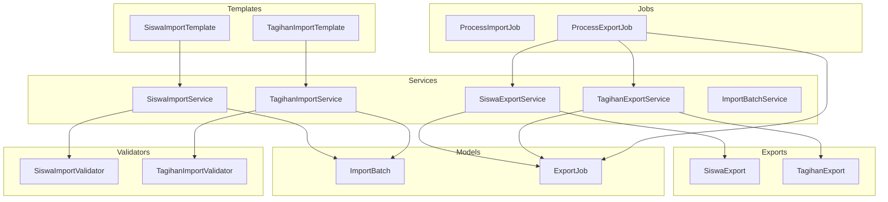
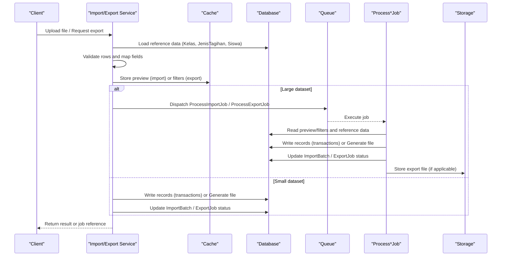
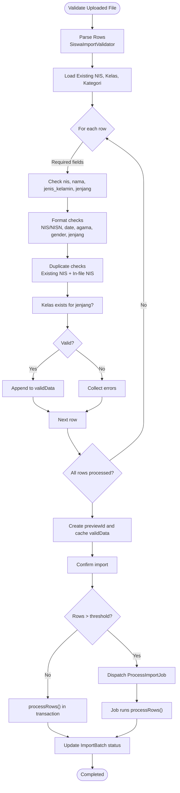
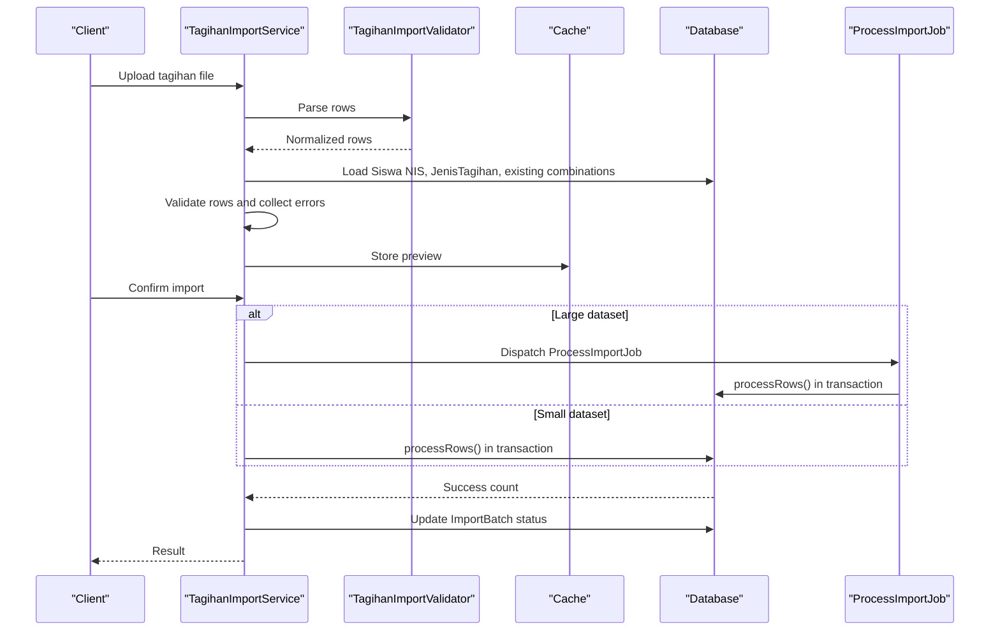
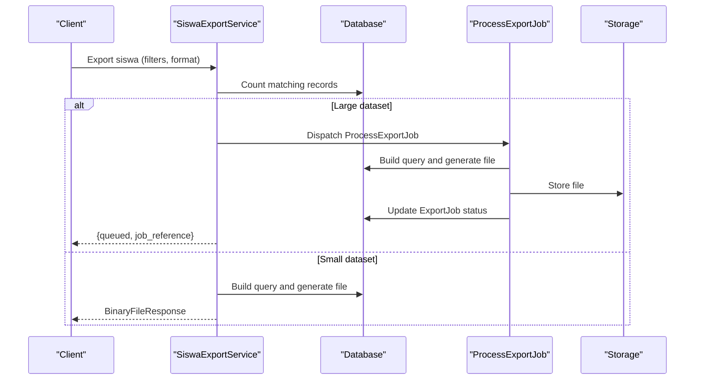
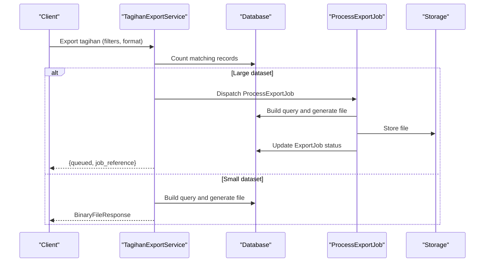
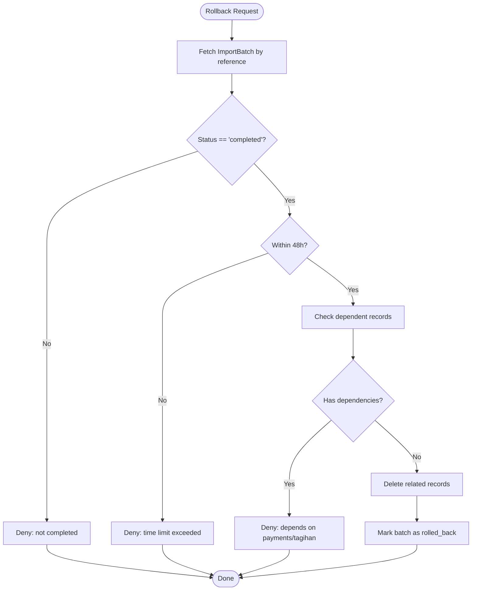
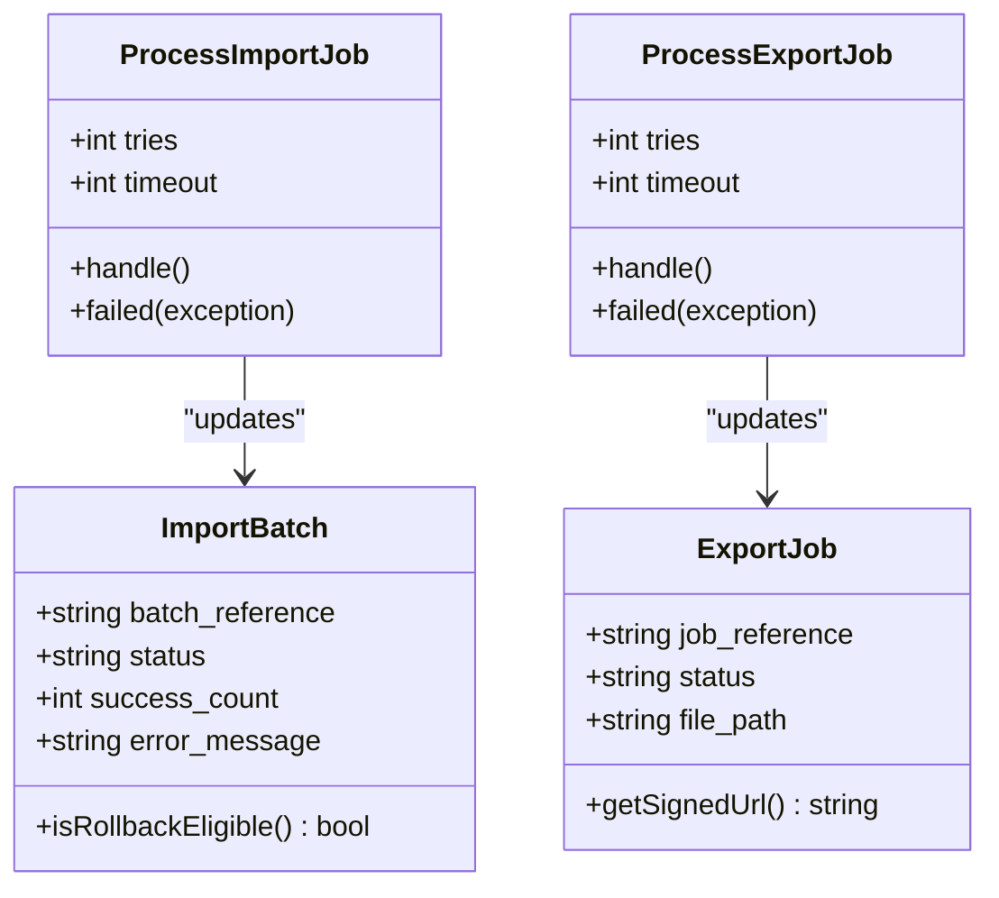
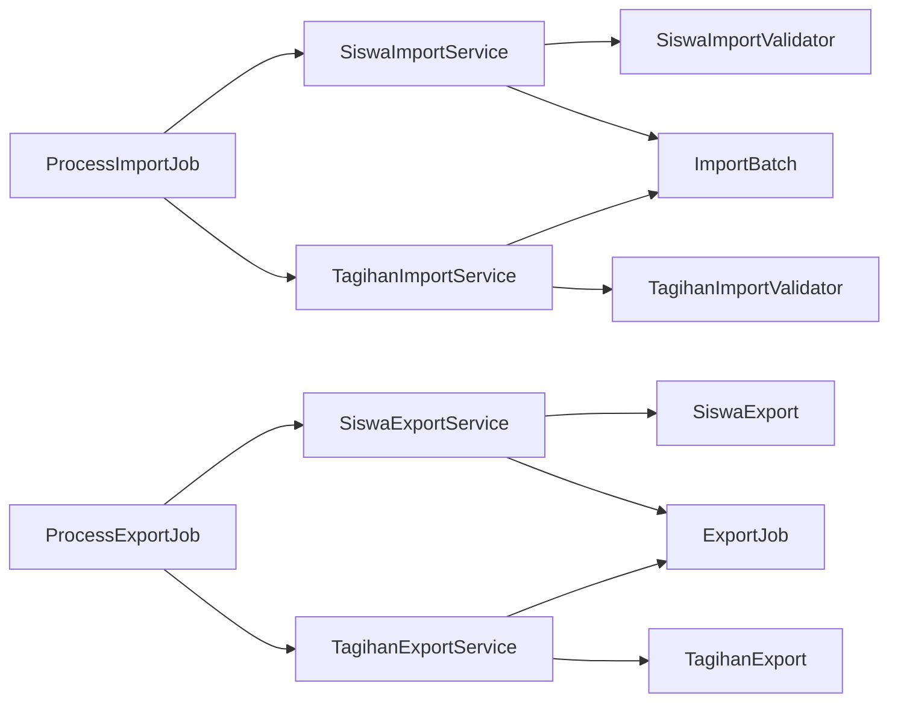

# Import & Export System

<cite>
**Referenced Files in This Document**
- [SiswaImportService.php](file://backend/app/Services/ImportExport/SiswaImportService.php)
- [TagihanImportService.php](file://backend/app/Services/ImportExport/TagihanImportService.php)
- [SiswaExportService.php](file://backend/app/Services/ImportExport/SiswaExportService.php)
- [TagihanExportService.php](file://backend/app/Services/ImportExport/TagihanExportService.php)
- [ImportBatchService.php](file://backend/app/Services/ImportExport/ImportBatchService.php)
- [SiswaImportValidator.php](file://backend/app/Imports/SiswaImportValidator.php)
- [TagihanImportValidator.php](file://backend/app/Imports/TagihanImportValidator.php)
- [ProcessImportJob.php](file://backend/app/Jobs/ProcessImportJob.php)
- [ProcessExportJob.php](file://backend/app/Jobs/ProcessExportJob.php)
- [SiswaExport.php](file://backend/app/Exports/SiswaExport.php)
- [TagihanExport.php](file://backend/app/Exports/TagihanExport.php)
- [SiswaImportTemplate.php](file://backend/app/Exports/SiswaImportTemplate.php)
- [TagihanImportTemplate.php](file://backend/app/Exports/TagihanImportTemplate.php)
- [ImportBatch.php](file://backend/app/Models/ImportBatch.php)
- [ExportJob.php](file://backend/app/Models/ExportJob.php)
</cite>

## Table of Contents
1. Introduction
2. Project Structure
3. Core Components
4. Architecture Overview
5. Detailed Component Analysis
6. Dependency Analysis
7. Performance Considerations
8. Troubleshooting Guide
9. Conclusion

## Introduction
This document explains the Handayani platform’s import and export system for bulk operations on Siswa (student) and Tagihan (invoice) entities. It covers validation, data mapping, conflict resolution, background job processing, progress tracking, error reporting, rollback mechanisms, and performance optimization strategies. The system supports both synchronous and asynchronous workflows depending on dataset size, with robust integrity checks and clear audit trails.

## Project Structure
The import/export subsystem is organized by domain services, Excel validators/templates, jobs, and models:
- Services orchestrate validation, transformation, persistence, and export generation.
- Validators parse and normalize uploaded files using Maatwebsite Excel readers.
- Jobs handle long-running imports and exports asynchronously.
- Models track batch progress and export job status.

**Diagram sources**
- [SiswaImportService.php](file://backend/app/Services/ImportExport/SiswaImportService.php)
- [TagihanImportService.php](file://backend/app/Services/ImportExport/TagihanImportService.php)
- [SiswaExportService.php](file://backend/app/Services/ImportExport/SiswaExportService.php)
- [TagihanExportService.php](file://backend/app/Services/ImportExport/TagihanExportService.php)
- [ImportBatchService.php](file://backend/app/Services/ImportExport/ImportBatchService.php)
- [SiswaImportValidator.php](file://backend/app/Imports/SiswaImportValidator.php)
- [TagihanImportValidator.php](file://backend/app/Imports/TagihanImportValidator.php)
- [ProcessImportJob.php](file://backend/app/Jobs/ProcessImportJob.php)
- [ProcessExportJob.php](file://backend/app/Jobs/ProcessExportJob.php)
- [SiswaExport.php](file://backend/app/Exports/SiswaExport.php)
- [TagihanExport.php](file://backend/app/Exports/TagihanExport.php)
- [SiswaImportTemplate.php](file://backend/app/Exports/SiswaImportTemplate.php)
- [TagihanImportTemplate.php](file://backend/app/Exports/TagihanImportTemplate.php)
- [ImportBatch.php](file://backend/app/Models/ImportBatch.php)
- [ExportJob.php](file://backend/app/Models/ExportJob.php)

**Section sources**
- [SiswaImportService.php](file://backend/app/Services/ImportExport/SiswaImportService.php)
- [TagihanImportService.php](file://backend/app/Services/ImportExport/TagihanImportService.php)
- [SiswaExportService.php](file://backend/app/Services/ImportExport/SiswaExportService.php)
- [TagihanExportService.php](file://backend/app/Services/ImportExport/TagihanExportService.php)
- [ImportBatchService.php](file://backend/app/Services/ImportExport/ImportBatchService.php)
- [SiswaImportValidator.php](file://backend/app/Imports/SiswaImportValidator.php)
- [TagihanImportValidator.php](file://backend/app/Imports/TagihanImportValidator.php)
- [ProcessImportJob.php](file://backend/app/Jobs/ProcessImportJob.php)
- [ProcessExportJob.php](file://backend/app/Jobs/ProcessExportJob.php)
- [SiswaExport.php](file://backend/app/Exports/SiswaExport.php)
- [TagihanExport.php](file://backend/app/Exports/TagihanExport.php)
- [SiswaImportTemplate.php](file://backend/app/Exports/SiswaImportTemplate.php)
- [TagihanImportTemplate.php](file://backend/app/Exports/TagihanImportTemplate.php)
- [ImportBatch.php](file://backend/app/Models/ImportBatch.php)
- [ExportJob.php](file://backend/app/Models/ExportJob.php)

## Core Components
- Import services: SiswaImportService and TagihanImportService provide validate, confirm, processInBackground, and processRows methods. They parse files via validators, cache previews, enforce business rules, create ImportBatch records, and either process synchronously or dispatch ProcessImportJob for large datasets.
- Export services: SiswaExportService and TagihanExportService build queries, count results, generate files synchronously, or dispatch ProcessExportJob for large datasets. They return file responses or queued job references.
- Batch management: ImportBatchService tracks history, eligibility, rollback, and status updates.
- Validators: SiswaImportValidator and TagihanImportValidator normalize headers and rows from Excel uploads.
- Jobs: ProcessImportJob and ProcessExportJob execute long-running tasks with retries and timeouts, updating ImportBatch and ExportJob records accordingly.
- Exports: SiswaExport and TagihanExport define headings, mappings, chunking, and class relationships for output formatting.
- Templates: SiswaImportTemplate and TagihanImportTemplate provide downloadable templates with dropdown validations and reference sheets.

**Section sources**
- [SiswaImportService.php](file://backend/app/Services/ImportExport/SiswaImportService.php)
- [TagihanImportService.php](file://backend/app/Services/ImportExport/TagihanImportService.php)
- [SiswaExportService.php](file://backend/app/Services/ImportExport/SiswaExportService.php)
- [TagihanExportService.php](file://backend/app/Services/ImportExport/TagihanExportService.php)
- [ImportBatchService.php](file://backend/app/Services/ImportExport/ImportBatchService.php)
- [SiswaImportValidator.php](file://backend/app/Imports/SiswaImportValidator.php)
- [TagihanImportValidator.php](file://backend/app/Imports/TagihanImportValidator.php)
- [ProcessImportJob.php](file://backend/app/Jobs/ProcessImportJob.php)
- [ProcessExportJob.php](file://backend/app/Jobs/ProcessExportJob.php)
- [SiswaExport.php](file://backend/app/Exports/SiswaExport.php)
- [TagihanExport.php](file://backend/app/Exports/TagihanExport.php)
- [SiswaImportTemplate.php](file://backend/app/Exports/SiswaImportTemplate.php)
- [TagihanImportTemplate.php](file://backend/app/Exports/TagihanImportTemplate.php)

## Architecture Overview
The system uses a layered architecture:
- Controllers (not analyzed here) call services to initiate imports/exports.
- Services coordinate parsing, validation, caching, transactions, and job dispatching.
- Jobs perform heavy lifting off the request thread.
- Models persist batch/job state and support signed download URLs for completed exports.

**Diagram sources**
- [SiswaImportService.php](file://backend/app/Services/ImportExport/SiswaImportService.php)
- [TagihanImportService.php](file://backend/app/Services/ImportExport/TagihanImportService.php)
- [SiswaExportService.php](file://backend/app/Services/ImportExport/SiswaExportService.php)
- [TagihanExportService.php](file://backend/app/Services/ImportExport/TagihanExportService.php)
- [ProcessImportJob.php](file://backend/app/Jobs/ProcessImportJob.php)
- [ProcessExportJob.php](file://backend/app/Jobs/ProcessExportJob.php)
- [ImportBatch.php](file://backend/app/Models/ImportBatch.php)
- [ExportJob.php](file://backend/app/Models/ExportJob.php)

## Detailed Component Analysis

### Siswa Import Flow
- Validation: Parses rows via SiswaImportValidator, enforces required fields, formats, allowed values, duplicate NIS checks (in-file and existing), and kelas existence within branch/jenjang.
- Preview: Caches valid rows and counts; returns ImportPreviewDTO including requiresQueue flag based on threshold.
- Confirmation: Creates ImportBatch, validates active academic period, then either processes synchronously or dispatches ProcessImportJob.
- Processing: Within a transaction, creates Ayah/Ibu/Wali if provided, resolves Kelas/Kategori, creates Siswa and SiswaKelas, increments success count.

**Diagram sources**
- [SiswaImportService.php](file://backend/app/Services/ImportExport/SiswaImportService.php)
- [SiswaImportValidator.php](file://backend/app/Imports/SiswaImportValidator.php)
- [ProcessImportJob.php](file://backend/app/Jobs/ProcessImportJob.php)
- [ImportBatch.php](file://backend/app/Models/ImportBatch.php)

**Section sources**
- [SiswaImportService.php](file://backend/app/Services/ImportExport/SiswaImportService.php)
- [SiswaImportValidator.php](file://backend/app/Imports/SiswaImportValidator.php)
- [ProcessImportJob.php](file://backend/app/Jobs/ProcessImportJob.php)
- [ImportBatch.php](file://backend/app/Models/ImportBatch.php)

### Tagihan Import Flow
- Validation: Parses rows via TagihanImportValidator, ensures NIS exists, JenisTagihan exists for active period, and prevents duplicates (existing and intra-file).
- Preview and confirmation: Similar to Siswa flow; caches preview and decides sync vs async.
- Processing: Resolves JenisTagihan, generates kode_tagihan, creates Tagihan records within a transaction.

**Diagram sources**
- [TagihanImportService.php](file://backend/app/Services/ImportExport/TagihanImportService.php)
- [TagihanImportValidator.php](file://backend/app/Imports/TagihanImportValidator.php)
- [ProcessImportJob.php](file://backend/app/Jobs/ProcessImportJob.php)
- [ImportBatch.php](file://backend/app/Models/ImportBatch.php)

**Section sources**
- [TagihanImportService.php](file://backend/app/Services/ImportExport/TagihanImportService.php)
- [TagihanImportValidator.php](file://backend/app/Imports/TagihanImportValidator.php)
- [ProcessImportJob.php](file://backend/app/Jobs/ProcessImportJob.php)
- [ImportBatch.php](file://backend/app/Models/ImportBatch.php)

### Siswa Export Flow
- Query building: Scopes to branch, optionally filters by tahun_ajaran_id, jenjang, kelas_id, status; joins siswa_kelas when needed.
- Generation: If record count exceeds threshold, dispatches ProcessExportJob; otherwise generates file synchronously and returns BinaryFileResponse.
- Output mapping: SiswaExport maps fields including resolved kelas name and parent/wali info.

**Diagram sources**
- [SiswaExportService.php](file://backend/app/Services/ImportExport/SiswaExportService.php)
- [SiswaExport.php](file://backend/app/Exports/SiswaExport.php)
- [ProcessExportJob.php](file://backend/app/Jobs/ProcessExportJob.php)
- [ExportJob.php](file://backend/app/Models/ExportJob.php)

**Section sources**
- [SiswaExportService.php](file://backend/app/Services/ImportExport/SiswaExportService.php)
- [SiswaExport.php](file://backend/app/Exports/SiswaExport.php)
- [ProcessExportJob.php](file://backend/app/Jobs/ProcessExportJob.php)
- [ExportJob.php](file://backend/app/Models/ExportJob.php)

### Tagihan Export Flow
- Query building: Scopes to branch, filters by tahun_ajaran_id, status, jenjang, kelas_id; joins siswa and siswa_kelas when needed.
- Generation: Same threshold-based decision as Siswa export.
- Output mapping: TagihanExport computes totals and sisa, resolves kelas name via siswa relations.

**Diagram sources**
- [TagihanExportService.php](file://backend/app/Services/ImportExport/TagihanExportService.php)
- [TagihanExport.php](file://backend/app/Exports/TagihanExport.php)
- [ProcessExportJob.php](file://backend/app/Jobs/ProcessExportJob.php)
- [ExportJob.php](file://backend/app/Models/ExportJob.php)

**Section sources**
- [TagihanExportService.php](file://backend/app/Services/ImportExport/TagihanExportService.php)
- [TagihanExport.php](file://backend/app/Exports/TagihanExport.php)
- [ProcessExportJob.php](file://backend/app/Jobs/ProcessExportJob.php)
- [ExportJob.php](file://backend/app/Models/ExportJob.php)

### Import Batch Management and Rollback
- History: Lists batches per branch with user details.
- Eligibility: Only completed batches within 48 hours can be rolled back; additional constraints prevent rollback if dependent records exist (e.g., siswa with tagihan, tagihan with pembayaran).
- Rollback: Deletes related records (SiswaKelas, Siswa or Tagihan) and marks batch as rolled_back with auditor info.

**Diagram sources**
- [ImportBatchService.php](file://backend/app/Services/ImportExport/ImportBatchService.php)
- [ImportBatch.php](file://backend/app/Models/ImportBatch.php)

**Section sources**
- [ImportBatchService.php](file://backend/app/Services/ImportExport/ImportBatchService.php)
- [ImportBatch.php](file://backend/app/Models/ImportBatch.php)

### Data Mapping and Validation Rules
- Siswa mapping:
  - Required: nis, nama, jenis_kelamin, jenjang.
  - Formats: NIS numeric up to 20 chars; NISN exactly 10 digits; tanggal_lahir YYYY-MM-DD; agama from allowed list; jenis_kelamin L/P; jenjang TK/MI/KB.
  - Duplicates: NIS must not exist in DB or within file.
  - Kelas: Must exist for given jenjang within branch.
  - Parent/wali optional creation; kategori optional resolution.
- Tagihan mapping:
  - Required: nis, jenis_tagihan.
  - References: NIS must exist; jenis_tagihan must exist for active period.
  - Duplicates: Combination (nis + jenis_tagihan) must not exist in DB or within file.

**Section sources**
- [SiswaImportService.php](file://backend/app/Services/ImportExport/SiswaImportService.php)
- [TagihanImportService.php](file://backend/app/Services/ImportExport/TagihanImportService.php)
- [SiswaImportValidator.php](file://backend/app/Imports/SiswaImportValidator.php)
- [TagihanImportValidator.php](file://backend/app/Imports/TagihanImportValidator.php)

### Background Jobs and Progress Tracking
- Import jobs:
  - ProcessImportJob reads cached preview, validates active period, calls service processRows(), updates ImportBatch status, clears cache.
  - Retries and timeout configured; failed method persists error_message.
- Export jobs:
  - ProcessExportJob builds queries via services, stores files to local storage, updates ExportJob status and file_path, provides signed URL via model helper.
  - Supports multiple export types (siswa, tagihan, pembayaran, kas_harian, rekap_bulanan).

**Diagram sources**
- [ProcessImportJob.php](file://backend/app/Jobs/ProcessImportJob.php)
- [ProcessExportJob.php](file://backend/app/Jobs/ProcessExportJob.php)
- [ImportBatch.php](file://backend/app/Models/ImportBatch.php)
- [ExportJob.php](file://backend/app/Models/ExportJob.php)

**Section sources**
- [ProcessImportJob.php](file://backend/app/Jobs/ProcessImportJob.php)
- [ProcessExportJob.php](file://backend/app/Jobs/ProcessExportJob.php)
- [ImportBatch.php](file://backend/app/Models/ImportBatch.php)
- [ExportJob.php](file://backend/app/Models/ExportJob.php)

### Custom Import/Export Templates
- Siswa template:
  - Provides column headers and example row.
  - Adds dropdown validations for jenis_kelamin, agama, jenjang, kelas, status.
- Tagihan template:
  - Multi-sheet structure with main import sheet and reference sheet listing available jenis_tagihan names for the active period.

Practical usage:
- Download templates to ensure correct column names and allowed values.
- Populate data according to validation rules before uploading.

**Section sources**
- [SiswaImportTemplate.php](file://backend/app/Exports/SiswaImportTemplate.php)
- [TagihanImportTemplate.php](file://backend/app/Exports/TagihanImportTemplate.php)

### Handling Large Datasets
- Imports:
  - Threshold: 500 rows triggers queue dispatch via ProcessImportJob.
  - Preview caching allows safe confirmation later.
- Exports:
  - Threshold: 1000 records triggers queue dispatch via ProcessExportJob.
  - Chunked reading reduces memory footprint during export.

Best practices:
- Use templates to minimize validation errors.
- Monitor job status via ImportBatch/ExportJob records.
- For very large datasets, prefer async flows and scheduled workers.

**Section sources**
- [SiswaImportService.php](file://backend/app/Services/ImportExport/SiswaImportService.php)
- [TagihanImportService.php](file://backend/app/Services/ImportExport/TagihanImportService.php)
- [SiswaExportService.php](file://backend/app/Services/ImportExport/SiswaExportService.php)
- [TagihanExportService.php](file://backend/app/Services/ImportExport/TagihanExportService.php)
- [SiswaExport.php](file://backend/app/Exports/SiswaExport.php)
- [TagihanExport.php](file://backend/app/Exports/TagihanExport.php)

### Data Transformation Logic
- Siswa:
  - Optional creation of Ayah/Ibu/Wali records from imported fields.
  - Resolution of kelas_id and kategori_id by name lookup.
  - Creation of SiswaKelas entry linked to current academic year.
- Tagihan:
  - Generation of unique kode_tagihan.
  - Assignment of default status and tmp values.

Implementation paths:
- Siswa transformation logic resides in SiswaImportService.processRows().
- Tagihan transformation logic resides in TagihanImportService.processRows().

**Section sources**
- [SiswaImportService.php](file://backend/app/Services/ImportExport/SiswaImportService.php)
- [TagihanImportService.php](file://backend/app/Services/ImportExport/TagihanImportService.php)

## Dependency Analysis
Key dependencies and relationships:
- Services depend on validators for parsing, models for persistence, and jobs for async execution.
- Jobs depend on services to build queries and perform transformations.
- Export models implement Maatwebsite interfaces for headings, mapping, and chunking.
- ImportBatch and ExportJob models store operational metadata and support signed downloads.

**Diagram sources**
- [SiswaImportService.php](file://backend/app/Services/ImportExport/SiswaImportService.php)
- [TagihanImportService.php](file://backend/app/Services/ImportExport/TagihanImportService.php)
- [SiswaExportService.php](file://backend/app/Services/ImportExport/SiswaExportService.php)
- [TagihanExportService.php](file://backend/app/Services/ImportExport/TagihanExportService.php)
- [SiswaImportValidator.php](file://backend/app/Imports/SiswaImportValidator.php)
- [TagihanImportValidator.php](file://backend/app/Imports/TagihanImportValidator.php)
- [ProcessImportJob.php](file://backend/app/Jobs/ProcessImportJob.php)
- [ProcessExportJob.php](file://backend/app/Jobs/ProcessExportJob.php)
- [SiswaExport.php](file://backend/app/Exports/SiswaExport.php)
- [TagihanExport.php](file://backend/app/Exports/TagihanExport.php)
- [ImportBatch.php](file://backend/app/Models/ImportBatch.php)
- [ExportJob.php](file://backend/app/Models/ExportJob.php)

**Section sources**
- [SiswaImportService.php](file://backend/app/Services/ImportExport/SiswaImportService.php)
- [TagihanImportService.php](file://backend/app/Services/ImportExport/TagihanImportService.php)
- [SiswaExportService.php](file://backend/app/Services/ImportExport/SiswaExportService.php)
- [TagihanExportService.php](file://backend/app/Services/ImportExport/TagihanExportService.php)
- [SiswaImportValidator.php](file://backend/app/Imports/SiswaImportValidator.php)
- [TagihanImportValidator.php](file://backend/app/Imports/TagihanImportValidator.php)
- [ProcessImportJob.php](file://backend/app/Jobs/ProcessImportJob.php)
- [ProcessExportJob.php](file://backend/app/Jobs/ProcessExportJob.php)
- [SiswaExport.php](file://backend/app/Exports/SiswaExport.php)
- [TagihanExport.php](file://backend/app/Exports/TagihanExport.php)
- [ImportBatch.php](file://backend/app/Models/ImportBatch.php)
- [ExportJob.php](file://backend/app/Models/ExportJob.php)

## Performance Considerations
- Asynchronous processing:
  - Imports above 500 rows are queued to avoid blocking requests.
  - Exports above 1000 records are queued to reduce server load.
- Chunked reading:
  - Export classes use chunk sizes to manage memory efficiently.
- Transactional writes:
  - Import processing wraps inserts in transactions to maintain consistency.
- Reference data loading:
  - Preload reference sets (kelas, jenis_tagihan) to minimize repeated queries.
- Signed URLs:
  - ExportJob provides secure temporary links for downloads.

[No sources needed since this section provides general guidance]

## Troubleshooting Guide
Common issues and resolutions:
- Preview expired:
  - Cause: Cache TTL elapsed before confirmation.
  - Action: Re-upload the file to regenerate preview.
- Active period missing:
  - Cause: No active TahunAjaran for branch.
  - Action: Configure active academic period before importing.
- Duplicate NIS or combination:
  - Cause: Existing or intra-file duplicates detected.
  - Action: Correct or remove duplicates in the file.
- Invalid kelas or jenis_tagihan:
  - Cause: Mismatched names or missing references.
  - Action: Use templates and ensure exact matches.
- Rollback denied:
  - Cause: Not completed, time limit exceeded, or dependent records exist.
  - Action: Resolve dependencies or wait until eligible window.
- Job failures:
  - Cause: Exceptions during processing.
  - Action: Check ImportBatch/ExportJob error_message and retry after fixing inputs.

**Section sources**
- [SiswaImportService.php](file://backend/app/Services/ImportExport/SiswaImportService.php)
- [TagihanImportService.php](file://backend/app/Services/ImportExport/TagihanImportService.php)
- [ProcessImportJob.php](file://backend/app/Jobs/ProcessImportJob.php)
- [ProcessExportJob.php](file://backend/app/Jobs/ProcessExportJob.php)
- [ImportBatchService.php](file://backend/app/Services/ImportExport/ImportBatchService.php)
- [ExportJob.php](file://backend/app/Models/ExportJob.php)

## Conclusion
The Handayani import/export system provides robust, scalable bulk operations for Siswa and Tagihan data. It combines strict validation, clear mapping rules, and resilient background processing with comprehensive auditability through ImportBatch and ExportJob records. By leveraging templates, queues, and transactions, it ensures data integrity, performance, and a smooth user experience for large-scale operations.