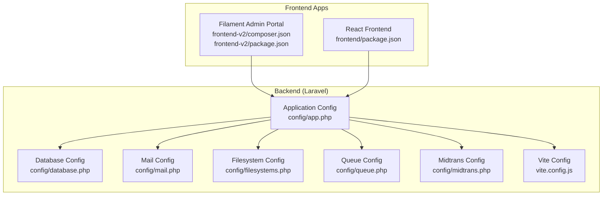
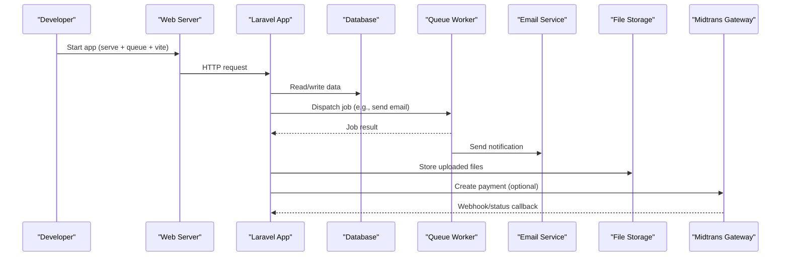
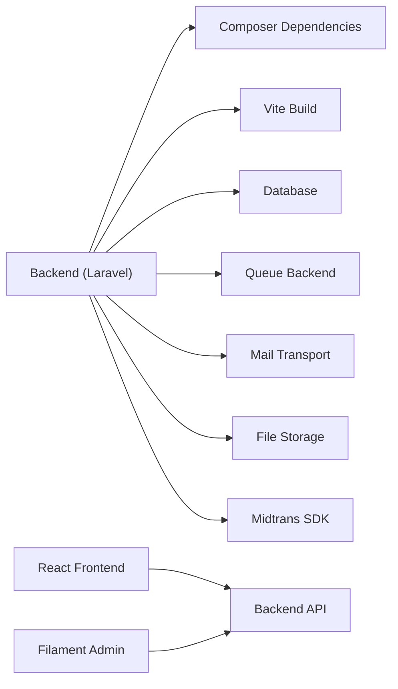

# Installation & Setup

<cite>
**Referenced Files in This Document**
- [composer.json](file://backend/composer.json)
- [package.json](file://backend/package.json)
- [vite.config.js](file://backend/vite.config.js)
- [app.php](file://backend/config/app.php)
- [database.php](file://backend/config/database.php)
- [mail.php](file://backend/config/mail.php)
- [filesystems.php](file://backend/config/filesystems.php)
- [queue.php](file://backend/config/queue.php)
- [midtrans.php](file://backend/config/midtrans.php)
- [frontend package.json](file://frontend/package.json)
- [frontend-v2 composer.json](file://frontend-v2/composer.json)
- [frontend-v2 package.json](file://frontend-v2/package.json)
</cite>

## Table of Contents
1. Introduction
2. Project Structure
3. Core Components
4. Architecture Overview
5. Detailed Component Analysis
6. Dependency Analysis
7. Performance Considerations
8. Troubleshooting Guide
9. Conclusion

## Introduction
This guide provides comprehensive installation and setup instructions for the Handayani system, covering environment requirements, database configuration, third-party services (Midtrans payment gateway, email, file storage), development workflow, and production deployment. It includes both basic steps for beginners and advanced options for experienced developers.

## Project Structure
Handayani consists of:
- Backend API and admin portal built with Laravel 12 (PHP 8.2+)
- Two frontend applications:
  - A React-based frontend under frontend/
  - A Filament/Livewire admin portal under frontend-v2/
- Shared backend assets compiled via Vite

**Diagram sources**
- [app.php:1-127](file://backend/config/app.php#L1-L127)
- [database.php:1-184](file://backend/config/database.php#L1-L184)
- [mail.php:1-119](file://backend/config/mail.php#L1-L119)
- [filesystems.php:1-81](file://backend/config/filesystems.php#L1-L81)
- [queue.php:1-130](file://backend/config/queue.php#L1-L130)
- [midtrans.php:1-130](file://backend/config/midtrans.php#L1-L130)
- [vite.config.js:1-14](file://backend/vite.config.js#L1-L14)
- [frontend package.json:1-34](file://frontend/package.json#L1-L34)
- [frontend-v2 composer.json:1-94](file://frontend-v2/composer.json#L1-L94)
- [frontend-v2 package.json:1-22](file://frontend-v2/package.json#L1-L22)

**Section sources**
- [composer.json:1-97](file://backend/composer.json#L1-L97)
- [package.json:1-18](file://backend/package.json#L1-L18)
- [vite.config.js:1-14](file://backend/vite.config.js#L1-L14)
- [frontend package.json:1-34](file://frontend/package.json#L1-L34)
- [frontend-v2 composer.json:1-94](file://frontend-v2/composer.json#L1-L94)
- [frontend-v2 package.json:1-22](file://frontend-v2/package.json#L1-L22)

## Core Components
- PHP runtime and extensions: PHP 8.2+ required by both backend packages.
- Database: MySQL/MariaDB recommended; SQLite supported for local dev.
- Node.js and npm: Required for asset compilation (Vite).
- Composer: For PHP dependencies.
- Queue worker: Background processing for jobs and notifications.
- Filesystem: Local or S3-compatible storage.
- Email: SMTP or other transports configured via mail settings.
- Midtrans: Payment gateway integration with sandbox/production toggle.

Key environment variables are read from application config files and .env. Ensure your .env is present and correctly set before running migrations and building assets.

**Section sources**
- [composer.json:11-22](file://backend/composer.json#L11-L22)
- [frontend-v2 composer.json:8-17](file://frontend-v2/composer.json#L8-L17)
- [database.php:19-116](file://backend/config/database.php#L19-L116)
- [mail.php:17-119](file://backend/config/mail.php#L17-L119)
- [filesystems.php:16-63](file://backend/config/filesystems.php#L16-L63)
- [queue.php:16-92](file://backend/config/queue.php#L16-L92)
- [midtrans.php:15-127](file://backend/config/midtrans.php#L15-L127)

## Architecture Overview
The system uses a Laravel backend serving APIs and powering the Filament admin portal. The React frontend consumes the API. Assets are compiled using Vite. Background jobs run via queue workers.

[No sources needed since this diagram shows conceptual workflow, not actual code structure]

## Detailed Component Analysis

### Environment Requirements
- PHP 8.2+
- MySQL or MariaDB (recommended), or SQLite for local development
- Node.js and npm (for Vite asset pipeline)
- Composer (for PHP dependencies)
- Optional: Redis/SQS/Beanstalkd for queues; S3-compatible storage for files

Verify PHP version and ensure PDO extensions are enabled for your chosen database driver.

**Section sources**
- [composer.json:11-22](file://backend/composer.json#L11-L22)
- [frontend-v2 composer.json:8-17](file://frontend-v2/composer.json#L8-L17)
- [database.php:46-84](file://backend/config/database.php#L46-L84)

### Step-by-Step Installation

#### 1. Clone and prepare the repository
- Clone the repository to your workspace.
- Navigate to the backend directory.

#### 2. Install PHP dependencies
- Run the Composer setup script to install dependencies, copy .env.example to .env, generate the application key, and run migrations.

**Section sources**
- [composer.json:44-52](file://backend/composer.json#L44-L52)

#### 3. Configure the environment (.env)
Ensure the following variables are set in .env:
- Application: APP_NAME, APP_ENV, APP_DEBUG, APP_URL, APP_KEY, APP_LOCALE, APP_FALLBACK_LOCALE, APP_FAKER_LOCALE
- Database: DB_CONNECTION, DB_HOST, DB_PORT, DB_DATABASE, DB_USERNAME, DB_PASSWORD, DB_CHARSET, DB_COLLATION
- Queue: QUEUE_CONNECTION, and driver-specific settings if using database, redis, sqs, beanstalkd
- Mail: MAIL_MAILER and transport-specific settings (SMTP, SES, Postmark, etc.)
- Filesystem: FILESYSTEM_DISK and S3 credentials if using s3
- Midtrans: HANDAYANI_MIDTRANS_ENABLED, MIDTRANS_ENVIRONMENT, MIDTRANS_SERVER_KEY, MIDTRANS_CLIENT_KEY, MIDTRANS_MERCHANT_ID, MIDTRANS_ORDER_PREFIX, MIDTRANS_FINISH_URL, MIDTRANS_LOG_RETENTION_DAYS

If you do not have an .env file, use the provided scripts to create one and generate the key.

**Section sources**
- [app.php:16-106](file://backend/config/app.php#L16-L106)
- [database.php:19-116](file://backend/config/database.php#L19-L116)
- [queue.php:16-92](file://backend/config/queue.php#L16-L92)
- [mail.php:17-119](file://backend/config/mail.php#L17-L119)
- [filesystems.php:16-63](file://backend/config/filesystems.php#L16-L63)
- [midtrans.php:15-127](file://backend/config/midtrans.php#L15-L127)

#### 4. Database setup
- Choose a database connection (MySQL/MariaDB recommended).
- Create the database and user with appropriate privileges.
- Run migrations to create tables.

For local development, SQLite can be used by setting DB_CONNECTION=sqlite and ensuring the database file exists.

**Section sources**
- [database.php:19-116](file://backend/config/database.php#L19-L116)

#### 5. Asset compilation (Vite)
- Install Node dependencies and build assets.
- In development, run the Vite dev server alongside the Laravel server.

**Section sources**
- [package.json:5-16](file://backend/package.json#L5-L16)
- [vite.config.js:5-12](file://backend/vite.config.js#L5-L12)

#### 6. Queue workers
- Use the database queue driver by default.
- Start a queue worker process to handle background jobs.

**Section sources**
- [queue.php:16-45](file://backend/config/queue.php#L16-L45)

#### 7. Third-party service setup

##### Midtrans Payment Gateway
- Set HANDAYANI_MIDTRANS_ENABLED=true to enable payments.
- Configure MIDTRANS_ENVIRONMENT=sandbox or production.
- Provide MIDTRANS_SERVER_KEY, MIDTRANS_CLIENT_KEY, MIDTRANS_MERCHANT_ID.
- Optionally configure fee structures per channel and order prefix.
- Set MIDTRANS_FINISH_URL to redirect after Snap payment flow.
- Enable/disable webhook handling independently via HANDAYANI_MIDTRANS_WEBHOOK_ENABLED.

**Section sources**
- [midtrans.php:15-127](file://backend/config/midtrans.php#L15-L127)

##### Email Services
- Choose a mailer (SMTP, SES, Postmark, Resend, Log, Array, Failover, Roundrobin).
- Configure host, port, username, password, scheme, and URL as needed.
- Set global from address and name.

**Section sources**
- [mail.php:17-119](file://backend/config/mail.php#L17-L119)

##### File Storage
- Default disk is local; public files are served via /storage symlink.
- For cloud storage, configure S3 disk with AWS keys, region, bucket, and optional endpoint/path-style settings.

**Section sources**
- [filesystems.php:16-63](file://backend/config/filesystems.php#L16-L63)

### Development Workflow

#### Backend development
- Use the provided Composer script to start the server, queue listener, and Vite dev server concurrently.

**Section sources**
- [composer.json:53-56](file://backend/composer.json#L53-L56)

#### Frontend apps
- React frontend: install dependencies and run dev/build scripts.
- Filament admin portal (frontend-v2): install dependencies and run dev/build scripts.

**Section sources**
- [frontend package.json:6-11](file://frontend/package.json#L6-L11)
- [frontend-v2 package.json:5-8](file://frontend-v2/package.json#L5-L8)

### Production Deployment

#### Environment variables
- Set APP_ENV=production, APP_DEBUG=false, APP_URL to your domain.
- Generate a secure APP_KEY.
- Configure database credentials for production.
- Securely store Midtrans credentials and disable sandbox mode.
- Set QUEUE_CONNECTION to a robust backend (e.g., database, redis, sqs).
- Configure FILESYSTEM_DISK appropriately (local or s3).
- Configure MAIL_MAILER and transport credentials securely.

**Section sources**
- [app.php:16-106](file://backend/config/app.php#L16-L106)
- [database.php:19-116](file://backend/config/database.php#L19-L116)
- [queue.php:16-92](file://backend/config/queue.php#L16-L92)
- [filesystems.php:16-63](file://backend/config/filesystems.php#L16-L63)
- [mail.php:17-119](file://backend/config/mail.php#L17-L119)
- [midtrans.php:15-127](file://backend/config/midtrans.php#L15-L127)

#### Security configurations
- Ensure APP_DEBUG is disabled in production.
- Protect private keys and secrets; never expose server_key in responses.
- Restrict access to sensitive directories and logs.
- Use HTTPS and enforce secure cookies/session settings at the web server level.

**Section sources**
- [app.php:29-42](file://backend/config/app.php#L29-L42)
- [midtrans.php:26-35](file://backend/config/midtrans.php#L26-L35)

#### Performance optimizations
- Optimize autoloader and cache configuration.
- Precompile assets with Vite for production builds.
- Use a persistent queue backend (Redis/SQS) and tune retry_after and worker processes.
- Enable database query caching and consider Redis for cache/session where applicable.

**Section sources**
- [composer.json:85-92](file://backend/composer.json#L85-L92)
- [queue.php:38-74](file://backend/config/queue.php#L38-L74)
- [package.json:5-8](file://backend/package.json#L5-L8)

## Dependency Analysis
The backend depends on Laravel 12, Sanctum, Spatie Permission, Maatwebsite Excel, DomPDF, Scramble, and Midtrans SDK. The frontend apps depend on Vite and Tailwind CSS. The admin portal uses Filament and Livewire components.

**Diagram sources**
- [composer.json:11-22](file://backend/composer.json#L11-L22)
- [frontend-v2 composer.json:8-17](file://frontend-v2/composer.json#L8-L17)
- [package.json:9-16](file://backend/package.json#L9-L16)
- [frontend package.json:12-32](file://frontend/package.json#L12-L32)
- [frontend-v2 package.json:9-20](file://frontend-v2/package.json#L9-L20)

**Section sources**
- [composer.json:11-22](file://backend/composer.json#L11-L22)
- [frontend-v2 composer.json:8-17](file://frontend-v2/composer.json#L8-L17)
- [package.json:9-16](file://backend/package.json#L9-L16)
- [frontend package.json:12-32](file://frontend/package.json#L12-L32)
- [frontend-v2 package.json:9-20](file://frontend-v2/package.json#L9-L20)

## Performance Considerations
- Use production-grade queue backends (Redis/SQS) and scale workers based on load.
- Cache frequently accessed data and use database query optimization.
- Serve static assets via CDN when possible.
- Monitor failed jobs and implement alerting.
- Tune Midtrans logging retention to balance observability and storage costs.

[No sources needed since this section provides general guidance]

## Troubleshooting Guide

Common issues and resolutions:
- Missing .env or APP_KEY:
  - Ensure .env exists and APP_KEY is generated.
  - Use the provided Composer scripts to initialize the environment.

- Database connection errors:
  - Verify DB_CONNECTION, DB_HOST, DB_PORT, DB_DATABASE, DB_USERNAME, DB_PASSWORD.
  - Confirm the database exists and the user has privileges.
  - For SQLite, ensure the database file exists and is writable.

- Queue not processing jobs:
  - Check QUEUE_CONNECTION and backend availability (database table, Redis/SQS credentials).
  - Ensure the queue worker is running and retry_after is sufficient for long-running jobs.

- Emails not sending:
  - Validate MAIL_MAILER and transport settings (host, port, credentials).
  - Test with log/array mailers first, then switch to SMTP/SES/Postmark.

- File uploads not visible:
  - Ensure FILESYSTEM_DISK is configured and storage link exists for local disk.
  - For S3, verify credentials, bucket, and endpoint settings.

- Midtrans integration issues:
  - Confirm HANDAYANI_MIDTRANS_ENABLED and MIDTRANS_ENVIRONMENT.
  - Verify MIDTRANS_SERVER_KEY, MIDTRANS_CLIENT_KEY, MIDTRANS_MERCHANT_ID.
  - Check webhook endpoint accessibility and signature verification.

**Section sources**
- [composer.json:44-52](file://backend/composer.json#L44-L52)
- [database.php:19-116](file://backend/config/database.php#L19-L116)
- [queue.php:16-92](file://backend/config/queue.php#L16-L92)
- [mail.php:17-119](file://backend/config/mail.php#L17-L119)
- [filesystems.php:16-63](file://backend/config/filesystems.php#L16-L63)
- [midtrans.php:15-127](file://backend/config/midtrans.php#L15-L127)

## Conclusion
You now have the essential information to install, configure, and deploy the Handayani system across development and production environments. Follow the step-by-step instructions, validate each component (database, queue, mail, storage, Midtrans), and apply security and performance best practices for a robust deployment.