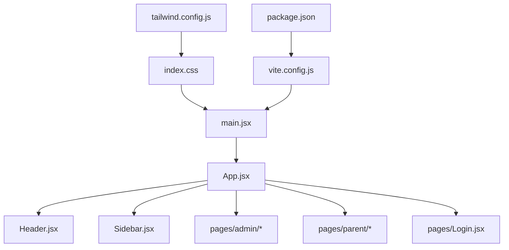
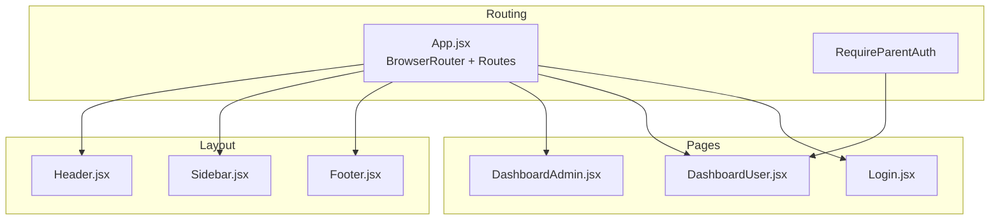
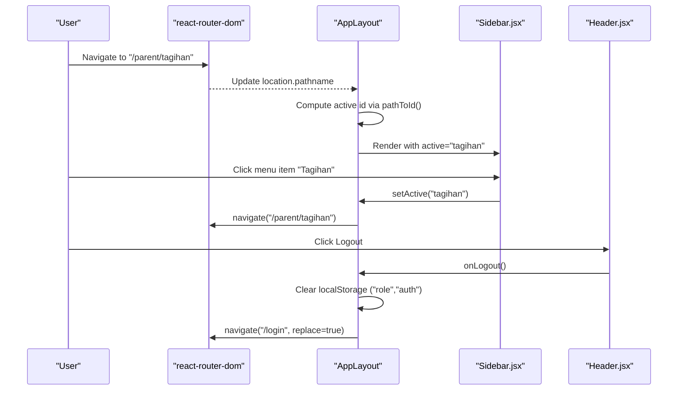
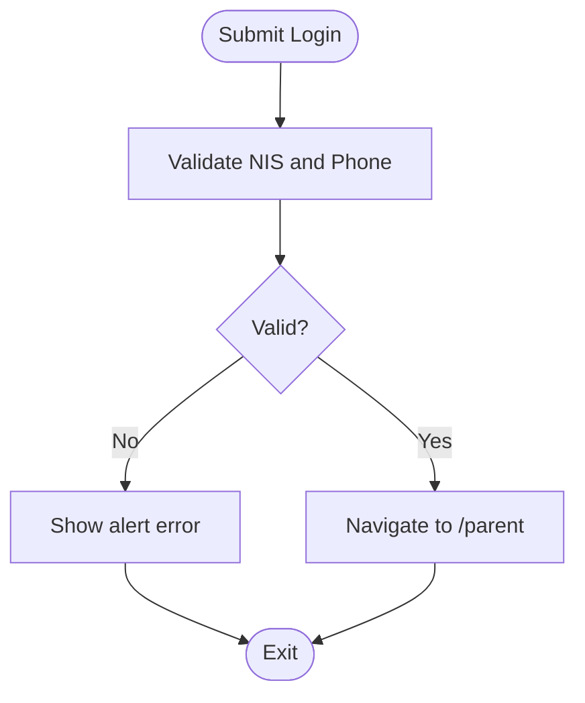
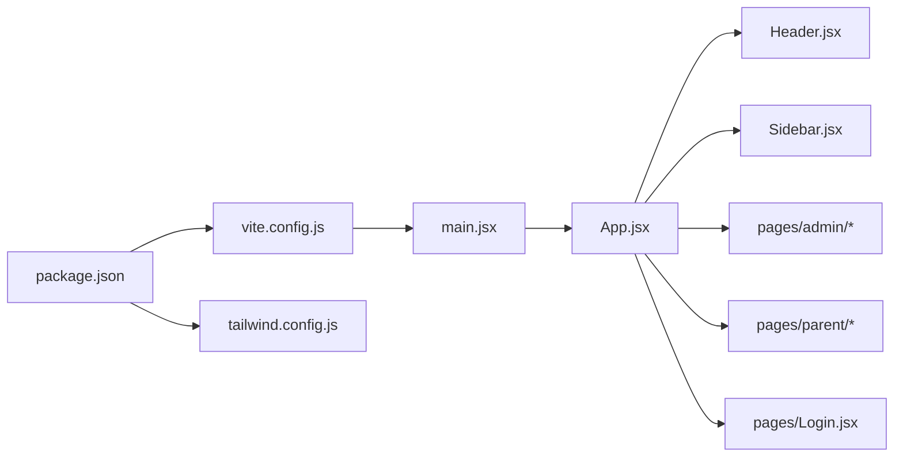

# Legacy Frontend (React)

<cite>
**Referenced Files in This Document**
- [package.json](file://frontend/package.json)
- [vite.config.js](file://frontend/vite.config.js)
- [tailwind.config.js](file://frontend/tailwind.config.js)
- [index.css](file://frontend/src/index.css)
- [App.css](file://frontend/src/App.css)
- [main.jsx](file://frontend/src/main.jsx)
- [App.jsx](file://frontend/src/App.jsx)
- [Header.jsx](file://frontend/src/components/Header.jsx)
- [Sidebar.jsx](file://frontend/src/components/Sidebar.jsx)
- [Footer.jsx](file://frontend/src/components/Footer.jsx)
- [Login.jsx](file://frontend/src/pages/Login.jsx)
- [DashboardAdmin.jsx](file://frontend/src/pages/admin/DashboardAdmin.jsx)
- [DashboardUser.jsx](file://frontend/src/pages/parent/DashboardUser.jsx)
</cite>

## Table of Contents
1. [Introduction](#introduction)
2. [Project Structure](#project-structure)
3. [Core Components](#core-components)
4. [Architecture Overview](#architecture-overview)
5. [Detailed Component Analysis](#detailed-component-analysis)
6. [Dependency Analysis](#dependency-analysis)
7. [Performance Considerations](#performance-considerations)
8. [Troubleshooting Guide](#troubleshooting-guide)
9. [Conclusion](#conclusion)
10. [Appendices](#appendices)

## Introduction
This document provides comprehensive legacy frontend documentation for the React-based student and parent portal. It explains the application structure, component architecture, routing configuration, state management patterns, API integration approach, authentication flow, data fetching strategies, responsive design practices, build process, asset management, deployment procedures, and migration strategy to the newer Filament-based admin panel.

The legacy frontend is a client-side React application built with Vite, styled with Tailwind CSS, and uses react-router-dom for navigation. Authentication is currently demo-based using localStorage, and pages are organized by role (admin and parent). The application serves as a foundation for future enhancements and migration to the Filament-based system.

## Project Structure
The frontend project follows a conventional React + Vite layout:
- Entry point renders the root React tree and imports global styles.
- App defines routes and shared layout components (Header, Sidebar).
- Pages are grouped by user roles under src/pages.
- Shared UI elements live under src/components.
- Build tooling is configured via Vite and Tailwind.

**Diagram sources**
- [main.jsx:1-11](file://frontend/src/main.jsx#L1-L11)
- [App.jsx:1-202](file://frontend/src/App.jsx#L1-L202)
- [Header.jsx:1-30](file://frontend/src/components/Header.jsx#L1-L30)
- [Sidebar.jsx:1-149](file://frontend/src/components/Sidebar.jsx#L1-L149)
- [index.css:1-3](file://frontend/src/index.css#L1-L3)
- [tailwind.config.js:1-13](file://frontend/tailwind.config.js#L1-L13)
- [vite.config.js:1-8](file://frontend/vite.config.js#L1-L8)
- [package.json:1-34](file://frontend/package.json#L1-L34)

**Section sources**
- [main.jsx:1-11](file://frontend/src/main.jsx#L1-L11)
- [App.jsx:1-202](file://frontend/src/App.jsx#L1-L202)
- [index.css:1-3](file://frontend/src/index.css#L1-L3)
- [tailwind.config.js:1-13](file://frontend/tailwind.config.js#L1-L13)
- [vite.config.js:1-8](file://frontend/vite.config.js#L1-L8)
- [package.json:1-34](file://frontend/package.json#L1-L34)

## Core Components
- Header: Displays branding, current user context, and logout action.
- Sidebar: Provides navigation grouped by functional areas; manages active state and submenus.
- Footer: Simple fixed footer with copyright text.
- Login: Demo login form that navigates to parent dashboard upon success.
- DashboardAdmin: Admin overview with summary cards and recent payments list.
- DashboardUser: Parent overview with student info, payment summaries, and recent activity.

These components are presentational and rely on props or local state. Routing and layout orchestration occur in App.jsx.

**Section sources**
- [Header.jsx:1-30](file://frontend/src/components/Header.jsx#L1-L30)
- [Sidebar.jsx:1-149](file://frontend/src/components/Sidebar.jsx#L1-L149)
- [Footer.jsx:1-11](file://frontend/src/components/Footer.jsx#L1-L11)
- [Login.jsx:1-106](file://frontend/src/pages/Login.jsx#L1-L106)
- [DashboardAdmin.jsx:1-135](file://frontend/src/pages/admin/DashboardAdmin.jsx#L1-L135)
- [DashboardUser.jsx:1-108](file://frontend/src/pages/parent/DashboardUser.jsx#L1-L108)

## Architecture Overview
The application uses a simple client-side architecture:
- React Router handles navigation between admin and parent sections.
- A shared layout wraps authenticated views with Header and Sidebar.
- Role-based access is enforced via a lightweight guard checking localStorage.
- Data is currently static within components; API integration is not implemented yet.

**Diagram sources**
- [App.jsx:1-202](file://frontend/src/App.jsx#L1-L202)
- [Header.jsx:1-30](file://frontend/src/components/Header.jsx#L1-L30)
- [Sidebar.jsx:1-149](file://frontend/src/components/Sidebar.jsx#L1-L149)
- [Footer.jsx:1-11](file://frontend/src/components/Footer.jsx#L1-L11)
- [DashboardAdmin.jsx:1-135](file://frontend/src/pages/admin/DashboardAdmin.jsx#L1-L135)
- [DashboardUser.jsx:1-108](file://frontend/src/pages/parent/DashboardUser.jsx#L1-L108)
- [Login.jsx:1-106](file://frontend/src/pages/Login.jsx#L1-L106)

## Detailed Component Analysis

### App Layout and Routing
- Defines BrowserRouter and a shared AppLayout that composes Header, Sidebar, and main content area.
- Uses pathToId mapping to compute active sidebar item based on current pathname.
- Implements RequireParentAuth to restrict parent-only routes by checking localStorage role.
- Centralizes navigation logic through setActive which maps sidebar IDs to actual routes.

**Diagram sources**
- [App.jsx:1-202](file://frontend/src/App.jsx#L1-L202)
- [Sidebar.jsx:1-149](file://frontend/src/components/Sidebar.jsx#L1-L149)
- [Header.jsx:1-30](file://frontend/src/components/Header.jsx#L1-L30)

**Section sources**
- [App.jsx:1-202](file://frontend/src/App.jsx#L1-L202)

### Header Component
- Presents branding and user context.
- Exposes an onLogout callback invoked by AppLayout to clear auth state and redirect.

**Section sources**
- [Header.jsx:1-30](file://frontend/src/components/Header.jsx#L1-L30)

### Sidebar Component
- Maintains open state for grouped items (master, transaksi, laporan).
- Highlights active items and supports nested navigation.
- Emits setActive events to AppLayout for route transitions.

**Section sources**
- [Sidebar.jsx:1-149](file://frontend/src/components/Sidebar.jsx#L1-L149)

### Footer Component
- Fixed-position footer with dynamic year.

**Section sources**
- [Footer.jsx:1-11](file://frontend/src/components/Footer.jsx#L1-L11)

### Login Page
- Demo authentication using hardcoded credentials.
- On success, navigates to /parent without persisting tokens.
- Provides link to admin dashboard.

**Diagram sources**
- [Login.jsx:1-106](file://frontend/src/pages/Login.jsx#L1-L106)

**Section sources**
- [Login.jsx:1-106](file://frontend/src/pages/Login.jsx#L1-L106)

### DashboardAdmin Page
- Displays summary metrics and recent payments.
- Accepts optional props for stats and recentPayments; otherwise uses sample data.

**Section sources**
- [DashboardAdmin.jsx:1-135](file://frontend/src/pages/admin/DashboardAdmin.jsx#L1-L135)

### DashboardUser Page
- Shows student profile summary, totals, and recent activities.
- Accepts optional props for student, stats, and recentPayments; otherwise uses sample data.

**Section sources**
- [DashboardUser.jsx:1-108](file://frontend/src/pages/parent/DashboardUser.jsx#L1-L108)

## Dependency Analysis
- Runtime dependencies include React, ReactDOM, react-icons, and react-router-dom.
- Development dependencies include Vite, ESLint, PostCSS, Autoprefixer, Tailwind CSS, and React plugin for Vite.
- Tailwind content scanning targets index.html and all JS/TS/JSX/TSX files under src.

**Diagram sources**
- [package.json:1-34](file://frontend/package.json#L1-L34)
- [vite.config.js:1-8](file://frontend/vite.config.js#L1-L8)
- [tailwind.config.js:1-13](file://frontend/tailwind.config.js#L1-L13)
- [main.jsx:1-11](file://frontend/src/main.jsx#L1-L11)
- [App.jsx:1-202](file://frontend/src/App.jsx#L1-L202)
- [Header.jsx:1-30](file://frontend/src/components/Header.jsx#L1-L30)
- [Sidebar.jsx:1-149](file://frontend/src/components/Sidebar.jsx#L1-L149)
- [Login.jsx:1-106](file://frontend/src/pages/Login.jsx#L1-L106)

**Section sources**
- [package.json:1-34](file://frontend/package.json#L1-L34)
- [vite.config.js:1-8](file://frontend/vite.config.js#L1-L8)
- [tailwind.config.js:1-13](file://frontend/tailwind.config.js#L1-L13)

## Performance Considerations
- Keep page components small and focused; extract reusable pieces into shared components.
- Prefer prop-driven data over heavy local state where possible to simplify re-renders.
- Use Tailwind’s utility classes efficiently; avoid unnecessary custom CSS.
- Defer non-critical assets and consider code splitting if the app grows beyond current scope.

[No sources needed since this section provides general guidance]

## Troubleshooting Guide
- Navigation issues: Ensure setActive mappings in App.jsx align with new routes when adding pages.
- Parent-only access: Verify localStorage contains role=parent before accessing protected routes.
- Styling problems: Confirm Tailwind content paths include new file extensions and directories.
- Build errors: Check Vite config and ensure @vitejs/plugin-react is enabled.

**Section sources**
- [App.jsx:1-202](file://frontend/src/App.jsx#L1-L202)
- [tailwind.config.js:1-13](file://frontend/tailwind.config.js#L1-L13)
- [vite.config.js:1-8](file://frontend/vite.config.js#L1-L8)

## Conclusion
The legacy React frontend provides a straightforward, role-aware portal with a shared layout and basic routing. While it currently relies on demo authentication and static data, its modular structure makes it suitable for incremental improvements and eventual migration to the Filament-based admin panel.

[No sources needed since this section summarizes without analyzing specific files]

## Appendices

### Adding a New Page
- Create a new component under the appropriate folder (e.g., src/pages/admin/NewPage.jsx).
- Add a Route in App.jsx under the relevant section.
- If the page should be accessible only to parents, wrap it with RequireParentAuth.
- Optionally add a Sidebar entry and update pathToId mapping to reflect the new route.

**Section sources**
- [App.jsx:1-202](file://frontend/src/App.jsx#L1-L202)

### Extending Existing Components
- For Header: Add new actions via additional props and buttons.
- For Sidebar: Extend navItems array with new groups or entries; ensure setActive maps to valid routes.
- For Dashboards: Replace sample data with props or integrate API calls later.

**Section sources**
- [Header.jsx:1-30](file://frontend/src/components/Header.jsx#L1-L30)
- [Sidebar.jsx:1-149](file://frontend/src/components/Sidebar.jsx#L1-L149)
- [DashboardAdmin.jsx:1-135](file://frontend/src/pages/admin/DashboardAdmin.jsx#L1-L135)
- [DashboardUser.jsx:1-108](file://frontend/src/pages/parent/DashboardUser.jsx#L1-L108)

### Implementing Responsive Design
- Use Tailwind’s responsive prefixes (sm:, md:, lg:) to adapt layouts across devices.
- Adjust Sidebar and Header positioning for mobile vs desktop breakpoints.
- Ensure main content width adapts to available space without excessive margins.

**Section sources**
- [App.jsx:1-202](file://frontend/src/App.jsx#L1-L202)
- [Sidebar.jsx:1-149](file://frontend/src/components/Sidebar.jsx#L1-L149)
- [Header.jsx:1-30](file://frontend/src/components/Header.jsx#L1-L30)

### API Integration Patterns
- Currently no API calls are implemented; pages use sample data.
- Recommended pattern: introduce a thin HTTP client (e.g., fetch or axios) and create service functions per domain.
- Integrate data fetching inside page components using useEffect or a lightweight state manager if needed.

[No sources needed since this section provides general guidance]

### Authentication Flow
- Demo login validates hardcoded values and navigates to /parent.
- Protected routes check localStorage for role=parent.
- Logout clears localStorage and redirects to /login.

**Section sources**
- [Login.jsx:1-106](file://frontend/src/pages/Login.jsx#L1-L106)
- [App.jsx:1-202](file://frontend/src/App.jsx#L1-L202)

### Data Fetching Strategies
- Replace static props with asynchronous data loading.
- Consider caching responses and handling loading/error states consistently across dashboards.

[No sources needed since this section provides general guidance]

### Build Process and Asset Management
- Development server: npm run dev
- Production build: npm run build
- Preview production build: npm run preview
- Tailwind scans src/**/*.{js,ts,jsx,tsx} and index.html for class usage.
- Global styles are imported from index.css; App.css remains unused by default.

**Section sources**
- [package.json:1-34](file://frontend/package.json#L1-L34)
- [tailwind.config.js:1-13](file://frontend/tailwind.config.js#L1-L13)
- [index.css:1-3](file://frontend/src/index.css#L1-L3)
- [App.css:1-43](file://frontend/src/App.css#L1-L43)

### Deployment Procedures
- Build the app using npm run build to generate optimized static assets.
- Serve the dist output with any static host (e.g., CDN, web server).
- Configure environment variables at the hosting layer if integrating APIs later.

[No sources needed since this section provides general guidance]

### Migration Strategy to Filament-Based Admin Panel
- Gradual rollout: keep the React portal for parents/students while migrating admin features to Filament.
- Shared backend: leverage existing Laravel API endpoints and resources used by Filament.
- Authentication alignment: unify session/token handling so users can move between portals seamlessly.
- Feature parity: map React pages to Filament Livewire components and tables incrementally.
- Deprecation plan: once all admin functionality is available in Filament, phase out the legacy admin routes in React.

[No sources needed since this section provides general guidance]