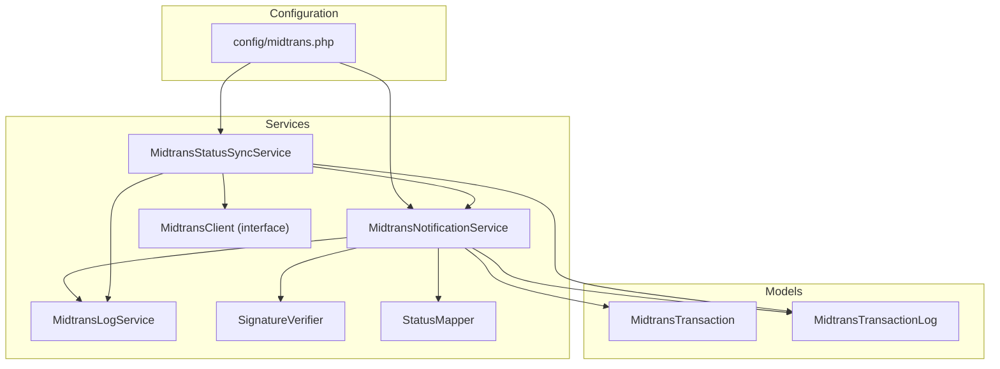
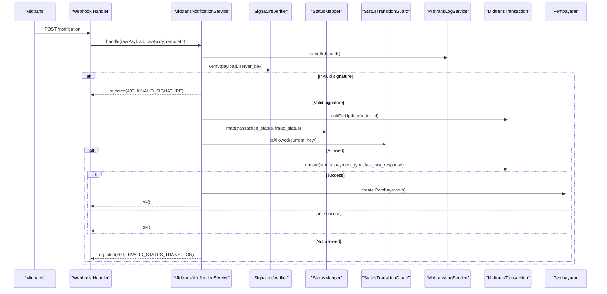
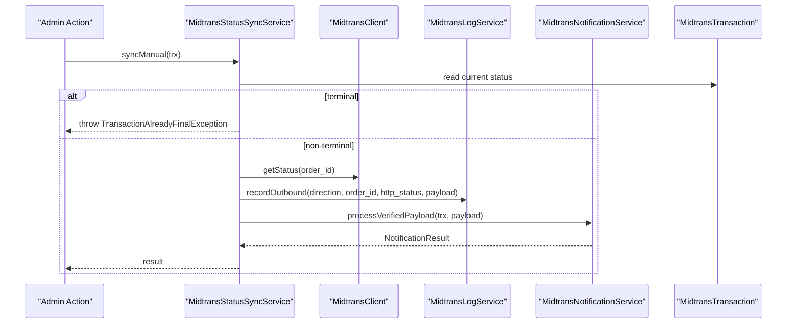
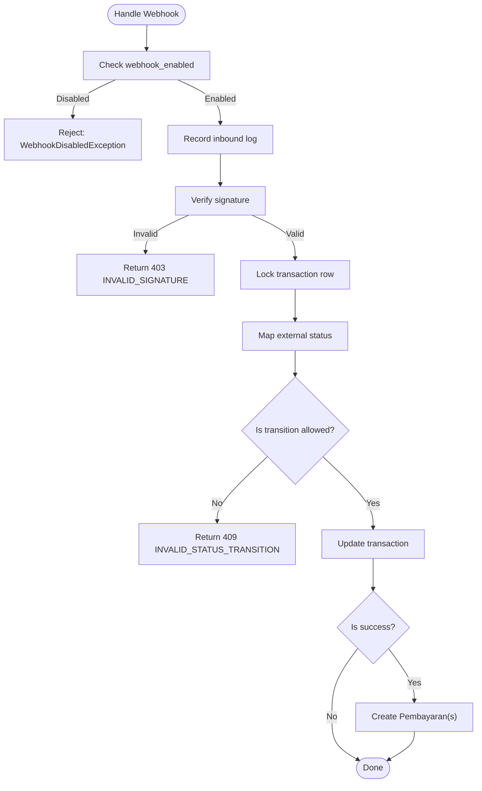
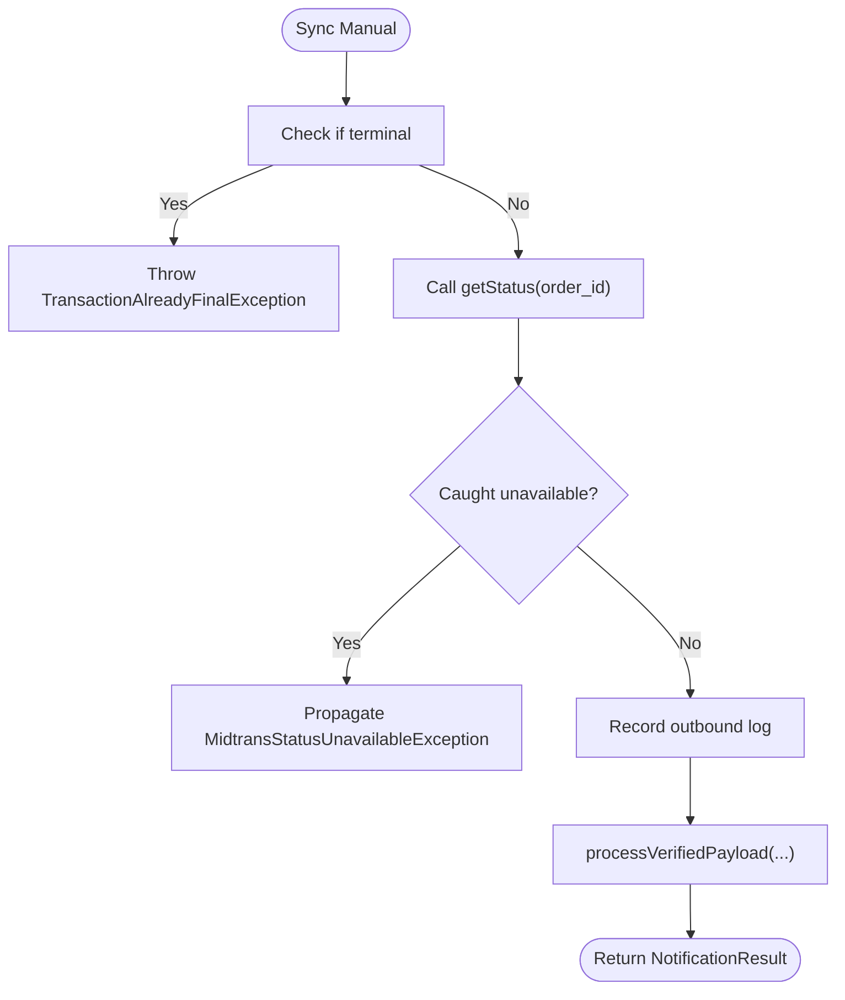
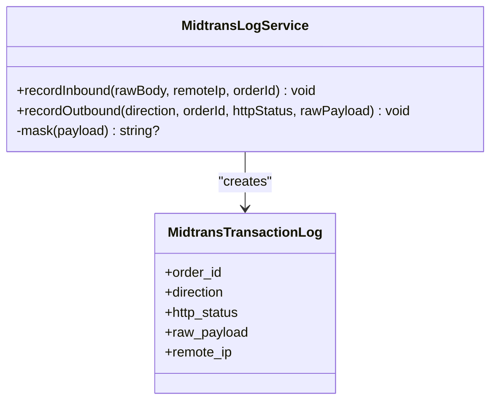
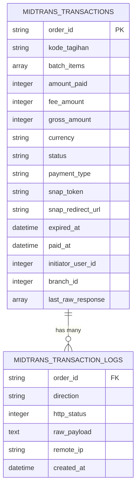
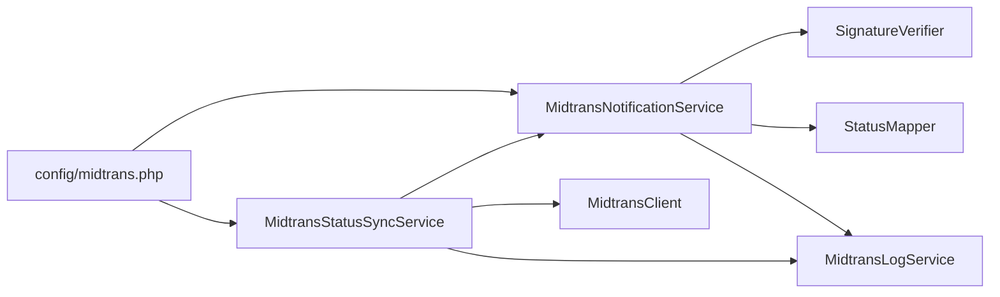

# Error Handling & Transaction Logging

<cite>
**Referenced Files in This Document**
- [MidtransException.php](file://backend/app/Exceptions/Midtrans/MidtransException.php)
- [InvalidSignatureException.php](file://backend/app/Exceptions/Midtrans/InvalidSignatureException.php)
- [AmountMismatchException.php](file://backend/app/Exceptions/Midtrans/AmountMismatchException.php)
- [InvalidStatusTransitionException.php](file://backend/app/Exceptions/Midtrans/InvalidStatusTransitionException.php)
- [OrderNotFoundException.php](file://backend/app/Exceptions/Midtrans/OrderNotFoundException.php)
- [MidtransUnavailableException.php](file://backend/app/Exceptions/Midtrans/MidtransUnavailableException.php)
- [MidtransLogService.php](file://backend/app/Services/Midtrans/MidtransLogService.php)
- [MidtransTransaction.php](file://backend/app/Models/MidtransTransaction.php)
- [MidtransTransactionLog.php](file://backend/app/Models/MidtransTransactionLog.php)
- [MidtransClient.php](file://backend/app/Services/Midtrans/MidtransClient.php)
- [MidtransNotificationService.php](file://backend/app/Services/Midtrans/MidtransNotificationService.php)
- [MidtransStatusSyncService.php](file://backend/app/Services/Midtrans/MidtransStatusSyncService.php)
- [SignatureVerifier.php](file://backend/app/Services/Midtrans/SignatureVerifier.php)
- [StatusMapper.php](file://backend/app/Services/Midtrans/StatusMapper.php)
- [midtrans.php](file://backend/config/midtrans.php)
</cite>

## Table of Contents
1. [Introduction](#introduction)
2. [Project Structure](#project-structure)
3. [Core Components](#core-components)
4. [Architecture Overview](#architecture-overview)
5. [Detailed Component Analysis](#detailed-component-analysis)
6. [Dependency Analysis](#dependency-analysis)
7. [Performance Considerations](#performance-considerations)
8. [Troubleshooting Guide](#troubleshooting-guide)
9. [Conclusion](#conclusion)
10. [Appendices](#appendices)

## Introduction
This document explains the error handling and transaction logging mechanisms for Midtrans integration. It covers:
- The exception hierarchy and categorization strategy
- How inbound webhooks and outbound status checks are logged securely
- Transaction persistence and audit trail maintenance
- Debugging techniques, retry strategies, and monitoring recommendations

The goal is to provide a clear, production-ready guide for diagnosing payment issues and ensuring robust error handling across webhook processing and status synchronization flows.

## Project Structure
Key areas involved in error handling and logging:
- Exception classes under app/Exceptions/Midtrans define typed errors with standardized HTTP status codes and machine-readable error codes.
- Services under app/Services/Midtrans implement notification handling, status sync, client abstraction, signature verification, status mapping, and logging.
- Models under app/Models persist transactions and logs.
- Configuration under config/midtrans.php controls feature toggles, credentials, fees, retention, and URLs.

**Diagram sources**
- [midtrans.php:1-130](file://backend/config/midtrans.php#L1-L130)
- [MidtransNotificationService.php:1-284](file://backend/app/Services/Midtrans/MidtransNotificationService.php#L1-L284)
- [MidtransStatusSyncService.php:1-73](file://backend/app/Services/Midtrans/MidtransStatusSyncService.php#L1-L73)
- [MidtransLogService.php:1-109](file://backend/app/Services/Midtrans/MidtransLogService.php#L1-L109)
- [SignatureVerifier.php:1-34](file://backend/app/Services/Midtrans/SignatureVerifier.php#L1-L34)
- [StatusMapper.php:1-41](file://backend/app/Services/Midtrans/StatusMapper.php#L1-L41)
- [MidtransClient.php:1-27](file://backend/app/Services/Midtrans/MidtransClient.php#L1-L27)
- [MidtransTransaction.php:1-85](file://backend/app/Models/MidtransTransaction.php#L1-L85)
- [MidtransTransactionLog.php:1-35](file://backend/app/Models/MidtransTransactionLog.php#L1-L35)

**Section sources**
- [midtrans.php:1-130](file://backend/config/midtrans.php#L1-L130)
- [MidtransNotificationService.php:1-284](file://backend/app/Services/Midtrans/MidtransNotificationService.php#L1-L284)
- [MidtransStatusSyncService.php:1-73](file://backend/app/Services/Midtrans/MidtransStatusSyncService.php#L1-L73)
- [MidtransLogService.php:1-109](file://backend/app/Services/Midtrans/MidtransLogService.php#L1-L109)
- [SignatureVerifier.php:1-34](file://backend/app/Services/Midtrans/SignatureVerifier.php#L1-L34)
- [StatusMapper.php:1-41](file://backend/app/Services/Midtrans/StatusMapper.php#L1-L41)
- [MidtransClient.php:1-27](file://backend/app/Services/Midtrans/MidtransClient.php#L1-L27)
- [MidtransTransaction.php:1-85](file://backend/app/Models/MidtransTransaction.php#L1-L85)
- [MidtransTransactionLog.php:1-35](file://backend/app/Models/MidtransTransactionLog.php#L1-L35)

## Core Components
- Exception base class defines common fields for error code and HTTP status, enabling consistent responses and categorization.
- Specific exceptions cover signature validation failures, amount mismatches, invalid transitions, missing orders, and gateway unavailability.
- Notification service orchestrates webhook processing: configuration check, logging, signature verification, DB locking, status mapping, transition guard, and payment recording.
- Status sync service calls the external status API, logs outbound requests, and delegates to the same processing logic used by webhooks.
- Log service persists inbound/outbound payloads with sensitive data masking and safety net checks.
- Signature verifier computes and validates signatures using constant-time comparison.
- Status mapper translates external statuses into internal states.
- Models persist transaction records and immutable log entries.

**Section sources**
- [MidtransException.php:1-17](file://backend/app/Exceptions/Midtrans/MidtransException.php#L1-L17)
- [InvalidSignatureException.php:1-15](file://backend/app/Exceptions/Midtrans/InvalidSignatureException.php#L1-L15)
- [AmountMismatchException.php:1-15](file://backend/app/Exceptions/Midtrans/AmountMismatchException.php#L1-L15)
- [InvalidStatusTransitionException.php:1-15](file://backend/app/Exceptions/Midtrans/InvalidStatusTransitionException.php#L1-L15)
- [OrderNotFoundException.php:1-15](file://backend/app/Exceptions/Midtrans/OrderNotFoundException.php#L1-L15)
- [MidtransUnavailableException.php:1-15](file://backend/app/Exceptions/Midtrans/MidtransUnavailableException.php#L1-L15)
- [MidtransNotificationService.php:1-284](file://backend/app/Services/Midtrans/MidtransNotificationService.php#L1-L284)
- [MidtransStatusSyncService.php:1-73](file://backend/app/Services/Midtrans/MidtransStatusSyncService.php#L1-L73)
- [MidtransLogService.php:1-109](file://backend/app/Services/Midtrans/MidtransLogService.php#L1-L109)
- [SignatureVerifier.php:1-34](file://backend/app/Services/Midtrans/SignatureVerifier.php#L1-L34)
- [StatusMapper.php:1-41](file://backend/app/Services/Midtrans/StatusMapper.php#L1-L41)
- [MidtransTransaction.php:1-85](file://backend/app/Models/MidtransTransaction.php#L1-L85)
- [MidtransTransactionLog.php:1-35](file://backend/app/Models/MidtransTransactionLog.php#L1-L35)

## Architecture Overview
End-to-end flows for webhook and manual sync:

**Diagram sources**
- [MidtransNotificationService.php:1-284](file://backend/app/Services/Midtrans/MidtransNotificationService.php#L1-L284)
- [SignatureVerifier.php:1-34](file://backend/app/Services/Midtrans/SignatureVerifier.php#L1-L34)
- [StatusMapper.php:1-41](file://backend/app/Services/Midtrans/StatusMapper.php#L1-L41)
- [MidtransLogService.php:1-109](file://backend/app/Services/Midtrans/MidtransLogService.php#L1-L109)
- [MidtransTransaction.php:1-85](file://backend/app/Models/MidtransTransaction.php#L1-L85)

Manual status sync flow:

**Diagram sources**
- [MidtransStatusSyncService.php:1-73](file://backend/app/Services/Midtrans/MidtransStatusSyncService.php#L1-L73)
- [MidtransClient.php:1-27](file://backend/app/Services/Midtrans/MidtransClient.php#L1-L27)
- [MidtransLogService.php:1-109](file://backend/app/Services/Midtrans/MidtransLogService.php#L1-L109)
- [MidtransNotificationService.php:1-284](file://backend/app/Services/Midtrans/MidtransNotificationService.php#L1-L284)

## Detailed Component Analysis

### Exception Hierarchy and Categorization
- Base exception provides a uniform structure with errorCode and httpStatus, enabling consistent API responses and routing.
- Specialized exceptions:
  - InvalidSignatureException: rejects unauthorized notifications.
  - AmountMismatchException: indicates gross amount mismatch between expected and received values.
  - InvalidStatusTransitionException: signals disallowed state changes.
  - OrderNotFoundException: indicates missing order reference.
  - MidtransUnavailableException: represents gateway/service unavailability.

These categories support:
- Clear error classification for monitoring and alerting.
- Appropriate HTTP status codes for clients.
- Machine-readable error codes for downstream systems.

**Section sources**
- [MidtransException.php:1-17](file://backend/app/Exceptions/Midtrans/MidtransException.php#L1-L17)
- [InvalidSignatureException.php:1-15](file://backend/app/Exceptions/Midtrans/InvalidSignatureException.php#L1-L15)
- [AmountMismatchException.php:1-15](file://backend/app/Exceptions/Midtrans/AmountMismatchException.php#L1-L15)
- [InvalidStatusTransitionException.php:1-15](file://backend/app/Exceptions/Midtrans/InvalidStatusTransitionException.php#L1-L15)
- [OrderNotFoundException.php:1-15](file://backend/app/Exceptions/Midtrans/OrderNotFoundException.php#L1-L15)
- [MidtransUnavailableException.php:1-15](file://backend/app/Exceptions/Midtrans/MidtransUnavailableException.php#L1-L15)

### Webhook Processing Flow
- Configuration gate: early rejection if webhooks are disabled.
- Inbound logging: raw body recorded before any processing.
- Signature verification: SHA-512-based computation and constant-time comparison.
- Database locking: FOR UPDATE on the target transaction to prevent race conditions.
- Status mapping and transition guard: ensure only valid state transitions occur.
- Payment recording: idempotent creation of Pembayaran records; supports batch settlement.

**Diagram sources**
- [MidtransNotificationService.php:1-284](file://backend/app/Services/Midtrans/MidtransNotificationService.php#L1-L284)
- [SignatureVerifier.php:1-34](file://backend/app/Services/Midtrans/SignatureVerifier.php#L1-L34)
- [StatusMapper.php:1-41](file://backend/app/Services/Midtrans/StatusMapper.php#L1-L41)

**Section sources**
- [MidtransNotificationService.php:1-284](file://backend/app/Services/Midtrans/MidtransNotificationService.php#L1-L284)
- [SignatureVerifier.php:1-34](file://backend/app/Services/Midtrans/SignatureVerifier.php#L1-L34)
- [StatusMapper.php:1-41](file://backend/app/Services/Midtrans/StatusMapper.php#L1-L41)

### Manual Status Sync Flow
- Terminal-state guard prevents unnecessary external calls.
- Outbound call to status API is wrapped in try/catch to propagate specific unavailability errors.
- Outbound request is logged with sanitized payload.
- Delegates to shared processing logic via processVerifiedPayload, which manages its own DB transaction and locking.

**Diagram sources**
- [MidtransStatusSyncService.php:1-73](file://backend/app/Services/Midtrans/MidtransStatusSyncService.php#L1-L73)
- [MidtransClient.php:1-27](file://backend/app/Services/Midtrans/MidtransClient.php#L1-L27)
- [MidtransNotificationService.php:1-284](file://backend/app/Services/Midtrans/MidtransNotificationService.php#L1-L284)

**Section sources**
- [MidtransStatusSyncService.php:1-73](file://backend/app/Services/Midtrans/MidtransStatusSyncService.php#L1-L73)
- [MidtransClient.php:1-27](file://backend/app/Services/Midtrans/MidtransClient.php#L1-L27)
- [MidtransNotificationService.php:1-284](file://backend/app/Services/Midtrans/MidtransNotificationService.php#L1-L284)

### Transaction Logging Service
- Records inbound notifications and outbound API calls.
- Masks sensitive keys (server_key, signature_key) at JSON or string level.
- Safety net: if the literal server key remains after masking, the entry is dropped and a critical log is emitted.
- Failures in logging are caught and recorded without breaking primary flows.

**Diagram sources**
- [MidtransLogService.php:1-109](file://backend/app/Services/Midtrans/MidtransLogService.php#L1-L109)
- [MidtransTransactionLog.php:1-35](file://backend/app/Models/MidtransTransactionLog.php#L1-L35)

**Section sources**
- [MidtransLogService.php:1-109](file://backend/app/Services/Midtrans/MidtransLogService.php#L1-L109)
- [MidtransTransactionLog.php:1-35](file://backend/app/Models/MidtransTransactionLog.php#L1-L35)

### Data Models and Relationships
- MidtransTransaction stores core payment metadata, including amounts, timestamps, and last raw response.
- MidtransTransactionLog stores immutable audit entries for each inbound/outbound event.
- Relationships:
  - Transaction has many Logs.
  - Log belongs to Transaction.

**Diagram sources**
- [MidtransTransaction.php:1-85](file://backend/app/Models/MidtransTransaction.php#L1-L85)
- [MidtransTransactionLog.php:1-35](file://backend/app/Models/MidtransTransactionLog.php#L1-L35)

**Section sources**
- [MidtransTransaction.php:1-85](file://backend/app/Models/MidtransTransaction.php#L1-L85)
- [MidtransTransactionLog.php:1-35](file://backend/app/Models/MidtransTransactionLog.php#L1-L35)

## Dependency Analysis
- MidtransNotificationService depends on:
  - SignatureVerifier for cryptographic validation.
  - StatusMapper for external-to-internal status translation.
  - StatusTransitionGuard for enforcing allowed state transitions.
  - MidtransLogService for audit logging.
  - MidtransFeeService for fee calculations (used elsewhere).
- MidtransStatusSyncService depends on:
  - MidtransClient interface for external API calls.
  - MidtransNotificationService for shared processing.
  - MidtransLogService for outbound logging.
  - SignatureVerifier for optional signature presence in synthesized payload.
- Configuration drives behavior:
  - Feature toggles (enabled, webhook_enabled).
  - Credentials (server_key, client_key, merchant_id).
  - Retention policy (log_retention_days).

**Diagram sources**
- [midtrans.php:1-130](file://backend/config/midtrans.php#L1-L130)
- [MidtransNotificationService.php:1-284](file://backend/app/Services/Midtrans/MidtransNotificationService.php#L1-L284)
- [MidtransStatusSyncService.php:1-73](file://backend/app/Services/Midtrans/MidtransStatusSyncService.php#L1-L73)
- [SignatureVerifier.php:1-34](file://backend/app/Services/Midtrans/SignatureVerifier.php#L1-L34)
- [StatusMapper.php:1-41](file://backend/app/Services/Midtrans/StatusMapper.php#L1-L41)
- [MidtransClient.php:1-27](file://backend/app/Services/Midtrans/MidtransClient.php#L1-L27)
- [MidtransLogService.php:1-109](file://backend/app/Services/Midtrans/MidtransLogService.php#L1-L109)

**Section sources**
- [midtrans.php:1-130](file://backend/config/midtrans.php#L1-L130)
- [MidtransNotificationService.php:1-284](file://backend/app/Services/Midtrans/MidtransNotificationService.php#L1-L284)
- [MidtransStatusSyncService.php:1-73](file://backend/app/Services/Midtrans/MidtransStatusSyncService.php#L1-L73)
- [SignatureVerifier.php:1-34](file://backend/app/Services/Midtrans/SignatureVerifier.php#L1-L34)
- [StatusMapper.php:1-41](file://backend/app/Services/Midtrans/StatusMapper.php#L1-L41)
- [MidtransClient.php:1-27](file://backend/app/Services/Midtrans/MidtransClient.php#L1-L27)
- [MidtransLogService.php:1-109](file://backend/app/Services/Midtrans/MidtransLogService.php#L1-L109)

## Performance Considerations
- Use database locks (FOR UPDATE) around transaction updates to avoid race conditions during concurrent webhooks or syncs.
- Keep logging lightweight; mask payloads efficiently and drop entries when safety nets trigger to protect secrets.
- Avoid redundant external calls by checking terminal states before invoking status APIs.
- Batch operations should minimize per-item queries where possible; current implementation uses targeted lookups with locks.

[No sources needed since this section provides general guidance]

## Troubleshooting Guide
Common scenarios and how to diagnose them:

- Invalid signature
  - Symptom: Rejected with INVALID_SIGNATURE.
  - Actions:
    - Verify server_key configuration matches Midtrans settings.
    - Inspect inbound logs for signature_key presence and masked output.
    - Confirm compute formula includes order_id, status_code, gross_amount, and server_key.

- Amount mismatch
  - Symptom: Rejected with AMOUNT_MISMATCH.
  - Actions:
    - Compare expected gross_amount in MidtransTransaction with received value.
    - Ensure rounding and decimal handling align with Midtrans format.

- Invalid status transition
  - Symptom: Rejected with INVALID_STATUS_TRANSITION.
  - Actions:
    - Review current vs target internal status.
    - Validate mapping rules and transition guard constraints.

- Order not found
  - Symptom: Rejected with ORDER_NOT_FOUND.
  - Actions:
    - Confirm order_id exists and is active.
    - Check for premature deletion or incorrect order generation.

- Gateway unavailable
  - Symptom: MidtransStatusUnavailableException during sync.
  - Actions:
    - Retry with backoff or schedule later.
    - Monitor upstream availability and circuit breaker metrics.

- Overpayment blocked
  - Symptom: OverpaymentBlockedException during payment recording.
  - Actions:
    - Validate tagihan remaining balance against payment amount.
    - Investigate batch item amounts and tagihan totals.

Operational tips:
- Use the transaction logs table to reconstruct the full sequence of events for an order_id.
- Filter logs by direction (inbound_notification, outbound_status) and http_status.
- For debugging, enable detailed application logs around signature verification and transition checks.

**Section sources**
- [MidtransNotificationService.php:1-284](file://backend/app/Services/Midtrans/MidtransNotificationService.php#L1-L284)
- [MidtransStatusSyncService.php:1-73](file://backend/app/Services/Midtrans/MidtransStatusSyncService.php#L1-L73)
- [MidtransLogService.php:1-109](file://backend/app/Services/Midtrans/MidtransLogService.php#L1-L109)
- [SignatureVerifier.php:1-34](file://backend/app/Services/Midtrans/SignatureVerifier.php#L1-L34)
- [StatusMapper.php:1-41](file://backend/app/Services/Midtrans/StatusMapper.php#L1-L41)

## Conclusion
The system implements a robust error handling and logging framework for Midtrans integrations:
- A comprehensive exception hierarchy ensures clear categorization and appropriate HTTP responses.
- Secure logging with sensitive data masking and safety nets protects secrets while preserving auditability.
- Transaction processing leverages database locks and transition guards to maintain consistency.
- Manual sync complements webhooks by reconciling state through the same validated pipeline.

Adopting the recommended monitoring, alerting, and retry strategies will improve reliability and speed up troubleshooting in production.

[No sources needed since this section summarizes without analyzing specific files]

## Appendices

### Practical Examples and Best Practices
- Network failures
  - Strategy: Implement exponential backoff with jitter for retries; mark transient errors in logs; surface actionable alerts.
- Validation errors
  - Strategy: Return structured error responses with errorCode and httpStatus; include context like order_id and amounts.
- Gateway timeouts
  - Strategy: Time out client calls appropriately; log timeout details; schedule background reconciliation via status sync.
- Retry mechanisms
  - Strategy: Use idempotency keys where applicable; rely on DB locks and unique constraints to prevent duplicates; limit retries to avoid cascading failures.
- Monitoring and alerting
  - Track counts of INVALID_SIGNATURE, AMOUNT_MISMATCH, INVALID_STATUS_TRANSITION, ORDER_NOT_FOUND, and MIDTRANS_UNAVAILABLE.
  - Alert on spikes in failed webhooks or prolonged pending states.
- Production hardening
  - Ensure webhook_enabled can be toggled without redeploy.
  - Enforce secret masking and safety net checks in all logging paths.
  - Regularly prune old logs based on configured retention days.

[No sources needed since this section provides general guidance]