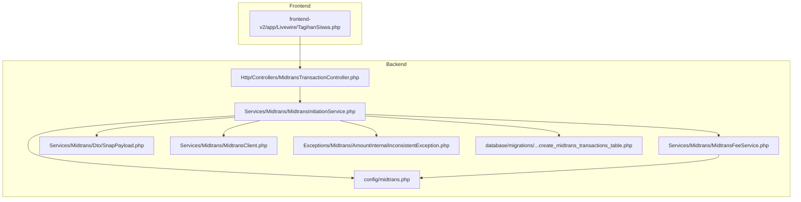
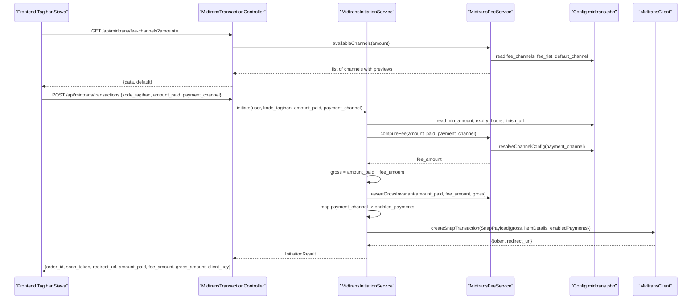
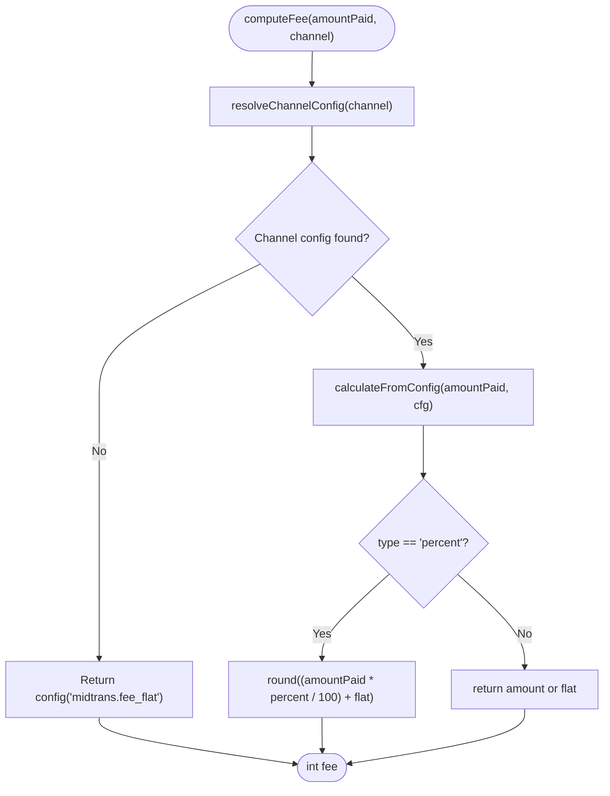
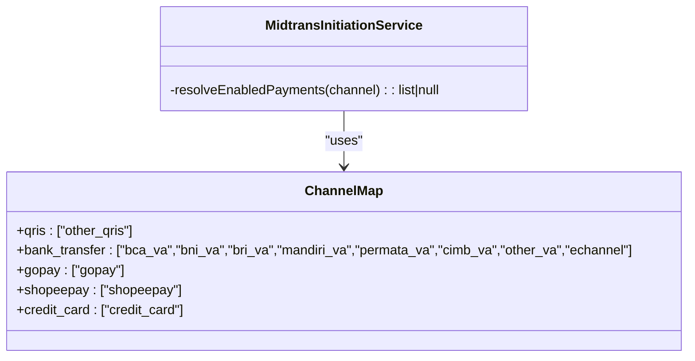
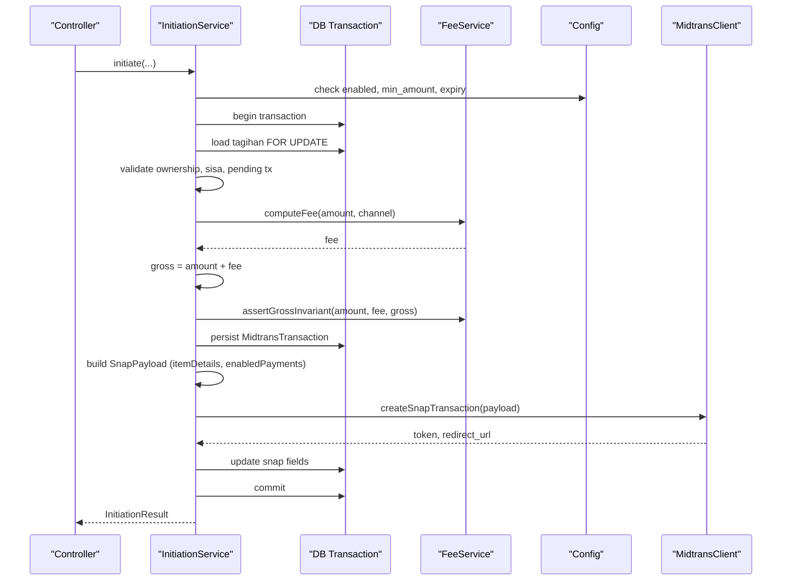
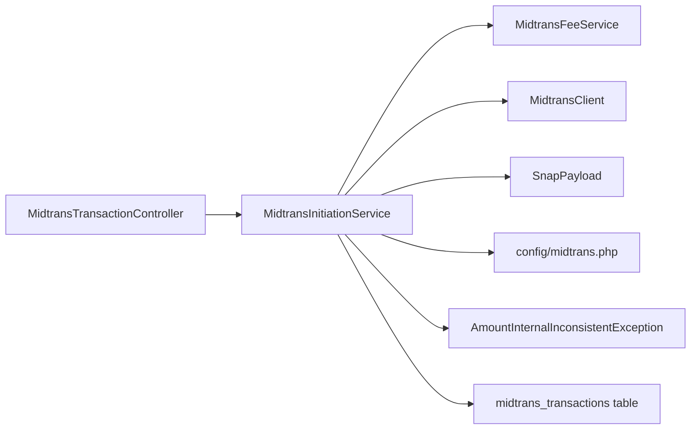

# Fee Calculation & Payment Channels

<cite>
**Referenced Files in This Document**
- [MidtransFeeService.php](file://backend/app/Services/Midtrans/MidtransFeeService.php)
- [midtrans.php](file://backend/config/midtrans.php)
- [MidtransInitiationService.php](file://backend/app/Services/Midtrans/MidtransInitiationService.php)
- [MidtransTransactionController.php](file://backend/app/Http/Controllers/MidtransTransactionController.php)
- [SnapPayload.php](file://backend/app/Services/Midtrans/Dto/SnapPayload.php)
- [MidtransClient.php](file://backend/app/Services/Midtrans/MidtransClient.php)
- [AmountInternalInconsistentException.php](file://backend/app/Exceptions/Midtrans/AmountInternalInconsistentException.php)
- [2026_06_22_000001_create_midtrans_transactions_table.php](file://backend/database/migrations/2026_06_22_000001_create_midtrans_transactions_table.php)
- [TagihanSiswa.php](file://frontend-v2/app/Livewire/TagihanSiswa.php)
</cite>

## Table of Contents
1. Introduction
2. Project Structure
3. Core Components
4. Architecture Overview
5. Detailed Component Analysis
6. Dependency Analysis
7. Performance Considerations
8. Troubleshooting Guide
9. Conclusion

## Introduction
This document explains how Midtrans fee calculation and payment channel management work in the system. It covers:
- How admin fees are computed per payment method (bank transfer, e-wallets, credit cards)
- Dynamic fee computation based on configured channels
- Configuration management for enabling/disabling features and setting fee structures
- The payment channel mapping that limits available options in Midtrans Snap
- How fees are applied to transactions and validated
- Practical examples for configuring channels, calculating fees, and customizing fee structures
- Gross amount calculations, validation rules, and troubleshooting guidance

## Project Structure
The relevant backend components for fee calculation and payment channels are organized under Services, Config, Controllers, DTOs, Exceptions, and Database Migrations. The frontend Livewire component consumes the fee-channel API to display real-time previews.

**Diagram sources**
- [midtrans.php:1-130](file://backend/config/midtrans.php#L1-L130)
- [MidtransFeeService.php:1-144](file://backend/app/Services/Midtrans/MidtransFeeService.php#L1-L144)
- [MidtransInitiationService.php:1-473](file://backend/app/Services/Midtrans/MidtransInitiationService.php#L1-L473)
- [MidtransTransactionController.php:1-127](file://backend/app/Http/Controllers/MidtransTransactionController.php#L1-L127)
- [SnapPayload.php:1-24](file://backend/app/Services/Midtrans/Dto/SnapPayload.php#L1-L24)
- [MidtransClient.php:1-27](file://backend/app/Services/Midtrans/MidtransClient.php#L1-L27)
- [AmountInternalInconsistentException.php:1-15](file://backend/app/Exceptions/Midtrans/AmountInternalInconsistentException.php#L1-L15)
- [2026_06_22_000001_create_midtrans_transactions_table.php:1-71](file://backend/database/migrations/2026_06_22_000001_create_midtrans_transactions_table.php#L1-L71)
- [TagihanSiswa.php:257-301](file://frontend-v2/app/Livewire/TagihanSiswa.php#L257-L301)

**Section sources**
- [midtrans.php:1-130](file://backend/config/midtrans.php#L1-L130)
- [MidtransFeeService.php:1-144](file://backend/app/Services/Midtrans/MidtransFeeService.php#L1-L144)
- [MidtransInitiationService.php:1-473](file://backend/app/Services/Midtrans/MidtransInitiationService.php#L1-L473)
- [MidtransTransactionController.php:1-127](file://backend/app/Http/Controllers/MidtransTransactionController.php#L1-L127)
- [SnapPayload.php:1-24](file://backend/app/Services/Midtrans/Dto/SnapPayload.php#L1-L24)
- [MidtransClient.php:1-27](file://backend/app/Services/Midtrans/MidtransClient.php#L1-L27)
- [AmountInternalInconsistentException.php:1-15](file://backend/app/Exceptions/Midtrans/AmountInternalInconsistentException.php#L1-L15)
- [2026_06_22_000001_create_midtrans_transactions_table.php:1-71](file://backend/database/migrations/2026_06_22_000001_create_midtrans_transactions_table.php#L1-L71)
- [TagihanSiswa.php:257-301](file://frontend-v2/app/Livewire/TagihanSiswa.php#L257-L301)

## Core Components
- Fee calculation service: Computes admin fees per channel using configuration. Supports flat and percentage-based fees with optional flat add-on. Provides a preview endpoint for UI to show exact totals before checkout.
- Initiation service: Orchestrates transaction creation, validates amounts, computes fees, asserts gross invariant, builds Snap payload with enabled payments, and calls the Midtrans client.
- Controller: Exposes APIs for initiating single/batch payments and listing available fee channels with optional preview.
- Configuration: Centralizes feature flags, credentials, default channel, minimum amount, expiry, order prefix, finish URL, and per-channel fee settings.
- Data model: Stores transaction details including amount_paid, fee_amount, gross_amount, status, payment_type, and timestamps.
- Frontend integration: Livewire component fetches fee channels and displays dynamic total including admin fee.

**Section sources**
- [MidtransFeeService.php:1-144](file://backend/app/Services/Midtrans/MidtransFeeService.php#L1-L144)
- [MidtransInitiationService.php:1-473](file://backend/app/Services/Midtrans/MidtransInitiationService.php#L1-L473)
- [MidtransTransactionController.php:1-127](file://backend/app/Http/Controllers/MidtransTransactionController.php#L1-L127)
- [midtrans.php:1-130](file://backend/config/midtrans.php#L1-L130)
- [2026_06_22_000001_create_midtrans_transactions_table.php:1-71](file://backend/database/migrations/2026_06_22_000001_create_midtrans_transactions_table.php#L1-L71)
- [TagihanSiswa.php:257-301](file://frontend-v2/app/Livewire/TagihanSiswa.php#L257-L301)

## Architecture Overview
The flow from user selection to Midtrans Snap initiation involves:
- Frontend requests available fee channels and optionally previews fees for a given amount.
- Backend returns channel metadata and computed previews.
- User selects a channel and initiates payment; backend validates inputs, computes fee, asserts gross invariant, persists transaction, maps channel to Snap enabled_payments, and calls Midtrans.

**Diagram sources**
- [MidtransTransactionController.php:1-127](file://backend/app/Http/Controllers/MidtransTransactionController.php#L1-L127)
- [MidtransInitiationService.php:1-473](file://backend/app/Services/Midtrans/MidtransInitiationService.php#L1-L473)
- [MidtransFeeService.php:1-144](file://backend/app/Services/Midtrans/MidtransFeeService.php#L1-L144)
- [midtrans.php:1-130](file://backend/config/midtrans.php#L1-L130)
- [SnapPayload.php:1-24](file://backend/app/Services/Midtrans/Dto/SnapPayload.php#L1-L24)
- [MidtransClient.php:1-27](file://backend/app/Services/Midtrans/MidtransClient.php#L1-L27)

## Detailed Component Analysis

### Fee Calculation Service
Responsibilities:
- Compute fee per channel based on config type: flat or percent (with optional flat).
- Provide channel metadata and fee previews for UI.
- Validate channel keys against configuration.
- Assert gross amount invariant to prevent internal inconsistencies.

Key behaviors:
- If no channel is provided or unknown, falls back to global fee_flat.
- Percent fees are rounded to integer Rupiah.
- Preview mode calculates fee_preview and gross_preview for a given amount.

**Diagram sources**
- [MidtransFeeService.php:28-133](file://backend/app/Services/Midtrans/MidtransFeeService.php#L28-L133)

**Section sources**
- [MidtransFeeService.php:1-144](file://backend/app/Services/Midtrans/MidtransFeeService.php#L1-L144)

### Payment Channel Mapping and Enabled Payments
The system maps internal channel keys to Midtrans Snap payment codes to limit visible options during checkout.

Mapping:
- qris → other_qris
- bank_transfer → multiple VA providers and echannel
- gopay → gopay
- shopeepay → shopeepay
- credit_card → credit_card

If the selected key has no mapping, all channels are shown.

**Diagram sources**
- [MidtransInitiationService.php:450-471](file://backend/app/Services/Midtrans/MidtransInitiationService.php#L450-L471)

**Section sources**
- [MidtransInitiationService.php:441-471](file://backend/app/Services/Midtrans/MidtransInitiationService.php#L441-L471)

### Transaction Initiation Flow
End-to-end steps:
- Feature flag and configuration checks
- Load and lock tagihan, validate ownership and balance
- Enforce minimum amount and not exceeding remaining balance
- Prevent duplicate pending transactions
- Compute fee and gross, assert invariant
- Persist MidtransTransaction record
- Build SnapPayload with itemDetails and enabledPayments
- Call Midtrans client and handle success/failure

**Diagram sources**
- [MidtransInitiationService.php:44-236](file://backend/app/Services/Midtrans/MidtransInitiationService.php#L44-L236)
- [MidtransFeeService.php:28-97](file://backend/app/Services/Midtrans/MidtransFeeService.php#L28-L97)
- [midtrans.php:1-130](file://backend/config/midtrans.php#L1-L130)
- [MidtransClient.php:1-27](file://backend/app/Services/Midtrans/MidtransClient.php#L1-L27)

**Section sources**
- [MidtransInitiationService.php:1-473](file://backend/app/Services/Midtrans/MidtransInitiationService.php#L1-L473)

### Configuration Management
Key configuration entries:
- enabled: toggle for Midtrans feature
- webhook_enabled: toggle for webhook processing
- environment: sandbox or production
- server_key, client_key, merchant_id: credentials
- fee_flat: fallback admin fee when channel is unknown
- fee_channels: per-channel fee definitions supporting flat and percent types
- default_channel: default channel key for UI
- min_amount: minimum payment amount
- expiry_hours: transaction expiration window
- order_prefix: prefix for generated order IDs
- finish_url: Snap callback return URL
- log_retention_days: retention period for logs

Environment variables allow runtime overrides without redeploy.

**Section sources**
- [midtrans.php:1-130](file://backend/config/midtrans.php#L1-L130)

### Data Model and Persistence
The transaction record stores:
- order_id, kode_tagihan, nis
- amount_paid, fee_amount, gross_amount
- currency, status, payment_type
- snap_token, snap_redirect_url
- expired_at, paid_at
- initiator_user_id, branch_id
- last_raw_response

Indexes optimize queries by status and expiration.

**Section sources**
- [2026_06_22_000001_create_midtrans_transactions_table.php:1-71](file://backend/database/migrations/2026_06_22_000001_create_midtrans_transactions_table.php#L1-L71)

### Frontend Integration
The student portal Livewire component:
- Fetches fee channels via API
- Displays dynamic admin fee and total payment based on selected channel
- Falls back to local defaults if API call fails

It uses the backend’s fee-channels endpoint and applies the same fee logic to present accurate totals to users.

**Section sources**
- [TagihanSiswa.php:257-301](file://frontend-v2/app/Livewire/TagihanSiswa.php#L257-L301)
- [MidtransTransactionController.php:44-59](file://backend/app/Http/Controllers/MidtransTransactionController.php#L44-L59)

## Dependency Analysis
Component relationships:
- Controller depends on InitiationService and exposes fee-channels via FeeService.
- InitiationService depends on FeeService, Client, Config, and writes to database.
- FeeService reads configuration and provides fee computations and validations.
- SnapPayload encapsulates data sent to Midtrans Snap.
- AmountInternalInconsistentException enforces gross amount integrity.

**Diagram sources**
- [MidtransTransactionController.php:1-127](file://backend/app/Http/Controllers/MidtransTransactionController.php#L1-L127)
- [MidtransInitiationService.php:1-473](file://backend/app/Services/Midtrans/MidtransInitiationService.php#L1-L473)
- [MidtransFeeService.php:1-144](file://backend/app/Services/Midtrans/MidtransFeeService.php#L1-L144)
- [SnapPayload.php:1-24](file://backend/app/Services/Midtrans/Dto/SnapPayload.php#L1-L24)
- [MidtransClient.php:1-27](file://backend/app/Services/Midtrans/MidtransClient.php#L1-L27)
- [AmountInternalInconsistentException.php:1-15](file://backend/app/Exceptions/Midtrans/AmountInternalInconsistentException.php#L1-L15)
- [2026_06_22_000001_create_midtrans_transactions_table.php:1-71](file://backend/database/migrations/2026_06_22_000001_create_midtrans_transactions_table.php#L1-L71)

**Section sources**
- [MidtransTransactionController.php:1-127](file://backend/app/Http/Controllers/MidtransTransactionController.php#L1-L127)
- [MidtransInitiationService.php:1-473](file://backend/app/Services/Midtrans/MidtransInitiationService.php#L1-L473)
- [MidtransFeeService.php:1-144](file://backend/app/Services/Midtrans/MidtransFeeService.php#L1-L144)
- [SnapPayload.php:1-24](file://backend/app/Services/Midtrans/Dto/SnapPayload.php#L1-L24)
- [MidtransClient.php:1-27](file://backend/app/Services/Midtrans/MidtransClient.php#L1-L27)
- [AmountInternalInconsistentException.php:1-15](file://backend/app/Exceptions/Midtrans/AmountInternalInconsistentException.php#L1-L15)
- [2026_06_22_000001_create_midtrans_transactions_table.php:1-71](file://backend/database/migrations/2026_06_22_000001_create_midtrans_transactions_table.php#L1-L71)

## Performance Considerations
- Fee computation is O(1) per channel lookup and arithmetic operations.
- Available channels preview computes fees only for requested amount; avoid excessive preview calls in UI.
- Use database indexes on status and expired_at for efficient cleanup and polling.
- Prefer batch endpoints for multiple tagihan to reduce network overhead and apply a single fee.

## Troubleshooting Guide
Common issues and resolutions:
- AMOUNT_INTERNAL_INCONSISTENT error: Indicates gross_amount != amount_paid + fee_amount. Verify fee calculation and rounding logic.
- Invalid or unknown payment channel: Ensure channel key exists in fee_channels configuration; otherwise, fallback to fee_flat.
- Minimum amount violations: Check min_amount configuration and ensure amount_paid meets threshold.
- Overpayment beyond remaining balance: Validate sisa_tagihan and reject overpayments.
- Duplicate pending transactions: System prevents new initiation while a pending transaction exists for the same tagihan.
- Snap failures: On Midtrans client errors, transaction status is set to failure and outbound logs are recorded.

Operational tips:
- Inspect last_raw_response in the transaction record for detailed gateway feedback.
- Review outbound logs for charge attempts and responses.
- Confirm finish_url is reachable so users can return after Snap completion.

**Section sources**
- [AmountInternalInconsistentException.php:1-15](file://backend/app/Exceptions/Midtrans/AmountInternalInconsistentException.php#L1-L15)
- [MidtransFeeService.php:78-97](file://backend/app/Services/Midtrans/MidtransFeeService.php#L78-L97)
- [MidtransInitiationService.php:84-112](file://backend/app/Services/Midtrans/MidtransInitiationService.php#L84-L112)
- [2026_06_22_000001_create_midtrans_transactions_table.php:1-71](file://backend/database/migrations/2026_06_22_000001_create_midtrans_transactions_table.php#L1-L71)

## Conclusion
The fee calculation and payment channel management system provides flexible, configurable, and validated fee computation across multiple payment methods. It integrates cleanly with Midtrans Snap, supports both single and batch payments, and offers clear visibility into fees and totals for users. Proper configuration and adherence to validation rules ensure consistent gross amount calculations and reliable transaction flows.