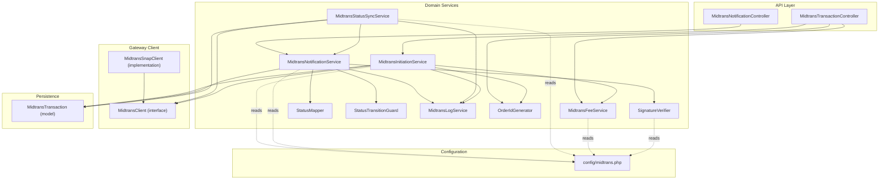
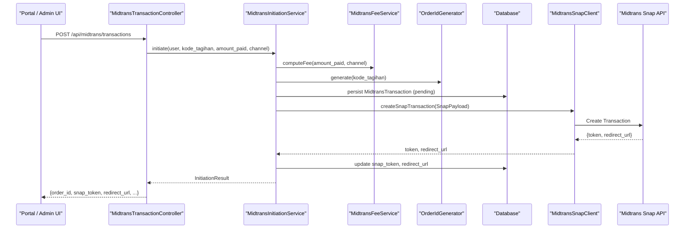
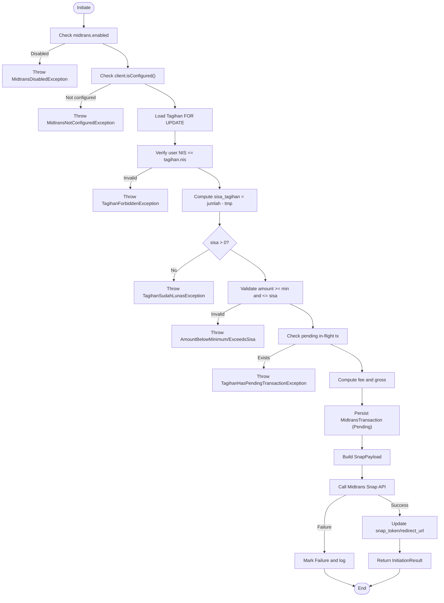
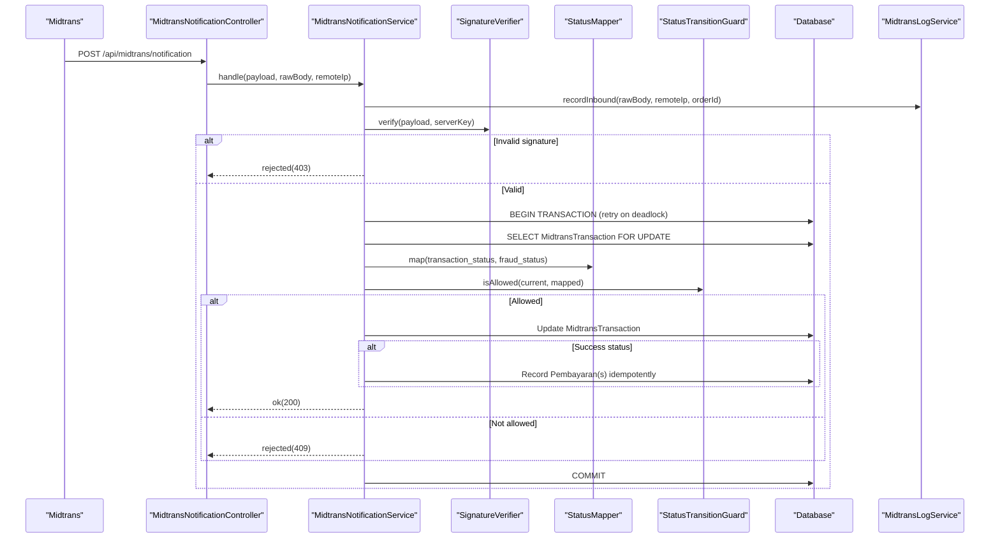
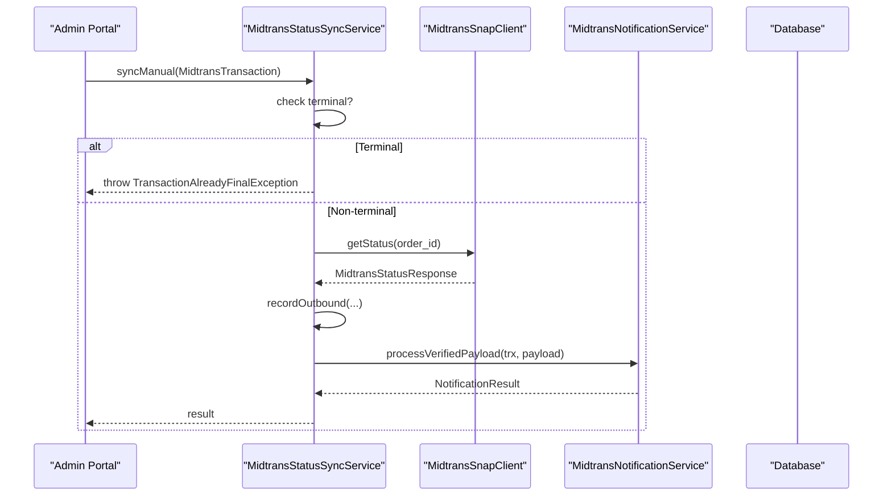
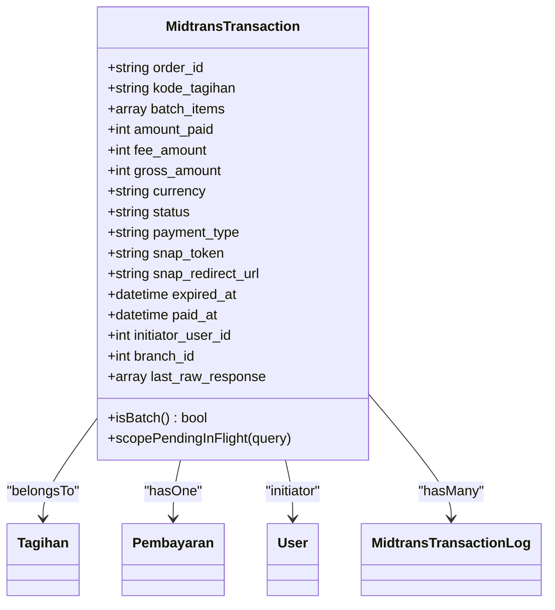
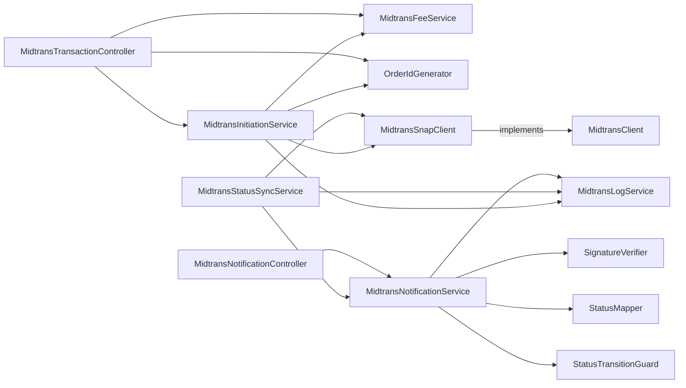

# Midtrans Payment Gateway Integration

<cite>
**Referenced Files in This Document**
- [MidtransClient.php](file://backend/app/Services/Midtrans/MidtransClient.php)
- [MidtransSnapClient.php](file://backend/app/Services/Midtrans/MidtransSnapClient.php)
- [MidtransInitiationService.php](file://backend/app/Services/Midtrans/MidtransInitiationService.php)
- [MidtransNotificationService.php](file://backend/app/Services/Midtrans/MidtransNotificationService.php)
- [MidtransStatusSyncService.php](file://backend/app/Services/Midtrans/MidtransStatusSyncService.php)
- [MidtransFeeService.php](file://backend/app/Services/Midtrans/MidtransFeeService.php)
- [SignatureVerifier.php](file://backend/app/Services/Midtrans/SignatureVerifier.php)
- [StatusMapper.php](file://backend/app/Services/Midtrans/StatusMapper.php)
- [StatusTransitionGuard.php](file://backend/app/Services/Midtrans/StatusTransitionGuard.php)
- [MidtransLogService.php](file://backend/app/Services/Midtrans/MidtransLogService.php)
- [OrderIdGenerator.php](file://backend/app/Services/Midtrans/OrderIdGenerator.php)
- [MidtransTransactionController.php](file://backend/app/Http/Controllers/MidtransTransactionController.php)
- [MidtransNotificationController.php](file://backend/app/Http/Controllers/MidtransNotificationController.php)
- [MidtransTransaction.php](file://backend/app/Models/MidtransTransaction.php)
- [midtrans.php](file://backend/config/midtrans.php)
</cite>

## Table of Contents
1. Introduction
2. Project Structure
3. Core Components
4. Architecture Overview
5. Detailed Component Analysis
6. Dependency Analysis
7. Performance Considerations
8. Troubleshooting Guide
9. Conclusion

## Introduction
This document explains the complete Midtrans payment gateway integration for the Handayani system. It covers client initialization, transaction initiation (single and batch), webhook notification processing, status synchronization, fee calculation per channel, error handling strategies, transaction logging, internal-to-Midtrans status mapping, signature verification, and production monitoring guidance. Practical configuration examples and debugging steps are included to help operators deploy and maintain a robust integration.

## Project Structure
The Midtrans integration is implemented as a set of cohesive services under the backend application:
- API controllers expose endpoints for initiating transactions, listing fee channels, and receiving webhooks.
- Services encapsulate business logic: initiation, notifications, status sync, fees, signature verification, status mapping, transition guard, logging, and order ID generation.
- A dedicated Snap client wraps the official Midtrans SDK for creating Snap transactions and querying status.
- Configuration centralizes credentials, environment toggles, fee policies, and operational settings.

**Diagram sources**
- [MidtransTransactionController.php:1-127](file://backend/app/Http/Controllers/MidtransTransactionController.php#L1-L127)
- [MidtransNotificationController.php:1-35](file://backend/app/Http/Controllers/MidtransNotificationController.php#L1-L35)
- [MidtransInitiationService.php:1-473](file://backend/app/Services/Midtrans/MidtransInitiationService.php#L1-L473)
- [MidtransNotificationService.php:1-284](file://backend/app/Services/Midtrans/MidtransNotificationService.php#L1-L284)
- [MidtransStatusSyncService.php:1-73](file://backend/app/Services/Midtrans/MidtransStatusSyncService.php#L1-L73)
- [MidtransFeeService.php:1-144](file://backend/app/Services/Midtrans/MidtransFeeService.php#L1-L144)
- [SignatureVerifier.php:1-34](file://backend/app/Services/Midtrans/SignatureVerifier.php#L1-L34)
- [StatusMapper.php:1-41](file://backend/app/Services/Midtrans/StatusMapper.php#L1-L41)
- [StatusTransitionGuard.php:1-77](file://backend/app/Services/Midtrans/StatusTransitionGuard.php#L1-L77)
- [MidtransLogService.php:1-109](file://backend/app/Services/Midtrans/MidtransLogService.php#L1-L109)
- [OrderIdGenerator.php:1-64](file://backend/app/Services/Midtrans/OrderIdGenerator.php#L1-L64)
- [MidtransClient.php:1-27](file://backend/app/Services/Midtrans/MidtransClient.php#L1-L27)
- [MidtransSnapClient.php:1-123](file://backend/app/Services/Midtrans/MidtransSnapClient.php#L1-L123)
- [MidtransTransaction.php:1-85](file://backend/app/Models/MidtransTransaction.php#L1-L85)
- [midtrans.php:1-130](file://backend/config/midtrans.php#L1-L130)

**Section sources**
- [MidtransTransactionController.php:1-127](file://backend/app/Http/Controllers/MidtransTransactionController.php#L1-L127)
- [MidtransNotificationController.php:1-35](file://backend/app/Http/Controllers/MidtransNotificationController.php#L1-L35)
- [MidtransInitiationService.php:1-473](file://backend/app/Services/Midtrans/MidtransInitiationService.php#L1-L473)
- [MidtransNotificationService.php:1-284](file://backend/app/Services/Midtrans/MidtransNotificationService.php#L1-L284)
- [MidtransStatusSyncService.php:1-73](file://backend/app/Services/Midtrans/MidtransStatusSyncService.php#L1-L73)
- [MidtransFeeService.php:1-144](file://backend/app/Services/Midtrans/MidtransFeeService.php#L1-L144)
- [SignatureVerifier.php:1-34](file://backend/app/Services/Midtrans/SignatureVerifier.php#L1-L34)
- [StatusMapper.php:1-41](file://backend/app/Services/Midtrans/StatusMapper.php#L1-L41)
- [StatusTransitionGuard.php:1-77](file://backend/app/Services/Midtrans/StatusTransitionGuard.php#L1-L77)
- [MidtransLogService.php:1-109](file://backend/app/Services/Midtrans/MidtransLogService.php#L1-L109)
- [OrderIdGenerator.php:1-64](file://backend/app/Services/Midtrans/OrderIdGenerator.php#L1-L64)
- [MidtransClient.php:1-27](file://backend/app/Services/Midtrans/MidtransClient.php#L1-L27)
- [MidtransSnapClient.php:1-123](file://backend/app/Services/Midtrans/MidtransSnapClient.php#L1-L123)
- [MidtransTransaction.php:1-85](file://backend/app/Models/MidtransTransaction.php#L1-L85)
- [midtrans.php:1-130](file://backend/config/midtrans.php#L1-L130)

## Core Components
- MidtransClient interface and MidtransSnapClient implementation:
  - Encapsulates calls to Midtrans Snap and Status APIs.
  - Configures server/client keys, environment, TLS CA bundle, and 3DS/sanitization flags.
  - Provides an isConfigured check used by higher-level services.
- MidtransInitiationService:
  - Orchestrates single and batch transaction creation via Snap.
  - Validates ownership, amount constraints, pending transactions, computes fees, persists MidtransTransaction, and records logs.
- MidtransNotificationService:
  - Processes inbound webhook payloads with signature verification, gross amount checks, status mapping, transition validation, and idempotent recording of Pembayaran entries.
- MidtransStatusSyncService:
  - Manually queries Midtrans Status API and delegates to notification service for consistent state updates.
- MidtransFeeService:
  - Computes admin fees per channel using flat or percentage+flat rules; exposes available channels with previews.
- SignatureVerifier:
  - Verifies Midtrans webhook signatures using SHA-512 over order_id + status_code + gross_amount + server_key.
- StatusMapper and StatusTransitionGuard:
  - Map Midtrans statuses to internal states and enforce allowed transitions.
- MidtransLogService:
  - Persists inbound/outbound logs with sensitive data masking and safety net checks.
- OrderIdGenerator:
  - Generates Midtrans-compliant order IDs with prefix and timestamp suffix.

**Section sources**
- [MidtransClient.php:1-27](file://backend/app/Services/Midtrans/MidtransClient.php#L1-L27)
- [MidtransSnapClient.php:1-123](file://backend/app/Services/Midtrans/MidtransSnapClient.php#L1-L123)
- [MidtransInitiationService.php:1-473](file://backend/app/Services/Midtrans/MidtransInitiationService.php#L1-L473)
- [MidtransNotificationService.php:1-284](file://backend/app/Services/Midtrans/MidtransNotificationService.php#L1-L284)
- [MidtransStatusSyncService.php:1-73](file://backend/app/Services/Midtrans/MidtransStatusSyncService.php#L1-L73)
- [MidtransFeeService.php:1-144](file://backend/app/Services/Midtrans/MidtransFeeService.php#L1-L144)
- [SignatureVerifier.php:1-34](file://backend/app/Services/Midtrans/SignatureVerifier.php#L1-L34)
- [StatusMapper.php:1-41](file://backend/app/Services/Midtrans/StatusMapper.php#L1-L41)
- [StatusTransitionGuard.php:1-77](file://backend/app/Services/Midtrans/StatusTransitionGuard.php#L1-L77)
- [MidtransLogService.php:1-109](file://backend/app/Services/Midtrans/MidtransLogService.php#L1-L109)
- [OrderIdGenerator.php:1-64](file://backend/app/Services/Midtrans/OrderIdGenerator.php#L1-L64)

## Architecture Overview
The integration follows a layered architecture:
- Controllers handle HTTP requests and delegate to services.
- Services coordinate domain logic, external calls, persistence, and logging.
- The Snap client abstracts Midtrans SDK usage.
- Configuration drives runtime behavior and security.

**Diagram sources**
- [MidtransTransactionController.php:1-127](file://backend/app/Http/Controllers/MidtransTransactionController.php#L1-L127)
- [MidtransInitiationService.php:1-473](file://backend/app/Services/Midtrans/MidtransInitiationService.php#L1-L473)
- [MidtransFeeService.php:1-144](file://backend/app/Services/Midtrans/MidtransFeeService.php#L1-L144)
- [OrderIdGenerator.php:1-64](file://backend/app/Services/Midtrans/OrderIdGenerator.php#L1-L64)
- [MidtransSnapClient.php:1-123](file://backend/app/Services/Midtrans/MidtransSnapClient.php#L1-L123)

## Detailed Component Analysis

### Client Initialization and Configuration
- MidtransSnapClient configures the SDK with server/client keys, environment flag, sanitization, and 3DS. It also sets a reliable CA bundle path for HTTPS on Windows environments.
- isConfigured validates presence of server_key, client_key, and merchant_id before allowing operations.
- Configuration file defines feature toggles, credentials, fee policies, minimum amounts, expiry hours, order prefix, finish URL, and log retention.

Operational notes:
- Ensure HANDAYANI_MIDTRANS_ENABLED controls overall feature availability.
- Use MIDTRANS_ENVIRONMENT to switch between sandbox and production.
- Keep server_key out of HTTP responses; it is only read server-side.

**Section sources**
- [MidtransSnapClient.php:1-123](file://backend/app/Services/Midtrans/MidtransSnapClient.php#L1-L123)
- [midtrans.php:1-130](file://backend/config/midtrans.php#L1-L130)

### Transaction Initiation Service (Single and Batch)
Responsibilities:
- Validate feature flags and client configuration.
- Load and lock Tagihan rows to prevent race conditions.
- Enforce ownership (user NIS matches tagihan NIS).
- Compute sisa_tagihan from jenis_tagihan.jumlah minus cumulative tmp.
- Enforce min_amount and cannot exceed sisa_tagihan.
- Prevent concurrent in-flight pending transactions per tagihan.
- Calculate fee and gross amount; assert invariant gross == amount_paid + fee.
- Generate order ID and persist MidtransTransaction with initial Pending status.
- Build SnapPayload including item details, customer details, expiry, callbacks, and enabled_payments based on selected channel.
- Call Midtrans Snap API; on failure, mark transaction as Failure and log.

Batch flow:
- Accepts multiple kode_tagihan_list, locks them deterministically, validates each, sums their sisa, applies a single fee, and creates one MidtransTransaction with batch_items.
- Snap line items include one row per tagihan plus one fee row.

**Diagram sources**
- [MidtransInitiationService.php:1-473](file://backend/app/Services/Midtrans/MidtransInitiationService.php#L1-L473)
- [MidtransFeeService.php:1-144](file://backend/app/Services/Midtrans/MidtransFeeService.php#L1-L144)
- [OrderIdGenerator.php:1-64](file://backend/app/Services/Midtrans/OrderIdGenerator.php#L1-L64)
- [MidtransSnapClient.php:1-123](file://backend/app/Services/Midtrans/MidtransSnapClient.php#L1-L123)

**Section sources**
- [MidtransInitiationService.php:1-473](file://backend/app/Services/Midtrans/MidtransInitiationService.php#L1-L473)

### Webhook Notification Processing
Flow:
- Controller receives raw JSON body and IP address.
- Service checks webhook_enabled flag.
- Records inbound log (masked).
- Verifies signature using SignatureVerifier.
- Loads MidtransTransaction FOR UPDATE within a retryable DB transaction.
- Validates gross_amount against stored value.
- Maps transaction_status and fraud_status to internal status via StatusMapper.
- Enforces allowed transitions via StatusTransitionGuard.
- Updates MidtransTransaction fields and paid_at when settlement_time present.
- On success, records Pembayaran(s) idempotently and emits PembayaranRecorded event.

**Diagram sources**
- [MidtransNotificationController.php:1-35](file://backend/app/Http/Controllers/MidtransNotificationController.php#L1-L35)
- [MidtransNotificationService.php:1-284](file://backend/app/Services/Midtrans/MidtransNotificationService.php#L1-L284)
- [SignatureVerifier.php:1-34](file://backend/app/Services/Midtrans/SignatureVerifier.php#L1-L34)
- [StatusMapper.php:1-41](file://backend/app/Services/Midtrans/StatusMapper.php#L1-L41)
- [StatusTransitionGuard.php:1-77](file://backend/app/Services/Midtrans/StatusTransitionGuard.php#L1-L77)
- [MidtransLogService.php:1-109](file://backend/app/Services/Midtrans/MidtransLogService.php#L1-L109)

**Section sources**
- [MidtransNotificationController.php:1-35](file://backend/app/Http/Controllers/MidtransNotificationController.php#L1-L35)
- [MidtransNotificationService.php:1-284](file://backend/app/Services/Midtrans/MidtransNotificationService.php#L1-L284)

### Status Synchronization
Manual sync:
- If transaction is terminal, throws TransactionAlreadyFinalException.
- Calls Midtrans Status API via MidtransSnapClient.getStatus.
- Logs outbound call details.
- Synthesizes a webhook-shaped payload and delegates to NotificationService.processVerifiedPayload for consistent state updates.

**Diagram sources**
- [MidtransStatusSyncService.php:1-73](file://backend/app/Services/Midtrans/MidtransStatusSyncService.php#L1-L73)
- [MidtransSnapClient.php:1-123](file://backend/app/Services/Midtrans/MidtransSnapClient.php#L1-L123)
- [MidtransNotificationService.php:1-284](file://backend/app/Services/Midtrans/MidtransNotificationService.php#L1-L284)

**Section sources**
- [MidtransStatusSyncService.php:1-73](file://backend/app/Services/Midtrans/MidtransStatusSyncService.php#L1-L73)

### Fee Calculation Service
- Supports two fee types per channel:
  - flat: fixed amount per transaction.
  - percent: percentage of amount_paid with optional flat component.
- Falls back to global fee_flat if channel not recognized.
- Exposes availableChannels with computed previews for UI selection.
- Asserts gross invariant to catch inconsistencies early.

Channel mapping to Snap enabled_payments:
- Internal keys like qris, bank_transfer, gopay, shopeepay, credit_card map to specific Midtrans payment codes to restrict UI options.

**Section sources**
- [MidtransFeeService.php:1-144](file://backend/app/Services/Midtrans/MidtransFeeService.php#L1-L144)
- [MidtransInitiationService.php:440-471](file://backend/app/Services/Midtrans/MidtransInitiationService.php#L440-L471)

### Signature Verification
- Computes expected signature as SHA-512(order_id + status_code + gross_amount + server_key).
- Uses constant-time comparison to prevent timing attacks.
- Rejects invalid signatures with 403 response.

**Section sources**
- [SignatureVerifier.php:1-34](file://backend/app/Services/Midtrans/SignatureVerifier.php#L1-L34)
- [MidtransNotificationService.php:1-284](file://backend/app/Services/Midtrans/MidtransNotificationService.php#L1-L284)

### Status Mapping and Transition Guard
- StatusMapper maps Midtrans transaction_status and fraud_status to internal states (e.g., capture with accept → Capture; otherwise Deny).
- StatusTransitionGuard enforces allowed transitions and identifies terminal states.

Internal states include: Pending, Settlement, Capture, PartialRefund, Refund, Deny, Cancel, Expire, Failure.

**Section sources**
- [StatusMapper.php:1-41](file://backend/app/Services/Midtrans/StatusMapper.php#L1-L41)
- [StatusTransitionGuard.php:1-77](file://backend/app/Services/Midtrans/StatusTransitionGuard.php#L1-L77)

### Transaction Logging Mechanisms
- MidtransLogService records inbound and outbound interactions with masked payloads.
- Masks known sensitive keys (server_key, signature_key) and includes a safety net that aborts persistence if the literal server_key is still found.
- Logs include direction, HTTP status (for outbound), raw_payload, and remote_ip (for inbound).

**Section sources**
- [MidtransLogService.php:1-109](file://backend/app/Services/Midtrans/MidtransLogService.php#L1-L109)

### Data Model Relationships

**Diagram sources**
- [MidtransTransaction.php:1-85](file://backend/app/Models/MidtransTransaction.php#L1-L85)

**Section sources**
- [MidtransTransaction.php:1-85](file://backend/app/Models/MidtransTransaction.php#L1-L85)

## Dependency Analysis
High-level dependencies:
- Controllers depend on services for orchestration.
- InitiationService depends on FeeService, LogService, OrderIdGenerator, and SnapClient.
- NotificationService depends on SignatureVerifier, StatusMapper, StatusTransitionGuard, LogService, and FeeService.
- StatusSyncService depends on SnapClient, NotificationService, and LogService.
- All services read configuration from config/midtrans.php.

**Diagram sources**
- [MidtransTransactionController.php:1-127](file://backend/app/Http/Controllers/MidtransTransactionController.php#L1-L127)
- [MidtransNotificationController.php:1-35](file://backend/app/Http/Controllers/MidtransNotificationController.php#L1-L35)
- [MidtransInitiationService.php:1-473](file://backend/app/Services/Midtrans/MidtransInitiationService.php#L1-L473)
- [MidtransNotificationService.php:1-284](file://backend/app/Services/Midtrans/MidtransNotificationService.php#L1-L284)
- [MidtransStatusSyncService.php:1-73](file://backend/app/Services/Midtrans/MidtransStatusSyncService.php#L1-L73)
- [MidtransFeeService.php:1-144](file://backend/app/Services/Midtrans/MidtransFeeService.php#L1-L144)
- [SignatureVerifier.php:1-34](file://backend/app/Services/Midtrans/SignatureVerifier.php#L1-L34)
- [StatusMapper.php:1-41](file://backend/app/Services/Midtrans/StatusMapper.php#L1-L41)
- [StatusTransitionGuard.php:1-77](file://backend/app/Services/Midtrans/StatusTransitionGuard.php#L1-L77)
- [MidtransLogService.php:1-109](file://backend/app/Services/Midtrans/MidtransLogService.php#L1-L109)
- [OrderIdGenerator.php:1-64](file://backend/app/Services/Midtrans/OrderIdGenerator.php#L1-L64)
- [MidtransClient.php:1-27](file://backend/app/Services/Midtrans/MidtransClient.php#L1-L27)
- [MidtransSnapClient.php:1-123](file://backend/app/Services/Midtrans/MidtransSnapClient.php#L1-L123)

**Section sources**
- [MidtransTransactionController.php:1-127](file://backend/app/Http/Controllers/MidtransTransactionController.php#L1-L127)
- [MidtransNotificationController.php:1-35](file://backend/app/Http/Controllers/MidtransNotificationController.php#L1-L35)
- [MidtransInitiationService.php:1-473](file://backend/app/Services/Midtrans/MidtransInitiationService.php#L1-L473)
- [MidtransNotificationService.php:1-284](file://backend/app/Services/Midtrans/MidtransNotificationService.php#L1-L284)
- [MidtransStatusSyncService.php:1-73](file://backend/app/Services/Midtrans/MidtransStatusSyncService.php#L1-L73)
- [MidtransFeeService.php:1-144](file://backend/app/Services/Midtrans/MidtransFeeService.php#L1-L144)
- [SignatureVerifier.php:1-34](file://backend/app/Services/Midtrans/SignatureVerifier.php#L1-L34)
- [StatusMapper.php:1-41](file://backend/app/Services/Midtrans/StatusMapper.php#L1-L41)
- [StatusTransitionGuard.php:1-77](file://backend/app/Services/Midtrans/StatusTransitionGuard.php#L1-L77)
- [MidtransLogService.php:1-109](file://backend/app/Services/Midtrans/MidtransLogService.php#L1-L109)
- [OrderIdGenerator.php:1-64](file://backend/app/Services/Midtrans/OrderIdGenerator.php#L1-L64)
- [MidtransClient.php:1-27](file://backend/app/Services/Midtrans/MidtransClient.php#L1-L27)
- [MidtransSnapClient.php:1-123](file://backend/app/Services/Midtrans/MidtransSnapClient.php#L1-L123)

## Performance Considerations
- Database locking:
  - Use FOR UPDATE on Tagihan and MidtransTransaction rows to avoid race conditions during initiation and notification processing.
  - Deterministic ordering when locking multiple Tagihan rows prevents deadlocks in batch flows.
- Idempotency:
  - Notification processing skips duplicate Pembayaran creation using midtrans_order_id uniqueness guard.
- Retries:
  - Notification service wraps DB transactions with retries to handle transient deadlocks.
- External API resilience:
  - MidtransUnavailableException surfaces network failures; ensure upstream callers implement appropriate retry/backoff policies where needed.
- Logging overhead:
  - Masking adds CPU cost; consider batching or async logging in high-throughput environments.

[No sources needed since this section provides general guidance]

## Troubleshooting Guide
Common issues and resolutions:
- Invalid signature:
  - Symptom: 403 INVALID_SIGNATURE.
  - Action: Verify server_key configuration and ensure payload integrity.
- Amount mismatch:
  - Symptom: 422 AMOUNT_MISMATCH.
  - Action: Confirm gross_amount consistency between initiation and webhook; review fee calculations.
- Overpayment blocked:
  - Symptom: Exception thrown when recorded amount exceeds sisa_tagihan.
  - Action: Validate payment amounts against remaining balances; adjust batch items if necessary.
- Transaction not yet processed:
  - Symptom: Status API returns 404 until buyer selects a payment method.
  - Action: Retry after a short delay or rely on webhook when available.
- Feature disabled:
  - Symptom: MidtransDisabledException or WebhookDisabledException.
  - Action: Enable HANDAYANI_MIDTRANS_ENABLED and/or HANDAYANI_MIDTRANS_WEBHOOK_ENABLED.
- Missing configuration:
  - Symptom: MidtransNotConfiguredException.
  - Action: Set MIDTRANS_SERVER_KEY, MIDTRANS_CLIENT_KEY, MIDTRANS_MERCHANT_ID.

Monitoring approaches:
- Inspect MidtransTransactionLog entries for inbound/outbound payloads and HTTP statuses.
- Use controller endpoints to poll transaction status and inspect fields such as status, paid_at, and expired_at.
- Configure MIDTRANS_LOG_RETENTION_DAYS appropriately for auditability.

**Section sources**
- [MidtransNotificationService.php:1-284](file://backend/app/Services/Midtrans/MidtransNotificationService.php#L1-L284)
- [MidtransLogService.php:1-109](file://backend/app/Services/Midtrans/MidtransLogService.php#L1-L109)
- [MidtransTransactionController.php:1-127](file://backend/app/Http/Controllers/MidtransTransactionController.php#L1-L127)
- [midtrans.php:1-130](file://backend/config/midtrans.php#L1-L130)

## Conclusion
The Handayani Midtrans integration provides a robust, secure, and configurable payment workflow. It separates concerns across controllers, services, and a dedicated client layer, enforces strong invariants (amounts, transitions, signatures), supports both single and batch payments, and offers comprehensive logging and monitoring capabilities. With proper configuration and operational practices, the system ensures reliable payment processing and reconciliation.

[No sources needed since this section summarizes without analyzing specific files]