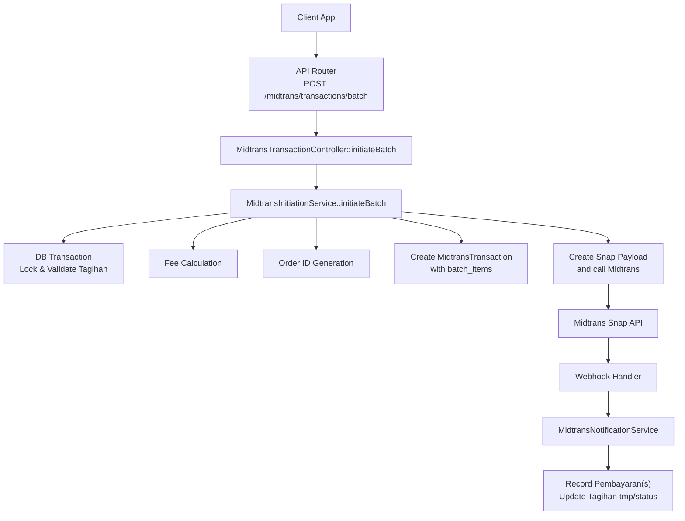
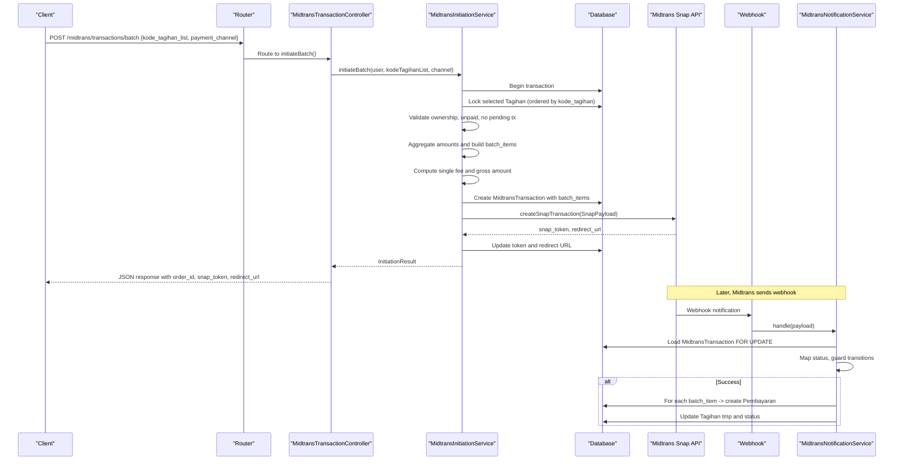
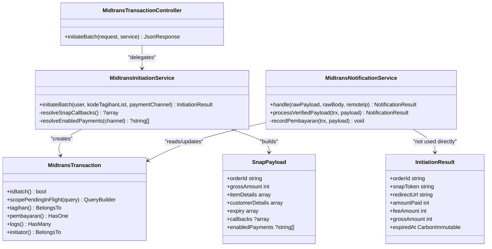
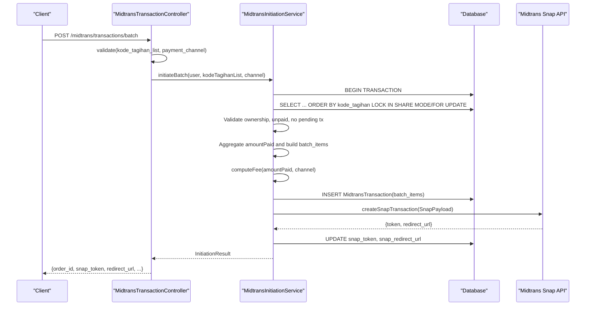
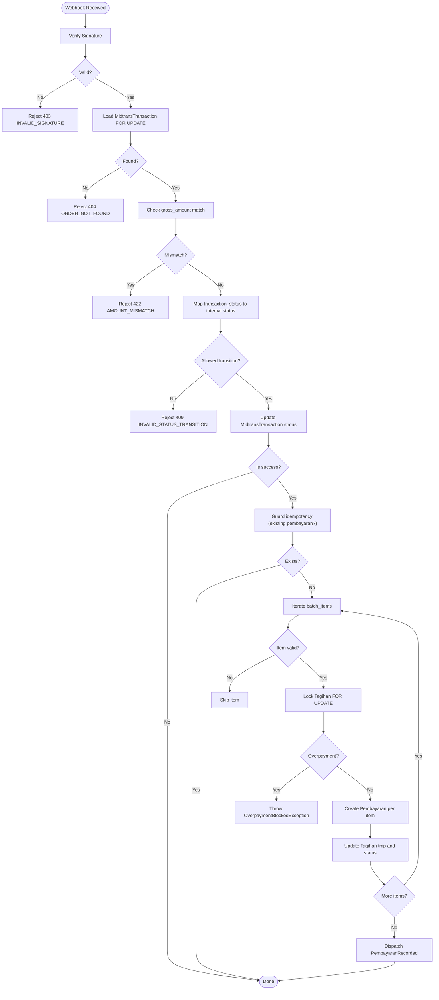

# Batch Payment Processing

<cite>
**Referenced Files in This Document**
- [MidtransTransactionController.php](file://backend/app/Http/Controllers/MidtransTransactionController.php)
- [MidtransInitiationService.php](file://backend/app/Services/Midtrans/MidtransInitiationService.php)
- [MidtransNotificationService.php](file://backend/app/Services/Midtrans/MidtransNotificationService.php)
- [MidtransTransaction.php](file://backend/app/Models/MidtransTransaction.php)
- [2026_06_23_000001_add_batch_items_to_midtrans_transactions_table.php](file://backend/database/migrations/2026_06_23_000001_add_batch_items_to_midtrans_transactions_table.php)
- [api.php](file://backend/routes/api.php)
- [InitiationResult.php](file://backend/app/Services/Midtrans/Dto/InitiationResult.php)
- [SnapPayload.php](file://backend/app/Services/Midtrans/Dto/SnapPayload.php)
</cite>

## Table of Contents
1. [Introduction](#introduction)
2. [Project Structure](#project-structure)
3. [Core Components](#core-components)
4. [Architecture Overview](#architecture-overview)
5. [Detailed Component Analysis](#detailed-component-analysis)
6. [Dependency Analysis](#dependency-analysis)
7. [Performance Considerations](#performance-considerations)
8. [Troubleshooting Guide](#troubleshooting-guide)
9. [Conclusion](#conclusion)

## Introduction
This document explains the batch payment processing functionality that consolidates multiple Tagihan (invoices) into a single Midtrans Snap checkout session. It focuses on the initiateBatch() method, covering:
- Multi-tagihan consolidation and bulk validation
- Deterministic ordering to prevent deadlocks
- Batch item aggregation and primary tagihan selection
- Single fee application across the batch
- Consolidated Snap payload creation
- The batch_items array structure and how it maps to individual Tagihan records
- How multiple invoices are settled in one Midtrans transaction and materialized as separate Pembayaran records via webhook

## Project Structure
The batch payment flow spans controllers, services, models, DTOs, routes, and database migrations:
- API endpoint for initiating batch payments
- Service orchestration for validation, locking, fee calculation, and Snap payload creation
- Model and migration for storing batch metadata
- Notification service for idempotent settlement and per-item Pembayaran creation

**Diagram sources**
- [api.php:330](file://backend/routes/api.php#L330)
- [MidtransTransactionController.php:66-90](file://backend/app/Http/Controllers/MidtransTransactionController.php#L66-L90)
- [MidtransInitiationService.php:250-417](file://backend/app/Services/Midtrans/MidtransInitiationService.php#L250-L417)
- [MidtransTransaction.php:11-42](file://backend/app/Models/MidtransTransaction.php#L11-L42)
- [2026_06_23_000001_add_batch_items_to_midtrans_transactions_table.php:21-25](file://backend/database/migrations/2026_06_23_000001_add_batch_items_to_midtrans_transactions_table.php#L21-L25)
- [MidtransNotificationService.php:162-236](file://backend/app/Services/Midtrans/MidtransNotificationService.php#L162-L236)

**Section sources**
- [api.php:330](file://backend/routes/api.php#L330)
- [MidtransTransactionController.php:66-90](file://backend/app/Http/Controllers/MidtransTransactionController.php#L66-L90)
- [MidtransInitiationService.php:250-417](file://backend/app/Services/Midtrans/MidtransInitiationService.php#L250-L417)
- [MidtransTransaction.php:11-42](file://backend/app/Models/MidtransTransaction.php#L11-L42)
- [2026_06_23_000001_add_batch_items_to_midtrans_transactions_table.php:21-25](file://backend/database/migrations/2026_06_23_000001_add_batch_items_to_midtrans_transactions_table.php#L21-L25)
- [MidtransNotificationService.php:162-236](file://backend/app/Services/Midtrans/MidtransNotificationService.php#L162-L236)

## Core Components
- API Controller: Validates input and delegates to the initiation service.
- Initiation Service: Orchestrates multi-tagihan validation, deterministic locking, fee computation, transaction persistence, and Snap payload creation.
- Notification Service: Processes webhooks, updates transaction status, and materializes Pembayaran records per batch item.
- Model and Migration: Persist batch metadata and provide helpers for batch detection and pending checks.
- DTOs: Strongly typed structures for initiation results and Snap payloads.

Key responsibilities:
- Input validation and authorization at controller layer
- Bulk validation and deadlock-safe locking in service layer
- Single fee application and gross amount invariant enforcement
- Snapshot of batch items for later settlement
- Idempotent settlement with overpayment protection

**Section sources**
- [MidtransTransactionController.php:66-90](file://backend/app/Http/Controllers/MidtransTransactionController.php#L66-L90)
- [MidtransInitiationService.php:250-417](file://backend/app/Services/Midtrans/MidtransInitiationService.php#L250-L417)
- [MidtransNotificationService.php:162-236](file://backend/app/Services/Midtrans/MidtransNotificationService.php#L162-L236)
- [MidtransTransaction.php:11-42](file://backend/app/Models/MidtransTransaction.php#L11-L42)
- [InitiationResult.php:7-18](file://backend/app/Services/Midtrans/Dto/InitiationResult.php#L7-L18)
- [SnapPayload.php:5-23](file://backend/app/Services/Midtrans/Dto/SnapPayload.php#L5-L23)

## Architecture Overview
End-to-end sequence from client request to settlement:

**Diagram sources**
- [api.php:330](file://backend/routes/api.php#L330)
- [MidtransTransactionController.php:66-90](file://backend/app/Http/Controllers/MidtransTransactionController.php#L66-L90)
- [MidtransInitiationService.php:250-417](file://backend/app/Services/Midtrans/MidtransInitiationService.php#L250-L417)
- [MidtransNotificationService.php:31-150](file://backend/app/Services/Midtrans/MidtransNotificationService.php#L31-L150)
- [MidtransNotificationService.php:162-236](file://backend/app/Services/Midtrans/MidtransNotificationService.php#L162-L236)

## Detailed Component Analysis

### initiateBatch() Implementation
Responsibilities:
- Feature flag and configuration checks
- Normalize and deduplicate input list
- Bulk validation within a DB transaction
- Deterministic row locking to avoid deadlocks
- Per-tagihan validation (ownership, unpaid, no pending transaction)
- Aggregation of amounts and construction of batch_items
- Single fee application and gross amount invariant check
- Creation of MidtransTransaction with batch_items
- Build consolidated Snap payload with multiple line items plus one fee row
- Call Midtrans Snap API and persist token/redirect URL

Deterministic ordering and deadlock prevention:
- All selected Tagihan are locked using lockForUpdate() after ordering by kode_tagihan. This ensures consistent acquisition order across concurrent requests, preventing deadlocks.

Primary Tagihan selection logic:
- The first valid Tagihan encountered becomes the “primary” used for order_id generation and reference fields (nis, branch_id).

Single fee application:
- A single fee is computed based on the aggregated amountPaid across all items and applied once to the entire batch.

Consolidated Snap payload:
- One line item per Tagihan with its remaining balance (sisa), plus one additional line item for the admin fee. Customer details are derived from the primary Tagihan’s student and parent email when available.

Error handling during initiation:
- Missing or invalid input, missing Tagihan, unauthorized access, already paid Tagihan, pending transactions, minimum amount below threshold, and Midtrans unavailability are handled by throwing specific exceptions or updating transaction status to failure.

**Section sources**
- [MidtransInitiationService.php:250-417](file://backend/app/Services/Midtrans/MidtransInitiationService.php#L250-L417)
- [MidtransTransaction.php:55-59](file://backend/app/Models/MidtransTransaction.php#L55-L59)

### batch_items Array Structure
Purpose:
- Captures the per-tagihan breakdown for a batch transaction so the webhook can materialize one Pembayaran per item.

Structure:
- Each element contains:
  - kode_tagihan: string identifier of the invoice
  - amount: integer amount to settle for that invoice (remaining balance)

Persistence:
- Stored as JSON in midtrans_transactions.batch_items.
- The model casts this column to an array and provides isBatch() helper to detect multi-tagihan transactions.

Migration:
- Adds the batch_items JSON column after kode_tagihan; comments explain usage and relationship to the primary kode_tagihan field.

**Section sources**
- [MidtransTransaction.php:11-42](file://backend/app/Models/MidtransTransaction.php#L11-L42)
- [MidtransTransaction.php:47-50](file://backend/app/Models/MidtransTransaction.php#L47-L50)
- [2026_06_23_000001_add_batch_items_to_midtrans_transactions_table.php:21-25](file://backend/database/migrations/2026_06_23_000001_add_batch_items_to_midtrans_transactions_table.php#L21-L25)

### Settlement Flow and Relationship Between Batch Transactions and Tagihan Records
When Midtrans settles a batch transaction:
- The notification service loads the MidtransTransaction and validates gross amount and status transitions.
- If successful, it iterates over batch_items and creates one Pembayaran per item, linking back to the corresponding Tagihan.
- Each Tagihan’s tmp is increased by the item amount, and status updated to Lunas if fully paid.
- Only the first Pembayaran row carries the midtrans_order_id to satisfy uniqueness constraints while preserving traceability through batch_items.

Idempotency and safety:
- The settlement process is idempotent; duplicate notifications do not re-create Pembayaran records.
- Overpayment is blocked by comparing item amount against remaining balance (sisa).

**Section sources**
- [MidtransNotificationService.php:162-236](file://backend/app/Services/Midtrans/MidtransNotificationService.php#L162-L236)

### API Contract and Request Validation
Endpoint:
- POST /api/midtrans/transactions/batch

Request body:
- kode_tagihan_list: required array of strings (1–50 items)
- payment_channel: optional string (channel hint for enabled_payments mapping)

Response:
- order_id, snap_token, redirect_url, amount_paid, fee_amount, gross_amount, client_key

Validation:
- Controller-level validation enforces presence, types, and size limits.

**Section sources**
- [MidtransTransactionController.php:66-90](file://backend/app/Http/Controllers/MidtransTransactionController.php#L66-L90)
- [api.php:330](file://backend/routes/api.php#L330)

### Data Models and DTOs
- MidtransTransaction: Stores batch metadata, including batch_items, and exposes helpers for pending and batch detection.
- InitiationResult: Return type encapsulating orderId, snapToken, redirectUrl, and monetary totals.
- SnapPayload: Strongly typed structure for constructing Snap payloads with itemDetails, customerDetails, expiry, callbacks, and enabledPayments.

**Section sources**
- [MidtransTransaction.php:11-42](file://backend/app/Models/MidtransTransaction.php#L11-L42)
- [InitiationResult.php:7-18](file://backend/app/Services/Midtrans/Dto/InitiationResult.php#L7-L18)
- [SnapPayload.php:5-23](file://backend/app/Services/Midtrans/Dto/SnapPayload.php#L5-L23)

### Class Diagram (Code-Level Relationships)

**Diagram sources**
- [MidtransTransactionController.php:66-90](file://backend/app/Http/Controllers/MidtransTransactionController.php#L66-L90)
- [MidtransInitiationService.php:250-417](file://backend/app/Services/Midtrans/MidtransInitiationService.php#L250-L417)
- [MidtransNotificationService.php:31-150](file://backend/app/Services/Midtrans/MidtransNotificationService.php#L31-L150)
- [MidtransTransaction.php:11-42](file://backend/app/Models/MidtransTransaction.php#L11-L42)
- [InitiationResult.php:7-18](file://backend/app/Services/Midtrans/Dto/InitiationResult.php#L7-L18)
- [SnapPayload.php:5-23](file://backend/app/Services/Midtrans/Dto/SnapPayload.php#L5-L23)

### Sequence Diagram (Batch Initiation)

**Diagram sources**
- [MidtransTransactionController.php:66-90](file://backend/app/Http/Controllers/MidtransTransactionController.php#L66-L90)
- [MidtransInitiationService.php:250-417](file://backend/app/Services/Midtrans/MidtransInitiationService.php#L250-L417)

### Flowchart (Settlement Logic for Batch Items)

**Diagram sources**
- [MidtransNotificationService.php:31-150](file://backend/app/Services/Midtrans/MidtransNotificationService.php#L31-L150)
- [MidtransNotificationService.php:162-236](file://backend/app/Services/Midtrans/MidtransNotificationService.php#L162-L236)

## Dependency Analysis
- Controller depends on the initiation service for business logic.
- Initiation service depends on:
  - Database for locking and persistence
  - Fee service for fee computation
  - Order ID generator for unique identifiers
  - Midtrans client for Snap API calls
  - Log service for outbound logging
- Notification service depends on:
  - Signature verifier and status mapper
  - Status transition guard
  - Database for idempotent settlement
  - Event dispatcher for PembayaranRecorded events

Potential coupling points:
- Midtrans API availability and signature verification
- Database locking strategy and deadlock retries
- Configuration flags controlling feature enablement and channels

External dependencies:
- Midtrans Snap API
- Database engine supporting row-level locks and JSON columns

**Section sources**
- [MidtransTransactionController.php:66-90](file://backend/app/Http/Controllers/MidtransTransactionController.php#L66-L90)
- [MidtransInitiationService.php:250-417](file://backend/app/Services/Midtrans/MidtransInitiationService.php#L250-L417)
- [MidtransNotificationService.php:31-150](file://backend/app/Services/Midtrans/MidtransNotificationService.php#L31-L150)

## Performance Considerations
- Deterministic ordering and lockForUpdate() reduce contention and prevent deadlocks during batch validation.
- Single fee computation avoids repeated calculations and keeps gross amount invariant checks efficient.
- JSON storage of batch_items minimizes schema changes and allows flexible per-item settlement.
- Idempotent settlement prevents duplicate work on webhook retries.

[No sources needed since this section provides general guidance]

## Troubleshooting Guide
Common issues and diagnostics:
- Invalid signature: Webhook rejected with 403 INVALID_SIGNATURE. Check server key and payload integrity.
- Order not found: 404 ORDER_NOT_FOUND indicates missing or expired transaction record.
- Amount mismatch: 422 AMOUNT_MISMATCH suggests gross_amount differences between system and Midtrans.
- Invalid status transition: 409 INVALID_STATUS_TRANSITION indicates unexpected state change.
- Overpayment blocked: During settlement, if item amount exceeds remaining balance, an exception is thrown and logged.
- Midtrans unavailable: On Snap API failure, transaction status is set to failure and outbound logs recorded.

Operational tips:
- Inspect last_raw_response on MidtransTransaction for detailed webhook payloads.
- Use pendingInFlight scope to detect in-flight transactions before initiating new ones.
- Review outbound logs for Snap API responses and errors.

**Section sources**
- [MidtransNotificationService.php:31-150](file://backend/app/Services/Midtrans/MidtransNotificationService.php#L31-L150)
- [MidtransNotificationService.php:162-236](file://backend/app/Services/Midtrans/MidtransNotificationService.php#L162-L236)
- [MidtransInitiationService.php:250-417](file://backend/app/Services/Midtrans/MidtransInitiationService.php#L250-L417)

## Conclusion
The batch payment processing implementation consolidates multiple Tagihan into a single Midtrans Snap session with robust validation, deadlock-safe locking, and idempotent settlement. The batch_items array enables precise per-invoice accounting while maintaining a unified transaction record. Proper error handling and logging ensure reliability and observability throughout the lifecycle.