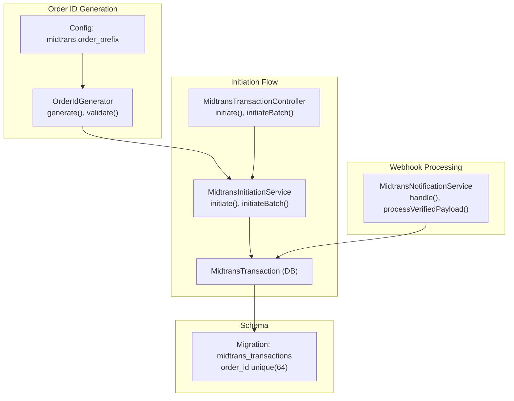
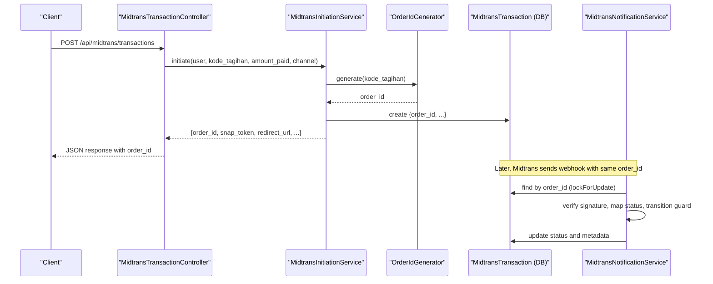
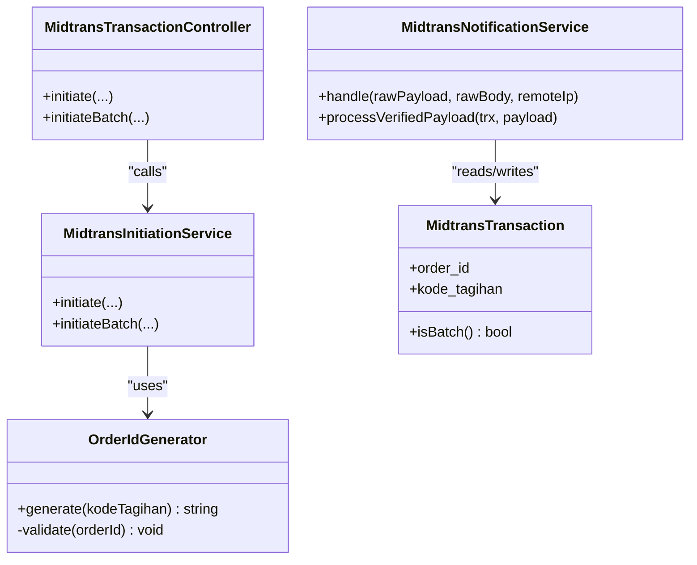
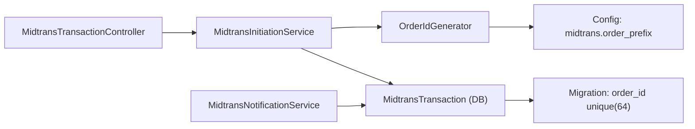

# Order ID Generation Strategy

<cite>
**Referenced Files in This Document**
- [OrderIdGenerator.php](file://backend/app/Services/Midtrans/OrderIdGenerator.php)
- [MidtransInitiationService.php](file://backend/app/Services/Midtrans/MidtransInitiationService.php)
- [MidtransNotificationService.php](file://backend/app/Services/Midtrans/MidtransNotificationService.php)
- [MidtransTransactionController.php](file://backend/app/Http/Controllers/MidtransTransactionController.php)
- [MidtransTransaction.php](file://backend/app/Models/MidtransTransaction.php)
- [midtrans.php](file://backend/config/midtrans.php)
- [2026_06_22_000001_create_midtrans_transactions_table.php](file://backend/database/migrations/2026_06_22_000001_create_midtrans_transactions_table.php)
- [GenerateKodeTagihan.php](file://backend/app/Services/GenerateKodeTagihan.php)
- [OrderIdGeneratorTest.php](file://backend/tests/Unit/Services/Midtrans/OrderIdGeneratorTest.php)
</cite>

## Table of Contents
1. [Introduction](#introduction)
2. [Project Structure](#project-structure)
3. [Core Components](#core-components)
4. [Architecture Overview](#architecture-overview)
5. [Detailed Component Analysis](#detailed-component-analysis)
6. [Dependency Analysis](#dependency-analysis)
7. [Performance Considerations](#performance-considerations)
8. [Troubleshooting Guide](#troubleshooting-guide)
9. [Conclusion](#conclusion)

## Introduction
This document explains the order ID generation strategy used for Midtrans transactions. It covers the OrderIdGenerator service, the algorithm and format conventions, collision prevention mechanisms, how order IDs relate to kode_tagihan, and their role across the transaction lifecycle including webhook processing, reconciliation, and reporting.

## Project Structure
The order ID strategy is implemented as a dedicated service and integrated into the payment initiation flow, persisted in the transaction model, and consumed by notification handling and controllers.

**Diagram sources**
- [OrderIdGenerator.php:24-34](file://backend/app/Services/Midtrans/OrderIdGenerator.php#L24-L34)
- [midtrans.php:113](file://backend/config/midtrans.php#L113)
- [MidtransTransactionController.php:17-41](file://backend/app/Http/Controllers/MidtransTransactionController.php#L17-L41)
- [MidtransInitiationService.php:114-133](file://backend/app/Services/Midtrans/MidtransInitiationService.php#L114-L133)
- [MidtransNotificationService.php:31-68](file://backend/app/Services/Midtrans/MidtransNotificationService.php#L31-L68)
- [2026_06_22_000001_create_midtrans_transactions_table.php:17](file://backend/database/migrations/2026_06_22_000001_create_midtrans_transactions_table.php#L17)

**Section sources**
- [OrderIdGenerator.php:1-64](file://backend/app/Services/Midtrans/OrderIdGenerator.php#L1-L64)
- [MidtransInitiationService.php:114-133](file://backend/app/Services/Midtrans/MidtransInitiationService.php#L114-L133)
- [MidtransNotificationService.php:31-68](file://backend/app/Services/Midtrans/MidtransNotificationService.php#L31-L68)
- [MidtransTransactionController.php:17-41](file://backend/app/Http/Controllers/MidtransTransactionController.php#L17-L41)
- [midtrans.php:113](file://backend/config/midtrans.php#L113)
- [2026_06_22_000001_create_midtrans_transactions_table.php:17](file://backend/database/migrations/2026_06_22_000001_create_midtrans_transactions_table.php#L17)

## Core Components
- OrderIdGenerator: Generates and validates order IDs per Midtrans constraints.
- MidtransInitiationService: Uses OrderIdGenerator during single and batch payment initiation.
- MidtransNotificationService: Consumes order_id from webhooks to locate and update transactions.
- MidtransTransactionController: Exposes endpoints that return order_id to clients.
- MidtransTransaction model and migration: Persist order_id with uniqueness and length constraints.
- Configuration: Provides configurable prefix for order IDs.

Key responsibilities:
- Generate deterministic, unique, and compliant order IDs.
- Enforce Midtrans character set and length limits.
- Integrate order_id creation into transaction persistence and API responses.
- Use order_id for idempotent webhook processing and reconciliation.

**Section sources**
- [OrderIdGenerator.php:24-34](file://backend/app/Services/Midtrans/OrderIdGenerator.php#L24-L34)
- [MidtransInitiationService.php:114-133](file://backend/app/Services/Midtrans/MidtransInitiationService.php#L114-L133)
- [MidtransNotificationService.php:31-68](file://backend/app/Services/Midtrans/MidtransNotificationService.php#L31-L68)
- [MidtransTransactionController.php:17-41](file://backend/app/Http/Controllers/MidtransTransactionController.php#L17-L41)
- [MidtransTransaction.php:11-29](file://backend/app/Models/MidtransTransaction.php#L11-L29)
- [2026_06_22_000001_create_midtrans_transactions_table.php:17](file://backend/database/migrations/2026_06_22_000001_create_midtrans_transactions_table.php#L17)
- [midtrans.php:113](file://backend/config/midtrans.php#L113)

## Architecture Overview
The order ID flows from configuration through generation, into transaction persistence, then across API responses and webhook processing.

**Diagram sources**
- [MidtransTransactionController.php:17-41](file://backend/app/Http/Controllers/MidtransTransactionController.php#L17-L41)
- [MidtransInitiationService.php:114-133](file://backend/app/Services/Midtrans/MidtransInitiationService.php#L114-L133)
- [OrderIdGenerator.php:24-34](file://backend/app/Services/Midtrans/OrderIdGenerator.php#L24-L34)
- [MidtransNotificationService.php:31-68](file://backend/app/Services/Midtrans/MidtransNotificationService.php#L31-L68)

## Detailed Component Analysis

### OrderIdGenerator Service
Responsibilities:
- Build an order ID using a configurable prefix, the invoice code (kode_tagihan), and a millisecond epoch timestamp.
- Validate against Midtrans constraints: maximum length and allowed characters.

Algorithm overview:
- Prefix resolution from configuration.
- Concatenate parts with hyphens.
- Validate length and charset; throw on violation.

Collision prevention:
- The inclusion of epoch milliseconds ensures high uniqueness under concurrent loads.
- Database-level unique constraint on order_id provides final safety.

Format conventions:
- Pattern: {prefix}-{kode_tagihan}-{epoch_ms}
- Allowed characters: alphanumeric, dash, underscore, dot.
- Maximum length enforced at generation time.

Configuration:
- Prefix is configurable via midtrans.order_prefix.

Validation behavior:
- Throws on exceeding maximum length or invalid characters.

**Section sources**
- [OrderIdGenerator.php:24-34](file://backend/app/Services/Midtrans/OrderIdGenerator.php#L24-L34)
- [OrderIdGenerator.php:41-62](file://backend/app/Services/Midtrans/OrderIdGenerator.php#L41-L62)
- [midtrans.php:113](file://backend/config/midtrans.php#L113)
- [OrderIdGeneratorTest.php:26-78](file://backend/tests/Unit/Services/Midtrans/OrderIdGeneratorTest.php#L26-L78)

#### Class Diagram

**Diagram sources**
- [OrderIdGenerator.php:24-34](file://backend/app/Services/Midtrans/OrderIdGenerator.php#L24-L34)
- [MidtransInitiationService.php:114-133](file://backend/app/Services/Midtrans/MidtransInitiationService.php#L114-L133)
- [MidtransTransactionController.php:17-41](file://backend/app/Http/Controllers/MidtransTransactionController.php#L17-L41)
- [MidtransNotificationService.php:31-68](file://backend/app/Services/Midtrans/MidtransNotificationService.php#L31-L68)
- [MidtransTransaction.php:44-50](file://backend/app/Models/MidtransTransaction.php#L44-L50)

### Integration with Transaction Lifecycle
Single payment initiation:
- Controller receives request, delegates to initiation service.
- Service generates order_id, persists transaction, calls Midtrans Snap, returns order_id to client.

Batch payment initiation:
- Similar flow; uses primary tagihan’s kode_tagihan for order_id generation.

Webhook processing:
- Notification service locates transaction by order_id, verifies signature, maps status, enforces transitions, updates record, and records payments when successful.

API exposure:
- Controllers return order_id in responses for client-side polling and display.

**Section sources**
- [MidtransTransactionController.php:17-41](file://backend/app/Http/Controllers/MidtransTransactionController.php#L17-L41)
- [MidtransInitiationService.php:114-133](file://backend/app/Services/Midtrans/MidtransInitiationService.php#L114-L133)
- [MidtransInitiationService.php:332-349](file://backend/app/Services/Midtrans/MidtransInitiationService.php#L332-L349)
- [MidtransNotificationService.php:31-68](file://backend/app/Services/Midtrans/MidtransNotificationService.php#L31-L68)

### Relationship Between Order IDs and kode_tagihan
- Order ID embeds kode_tagihan to provide traceability from Midtrans back to internal invoices.
- kode_tagihan itself is generated by a separate service with its own uniqueness mechanism.

Implications:
- Human-readable linkage between external order_id and internal invoice identifiers.
- Supports reporting and reconciliation by joining on kode_tagihan.

**Section sources**
- [OrderIdGenerator.php:24-34](file://backend/app/Services/Midtrans/OrderIdGenerator.php#L24-L34)
- [GenerateKodeTagihan.php:13-44](file://backend/app/Services/GenerateKodeTagihan.php#L13-L44)

### Collision Prevention Mechanisms
- Epoch milliseconds in order_id reduce collision probability.
- Unique database constraint on order_id prevents duplicates.
- Validation rejects malformed or too-long IDs before persistence.

Operational safeguards:
- For webhook processing, transactions are locked for update to avoid race conditions.
- Idempotent recording of payments based on midtrans_order_id avoids double-posting.

**Section sources**
- [OrderIdGenerator.php:41-62](file://backend/app/Services/Midtrans/OrderIdGenerator.php#L41-L62)
- [2026_06_22_000001_create_midtrans_transactions_table.php:17](file://backend/database/migrations/2026_06_22_000001_create_midtrans_transactions_table.php#L17)
- [MidtransNotificationService.php:55-68](file://backend/app/Services/Midtrans/MidtransNotificationService.php#L55-L68)

### Format Conventions
- Structure: {prefix}-{kode_tagihan}-{epoch_ms}
- Allowed characters: alphanumeric, dash, underscore, dot.
- Maximum length: 50 characters enforced by generator.
- Configurable prefix via midtrans.order_prefix.

Examples of valid patterns (illustrative):
- HDY-TAG-2406-0001-1718000000000
- HDY-SPP.2024_01-1718000000000

**Section sources**
- [OrderIdGenerator.php:24-34](file://backend/app/Services/Midtrans/OrderIdGenerator.php#L24-L34)
- [OrderIdGenerator.php:41-62](file://backend/app/Services/Midtrans/OrderIdGenerator.php#L41-L62)
- [midtrans.php:113](file://backend/config/midtrans.php#L113)
- [OrderIdGeneratorTest.php:26-78](file://backend/tests/Unit/Services/Midtrans/OrderIdGeneratorTest.php#L26-L78)

### Role in Reconciliation and Reporting
- order_id links Midtrans records to internal transactions and payments.
- Enables cross-referencing between Midtrans logs, internal transaction table, and payment entries.
- Facilitates audit trails and dispute resolution by providing a stable external reference.

**Section sources**
- [MidtransTransaction.php:65-78](file://backend/app/Models/MidtransTransaction.php#L65-L78)
- [MidtransNotificationService.php:162-282](file://backend/app/Services/Midtrans/MidtransNotificationService.php#L162-L282)

## Dependency Analysis

**Diagram sources**
- [OrderIdGenerator.php:24-34](file://backend/app/Services/Midtrans/OrderIdGenerator.php#L24-L34)
- [midtrans.php:113](file://backend/config/midtrans.php#L113)
- [MidtransTransactionController.php:17-41](file://backend/app/Http/Controllers/MidtransTransactionController.php#L17-L41)
- [MidtransInitiationService.php:114-133](file://backend/app/Services/Midtrans/MidtransInitiationService.php#L114-L133)
- [MidtransNotificationService.php:31-68](file://backend/app/Services/Midtrans/MidtransNotificationService.php#L31-L68)
- [2026_06_22_000001_create_midtrans_transactions_table.php:17](file://backend/database/migrations/2026_06_22_000001_create_midtrans_transactions_table.php#L17)

**Section sources**
- [MidtransTransactionController.php:17-41](file://backend/app/Http/Controllers/MidtransTransactionController.php#L17-L41)
- [MidtransInitiationService.php:114-133](file://backend/app/Services/Midtrans/MidtransInitiationService.php#L114-L133)
- [MidtransNotificationService.php:31-68](file://backend/app/Services/Midtrans/MidtransNotificationService.php#L31-L68)
- [midtrans.php:113](file://backend/config/midtrans.php#L113)
- [2026_06_22_000001_create_midtrans_transactions_table.php:17](file://backend/database/migrations/2026_06_22_000001_create_midtrans_transactions_table.php#L17)

## Performance Considerations
- Generating order IDs is lightweight and CPU-bound; no I/O involved.
- Database unique constraint ensures correctness but may cause write contention under extreme concurrency; lockForUpdate in webhook processing mitigates races.
- Batch initiation reduces overhead by creating one order_id for multiple tagihan items.

[No sources needed since this section provides general guidance]

## Troubleshooting Guide
Common issues and checks:
- Invalid characters or length exceeded: Occurs if kode_tagihan contains disallowed characters or is too long. Verify kode_tagihan format and ensure it adheres to allowed characters and total length limit.
- Duplicate order_id errors: Indicates a collision despite epoch milliseconds; check for clock skew or extremely high concurrency and confirm unique constraint behavior.
- Webhook not matched: Ensure order_id in webhook matches stored order_id exactly; verify case sensitivity and encoding.
- Amount mismatch: Confirm gross_amount consistency between initiation and webhook payloads.

Operational tips:
- Inspect last_raw_response in MidtransTransaction for detailed webhook payloads.
- Use admin endpoints to fetch transaction details and logs by order_id.

**Section sources**
- [OrderIdGenerator.php:41-62](file://backend/app/Services/Midtrans/OrderIdGenerator.php#L41-L62)
- [MidtransNotificationService.php:96-150](file://backend/app/Services/Midtrans/MidtransNotificationService.php#L96-L150)
- [MidtransTransaction.php:28](file://backend/app/Models/MidtransTransaction.php#L28)

## Conclusion
The order ID generation strategy combines a human-friendly structure with robust uniqueness guarantees. By embedding kode_tagihan and appending epoch milliseconds, it balances readability and collision avoidance. Validation and database constraints enforce Midtrans requirements, while integration points across initiation, API responses, and webhook processing ensure consistent usage throughout the transaction lifecycle. This design supports reliable reconciliation, auditing, and reporting.