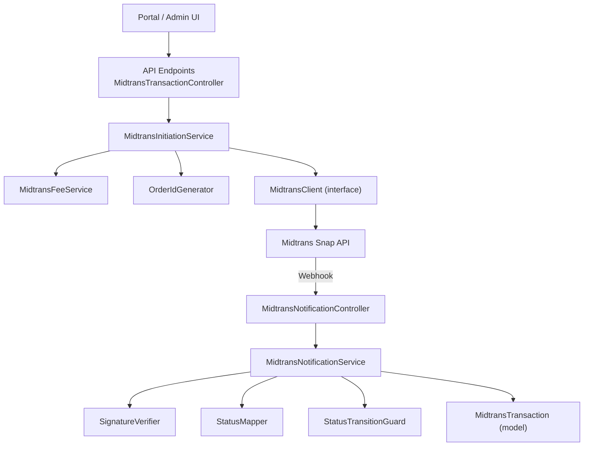
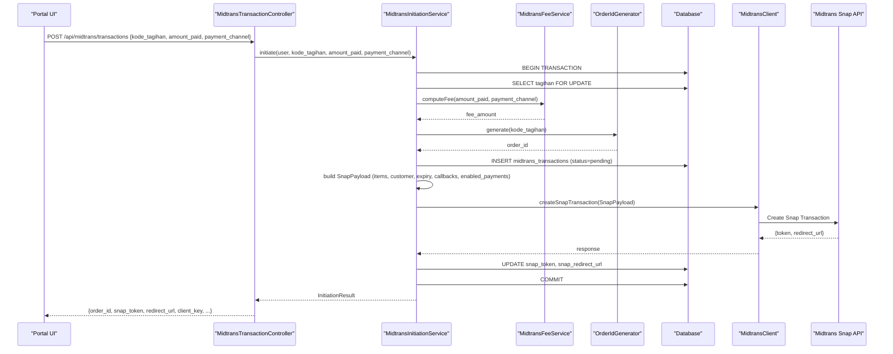
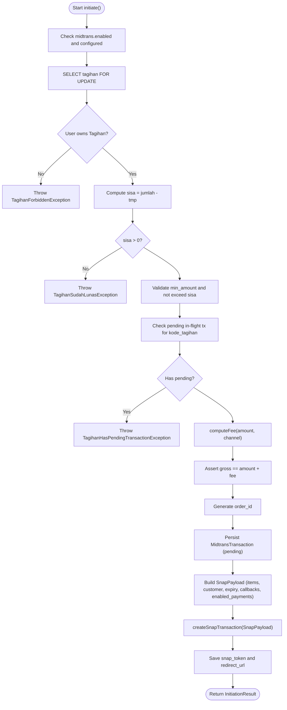
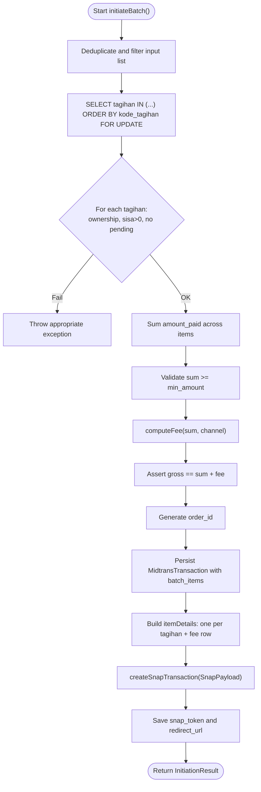
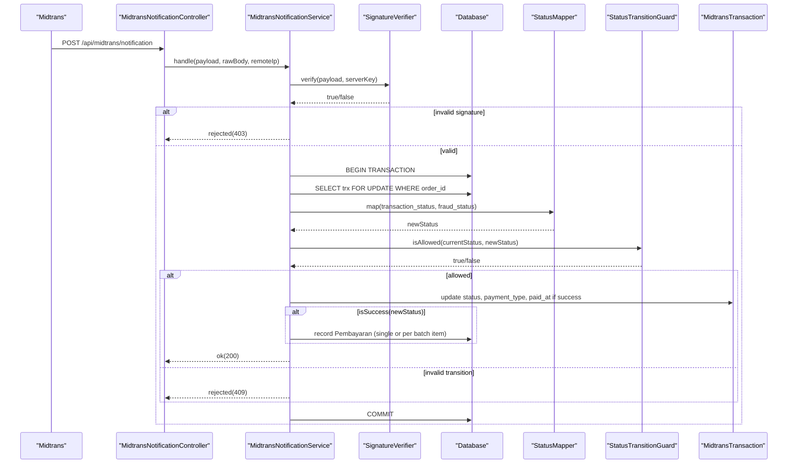
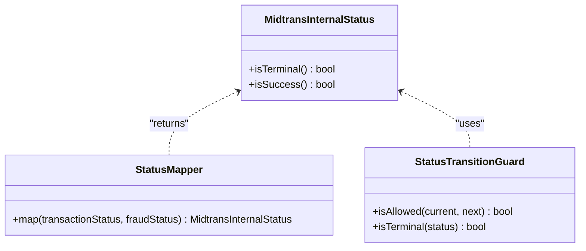
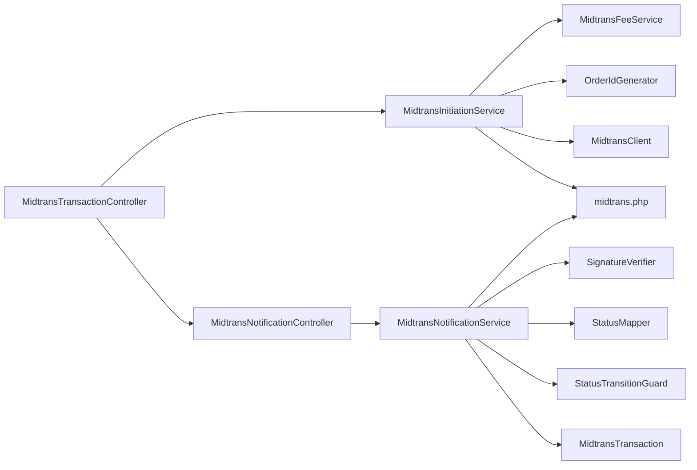

# Payment Initiation & Transaction Management

<cite>
**Referenced Files in This Document**
- [MidtransInitiationService.php](file://backend/app/Services/Midtrans/MidtransInitiationService.php)
- [MidtransTransactionController.php](file://backend/app/Http/Controllers/MidtransTransactionController.php)
- [MidtransNotificationController.php](file://backend/app/Http/Controllers/MidtransNotificationController.php)
- [MidtransNotificationService.php](file://backend/app/Services/Midtrans/MidtransNotificationService.php)
- [MidtransInternalStatus.php](file://backend/app/Services/Midtrans/MidtransInternalStatus.php)
- [StatusMapper.php](file://backend/app/Services/Midtrans/StatusMapper.php)
- [StatusTransitionGuard.php](file://backend/app/Services/Midtrans/StatusTransitionGuard.php)
- [OrderIdGenerator.php](file://backend/app/Services/Midtrans/OrderIdGenerator.php)
- [MidtransFeeService.php](file://backend/app/Services/Midtrans/MidtransFeeService.php)
- [SignatureVerifier.php](file://backend/app/Services/Midtrans/SignatureVerifier.php)
- [SnapPayload.php](file://backend/app/Services/Midtrans/Dto/SnapPayload.php)
- [MidtransClient.php](file://backend/app/Services/Midtrans/MidtransClient.php)
- [MidtransTransaction.php](file://backend/app/Models/MidtransTransaction.php)
- [midtrans.php](file://backend/config/midtrans.php)
</cite>

## Table of Contents
1. Introduction
2. Project Structure
3. Core Components
4. Architecture Overview
5. Detailed Component Analysis
6. Dependency Analysis
7. Performance Considerations
8. Troubleshooting Guide
9. Conclusion

## Introduction
This document explains how the Handayani system initiates Midtrans payments and manages transactions end-to-end. It covers single and batch payment initiation, Snap payload construction, customer details mapping, callback URL resolution, transaction validation, order ID generation, state management with locking to prevent race conditions, and the relationship between internal statuses and Midtrans statuses. Practical examples are provided for initiating payments, handling different payment channels, and managing the lifecycle from creation to completion.

## Project Structure
The payment flow spans controllers, services, DTOs, models, and configuration:
- Controllers expose REST endpoints for initiation, batch initiation, status polling, and webhook handling.
- Services encapsulate business logic: initiation, fee computation, signature verification, status mapping, transition guards, logging, and notification processing.
- DTOs define structured payloads for Midtrans Snap.
- Models persist transaction records and provide scopes/relations.
- Configuration centralizes feature flags, credentials, fees, limits, expiry, and callbacks.

**Diagram sources**
- [MidtransTransactionController.php:17-41](file://backend/app/Http/Controllers/MidtransTransactionController.php#L17-L41)
- [MidtransInitiationService.php:44-236](file://backend/app/Services/Midtrans/MidtransInitiationService.php#L44-L236)
- [MidtransFeeService.php:28-37](file://backend/app/Services/Midtrans/MidtransFeeService.php#L28-L37)
- [OrderIdGenerator.php:24-34](file://backend/app/Services/Midtrans/OrderIdGenerator.php#L24-L34)
- [MidtransClient.php:8-26](file://backend/app/Services/Midtrans/MidtransClient.php#L8-L26)
- [MidtransNotificationController.php:20-33](file://backend/app/Http/Controllers/MidtransNotificationController.php#L20-L33)
- [MidtransNotificationService.php:31-68](file://backend/app/Services/Midtrans/MidtransNotificationService.php#L31-L68)
- [SignatureVerifier.php:22-32](file://backend/app/Services/Midtrans/SignatureVerifier.php#L22-L32)
- [StatusMapper.php:23-39](file://backend/app/Services/Midtrans/StatusMapper.php#L23-L39)
- [StatusTransitionGuard.php:62-67](file://backend/app/Services/Midtrans/StatusTransitionGuard.php#L62-L67)
- [MidtransTransaction.php:7-85](file://backend/app/Models/MidtransTransaction.php#L7-L85)

**Section sources**
- [MidtransTransactionController.php:17-90](file://backend/app/Http/Controllers/MidtransTransactionController.php#L17-L90)
- [MidtransInitiationService.php:44-473](file://backend/app/Services/Midtrans/MidtransInitiationService.php#L44-L473)
- [MidtransNotificationController.php:20-35](file://backend/app/Http/Controllers/MidtransNotificationController.php#L20-L35)
- [MidtransNotificationService.php:31-284](file://backend/app/Services/Midtrans/MidtransNotificationService.php#L31-L284)
- [midtrans.php:1-130](file://backend/config/midtrans.php#L1-L130)

## Core Components
- MidtransInitiationService: Orchestrates single and batch payment initiation, validates Tagihan ownership and amounts, computes fees, generates order IDs, persists MidtransTransaction, builds SnapPayload, calls Midtrans Snap, and returns results.
- MidtransTransactionController: Exposes REST endpoints for initiation, batch initiation, fee channel listing, and status polling.
- MidtransNotificationService: Processes verified webhooks, maps statuses, enforces transitions, updates transaction state, and records Pembayaran entries (single or per-batch item).
- MidtransFeeService: Computes admin fees per channel (flat or percent+flat), provides available channels metadata, and asserts gross amount invariants.
- SignatureVerifier: Verifies Midtrans webhook signatures using SHA-512 over order_id + status_code + gross_amount + server_key.
- StatusMapper: Maps Midtrans transaction_status and fraud_status to internal statuses.
- StatusTransitionGuard: Enforces allowed state transitions and terminal states.
- OrderIdGenerator: Generates unique, Midtrans-compliant order IDs with prefix and epoch timestamp.
- SnapPayload: Strongly-typed DTO for Snap request fields including items, customer details, expiry, callbacks, and enabled payments.
- MidtransClient (interface): Abstraction for creating Snap transactions and querying status; implementation is injected into services.
- MidtransTransaction (model): Persists transaction data, provides pending scope, relations, and batch detection helper.
- midtrans.php: Central configuration for feature toggles, credentials, fees, minimum amount, expiry hours, order prefix, finish URL, and log retention.

**Section sources**
- [MidtransInitiationService.php:44-473](file://backend/app/Services/Midtrans/MidtransInitiationService.php#L44-L473)
- [MidtransTransactionController.php:17-127](file://backend/app/Http/Controllers/MidtransTransactionController.php#L17-L127)
- [MidtransNotificationService.php:31-284](file://backend/app/Services/Midtrans/MidtransNotificationService.php#L31-L284)
- [MidtransFeeService.php:28-144](file://backend/app/Services/Midtrans/MidtransFeeService.php#L28-L144)
- [SignatureVerifier.php:12-33](file://backend/app/Services/Midtrans/SignatureVerifier.php#L12-L33)
- [StatusMapper.php:23-41](file://backend/app/Services/Midtrans/StatusMapper.php#L23-L41)
- [StatusTransitionGuard.php:17-77](file://backend/app/Services/Midtrans/StatusTransitionGuard.php#L17-L77)
- [OrderIdGenerator.php:24-64](file://backend/app/Services/Midtrans/OrderIdGenerator.php#L24-L64)
- [SnapPayload.php:5-24](file://backend/app/Services/Midtrans/Dto/SnapPayload.php#L5-L24)
- [MidtransClient.php:8-27](file://backend/app/Services/Midtrans/MidtransClient.php#L8-L27)
- [MidtransTransaction.php:7-85](file://backend/app/Models/MidtransTransaction.php#L7-L85)
- [midtrans.php:1-130](file://backend/config/midtrans.php#L1-L130)

## Architecture Overview
The system separates concerns across layers:
- API layer validates requests and delegates to services.
- Service layer performs domain logic, interacts with external APIs via an interface, and persists state.
- Notification service handles inbound webhooks securely and idempotently.
- Configuration drives behavior at runtime without redeploy.

**Diagram sources**
- [MidtransTransactionController.php:17-41](file://backend/app/Http/Controllers/MidtransTransactionController.php#L17-L41)
- [MidtransInitiationService.php:44-236](file://backend/app/Services/Midtrans/MidtransInitiationService.php#L44-L236)
- [MidtransFeeService.php:28-37](file://backend/app/Services/Midtrans/MidtransFeeService.php#L28-L37)
- [OrderIdGenerator.php:24-34](file://backend/app/Services/Midtrans/OrderIdGenerator.php#L24-L34)
- [MidtransClient.php:14-15](file://backend/app/Services/Midtrans/MidtransClient.php#L14-L15)

## Detailed Component Analysis

### Single Payment Initiation Workflow
- Validates feature flag and client configuration.
- Loads Tagihan with lockForUpdate to prevent concurrent modifications.
- Verifies user ownership by matching NIS.
- Calculates remaining balance (jumlah - tmp) and ensures it is positive.
- Validates amount against minimum and remaining balance.
- Checks for any pending in-flight transaction for the same Tagihan.
- Computes fee and gross amount, asserting gross invariant.
- Generates a unique order ID and persists a MidtransTransaction record with status pending.
- Builds SnapPayload with:
  - Item details: one line for the bill amount and one for admin fee.
  - Customer details: first_name, last_name, optional email if valid.
  - Expiry window based on configuration.
  - Callback URLs resolved from configuration.
  - Enabled payments mapped from selected channel key.
- Calls Midtrans Snap via MidtransClient and stores token and redirect URL.
- Logs outbound call and returns result to controller.

**Diagram sources**
- [MidtransInitiationService.php:44-236](file://backend/app/Services/Midtrans/MidtransInitiationService.php#L44-L236)
- [MidtransFeeService.php:28-37](file://backend/app/Services/Midtrans/MidtransFeeService.php#L28-L37)
- [OrderIdGenerator.php:24-34](file://backend/app/Services/Midtrans/OrderIdGenerator.php#L24-L34)
- [SnapPayload.php:5-24](file://backend/app/Services/Midtrans/Dto/SnapPayload.php#L5-L24)

**Section sources**
- [MidtransInitiationService.php:44-236](file://backend/app/Services/Midtrans/MidtransInitiationService.php#L44-L236)
- [MidtransTransactionController.php:17-41](file://backend/app/Http/Controllers/MidtransTransactionController.php#L17-L41)

### Batch Payment Initiation Workflow
- Accepts a list of Tagihan codes and a payment channel.
- Deduplicates and filters empty inputs.
- Locks all selected Tagihan rows deterministically to avoid deadlocks.
- For each Tagihan:
  - Verifies ownership and non-zero remaining balance.
  - Rejects if any has a pending in-flight transaction.
  - Accumulates total amount paid and batch items.
- Validates total amount against minimum threshold.
- Computes a single fee for the entire batch and asserts gross invariant.
- Generates order ID, persists MidtransTransaction with batch_items array.
- Builds SnapPayload with multiple item lines (one per Tagihan) plus one fee line.
- Calls Midtrans Snap and stores token and redirect URL.
- Returns unified result for the batch checkout.

**Diagram sources**
- [MidtransInitiationService.php:250-418](file://backend/app/Services/Midtrans/MidtransInitiationService.php#L250-L418)
- [MidtransFeeService.php:28-37](file://backend/app/Services/Midtrans/MidtransFeeService.php#L28-L37)
- [OrderIdGenerator.php:24-34](file://backend/app/Services/Midtrans/OrderIdGenerator.php#L24-L34)
- [SnapPayload.php:5-24](file://backend/app/Services/Midtrans/Dto/SnapPayload.php#L5-L24)

**Section sources**
- [MidtransInitiationService.php:250-418](file://backend/app/Services/Midtrans/MidtransInitiationService.php#L250-L418)
- [MidtransTransactionController.php:67-90](file://backend/app/Http/Controllers/MidtransTransactionController.php#L67-L90)

### Snap Payload Construction and Customer Details Mapping
- Items:
  - One line per Tagihan with id=kode_tagihan, name=jenis_tagihan.nama or fallback, price=sisa, quantity=1.
  - A separate fee line with id=FEE_MIDTRANS and name indicating admin fee.
- Customer details:
  - first_name and last_name derived from siswa.name split by space.
  - email included only when present and syntactically valid (from wali.email).
- Expiry:
  - start_time formatted with timezone offset, unit=hour, duration=24.
- Callbacks:
  - finish/unfinish/error set to configured MIDTRANS_FINISH_URL; null if not configured.
- Enabled payments:
  - Channel key mapped to specific Midtrans payment codes to limit visible options.

**Section sources**
- [MidtransInitiationService.php:135-195](file://backend/app/Services/Midtrans/MidtransInitiationService.php#L135-L195)
- [MidtransInitiationService.php:351-393](file://backend/app/Services/Midtrans/MidtransInitiationService.php#L351-L393)
- [MidtransInitiationService.php:426-471](file://backend/app/Services/Midtrans/MidtransInitiationService.php#L426-L471)
- [SnapPayload.php:5-24](file://backend/app/Services/Midtrans/Dto/SnapPayload.php#L5-L24)

### Transaction Validation and Order ID Generation
- Validation includes:
  - Feature flag and client configuration checks.
  - Ownership verification via NIS.
  - Remaining balance calculation and positivity check.
  - Minimum amount enforcement.
  - Overpayment prevention by comparing amount to sisa.
  - In-flight transaction guard to prevent duplicate checkout attempts.
- Order ID generation:
  - Format: HDY-{kode_tagihan}-{epoch_ms}.
  - Validated for length and character constraints required by Midtrans.

**Section sources**
- [MidtransInitiationService.php:44-133](file://backend/app/Services/Midtrans/MidtransInitiationService.php#L44-L133)
- [MidtransInitiationService.php:250-349](file://backend/app/Services/Midtrans/MidtransInitiationService.php#L250-L349)
- [OrderIdGenerator.php:24-64](file://backend/app/Services/Midtrans/OrderIdGenerator.php#L24-L64)

### Fee Calculation and Channel Handling
- Supported fee types:
  - Flat fee per channel.
  - Percent-based fee with optional flat component.
- Available channels endpoint supports preview fee and gross calculations for UI selection.
- Gross invariant assertion ensures consistency: gross_amount == amount_paid + fee_amount.

**Section sources**
- [MidtransFeeService.php:28-144](file://backend/app/Services/Midtrans/MidtransFeeService.php#L28-L144)
- [MidtransTransactionController.php:48-59](file://backend/app/Http/Controllers/MidtransTransactionController.php#L48-L59)

### Webhook Processing and State Management
- Webhook entry point verifies signature using SHA-512(order_id + status_code + gross_amount + server_key).
- Database transaction with deadlock retry loads transaction FOR UPDATE.
- Amount mismatch rejection if gross_amount differs from stored value.
- Status mapping:
  - capture with fraud_status != accept → Deny.
  - settlement → Settlement.
  - pending → Pending.
  - deny/cancel/expire/failure/refund/partial_refund → respective internal states.
- Transition guard enforces allowed transitions and recognizes terminal states.
- On success (Settlement/Capture):
  - Records Pembayaran(s):
    - Single: one Pembayaran linked to the original Tagihan.
    - Batch: one Pembayaran per batch_item, updating Tagihan.tmp and status accordingly.
  - Idempotent: skips if Pembayaran already exists for the order.

**Diagram sources**
- [MidtransNotificationController.php:20-33](file://backend/app/Http/Controllers/MidtransNotificationController.php#L20-L33)
- [MidtransNotificationService.php:31-150](file://backend/app/Services/Midtrans/MidtransNotificationService.php#L31-L150)
- [SignatureVerifier.php:22-32](file://backend/app/Services/Midtrans/SignatureVerifier.php#L22-L32)
- [StatusMapper.php:23-41](file://backend/app/Services/Midtrans/StatusMapper.php#L23-L41)
- [StatusTransitionGuard.php:62-77](file://backend/app/Services/Midtrans/StatusTransitionGuard.php#L62-L77)
- [MidtransTransaction.php:55-59](file://backend/app/Models/MidtransTransaction.php#L55-L59)

**Section sources**
- [MidtransNotificationController.php:20-35](file://backend/app/Http/Controllers/MidtransNotificationController.php#L20-L35)
- [MidtransNotificationService.php:31-284](file://backend/app/Services/Midtrans/MidtransNotificationService.php#L31-L284)
- [SignatureVerifier.php:12-33](file://backend/app/Services/Midtrans/SignatureVerifier.php#L12-L33)
- [StatusMapper.php:23-41](file://backend/app/Services/Midtrans/StatusMapper.php#L23-L41)
- [StatusTransitionGuard.php:17-77](file://backend/app/Services/Midtrans/StatusTransitionGuard.php#L17-L77)

### Internal States vs Midtrans Statuses
- Internal statuses include pending, settlement, capture, deny, cancel, expire, failure, refund, partial_refund.
- Terminal states: settlement, capture, deny, cancel, expire, failure, refund.
- Success states: settlement, capture.
- Mapping rules ensure capture without fraud accept becomes deny; other statuses map directly.

**Diagram sources**
- [MidtransInternalStatus.php:5-45](file://backend/app/Services/Midtrans/MidtransInternalStatus.php#L5-L45)
- [StatusMapper.php:23-41](file://backend/app/Services/Midtrans/StatusMapper.php#L23-L41)
- [StatusTransitionGuard.php:17-77](file://backend/app/Services/Midtrans/StatusTransitionGuard.php#L17-L77)

**Section sources**
- [MidtransInternalStatus.php:5-45](file://backend/app/Services/Midtrans/MidtransInternalStatus.php#L5-L45)
- [StatusMapper.php:23-41](file://backend/app/Services/Midtrans/StatusMapper.php#L23-L41)
- [StatusTransitionGuard.php:17-77](file://backend/app/Services/Midtrans/StatusTransitionGuard.php#L17-L77)

### Practical Examples

- Initiating a single payment:
  - Endpoint: POST /api/midtrans/transactions
  - Body: { kode_tagihan, amount_paid, payment_channel? }
  - Response includes order_id, snap_token, redirect_url, client_key, and computed amounts.
  - Example path: [initiate method:17-41](file://backend/app/Http/Controllers/MidtransTransactionController.php#L17-L41)

- Initiating a batch payment:
  - Endpoint: POST /api/midtrans/transactions/batch
  - Body: { kode_tagihan_list[], payment_channel? }
  - Response mirrors single initiation but settles multiple Tagihan in one Snap session.
  - Example path: [initiateBatch method:67-90](file://backend/app/Http/Controllers/MidtransTransactionController.php#L67-L90)

- Polling transaction status:
  - Endpoint: GET /api/midtrans/transactions/{order_id}
  - Returns current internal status, timestamps, and payment details.
  - Example path: [show method:97-125](file://backend/app/Http/Controllers/MidtransTransactionController.php#L97-L125)

- Handling different payment channels:
  - Use GET /api/midtrans/fee-channels?amount=... to preview fees and gross per channel.
  - Map channel keys to Snap enabled_payments to restrict choices in the UI.
  - Example paths: [feeChannels method:48-59](file://backend/app/Http/Controllers/MidtransTransactionController.php#L48-L59), [resolveEnabledPayments:450-471](file://backend/app/Services/Midtrans/MidtransInitiationService.php#L450-L471)

- Managing lifecycle:
  - Creation: persisted with status pending and expiry time.
  - Completion: webhook updates status to settlement/capture and records Pembayaran(s).
  - Failure/Cancel/Expire: status transitions enforced by guard; no Pembayaran recorded.
  - Example paths: [processTransaction:96-150](file://backend/app/Services/Midtrans/MidtransNotificationService.php#L96-L150), [recordPembayaran:162-282](file://backend/app/Services/Midtrans/MidtransNotificationService.php#L162-L282)

**Section sources**
- [MidtransTransactionController.php:17-127](file://backend/app/Http/Controllers/MidtransTransactionController.php#L17-L127)
- [MidtransInitiationService.php:44-473](file://backend/app/Services/Midtrans/MidtransInitiationService.php#L44-L473)
- [MidtransNotificationService.php:96-282](file://backend/app/Services/Midtrans/MidtransNotificationService.php#L96-L282)

## Dependency Analysis
- Controllers depend on services for business logic.
- Initiation service depends on fee service, order ID generator, and Midtrans client interface.
- Notification service depends on signature verifier, status mapper, transition guard, and model.
- Configuration drives behavior such as enabled flags, fees, minimum amount, expiry, and callbacks.

**Diagram sources**
- [MidtransTransactionController.php:17-127](file://backend/app/Http/Controllers/MidtransTransactionController.php#L17-L127)
- [MidtransNotificationController.php:20-35](file://backend/app/Http/Controllers/MidtransNotificationController.php#L20-L35)
- [MidtransInitiationService.php:44-473](file://backend/app/Services/Midtrans/MidtransInitiationService.php#L44-L473)
- [MidtransNotificationService.php:31-284](file://backend/app/Services/Midtrans/MidtransNotificationService.php#L31-L284)
- [midtrans.php:1-130](file://backend/config/midtrans.php#L1-L130)

**Section sources**
- [MidtransTransactionController.php:17-127](file://backend/app/Http/Controllers/MidtransTransactionController.php#L17-L127)
- [MidtransNotificationController.php:20-35](file://backend/app/Http/Controllers/MidtransNotificationController.php#L20-L35)
- [MidtransInitiationService.php:44-473](file://backend/app/Services/Midtrans/MidtransInitiationService.php#L44-L473)
- [MidtransNotificationService.php:31-284](file://backend/app/Services/Midtrans/MidtransNotificationService.php#L31-L284)
- [midtrans.php:1-130](file://backend/config/midtrans.php#L1-L130)

## Performance Considerations
- Use database transactions with lockForUpdate to prevent race conditions during initiation and webhook processing.
- Deterministic ordering when locking multiple Tagihan rows avoids deadlocks in batch flows.
- Idempotent recording of Pembayaran prevents duplicate accounting on repeated webhooks.
- Avoid exposing sensitive server_key in HTTP responses; only client_key is returned to clients.
- Configure reasonable expiry_hours and min_amount to reduce stale or low-value transactions.

[No sources needed since this section provides general guidance]

## Troubleshooting Guide
- Invalid signature:
  - Ensure server_key matches Midtrans configuration and that signature verification uses correct fields.
  - Reference: [SignatureVerifier.verify:22-32](file://backend/app/Services/Midtrans/SignatureVerifier.php#L22-L32)
- Amount mismatch:
  - Confirm gross_amount in webhook matches stored transaction gross_amount.
  - Reference: [processTransaction amount check:98-112](file://backend/app/Services/Midtrans/MidtransNotificationService.php#L98-L112)
- Forbidden access:
  - Verify user’s siswa NIS matches Tagihan.nis and transaction.nis.
  - References: [initiate ownership check:67-71](file://backend/app/Services/Midtrans/MidtransInitiationService.php#L67-L71), [show ownership check:105-109](file://backend/app/Http/Controllers/MidtransTransactionController.php#L105-L109)
- Already paid or insufficient remaining:
  - Check sisa calculation and ensure amount does not exceed remaining balance.
  - References: [initiate sisa checks:73-91](file://backend/app/Services/Midtrans/MidtransInitiationService.php#L73-L91)
- Pending in-flight transaction:
  - Prevent duplicate checkout attempts by checking pending scope before initiation.
  - References: [pending check single:93-107](file://backend/app/Services/Midtrans/MidtransInitiationService.php#L93-L107), [pending check batch:299-312](file://backend/app/Services/Midtrans/MidtransInitiationService.php#L299-L312)
- Invalid status transition:
  - Review allowed transitions and terminal states; ensure webhook payloads reflect expected sequences.
  - References: [transition guard:17-77](file://backend/app/Services/Midtrans/StatusTransitionGuard.php#L17-L77), [mapping:23-41](file://backend/app/Services/Midtrans/StatusMapper.php#L23-L41)
- Overpayment blocked:
  - Ensure recorded amount does not exceed sisa; batch flows validate per item.
  - References: [overpayment checks:201-257](file://backend/app/Services/Midtrans/MidtransNotificationService.php#L201-L257)

**Section sources**
- [SignatureVerifier.php:22-32](file://backend/app/Services/Midtrans/SignatureVerifier.php#L22-L32)
- [MidtransNotificationService.php:98-112](file://backend/app/Services/Midtrans/MidtransNotificationService.php#L98-L112)
- [MidtransInitiationService.php:67-91](file://backend/app/Services/Midtrans/MidtransInitiationService.php#L67-L91)
- [MidtransTransactionController.php:105-109](file://backend/app/Http/Controllers/MidtransTransactionController.php#L105-L109)
- [MidtransInitiationService.php:93-107](file://backend/app/Services/Midtrans/MidtransInitiationService.php#L93-L107)
- [MidtransInitiationService.php:299-312](file://backend/app/Services/Midtrans/MidtransInitiationService.php#L299-L312)
- [StatusTransitionGuard.php:17-77](file://backend/app/Services/Midtrans/StatusTransitionGuard.php#L17-L77)
- [StatusMapper.php:23-41](file://backend/app/Services/Midtrans/StatusMapper.php#L23-L41)
- [MidtransNotificationService.php:201-257](file://backend/app/Services/Midtrans/MidtransNotificationService.php#L201-L257)

## Conclusion
The Handayani system implements a robust, secure, and idempotent Midtrans integration. It enforces strong validation, deterministic locking, clear state transitions, and comprehensive logging. The separation of concerns across controllers, services, DTOs, and configuration enables flexible customization of fees, channels, and callbacks while maintaining data integrity and operational reliability.

[No sources needed since this section summarizes without analyzing specific files]