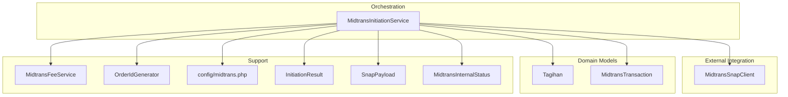
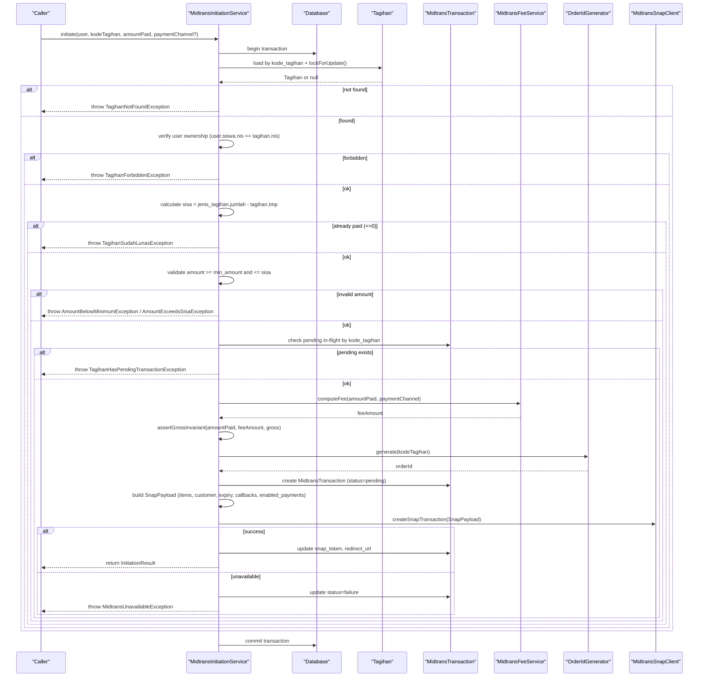
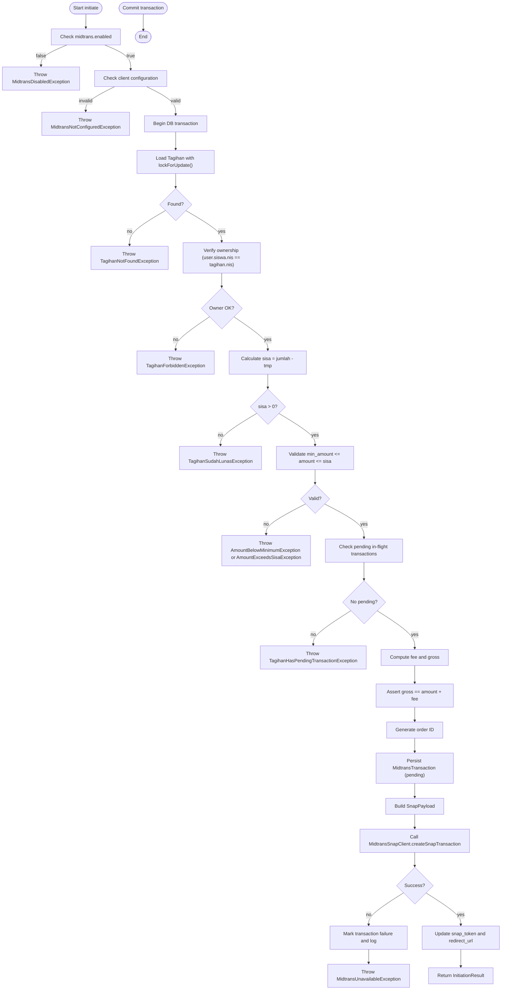
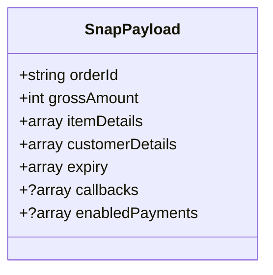
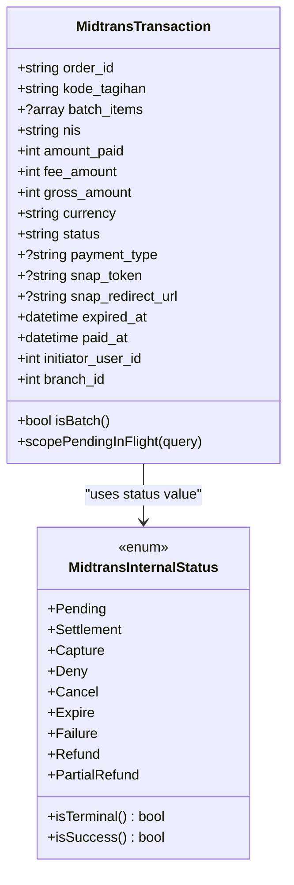
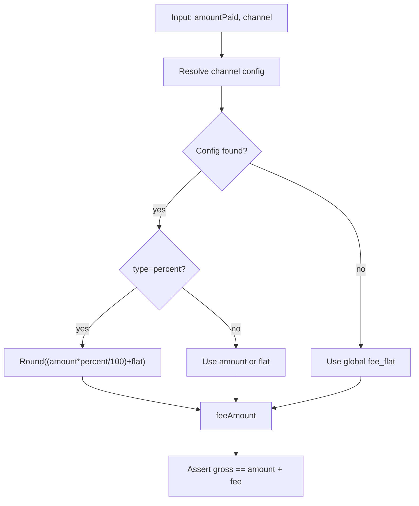
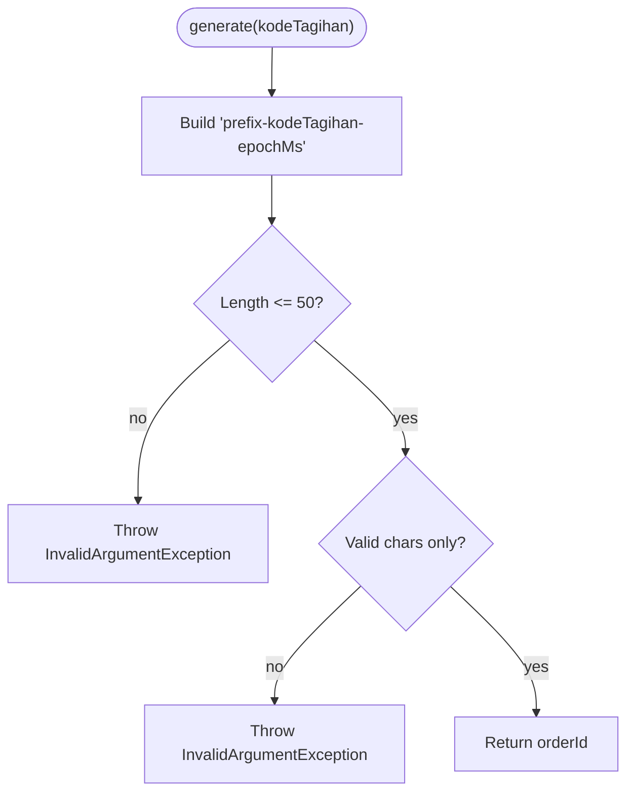
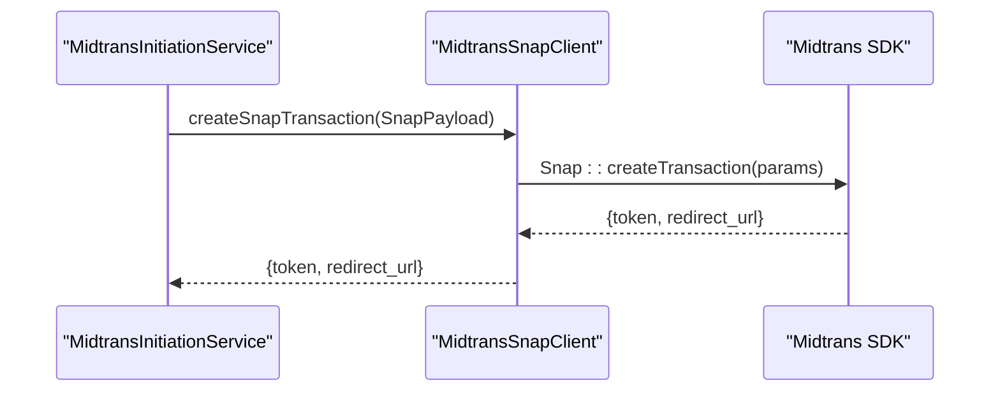
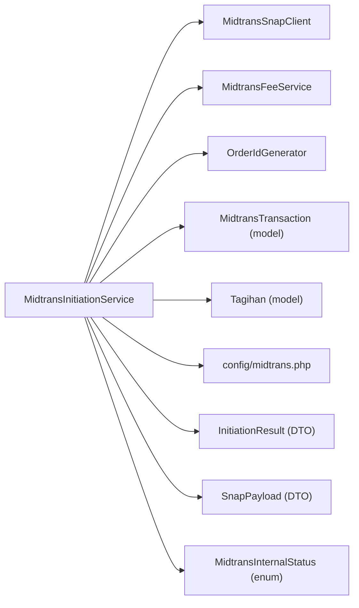

# Single Payment Processing

<cite>
**Referenced Files in This Document**
- [MidtransInitiationService.php](file://backend/app/Services/Midtrans/MidtransInitiationService.php)
- [MidtransSnapClient.php](file://backend/app/Services/Midtrans/MidtransSnapClient.php)
- [MidtransFeeService.php](file://backend/app/Services/Midtrans/MidtransFeeService.php)
- [OrderIdGenerator.php](file://backend/app/Services/Midtrans/OrderIdGenerator.php)
- [MidtransTransaction.php](file://backend/app/Models/MidtransTransaction.php)
- [Tagihan.php](file://backend/app/Models/Tagihan.php)
- [midtrans.php](file://backend/config/midtrans.php)
- [InitiationResult.php](file://backend/app/Services/Midtrans/Dto/InitiationResult.php)
- [SnapPayload.php](file://backend/app/Services/Midtrans/Dto/SnapPayload.php)
- [MidtransInternalStatus.php](file://backend/app/Services/Midtrans/MidtransInternalStatus.php)
- [AmountBelowMinimumException.php](file://backend/app/Exceptions/Midtrans/AmountBelowMinimumException.php)
- [AmountExceedsSisaException.php](file://backend/app/Exceptions/Midtrans/AmountExceedsSisaException.php)
- [TagihanForbiddenException.php](file://backend/app/Exceptions/Midtrans/TagihanForbiddenException.php)
- [TagihanHasPendingTransactionException.php](file://backend/app/Exceptions/Midtrans/TagihanHasPendingTransactionException.php)
</cite>

## Table of Contents
1. Introduction
2. Project Structure
3. Core Components
4. Architecture Overview
5. Detailed Component Analysis
6. Dependency Analysis
7. Performance Considerations
8. Troubleshooting Guide
9. Conclusion

## Introduction
This document explains the complete workflow for single payment processing in the Handayani system, from invoking initiate() to returning an InitiationResult. It covers feature flag checks, client configuration validation, Tagihan loading with lockForUpdate(), ownership verification, sisa_tagihan calculation, amount validation against minimum and maximum limits, pending transaction checks, fee computation, order ID generation, MidtransTransaction persistence, Snap payload construction, and final API call execution. Practical guidance is included on how to initiate a single payment, handle different exceptions, and process the InitiationResult response.

## Project Structure
The single payment flow spans services, models, DTOs, configuration, and exceptions:
- Service orchestration: MidtransInitiationService
- External integration: MidtransSnapClient (implements MidtransClient)
- Fee logic: MidtransFeeService
- Order ID generation: OrderIdGenerator
- Domain models: MidtransTransaction, Tagihan
- Configuration: config/midtrans.php
- DTOs: InitiationResult, SnapPayload
- Internal status enum: MidtransInternalStatus
- Exceptions: various Midtrans-related exceptions

**Diagram sources**
- [MidtransInitiationService.php](file://backend/app/Services/Midtrans/MidtransInitiationService.php)
- [MidtransSnapClient.php](file://backend/app/Services/Midtrans/MidtransSnapClient.php)
- [MidtransFeeService.php](file://backend/app/Services/Midtrans/MidtransFeeService.php)
- [OrderIdGenerator.php](file://backend/app/Services/Midtrans/OrderIdGenerator.php)
- [MidtransTransaction.php](file://backend/app/Models/MidtransTransaction.php)
- [Tagihan.php](file://backend/app/Models/Tagihan.php)
- [midtrans.php](file://backend/config/midtrans.php)
- [InitiationResult.php](file://backend/app/Services/Midtrans/Dto/InitiationResult.php)
- [SnapPayload.php](file://backend/app/Services/Midtrans/Dto/SnapPayload.php)
- [MidtransInternalStatus.php](file://backend/app/Services/Midtrans/MidtransInternalStatus.php)

**Section sources**
- [MidtransInitiationService.php](file://backend/app/Services/Midtrans/MidtransInitiationService.php)
- [MidtransSnapClient.php](file://backend/app/Services/Midtrans/MidtransSnapClient.php)
- [MidtransFeeService.php](file://backend/app/Services/Midtrans/MidtransFeeService.php)
- [OrderIdGenerator.php](file://backend/app/Services/Midtrans/OrderIdGenerator.php)
- [MidtransTransaction.php](file://backend/app/Models/MidtransTransaction.php)
- [Tagihan.php](file://backend/app/Models/Tagihan.php)
- [midtrans.php](file://backend/config/midtrans.php)
- [InitiationResult.php](file://backend/app/Services/Midtrans/Dto/InitiationResult.php)
- [SnapPayload.php](file://backend/app/Services/Midtrans/Dto/SnapPayload.php)
- [MidtransInternalStatus.php](file://backend/app/Services/Midtrans/MidtransInternalStatus.php)

## Core Components
- MidtransInitiationService: Orchestrates single payment initiation, including validations, locking, fee computation, persistence, Snap payload creation, and API invocation.
- MidtransSnapClient: Configures Midtrans SDK credentials and performs Snap transaction creation and status retrieval.
- MidtransFeeService: Computes admin fees per channel and validates gross amount invariant.
- OrderIdGenerator: Generates unique, Midtrans-compliant order IDs.
- MidtransTransaction: Represents a Midtrans transaction record with scopes and relations.
- Tagihan: Represents a bill; used to compute remaining balance (sisa_tagihan).
- SnapPayload and InitiationResult: Strongly-typed DTOs for Snap request and initiation response.
- MidtransInternalStatus: Enumerates internal statuses and helpers for terminal/success checks.
- Configuration (config/midtrans.php): Feature flags, credentials, fee rules, min amount, expiry, callbacks, and logging retention.

**Section sources**
- [MidtransInitiationService.php](file://backend/app/Services/Midtrans/MidtransInitiationService.php)
- [MidtransSnapClient.php](file://backend/app/Services/Midtrans/MidtransSnapClient.php)
- [MidtransFeeService.php](file://backend/app/Services/Midtrans/MidtransFeeService.php)
- [OrderIdGenerator.php](file://backend/app/Services/Midtrans/OrderIdGenerator.php)
- [MidtransTransaction.php](file://backend/app/Models/MidtransTransaction.php)
- [Tagihan.php](file://backend/app/Models/Tagihan.php)
- [midtrans.php](file://backend/config/midtrans.php)
- [InitiationResult.php](file://backend/app/Services/Midtrans/Dto/InitiationResult.php)
- [SnapPayload.php](file://backend/app/Services/Midtrans/Dto/SnapPayload.php)
- [MidtransInternalStatus.php](file://backend/app/Services/Midtrans/MidtransInternalStatus.php)

## Architecture Overview
End-to-end sequence for single payment initiation:

**Diagram sources**
- [MidtransInitiationService.php](file://backend/app/Services/Midtrans/MidtransInitiationService.php)
- [MidtransSnapClient.php](file://backend/app/Services/Midtrans/MidtransSnapClient.php)
- [MidtransFeeService.php](file://backend/app/Services/Midtrans/MidtransFeeService.php)
- [OrderIdGenerator.php](file://backend/app/Services/Midtrans/OrderIdGenerator.php)
- [MidtransTransaction.php](file://backend/app/Models/MidtransTransaction.php)
- [Tagihan.php](file://backend/app/Models/Tagihan.php)
- [midtrans.php](file://backend/config/midtrans.php)
- [InitiationResult.php](file://backend/app/Services/Midtrans/Dto/InitiationResult.php)
- [SnapPayload.php](file://backend/app/Services/Midtrans/Dto/SnapPayload.php)
- [MidtransInternalStatus.php](file://backend/app/Services/Midtrans/MidtransInternalStatus.php)

## Detailed Component Analysis

### Single Payment Orchestration (initiate)
Key steps performed within a database transaction:
- Feature flag check: midtrans.enabled must be true.
- Client configuration check: server_key, client_key, merchant_id present.
- Load Tagihan with lockForUpdate() to prevent concurrent modifications.
- Ownership verification: user.siswa.nis must match tagihan.nis.
- Calculate sisa_tagihan: jenis_tagihan.jumlah - tagihan.tmp.
- Validate amount: must be between configured min_amount and sisa_tagihan.
- Pending transaction check: reject if any pending in-flight transaction exists for the same tagihan.
- Compute fee and gross amount using MidtransFeeService and assert invariant.
- Generate order ID via OrderIdGenerator.
- Persist MidtransTransaction with status pending and metadata.
- Build SnapPayload with item details, customer details, expiry, callbacks, and enabled payments.
- Call MidtransSnapClient.createSnapTransaction(); on success, persist token and redirect URL; on failure, mark transaction as failure and rethrow.
- Return InitiationResult containing orderId, snapToken, redirectUrl, amounts, and expiredAt.

**Diagram sources**
- [MidtransInitiationService.php](file://backend/app/Services/Midtrans/MidtransInitiationService.php)
- [MidtransFeeService.php](file://backend/app/Services/Midtrans/MidtransFeeService.php)
- [OrderIdGenerator.php](file://backend/app/Services/Midtrans/OrderIdGenerator.php)
- [MidtransTransaction.php](file://backend/app/Models/MidtransTransaction.php)
- [Tagihan.php](file://backend/app/Models/Tagihan.php)
- [midtrans.php](file://backend/config/midtrans.php)
- [InitiationResult.php](file://backend/app/Services/Midtrans/Dto/InitiationResult.php)
- [SnapPayload.php](file://backend/app/Services/Midtrans/Dto/SnapPayload.php)
- [MidtransInternalStatus.php](file://backend/app/Services/Midtrans/MidtransInternalStatus.php)

**Section sources**
- [MidtransInitiationService.php](file://backend/app/Services/Midtrans/MidtransInitiationService.php)
- [MidtransFeeService.php](file://backend/app/Services/Midtrans/MidtransFeeService.php)
- [OrderIdGenerator.php](file://backend/app/Services/Midtrans/OrderIdGenerator.php)
- [MidtransTransaction.php](file://backend/app/Models/MidtransTransaction.php)
- [Tagihan.php](file://backend/app/Models/Tagihan.php)
- [midtrans.php](file://backend/config/midtrans.php)
- [InitiationResult.php](file://backend/app/Services/Midtrans/Dto/InitiationResult.php)
- [SnapPayload.php](file://backend/app/Services/Midtrans/Dto/SnapPayload.php)
- [MidtransInternalStatus.php](file://backend/app/Services/Midtrans/MidtransInternalStatus.php)

### Snap Payload Construction
- Item details include one line for the tagihan and one for the admin fee.
- Customer details are derived from siswa name parts and optional wali email (only added when valid).
- Expiry uses start_time, unit hour, duration 24 hours.
- Callbacks are resolved from configuration; enabled_payments restrict channels based on selected key.

**Diagram sources**
- [SnapPayload.php](file://backend/app/Services/Midtrans/Dto/SnapPayload.php)
- [MidtransInitiationService.php](file://backend/app/Services/Midtrans/MidtransInitiationService.php)

**Section sources**
- [MidtransInitiationService.php](file://backend/app/Services/Midtrans/MidtransInitiationService.php)
- [SnapPayload.php](file://backend/app/Services/Midtrans/Dto/SnapPayload.php)

### Midtrans Transaction Model and Status
- MidtransTransaction stores all relevant fields, casts numeric values and arrays, and provides scope pendingInFlight().
- MidtransInternalStatus enumerates states and includes helpers for terminal and success checks.

**Diagram sources**
- [MidtransTransaction.php](file://backend/app/Models/MidtransTransaction.php)
- [MidtransInternalStatus.php](file://backend/app/Services/Midtrans/MidtransInternalStatus.php)

**Section sources**
- [MidtransTransaction.php](file://backend/app/Models/MidtransTransaction.php)
- [MidtransInternalStatus.php](file://backend/app/Services/Midtrans/MidtransInternalStatus.php)

### Fee Computation and Invariants
- MidtransFeeService supports flat and percent-based fees per channel, with fallback to a global flat fee when channel is unknown.
- Gross amount invariant ensures consistency: gross == amount + fee.

**Diagram sources**
- [MidtransFeeService.php](file://backend/app/Services/Midtrans/MidtransFeeService.php)
- [midtrans.php](file://backend/config/midtrans.php)

**Section sources**
- [MidtransFeeService.php](file://backend/app/Services/Midtrans/MidtransFeeService.php)
- [midtrans.php](file://backend/config/midtrans.php)

### Order ID Generation
- Generates order IDs with prefix, tagihan code, and epoch milliseconds.
- Validates length and allowed characters to comply with Midtrans constraints.

**Diagram sources**
- [OrderIdGenerator.php](file://backend/app/Services/Midtrans/OrderIdGenerator.php)
- [midtrans.php](file://backend/config/midtrans.php)

**Section sources**
- [OrderIdGenerator.php](file://backend/app/Services/Midtrans/OrderIdGenerator.php)
- [midtrans.php](file://backend/config/midtrans.php)

### API Integration (Snap)
- MidtransSnapClient sets SDK configuration (server/client keys, environment, CA bundle, 3DS).
- createSnapTransaction maps SnapPayload into SDK parameters and returns token and redirect URL.
- getStatus retrieves transaction status and maps specific errors to actionable exceptions.

**Diagram sources**
- [MidtransSnapClient.php](file://backend/app/Services/Midtrans/MidtransSnapClient.php)
- [MidtransInitiationService.php](file://backend/app/Services/Midtrans/MidtransInitiationService.php)

**Section sources**
- [MidtransSnapClient.php](file://backend/app/Services/Midtrans/MidtransSnapClient.php)
- [MidtransInitiationService.php](file://backend/app/Services/Midtrans/MidtransInitiationService.php)

## Dependency Analysis
High-level dependencies for single payment initiation:

**Diagram sources**
- [MidtransInitiationService.php](file://backend/app/Services/Midtrans/MidtransInitiationService.php)
- [MidtransSnapClient.php](file://backend/app/Services/Midtrans/MidtransSnapClient.php)
- [MidtransFeeService.php](file://backend/app/Services/Midtrans/MidtransFeeService.php)
- [OrderIdGenerator.php](file://backend/app/Services/Midtrans/OrderIdGenerator.php)
- [MidtransTransaction.php](file://backend/app/Models/MidtransTransaction.php)
- [Tagihan.php](file://backend/app/Models/Tagihan.php)
- [midtrans.php](file://backend/config/midtrans.php)
- [InitiationResult.php](file://backend/app/Services/Midtrans/Dto/InitiationResult.php)
- [SnapPayload.php](file://backend/app/Services/Midtrans/Dto/SnapPayload.php)
- [MidtransInternalStatus.php](file://backend/app/Services/Midtrans/MidtransInternalStatus.php)

**Section sources**
- [MidtransInitiationService.php](file://backend/app/Services/Midtrans/MidtransInitiationService.php)
- [MidtransSnapClient.php](file://backend/app/Services/Midtrans/MidtransSnapClient.php)
- [MidtransFeeService.php](file://backend/app/Services/Midtrans/MidtransFeeService.php)
- [OrderIdGenerator.php](file://backend/app/Services/Midtrans/OrderIdGenerator.php)
- [MidtransTransaction.php](file://backend/app/Models/MidtransTransaction.php)
- [Tagihan.php](file://backend/app/Models/Tagihan.php)
- [midtrans.php](file://backend/config/midtrans.php)
- [InitiationResult.php](file://backend/app/Services/Midtrans/Dto/InitiationResult.php)
- [SnapPayload.php](file://backend/app/Services/Midtrans/Dto/SnapPayload.php)
- [MidtransInternalStatus.php](file://backend/app/Services/Midtrans/MidtransInternalStatus.php)

## Performance Considerations
- Database locking: lockForUpdate() prevents race conditions but may increase contention; ensure minimal work inside the transaction and keep it short.
- Fee computation: pure function with O(1) complexity; no external calls.
- Snap API call: network-bound; consider timeouts and retries at higher layers if needed.
- Logging: outbound logs are recorded synchronously; ensure logging backend is performant.

[No sources needed since this section provides general guidance]

## Troubleshooting Guide
Common exceptions and their meanings:
- MidtransDisabledException: Feature flag disabled.
- MidtransNotConfiguredException: Missing credentials or merchant ID.
- TagihanNotFoundException: Invalid or missing tagihan code.
- TagihanForbiddenException: User does not own the tagihan.
- TagihanSudahLunasException: Tagihan already fully paid.
- AmountBelowMinimumException: amountPaid below configured minimum.
- AmountExceedsSisaException: amountPaid exceeds remaining balance.
- TagihanHasPendingTransactionException: An active pending transaction exists for the tagihan.
- MidtransUnavailableException: Snap API call failed; transaction marked as failure.

Handling recommendations:
- For AmountBelowMinimumException and AmountExceedsSisaException, prompt the user to adjust the amount.
- For TagihanHasPendingTransactionException, reuse existing snap_token and redirect_url from the exception’s pendingData to resume checkout.
- For MidtransUnavailableException, inform the user to retry later; inspect logs for details.

**Section sources**
- [AmountBelowMinimumException.php](file://backend/app/Exceptions/Midtrans/AmountBelowMinimumException.php)
- [AmountExceedsSisaException.php](file://backend/app/Exceptions/Midtrans/AmountExceedsSisaException.php)
- [TagihanForbiddenException.php](file://backend/app/Exceptions/Midtrans/TagihanForbiddenException.php)
- [TagihanHasPendingTransactionException.php](file://backend/app/Exceptions/Midtrans/TagihanHasPendingTransactionException.php)
- [MidtransInitiationService.php](file://backend/app/Services/Midtrans/MidtransInitiationService.php)

## Conclusion
Single payment processing in Handayani is implemented as a robust, transactional workflow that enforces business rules, computes accurate fees, persists state, and integrates with Midtrans Snap. The design isolates concerns across services, models, DTOs, and configuration, enabling clear error handling and predictable behavior. By following the documented steps and exception handling strategies, callers can reliably initiate payments and guide users through the Snap checkout experience.