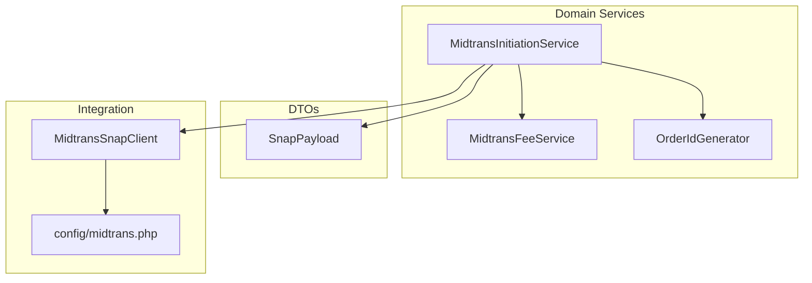
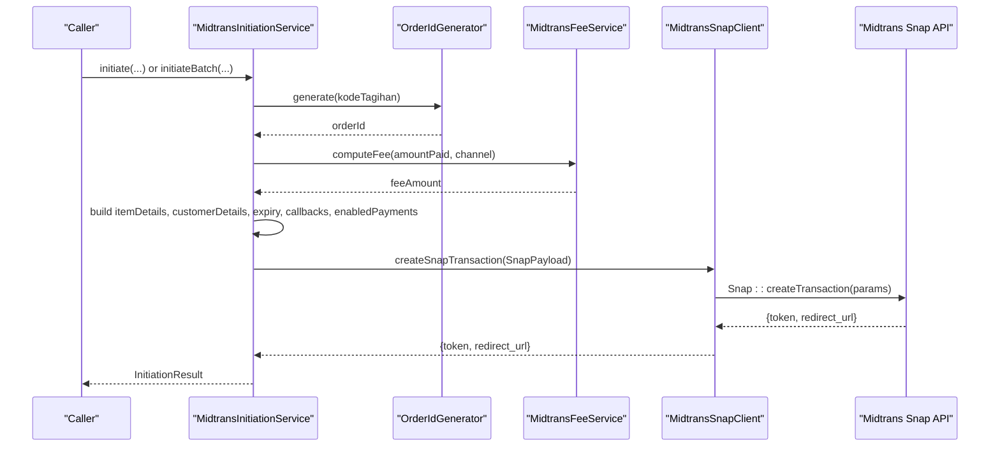
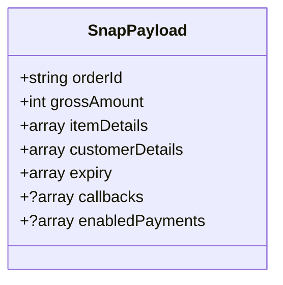
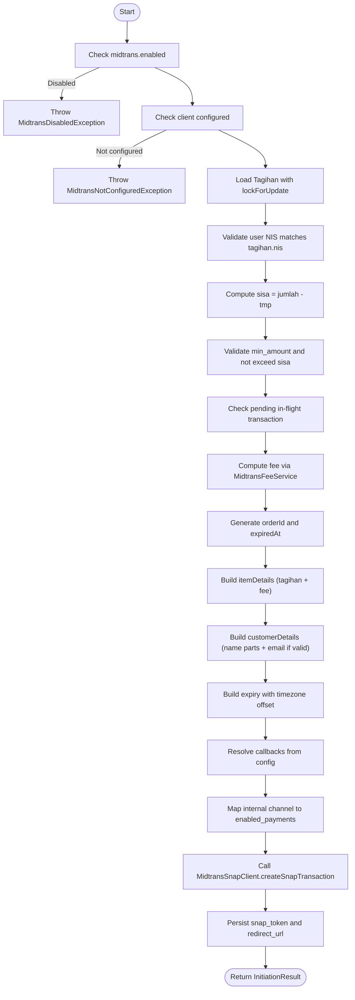
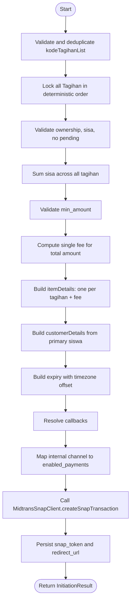
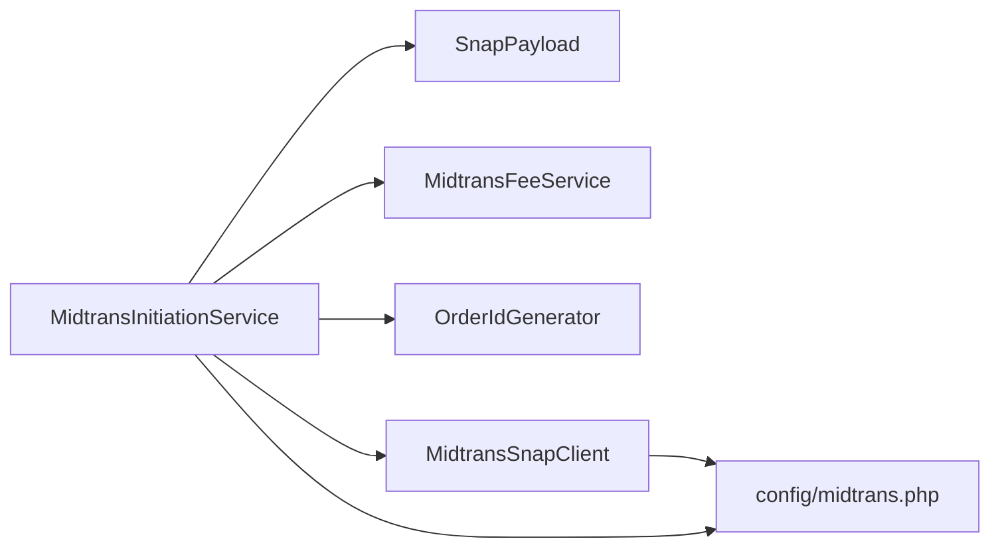

# Snap Payload Construction

<cite>
**Referenced Files in This Document**
- [SnapPayload.php](file://backend/app/Services/Midtrans/Dto/SnapPayload.php)
- [MidtransInitiationService.php](file://backend/app/Services/Midtrans/MidtransInitiationService.php)
- [MidtransSnapClient.php](file://backend/app/Services/Midtrans/MidtransSnapClient.php)
- [midtrans.php](file://backend/config/midtrans.php)
- [OrderIdGenerator.php](file://backend/app/Services/Midtrans/OrderIdGenerator.php)
</cite>

## Table of Contents
1. [Introduction](#introduction)
2. [Project Structure](#project-structure)
3. [Core Components](#core-components)
4. [Architecture Overview](#architecture-overview)
5. [Detailed Component Analysis](#detailed-component-analysis)
6. [Dependency Analysis](#dependency-analysis)
7. [Performance Considerations](#performance-considerations)
8. [Troubleshooting Guide](#troubleshooting-guide)
9. [Conclusion](#conclusion)
10. [Appendices](#appendices)

## Introduction
This document explains how the system constructs Midtrans Snap payloads for both single and batch payments. It covers the SnapPayload DTO structure, item details construction, customer details mapping from student and guardian data, expiry time configuration, callback URL resolution, enabled payment channel filtering, email validation logic, timezone handling, and the mapping between internal payment channels and Midtrans payment codes. Examples of generated Snap payloads are provided to illustrate the final JSON structures.

## Project Structure
The Snap payload construction spans a small set of focused components:
- A DTO that defines the shape of the Snap payload
- An initiation service that builds the payload for single and batch payments
- A client that serializes the payload and calls Midtrans Snap
- Configuration that drives expiry hours, finish URLs, and fee/channel behavior
- An order ID generator that ensures valid order IDs



**Diagram sources**
- [MidtransInitiationService.php](file://backend/app/Services/Midtrans/MidtransInitiationService.php)
- [MidtransSnapClient.php](file://backend/app/Services/Midtrans/MidtransSnapClient.php)
- [SnapPayload.php](file://backend/app/Services/Midtrans/Dto/SnapPayload.php)
- [midtrans.php](file://backend/config/midtrans.php)
- [OrderIdGenerator.php](file://backend/app/Services/Midtrans/OrderIdGenerator.php)

**Section sources**
- [MidtransInitiationService.php](file://backend/app/Services/Midtrans/MidtransInitiationService.php)
- [MidtransSnapClient.php](file://backend/app/Services/Midtrans/MidtransSnapClient.php)
- [SnapPayload.php](file://backend/app/Services/Midtrans/Dto/SnapPayload.php)
- [midtrans.php](file://backend/config/midtrans.php)
- [OrderIdGenerator.php](file://backend/app/Services/Midtrans/OrderIdGenerator.php)

## Core Components
- SnapPayload DTO: Defines the exact fields sent to Midtrans Snap (order id, gross amount, item details, customer details, expiry, callbacks, enabled payments).
- MidtransInitiationService: Orchestrates building the payload for single and batch payments, including fees, expiry, callbacks, and enabled payments.
- MidtransSnapClient: Maps the DTO into the Midtrans SDK request and returns token and redirect URL.
- Configuration: Provides expiry hours, finish URL, environment, and other settings used during payload construction.
- OrderIdGenerator: Produces valid order IDs with constraints enforced.

**Section sources**
- [SnapPayload.php](file://backend/app/Services/Midtrans/Dto/SnapPayload.php)
- [MidtransInitiationService.php](file://backend/app/Services/Midtrans/MidtransInitiationService.php)
- [MidtransSnapClient.php](file://backend/app/Services/Midtrans/MidtransSnapClient.php)
- [midtrans.php](file://backend/config/midtrans.php)
- [OrderIdGenerator.php](file://backend/app/Services/Midtrans/OrderIdGenerator.php)

## Architecture Overview
The flow from initiation to Midtrans Snap creation is as follows:



**Diagram sources**
- [MidtransInitiationService.php](file://backend/app/Services/Midtrans/MidtransInitiationService.php)
- [MidtransSnapClient.php](file://backend/app/Services/Midtrans/MidtransSnapClient.php)
- [OrderIdGenerator.php](file://backend/app/Services/Midtrans/OrderIdGenerator.php)

## Detailed Component Analysis

### SnapPayload DTO
The DTO enforces the structure and types of the Snap payload:
- orderId: string
- grossAmount: integer
- itemDetails: array of items with id, name, price, quantity
- customerDetails: object with first_name, last_name, and optional email
- expiry: object with start_time, unit, duration
- callbacks: optional object with finish, unfinish, error
- enabledPayments: optional list of Midtrans payment codes to limit available channels



**Diagram sources**
- [SnapPayload.php](file://backend/app/Services/Midtrans/Dto/SnapPayload.php)

**Section sources**
- [SnapPayload.php](file://backend/app/Services/Midtrans/Dto/SnapPayload.php)

### Single Payment Flow
Key behaviors:
- Validates feature flag and configuration
- Loads Tagihan and verifies ownership
- Computes remaining balance and validates amount against minimum and sisa
- Checks for pending transactions
- Computes fee and gross amount
- Generates order ID and persisted transaction record
- Builds itemDetails: one line for the tagihan amount and one line for admin fee
- Builds customerDetails from student name parts; includes email only if present and valid
- Sets expiry using configured hours and a fixed timezone offset
- Resolves callbacks and enabled payments based on configuration and selected channel
- Calls Midtrans Snap and persists token and redirect URL



**Diagram sources**
- [MidtransInitiationService.php](file://backend/app/Services/Midtrans/MidtransInitiationService.php)
- [MidtransSnapClient.php](file://backend/app/Services/Midtrans/MidtransSnapClient.php)
- [midtrans.php](file://backend/config/midtrans.php)

**Section sources**
- [MidtransInitiationService.php](file://backend/app/Services/Midtrans/MidtransInitiationService.php)

### Batch Payment Flow
Key differences from single payment:
- Accepts a list of kode_tagihan and locks them deterministically
- Aggregates sisa per tagihan and rejects if any has pending transactions
- Applies a single fee for the entire batch
- Builds multiple itemDetails lines (one per tagihan) plus one fee line
- Uses the primary tagihan’s siswa for customer details
- Same expiry, callbacks, and enabled payments logic as single payment



**Diagram sources**
- [MidtransInitiationService.php](file://backend/app/Services/Midtrans/MidtransInitiationService.php)
- [MidtransSnapClient.php](file://backend/app/Services/Midtrans/MidtransSnapClient.php)
- [midtrans.php](file://backend/config/midtrans.php)

**Section sources**
- [MidtransInitiationService.php](file://backend/app/Services/Midtrans/MidtransInitiationService.php)

### Customer Details Mapping and Email Validation
- Name parts: Split student name into first and last names
- Email source: Guardian email from student’s wali relationship
- Inclusion rule: Include email key only when non-empty and syntactically valid

**Section sources**
- [MidtransInitiationService.php](file://backend/app/Services/Midtrans/MidtransInitiationService.php)

### Expiry Time Configuration and Timezone Handling
- Duration: Configured via expiry_hours
- start_time: Formatted with a fixed timezone offset (+0700)
- unit: hour
- duration: 24 (hours)

**Section sources**
- [MidtransInitiationService.php](file://backend/app/Services/Midtrans/MidtransInitiationService.php)
- [midtrans.php](file://backend/config/midtrans.php)

### Callback URL Resolution
- Finish URL resolved from configuration
- If configured, callbacks include finish, unfinish, and error pointing to the same URL
- If not configured, callbacks are omitted

**Section sources**
- [MidtransInitiationService.php](file://backend/app/Services/Midtrans/MidtransInitiationService.php)
- [midtrans.php](file://backend/config/midtrans.php)

### Enabled Payments Channel Filtering
- Internal channel keys map to Midtrans payment codes
- If channel is null or unmapped, enabled_payments is omitted (show all channels)
- Supported mappings:
  - qris -> other_qris
  - bank_transfer -> bca_va, bni_va, bri_va, mandiri_va, permata_va, cimb_va, other_va, echannel
  - gopay -> gopay
  - shopeepay -> shopeepay
  - credit_card -> credit_card

**Section sources**
- [MidtransInitiationService.php](file://backend/app/Services/Midtrans/MidtransInitiationService.php)

### Item Details Construction
- Single payment: Two items — tagihan amount and admin fee
- Batch payment: Multiple items — one per tagihan plus one admin fee item
- Each item contains id, name, price, quantity

**Section sources**
- [MidtransInitiationService.php](file://backend/app/Services/Midtrans/MidtransInitiationService.php)

### Order ID Generation
- Format: prefix-kode_tagihan-epoch_ms
- Constraints enforced: max length and allowed characters
- Prefix configurable via configuration

**Section sources**
- [OrderIdGenerator.php](file://backend/app/Services/Midtrans/OrderIdGenerator.php)
- [midtrans.php](file://backend/config/midtrans.php)

### Client Serialization to Midtrans
- Maps SnapPayload fields to Midtrans SDK parameters
- Includes transaction_details, item_details, customer_details, expiry
- Optionally includes callbacks and enabled_payments
- Returns token and redirect_url

**Section sources**
- [MidtransSnapClient.php](file://backend/app/Services/Midtrans/MidtransSnapClient.php)

## Dependency Analysis


**Diagram sources**
- [MidtransInitiationService.php](file://backend/app/Services/Midtrans/MidtransInitiationService.php)
- [MidtransSnapClient.php](file://backend/app/Services/Midtrans/MidtransSnapClient.php)
- [SnapPayload.php](file://backend/app/Services/Midtrans/Dto/SnapPayload.php)
- [midtrans.php](file://backend/config/midtrans.php)
- [OrderIdGenerator.php](file://backend/app/Services/Midtrans/OrderIdGenerator.php)

**Section sources**
- [MidtransInitiationService.php](file://backend/app/Services/Midtrans/MidtransInitiationService.php)
- [MidtransSnapClient.php](file://backend/app/Services/Midtrans/MidtransSnapClient.php)
- [SnapPayload.php](file://backend/app/Services/Midtrans/Dto/SnapPayload.php)
- [midtrans.php](file://backend/config/midtrans.php)
- [OrderIdGenerator.php](file://backend/app/Services/Midtrans/OrderIdGenerator.php)

## Performance Considerations
- Database locking: Uses lockForUpdate to prevent race conditions during payment initiation
- Minimal network calls: Only one call to Midtrans Snap per initiation
- Efficient payload construction: Arrays built once per initiation path
- Avoid unnecessary fields: callbacks and enabled_payments included only when applicable

[No sources needed since this section provides general guidance]

## Troubleshooting Guide
Common issues and where they originate:
- Midtrans disabled or not configured: Early checks throw explicit exceptions
- Invalid or missing Tagihan: Throws specific not found or forbidden exceptions
- Amount below minimum or exceeds sisa: Throws dedicated exceptions
- Pending in-flight transaction: Prevents duplicate initiations
- Midtrans unavailable: Wraps SDK errors and logs outbound failures
- Status retrieval edge cases: Distinguishes “transaction not yet processed” vs status unavailable

Operational tips:
- Verify configuration values for server_key, client_key, merchant_id, environment
- Ensure finish_url is reachable by Midtrans
- Confirm enabled_payments mapping aligns with expected channels
- Inspect logs for outbound_charge entries around initiation attempts

**Section sources**
- [MidtransInitiationService.php](file://backend/app/Services/Midtrans/MidtransInitiationService.php)
- [MidtransSnapClient.php](file://backend/app/Services/Midtrans/MidtransSnapClient.php)

## Conclusion
The Snap payload construction is centralized in the initiation service, which composes a strongly-typed DTO and delegates serialization to the Snap client. The design cleanly separates concerns: business rules and validations in the service, DTO shape enforcement, external integration in the client, and configuration-driven behavior. This yields predictable, auditable payloads for both single and batch payments.

[No sources needed since this section summarizes without analyzing specific files]

## Appendices

### SnapPayload Field Reference
- orderId: string
- grossAmount: integer
- itemDetails: array of objects with id, name, price, quantity
- customerDetails: object with first_name, last_name, and optional email
- expiry: object with start_time, unit, duration
- callbacks: optional object with finish, unfinish, error
- enabledPayments: optional list of Midtrans payment codes

**Section sources**
- [SnapPayload.php](file://backend/app/Services/Midtrans/Dto/SnapPayload.php)

### Example Snap Payloads

#### Single Payment Example
```json
{
  "transaction_details": {
    "order_id": "HDY-TAG-1234567890-1719000000000",
    "gross_amount": 110000
  },
  "item_details": [
    {
      "id": "TAG-1234567890",
      "name": "SPP Bulan Januari",
      "price": 100000,
      "quantity": 1
    },
    {
      "id": "FEE_MIDTRANS",
      "name": "Biaya Admin Pembayaran Online",
      "price": 10000,
      "quantity": 1
    }
  ],
  "customer_details": {
    "first_name": "Ahmad",
    "last_name": "Rizki",
    "email": "wali@example.com"
  },
  "expiry": {
    "start_time": "2025-01-01 10:00:00 +0700",
    "unit": "hour",
    "duration": 24
  },
  "callbacks": {
    "finish": "https://example.com/portal/beranda",
    "unfinish": "https://example.com/portal/beranda",
    "error": "https://example.com/portal/beranda"
  },
  "enabled_payments": ["other_qris"]
}
```

#### Batch Payment Example
```json
{
  "transaction_details": {
    "order_id": "HDY-TAG-1234567890-1719000000000",
    "gross_amount": 320000
  },
  "item_details": [
    {
      "id": "TAG-1234567890",
      "name": "SPP Bulan Januari",
      "price": 100000,
      "quantity": 1
    },
    {
      "id": "TAG-1234567891",
      "name": "Uang Kegiatan",
      "price": 120000,
      "quantity": 1
    },
    {
      "id": "FEE_MIDTRANS",
      "name": "Biaya Admin Pembayaran Online",
      "price": 10000,
      "quantity": 1
    }
  ],
  "customer_details": {
    "first_name": "Budi",
    "last_name": "Santoso",
    "email": "wali2@example.com"
  },
  "expiry": {
    "start_time": "2025-01-01 10:00:00 +0700",
    "unit": "hour",
    "duration": 24
  },
  "callbacks": {
    "finish": "https://example.com/portal/beranda",
    "unfinish": "https://example.com/portal/beranda",
    "error": "https://example.com/portal/beranda"
  },
  "enabled_payments": ["bca_va","bni_va","bri_va","mandiri_va","permata_va","cimb_va","other_va","echannel"]
}
```

Notes:
- order_id format is prefix-kode_tagihan-epoch_ms
- gross_amount equals sum of item prices
- enabled_payments depends on selected internal channel mapping
- callbacks are included only when finish_url is configured

**Section sources**
- [MidtransInitiationService.php](file://backend/app/Services/Midtrans/MidtransInitiationService.php)
- [midtrans.php](file://backend/config/midtrans.php)
- [OrderIdGenerator.php](file://backend/app/Services/Midtrans/OrderIdGenerator.php)