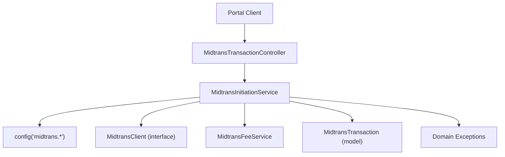
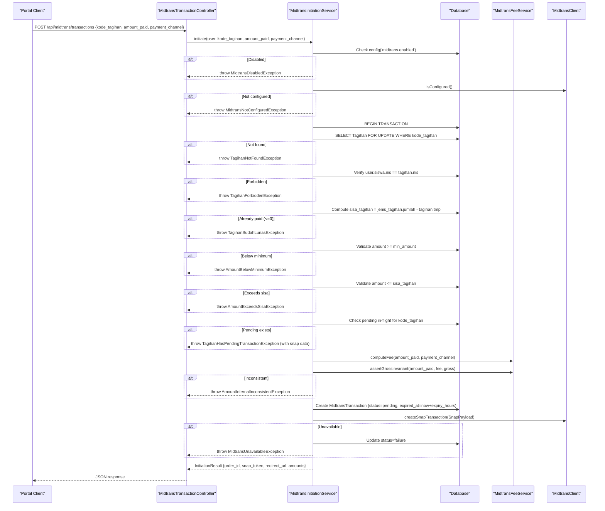
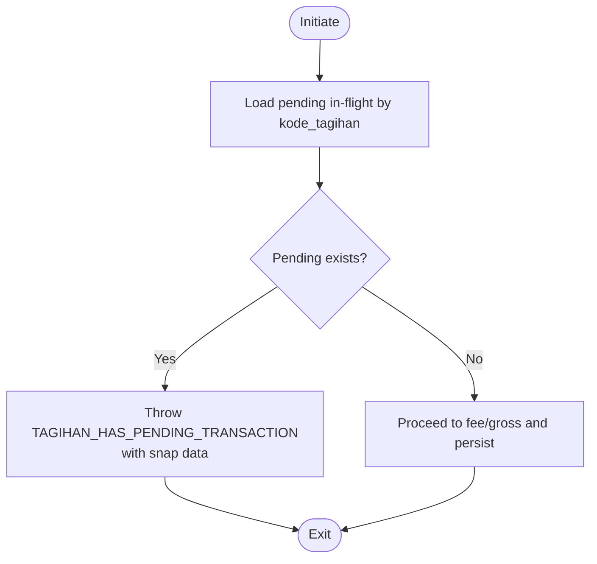
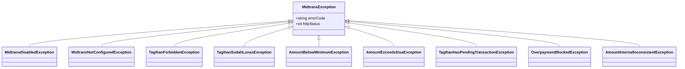
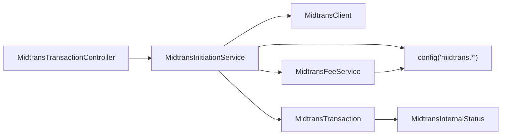

# Transaction Validation & Security

<cite>
**Referenced Files in This Document**
- [MidtransInitiationService.php](file://backend/app/Services/Midtrans/MidtransInitiationService.php)
- [MidtransTransactionController.php](file://backend/app/Http/Controllers/MidtransTransactionController.php)
- [midtrans.php](file://backend/config/midtrans.php)
- [MidtransClient.php](file://backend/app/Services/Midtrans/MidtransClient.php)
- [MidtransFeeService.php](file://backend/app/Services/Midtrans/MidtransFeeService.php)
- [MidtransTransaction.php](file://backend/app/Models/MidtransTransaction.php)
- [MidtransInternalStatus.php](file://backend/app/Services/Midtrans/MidtransInternalStatus.php)
- [MidtransException.php](file://backend/app/Exceptions/Midtrans/MidtransException.php)
- [AmountBelowMinimumException.php](file://backend/app/Exceptions/Midtrans/AmountBelowMinimumException.php)
- [AmountExceedsSisaException.php](file://backend/app/Exceptions/Midtrans/AmountExceedsSisaException.php)
- [TagihanForbiddenException.php](file://backend/app/Exceptions/Midtrans/TagihanForbiddenException.php)
- [TagihanHasPendingTransactionException.php](file://backend/app/Exceptions/Midtrans/TagihanHasPendingTransactionException.php)
- [OverpaymentBlockedException.php](file://backend/app/Exceptions/Midtrans/OverpaymentBlockedException.php)
- [MidtransDisabledException.php](file://backend/app/Exceptions/Midtrans/MidtransDisabledException.php)
- [MidtransNotConfiguredException.php](file://backend/app/Exceptions/Midtrans/MidtransNotConfiguredException.php)
- [TagihanSudahLunasException.php](file://backend/app/Exceptions/Midtrans/TagihanSudahLunasException.php)
- [AmountInternalInconsistentException.php](file://backend/app/Exceptions/Midtrans/AmountInternalInconsistentException.php)
</cite>

## Table of Contents
1. Introduction
2. Project Structure
3. Core Components
4. Architecture Overview
5. Detailed Component Analysis
6. Dependency Analysis
7. Performance Considerations
8. Troubleshooting Guide
9. Conclusion

## Introduction
This document explains the transaction validation and security measures applied during payment initiation for Midtrans Snap. It covers all validation layers: feature flag enforcement, client configuration checks, user ownership verification (user’s siswa NIS vs tagihan.nis), sisa_tagihan calculation and validation, minimum amount enforcement, maximum amount protection against overpayment, pending transaction detection to prevent race conditions, and business rule validations. It also documents the exception hierarchy used for different validation failures and how each exception provides contextual information for debugging and user feedback.

## Project Structure
The payment initiation flow is implemented in the backend service layer with supporting configuration, HTTP controller, domain exceptions, and models. The key components are:
- Controller: validates request inputs and delegates to the service
- Service: orchestrates validation, locking, fee computation, persistence, and external API calls
- Configuration: feature flags, fees, limits, expiry, and channel mapping
- Client interface: abstracts Midtrans HTTP calls and configuration checks
- Fee service: computes admin fees per channel and asserts gross invariant
- Model: persists Midtrans transactions and exposes scopes for pending in-flight detection
- Exceptions: typed errors with error codes and HTTP status for consistent responses

**Diagram sources**
- [MidtransTransactionController.php:1-127](file://backend/app/Http/Controllers/MidtransTransactionController.php#L1-L127)
- [MidtransInitiationService.php:1-473](file://backend/app/Services/Midtrans/MidtransInitiationService.php#L1-L473)
- [midtrans.php:1-130](file://backend/config/midtrans.php#L1-L130)
- [MidtransClient.php:1-27](file://backend/app/Services/Midtrans/MidtransClient.php#L1-L27)
- [MidtransFeeService.php:1-144](file://backend/app/Services/Midtrans/MidtransFeeService.php#L1-L144)
- [MidtransTransaction.php:1-85](file://backend/app/Models/MidtransTransaction.php#L1-L85)

**Section sources**
- [MidtransTransactionController.php:17-41](file://backend/app/Http/Controllers/MidtransTransactionController.php#L17-L41)
- [MidtransInitiationService.php:44-237](file://backend/app/Services/Midtrans/MidtransInitiationService.php#L44-L237)
- [midtrans.php:15-101](file://backend/config/midtrans.php#L15-L101)
- [MidtransClient.php:8-26](file://backend/app/Services/Midtrans/MidtransClient.php#L8-L26)
- [MidtransFeeService.php:28-97](file://backend/app/Services/Midtrans/MidtransFeeService.php#L28-L97)
- [MidtransTransaction.php:55-59](file://backend/app/Models/MidtransTransaction.php#L55-L59)

## Core Components
- Feature flag enforcement: early exit if Midtrans is disabled
- Client configuration check: ensure server_key/client_key are configured
- Ownership verification: user’s siswa NIS must match tagihan.nis
- Sisa_tagihan calculation: jumlah - tmp; reject if already paid or zero/negative
- Amount validation: enforce min_amount and max_amount (cannot exceed sisa_tagihan)
- Pending transaction detection: reuse existing pending in-flight transaction to avoid races
- Fee computation and gross invariant: compute fee by channel and assert gross = amount + fee
- External call and logging: create Snap transaction, update token/redirect, log outbound
- Error handling: throw typed exceptions with error_code and http_status

**Section sources**
- [MidtransInitiationService.php:44-237](file://backend/app/Services/Midtrans/MidtransInitiationService.php#L44-L237)
- [MidtransFeeService.php:28-97](file://backend/app/Services/Midtrans/MidtransFeeService.php#L28-L97)
- [MidtransTransaction.php:55-59](file://backend/app/Models/MidtransTransaction.php#L55-L59)
- [midtrans.php:15-101](file://backend/config/midtrans.php#L15-L101)

## Architecture Overview
The initiation sequence enforces multiple validation layers before calling Midtrans. It uses database locks and a pending-in-flight scope to prevent concurrent duplicate payments.

**Diagram sources**
- [MidtransTransactionController.php:17-41](file://backend/app/Http/Controllers/MidtransTransactionController.php#L17-L41)
- [MidtransInitiationService.php:44-237](file://backend/app/Services/Midtrans/MidtransInitiationService.php#L44-L237)
- [MidtransFeeService.php:28-97](file://backend/app/Services/Midtrans/MidtransFeeService.php#L28-L97)
- [MidtransClient.php:8-26](file://backend/app/Services/Midtrans/MidtransClient.php#L8-L26)
- [MidtransTransaction.php:55-59](file://backend/app/Models/MidtransTransaction.php#L55-L59)

## Detailed Component Analysis

### Feature Flag Enforcement
- Behavior: If midtrans.enabled is false, initiation is rejected immediately.
- Purpose: Allow runtime toggling without redeploy.
- Exception: MidtransDisabledException with HTTP 404 and error code NOT_FOUND.

**Section sources**
- [MidtransInitiationService.php:44-54](file://backend/app/Services/Midtrans/MidtransInitiationService.php#L44-L54)
- [MidtransDisabledException.php:1-15](file://backend/app/Exceptions/Midtrans/MidtransDisabledException.php#L1-L15)
- [midtrans.php:15-16](file://backend/config/midtrans.php#L15-L16)

### Client Configuration Checks
- Behavior: Ensures server_key and client_key are present via client.isConfigured().
- Purpose: Prevent calls to Midtrans when credentials are missing.
- Exception: MidtransNotConfiguredException with HTTP 503 and error code MIDTRANS_NOT_CONFIGURED.

**Section sources**
- [MidtransInitiationService.php:52-54](file://backend/app/Services/Midtrans/MidtransInitiationService.php#L52-L54)
- [MidtransClient.php:22-26](file://backend/app/Services/Midtrans/MidtransClient.php#L22-L26)
- [MidtransNotConfiguredException.php:1-15](file://backend/app/Exceptions/Midtrans/MidtransNotConfiguredException.php#L1-L15)

### User Ownership Verification (user.siswa NIS vs tagihan.nis)
- Behavior: Loads Tagihan with lockForUpdate(); compares user.siswa.nis with tagihan.nis.
- Purpose: Ensure only the rightful owner can initiate payment.
- Exception: TagihanForbiddenException with HTTP 403 and error code TAGIHAN_FORBIDDEN.

**Section sources**
- [MidtransInitiationService.php:58-71](file://backend/app/Services/Midtrans/MidtransInitiationService.php#L58-L71)
- [TagihanForbiddenException.php:1-15](file://backend/app/Exceptions/Midtrans/TagihanForbiddenException.php#L1-L15)

### Sisa_Tagihan Calculation and Validation
- Behavior: Computes sisa_tagihan = jenis_tagihan.jumlah - tagihan.tmp; rejects if <= 0.
- Purpose: Prevent paying fully settled bills.
- Exception: TagihanSudahLunasException with HTTP 422 and error code TAGIHAN_SUDAH_LUNAS.

**Section sources**
- [MidtransInitiationService.php:73-81](file://backend/app/Services/Midtrans/MidtransInitiationService.php#L73-L81)
- [TagihanSudahLunasException.php:1-15](file://backend/app/Exceptions/Midtrans/TagihanSudahLunasException.php#L1-L15)

### Minimum Amount Enforcement
- Behavior: Enforces amount_paid >= config.midtrans.min_amount.
- Purpose: Avoid micro-transactions and reduce overhead.
- Exception: AmountBelowMinimumException with HTTP 422 and error code AMOUNT_BELOW_MINIMUM.

**Section sources**
- [MidtransInitiationService.php:84-87](file://backend/app/Services/Midtrans/MidtransInitiationService.php#L84-L87)
- [AmountBelowMinimumException.php:1-15](file://backend/app/Exceptions/Midtrans/AmountBelowMinimumException.php#L1-L15)
- [midtrans.php:99-101](file://backend/config/midtrans.php#L99-L101)

### Maximum Amount Protection Against Overpayment
- Behavior: Rejects amount_paid > sisa_tagihan.
- Purpose: Prevent overpayment at initiation time.
- Exception: AmountExceedsSisaException with HTTP 422 and error code AMOUNT_EXCEEDS_SISA.

Note: Additional overpayment guard exists later in the webhook settlement path using OverpaymentBlockedException to protect against race conditions between concurrent settlements.

**Section sources**
- [MidtransInitiationService.php:89-91](file://backend/app/Services/Midtrans/MidtransInitiationService.php#L89-L91)
- [AmountExceedsSisaException.php:1-15](file://backend/app/Exceptions/Midtrans/AmountExceedsSisaException.php#L1-L15)
- [OverpaymentBlockedException.php:1-15](file://backend/app/Exceptions/Midtrans/OverpaymentBlockedException.php#L1-L15)

### Pending Transaction Detection (Race Condition Prevention)
- Behavior: Uses MidtransTransaction::pendingInFlight() to detect active pending transactions for the same tagihan; returns existing snap details instead of creating duplicates.
- Purpose: Idempotency and prevention of double-initiation under concurrency.
- Exception: TagihanHasPendingTransactionException with HTTP 409 and error code TAGIHAN_HAS_PENDING_TRANSACTION; includes order_id, snap_token, redirect_url, and amounts for UI “continue payment”.

**Diagram sources**
- [MidtransInitiationService.php:94-107](file://backend/app/Services/Midtrans/MidtransInitiationService.php#L94-L107)
- [MidtransTransaction.php:55-59](file://backend/app/Models/MidtransTransaction.php#L55-L59)
- [TagihanHasPendingTransactionException.php:1-18](file://backend/app/Exceptions/Midtrans/TagihanHasPendingTransactionException.php#L1-L18)

**Section sources**
- [MidtransInitiationService.php:94-107](file://backend/app/Services/Midtrans/MidtransInitiationService.php#L94-L107)
- [MidtransTransaction.php:55-59](file://backend/app/Models/MidtransTransaction.php#L55-L59)
- [TagihanHasPendingTransactionException.php:1-18](file://backend/app/Exceptions/Midtrans/TagihanHasPendingTransactionException.php#L1-L18)

### Business Rule Validations (Fees and Gross Invariant)
- Behavior: Computes fee based on selected channel; asserts gross_amount == amount_paid + fee_amount.
- Purpose: Maintain financial integrity and consistency across persisted records and Snap payloads.
- Exception: AmountInternalInconsistentException with HTTP 422 and error code AMOUNT_INTERNAL_INCONSISTENT.

**Section sources**
- [MidtransInitiationService.php:110-112](file://backend/app/Services/Midtrans/MidtransInitiationService.php#L110-L112)
- [MidtransFeeService.php:28-97](file://backend/app/Services/Midtrans/MidtransFeeService.php#L28-L97)
- [AmountInternalInconsistentException.php:1-15](file://backend/app/Exceptions/Midtrans/AmountInternalInconsistentException.php#L1-L15)

### External Call Handling and Logging
- Behavior: Calls MidtransClient.createSnapTransaction; updates snap_token and redirect_url; logs outbound; on failure marks transaction as failure and throws MidtransUnavailableException.
- Purpose: Reliable integration with Midtrans and auditability.

**Section sources**
- [MidtransInitiationService.php:198-225](file://backend/app/Services/Midtrans/MidtransInitiationService.php#L198-L225)
- [MidtransClient.php:10-16](file://backend/app/Services/Midtrans/MidtransClient.php#L10-L16)

### Exception Hierarchy and Contextual Information
All Midtrans-related exceptions extend a common base that carries errorCode and httpStatus, enabling consistent JSON error responses and clear user-facing messages.

**Diagram sources**
- [MidtransException.php:1-17](file://backend/app/Exceptions/Midtrans/MidtransException.php#L1-L17)
- [MidtransDisabledException.php:1-15](file://backend/app/Exceptions/Midtrans/MidtransDisabledException.php#L1-L15)
- [MidtransNotConfiguredException.php:1-15](file://backend/app/Exceptions/Midtrans/MidtransNotConfiguredException.php#L1-L15)
- [TagihanForbiddenException.php:1-15](file://backend/app/Exceptions/Midtrans/TagihanForbiddenException.php#L1-L15)
- [TagihanSudahLunasException.php:1-15](file://backend/app/Exceptions/Midtrans/TagihanSudahLunasException.php#L1-L15)
- [AmountBelowMinimumException.php:1-15](file://backend/app/Exceptions/Midtrans/AmountBelowMinimumException.php#L1-L15)
- [AmountExceedsSisaException.php:1-15](file://backend/app/Exceptions/Midtrans/AmountExceedsSisaException.php#L1-L15)
- [TagihanHasPendingTransactionException.php:1-18](file://backend/app/Exceptions/Midtrans/TagihanHasPendingTransactionException.php#L1-L18)
- [OverpaymentBlockedException.php:1-15](file://backend/app/Exceptions/Midtrans/OverpaymentBlockedException.php#L1-L15)
- [AmountInternalInconsistentException.php:1-15](file://backend/app/Exceptions/Midtrans/AmountInternalInconsistentException.php#L1-L15)

Each exception provides:
- A stable error_code for programmatic handling
- An appropriate HTTP status for correct client routing
- A human-readable message including contextual values (e.g., amounts, order IDs, NIS mismatches) to aid debugging and UX

**Section sources**
- [MidtransException.php:7-16](file://backend/app/Exceptions/Midtrans/MidtransException.php#L7-L16)
- [TagihanHasPendingTransactionException.php:10-16](file://backend/app/Exceptions/Midtrans/TagihanHasPendingTransactionException.php#L10-L16)
- [AmountBelowMinimumException.php:10-13](file://backend/app/Exceptions/Midtrans/AmountBelowMinimumException.php#L10-L13)
- [AmountExceedsSisaException.php:10-13](file://backend/app/Exceptions/Midtrans/AmountExceedsSisaException.php#L10-L13)
- [AmountInternalInconsistentException.php:10-13](file://backend/app/Exceptions/Midtrans/AmountInternalInconsistentException.php#L10-L13)

## Dependency Analysis
Key dependencies and relationships:
- Controller depends on service for orchestration
- Service depends on configuration, client interface, fee service, and model
- Fee service reads configuration at call time and asserts gross invariant
- Model provides pending-in-flight scope and relations

**Diagram sources**
- [MidtransTransactionController.php:17-41](file://backend/app/Http/Controllers/MidtransTransactionController.php#L17-L41)
- [MidtransInitiationService.php:44-237](file://backend/app/Services/Midtrans/MidtransInitiationService.php#L44-L237)
- [MidtransFeeService.php:28-97](file://backend/app/Services/Midtrans/MidtransFeeService.php#L28-L97)
- [MidtransTransaction.php:55-59](file://backend/app/Models/MidtransTransaction.php#L55-L59)
- [MidtransInternalStatus.php:5-44](file://backend/app/Services/Midtrans/MidtransInternalStatus.php#L5-L44)

**Section sources**
- [MidtransTransactionController.php:17-41](file://backend/app/Http/Controllers/MidtransTransactionController.php#L17-L41)
- [MidtransInitiationService.php:44-237](file://backend/app/Services/Midtrans/MidtransInitiationService.php#L44-L237)
- [MidtransFeeService.php:28-97](file://backend/app/Services/Midtrans/MidtransFeeService.php#L28-L97)
- [MidtransTransaction.php:55-59](file://backend/app/Models/MidtransTransaction.php#L55-L59)
- [MidtransInternalStatus.php:5-44](file://backend/app/Services/Midtrans/MidtransInternalStatus.php#L5-L44)

## Performance Considerations
- Database locking: lockForUpdate ensures safe concurrent access to Tagihan rows during initiation.
- Pending in-flight scope: avoids redundant external calls and reduces contention.
- Fee snapshot: fee computation occurs within the transaction boundary to maintain consistency.
- Minimal payload: Snap item details include only necessary fields to reduce network overhead.

[No sources needed since this section provides general guidance]

## Troubleshooting Guide
Common issues and their indicators:
- Midtrans disabled: HTTP 404 with error_code NOT_FOUND; verify HANDAYANI_MIDTRANS_ENABLED.
- Missing credentials: HTTP 503 with error_code MIDTRANS_NOT_CONFIGURED; verify MIDTRANS_SERVER_KEY and MIDTRANS_CLIENT_KEY.
- Unauthorized access: HTTP 403 with error_code TAGIHAN_FORBIDDEN; confirm user.siswa.nis matches tagihan.nis.
- Already paid: HTTP 422 with error_code TAGIHAN_SUDAH_LUNAS; check jenis_tagihan.jumlah and tagihan.tmp.
- Too small amount: HTTP 422 with error_code AMOUNT_BELOW_MINIMUM; compare amount_paid with config.midtrans.min_amount.
- Overpayment attempt: HTTP 422 with error_code AMOUNT_EXCEEDS_SISA; ensure amount_paid <= sisa_tagihan.
- Duplicate initiation: HTTP 409 with error_code TAGIHAN_HAS_PENDING_TRANSACTION; use provided snap_token/redirect_url to continue.
- Internal inconsistency: HTTP 422 with error_code AMOUNT_INTERNAL_INCONSISTENT; review fee computation and gross assertion.

**Section sources**
- [MidtransDisabledException.php:1-15](file://backend/app/Exceptions/Midtrans/MidtransDisabledException.php#L1-L15)
- [MidtransNotConfiguredException.php:1-15](file://backend/app/Exceptions/Midtrans/MidtransNotConfiguredException.php#L1-L15)
- [TagihanForbiddenException.php:1-15](file://backend/app/Exceptions/Midtrans/TagihanForbiddenException.php#L1-L15)
- [TagihanSudahLunasException.php:1-15](file://backend/app/Exceptions/Midtrans/TagihanSudahLunasException.php#L1-L15)
- [AmountBelowMinimumException.php:1-15](file://backend/app/Exceptions/Midtrans/AmountBelowMinimumException.php#L1-L15)
- [AmountExceedsSisaException.php:1-15](file://backend/app/Exceptions/Midtrans/AmountExceedsSisaException.php#L1-L15)
- [TagihanHasPendingTransactionException.php:1-18](file://backend/app/Exceptions/Midtrans/TagihanHasPendingTransactionException.php#L1-L18)
- [AmountInternalInconsistentException.php:1-15](file://backend/app/Exceptions/Midtrans/AmountInternalInconsistentException.php#L1-L15)

## Conclusion
Payment initiation applies a comprehensive set of validation layers to ensure correctness, security, and consistency. From feature flags and configuration checks to ownership verification, amount bounds, and race condition prevention, each step is backed by typed exceptions that provide actionable context for both systems and users. The design balances safety (locking, idempotency, invariants) with operational flexibility (runtime toggles, configurable fees and channels).

[No sources needed since this section summarizes without analyzing specific files]