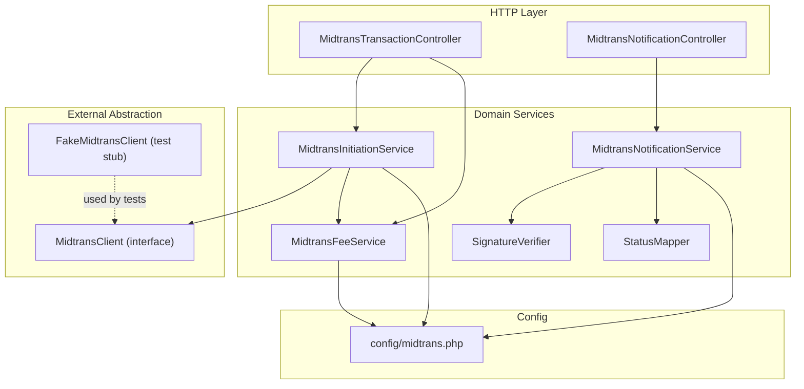
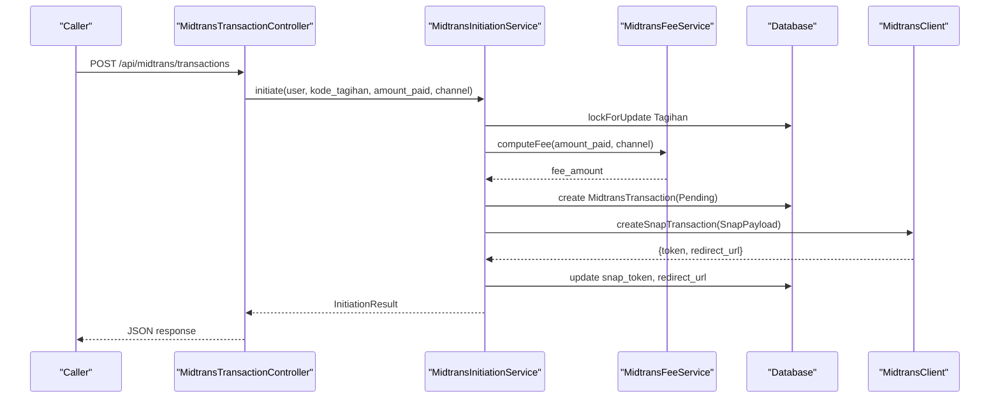
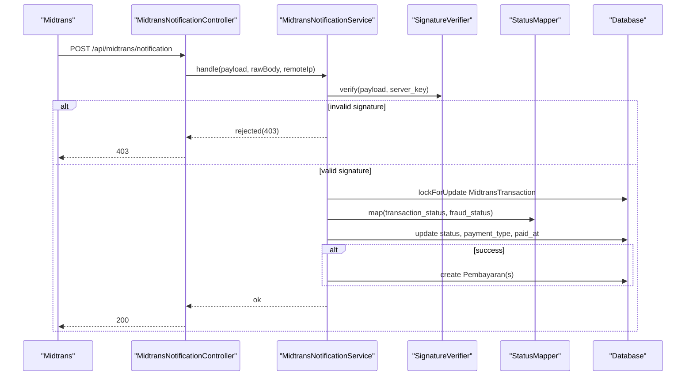
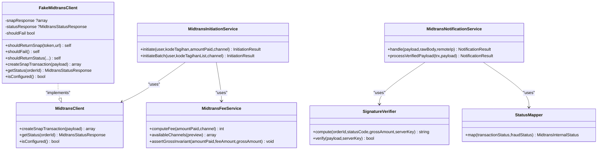

# Testing & Debugging Strategies

<cite>
**Referenced Files in This Document**
- [MidtransClient.php](file://backend/app/Services/Midtrans/MidtransClient.php)
- [FakeMidtransClient.php](file://backend/tests/Stubs/FakeMidtransClient.php)
- [midtrans.php](file://backend/config/midtrans.php)
- [MidtransNotificationController.php](file://backend/app/Http/Controllers/MidtransNotificationController.php)
- [MidtransTransactionController.php](file://backend/app/Http/Controllers/MidtransTransactionController.php)
- [MidtransInitiationService.php](file://backend/app/Services/Midtrans/MidtransInitiationService.php)
- [MidtransNotificationService.php](file://backend/app/Services/Midtrans/MidtransNotificationService.php)
- [MidtransFeeService.php](file://backend/app/Services/Midtrans/MidtransFeeService.php)
- [SignatureVerifier.php](file://backend/app/Services/Midtrans/SignatureVerifier.php)
- [StatusMapper.php](file://backend/app/Services/Midtrans/StatusMapper.php)
</cite>

## Table of Contents
1. Introduction
2. Project Structure
3. Core Components
4. Architecture Overview
5. Detailed Component Analysis
6. Dependency Analysis
7. Performance Considerations
8. Troubleshooting Guide
9. Conclusion

## Introduction
This document provides a comprehensive testing and debugging strategy for Midtrans integration in the Handayani system. It covers mock implementations, test stubs, unit and feature test patterns for payment services, debugging techniques for payment flows, log analysis methods, and common troubleshooting scenarios. Practical examples are included for writing tests around payment initiation, webhook processing, and error scenarios. The guide also addresses development environment setup for sandbox testing, configuration toggles, and performance testing approaches for high-volume payment processing.

## Project Structure
The Midtrans integration is implemented as a set of services and controllers with clear separation of concerns:
- Controllers expose HTTP endpoints for initiating transactions and handling webhooks.
- Services encapsulate business logic for initiation, notification processing, fee calculation, signature verification, and status mapping.
- A client interface abstracts external calls to Midtrans, enabling easy mocking in tests.
- Configuration centralizes feature flags, credentials, fees, and behavior toggles.

**Diagram sources**
- [MidtransTransactionController.php:1-127](file://backend/app/Http/Controllers/MidtransTransactionController.php#L1-L127)
- [MidtransNotificationController.php:1-35](file://backend/app/Http/Controllers/MidtransNotificationController.php#L1-L35)
- [MidtransInitiationService.php:1-473](file://backend/app/Services/Midtrans/MidtransInitiationService.php#L1-L473)
- [MidtransNotificationService.php:1-284](file://backend/app/Services/Midtrans/MidtransNotificationService.php#L1-L284)
- [MidtransFeeService.php:1-144](file://backend/app/Services/Midtrans/MidtransFeeService.php#L1-L144)
- [SignatureVerifier.php:1-34](file://backend/app/Services/Midtrans/SignatureVerifier.php#L1-L34)
- [StatusMapper.php:1-41](file://backend/app/Services/Midtrans/StatusMapper.php#L1-L41)
- [MidtransClient.php:1-27](file://backend/app/Services/Midtrans/MidtransClient.php#L1-L27)
- [FakeMidtransClient.php:1-120](file://backend/tests/Stubs/FakeMidtransClient.php#L1-L120)
- [midtrans.php:1-130](file://backend/config/midtrans.php#L1-L130)

**Section sources**
- [MidtransTransactionController.php:1-127](file://backend/app/Http/Controllers/MidtransTransactionController.php#L1-L127)
- [MidtransNotificationController.php:1-35](file://backend/app/Http/Controllers/MidtransNotificationController.php#L1-L35)
- [MidtransInitiationService.php:1-473](file://backend/app/Services/Midtrans/MidtransInitiationService.php#L1-L473)
- [MidtransNotificationService.php:1-284](file://backend/app/Services/Midtrans/MidtransNotificationService.php#L1-L284)
- [MidtransFeeService.php:1-144](file://backend/app/Services/Midtrans/MidtransFeeService.php#L1-L144)
- [SignatureVerifier.php:1-34](file://backend/app/Services/Midtrans/SignatureVerifier.php#L1-L34)
- [StatusMapper.php:1-41](file://backend/app/Services/Midtrans/StatusMapper.php#L1-L41)
- [MidtransClient.php:1-27](file://backend/app/Services/Midtrans/MidtransClient.php#L1-L27)
- [FakeMidtransClient.php:1-120](file://backend/tests/Stubs/FakeMidtransClient.php#L1-L120)
- [midtrans.php:1-130](file://backend/config/midtrans.php#L1-L130)

## Core Components
- MidtransClient interface defines the contract for creating Snap transactions and querying statuses. This abstraction enables swapping the real implementation with a fake during tests.
- FakeMidtransClient implements the interface and allows deterministic responses or forced failures for robust testing.
- MidtransInitiationService orchestrates validation, fee computation, transaction persistence, Snap payload construction, and calling the client.
- MidtransNotificationService validates signatures, maps statuses, enforces transitions, updates records, and creates Pembayaran entries idempotently.
- MidtransFeeService computes channel-specific fees and exposes available channels with previews.
- SignatureVerifier ensures webhook authenticity using SHA-512 over order_id, status_code, gross_amount, and server_key.
- StatusMapper translates Midtrans statuses into internal states.
- midtrans.php configures feature flags, credentials, fees, expiry, and callback URLs.

Key testing implications:
- Use FakeMidtransClient to simulate success, failure, and specific status responses without network calls.
- Toggle features via config flags to validate disabled paths.
- Validate fee calculations and gross amount invariants across single and batch flows.
- Verify signature verification and status transition guards in webhook processing.

**Section sources**
- [MidtransClient.php:1-27](file://backend/app/Services/Midtrans/MidtransClient.php#L1-L27)
- [FakeMidtransClient.php:1-120](file://backend/tests/Stubs/FakeMidtransClient.php#L1-L120)
- [MidtransInitiationService.php:1-473](file://backend/app/Services/Midtrans/MidtransInitiationService.php#L1-L473)
- [MidtransNotificationService.php:1-284](file://backend/app/Services/Midtrans/MidtransNotificationService.php#L1-L284)
- [MidtransFeeService.php:1-144](file://backend/app/Services/Midtrans/MidtransFeeService.php#L1-L144)
- [SignatureVerifier.php:1-34](file://backend/app/Services/Midtrans/SignatureVerifier.php#L1-L34)
- [StatusMapper.php:1-41](file://backend/app/Services/Midtrans/StatusMapper.php#L1-L41)
- [midtrans.php:1-130](file://backend/config/midtrans.php#L1-L130)

## Architecture Overview
The following sequence diagrams illustrate key flows used for testing and debugging.

### Payment Initiation Flow

**Diagram sources**
- [MidtransTransactionController.php:1-127](file://backend/app/Http/Controllers/MidtransTransactionController.php#L1-L127)
- [MidtransInitiationService.php:1-473](file://backend/app/Services/Midtrans/MidtransInitiationService.php#L1-L473)
- [MidtransFeeService.php:1-144](file://backend/app/Services/Midtrans/MidtransFeeService.php#L1-L144)
- [MidtransClient.php:1-27](file://backend/app/Services/Midtrans/MidtransClient.php#L1-L27)

### Webhook Processing Flow

**Diagram sources**
- [MidtransNotificationController.php:1-35](file://backend/app/Http/Controllers/MidtransNotificationController.php#L1-L35)
- [MidtransNotificationService.php:1-284](file://backend/app/Services/Midtrans/MidtransNotificationService.php#L1-L284)
- [SignatureVerifier.php:1-34](file://backend/app/Services/Midtrans/SignatureVerifier.php#L1-L34)
- [StatusMapper.php:1-41](file://backend/app/Services/Midtrans/StatusMapper.php#L1-L41)

## Detailed Component Analysis

### MidtransClient Interface and Test Stub
- Purpose: Abstract external Midtrans API calls to enable deterministic testing.
- Methods:
  - createSnapTransaction(SnapPayload): returns token and redirect URL.
  - getStatus(orderId): returns structured status response.
  - isConfigured(): indicates whether credentials are present.
- FakeMidtransClient capabilities:
  - shouldReturnSnap(token, url): configure successful Snap creation.
  - shouldFail(): force exceptions on any call.
  - shouldReturnStatus(...): configure specific status responses including signature_key.
  - Default pending status when not configured.

Testing patterns:
- Inject FakeMidtransClient in place of MidtransClient for unit tests.
- Assert returned tokens and redirect URLs.
- Force failures to validate error handling and transaction rollback/failure marking.
- Configure status responses to exercise webhook processing branches.

**Section sources**
- [MidtransClient.php:1-27](file://backend/app/Services/Midtrans/MidtransClient.php#L1-L27)
- [FakeMidtransClient.php:1-120](file://backend/tests/Stubs/FakeMidtransClient.php#L1-L120)

### MidtransInitiationService
Responsibilities:
- Feature flag checks and client configuration validation.
- Load and lock Tagihan, enforce ownership, compute sisa_tagihan.
- Validate minimum amount and prevent overpayment.
- Prevent concurrent in-flight transactions per tagihan.
- Compute fee and assert gross invariant.
- Persist MidtransTransaction with Pending status and expiration.
- Build SnapPayload with item details, customer details, expiry, callbacks, and enabled payments.
- Call MidtransClient.createSnapTransaction; on failure, mark Failure and log.
- Return InitiationResult with orderId, snapToken, redirectUrl, amounts, and expiredAt.

Batch flow:
- Validates list, locks multiple Tagihan deterministically, aggregates amountPaid, builds batch items, applies single fee, persists with batch_items, and proceeds similarly to single flow.

Testing strategies:
- Use FakeMidtransClient.shouldReturnSnap(...) to assert successful initiation.
- Use FakeMidtransClient.shouldFail() to assert failure path and transaction state.
- Provide various payment_channel values to test fee computation and enabled_payments mapping.
- Validate that pending in-flight transactions block new initiations.
- Confirm gross invariant assertions and exception types.

**Section sources**
- [MidtransInitiationService.php:1-473](file://backend/app/Services/Midtrans/MidtransInitiationService.php#L1-L473)
- [MidtransFeeService.php:1-144](file://backend/app/Services/Midtrans/MidtransFeeService.php#L1-L144)

### MidtransNotificationService
Responsibilities:
- Check webhook_enabled flag.
- Record inbound logs before processing.
- Verify signature using SignatureVerifier.
- Lock MidtransTransaction and process verified payloads.
- Map statuses via StatusMapper and enforce allowed transitions.
- Update transaction fields and paid_at on success.
- Idempotently record Pembayaran(s), including batch support.
- Dispatch events upon successful recording.

Testing strategies:
- Provide valid signatures using SignatureVerifier.compute(...) to pass verification.
- Configure FakeMidtransClient.shouldReturnStatus(...) to supply signature_key for verification.
- Assert rejection codes for invalid signatures, missing orders, and invalid transitions.
- For success cases, assert Pembayaran creation and Tagihan tmp/status updates.
- For batch cases, assert multiple Pembayaran rows and correct midtrans_order_id assignment.

**Section sources**
- [MidtransNotificationService.php:1-284](file://backend/app/Services/Midtrans/MidtransNotificationService.php#L1-L284)
- [SignatureVerifier.php:1-34](file://backend/app/Services/Midtrans/SignatureVerifier.php#L1-L34)
- [StatusMapper.php:1-41](file://backend/app/Services/Midtrans/StatusMapper.php#L1-L41)

### MidtransFeeService
Responsibilities:
- Compute fee based on channel configuration (flat or percent + flat).
- Expose available channels with optional fee preview for frontend selection.
- Assert gross invariant to catch internal inconsistencies.

Testing strategies:
- Validate fee computation for each channel type and edge cases (unknown channel fallback).
- Assert descriptions and previews for UI rendering.
- Ensure gross invariant throws on inconsistent inputs.

**Section sources**
- [MidtransFeeService.php:1-144](file://backend/app/Services/Midtrans/MidtransFeeService.php#L1-L144)

### SignatureVerifier and StatusMapper
- SignatureVerifier:
  - Computes SHA-512 over order_id + status_code + gross_amount + server_key.
  - Verifies using constant-time comparison.
- StatusMapper:
  - Maps Midtrans statuses to internal states, including capture acceptance rules.

Testing strategies:
- Generate expected signatures and compare against payload signature_key.
- Cover all mapped statuses and fraud_status combinations.

**Section sources**
- [SignatureVerifier.php:1-34](file://backend/app/Services/Midtrans/SignatureVerifier.php#L1-L34)
- [StatusMapper.php:1-41](file://backend/app/Services/Midtrans/StatusMapper.php#L1-L41)

### Controllers
- MidtransTransactionController:
  - Endpoints: initiate, feeChannels, initiateBatch, show.
  - Returns client_key for frontend Snap initialization.
- MidtransNotificationController:
  - Endpoint: handle webhook.
  - Delegates to service layer; does not check global enabled flag at controller level.

Testing strategies:
- Use HTTP-level tests to validate request/response contracts.
- Mock services where appropriate; for full integration, use FakeMidtransClient.
- Assert authorization checks for transaction status retrieval.

**Section sources**
- [MidtransTransactionController.php:1-127](file://backend/app/Http/Controllers/MidtransTransactionController.php#L1-L127)
- [MidtransNotificationController.php:1-35](file://backend/app/Http/Controllers/MidtransNotificationController.php#L1-L35)

## Dependency Analysis

**Diagram sources**
- [MidtransClient.php:1-27](file://backend/app/Services/Midtrans/MidtransClient.php#L1-L27)
- [FakeMidtransClient.php:1-120](file://backend/tests/Stubs/FakeMidtransClient.php#L1-L120)
- [MidtransInitiationService.php:1-473](file://backend/app/Services/Midtrans/MidtransInitiationService.php#L1-L473)
- [MidtransNotificationService.php:1-284](file://backend/app/Services/Midtrans/MidtransNotificationService.php#L1-L284)
- [MidtransFeeService.php:1-144](file://backend/app/Services/Midtrans/MidtransFeeService.php#L1-L144)
- [SignatureVerifier.php:1-34](file://backend/app/Services/Midtrans/SignatureVerifier.php#L1-L34)
- [StatusMapper.php:1-41](file://backend/app/Services/Midtrans/StatusMapper.php#L1-L41)

**Section sources**
- [MidtransClient.php:1-27](file://backend/app/Services/Midtrans/MidtransClient.php#L1-L27)
- [FakeMidtransClient.php:1-120](file://backend/tests/Stubs/FakeMidtransClient.php#L1-L120)
- [MidtransInitiationService.php:1-473](file://backend/app/Services/Midtrans/MidtransInitiationService.php#L1-L473)
- [MidtransNotificationService.php:1-284](file://backend/app/Services/Midtrans/MidtransNotificationService.php#L1-L284)
- [MidtransFeeService.php:1-144](file://backend/app/Services/Midtrans/MidtransFeeService.php#L1-L144)
- [SignatureVerifier.php:1-34](file://backend/app/Services/Midtrans/SignatureVerifier.php#L1-L34)
- [StatusMapper.php:1-41](file://backend/app/Services/Midtrans/StatusMapper.php#L1-L41)

## Performance Considerations
- Concurrency control:
  - Use lockForUpdate on critical entities (Tagihan, MidtransTransaction) to avoid race conditions during initiation and webhook processing.
  - Batch initiation locks multiple Tagihan deterministically ordered to reduce deadlock risk.
- Transaction boundaries:
  - Keep database operations within explicit transactions to ensure consistency and allow retries on deadlocks for webhook processing.
- Logging overhead:
  - Record inbound/outbound logs judiciously; consider retention policies to manage storage growth.
- Fee computation:
  - Avoid heavy computations; fee calculation is lightweight but should be cached if needed for high-throughput scenarios.
- External API calls:
  - Timeouts and retries should be handled at the client layer to prevent long-running requests.

[No sources needed since this section provides general guidance]

## Troubleshooting Guide

### Development Environment Setup for Midtrans Testing
- Enable/disable features:
  - HANDAYANI_MIDTRANS_ENABLED controls overall feature availability.
  - HANDAYANI_MIDTRANS_WEBHOOK_ENABLED controls webhook processing independently.
- Credentials and environment:
  - MIDTRANS_SERVER_KEY, MIDTRANS_CLIENT_KEY, MIDTRANS_MERCHANT_ID must be set.
  - MIDTRANS_ENVIRONMENT can be set to sandbox for testing.
- Fees and defaults:
  - Configure fee_flat and fee_channels for accurate fee previews and calculations.
  - Set default_channel for UI selection.
- Callbacks and retention:
  - MIDTRANS_FINISH_URL determines return URL after Snap interactions.
  - MIDTRANS_LOG_RETENTION_DAYS controls log pruning.

Practical steps:
- Set environment variables accordingly and restart the application.
- Use sandbox keys from Midtrans dashboard for realistic testing.
- Disable webhooks temporarily if isolating initiation flows.

**Section sources**
- [midtrans.php:1-130](file://backend/config/midtrans.php#L1-L130)

### Debugging Techniques for Payment Flows
- Outbound logs:
  - Inspect outbound_charge logs for Snap API calls and responses.
- Inbound logs:
  - Review inbound webhook logs to confirm receipt and payload integrity.
- Signature verification:
  - Ensure server_key matches and payload includes correct signature_key.
- Status transitions:
  - Verify current vs. target status transitions are allowed.
- Amount mismatch:
  - Compare gross_amount between local records and webhook payload.

Common issues:
- Invalid signature: Check server_key and payload fields.
- Order not found: Ensure order_id exists and is accessible.
- Overpayment blocked: Validate sisa_tagihan vs. amount_paid.
- Disabled features: Confirm feature flags are enabled appropriately.

**Section sources**
- [MidtransNotificationService.php:1-284](file://backend/app/Services/Midtrans/MidtransNotificationService.php#L1-L284)
- [MidtransInitiationService.php:1-473](file://backend/app/Services/Midtrans/MidtransInitiationService.php#L1-L473)

### Unit Test Patterns for Payment Services
- Payment initiation:
  - Arrange: Create user and tagihan fixtures; inject FakeMidtransClient.
  - Act: Call MidtransInitiationService.initiate(...) with valid parameters.
  - Assert: Returned InitiationResult fields; persisted MidtransTransaction state; logged outbound charge.
- Error scenarios:
  - Force FakeMidtransClient.shouldFail() to assert failure marking and logging.
  - Provide invalid amount or forbidden ownership to assert domain exceptions.
- Webhook processing:
  - Arrange: Create MidtransTransaction; compute valid signature using SignatureVerifier; build payload.
  - Act: Call MidtransNotificationService.handle(...) or processVerifiedPayload(...).
  - Assert: Correct status updates; Pembayaran creation; event dispatching.
- Fee calculations:
  - Arrange: Configure fee_channels; provide preview amount.
  - Act: Call MidtransFeeService.availableChannels(...) and computeFee(...).
  - Assert: Expected fee_preview and gross_preview; description formatting.

**Section sources**
- [FakeMidtransClient.php:1-120](file://backend/tests/Stubs/FakeMidtransClient.php#L1-L120)
- [MidtransInitiationService.php:1-473](file://backend/app/Services/Midtrans/MidtransInitiationService.php#L1-L473)
- [MidtransNotificationService.php:1-284](file://backend/app/Services/Midtrans/MidtransNotificationService.php#L1-L284)
- [MidtransFeeService.php:1-144](file://backend/app/Services/Midtrans/MidtransFeeService.php#L1-L144)
- [SignatureVerifier.php:1-34](file://backend/app/Services/Midtrans/SignatureVerifier.php#L1-L34)

### Practical Examples of Writing Tests
- Payment initiation example outline:
  - Use FakeMidtransClient.shouldReturnSnap(...) to simulate success.
  - Validate returned snap_token and redirect_url.
  - Assert MidtransTransaction.status remains Pending until webhook updates it.
- Webhook processing example outline:
  - Use SignatureVerifier.compute(...) to generate signature_key.
  - Provide payload with matching order_id, status_code, gross_amount.
  - Assert status transitions and Pembayaran creation.
- Error scenario example outline:
  - Configure FakeMidtransClient.shouldFail() to trigger MidtransUnavailableException.
  - Assert transaction marked as Failure and outbound error logged.

[No sources needed since this section provides general guidance]

### Performance Testing Approaches for High-Volume Payments
- Simulate concurrent initiation requests:
  - Use load testing tools to send parallel requests to /api/midtrans/transactions.
  - Monitor lock contention and deadlock retries.
- Stress webhook processing:
  - Replay webhook payloads in bursts to validate throughput and idempotency.
- Measure latency:
  - Track time spent in fee computation, database operations, and external API calls.
- Capacity planning:
  - Evaluate queue workers and background jobs if applicable.
  - Tune database connection pools and timeouts.

[No sources needed since this section provides general guidance]

## Conclusion
By leveraging the MidtransClient abstraction and FakeMidtransClient stub, you can write robust unit and feature tests covering initiation, batch flows, webhook processing, and error scenarios. Configuration flags and detailed logging facilitate safe experimentation in sandbox environments. Adhering to concurrency controls, transaction boundaries, and idempotent processing ensures reliability under high volume. Use the provided patterns and diagrams as a blueprint for expanding test coverage and diagnosing issues efficiently.