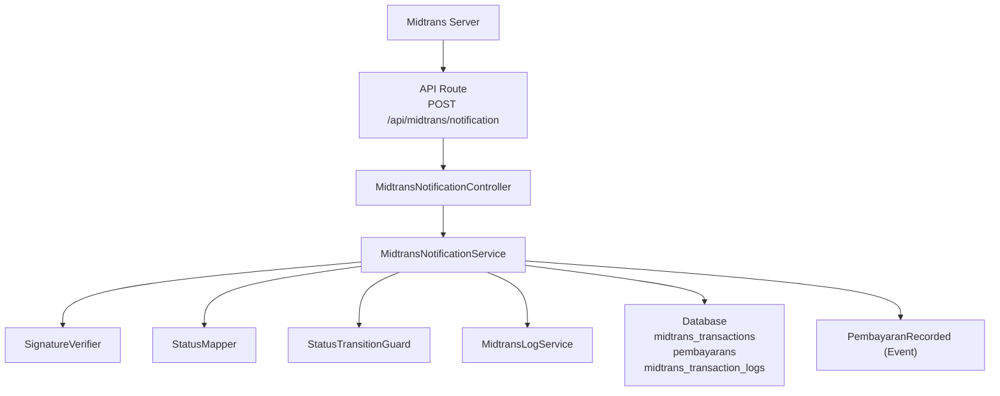
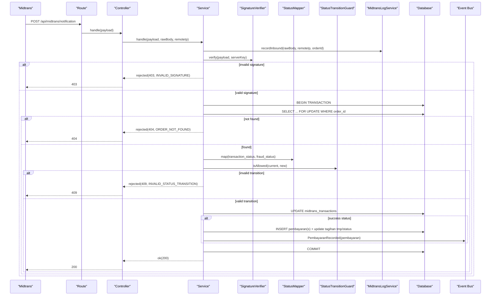
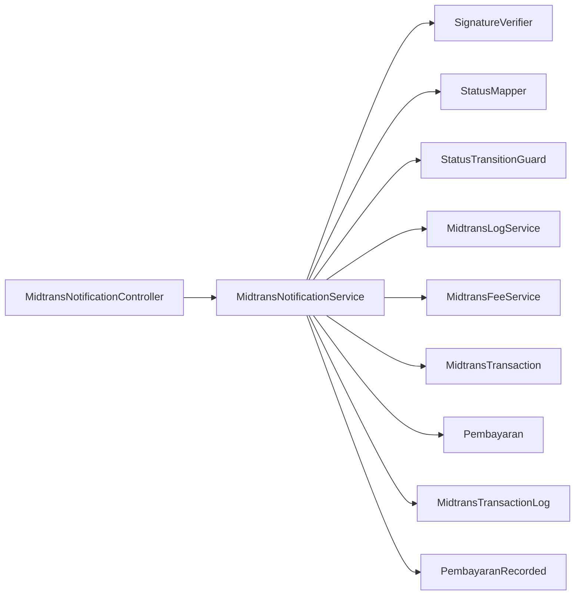

# Notification Processing Pipeline

<cite>
**Referenced Files in This Document**
- [MidtransNotificationController.php](file://backend/app/Http/Controllers/MidtransNotificationController.php)
- [MidtransNotificationService.php](file://backend/app/Services/Midtrans/MidtransNotificationService.php)
- [SignatureVerifier.php](file://backend/app/Services/Midtrans/SignatureVerifier.php)
- [StatusMapper.php](file://backend/app/Services/Midtrans/StatusMapper.php)
- [StatusTransitionGuard.php](file://backend/app/Services/Midtrans/StatusTransitionGuard.php)
- [MidtransInternalStatus.php](file://backend/app/Services/Midtrans/MidtransInternalStatus.php)
- [MidtransLogService.php](file://backend/app/Services/Midtrans/MidtransLogService.php)
- [MidtransFeeService.php](file://backend/app/Services/Midtrans/MidtransFeeService.php)
- [MidtransTransaction.php](file://backend/app/Models/MidtransTransaction.php)
- [Pembayaran.php](file://backend/app/Models/Pembayaran.php)
- [PembayaranRecorded.php](file://backend/app/Events/PembayaranRecorded.php)
- [api.php](file://backend/routes/api.php)
- [midtrans.php](file://backend/config/midtrans.php)
- [2026_06_22_000001_create_midtrans_transactions_table.php](file://backend/database/migrations/2026_06_22_000001_create_midtrans_transactions_table.php)
- [2026_06_22_000002_create_midtrans_transaction_logs_table.php](file://backend/database/migrations/2026_06_22_000002_create_midtrans_transaction_logs_table.php)
- [2026_06_22_000003_add_midtrans_columns_to_pembayarans_table.php](file://backend/database/migrations/2026_06_22_000003_add_midtrans_columns_to_pembayarans_table.php)
- [MidtransPruneLogsCommand.php](file://backend/app/Console/Commands/MidtransPruneLogsCommand.php)
</cite>

## Table of Contents
1. Introduction
2. Project Structure
3. Core Components
4. Architecture Overview
5. Detailed Component Analysis
6. Dependency Analysis
7. Performance Considerations
8. Troubleshooting Guide
9. Conclusion

## Introduction
This document explains the complete webhook notification processing pipeline for Midtrans payments. It covers the end-to-end flow from the HTTP controller to database updates, including signature verification, amount validation, status mapping and transition checks, idempotent processing, batch transaction handling, concurrency control, deadlock prevention, retry mechanisms, logging, monitoring, and production deployment considerations for high-throughput environments.

## Project Structure
The webhook endpoint is a public route that delegates all processing to a dedicated service layer. The service orchestrates signature verification, database locking, idempotency, state transitions, payment recording, and event dispatching. Supporting services handle fee computation, logging with sensitive data masking, and status mapping.

**Diagram sources**
- [api.php:321-324](file://backend/routes/api.php#L321-L324)
- [MidtransNotificationController.php:1-35](file://backend/app/Http/Controllers/MidtransNotificationController.php#L1-L35)
- [MidtransNotificationService.php:1-284](file://backend/app/Services/Midtrans/MidtransNotificationService.php#L1-L284)
- [SignatureVerifier.php:1-34](file://backend/app/Services/Midtrans/SignatureVerifier.php#L1-L34)
- [StatusMapper.php:1-41](file://backend/app/Services/Midtrans/StatusMapper.php#L1-L41)
- [StatusTransitionGuard.php:1-77](file://backend/app/Services/Midtrans/StatusTransitionGuard.php#L1-L77)
- [MidtransLogService.php:1-109](file://backend/app/Services/Midtrans/MidtransLogService.php#L1-L109)
- [PembayaranRecorded.php:1-17](file://backend/app/Events/PembayaranRecorded.php#L1-L17)

**Section sources**
- [api.php:321-324](file://backend/routes/api.php#L321-L324)
- [midtrans.php:1-130](file://backend/config/midtrans.php#L1-L130)

## Core Components
- MidtransNotificationController: Thin HTTP entrypoint that reads raw payload and delegates to the service.
- MidtransNotificationService: Orchestrates signature verification, DB transactions with retries, idempotent processing, status mapping, transition guard, payment recording, and event dispatch.
- SignatureVerifier: Computes and verifies HMAC-like signatures using SHA-512 and constant-time comparison.
- StatusMapper: Maps Midtrans statuses to internal states.
- StatusTransitionGuard: Enforces allowed state transitions.
- MidtransLogService: Records inbound/outbound logs with sensitive field masking and safety net.
- MidtransFeeService: Computes fees per channel and asserts gross amount invariant.
- Models: MidtransTransaction, Pembayaran, MidtransTransactionLog.
- Events: PembayaranRecorded dispatched after successful payment recording.

Key responsibilities and interactions are detailed in subsequent sections.

**Section sources**
- [MidtransNotificationController.php:1-35](file://backend/app/Http/Controllers/MidtransNotificationController.php#L1-L35)
- [MidtransNotificationService.php:1-284](file://backend/app/Services/Midtrans/MidtransNotificationService.php#L1-L284)
- [SignatureVerifier.php:1-34](file://backend/app/Services/Midtrans/SignatureVerifier.php#L1-L34)
- [StatusMapper.php:1-41](file://backend/app/Services/Midtrans/StatusMapper.php#L1-L41)
- [StatusTransitionGuard.php:1-77](file://backend/app/Services/Midtrans/StatusTransitionGuard.php#L1-L77)
- [MidtransLogService.php:1-109](file://backend/app/Services/Midtrans/MidtransLogService.php#L1-L109)
- [MidtransFeeService.php:1-144](file://backend/app/Services/Midtrans/MidtransFeeService.php#L1-L144)
- [MidtransTransaction.php:1-85](file://backend/app/Models/MidtransTransaction.php#L1-L85)
- [Pembayaran.php:1-53](file://backend/app/Models/Pembayaran.php#L1-L53)
- [PembayaranRecorded.php:1-17](file://backend/app/Events/PembayaranRecorded.php#L1-L17)

## Architecture Overview
The webhook architecture follows a layered approach:
- Public API route receives notifications without authentication; security relies on signature verification.
- Controller performs minimal parsing and delegates to the service.
- Service enforces business rules within a single DB transaction with lock-for-update and retries on deadlocks.
- Idempotency is ensured by checking existing records and enforcing unique constraints.
- Successful payments record one or more Pembayaran rows and emit an event for downstream processing.

**Diagram sources**
- [api.php:321-324](file://backend/routes/api.php#L321-L324)
- [MidtransNotificationController.php:1-35](file://backend/app/Http/Controllers/MidtransNotificationController.php#L1-L35)
- [MidtransNotificationService.php:1-284](file://backend/app/Services/Midtrans/MidtransNotificationService.php#L1-L284)
- [SignatureVerifier.php:1-34](file://backend/app/Services/Midtrans/SignatureVerifier.php#L1-L34)
- [StatusMapper.php:1-41](file://backend/app/Services/Midtrans/StatusMapper.php#L1-L41)
- [StatusTransitionGuard.php:1-77](file://backend/app/Services/Midtrans/StatusTransitionGuard.php#L1-L77)
- [MidtransLogService.php:1-109](file://backend/app/Services/Midtrans/MidtransLogService.php#L1-L109)
- [PembayaranRecorded.php:1-17](file://backend/app/Events/PembayaranRecorded.php#L1-L17)

## Detailed Component Analysis

### Webhook Entry Point and Request Lifecycle
- Route registration exposes a public POST endpoint for Midtrans webhooks.
- Controller reads raw body, decodes JSON, extracts IP, and calls the service.
- Controller returns 200 on success or error responses based on service result.

Operational notes:
- Authentication is intentionally skipped at the controller level; security depends on signature verification inside the service.
- The controller does not gate on global Midtrans enabled flag; it defers to service-level webhook_enabled check.

**Section sources**
- [api.php:321-324](file://backend/routes/api.php#L321-L324)
- [MidtransNotificationController.php:1-35](file://backend/app/Http/Controllers/MidtransNotificationController.php#L1-L35)

### MidtransNotificationService: Orchestration and Concurrency Control
Responsibilities:
- Check webhook_enabled configuration.
- Record inbound log before any processing.
- Verify signature using SignatureVerifier.
- Execute DB transaction with lockForUpdate on the target MidtransTransaction row.
- Validate gross_amount against stored value.
- Map and validate status transitions.
- Update transaction metadata and paid_at when applicable.
- Record Pembayaran(s) idempotently and update related Tagihan amounts and status.
- Emit PembayaranRecorded event for downstream listeners.

Concurrency and reliability:
- Uses DB::transaction with retry count to mitigate transient deadlocks.
- Locks the specific transaction row via lockForUpdate to prevent concurrent updates.
- Idempotency: skips if a Pembayaran already exists for the same midtrans_order_id.

Batch handling:
- For batch transactions, creates one Pembayaran per item while ensuring only the first row carries the unique midtrans_order_id to satisfy uniqueness constraints.
- Validates overpayment per item and throws a specific exception if exceeded.

Error signaling:
- Returns structured NotificationResult with appropriate HTTP codes and error codes for common cases (invalid signature, order not found, invalid transition).

**Section sources**
- [MidtransNotificationService.php:1-284](file://backend/app/Services/Midtrans/MidtransNotificationService.php#L1-L284)
- [MidtransTransaction.php:1-85](file://backend/app/Models/MidtransTransaction.php#L1-L85)
- [Pembayaran.php:1-53](file://backend/app/Models/Pembayaran.php#L1-L53)
- [PembayaranRecorded.php:1-17](file://backend/app/Events/PembayaranRecorded.php#L1-L17)

#### Class Relationships

```mermaid
classDiagram
class MidtransNotificationService {
+handle(payload, rawBody, remoteIp) NotificationResult
+processVerifiedPayload(trx, payload) NotificationResult
-processTransaction(trx, payload) NotificationResult
-recordPembayaran(trx, payload) void
}
class SignatureVerifier {
+compute(orderId, statusCode, grossAmount, serverKey) string
+verify(payload, serverKey) bool
}
class StatusMapper {
+map(transactionStatus, fraudStatus) MidtransInternalStatus
}
class StatusTransitionGuard {
+isAllowed(current, next) bool
+isTerminal(status) bool
}
class MidtransLogService {
+recordInbound(rawBody, remoteIp, orderId) void
+recordOutbound(direction, orderId, httpStatus, rawPayload) void
}
class MidtransFeeService {
+computeFee(amountPaid, channel) int
+availableChannels(amountPaidPreview) array
+isValidChannel(channel) bool
+assertGrossInvariant(amountPaid, feeAmount, grossAmount) void
}
class MidtransTransaction
class Pembayaran
class PembayaranRecorded
MidtransNotificationService --> SignatureVerifier : "uses"
MidtransNotificationService --> StatusMapper : "uses"
MidtransNotificationService --> StatusTransitionGuard : "uses"
MidtransNotificationService --> MidtransLogService : "uses"
MidtransNotificationService --> MidtransFeeService : "uses"
MidtransNotificationService --> MidtransTransaction : "reads/updates"
MidtransNotificationService --> Pembayaran : "creates"
MidtransNotificationService --> PembayaranRecorded : "dispatches"
```

**Diagram sources**
- [MidtransNotificationService.php:1-284](file://backend/app/Services/Midtrans/MidtransNotificationService.php#L1-L284)
- [SignatureVerifier.php:1-34](file://backend/app/Services/Midtrans/SignatureVerifier.php#L1-L34)
- [StatusMapper.php:1-41](file://backend/app/Services/Midtrans/StatusMapper.php#L1-L41)
- [StatusTransitionGuard.php:1-77](file://backend/app/Services/Midtrans/StatusTransitionGuard.php#L1-L77)
- [MidtransLogService.php:1-109](file://backend/app/Services/Midtrans/MidtransLogService.php#L1-L109)
- [MidtransFeeService.php:1-144](file://backend/app/Services/Midtrans/MidtransFeeService.php#L1-L144)
- [MidtransTransaction.php:1-85](file://backend/app/Models/MidtransTransaction.php#L1-L85)
- [Pembayaran.php:1-53](file://backend/app/Models/Pembayaran.php#L1-L53)
- [PembayaranRecorded.php:1-17](file://backend/app/Events/PembayaranRecorded.php#L1-L17)

### Signature Verification
- Computes expected signature using SHA-512 over concatenated fields and compares using constant-time comparison to prevent timing attacks.
- Rejects requests with invalid signatures early and returns 403.

Security considerations:
- Ensure server_key is configured securely and never exposed in logs or responses.
- Logging masks sensitive keys automatically.

**Section sources**
- [SignatureVerifier.php:1-34](file://backend/app/Services/Midtrans/SignatureVerifier.php#L1-L34)
- [midtrans.php:31-35](file://backend/config/midtrans.php#L31-L35)

### Payload Validation and Amount Verification
- Gross amount validation ensures consistency between incoming payload and stored transaction amount.
- Comparison logic handles floating-point representations by normalizing values before integer comparison.
- If mismatched, returns 422 with AMOUNT_MISMATCH.

Best practices:
- Always compare monetary values as integers to avoid precision issues.
- Keep gross_amount consistent across initiation and settlement.

**Section sources**
- [MidtransNotificationService.php:96-112](file://backend/app/Services/Midtrans/MidtransNotificationService.php#L96-L112)

### Status Mapping and Transition Guard
- StatusMapper maps external statuses to internal states, including special handling for capture with fraud checks.
- StatusTransitionGuard enforces allowed transitions and identifies terminal states.
- No-op transitions (same status) return success without side effects.

State model:
- Internal statuses include pending, settlement, capture, deny, cancel, expire, failure, refund, partial_refund.
- Terminal states block further transitions except refunds from settlement/capture.

**Section sources**
- [StatusMapper.php:1-41](file://backend/app/Services/Midtrans/StatusMapper.php#L1-L41)
- [StatusTransitionGuard.php:1-77](file://backend/app/Services/Midtrans/StatusTransitionGuard.php#L1-L77)
- [MidtransInternalStatus.php:1-45](file://backend/app/Services/Midtrans/MidtransInternalStatus.php#L1-L45)

### Transaction Recording and Batch Handling
- On success, records Pembayaran(s) idempotently.
- Single-tagihan flow: one Pembayaran linked to the original kode_tagihan and midtrans_order_id.
- Batch flow: multiple Pembayaran entries per batch_items; only the first carries midtrans_order_id due to unique constraint; others remain discoverable via prefix patterns.
- Updates Tagihan tmp and status accordingly.
- Dispatches PembayaranRecorded event for each created Pembayaran.

Overpayment protection:
- Validates remaining balance against payment amount and raises a specific exception if exceeded.

**Section sources**
- [MidtransNotificationService.php:162-282](file://backend/app/Services/Midtrans/MidtransNotificationService.php#L162-L282)
- [Pembayaran.php:1-53](file://backend/app/Models/Pembayaran.php#L1-L53)
- [PembayaranRecorded.php:1-17](file://backend/app/Events/PembayaranRecorded.php#L1-L17)

### Logging and Monitoring
- MidtransLogService records inbound notifications and outbound API calls with masked payloads.
- Safety net prevents persisting server_key literals even after masking.
- Pruning command deletes old logs based on retention policy.

Monitoring recommendations:
- Track counts of rejected notifications by error code.
- Monitor time spent in DB transactions and deadlock retries.
- Alert on overpayment exceptions and invalid transitions.

**Section sources**
- [MidtransLogService.php:1-109](file://backend/app/Services/Midtrans/MidtransLogService.php#L1-L109)
- [MidtransPruneLogsCommand.php:1-26](file://backend/app/Console/Commands/MidtransPruneLogsCommand.php#L1-L26)
- [midtrans.php:127](file://backend/config/midtrans.php#L127)

### Configuration and Data Model
- Configuration includes environment toggles for enabling Midtrans and webhooks independently, fee settings, expiry, and retention days.
- Database schema defines midtrans_transactions, midtrans_transaction_logs, and adds midtrans_order_id to pembayarans with unique constraint.

Indexes and constraints:
- Unique order_id and midtrans_order_id ensure traceability and idempotency.
- Indexes support queries for pending/expired transactions and filtering by metode.

**Section sources**
- [midtrans.php:1-130](file://backend/config/midtrans.php#L1-L130)
- [2026_06_22_000001_create_midtrans_transactions_table.php:1-71](file://backend/database/migrations/2026_06_22_000001_create_midtrans_transactions_table.php#L1-L71)
- [2026_06_22_000002_create_midtrans_transaction_logs_table.php:1-32](file://backend/database/migrations/2026_06_22_000002_create_midtrans_transaction_logs_table.php#L1-L32)
- [2026_06_22_000003_add_midtrans_columns_to_pembayarans_table.php:1-37](file://backend/database/migrations/2026_06_22_000003_add_midtrans_columns_to_pembayarans_table.php#L1-L37)

## Dependency Analysis
High-level dependencies:
- Controller depends on Service.
- Service depends on SignatureVerifier, StatusMapper, StatusTransitionGuard, MidtransLogService, MidtransFeeService, and models/events.
- Models depend on relationships defined in migrations.

**Diagram sources**
- [MidtransNotificationController.php:1-35](file://backend/app/Http/Controllers/MidtransNotificationController.php#L1-L35)
- [MidtransNotificationService.php:1-284](file://backend/app/Services/Midtrans/MidtransNotificationService.php#L1-L284)
- [SignatureVerifier.php:1-34](file://backend/app/Services/Midtrans/SignatureVerifier.php#L1-L34)
- [StatusMapper.php:1-41](file://backend/app/Services/Midtrans/StatusMapper.php#L1-L41)
- [StatusTransitionGuard.php:1-77](file://backend/app/Services/Midtrans/StatusTransitionGuard.php#L1-L77)
- [MidtransLogService.php:1-109](file://backend/app/Services/Midtrans/MidtransLogService.php#L1-L109)
- [MidtransFeeService.php:1-144](file://backend/app/Services/Midtrans/MidtransFeeService.php#L1-L144)
- [MidtransTransaction.php:1-85](file://backend/app/Models/MidtransTransaction.php#L1-L85)
- [Pembayaran.php:1-53](file://backend/app/Models/Pembayaran.php#L1-L53)
- [PembayaranRecorded.php:1-17](file://backend/app/Events/PembayaranRecorded.php#L1-L17)

**Section sources**
- [api.php:321-324](file://backend/routes/api.php#L321-L324)
- [MidtransNotificationService.php:1-284](file://backend/app/Services/Midtrans/MidtransNotificationService.php#L1-L284)

## Performance Considerations
- Use lockForUpdate to serialize access to the same transaction row and prevent race conditions.
- Wrap critical sections in DB::transaction with retries to handle transient deadlocks gracefully.
- Avoid heavy I/O inside the transaction; keep operations focused on DB updates and lightweight validations.
- Leverage indexes on order_id, status, expired_at, and metode to optimize lookups.
- Consider moving non-critical work (e.g., sending emails, generating PDFs) to background jobs triggered by events.

[No sources needed since this section provides general guidance]

## Troubleshooting Guide
Common issues and strategies:
- Invalid signature: Check server_key configuration and ensure payload integrity. Return 403 and log details.
- Order not found: Verify order_id existence and ensure initiation succeeded before expecting notifications.
- Amount mismatch: Investigate discrepancies between initiated gross_amount and settlement amount; reject with 422.
- Invalid status transition: Review current vs. expected state; reject with 409.
- Overpayment blocked: Inspect remaining balance and payment amount; handle exceptions and alert.

Logging and observability:
- Inbound/outbound logs include masked payloads and remote IPs for auditability.
- Use pruning command to manage log volume according to retention policy.
- Monitor error rates and response times; set up alerts for critical failures.

**Section sources**
- [MidtransNotificationService.php:31-68](file://backend/app/Services/Midtrans/MidtransNotificationService.php#L31-L68)
- [MidtransLogService.php:1-109](file://backend/app/Services/Midtrans/MidtransLogService.php#L1-L109)
- [MidtransPruneLogsCommand.php:1-26](file://backend/app/Console/Commands/MidtransPruneLogsCommand.php#L1-L26)

## Conclusion
The webhook pipeline is designed for correctness, idempotency, and resilience under concurrency. It validates signatures, enforces state transitions, protects against overpayments, supports batch settlements, and maintains comprehensive logs. With proper configuration, indexing, and operational monitoring, it can handle high-throughput scenarios reliably.

[No sources needed since this section summarizes without analyzing specific files]