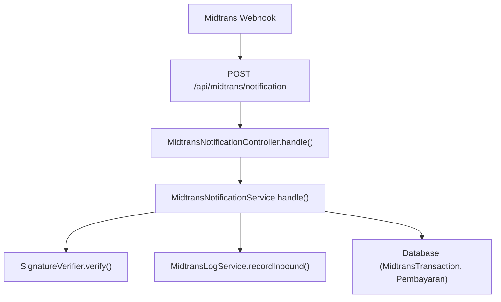
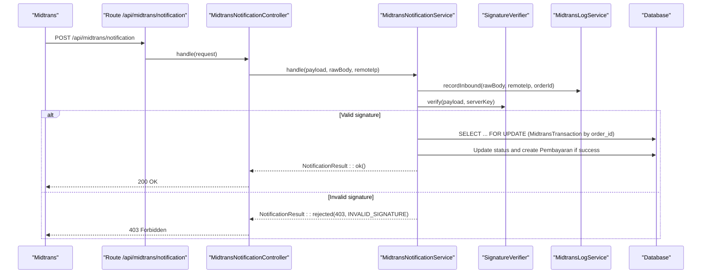
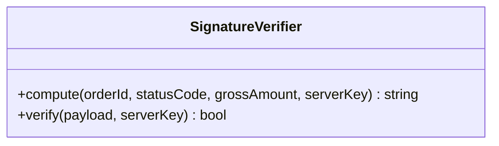
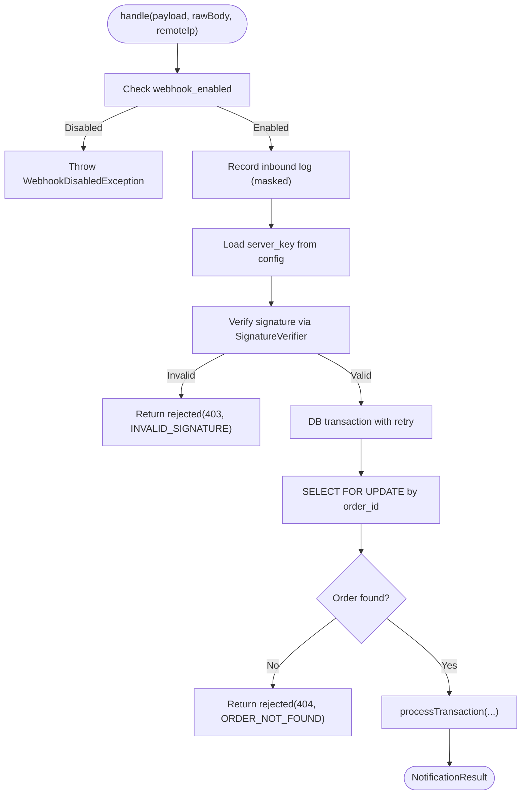
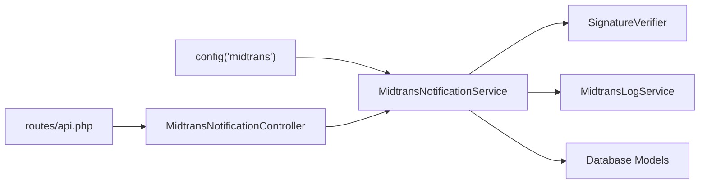

# Signature Verification & Security

<cite>
**Referenced Files in This Document**
- [SignatureVerifier.php](file://backend/app/Services/Midtrans/SignatureVerifier.php)
- [MidtransNotificationService.php](file://backend/app/Services/Midtrans/MidtransNotificationService.php)
- [MidtransNotificationController.php](file://backend/app/Http/Controllers/MidtransNotificationController.php)
- [midtrans.php](file://backend/config/midtrans.php)
- [api.php](file://backend/routes/api.php)
- [InvalidSignatureException.php](file://backend/app/Exceptions/Midtrans/InvalidSignatureException.php)
- [WebhookDisabledException.php](file://backend/app/Exceptions/Midtrans/WebhookDisabledException.php)
- [MidtransLogService.php](file://backend/app/Services/Midtrans/MidtransLogService.php)
- [SignatureVerifierTest.php](file://backend/tests/Unit/Services/Midtrans/SignatureVerifierTest.php)
</cite>

## Table of Contents
1. [Introduction](#introduction)
2. [Project Structure](#project-structure)
3. [Core Components](#core-components)
4. [Architecture Overview](#architecture-overview)
5. [Detailed Component Analysis](#detailed-component-analysis)
6. [Dependency Analysis](#dependency-analysis)
7. [Performance Considerations](#performance-considerations)
8. [Troubleshooting Guide](#troubleshooting-guide)
9. [Conclusion](#conclusion)
10. [Appendices](#appendices)

## Introduction
This document explains the Midtrans webhook signature verification and security mechanisms implemented in the project. It focuses on how the system authenticates incoming webhook payloads using HMAC-SHA512, how server keys are configured, and what safeguards are in place to prevent tampering and replay attacks. It also provides guidance for configuring secure endpoints, handling validation failures, and troubleshooting common issues.

## Project Structure
The webhook endpoint is publicly exposed but secured via cryptographic signature verification. The key components involved are:
- A controller that receives the webhook request
- A service that orchestrates verification and processing
- A dedicated verifier class implementing HMAC-SHA512
- Configuration for server keys and feature flags
- Logging with sensitive data masking
- Exception types for error signaling

**Diagram sources**
- [api.php:321-325](file://backend/routes/api.php#L321-L325)
- [MidtransNotificationController.php:1-35](file://backend/app/Http/Controllers/MidtransNotificationController.php#L1-L35)
- [MidtransNotificationService.php:1-68](file://backend/app/Services/Midtrans/MidtransNotificationService.php#L1-L68)
- [SignatureVerifier.php:1-34](file://backend/app/Services/Midtrans/SignatureVerifier.php#L1-L34)
- [MidtransLogService.php:1-35](file://backend/app/Services/Midtrans/MidtransLogService.php#L1-L35)

**Section sources**
- [api.php:321-325](file://backend/routes/api.php#L321-L325)
- [MidtransNotificationController.php:1-35](file://backend/app/Http/Controllers/MidtransNotificationController.php#L1-L35)
- [MidtransNotificationService.php:1-68](file://backend/app/Services/Midtrans/MidtransNotificationService.php#L1-L68)
- [SignatureVerifier.php:1-34](file://backend/app/Services/Midtrans/SignatureVerifier.php#L1-L34)
- [MidtransLogService.php:1-35](file://backend/app/Services/Midtrans/MidtransLogService.php#L1-L35)

## Core Components
- SignatureVerifier: Computes and verifies signatures using SHA-512 over a deterministic concatenation of order_id, status_code, gross_amount, and server_key. Uses constant-time comparison to mitigate timing attacks.
- MidtransNotificationService: Orchestrates webhook handling, including configuration checks, inbound logging, signature verification, transaction lookup, state transitions, and idempotent recording of payments.
- MidtransNotificationController: Thin HTTP entrypoint that reads raw body, decodes JSON, captures remote IP, delegates to the service, and returns appropriate JSON responses.
- Configuration (midtrans.php): Provides server_key, client_key, merchant_id, environment, and feature toggles such as webhook_enabled.
- Logging (MidtransLogService): Records inbound/outbound payloads while masking sensitive fields like server_key and signature_key; includes a safety net to avoid persisting secrets.
- Exceptions: InvalidSignatureException and WebhookDisabledException define structured error codes and HTTP statuses for failure cases.

**Section sources**
- [SignatureVerifier.php:1-34](file://backend/app/Services/Midtrans/SignatureVerifier.php#L1-L34)
- [MidtransNotificationService.php:1-68](file://backend/app/Services/Midtrans/MidtransNotificationService.php#L1-L68)
- [MidtransNotificationController.php:1-35](file://backend/app/Http/Controllers/MidtransNotificationController.php#L1-L35)
- [midtrans.php:1-130](file://backend/config/midtrans.php#L1-L130)
- [MidtransLogService.php:1-109](file://backend/app/Services/Midtrans/MidtransLogService.php#L1-L109)
- [InvalidSignatureException.php:1-15](file://backend/app/Exceptions/Midtrans/InvalidSignatureException.php#L1-L15)
- [WebhookDisabledException.php:1-15](file://backend/app/Exceptions/Midtrans/WebhookDisabledException.php#L1-L15)

## Architecture Overview
The end-to-end flow for webhook signature verification and processing is shown below.

**Diagram sources**
- [api.php:321-325](file://backend/routes/api.php#L321-L325)
- [MidtransNotificationController.php:1-35](file://backend/app/Http/Controllers/MidtransNotificationController.php#L1-L35)
- [MidtransNotificationService.php:31-68](file://backend/app/Services/Midtrans/MidtransNotificationService.php#L31-L68)
- [SignatureVerifier.php:22-32](file://backend/app/Services/Midtrans/SignatureVerifier.php#L22-L32)
- [MidtransLogService.php:13-35](file://backend/app/Services/Midtrans/MidtransLogService.php#L13-L35)

## Detailed Component Analysis

### SignatureVerifier Class
Responsibilities:
- Compute expected signature: SHA-512(order_id + status_code + gross_amount + server_key).
- Verify payload signature using constant-time comparison to prevent timing attacks.

Security properties:
- Deterministic input ordering prevents ambiguity.
- Constant-time comparison avoids leaking information about partial matches.

**Diagram sources**
- [SignatureVerifier.php:1-34](file://backend/app/Services/Midtrans/SignatureVerifier.php#L1-L34)

**Section sources**
- [SignatureVerifier.php:1-34](file://backend/app/Services/Midtrans/SignatureVerifier.php#L1-L34)
- [SignatureVerifierTest.php:1-98](file://backend/tests/Unit/Services/Midtrans/SignatureVerifierTest.php#L1-L98)

### MidtransNotificationService
Responsibilities:
- Enforce webhook feature flag.
- Record inbound logs before any processing.
- Retrieve server_key from configuration.
- Verify signature; reject invalid signatures early.
- Use database transactions with row-level locking for idempotency.
- Validate gross_amount consistency.
- Map and guard status transitions.
- Persist payment records idempotently when status indicates success.

Error handling:
- Returns structured results with HTTP status and error codes for invalid signatures, missing orders, amount mismatches, and invalid transitions.

**Diagram sources**
- [MidtransNotificationService.php:31-68](file://backend/app/Services/Midtrans/MidtransNotificationService.php#L31-L68)
- [MidtransNotificationService.php:96-150](file://backend/app/Services/Midtrans/MidtransNotificationService.php#L96-L150)
- [WebhookDisabledException.php:1-15](file://backend/app/Exceptions/Midtrans/WebhookDisabledException.php#L1-L15)

**Section sources**
- [MidtransNotificationService.php:1-284](file://backend/app/Services/Midtrans/MidtransNotificationService.php#L1-L284)

### MidtransNotificationController
Responsibilities:
- Read raw request body and decode JSON.
- Capture remote IP for audit.
- Delegate to service and return standardized JSON responses.

Security considerations:
- Does not enforce application-wide enablement; relies on service-layer checks to ensure existing transactions can still be processed even if the main feature toggle is off.

**Section sources**
- [MidtransNotificationController.php:1-35](file://backend/app/Http/Controllers/MidtransNotificationController.php#L1-L35)

### Configuration and Server Key Management
Key settings:
- server_key: Used exclusively for signature verification and outbound calls.
- webhook_enabled: Independent toggle to accept or reject webhooks without redeploy.
- environment, client_key, merchant_id: Other integration parameters.

Best practices:
- Store server_key in environment variables only.
- Never expose server_key in HTTP responses or logs.
- Use separate values for sandbox and production environments.

**Section sources**
- [midtrans.php:1-130](file://backend/config/midtrans.php#L1-L130)

### Logging and Sensitive Data Masking
The logging service masks known sensitive fields (server_key, signature_key) both at JSON key level and via regex fallback. A safety net ensures that if the literal server_key value persists after masking, the record is dropped and a critical log is emitted.

Security benefits:
- Prevents accidental secret leakage into persistent logs.
- Provides an alerting mechanism if masking fails.

**Section sources**
- [MidtransLogService.php:1-109](file://backend/app/Services/Midtrans/MidtransLogService.php#L1-L109)

### Error Handling and Status Codes
- Invalid signature: 403 Forbidden with error code INVALID_SIGNATURE.
- Webhook disabled: 503 Service Unavailable with error code WEBHOOK_DISABLED.
- Order not found: 404 Not Found with error code ORDER_NOT_FOUND.
- Amount mismatch: 422 Unprocessable Entity with error code AMOUNT_MISMATCH.
- Invalid status transition: 409 Conflict with error code INVALID_STATUS_TRANSITION.

These are surfaced through structured result objects and exceptions.

**Section sources**
- [InvalidSignatureException.php:1-15](file://backend/app/Exceptions/Midtrans/InvalidSignatureException.php#L1-L15)
- [WebhookDisabledException.php:1-15](file://backend/app/Exceptions/Midtrans/WebhookDisabledException.php#L1-L15)
- [MidtransNotificationService.php:44-68](file://backend/app/Services/Midtrans/MidtransNotificationService.php#L44-L68)

## Dependency Analysis
The following diagram shows how components depend on each other during webhook processing.

**Diagram sources**
- [midtrans.php:1-130](file://backend/config/midtrans.php#L1-L130)
- [MidtransNotificationService.php:1-68](file://backend/app/Services/Midtrans/MidtransNotificationService.php#L1-L68)
- [SignatureVerifier.php:1-34](file://backend/app/Services/Midtrans/SignatureVerifier.php#L1-L34)
- [MidtransLogService.php:1-35](file://backend/app/Services/Midtrans/MidtransLogService.php#L1-L35)
- [MidtransNotificationController.php:1-35](file://backend/app/Http/Controllers/MidtransNotificationController.php#L1-L35)
- [api.php:321-325](file://backend/routes/api.php#L321-L325)

**Section sources**
- [api.php:321-325](file://backend/routes/api.php#L321-L325)
- [MidtransNotificationController.php:1-35](file://backend/app/Http/Controllers/MidtransNotificationController.php#L1-L35)
- [MidtransNotificationService.php:1-68](file://backend/app/Services/Midtrans/MidtransNotificationService.php#L1-L68)
- [SignatureVerifier.php:1-34](file://backend/app/Services/Midtrans/SignatureVerifier.php#L1-L34)
- [MidtransLogService.php:1-35](file://backend/app/Services/Midtrans/MidtransLogService.php#L1-L35)
- [midtrans.php:1-130](file://backend/config/midtrans.php#L1-L130)

## Performance Considerations
- Keep webhook handler fast: perform minimal work before responding to avoid Midtrans retries.
- Use database locks (FOR UPDATE) within transactions to ensure idempotency and avoid duplicate payments.
- Avoid heavy I/O outside the transaction scope.
- Ensure logging does not block response time; the logging service already wraps operations in try/catch and degrades gracefully.

[No sources needed since this section provides general guidance]

## Troubleshooting Guide
Common issues and resolutions:
- Signature mismatch:
  - Ensure server_key matches the one used by Midtrans.
  - Confirm payload fields order and values match the formula: SHA-512(order_id + status_code + gross_amount + server_key).
  - Check for extra whitespace or encoding differences in payload fields.
- Webhook disabled:
  - Verify webhook_enabled flag is true in configuration.
- Missing order:
  - Ensure the order exists in MidtransTransaction before processing.
- Amount mismatch:
  - Compare integer amounts; Midtrans may send decimal strings like "14000.00".
- Replay attempts:
  - Idempotency is enforced by unique constraints and FOR UPDATE locks; repeated valid notifications will not duplicate payments.
- Secret leakage in logs:
  - The logging service masks sensitive fields and drops records if the literal server_key is detected post-masking. Investigate critical logs if masking fails.

Operational tips:
- Inspect inbound logs for masked payloads and remote IPs.
- Monitor error responses and error codes returned by the webhook endpoint.
- Use admin endpoints to review transaction logs and sync status if needed.

**Section sources**
- [MidtransNotificationService.php:44-68](file://backend/app/Services/Midtrans/MidtransNotificationService.php#L44-L68)
- [MidtransLogService.php:71-109](file://backend/app/Services/Midtrans/MidtransLogService.php#L71-L109)
- [SignatureVerifierTest.php:1-98](file://backend/tests/Unit/Services/Midtrans/SignatureVerifierTest.php#L1-L98)

## Conclusion
The system implements robust signature verification for Midtrans webhooks using HMAC-SHA512 with constant-time comparison, strict configuration management, idempotent processing with database locks, and careful logging with sensitive data masking. These measures collectively protect against tampering, replay, and accidental secret exposure while ensuring reliable and consistent payment state updates.

[No sources needed since this section summarizes without analyzing specific files]

## Appendices

### Practical Examples (by reference)
- Signature computation and verification:
  - See [SignatureVerifier.php:1-34](file://backend/app/Services/Midtrans/SignatureVerifier.php#L1-L34)
  - Unit tests demonstrating valid and invalid signatures:
    - See [SignatureVerifierTest.php:1-98](file://backend/tests/Unit/Services/Midtrans/SignatureVerifierTest.php#L1-L98)
- Webhook endpoint definition:
  - See [api.php:321-325](file://backend/routes/api.php#L321-L325)
- Controller handling:
  - See [MidtransNotificationController.php:1-35](file://backend/app/Http/Controllers/MidtransNotificationController.php#L1-L35)
- Service orchestration and error handling:
  - See [MidtransNotificationService.php:31-68](file://backend/app/Services/Midtrans/MidtransNotificationService.php#L31-L68)
- Configuration of server key and toggles:
  - See [midtrans.php:1-130](file://backend/config/midtrans.php#L1-L130)
- Logging with sensitive field masking:
  - See [MidtransLogService.php:1-109](file://backend/app/Services/Midtrans/MidtransLogService.php#L1-L109)

**Section sources**
- [SignatureVerifier.php:1-34](file://backend/app/Services/Midtrans/SignatureVerifier.php#L1-L34)
- [SignatureVerifierTest.php:1-98](file://backend/tests/Unit/Services/Midtrans/SignatureVerifierTest.php#L1-L98)
- [api.php:321-325](file://backend/routes/api.php#L321-L325)
- [MidtransNotificationController.php:1-35](file://backend/app/Http/Controllers/MidtransNotificationController.php#L1-L35)
- [MidtransNotificationService.php:31-68](file://backend/app/Services/Midtrans/MidtransNotificationService.php#L31-L68)
- [midtrans.php:1-130](file://backend/config/midtrans.php#L1-L130)
- [MidtransLogService.php:1-109](file://backend/app/Services/Midtrans/MidtransLogService.php#L1-L109)