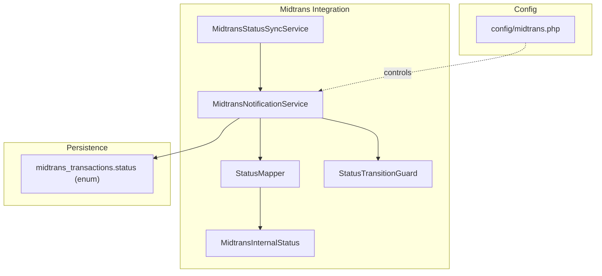
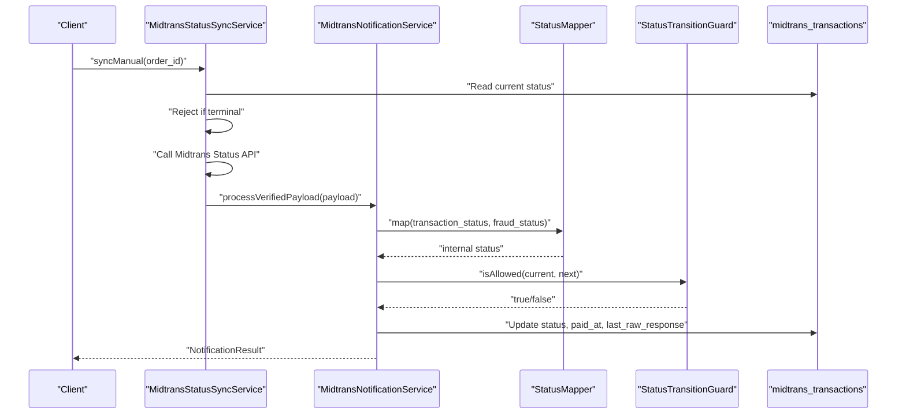
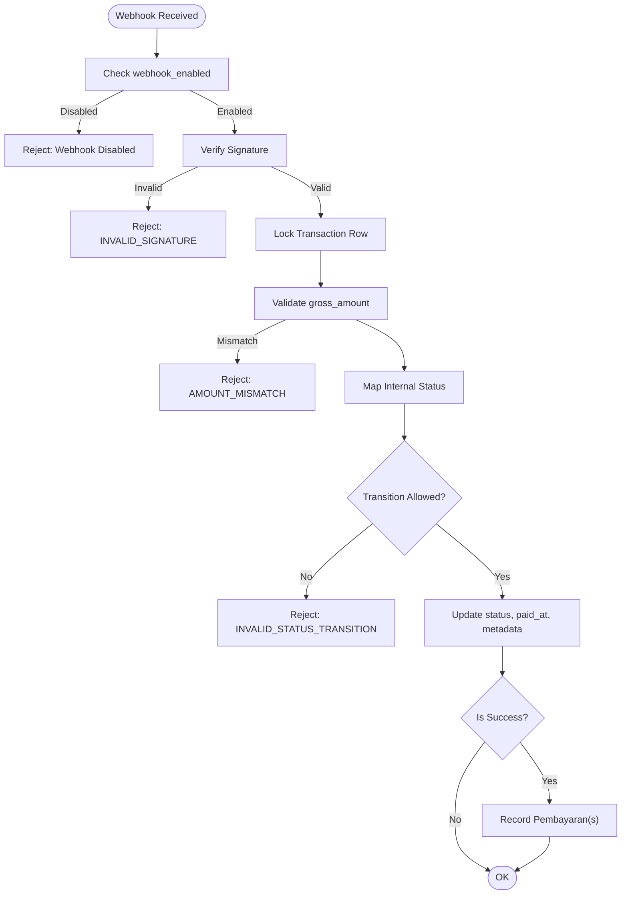
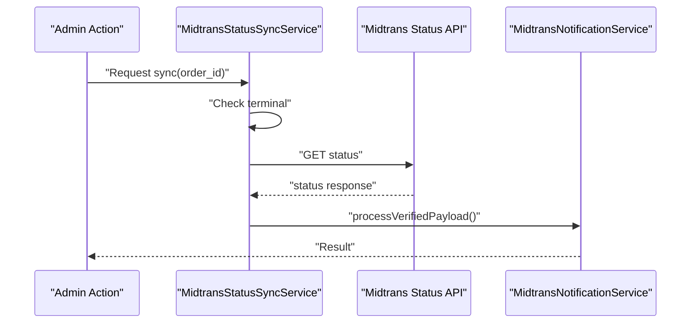
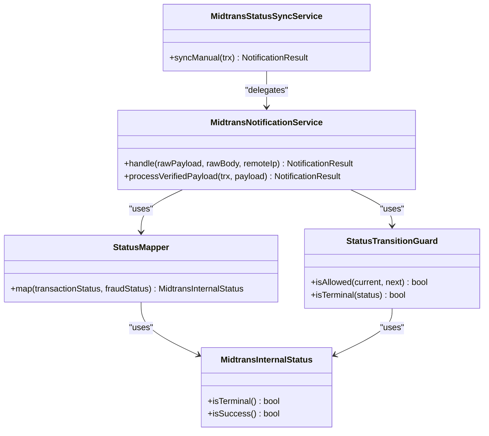

# Status Mapping & State Management

<cite>
**Referenced Files in This Document**
- [StatusMapper.php](file://backend/app/Services/Midtrans/StatusMapper.php)
- [MidtransInternalStatus.php](file://backend/app/Services/Midtrans/MidtransInternalStatus.php)
- [StatusTransitionGuard.php](file://backend/app/Services/Midtrans/StatusTransitionGuard.php)
- [MidtransNotificationService.php](file://backend/app/Services/Midtrans/MidtransNotificationService.php)
- [MidtransStatusSyncService.php](file://backend/app/Services/Midtrans/MidtransStatusSyncService.php)
- [midtrans.php](file://backend/config/midtrans.php)
- [2026_06_22_000001_create_midtrans_transactions_table.php](file://backend/database/migrations/2026_06_22_000001_create_midtrans_transactions_table.php)
- [MidtransTransaction.php](file://backend/app/Models/MidtransTransaction.php)
- [StatusMapperTest.php](file://backend/tests/Unit/Services/Midtrans/StatusMapperTest.php)
- [MidtransInternalStatusTest.php](file://backend/tests/Unit/Services/Midtrans/MidtransInternalStatusTest.php)
</cite>

## Table of Contents
1. [Introduction](#introduction)
2. [Project Structure](#project-structure)
3. [Core Components](#core-components)
4. [Architecture Overview](#architecture-overview)
5. [Detailed Component Analysis](#detailed-component-analysis)
6. [Dependency Analysis](#dependency-analysis)
7. [Performance Considerations](#performance-considerations)
8. [Troubleshooting Guide](#troubleshooting-guide)
9. [Conclusion](#conclusion)
10. [Appendices](#appendices)

## Introduction
This document explains how Midtrans payment statuses are mapped to internal system states and how the application manages status transitions safely and consistently. It focuses on:
- The StatusMapper class that translates Midtrans transaction_status and fraud_status into a single internal status
- The MidtransInternalStatus enum structure and its semantics (terminal, success)
- The StatusTransitionGuard that enforces allowed state transitions
- How webhook and manual sync flows use these components
- Practical guidance for extending mappings, handling unknown statuses, debugging issues, ensuring consistency, and migrating status changes

## Project Structure
The status mapping and state management logic is implemented as cohesive services within the Midtrans integration layer:
- StatusMapper: maps external statuses to internal ones
- MidtransInternalStatus: defines internal states and their properties
- StatusTransitionGuard: validates allowed transitions between internal states
- MidtransNotificationService: orchestrates webhook processing using mapper and guard
- MidtransStatusSyncService: triggers status polling and delegates to notification service
- Configuration and persistence: config/midtrans.php and midtrans_transactions table define environment toggles and persisted status values

**Diagram sources**
- [StatusMapper.php:1-41](file://backend/app/Services/Midtrans/StatusMapper.php#L1-L41)
- [MidtransInternalStatus.php:1-45](file://backend/app/Services/Midtrans/MidtransInternalStatus.php#L1-L45)
- [StatusTransitionGuard.php:1-77](file://backend/app/Services/Midtrans/StatusTransitionGuard.php#L1-L77)
- [MidtransNotificationService.php:1-284](file://backend/app/Services/Midtrans/MidtransNotificationService.php#L1-L284)
- [MidtransStatusSyncService.php:1-73](file://backend/app/Services/Midtrans/MidtransStatusSyncService.php#L1-L73)
- [midtrans.php:1-130](file://backend/config/midtrans.php#L1-L130)
- [2026_06_22_000001_create_midtrans_transactions_table.php:24-34](file://backend/database/migrations/2026_06_22_000001_create_midtrans_transactions_table.php#L24-L34)

**Section sources**
- [StatusMapper.php:1-41](file://backend/app/Services/Midtrans/StatusMapper.php#L1-L41)
- [MidtransInternalStatus.php:1-45](file://backend/app/Services/Midtrans/MidtransInternalStatus.php#L1-L45)
- [StatusTransitionGuard.php:1-77](file://backend/app/Services/Midtrans/StatusTransitionGuard.php#L1-L77)
- [MidtransNotificationService.php:1-284](file://backend/app/Services/Midtrans/MidtransNotificationService.php#L1-L284)
- [MidtransStatusSyncService.php:1-73](file://backend/app/Services/Midtrans/MidtransStatusSyncService.php#L1-L73)
- [midtrans.php:1-130](file://backend/config/midtrans.php#L1-L130)
- [2026_06_22_000001_create_midtrans_transactions_table.php:24-34](file://backend/database/migrations/2026_06_22_000001_create_midtrans_transactions_table.php#L24-L34)

## Core Components
- StatusMapper: Converts Midtrans transaction_status and optional fraud_status into an internal status. Unknown or unexpected combinations default to Pending for safety.
- MidtransInternalStatus: Enumerates supported internal statuses with helper methods:
  - isTerminal(): true for settled/captured/denied/cancelled/expired/failed/refunded; false for pending and partial_refund
  - isSuccess(): true for settlement and capture
- StatusTransitionGuard: Enforces a finite-state machine of allowed transitions from current to next status. Self-transitions are allowed (no-op). Terminal states only allow self-transitions.

Key behaviors:
- Fraud-aware capture mapping: capture + accept → Capture; capture without accept → Deny
- Unknown external statuses map to Pending to avoid breaking workflows
- Transition validation prevents invalid jumps (e.g., deny → settlement)

**Section sources**
- [StatusMapper.php:1-41](file://backend/app/Services/Midtrans/StatusMapper.php#L1-L41)
- [MidtransInternalStatus.php:1-45](file://backend/app/Services/Midtrans/MidtransInternalStatus.php#L1-L45)
- [StatusTransitionGuard.php:1-77](file://backend/app/Services/Midtrans/StatusTransitionGuard.php#L1-L77)

## Architecture Overview
The system uses two entry points to update transaction status:
- Webhook flow: MidtransNotificationService handles inbound notifications, verifies signature, maps status, validates transition, persists updates, and records payments when successful
- Manual sync flow: MidtransStatusSyncService queries Midtrans Status API, logs outbound call, then delegates to the same shared processing path

**Diagram sources**
- [MidtransStatusSyncService.php:25-71](file://backend/app/Services/Midtrans/MidtransStatusSyncService.php#L25-L71)
- [MidtransNotificationService.php:76-150](file://backend/app/Services/Midtrans/MidtransNotificationService.php#L76-L150)
- [StatusMapper.php:23-39](file://backend/app/Services/Midtrans/StatusMapper.php#L23-L39)
- [StatusTransitionGuard.php:62-67](file://backend/app/Services/Midtrans/StatusTransitionGuard.php#L62-L67)
- [2026_06_22_000001_create_midtrans_transactions_table.php:24-34](file://backend/database/migrations/2026_06_22_000001_create_midtrans_transactions_table.php#L24-L34)

## Detailed Component Analysis

### StatusMapper
Responsibilities:
- Map Midtrans transaction_status to internal status
- Apply fraud_status rules for capture outcomes
- Default unknown statuses to Pending

Supported mappings:
- capture + accept → Capture
- capture + challenge/deny/null → Deny
- settlement → Settlement
- pending → Pending
- deny → Deny
- cancel → Cancel
- expire → Expire
- failure → Failure
- refund → Refund
- partial_refund → PartialRefund
- unknown → Pending

Extensibility:
- To add new Midtrans statuses, extend the mapping logic and ensure corresponding internal enum cases exist
- Keep defaults conservative (Pending) to avoid unsafe transitions

**Section sources**
- [StatusMapper.php:1-41](file://backend/app/Services/Midtrans/StatusMapper.php#L1-L41)
- [StatusMapperTest.php:29-53](file://backend/tests/Unit/Services/Midtrans/StatusMapperTest.php#L29-L53)

### MidtransInternalStatus
Structure:
- Backed string enum with lowercase values matching database enum entries
- Methods:
  - isTerminal(): returns true for settled/captured/denied/cancelled/expired/failed/refunded
  - isSuccess(): returns true for settlement and capture

Design notes:
- Values align exactly with the database enum to prevent casting errors
- Helper methods centralize business rules used by guards and UI/logic layers

**Section sources**
- [MidtransInternalStatus.php:1-45](file://backend/app/Services/Midtrans/MidtransInternalStatus.php#L1-L45)
- [MidtransInternalStatusTest.php:10-66](file://backend/tests/Unit/Services/Midtrans/MidtransInternalStatusTest.php#L10-L66)
- [2026_06_22_000001_create_midtrans_transactions_table.php:24-34](file://backend/database/migrations/2026_06_22_000001_create_midtrans_transactions_table.php#L24-L34)

### StatusTransitionGuard
Responsibilities:
- Define allowed transitions T_allowed
- Validate transitions from current to next
- Provide terminal status check via enum method

Allowed transitions summary:
- From pending: {pending, settlement, capture, deny, cancel, expire, failure}
- From settlement/capture: {settlement, capture, refund, partial_refund}
- From partial_refund: {partial_refund}
- From terminal {deny, cancel, expire, failure, refund}: only self

Implementation note:
- Uses a constant map keyed by current status value
- Returns false for any disallowed jump, preventing inconsistent state mutations

**Section sources**
- [StatusTransitionGuard.php:17-57](file://backend/app/Services/Midtrans/StatusTransitionGuard.php#L17-L57)
- [StatusTransitionGuard.php:62-75](file://backend/app/Services/Midtrans/StatusTransitionGuard.php#L62-L75)

### Notification Processing Flow
End-to-end behavior:
- Verify webhook enabled and signature
- Load transaction row with lock-for-update
- Compare gross_amount integrity
- Map external status to internal status
- Validate transition
- Persist updated status, payment_type, last_raw_response, and paid_at when applicable
- Record Pembayaran(s) for success cases (single or batch), including overpayment checks and idempotency

**Diagram sources**
- [MidtransNotificationService.php:31-150](file://backend/app/Services/Midtrans/MidtransNotificationService.php#L31-L150)

**Section sources**
- [MidtransNotificationService.php:31-150](file://backend/app/Services/Midtrans/MidtransNotificationService.php#L31-L150)

### Manual Sync Flow
Behavior:
- If current status is terminal, reject immediate sync
- Call Midtrans Status API
- Log outbound request details
- Delegate to notification service’s verified payload processor

**Diagram sources**
- [MidtransStatusSyncService.php:25-71](file://backend/app/Services/Midtrans/MidtransStatusSyncService.php#L25-L71)
- [MidtransNotificationService.php:76-89](file://backend/app/Services/Midtrans/MidtransNotificationService.php#L76-L89)

**Section sources**
- [MidtransStatusSyncService.php:25-71](file://backend/app/Services/Midtrans/MidtransStatusSyncService.php#L25-L71)

## Dependency Analysis
- StatusMapper depends only on MidtransInternalStatus
- StatusTransitionGuard depends on MidtransInternalStatus
- MidtransNotificationService composes StatusMapper and StatusTransitionGuard
- MidtransStatusSyncService composes client, notification service, log service, and verifier
- Database schema constrains status to the nine internal values

**Diagram sources**
- [StatusMapper.php:1-41](file://backend/app/Services/Midtrans/StatusMapper.php#L1-L41)
- [MidtransInternalStatus.php:1-45](file://backend/app/Services/Midtrans/MidtransInternalStatus.php#L1-L45)
- [StatusTransitionGuard.php:1-77](file://backend/app/Services/Midtrans/StatusTransitionGuard.php#L1-L77)
- [MidtransNotificationService.php:1-284](file://backend/app/Services/Midtrans/MidtransNotificationService.php#L1-L284)
- [MidtransStatusSyncService.php:1-73](file://backend/app/Services/Midtrans/MidtransStatusSyncService.php#L1-L73)

**Section sources**
- [StatusMapper.php:1-41](file://backend/app/Services/Midtrans/StatusMapper.php#L1-L41)
- [MidtransInternalStatus.php:1-45](file://backend/app/Services/Midtrans/MidtransInternalStatus.php#L1-L45)
- [StatusTransitionGuard.php:1-77](file://backend/app/Services/Midtrans/StatusTransitionGuard.php#L1-L77)
- [MidtransNotificationService.php:1-284](file://backend/app/Services/Midtrans/MidtransNotificationService.php#L1-L284)
- [MidtransStatusSyncService.php:1-73](file://backend/app/Services/Midtrans/MidtransStatusSyncService.php#L1-L73)

## Performance Considerations
- Database locking: Notifications lock rows with FOR UPDATE to prevent race conditions during concurrent webhooks
- Idempotency: Payment recording skips if already present for the order
- Minimal computation: Mapping and transition checks are O(1) operations
- Retries: Deadlock retries are applied at the transaction boundary

[No sources needed since this section provides general guidance]

## Troubleshooting Guide
Common issues and diagnostics:
- Invalid signature: Ensure server_key configuration matches Midtrans settings and webhook_enabled is true
- Amount mismatch: Verify gross_amount in payload equals stored amount; compare integer values
- Invalid status transition: Review current vs. requested status; consult allowed transitions
- Unknown external status: Defaults to Pending; investigate upstream Midtrans responses
- Terminal status sync: Manual sync is blocked for terminal statuses; consider historical data reconciliation instead

Debugging steps:
- Inspect last_raw_response stored on the transaction record
- Use manual sync to fetch latest status from Midtrans and observe results
- Confirm database enum values match internal enum values
- Review logs for rejected reasons and payloads

Configuration checkpoints:
- webhook_enabled toggle
- server_key correctness
- finish_url and other operational flags

**Section sources**
- [MidtransNotificationService.php:31-150](file://backend/app/Services/Midtrans/MidtransNotificationService.php#L31-L150)
- [midtrans.php:15-17](file://backend/config/midtrans.php#L15-L17)
- [MidtransTransaction.php:11-42](file://backend/app/Models/MidtransTransaction.php#L11-L42)

## Conclusion
The status mapping and state management layer provides a robust, testable, and extensible mechanism to translate Midtrans statuses into consistent internal states. With explicit fraud handling, strict transition enforcement, and idempotent side effects, the system ensures data integrity and predictable behavior across webhook and manual sync paths. Extending to new statuses requires coordinated updates to the mapper, enum, transition guard, and database schema.

[No sources needed since this section summarizes without analyzing specific files]

## Appendices

### Supported Status Mappings Reference
- capture + accept → Capture
- capture + challenge/deny/null → Deny
- settlement → Settlement
- pending → Pending
- deny → Deny
- cancel → Cancel
- expire → Expire
- failure → Failure
- refund → Refund
- partial_refund → PartialRefund
- unknown → Pending

**Section sources**
- [StatusMapper.php:23-39](file://backend/app/Services/Midtrans/StatusMapper.php#L23-L39)
- [StatusMapperTest.php:29-53](file://backend/tests/Unit/Services/Midtrans/StatusMapperTest.php#L29-L53)

### Adding a New Payment Status
Steps:
1. Add a new case to MidtransInternalStatus with a lowercase string value
2. Extend StatusMapper to map the new external status (and any fraud variants)
3. Update StatusTransitionGuard ALLOWED_TRANSITIONS to include valid transitions
4. Update the database migration to include the new value in the status enum
5. Add unit tests covering mapping, transition validity, and edge cases

**Section sources**
- [MidtransInternalStatus.php:5-15](file://backend/app/Services/Midtrans/MidtransInternalStatus.php#L5-L15)
- [StatusMapper.php:23-39](file://backend/app/Services/Midtrans/StatusMapper.php#L23-L39)
- [StatusTransitionGuard.php:17-57](file://backend/app/Services/Midtrans/StatusTransitionGuard.php#L17-L57)
- [2026_06_22_000001_create_midtrans_transactions_table.php:24-34](file://backend/database/migrations/2026_06_22_000001_create_midtrans_transactions_table.php#L24-L34)

### Migration Strategy for Status Changes
- Prefer additive changes: introduce new statuses rather than renaming existing ones
- Backward compatibility: keep old enum values until all consumers are migrated
- Data migration script: reconcile legacy values to new ones where necessary
- Feature flag: gate new behavior behind a configuration toggle if needed
- Rollback plan: preserve ability to revert migrations and data changes

**Section sources**
- [2026_06_22_000001_create_midtrans_transactions_table.php:24-34](file://backend/database/migrations/2026_06_22_000001_create_midtrans_transactions_table.php#L24-L34)
- [midtrans.php:15-17](file://backend/config/midtrans.php#L15-L17)