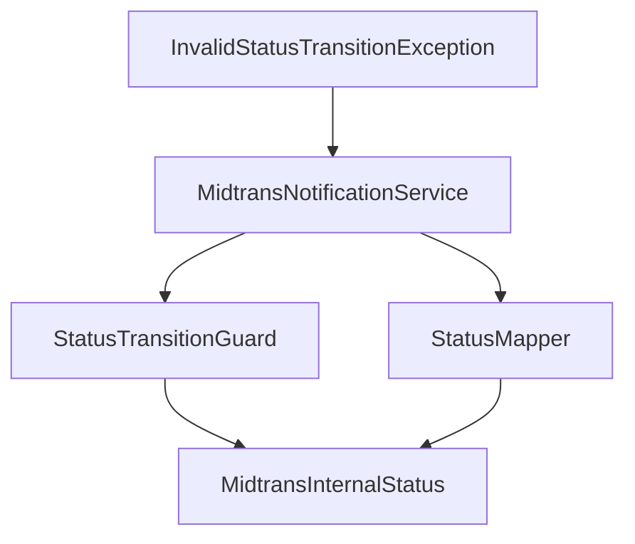
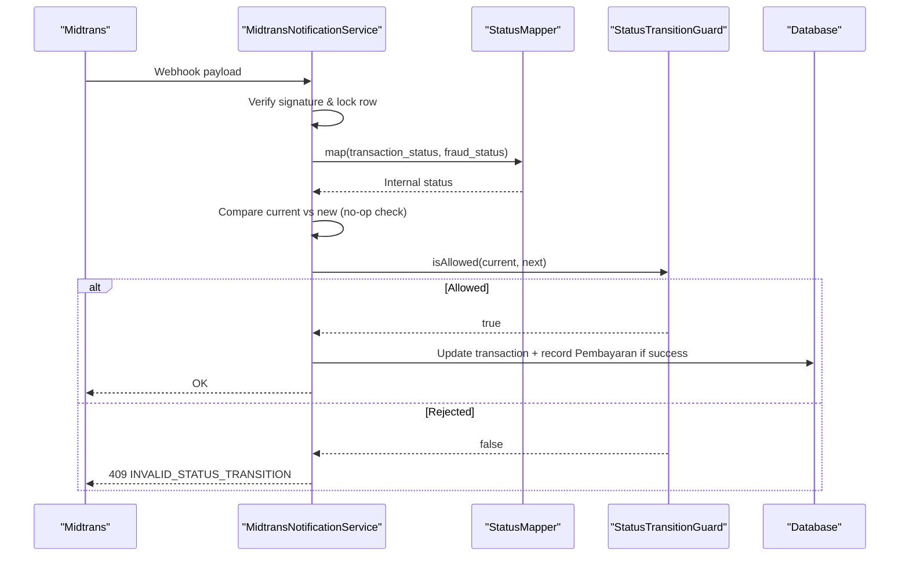
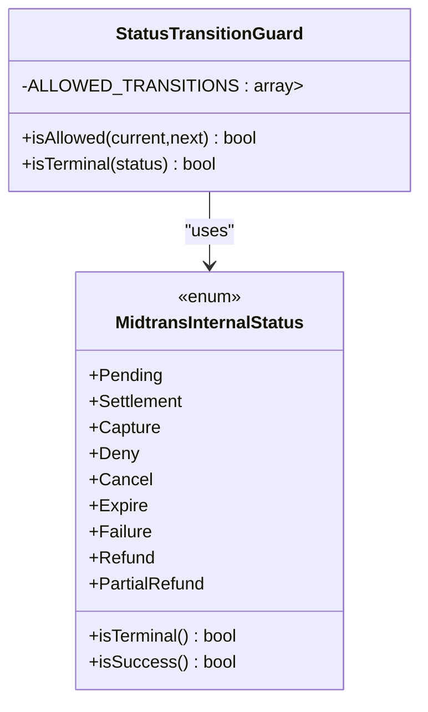
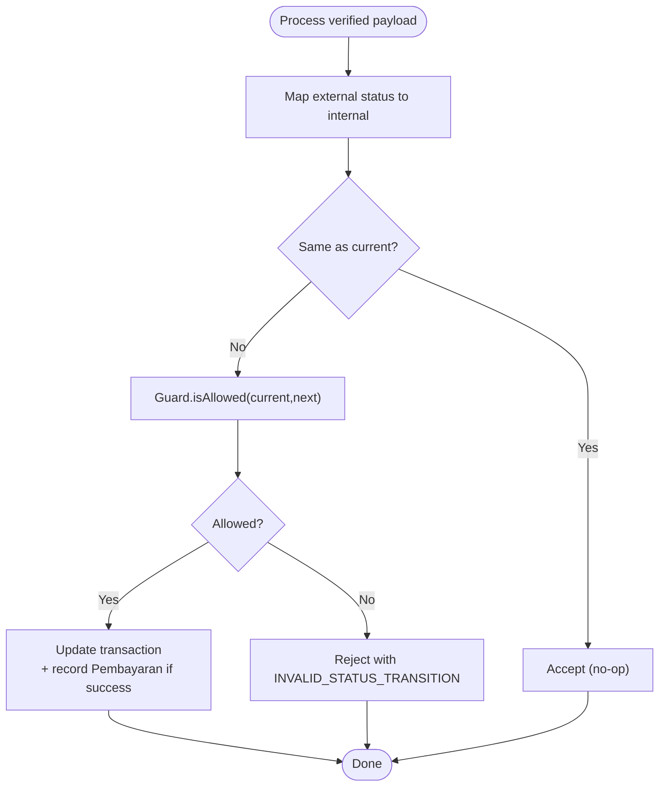
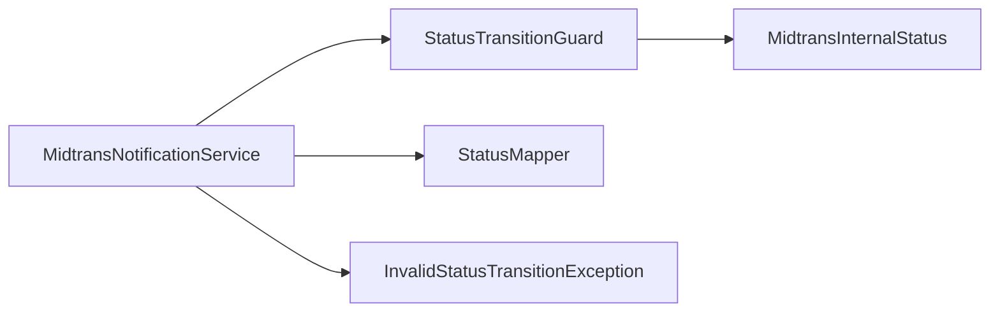

# Status Transition Guard

<cite>
**Referenced Files in This Document**
- [StatusTransitionGuard.php](file://backend/app/Services/Midtrans/StatusTransitionGuard.php)
- [MidtransInternalStatus.php](file://backend/app/Services/Midtrans/MidtransInternalStatus.php)
- [StatusMapper.php](file://backend/app/Services/Midtrans/StatusMapper.php)
- [MidtransNotificationService.php](file://backend/app/Services/Midtrans/MidtransNotificationService.php)
- [InvalidStatusTransitionException.php](file://backend/app/Exceptions/Midtrans/InvalidStatusTransitionException.php)
- [MidtransException.php](file://backend/app/Exceptions/Midtrans/MidtransException.php)
- [StatusTransitionGuardTest.php](file://backend/tests/Unit\Services\Midtrans\StatusTransitionGuardTest.php)
- [design.md](file://.kiro/specs/midtrans-payment-gateway/design.md)
</cite>

## Table of Contents
1. [Introduction](#introduction)
2. [Project Structure](#project-structure)
3. [Core Components](#core-components)
4. [Architecture Overview](#architecture-overview)
5. [Detailed Component Analysis](#detailed-component-analysis)
6. [Dependency Analysis](#dependency-analysis)
7. [Performance Considerations](#performance-considerations)
8. [Troubleshooting Guide](#troubleshooting-guide)
9. [Conclusion](#conclusion)
10. [Appendices](#appendices)

## Introduction
This document explains the status transition guard mechanism that enforces valid state changes for Midtrans transactions. It focuses on the StatusTransitionGuard class, the allowed transitions, validation rules, and how business logic is enforced to maintain transaction integrity. It also covers practical configuration examples, handling invalid transitions, debugging strategies, maintenance guidance, testing approaches, and performance considerations for high-volume processing.

## Project Structure
The transition guard is part of a small set of focused components:
- StatusTransitionGuard: Encodes the allowed transitions and terminal checks.
- MidtransInternalStatus: Enumerates internal statuses and provides helper predicates (terminal, success).
- StatusMapper: Maps external Midtrans statuses to internal statuses.
- MidtransNotificationService: Orchestrates webhook/sync processing and applies the guard before persisting updates.
- InvalidStatusTransitionException: Domain exception used when an invalid transition is detected.
- Tests: Unit tests covering all allowed and rejected transitions and terminal behavior.

**Diagram sources**
- [StatusTransitionGuard.php:1-77](file://backend/app/Services/Midtrans/StatusTransitionGuard.php#L1-L77)
- [MidtransInternalStatus.php:1-45](file://backend/app/Services/Midtrans/MidtransInternalStatus.php#L1-L45)
- [StatusMapper.php:1-41](file://backend/app/Services/Midtrans/StatusMapper.php#L1-L41)
- [MidtransNotificationService.php:1-284](file://backend/app/Services/Midtrans/MidtransNotificationService.php#L1-L284)
- [InvalidStatusTransitionException.php:1-15](file://backend/app/Exceptions/Midtrans/InvalidStatusTransitionException.php#L1-L15)

**Section sources**
- [StatusTransitionGuard.php:1-77](file://backend/app/Services/Midtrans/StatusTransitionGuard.php#L1-L77)
- [MidtransInternalStatus.php:1-45](file://backend/app/Services/Midtrans/MidtransInternalStatus.php#L1-L45)
- [StatusMapper.php:1-41](file://backend/app/Services/Midtrans/StatusMapper.php#L1-L41)
- [MidtransNotificationService.php:1-284](file://backend/app/Services/Midtrans/MidtransNotificationService.php#L1-L284)
- [InvalidStatusTransitionException.php:1-15](file://backend/app/Exceptions/Midtrans/InvalidStatusTransitionException.php#L1-L15)

## Core Components
- StatusTransitionGuard
  - Defines ALLOWED_TRANSITIONS mapping current status to allowed next statuses.
  - Provides isAllowed(current, next) to validate transitions.
  - Provides isTerminal(status) by delegating to MidtransInternalStatus::isTerminal().
- MidtransInternalStatus
  - Enumerates all internal statuses.
  - Implements isTerminal() and isSuccess() helpers.
- StatusMapper
  - Maps external transaction_status and fraud_status to internal statuses.
- MidtransNotificationService
  - Applies the guard after mapping and before updating transaction state.
  - Returns a rejected result with INVALID_STATUS_TRANSITION when guard fails.
- InvalidStatusTransitionException
  - Carries errorCode and httpStatus for consistent error responses.

Key behaviors:
- No-op transitions (current == next) are accepted without side effects.
- Terminal states only allow self-transitions except settlement/capture can move to refund or partial_refund.
- Any other transition is rejected.

**Section sources**
- [StatusTransitionGuard.php:1-77](file://backend/app/Services/Midtrans/StatusTransitionGuard.php#L1-L77)
- [MidtransInternalStatus.php:1-45](file://backend/app/Services/Midtrans/MidtransInternalStatus.php#L1-L45)
- [StatusMapper.php:1-41](file://backend/app/Services/Midtrans/StatusMapper.php#L1-L41)
- [MidtransNotificationService.php:96-150](file://backend/app/Services/Midtrans/MidtransNotificationService.php#L96-L150)
- [InvalidStatusTransitionException.php:1-15](file://backend/app/Exceptions/Midtrans/InvalidStatusTransitionException.php#L1-L15)

## Architecture Overview
The guard sits between status mapping and persistence. The notification service orchestrates signature verification, DB locking, amount checks, mapping, guard validation, and final update.

**Diagram sources**
- [MidtransNotificationService.php:31-150](file://backend/app/Services/Midtrans/MidtransNotificationService.php#L31-L150)
- [StatusMapper.php:23-39](file://backend/app/Services/Midtrans/StatusMapper.php#L23-L39)
- [StatusTransitionGuard.php:62-67](file://backend/app/Services/Midtrans/StatusTransitionGuard.php#L62-L67)

## Detailed Component Analysis

### StatusTransitionGuard
Responsibilities:
- Encode the complete set of allowed transitions.
- Validate transitions deterministically.
- Expose terminal status detection.

Implementation highlights:
- ALLOWED_TRANSITIONS maps each current status to its permitted next statuses.
- isAllowed performs a strict lookup and membership test.
- isTerminal delegates to MidtransInternalStatus::isTerminal().

**Diagram sources**
- [StatusTransitionGuard.php:17-57](file://backend/app/Services/Midtrans/StatusTransitionGuard.php#L17-L57)
- [StatusTransitionGuard.php:62-75](file://backend/app/Services/Midtrans/StatusTransitionGuard.php#L62-L75)
- [MidtransInternalStatus.php:5-44](file://backend/app/Services/Midtrans/MidtransInternalStatus.php#L5-L44)

**Section sources**
- [StatusTransitionGuard.php:1-77](file://backend/app/Services/Midtrans/StatusTransitionGuard.php#L1-L77)
- [MidtransInternalStatus.php:1-45](file://backend/app/Services/Midtrans/MidtransInternalStatus.php#L1-L45)

### Allowed Transitions and Rules
Rules summary:
- From pending: can go to pending (no-op), settlement, capture, deny, cancel, expire, failure.
- From settlement/capture: can go to self, refund, partial_refund; settlement/capture may transition to each other.
- From partial_refund: only self (no-op).
- From terminal states deny, cancel, expire, failure, refund: only self (no-op).

These rules ensure:
- Refunds cannot occur directly from pending.
- Terminal states cannot revert to non-terminal states.
- Partial refunds are idempotent but do not reopen payment flows.

Validation flow:
- If current == next → no-op, accept.
- Else if isAllowed(current, next) → accept.
- Else → reject with INVALID_STATUS_TRANSITION.

**Section sources**
- [StatusTransitionGuard.php:17-57](file://backend/app/Services/Midtrans/StatusTransitionGuard.php#L17-L57)
- [StatusTransitionGuard.php:62-67](file://backend/app/Services/Midtrans/StatusTransitionGuard.php#L62-L67)
- [design.md:481-511](file://.kiro/specs/midtrans-payment-gateway/design.md#L481-L511)

### Integration in Notification Processing
The guard is applied within the shared processing path used by both webhooks and manual sync:
- Map external status to internal status.
- Check for no-op (same status).
- Validate via guard.
- Persist updates only if allowed.
- On success, create Pembayaran records idempotently.

**Diagram sources**
- [MidtransNotificationService.php:96-150](file://backend/app/Services/Midtrans/MidtransNotificationService.php#L96-L150)
- [StatusMapper.php:23-39](file://backend/app/Services/Midtrans/StatusMapper.php#L23-L39)
- [StatusTransitionGuard.php:62-67](file://backend/app/Services/Midtrans/StatusTransitionGuard.php#L62-L67)

**Section sources**
- [MidtransNotificationService.php:96-150](file://backend/app/Services/Midtrans/MidtransNotificationService.php#L96-L150)

### Error Handling and Exceptions
- When a transition is invalid, the notification service returns a rejected result with HTTP 409 and code INVALID_STATUS_TRANSITION.
- An exception type exists for this domain error, carrying errorCode and httpStatus for consistent rendering.

Operational effect:
- Transaction status remains unchanged.
- No Pembayaran is created.
- Logs remain intact for auditability.

**Section sources**
- [MidtransNotificationService.php:127-129](file://backend/app/Services/Midtrans/MidtransNotificationService.php#L127-L129)
- [InvalidStatusTransitionException.php:1-15](file://backend/app/Exceptions/Midtrans/InvalidStatusTransitionException.php#L1-L15)
- [MidtransException.php:1-17](file://backend/app/Exceptions/Midtrans/MidtransException.php#L1-L17)

### Testing Strategy
- Unit tests cover all allowed and rejected transitions using data providers.
- Terminal behavior is explicitly tested for both terminal and non-terminal statuses.
- Property-based testing guidance is documented in design specs for exhaustive coverage across all 81 status pairs.

Practical tips:
- Add new transitions by updating ALLOWED_TRANSITIONS and corresponding tests.
- Use property tests to assert completeness over the full Cartesian product of statuses.

**Section sources**
- [StatusTransitionGuardTest.php:1-141](file://backend/tests/Unit\Services\Midtrans\StatusTransitionGuardTest.php#L1-L141)
- [design.md:694-719](file://.kiro/specs/midtrans-payment-gateway/design.md#L694-L719)

## Dependency Analysis
Relationships:
- StatusTransitionGuard depends on MidtransInternalStatus for terminal checks.
- MidtransNotificationService depends on StatusMapper and StatusTransitionGuard.
- InvalidStatusTransitionException is used by the notification service to signal invalid transitions.

**Diagram sources**
- [StatusTransitionGuard.php:1-77](file://backend/app/Services/Midtrans/StatusTransitionGuard.php#L1-L77)
- [MidtransInternalStatus.php:1-45](file://backend/app/Services/Midtrans/MidtransInternalStatus.php#L1-L45)
- [StatusMapper.php:1-41](file://backend/app/Services/Midtrans/StatusMapper.php#L1-L41)
- [MidtransNotificationService.php:1-284](file://backend/app/Services/Midtrans/MidtransNotificationService.php#L1-L284)
- [InvalidStatusTransitionException.php:1-15](file://backend/app/Exceptions/Midtrans/InvalidStatusTransitionException.php#L1-L15)

**Section sources**
- [StatusTransitionGuard.php:1-77](file://backend/app/Services/Midtrans/StatusTransitionGuard.php#L1-L77)
- [MidtransNotificationService.php:1-284](file://backend/app/Services/Midtrans/MidtransNotificationService.php#L1-L284)

## Performance Considerations
- Lookup complexity: O(1) per transition due to direct array access and membership check.
- Minimal allocations: Uses constants and enums; negligible overhead per request.
- Concurrency safety: Guard runs inside a DB transaction with FOR UPDATE locks, preventing race conditions during concurrent webhook/sync calls.
- Idempotency: No-op transitions avoid unnecessary writes; successful transitions rely on idempotent Pembayaran creation.

Recommendations:
- Keep ALLOWED_TRANSITIONS compact and centralized to minimize branching.
- Avoid heavy computations in hot paths; guard already adheres to this.
- Monitor logs for repeated INVALID_STATUS_TRANSITION rejections to detect upstream issues.

[No sources needed since this section provides general guidance]

## Troubleshooting Guide
Common symptoms:
- Repeated 409 INVALID_STATUS_TRANSITION responses for a given order_id.
- Stuck transactions not progressing despite expected webhook events.

Diagnostic steps:
- Inspect last_raw_response to see the external status and fraud_status used by the mapper.
- Confirm current status in midtrans_transactions and compare with mapped target status.
- Review unit tests for the specific pair to understand whether it should be allowed.
- Check logs around the rejection to verify signature validity and amount checks passed.

Remediation:
- If a legitimate transition is missing, update ALLOWED_TRANSITIONS and add corresponding tests.
- If upstream mapping is incorrect, adjust StatusMapper to reflect correct business semantics.
- For transient network issues, rely on retry strategy and manual sync to reconcile.

**Section sources**
- [MidtransNotificationService.php:96-150](file://backend/app/Services/Midtrans/MidtransNotificationService.php#L96-L150)
- [StatusTransitionGuardTest.php:72-104](file://backend/tests/Unit\Services\Midtrans\StatusTransitionGuardTest.php#L72-L104)

## Conclusion
The StatusTransitionGuard enforces a precise, auditable state machine for Midtrans transactions. By centralizing transition rules, integrating tightly with status mapping and notification processing, and pairing with comprehensive tests, it ensures transaction integrity under high concurrency and volume. Maintenance is straightforward: extend ALLOWED_TRANSITIONS alongside tests and leverage property-based tests for robustness.

[No sources needed since this section summarizes without analyzing specific files]

## Appendices

### Practical Examples of Transition Rule Configurations
- Allow settlement from pending: covered by ALLOWED_TRANSITIONS['pending'] includes 'settlement'.
- Allow refund from settlement/capture: covered by ALLOWED_TRANSITIONS['settlement'] and ['capture'].
- Disallow refund directly from pending: absent from ALLOWED_TRANSITIONS['pending'].

**Section sources**
- [StatusTransitionGuard.php:17-57](file://backend/app/Services/Midtrans/StatusTransitionGuard.php#L17-L57)

### Handling Invalid Transitions
- The notification service rejects with 409 INVALID_STATUS_TRANSITION and leaves transaction state unchanged.
- Use InvalidStatusTransitionException for consistent error modeling where appropriate.

**Section sources**
- [MidtransNotificationService.php:127-129](file://backend/app/Services/Midtrans/MidtransNotificationService.php#L127-L129)
- [InvalidStatusTransitionException.php:1-15](file://backend/app/Exceptions/Midtrans/InvalidStatusTransitionException.php#L1-L15)

### Debugging State Machine Issues
- Reproduce with minimal payloads and confirm mapping via StatusMapper.
- Assert against known allowed/rejected pairs from tests.
- Use manual sync to fetch authoritative status and reconcile differences.

**Section sources**
- [StatusTransitionGuardTest.php:1-141](file://backend/tests/Unit\Services\Midtrans\StatusTransitionGuardTest.php#L1-L141)
- [design.md:481-511](file://.kiro/specs/midtrans-payment-gateway/design.md#L481-L511)

### Transition Rule Maintenance Checklist
- Update ALLOWED_TRANSITIONS for any new business rule.
- Extend unit tests with explicit cases for new allowed/rejected pairs.
- Consider adding property tests to cover all 81 pairs exhaustively.
- Validate integration in notification flow with sample payloads.

**Section sources**
- [StatusTransitionGuard.php:17-57](file://backend/app/Services/Midtrans/StatusTransitionGuard.php#L17-L57)
- [StatusTransitionGuardTest.php:1-141](file://backend/tests/Unit\Services\Midtrans\StatusTransitionGuardTest.php#L1-L141)
- [design.md:694-719](file://.kiro/specs/midtrans-payment-gateway/design.md#L694-L719)