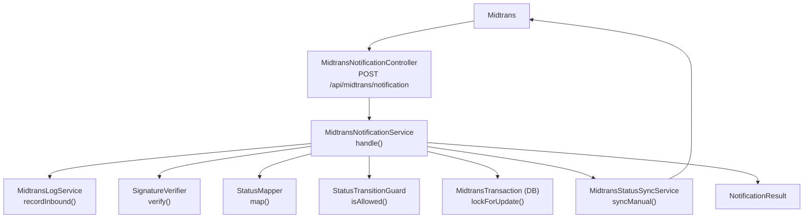
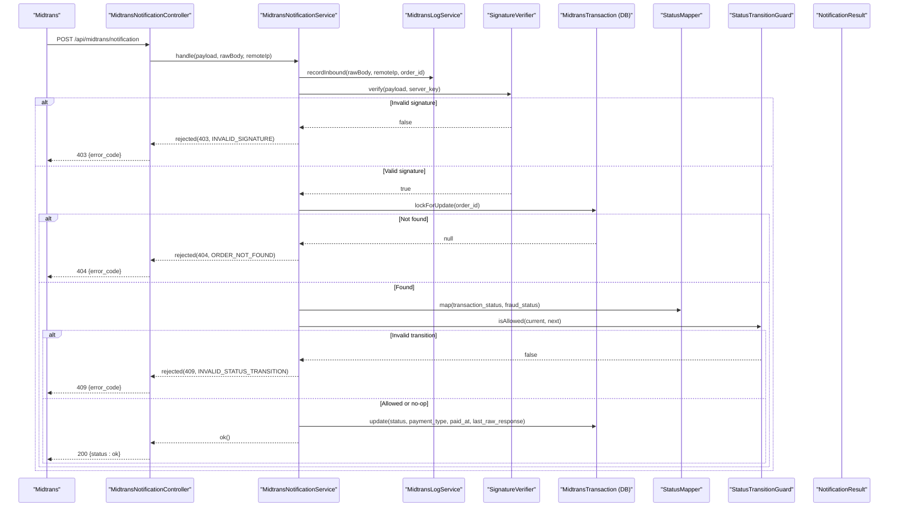
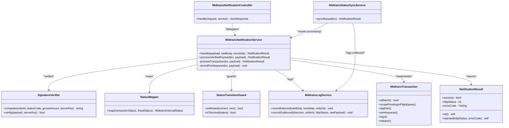

# Webhook Processing & Status Synchronization

<cite>
**Referenced Files in This Document**
- [MidtransNotificationController.php](file://backend/app/Http/Controllers/MidtransNotificationController.php)
- [MidtransNotificationService.php](file://backend/app/Services/Midtrans/MidtransNotificationService.php)
- [SignatureVerifier.php](file://backend/app/Services/Midtrans/SignatureVerifier.php)
- [StatusMapper.php](file://backend/app/Services/Midtrans/StatusMapper.php)
- [StatusTransitionGuard.php](file://backend/app/Services/Midtrans/StatusTransitionGuard.php)
- [MidtransInternalStatus.php](file://backend/app/Services/Midtrans/MidtransInternalStatus.php)
- [MidtransStatusSyncService.php](file://backend/app/Services/Midtrans/MidtransStatusSyncService.php)
- [MidtransLogService.php](file://backend/app/Services/Midtrans/MidtransLogService.php)
- [MidtransTransaction.php](file://backend/app/Models/MidtransTransaction.php)
- [midtrans.php](file://backend/config/midtrans.php)
- [NotificationResult.php](file://backend/app/Services/Midtrans/Dto/NotificationResult.php)
- [InvalidSignatureException.php](file://backend/app/Exceptions/Midtrans/InvalidSignatureException.php)
- [InvalidStatusTransitionException.php](file://backend/app/Exceptions/Midtrans/InvalidStatusTransitionException.php)
- [WebhookDisabledException.php](file://backend/app/Exceptions/Midtrans/WebhookDisabledException.php)
</cite>

## Table of Contents
1. [Introduction](#introduction)
2. [Project Structure](#project-structure)
3. [Core Components](#core-components)
4. [Architecture Overview](#architecture-overview)
5. [Detailed Component Analysis](#detailed-component-analysis)
6. [Dependency Analysis](#dependency-analysis)
7. [Performance Considerations](#performance-considerations)
8. [Troubleshooting Guide](#troubleshooting-guide)
9. [Conclusion](#conclusion)
10. [Appendices](#appendices)

## Introduction
This document explains the Midtrans webhook processing and status synchronization mechanisms implemented in the application. It covers:
- The webhook notification service architecture and request flow
- Signature verification for security
- Mapping between Midtrans statuses and internal states
- Status transition guard to prevent invalid state changes
- Real-time status synchronization via polling
- Webhook retry and idempotency considerations
- Practical examples for handling events, validating signatures, updating transaction statuses, and debugging delivery issues
- Security considerations, error handling strategies, and monitoring approaches for production

## Project Structure
The webhook and sync logic is implemented as a layered set of components:
- HTTP controller receives webhook requests
- Service orchestrates signature verification, DB locking, mapping, transitions, and side effects
- Supporting services handle logging, status mapping, transition guards, and external API calls
- Configuration controls feature toggles and credentials
- DTOs and exceptions standardize responses and errors

**Diagram sources**
- [MidtransNotificationController.php:1-34](file://backend/app/Http/Controllers/MidtransNotificationController.php#L1-L34)
- [MidtransNotificationService.php:1-150](file://backend/app/Services/Midtrans/MidtransNotificationService.php#L1-L150)
- [SignatureVerifier.php:1-34](file://backend/app/Services/Midtrans/SignatureVerifier.php#L1-L34)
- [StatusMapper.php:1-41](file://backend/app/Services/Midtrans/StatusMapper.php#L1-L41)
- [StatusTransitionGuard.php:1-77](file://backend/app/Services/Midtrans/StatusTransitionGuard.php#L1-L77)
- [MidtransStatusSyncService.php:1-73](file://backend/app/Services/Midtrans/MidtransStatusSyncService.php#L1-L73)
- [MidtransLogService.php:1-109](file://backend/app/Services/Midtrans/MidtransLogService.php#L1-L109)
- [MidtransTransaction.php:1-85](file://backend/app/Models/MidtransTransaction.php#L1-L85)
- [NotificationResult.php:1-29](file://backend/app/Services/Midtrans/Dto/NotificationResult.php#L1-L29)

**Section sources**
- [MidtransNotificationController.php:1-34](file://backend/app/Http/Controllers/MidtransNotificationController.php#L1-L34)
- [MidtransNotificationService.php:1-150](file://backend/app/Services/Midtrans/MidtransNotificationService.php#L1-L150)
- [midtrans.php:1-130](file://backend/config/midtrans.php#L1-L130)

## Core Components
- MidtransNotificationController: Entry point for webhook POST; delegates to service and returns standardized JSON responses.
- MidtransNotificationService: Orchestrates inbound webhook processing, including configuration checks, logging, signature verification, DB locking, amount validation, status mapping, transition guard, updates, and payment recording.
- SignatureVerifier: Computes and verifies HMAC-like signature using SHA-512 with constant-time comparison.
- StatusMapper: Maps Midtrans transaction_status and fraud_status to internal enum values.
- StatusTransitionGuard: Enforces allowed state transitions and terminal status semantics.
- MidtransStatusSyncService: Polls Midtrans Status API for non-terminal transactions and reuses shared processing logic.
- MidtransLogService: Records inbound/outbound logs with sensitive data masking and safety net checks.
- MidtransTransaction: Eloquent model representing Midtrans orders, with batch support and relations.
- NotificationResult: Immutable result object used by controllers and services to communicate success/failure and HTTP codes.
- Exceptions: Typed exceptions for invalid signature, invalid transition, and disabled webhooks.

**Section sources**
- [MidtransNotificationController.php:1-34](file://backend/app/Http/Controllers/MidtransNotificationController.php#L1-L34)
- [MidtransNotificationService.php:1-150](file://backend/app/Services/Midtrans/MidtransNotificationService.php#L1-L150)
- [SignatureVerifier.php:1-34](file://backend/app/Services/Midtrans/SignatureVerifier.php#L1-L34)
- [StatusMapper.php:1-41](file://backend/app/Services/Midtrans/StatusMapper.php#L1-L41)
- [StatusTransitionGuard.php:1-77](file://backend/app/Services/Midtrans/StatusTransitionGuard.php#L1-L77)
- [MidtransStatusSyncService.php:1-73](file://backend/app/Services/Midtrans/MidtransStatusSyncService.php#L1-L73)
- [MidtransLogService.php:1-109](file://backend/app/Services/Midtrans/MidtransLogService.php#L1-L109)
- [MidtransTransaction.php:1-85](file://backend/app/Models/MidtransTransaction.php#L1-L85)
- [NotificationResult.php:1-29](file://backend/app/Services/Midtrans/Dto/NotificationResult.php#L1-L29)
- [InvalidSignatureException.php:1-15](file://backend/app/Exceptions/Midtrans/InvalidSignatureException.php#L1-L15)
- [InvalidStatusTransitionException.php:1-15](file://backend/app/Exceptions/Midtrans/InvalidStatusTransitionException.php#L1-L15)
- [WebhookDisabledException.php:1-15](file://backend/app/Exceptions/Midtrans/WebhookDisabledException.php#L1-L15)

## Architecture Overview
End-to-end flows for webhook and manual sync are shown below.

**Diagram sources**
- [MidtransNotificationController.php:1-34](file://backend/app/Http/Controllers/MidtransNotificationController.php#L1-L34)
- [MidtransNotificationService.php:1-150](file://backend/app/Services/Midtrans/MidtransNotificationService.php#L1-L150)
- [SignatureVerifier.php:1-34](file://backend/app/Services/Midtrans/SignatureVerifier.php#L1-L34)
- [StatusMapper.php:1-41](file://backend/app/Services/Midtrans/StatusMapper.php#L1-L41)
- [StatusTransitionGuard.php:1-77](file://backend/app/Services/Midtrans/StatusTransitionGuard.php#L1-L77)
- [MidtransTransaction.php:1-85](file://backend/app/Models/MidtransTransaction.php#L1-L85)
- [NotificationResult.php:1-29](file://backend/app/Services/Midtrans/Dto/NotificationResult.php#L1-L29)

## Detailed Component Analysis

### Webhook Controller
- Receives POST /api/midtrans/notification
- Parses raw body and extracts IP
- Delegates to service and maps result to HTTP response
- Does not gate on global enabled flag; service enforces webhook_enabled

**Section sources**
- [MidtransNotificationController.php:1-34](file://backend/app/Http/Controllers/MidtransNotificationController.php#L1-L34)

### Webhook Service
Key responsibilities:
- Feature toggle check: throws specific exception if webhook is disabled
- Inbound logging before any processing
- Signature verification using configured server key
- Database transaction with deadlock retries and row-level locking
- Amount integrity check against stored gross_amount
- Status mapping and transition guard enforcement
- Update transaction metadata and settlement time when applicable
- Record Pembayaran(s) for successful outcomes (single and batch), with overpayment blocking and idempotency

Idempotency and concurrency:
- Uses FOR UPDATE locks per order_id
- Re-tries DB transaction on deadlocks
- Skips duplicate Pembayaran creation based on midtrans_order_id

Batch handling:
- Creates one Pembayaran per batch item
- Updates tagihan tmp and status accordingly
- Ensures only first row carries midtrans_order_id due to unique constraint

Error signaling:
- Returns structured NotificationResult with appropriate HTTP codes and error codes
- Throws typed exceptions for business rules (e.g., overpayment blocked)

**Section sources**
- [MidtransNotificationService.php:1-284](file://backend/app/Services/Midtrans/MidtransNotificationService.php#L1-L284)
- [NotificationResult.php:1-29](file://backend/app/Services/Midtrans/Dto/NotificationResult.php#L1-L29)
- [WebhookDisabledException.php:1-15](file://backend/app/Exceptions/Midtrans/WebhookDisabledException.php#L1-L15)

### Signature Verification
- Computes expected signature using SHA-512 over concatenated fields and server key
- Verifies incoming signature_key using constant-time comparison to prevent timing attacks

Security notes:
- Server key must be kept secret and never exposed in logs or responses
- Logging service masks sensitive keys and includes a safety net to drop logs if masking fails

**Section sources**
- [SignatureVerifier.php:1-34](file://backend/app/Services/Midtrans/SignatureVerifier.php#L1-L34)
- [MidtransLogService.php:1-109](file://backend/app/Services/Midtrans/MidtransLogService.php#L1-L109)
- [InvalidSignatureException.php:1-15](file://backend/app/Exceptions/Midtrans/InvalidSignatureException.php#L1-L15)

### Status Mapping
Maps Midtrans transaction_status and optional fraud_status to internal enum:
- capture + accept → Capture
- settlement → Settlement
- pending → Pending
- deny/cancel/expire/failure/refund/partial_refund mapped accordingly
- capture without fraud accept → Deny

**Section sources**
- [StatusMapper.php:1-41](file://backend/app/Services/Midtrans/StatusMapper.php#L1-L41)
- [MidtransInternalStatus.php:1-45](file://backend/app/Services/Midtrans/MidtransInternalStatus.php#L1-L45)

### Status Transition Guard
Enforces allowed transitions:
- From pending: can move to multiple non-terminal states or stay pending
- From settlement/capture: can remain or move to refund/partial_refund
- Terminal states (deny/cancel/expire/failure/refund): no further transitions except where explicitly allowed
- No-op transitions (same current and next) are accepted

**Section sources**
- [StatusTransitionGuard.php:1-77](file://backend/app/Services/Midtrans/StatusTransitionGuard.php#L1-L77)
- [InvalidStatusTransitionException.php:1-15](file://backend/app/Exceptions/Midtrans/InvalidStatusTransitionException.php#L1-L15)

### Real-time Status Synchronization
- Manual sync triggers an outbound call to Midtrans Status API for non-terminal transactions
- Logs outbound payload with masked sensitive fields
- Synthesizes a webhook-shaped payload and delegates to the same processing pipeline via processVerifiedPayload
- Prevents redundant calls for terminal transactions

**Section sources**
- [MidtransStatusSyncService.php:1-73](file://backend/app/Services/Midtrans/MidtransStatusSyncService.php#L1-L73)
- [MidtransLogService.php:1-109](file://backend/app/Services/Midtrans/MidtransLogService.php#L1-L109)

### Data Models and Relationships
- MidtransTransaction stores order details, amounts, timestamps, batch items, and links to related entities
- Supports batch payments and scopes for pending in-flight transactions
- Relations include tagihan, pembayaran, logs, and initiator user

**Section sources**
- [MidtransTransaction.php:1-85](file://backend/app/Models/MidtransTransaction.php#L1-L85)

### Configuration
- Feature flags: enabled, webhook_enabled
- Credentials: server_key, client_key, merchant_id
- Transaction settings: fees, minimum amount, expiry hours
- Order ID prefix and retention policy for logs
- Finish URL for Snap callback

**Section sources**
- [midtrans.php:1-130](file://backend/config/midtrans.php#L1-L130)

## Dependency Analysis
High-level dependencies among core components:

**Diagram sources**
- [MidtransNotificationController.php:1-34](file://backend/app/Http/Controllers/MidtransNotificationController.php#L1-L34)
- [MidtransNotificationService.php:1-284](file://backend/app/Services/Midtrans/MidtransNotificationService.php#L1-L284)
- [SignatureVerifier.php:1-34](file://backend/app/Services/Midtrans/SignatureVerifier.php#L1-L34)
- [StatusMapper.php:1-41](file://backend/app/Services/Midtrans/StatusMapper.php#L1-L41)
- [StatusTransitionGuard.php:1-77](file://backend/app/Services/Midtrans/StatusTransitionGuard.php#L1-L77)
- [MidtransStatusSyncService.php:1-73](file://backend/app/Services/Midtrans/MidtransStatusSyncService.php#L1-L73)
- [MidtransLogService.php:1-109](file://backend/app/Services/Midtrans/MidtransLogService.php#L1-L109)
- [MidtransTransaction.php:1-85](file://backend/app/Models/MidtransTransaction.php#L1-L85)
- [NotificationResult.php:1-29](file://backend/app/Services/Midtrans/Dto/NotificationResult.php#L1-L29)

**Section sources**
- [MidtransNotificationService.php:1-284](file://backend/app/Services/Midtrans/MidtransNotificationService.php#L1-L284)
- [MidtransStatusSyncService.php:1-73](file://backend/app/Services/Midtrans/MidtransStatusSyncService.php#L1-L73)

## Performance Considerations
- Row-level locking (FOR UPDATE) prevents race conditions but may increase contention; ensure indexes on order_id and related lookup columns
- Deadlock retries reduce failure rates under high concurrency
- Avoid heavy I/O inside critical sections; logging is isolated and safe
- Batch processing creates multiple rows; consider batching inserts if volume grows
- Use queues for event dispatching (e.g., PembayaranRecorded) to keep webhook latency low

[No sources needed since this section provides general guidance]

## Troubleshooting Guide
Common issues and diagnostics:
- Invalid signature: Check server_key configuration and payload fields used in signature computation; review inbound logs for masked payloads
- Order not found: Ensure order_id exists before webhook arrives; use syncManual to reconcile
- Amount mismatch: Verify gross_amount consistency between initiation and webhook; inspect last_raw_response snapshot
- Invalid status transition: Review current vs target states and allowed transitions; confirm mapping correctness
- Webhook disabled: Confirm webhook_enabled flag; note that existing transactions still require processing even if globally disabled
- Overpayment blocked: Investigate remaining balance vs payment amount; adjust business rules or correct data
- Delivery failures: Inspect inbound/outbound logs; validate network reachability and firewall rules for Midtrans endpoints

Operational tips:
- Use log_retention_days to manage storage growth
- Monitor HTTP status codes returned to Midtrans; 2xx indicates acceptance
- For reconciliation, run periodic syncManual for pending/in-flight transactions

**Section sources**
- [MidtransNotificationService.php:1-284](file://backend/app/Services/Midtrans/MidtransNotificationService.php#L1-L284)
- [MidtransLogService.php:1-109](file://backend/app/Services/Midtrans/MidtransLogService.php#L1-L109)
- [midtrans.php:1-130](file://backend/config/midtrans.php#L1-L130)

## Conclusion
The implementation provides a robust, secure, and idempotent webhook processing pipeline with strong safeguards:
- Signature verification protects against tampering
- Strict status mapping and transition guards maintain consistent state
- DB locking and retries ensure reliability under concurrency
- Comprehensive logging with sensitive data masking supports observability and compliance
- Manual sync complements webhooks for real-time reconciliation

[No sources needed since this section summarizes without analyzing specific files]

## Appendices

### Practical Examples

#### Handling different webhook events
- Pending: Maps to internal Pending; no payment recorded
- Capture with fraud accept: Maps to Capture; records payment
- Settlement: Maps to Settlement; records payment
- Deny/Cancel/Expire/Failure: Maps to respective terminal states; no payment recorded
- Refund/PartialRefund: Maps to refund states; allowed from settlement/capture

**Section sources**
- [StatusMapper.php:1-41](file://backend/app/Services/Midtrans/StatusMapper.php#L1-L41)
- [StatusTransitionGuard.php:1-77](file://backend/app/Services/Midtrans/StatusTransitionGuard.php#L1-L77)
- [MidtransNotificationService.php:1-150](file://backend/app/Services/Midtrans/MidtransNotificationService.php#L1-L150)

#### Validating signatures
- Compute expected signature using order_id, status_code, gross_amount, and server_key
- Compare with signature_key using constant-time comparison

**Section sources**
- [SignatureVerifier.php:1-34](file://backend/app/Services/Midtrans/SignatureVerifier.php#L1-L34)

#### Updating transaction statuses
- After mapping and guard checks, update status, payment_type, paid_at (if settlement_time present), and last_raw_response
- Dispatch payment recording for successful outcomes

**Section sources**
- [MidtransNotificationService.php:1-150](file://backend/app/Services/Midtrans/MidtransNotificationService.php#L1-L150)

#### Debugging webhook delivery issues
- Inspect inbound logs for raw_payload and remote_ip
- Validate HTTP responses returned to Midtrans
- Use syncManual to fetch latest status and reconcile discrepancies

**Section sources**
- [MidtransLogService.php:1-109](file://backend/app/Services/Midtrans/MidtransLogService.php#L1-L109)
- [MidtransStatusSyncService.php:1-73](file://backend/app/Services/Midtrans/MidtransStatusSyncService.php#L1-L73)

### Security Considerations
- Keep server_key secret; never expose in logs or responses
- Use HTTPS for webhook endpoint and outbound API calls
- Validate and sanitize all inputs; rely on strict mapping and guards
- Implement rate limiting and IP allowlisting at the gateway level if possible

**Section sources**
- [SignatureVerifier.php:1-34](file://backend/app/Services/Midtrans/SignatureVerifier.php#L1-L34)
- [MidtransLogService.php:1-109](file://backend/app/Services/Midtrans/MidtransLogService.php#L1-L109)
- [midtrans.php:1-130](file://backend/config/midtrans.php#L1-L130)

### Error Handling Strategies
- Return explicit error codes and HTTP statuses via NotificationResult
- Throw typed exceptions for domain violations (invalid signature, invalid transition, disabled webhook)
- Log warnings/errors for anomalies while preserving idempotency

**Section sources**
- [NotificationResult.php:1-29](file://backend/app/Services/Midtrans/Dto/NotificationResult.php#L1-L29)
- [InvalidSignatureException.php:1-15](file://backend/app/Exceptions/Midtrans/InvalidSignatureException.php#L1-L15)
- [InvalidStatusTransitionException.php:1-15](file://backend/app/Exceptions/Midtrans/InvalidStatusTransitionException.php#L1-L15)
- [WebhookDisabledException.php:1-15](file://backend/app/Exceptions/Midtrans/WebhookDisabledException.php#L1-L15)

### Monitoring Approaches for Production
- Track inbound/outbound log counts and latencies
- Alert on repeated 4xx/5xx responses to Midtrans
- Monitor failed transitions and amount mismatches
- Set up dashboards for syncManual usage and reconciliation outcomes

**Section sources**
- [MidtransLogService.php:1-109](file://backend/app/Services/Midtrans/MidtransLogService.php#L1-L109)
- [MidtransStatusSyncService.php:1-73](file://backend/app/Services/Midtrans/MidtransStatusSyncService.php#L1-L73)