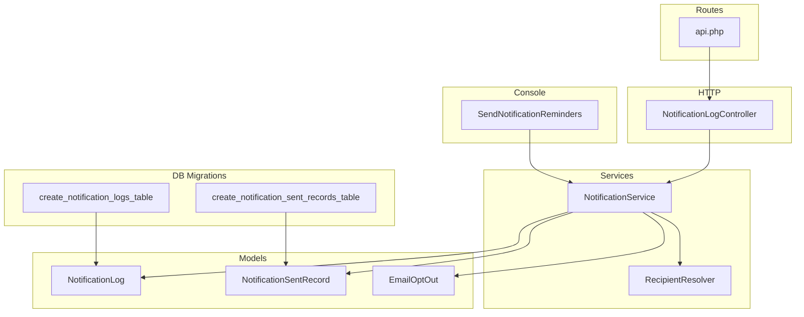
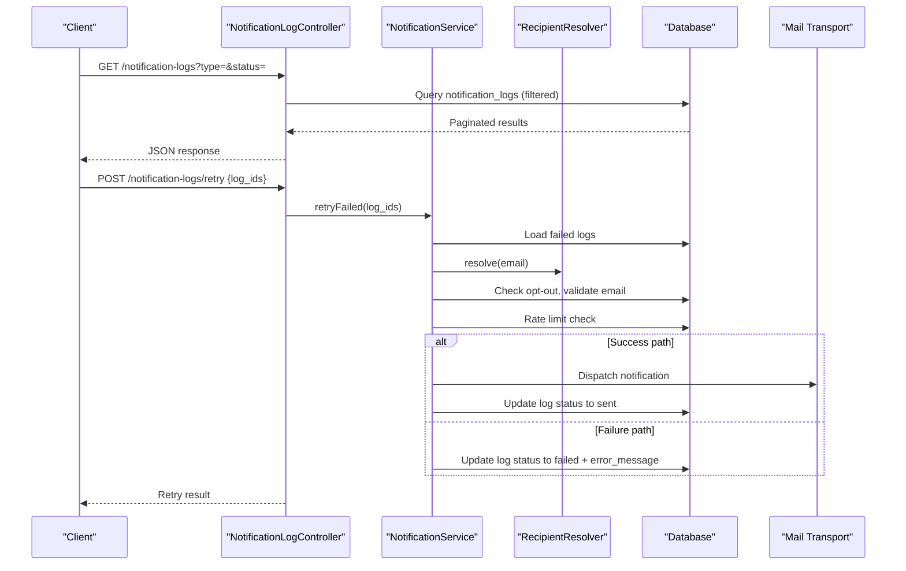
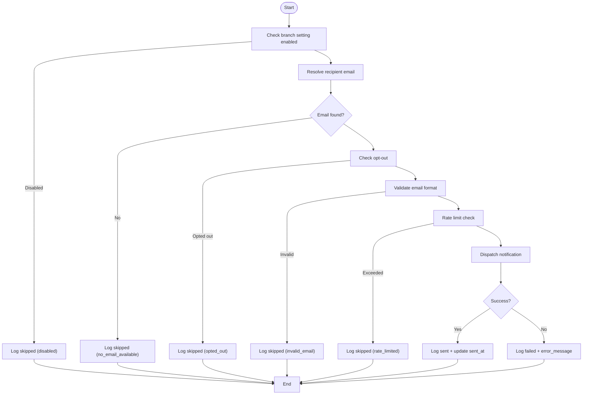
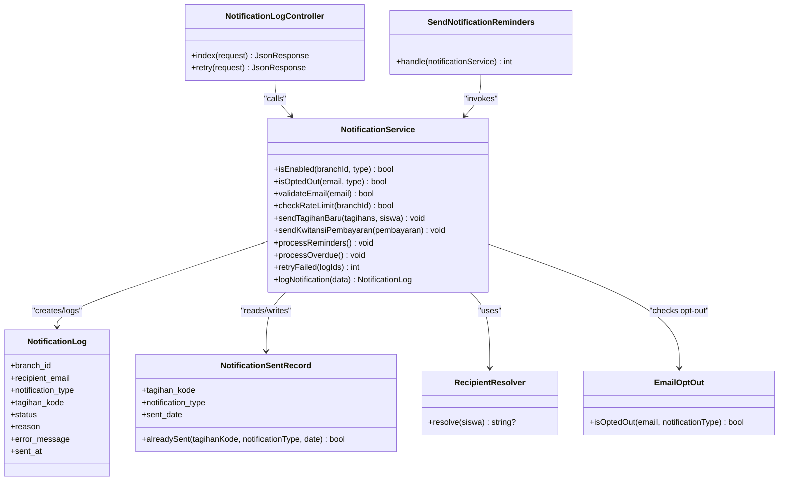

# Delivery Tracking & Logging

<cite>
**Referenced Files in This Document**
- [NotificationLog.php](file://backend/app/Models/NotificationLog.php)
- [NotificationSentRecord.php](file://backend/app/Models/NotificationSentRecord.php)
- [NotificationService.php](file://backend/app/Services/Notifications/NotificationService.php)
- [NotificationLogController.php](file://backend/app/Http/Controllers/NotificationLogController.php)
- [2026_05_27_100200_create_notification_logs_table.php](file://backend/database/migrations/2026_05_27_100200_create_notification_logs_table.php)
- [2026_05_27_100400_create_notification_sent_records_table.php](file://backend/database/migrations/2026_05_27_100400_create_notification_sent_records_table.php)
- [SendNotificationReminders.php](file://backend/app/Console/Commands/SendNotificationReminders.php)
- [RecipientResolver.php](file://backend/app/Services/Notifications/RecipientResolver.php)
- [NotificationHelper.php](file://backend/app/Helpers/NotificationHelper.php)
- [EmailOptOut.php](file://backend/app/Models/EmailOptOut.php)
- [api.php](file://backend/routes/api.php)
</cite>

## Table of Contents
1. [Introduction](#introduction)
2. [Project Structure](#project-structure)
3. [Core Components](#core-components)
4. [Architecture Overview](#architecture-overview)
5. [Detailed Component Analysis](#detailed-component-analysis)
6. [Dependency Analysis](#dependency-analysis)
7. [Performance Considerations](#performance-considerations)
8. [Troubleshooting Guide](#troubleshooting-guide)
9. [Conclusion](#conclusion)
10. [Appendices](#appendices)

## Introduction
This document explains the notification delivery tracking and logging system, focusing on:
- Comprehensive delivery attempt tracking via the NotificationLog model (success/failure status, error messages, timestamps).
- Duplicate prevention and scheduled delivery intervals using the NotificationSentRecord model.
- End-to-end logging workflow across the notification pipeline (pre-send validation logs, delivery attempt records, failure analysis).
- Practical examples for querying history, analyzing patterns, implementing retries, and generating reports.
- Log retention policies, performance considerations for high-volume scenarios, and debugging tools.

## Project Structure
The notification delivery tracking and logging features are implemented primarily under backend/app/Services/Notifications, with supporting models, migrations, a console command, and an API controller.

**Diagram sources**
- [NotificationLog.php](file://backend/app/Models/NotificationLog.php)
- [NotificationSentRecord.php](file://backend/app/Models/NotificationSentRecord.php)
- [NotificationService.php](file://backend/app/Services/Notifications/NotificationService.php)
- [RecipientResolver.php](file://backend/app/Services/Notifications/RecipientResolver.php)
- [EmailOptOut.php](file://backend/app/Models/EmailOptOut.php)
- [NotificationLogController.php](file://backend/app/Http/Controllers/NotificationLogController.php)
- [SendNotificationReminders.php](file://backend/app/Console/Commands/SendNotificationReminders.php)
- [2026_05_27_100200_create_notification_logs_table.php](file://backend/database/migrations/2026_05_27_100200_create_notification_logs_table.php)
- [2026_05_27_100400_create_notification_sent_records_table.php](file://backend/database/migrations/2026_05_27_100400_create_notification_sent_records_table.php)
- [api.php](file://backend/routes/api.php)

**Section sources**
- [NotificationLog.php](file://backend/app/Models/NotificationLog.php)
- [NotificationSentRecord.php](file://backend/app/Models/NotificationSentRecord.php)
- [NotificationService.php](file://backend/app/Services/Notifications/NotificationService.php)
- [NotificationLogController.php](file://backend/app/Http/Controllers/NotificationLogController.php)
- [SendNotificationReminders.php](file://backend/app/Console/Commands/SendNotificationReminders.php)
- [RecipientResolver.php](file://backend/app/Services/Notifications/RecipientResolver.php)
- [NotificationHelper.php](file://backend/app/Helpers/NotificationHelper.php)
- [EmailOptOut.php](file://backend/app/Models/EmailOptOut.php)
- [2026_05_27_100200_create_notification_logs_table.php](file://backend/database/migrations/2026_05_27_100200_create_notification_logs_table.php)
- [2026_05_27_100400_create_notification_sent_records_table.php](file://backend/database/migrations/2026_05_27_100400_create_notification_sent_records_table.php)
- [api.php](file://backend/routes/api.php)

## Core Components
- NotificationLog: Records each delivery attempt with branch context, recipient email, notification type, tagihan reference, status, reason, error message, and sent timestamp.
- NotificationSentRecord: Prevents duplicate notifications by recording per-tagihan, per-type, per-day delivery; also supports interval-based scheduling for overdue reminders.
- NotificationService: Orchestrates pre-send validations (branch settings, opt-out, email format, rate limiting), dispatches notifications, writes logs, and manages retry logic.
- NotificationLogController: Exposes endpoints to list logs and trigger manual retries.
- SendNotificationReminders: Console command that triggers reminder and overdue processing.
- RecipientResolver: Resolves the final recipient email from student account or parents.
- EmailOptOut: Manages unsubscribe preferences.
- NotificationHelper: Provides email validation utility used during pre-send checks.

**Section sources**
- [NotificationLog.php](file://backend/app/Models/NotificationLog.php)
- [NotificationSentRecord.php](file://backend/app/Models/NotificationSentRecord.php)
- [NotificationService.php](file://backend/app/Services/Notifications/NotificationService.php)
- [NotificationLogController.php](file://backend/app/Http/Controllers/NotificationLogController.php)
- [SendNotificationReminders.php](file://backend/app/Console/Commands/SendNotificationReminders.php)
- [RecipientResolver.php](file://backend/app/Services/Notifications/RecipientResolver.php)
- [EmailOptOut.php](file://backend/app/Models/EmailOptOut.php)
- [NotificationHelper.php](file://backend/app/Helpers/NotificationHelper.php)

## Architecture Overview
The notification pipeline performs pre-send validation, dispatch, and logging. It uses rate limiting and deduplication to ensure reliability and compliance.

**Diagram sources**
- [NotificationLogController.php](file://backend/app/Http/Controllers/NotificationLogController.php)
- [NotificationService.php](file://backend/app/Services/Notifications/NotificationService.php)
- [RecipientResolver.php](file://backend/app/Services/Notifications/RecipientResolver.php)
- [EmailOptOut.php](file://backend/app/Models/EmailOptOut.php)
- [NotificationLog.php](file://backend/app/Models/NotificationLog.php)

## Detailed Component Analysis

### NotificationLog Model
- Purpose: Persist every delivery attempt with detailed metadata for auditing and reporting.
- Key fields:
  - Branch context and recipient email
  - Notification type and optional tagihan reference
  - Status (sent, failed, skipped), reason, error_message
  - Timestamps including sent_at when successfully delivered
- Relationships: Belongs to Branch for multi-tenant scoping.

Practical usage examples:
- Query recent failures for a branch: filter by branch_id and status = failed.
- Analyze success rates by type: group by notification_type and status.
- Identify invalid emails: filter by status = skipped and reason = invalid_email.

**Section sources**
- [NotificationLog.php](file://backend/app/Models/NotificationLog.php)
- [2026_05_27_100200_create_notification_logs_table.php](file://backend/database/migrations/2026_05_27_100200_create_notification_logs_table.php)

### NotificationSentRecord Model
- Purpose: Prevent duplicate deliveries and enforce scheduling intervals.
- Key fields:
  - tagihan_kode, notification_type, sent_date
  - Unique constraint on (tagihan_kode, notification_type, sent_date)
- Utility: alreadySent(tagihanKode, notificationType, date?) returns whether a notification was already sent for a given day.

Usage patterns:
- Daily reminders: skip if already sent today for the same tagihan and type.
- Overdue intervals: check last sent date and compare against configured interval days before sending again.

**Section sources**
- [NotificationSentRecord.php](file://backend/app/Models/NotificationSentRecord.php)
- [2026_05_27_100400_create_notification_sent_records_table.php](file://backend/database/migrations/2026_05_27_100400_create_notification_sent_records_table.php)

### NotificationService
Responsibilities:
- Pre-send validation:
  - Branch-level enablement checks
  - Opt-out verification
  - Email format validation
  - Rate limiting per branch (max 100 per hour)
- Dispatching:
  - Sends notifications via Laravel’s mail transport
  - Writes successful or failed logs
  - Records sent entries for deduplication and scheduling
- Retry mechanism:
  - Re-dispatches failed notifications based on stored metadata
  - Updates log status and clears error messages on success

Key workflows:
- sendTagihanBaru: validates, dispatches, logs outcomes
- sendKwitansiPembayaran: validates, dispatches, logs outcomes
- processReminders: batch sends reminders based on configured days-before schedule
- processOverdue: batch sends overdue notices respecting interval configuration
- retryFailed: re-attempts failed notifications with updated state

**Diagram sources**
- [NotificationService.php](file://backend/app/Services/Notifications/NotificationService.php)
- [NotificationHelper.php](file://backend/app/Helpers/NotificationHelper.php)
- [EmailOptOut.php](file://backend/app/Models/EmailOptOut.php)
- [NotificationLog.php](file://backend/app/Models/NotificationLog.php)

**Section sources**
- [NotificationService.php](file://backend/app/Services/Notifications/NotificationService.php)
- [NotificationHelper.php](file://backend/app/Helpers/NotificationHelper.php)
- [EmailOptOut.php](file://backend/app/Models/EmailOptOut.php)

### NotificationLogController
Endpoints:
- List logs with filters (type, status) and pagination scoped to the authenticated user’s branch.
- Retry failed notifications by IDs, returning the count of retried items.

Security and scoping:
- Uses authenticated user’s branch_id to scope queries.
- Validates input for retry endpoint.

**Section sources**
- [NotificationLogController.php](file://backend/app/Http/Controllers/NotificationLogController.php)
- [api.php](file://backend/routes/api.php)

### SendNotificationReminders Command
- Triggers reminder and overdue processing via NotificationService.
- Designed to be scheduled (e.g., via cron) to run periodically.

**Section sources**
- [SendNotificationReminders.php](file://backend/app/Console/Commands/SendNotificationReminders.php)
- [NotificationService.php](file://backend/app/Services/Notifications/NotificationService.php)

### Supporting Utilities
- RecipientResolver: Determines recipient email priority (student account, wali, ibu, ayah).
- EmailOptOut: Checks unsubscribe preferences and generates unsubscribe URLs.
- NotificationHelper: Validates email addresses.

**Section sources**
- [RecipientResolver.php](file://backend/app/Services/Notifications/RecipientResolver.php)
- [EmailOptOut.php](file://backend/app/Models/EmailOptOut.php)
- [NotificationHelper.php](file://backend/app/Helpers/NotificationHelper.php)

## Dependency Analysis

**Diagram sources**
- [NotificationService.php](file://backend/app/Services/Notifications/NotificationService.php)
- [NotificationLog.php](file://backend/app/Models/NotificationLog.php)
- [NotificationSentRecord.php](file://backend/app/Models/NotificationSentRecord.php)
- [RecipientResolver.php](file://backend/app/Services/Notifications/RecipientResolver.php)
- [EmailOptOut.php](file://backend/app/Models/EmailOptOut.php)
- [NotificationLogController.php](file://backend/app/Http/Controllers/NotificationLogController.php)
- [SendNotificationReminders.php](file://backend/app/Console/Commands/SendNotificationReminders.php)

**Section sources**
- [NotificationService.php](file://backend/app/Services/Notifications/NotificationService.php)
- [NotificationLogController.php](file://backend/app/Http/Controllers/NotificationLogController.php)
- [SendNotificationReminders.php](file://backend/app/Console/Commands/SendNotificationReminders.php)
- [NotificationLog.php](file://backend/app/Models/NotificationLog.php)
- [NotificationSentRecord.php](file://backend/app/Models/NotificationSentRecord.php)
- [RecipientResolver.php](file://backend/app/Services/Notifications/RecipientResolver.php)
- [EmailOptOut.php](file://backend/app/Models/EmailOptOut.php)

## Performance Considerations
- Rate Limiting: Per-branch limits (100 per hour) protect downstream mail providers and reduce load spikes.
- Deduplication: Unique constraints on notification_sent_records prevent redundant sends and database contention.
- Indexing: The notification_logs table includes composite indexes on (branch_id, notification_type, status) to optimize common query patterns.
- Batch Processing: Reminder and overdue jobs iterate over sets efficiently; consider chunking large datasets if needed.
- Eager Loading: Use eager loading for relationships (siswa.wali/ibu/ayah) to avoid N+1 queries during batch operations.
- Queue Workers: Ensure queue workers are running to process mail asynchronously and maintain throughput.

[No sources needed since this section provides general guidance]

## Troubleshooting Guide
Common issues and diagnostics:
- Skipped due to disabled branch settings: Check branch notification settings and re-enable required types.
- No email available: Verify student account or parent emails exist and are populated.
- Opted out: Confirm unsubscribe preferences; allow users to resubscribe if needed.
- Invalid email: Correct email formats before retrying.
- Rate limited: Wait for the window to reset or adjust business logic to spread sends.
- Failed delivery: Inspect error_message in logs and application logs for stack traces.

Operational tips:
- Use the list endpoint to filter by status=failed and type to isolate problems.
- Use the retry endpoint to reattempt specific failed logs after fixing root causes.
- Schedule the reminders command regularly to keep reminders and overdue flows current.

**Section sources**
- [NotificationLogController.php](file://backend/app/Http/Controllers/NotificationLogController.php)
- [NotificationService.php](file://backend/app/Services/Notifications/NotificationService.php)
- [SendNotificationReminders.php](file://backend/app/Console/Commands/SendNotificationReminders.php)

## Conclusion
The notification delivery tracking and logging system provides robust observability and control:
- Every attempt is recorded with clear status and reasons.
- Duplicate prevention and scheduling ensure reliable, compliant delivery.
- Admins can inspect logs and retry failures easily.
- With proper indexing, rate limiting, and batching, the system scales well for high-volume environments.

[No sources needed since this section summarizes without analyzing specific files]

## Appendices

### Data Models Reference
- notification_logs
  - Columns: id, branch_id, recipient_email, notification_type, tagihan_kode, status, reason, error_message, sent_at, timestamps
  - Index: (branch_id, notification_type, status)
- notification_sent_records
  - Columns: id, tagihan_kode, notification_type, sent_date, timestamps
  - Unique: (tagihan_kode, notification_type, sent_date)

**Section sources**
- [2026_05_27_100200_create_notification_logs_table.php](file://backend/database/migrations/2026_05_27_100200_create_notification_logs_table.php)
- [2026_05_27_100400_create_notification_sent_records_table.php](file://backend/database/migrations/2026_05_27_100400_create_notification_sent_records_table.php)

### API Endpoints
- GET /notification-logs
  - Filters: type, status
  - Pagination: per_page (default 15)
  - Auth: requires Sanctum authentication
- POST /notification-logs/retry
  - Body: { log_ids: number[] }
  - Returns: retried_count

**Section sources**
- [NotificationLogController.php](file://backend/app/Http/Controllers/NotificationLogController.php)
- [api.php](file://backend/routes/api.php)

### Scheduling
- Command: notifications:send-reminders
- Recommended schedule: Run hourly or more frequently depending on business needs.

**Section sources**
- [SendNotificationReminders.php](file://backend/app/Console/Commands/SendNotificationReminders.php)

### Retention Policies
- Implement periodic pruning of old notification_logs entries based on retention policy (e.g., archive or delete older than X days/months).
- Keep notification_sent_records for audit purposes; prune only if necessary and safe.

[No sources needed since this section provides general guidance]