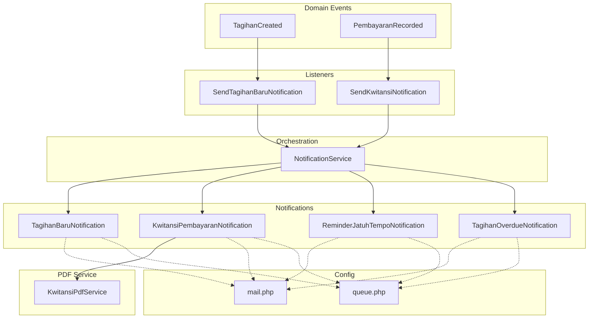
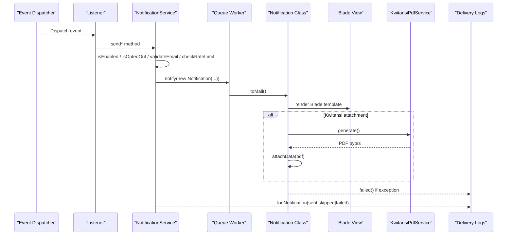
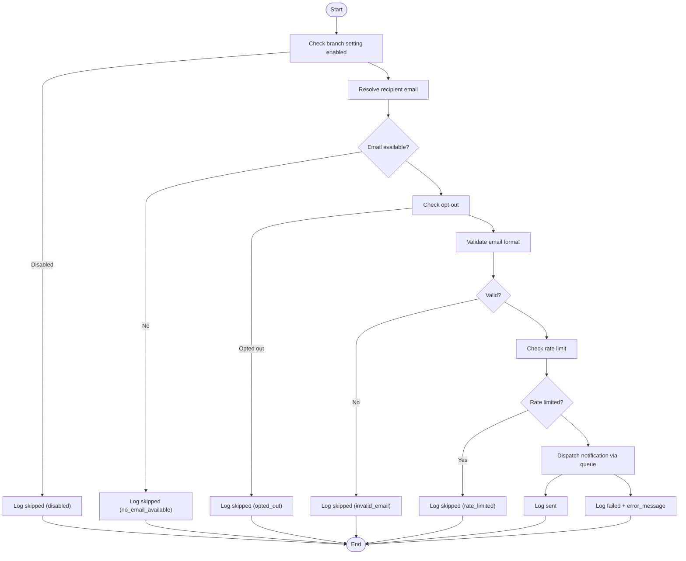
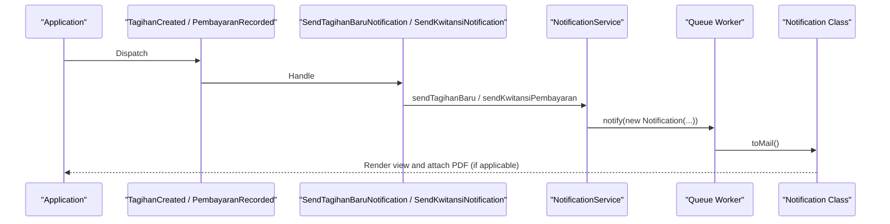
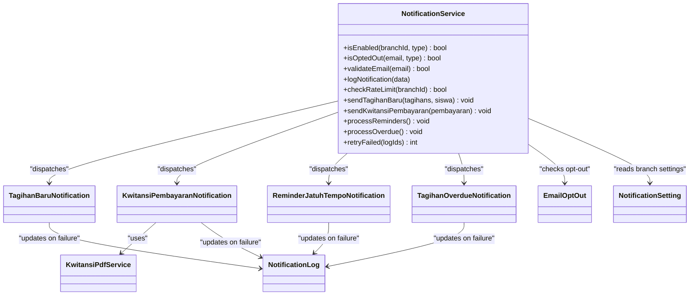

# Email Notification Management

<cite>
**Referenced Files in This Document**
- [TagihanBaruNotification.php](file://backend/app/Notifications/TagihanBaruNotification.php)
- [KwitansiPembayaranNotification.php](file://backend/app/Notifications/KwitansiPembayaranNotification.php)
- [ReminderJatuhTempoNotification.php](file://backend/app/Notifications/ReminderJatuhTempoNotification.php)
- [TagihanOverdueNotification.php](file://backend/app/Notifications/TagihanOverdueNotification.php)
- [NotificationService.php](file://backend/app/Services/Notifications/NotificationService.php)
- [SendTagihanBaruNotification.php](file://backend/app/Listeners/SendTagihanBaruNotification.php)
- [SendKwitansiNotification.php](file://backend/app/Listeners/SendKwitansiNotification.php)
- [TagihanCreated.php](file://backend/app/Events/TagihanCreated.php)
- [PembayaranRecorded.php](file://backend/app/Events/PembayaranRecorded.php)
- [KwitansiPdfService.php](file://backend/app/Services/Notifications/KwitansiPdfService.php)
- [mail.php](file://backend/config/mail.php)
- [queue.php](file://backend/config/queue.php)
</cite>

## Table of Contents
1. [Introduction](#introduction)
2. [Project Structure](#project-structure)
3. [Core Components](#core-components)
4. [Architecture Overview](#architecture-overview)
5. [Detailed Component Analysis](#detailed-component-analysis)
6. [Dependency Analysis](#dependency-analysis)
7. [Performance Considerations](#performance-considerations)
8. [Troubleshooting Guide](#troubleshooting-guide)
9. [Conclusion](#conclusion)
10. [Appendices](#appendices)

## Introduction
This document explains the email notification system used by the Handayani platform for educational institution communications. It covers built-in notification types:
- TagihanBaruNotification (new invoice)
- KwitansiPembayaranNotification (payment receipt)
- ReminderJatuhTempoNotification (due date reminders)
- TagihanOverdueNotification (overdue invoices)

It details how Laravel notifications are structured, how Blade templates are rendered, and how to customize content, add attachments, and implement conditional logic based on user preferences. It also documents queue processing, retry mechanisms, delivery status tracking, and best practices for formatting, responsive design, and accessibility.

## Project Structure
The email notification subsystem is implemented using Laravel’s event-listener and notification pipeline with queue-backed job processing. Key areas include:
- Notifications: Mail-based notification classes that render Blade views and attach PDFs when needed.
- Services: Orchestration layer handling recipient resolution, opt-out checks, rate limiting, logging, retries, and dispatching.
- Events and Listeners: Trigger notifications on domain events such as new invoices or recorded payments.
- Configuration: Mail transport and queue backends.

**Diagram sources**
- [TagihanCreated.php:1-20](file://backend/app/Events/TagihanCreated.php#L1-L20)
- [PembayaranRecorded.php:1-17](file://backend/app/Events/PembayaranRecorded.php#L1-L17)
- [SendTagihanBaruNotification.php:1-20](file://backend/app/Listeners/SendTagihanBaruNotification.php#L1-L20)
- [SendKwitansiNotification.php:1-20](file://backend/app/Listeners/SendKwitansiNotification.php#L1-L20)
- [NotificationService.php:1-713](file://backend/app/Services/Notifications/NotificationService.php#L1-L713)
- [TagihanBaruNotification.php:1-61](file://backend/app/Notifications/TagihanBaruNotification.php#L1-L61)
- [KwitansiPembayaranNotification.php:1-81](file://backend/app/Notifications/KwitansiPembayaranNotification.php#L1-L81)
- [ReminderJatuhTempoNotification.php:1-61](file://backend/app/Notifications/ReminderJatuhTempoNotification.php#L1-L61)
- [TagihanOverdueNotification.php:1-61](file://backend/app/Notifications/TagihanOverdueNotification.php#L1-L61)
- [KwitansiPdfService.php:1-67](file://backend/app/Services/Notifications/KwitansiPdfService.php#L1-L67)
- [mail.php:1-119](file://backend/config/mail.php#L1-L119)
- [queue.php:1-130](file://backend/config/queue.php#L1-L130)

**Section sources**
- [TagihanCreated.php:1-20](file://backend/app/Events/TagihanCreated.php#L1-L20)
- [PembayaranRecorded.php:1-17](file://backend/app/Events/PembayaranRecorded.php#L1-L17)
- [SendTagihanBaruNotification.php:1-20](file://backend/app/Listeners/SendTagihanBaruNotification.php#L1-L20)
- [SendKwitansiNotification.php:1-20](file://backend/app/Listeners/SendKwitansiNotification.php#L1-L20)
- [NotificationService.php:1-713](file://backend/app/Services/Notifications/NotificationService.php#L1-L713)
- [TagihanBaruNotification.php:1-61](file://backend/app/Notifications/TagihanBaruNotification.php#L1-L61)
- [KwitansiPembayaranNotification.php:1-81](file://backend/app/Notifications/KwitansiPembayaranNotification.php#L1-L81)
- [ReminderJatuhTempoNotification.php:1-61](file://backend/app/Notifications/ReminderJatuhTempoNotification.php#L1-L61)
- [TagihanOverdueNotification.php:1-61](file://backend/app/Notifications/TagihanOverdueNotification.php#L1-L61)
- [KwitansiPdfService.php:1-67](file://backend/app/Services/Notifications/KwitansiPdfService.php#L1-L67)
- [mail.php:1-119](file://backend/config/mail.php#L1-L119)
- [queue.php:1-130](file://backend/config/queue.php#L1-L130)

## Core Components
- Notification classes: Each notification implements ShouldQueue, defines via(['mail']), constructs a MailMessage with subject and view, and provides a failed() hook to update delivery logs.
- NotificationService: Central orchestration for sending notifications, resolving recipients, checking opt-outs and rate limits, logging outcomes, and providing retry functionality.
- KwitansiPdfService: Generates the payment receipt PDF using shared controller logic and attaches it to the kwitansi email.
- Events and Listeners: Domain events trigger listeners which delegate to NotificationService to send appropriate notifications.

Key responsibilities:
- Recipient resolution and validation
- Branch-level feature toggles and per-user opt-outs
- Rate limiting per branch
- Delivery logging and failure tracking
- Retry mechanism for failed notifications

**Section sources**
- [TagihanBaruNotification.php:1-61](file://backend/app/Notifications/TagihanBaruNotification.php#L1-L61)
- [KwitansiPembayaranNotification.php:1-81](file://backend/app/Notifications/KwitansiPembayaranNotification.php#L1-L81)
- [ReminderJatuhTempoNotification.php:1-61](file://backend/app/Notifications/ReminderJatuhTempoNotification.php#L1-L61)
- [TagihanOverdueNotification.php:1-61](file://backend/app/Notifications/TagihanOverdueNotification.php#L1-L61)
- [NotificationService.php:1-713](file://backend/app/Services/Notifications/NotificationService.php#L1-L713)
- [KwitansiPdfService.php:1-67](file://backend/app/Services/Notifications/KwitansiPdfService.php#L1-L67)
- [SendTagihanBaruNotification.php:1-20](file://backend/app/Listeners/SendTagihanBaruNotification.php#L1-L20)
- [SendKwitansiNotification.php:1-20](file://backend/app/Listeners/SendKwitansiNotification.php#L1-L20)

## Architecture Overview
The system uses an event-driven architecture with queued mail notifications. The flow:
- A domain event occurs (e.g., new invoice created).
- A listener handles the event and calls NotificationService.
- NotificationService performs checks (enabled flags, opt-out, email validation, rate limit), then dispatches a queued notification.
- The notification class renders a Blade template and optionally attaches a PDF.
- On failure, the notification updates delivery logs; NotificationService also records sent/skipped/failed statuses.

**Diagram sources**
- [SendTagihanBaruNotification.php:1-20](file://backend/app/Listeners/SendTagihanBaruNotification.php#L1-L20)
- [SendKwitansiNotification.php:1-20](file://backend/app/Listeners/SendKwitansiNotification.php#L1-L20)
- [NotificationService.php:1-713](file://backend/app/Services/Notifications/NotificationService.php#L1-L713)
- [TagihanBaruNotification.php:1-61](file://backend/app/Notifications/TagihanBaruNotification.php#L1-L61)
- [KwitansiPembayaranNotification.php:1-81](file://backend/app/Notifications/KwitansiPembayaranNotification.php#L1-L81)
- [KwitansiPdfService.php:1-67](file://backend/app/Services/Notifications/KwitansiPdfService.php#L1-L67)

## Detailed Component Analysis

### Built-in Notification Types

#### TagihanBaruNotification (New Invoice)
- Purpose: Send a new invoice notification to parents/guardians.
- Data passed: Collection of invoices and student model.
- Rendering: Uses a Blade view for invoice listing.
- Queue behavior: Runs on the 'notifications' queue with retries and exponential backoff.
- Failure handling: Updates related notification log entry to failed with error message.

Customization options:
- Modify subject and view path to change branding or language.
- Add additional variables to the view context for dynamic content.
- Attach supplementary files using MailMessage methods.

**Section sources**
- [TagihanBaruNotification.php:1-61](file://backend/app/Notifications/TagihanBaruNotification.php#L1-L61)

#### KwitansiPembayaranNotification (Payment Receipt)
- Purpose: Send a payment receipt notification with an attached PDF.
- Data passed: Payment record and student model.
- Rendering: Uses a Blade view for the email body.
- Attachment: Generates a PDF via KwitansiPdfService and attaches it to the email. If PDF generation fails, the email is still sent without attachment and a warning is logged.
- Queue behavior: Runs on the 'notifications' queue with retries and exponential backoff.
- Failure handling: Updates related notification log entry to failed with error message.

Customization options:
- Adjust PDF layout by modifying the underlying view used by KwitansiPdfService.
- Change attachment filename and MIME type if needed.
- Extend view context to include additional payment details.

**Section sources**
- [KwitansiPembayaranNotification.php:1-81](file://backend/app/Notifications/KwitansiPembayaranNotification.php#L1-L81)
- [KwitansiPdfService.php:1-67](file://backend/app/Services/Notifications/KwitansiPdfService.php#L1-L67)

#### ReminderJatuhTempoNotification (Due Date Reminders)
- Purpose: Send reminder emails before due dates based on configured days-before thresholds.
- Data passed: Invoice, student, and daysBefore value.
- Rendering: Uses a Blade view tailored for reminders.
- Queue behavior: Runs on the 'notifications' queue with retries and exponential backoff.
- Failure handling: Updates related notification log entry to failed with error message.

Customization options:
- Include conditional messaging based on daysBefore.
- Add links to pay online or contact support.
- Personalize tone and urgency based on proximity to due date.

**Section sources**
- [ReminderJatuhTempoNotification.php:1-61](file://backend/app/Notifications/ReminderJatuhTempoNotification.php#L1-L61)

#### TagihanOverdueNotification (Overdue Invoices)
- Purpose: Send overdue notices for unpaid invoices past due date.
- Data passed: Invoice, student, and daysOverdue value.
- Rendering: Uses a Blade view tailored for overdue notices.
- Queue behavior: Runs on the 'notifications' queue with retries and exponential backoff.
- Failure handling: Updates related notification log entry to failed with error message.

Customization options:
- Escalate tone and include consequences or next steps.
- Provide direct action links (pay now, request extension).
- Include summary of outstanding amounts and deadlines.

**Section sources**
- [TagihanOverdueNotification.php:1-61](file://backend/app/Notifications/TagihanOverdueNotification.php#L1-L61)

### Orchestration and Processing Logic

#### NotificationService
Responsibilities:
- Branch-level enablement checks for each notification type.
- Recipient resolution and email validation.
- Opt-out enforcement per notification type.
- Rate limiting per branch (max 100 emails per hour).
- Logging of sent, skipped, and failed notifications.
- Retry mechanism for previously failed notifications.

Processing flows:
- sendTagihanBaru: Validates settings, resolves recipient, checks opt-out and rate limit, dispatches TagihanBaruNotification, logs outcome.
- sendKwitansiPembayaran: Similar flow for payment receipts.
- processReminders: Scans upcoming due dates per branch configuration and sends reminders.
- processOverdue: Scans overdue invoices per branch configuration and sends overdue notices at configured intervals.
- retryFailed: Re-dispatches failed notifications after re-validating conditions.

**Diagram sources**
- [NotificationService.php:1-713](file://backend/app/Services/Notifications/NotificationService.php#L1-L713)

**Section sources**
- [NotificationService.php:1-713](file://backend/app/Services/Notifications/NotificationService.php#L1-L713)

### Events and Listeners

#### TagihanCreated and SendTagihanBaruNotification
- Event carries a collection of invoices and a student.
- Listener queues a job to call NotificationService::sendTagihanBaru.

#### PembayaranRecorded and SendKwitansiNotification
- Event carries a payment record.
- Listener queues a job to call NotificationService::sendKwitansiPembayaran.

**Diagram sources**
- [TagihanCreated.php:1-20](file://backend/app/Events/TagihanCreated.php#L1-L20)
- [PembayaranRecorded.php:1-17](file://backend/app/Events/PembayaranRecorded.php#L1-L17)
- [SendTagihanBaruNotification.php:1-20](file://backend/app/Listeners/SendTagihanBaruNotification.php#L1-L20)
- [SendKwitansiNotification.php:1-20](file://backend/app/Listeners/SendKwitansiNotification.php#L1-L20)
- [NotificationService.php:1-713](file://backend/app/Services/Notifications/NotificationService.php#L1-L713)
- [TagihanBaruNotification.php:1-61](file://backend/app/Notifications/TagihanBaruNotification.php#L1-L61)
- [KwitansiPembayaranNotification.php:1-81](file://backend/app/Notifications/KwitansiPembayaranNotification.php#L1-L81)

## Dependency Analysis
- Notification classes depend on:
  - MailMessage for constructing emails.
  - Blade views for rendering content.
  - Optional services like KwitansiPdfService for attachments.
  - NotificationLog for updating delivery status on failures.
- NotificationService depends on:
  - RecipientResolver for determining target email addresses.
  - EmailOptOut and NotificationSetting for preference and branch-level toggles.
  - RateLimiter for throttling.
  - Notification and Notification facade for dispatching.
- Queue and mail configuration:
  - Default queue backend is database; mailer defaults to log in development but can be switched to SMTP or other transports.

**Diagram sources**
- [NotificationService.php:1-713](file://backend/app/Services/Notifications/NotificationService.php#L1-L713)
- [TagihanBaruNotification.php:1-61](file://backend/app/Notifications/TagihanBaruNotification.php#L1-L61)
- [KwitansiPembayaranNotification.php:1-81](file://backend/app/Notifications/KwitansiPembayaranNotification.php#L1-L81)
- [ReminderJatuhTempoNotification.php:1-61](file://backend/app/Notifications/ReminderJatuhTempoNotification.php#L1-L61)
- [TagihanOverdueNotification.php:1-61](file://backend/app/Notifications/TagihanOverdueNotification.php#L1-L61)
- [KwitansiPdfService.php:1-67](file://backend/app/Services/Notifications/KwitansiPdfService.php#L1-L67)

**Section sources**
- [NotificationService.php:1-713](file://backend/app/Services/Notifications/NotificationService.php#L1-L713)
- [TagihanBaruNotification.php:1-61](file://backend/app/Notifications/TagihanBaruNotification.php#L1-L61)
- [KwitansiPembayaranNotification.php:1-81](file://backend/app/Notifications/KwitansiPembayaranNotification.php#L1-L81)
- [ReminderJatuhTempoNotification.php:1-61](file://backend/app/Notifications/ReminderJatuhTempoNotification.php#L1-L61)
- [TagihanOverdueNotification.php:1-61](file://backend/app/Notifications/TagihanOverdueNotification.php#L1-L61)
- [KwitansiPdfService.php:1-67](file://backend/app/Services/Notifications/KwitansiPdfService.php#L1-L67)

## Performance Considerations
- Queue backend: Database queue is default; consider Redis or SQS for higher throughput in production.
- Batch sending: For large batches, prefer batch jobs or chunked processing to avoid memory pressure.
- PDF generation: PDF creation can be CPU-intensive; ensure adequate worker resources and consider caching generated PDFs where appropriate.
- Rate limiting: Per-branch rate limiting prevents overloading downstream mail providers.
- Retries: Exponential backoff reduces transient failures; tune tries and backoff values based on provider constraints.

[No sources needed since this section provides general guidance]

## Troubleshooting Guide
Common issues and resolutions:
- No recipient email found: Ensure student has associated user or guardian emails configured; review recipient resolution logic.
- Opted out: Check EmailOptOut records for the recipient and notification type; allow users to manage preferences.
- Invalid email: Validate email formats upstream; reject malformed addresses early.
- Rate limited: Reduce frequency or increase rate limit thresholds; monitor branch usage patterns.
- Failed delivery: Inspect notification logs for error messages; verify mailer configuration and network connectivity.
- PDF attachment missing: Review PDF generation logs; ensure required assets and fonts are available to the PDF engine.

Operational tips:
- Use retryFailed to reattempt failed notifications after fixing root causes.
- Monitor failed_jobs table and application logs for persistent errors.
- Verify queue workers are running and consuming from the correct queue name.

**Section sources**
- [NotificationService.php:1-713](file://backend/app/Services/Notifications/NotificationService.php#L1-L713)
- [KwitansiPembayaranNotification.php:1-81](file://backend/app/Notifications/KwitansiPembayaranNotification.php#L1-L81)

## Conclusion
The Handayani email notification system provides robust, configurable, and trackable email delivery for key financial communications. By leveraging Laravel’s notification and queue infrastructure, it ensures reliability through retries, detailed logging, and controlled dispatch. Customization is straightforward via Blade views and service extensions, while operational safeguards like opt-outs, rate limiting, and retry mechanisms protect both users and systems.

[No sources needed since this section summarizes without analyzing specific files]

## Appendices

### Practical Examples and Best Practices

- Creating custom email notifications:
  - Define a new notification class implementing ShouldQueue and via(['mail']).
  - Implement toMail to construct MailMessage with subject and view context.
  - Optionally override failed() to update delivery logs.
  - Reference existing implementations for structure and patterns.

- Modifying existing templates:
  - Update the referenced Blade view to adjust layout, content, and branding.
  - Pass additional variables from the notification class to enrich content.

- Adding attachments:
  - Use attachData or attachFile on MailMessage within toMail.
  - For PDFs, reuse centralized services to maintain consistency across UI and email.

- Conditional content based on user preferences:
  - Leverage NotificationSetting and EmailOptOut to tailor content and channels.
  - Apply branching logic in Blade views to show/hide sections based on provided context.

- Email formatting best practices:
  - Use semantic HTML and inline styles for broad client compatibility.
  - Keep layouts simple and test across major clients.
  - Provide clear CTAs and fallback text for images.

- Responsive design considerations:
  - Use fluid tables and media queries sparingly; prefer single-column layouts.
  - Avoid fixed widths; use relative units and max-width containers.

- Accessibility compliance:
  - Use descriptive alt text for images and meaningful link labels.
  - Maintain sufficient color contrast and logical heading order.
  - Ensure keyboard navigability and screen reader friendliness.

- Queue processing and retry mechanisms:
  - Configure QUEUE_CONNECTION appropriately for your environment.
  - Tune tries and backoff values in notification classes.
  - Monitor failed_jobs and application logs for anomalies.

- Delivery status tracking:
  - Rely on NotificationLog entries for sent/skipped/failed states.
  - Use retryFailed to reattempt failed notifications after remediation.

**Section sources**
- [TagihanBaruNotification.php:1-61](file://backend/app/Notifications/TagihanBaruNotification.php#L1-L61)
- [KwitansiPembayaranNotification.php:1-81](file://backend/app/Notifications/KwitansiPembayaranNotification.php#L1-L81)
- [ReminderJatuhTempoNotification.php:1-61](file://backend/app/Notifications/ReminderJatuhTempoNotification.php#L1-L61)
- [TagihanOverdueNotification.php:1-61](file://backend/app/Notifications/TagihanOverdueNotification.php#L1-L61)
- [NotificationService.php:1-713](file://backend/app/Services/Notifications/NotificationService.php#L1-L713)
- [mail.php:1-119](file://backend/config/mail.php#L1-L119)
- [queue.php:1-130](file://backend/config/queue.php#L1-L130)