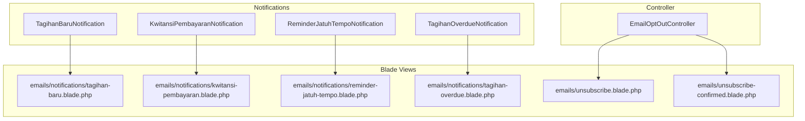
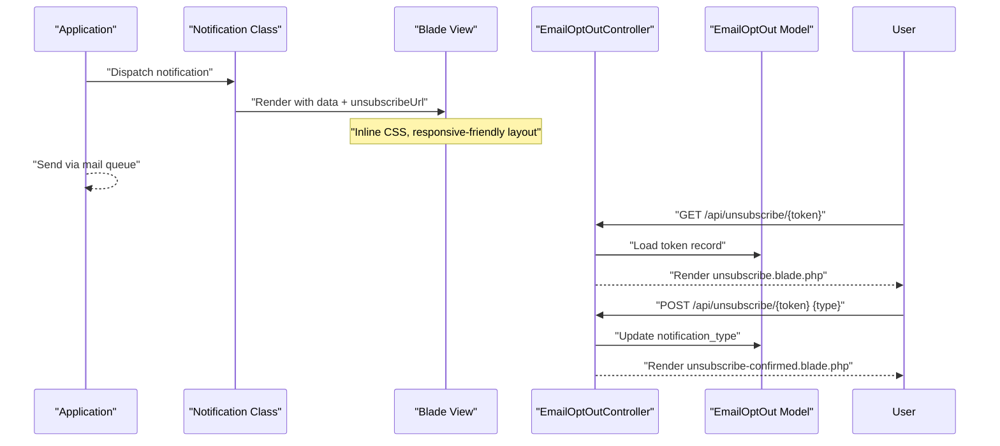
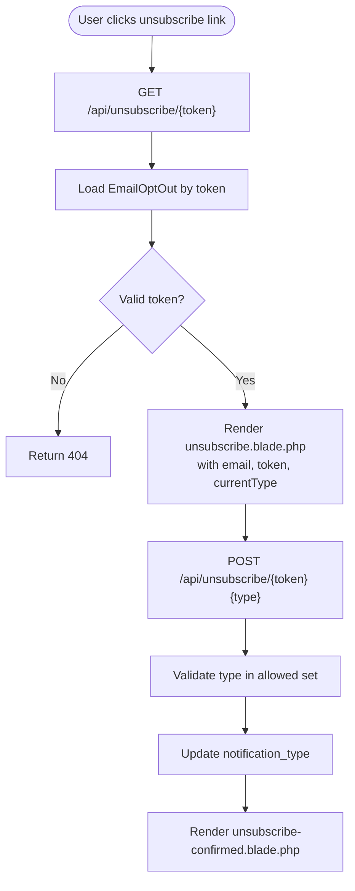
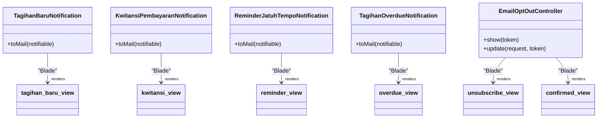

# Email Templates & Blade Views

<cite>
**Referenced Files in This Document**
- [TagihanBaruNotification.php](file://backend/app/Notifications/TagihanBaruNotification.php)
- [KwitansiPembayaranNotification.php](file://backend/app/Notifications/KwitansiPembayaranNotification.php)
- [ReminderJatuhTempoNotification.php](file://backend/app/Notifications/ReminderJatuhTempoNotification.php)
- [TagihanOverdueNotification.php](file://backend/app/Notifications/TagihanOverdueNotification.php)
- [tagihan-baru.blade.php](file://backend/resources/views/emails/notifications/tagihan-baru.blade.php)
- [kwitansi-pembayaran.blade.php](file://backend/resources/views/emails/notifications/kwitansi-pembayaran.blade.php)
- [reminder-jatuh-tempo.blade.php](file://backend/resources/views/emails/notifications/reminder-jatuh-tempo.blade.php)
- [tagihan-overdue.blade.php](file://backend/resources/views/emails/notifications/tagihan-overdue.blade.php)
- [unsubscribe.blade.php](file://backend/resources/views/emails/unsubscribe.blade.php)
- [unsubscribe-confirmed.blade.php](file://backend/resources/views/emails/unsubscribe-confirmed.blade.php)
- [EmailOptOutController.php](file://backend/app/Http/Controllers/EmailOptOutController.php)
</cite>

## Table of Contents
1. [Introduction](#introduction)
2. [Project Structure](#project-structure)
3. [Core Components](#core-components)
4. [Architecture Overview](#architecture-overview)
5. [Detailed Component Analysis](#detailed-component-analysis)
6. [Dependency Analysis](#dependency-analysis)
7. [Performance Considerations](#performance-considerations)
8. [Troubleshooting Guide](#troubleshooting-guide)
9. [Conclusion](#conclusion)
10. [Appendices](#appendices)

## Introduction
This document explains the email template system and Blade view implementations for an Indonesian educational institution’s billing notifications. It covers built-in templates, data binding patterns, styling approaches for responsive emails, unsubscribe functionality, preference management, and guidance for creating custom templates with conditional content, dynamic branding, accessibility, mobile responsiveness, and localization support.

## Project Structure
The email system is implemented using Laravel Notifications and Blade views:
- Notification classes define recipients, subjects, queued delivery, and the Blade view to render.
- Blade templates under resources/views/emails contain the HTML/CSS for rendering emails.
- An opt-out controller manages unsubscribe preferences via a tokenized link.

**Diagram sources**
- [TagihanBaruNotification.php:1-61](file://backend/app/Notifications/TagihanBaruNotification.php#L1-L61)
- [KwitansiPembayaranNotification.php:1-81](file://backend/app/Notifications/KwitansiPembayaranNotification.php#L1-L81)
- [ReminderJatuhTempoNotification.php:1-61](file://backend/app/Notifications/ReminderJatuhTempoNotification.php#L1-L61)
- [TagihanOverdueNotification.php:1-61](file://backend/app/Notifications/TagihanOverdueNotification.php#L1-L61)
- [EmailOptOutController.php:1-48](file://backend/app/Http/Controllers/EmailOptOutController.php#L1-L48)

**Section sources**
- [TagihanBaruNotification.php:1-61](file://backend/app/Notifications/TagihanBaruNotification.php#L1-L61)
- [KwitansiPembayaranNotification.php:1-81](file://backend/app/Notifications/KwitansiPembayaranNotification.php#L1-L81)
- [ReminderJatuhTempoNotification.php:1-61](file://backend/app/Notifications/ReminderJatuhTempoNotification.php#L1-L61)
- [TagihanOverdueNotification.php:1-61](file://backend/app/Notifications/TagihanOverdueNotification.php#L1-L61)
- [EmailOptOutController.php:1-48](file://backend/app/Http/Controllers/EmailOptOutController.php#L1-L48)

## Core Components
- Notification classes implement ShouldQueue and provide toMail() that returns a MailMessage bound to a specific Blade view. They pass model instances (e.g., Siswa, Tagihan, Pembayaran) and an unsubscribe URL placeholder into the view context.
- Blade templates render the email body with inline CSS for broad client compatibility.
- The unsubscribe flow uses a token-based form to update notification preferences.

Key responsibilities:
- TagihanBaruNotification: renders tagihan-baru.blade.php with student and invoice list.
- KwitansiPembayaranNotification: renders kwitansi-pembayaran.blade.php and optionally attaches a PDF receipt.
- ReminderJatuhTempoNotification: renders reminder-jatuh-tempo.blade.php with due date countdown.
- TagihanOverdueNotification: renders tagihan-overdue.blade.php with overdue details.
- EmailOptOutController: shows unsubscribe form and confirms updates.

**Section sources**
- [TagihanBaruNotification.php:32-41](file://backend/app/Notifications/TagihanBaruNotification.php#L32-L41)
- [KwitansiPembayaranNotification.php:32-63](file://backend/app/Notifications/KwitansiPembayaranNotification.php#L32-L63)
- [ReminderJatuhTempoNotification.php:33-43](file://backend/app/Notifications/ReminderJatuhTempoNotification.php#L33-L43)
- [TagihanOverdueNotification.php:33-43](file://backend/app/Notifications/TagihanOverdueNotification.php#L33-L43)
- [EmailOptOutController.php:10-46](file://backend/app/Http/Controllers/EmailOptOutController.php#L10-L46)

## Architecture Overview
The email pipeline follows a standard Laravel pattern:
- A domain event or job dispatches a notification.
- The notification class queues the message and defines the Blade view.
- The view renders with provided data and includes an unsubscribe link.
- Unsubscribe requests are handled by a controller that persists preferences.

**Diagram sources**
- [TagihanBaruNotification.php:32-41](file://backend/app/Notifications/TagihanBaruNotification.php#L32-L41)
- [KwitansiPembayaranNotification.php:32-63](file://backend/app/Notifications/KwitansiPembayaranNotification.php#L32-L63)
- [ReminderJatuhTempoNotification.php:33-43](file://backend/app/Notifications/ReminderJatuhTempoNotification.php#L33-L43)
- [TagihanOverdueNotification.php:33-43](file://backend/app/Notifications/TagihanOverdueNotification.php#L33-L43)
- [EmailOptOutController.php:10-46](file://backend/app/Http/Controllers/EmailOptOutController.php#L10-L46)

## Detailed Component Analysis

### Built-in Email Templates

#### tagihan-baru.blade.php
- Purpose: Notify parents about new invoices for a student.
- Data binding: Receives siswa, tagihans, unsubscribeUrl from TagihanBaruNotification.
- Styling: Inline CSS; simple table/list for invoices; responsive max-width container.
- Accessibility: Uses semantic headings and labels; ensure alt text for any images.
- Localization: Text should use language keys if available; currently static Indonesian strings.

**Section sources**
- [TagihanBaruNotification.php:32-41](file://backend/app/Notifications/TagihanBaruNotification.php#L32-L41)
- [tagihan-baru.blade.php](file://backend/resources/views/emails/notifications/tagihan-baru.blade.php)

#### kwitansi-pembayaran.blade.php
- Purpose: Provide payment receipt confirmation.
- Data binding: Receives siswa, pembayaran, unsubscribeUrl from KwitansiPembayaranNotification.
- Styling: Inline CSS; structured receipt sections; clear totals and dates.
- Attachments: The notification may attach a generated PDF receipt.
- Cross-client: Avoid complex layouts; prefer tables for alignment.

**Section sources**
- [KwitansiPembayaranNotification.php:32-63](file://backend/app/Notifications/KwitansiPembayaranNotification.php#L32-L63)
- [kwitansi-pembayaran.blade.php](file://backend/resources/views/emails/notifications/kwitansi-pembayaran.blade.php)

#### reminder-jatuh-tempo.blade.php
- Purpose: Remind about upcoming due dates.
- Data binding: Receives siswa, tagihan, daysBefore, unsubscribeUrl from ReminderJatuhTempoNotification.
- Styling: Inline CSS; highlight due date and days remaining.
- Conditional content: Show urgency based on daysBefore.

**Section sources**
- [ReminderJatuhTempoNotification.php:33-43](file://backend/app/Notifications/ReminderJatuhTempoNotification.php#L33-L43)
- [reminder-jatuh-tempo.blade.php](file://backend/resources/views/emails/notifications/reminder-jatuh-tempo.blade.php)

#### tagihan-overdue.blade.php
- Purpose: Alert about overdue invoices.
- Data binding: Receives siswa, tagihan, daysOverdue, unsubscribeUrl from TagihanOverdueNotification.
- Styling: Inline CSS; emphasize overdue status and next steps.
- Conditional content: Display daysOverdue and action links.

**Section sources**
- [TagihanOverdueNotification.php:33-43](file://backend/app/Notifications/TagihanOverdueNotification.php#L33-L43)
- [tagihan-overdue.blade.php](file://backend/resources/views/emails/notifications/tagihan-overdue.blade.php)

### Unsubscribe Functionality and Preference Management
- Flow:
  - GET /api/unsubscribe/{token}: Controller loads EmailOptOut by token and renders unsubscribe.blade.php with currentType.
  - POST /api/unsubscribe/{token}: Controller validates type, updates notification_type, and renders unsubscribe-confirmed.blade.php.
- Supported types: tagihan_baru, reminder, kwitansi, overdue, all.
- Security: Token lookup aborts with 404 if invalid/expired.

**Diagram sources**
- [EmailOptOutController.php:10-46](file://backend/app/Http/Controllers/EmailOptOutController.php#L10-L46)
- [unsubscribe.blade.php:1-51](file://backend/resources/views/emails/unsubscribe.blade.php#L1-L51)
- [unsubscribe-confirmed.blade.php:1-33](file://backend/resources/views/emails/unsubscribe-confirmed.blade.php#L1-L33)

**Section sources**
- [EmailOptOutController.php:10-46](file://backend/app/Http/Controllers/EmailOptOutController.php#L10-L46)
- [unsubscribe.blade.php:1-51](file://backend/resources/views/emails/unsubscribe.blade.php#L1-L51)
- [unsubscribe-confirmed.blade.php:1-33](file://backend/resources/views/emails/unsubscribe-confirmed.blade.php#L1-L33)

### Template Structure, Data Binding, and Styling Patterns
- Structure: Each notification binds a Blade view with consistent variables: siswa, business entity (tagihan/pembayaran), optional counters (daysBefore/daysOverdue), and unsubscribeUrl.
- Styling: Inline CSS within each template; viewport meta tag; max-width container; readable font stack; high-contrast buttons; minimal reliance on external stylesheets.
- Responsive design: Use percentage widths, fluid tables, and avoid fixed large images; test across clients.
- Cross-client compatibility: Prefer table-based layouts for alignment; avoid modern CSS features unsupported by older clients.

**Section sources**
- [TagihanBaruNotification.php:32-41](file://backend/app/Notifications/TagihanBaruNotification.php#L32-L41)
- [KwitansiPembayaranNotification.php:32-63](file://backend/app/Notifications/KwitansiPembayaranNotification.php#L32-L63)
- [ReminderJatuhTempoNotification.php:33-43](file://backend/app/Notifications/ReminderJatuhTempoNotification.php#L33-L43)
- [TagihanOverdueNotification.php:33-43](file://backend/app/Notifications/TagihanOverdueNotification.php#L33-L43)
- [unsubscribe.blade.php:1-51](file://backend/resources/views/emails/unsubscribe.blade.php#L1-L51)
- [unsubscribe-confirmed.blade.php:1-33](file://backend/resources/views/emails/unsubscribe-confirmed.blade.php#L1-L33)

### Creating Custom Email Templates
Steps:
- Create a new Notification class implementing ShouldQueue and define via(['mail']) and toMail().
- Bind a Blade view with required data and include unsubscribeUrl.
- Place the Blade file under resources/views/emails/notifications/.
- Ensure inline CSS and accessible markup.
- Optionally attach files (e.g., PDF receipts) similar to the kwitansi notification.

Best practices:
- Keep view names descriptive and aligned with notification purpose.
- Pass only necessary data to minimize payload.
- Use safe defaults for missing fields.

**Section sources**
- [TagihanBaruNotification.php:32-41](file://backend/app/Notifications/TagihanBaruNotification.php#L32-L41)
- [KwitansiPembayaranNotification.php:32-63](file://backend/app/Notifications/KwitansiPembayaranNotification.php#L32-L63)

### Implementing Conditional Content
- Use Blade conditionals to show/hide sections based on data presence or thresholds (e.g., daysBefore).
- Example patterns:
  - Show urgent call-to-action when daysOverdue > 0.
  - Hide attachment note if PDF generation failed.
  - Display different messages per notification type in unsubscribe pages.

**Section sources**
- [reminder-jatuh-tempo.blade.php](file://backend/resources/views/emails/notifications/reminder-jatuh-tempo.blade.php)
- [tagihan-overdue.blade.php](file://backend/resources/views/emails/notifications/tagihan-overdue.blade.php)
- [unsubscribe.blade.php:22-48](file://backend/resources/views/emails/unsubscribe.blade.php#L22-L48)
- [unsubscribe-confirmed.blade.php:17-27](file://backend/resources/views/emails/unsubscribe-confirmed.blade.php#L17-L27)

### Adding Dynamic Branding Elements
- Include school logo via absolute URL pointing to a publicly accessible asset.
- Use brand colors sparingly with inline styles.
- Provide fallback text for images and ensure contrast ratios meet accessibility guidelines.

[No sources needed since this section provides general guidance]

### Ensuring Cross-Client Compatibility
- Use table-based layouts for alignment.
- Avoid flexbox/grid; rely on width, align attributes, and cellpadding/cellspacing where needed.
- Keep CSS inline; avoid <style> blocks except for minimal resets.
- Test with common clients (Gmail, Outlook, Apple Mail).

[No sources needed since this section provides general guidance]

### Accessibility Compliance
- Use semantic headings and labels.
- Provide meaningful alt text for images.
- Ensure sufficient color contrast and keyboard navigability for web-based previews.
- Add aria-labels where appropriate for interactive elements in unsubscribe pages.

[No sources needed since this section provides general guidance]

### Mobile Responsiveness
- Set viewport meta tag and constrain max-width.
- Use fluid widths and wrap long text.
- Avoid wide tables; allow horizontal scrolling if necessary.

**Section sources**
- [unsubscribe.blade.php:1-15](file://backend/resources/views/emails/unsubscribe.blade.php#L1-L15)
- [unsubscribe-confirmed.blade.php:1-11](file://backend/resources/views/emails/unsubscribe-confirmed.blade.php#L1-L11)

### Localization Support for Indonesian Educational Institutions
- Replace static Indonesian strings with translation keys from lang/id/*.
- Centralize labels for notification types and UI text.
- Ensure unsubscribe forms reflect localized labels consistently.

[No sources needed since this section provides general guidance]

## Dependency Analysis
The following diagram maps notification classes to their Blade views and the unsubscribe controller to its views.

**Diagram sources**
- [TagihanBaruNotification.php:32-41](file://backend/app/Notifications/TagihanBaruNotification.php#L32-L41)
- [KwitansiPembayaranNotification.php:32-63](file://backend/app/Notifications/KwitansiPembayaranNotification.php#L32-L63)
- [ReminderJatuhTempoNotification.php:33-43](file://backend/app/Notifications/ReminderJatuhTempoNotification.php#L33-L43)
- [TagihanOverdueNotification.php:33-43](file://backend/app/Notifications/TagihanOverdueNotification.php#L33-L43)
- [EmailOptOutController.php:10-46](file://backend/app/Http/Controllers/EmailOptOutController.php#L10-L46)

**Section sources**
- [TagihanBaruNotification.php:32-41](file://backend/app/Notifications/TagihanBaruNotification.php#L32-L41)
- [KwitansiPembayaranNotification.php:32-63](file://backend/app/Notifications/KwitansiPembayaranNotification.php#L32-L63)
- [ReminderJatuhTempoNotification.php:33-43](file://backend/app/Notifications/ReminderJatuhTempoNotification.php#L33-L43)
- [TagihanOverdueNotification.php:33-43](file://backend/app/Notifications/TagihanOverdueNotification.php#L33-L43)
- [EmailOptOutController.php:10-46](file://backend/app/Http/Controllers/EmailOptOutController.php#L10-L46)

## Performance Considerations
- Queued delivery: All notifications implement ShouldQueue and set retry/backoff policies to handle transient failures gracefully.
- Attachment handling: PDF attachments are generated on demand; consider caching strategies for frequently sent receipts.
- View rendering: Keep Blade templates lightweight; avoid heavy computations inside views.

**Section sources**
- [TagihanBaruNotification.php:17-25](file://backend/app/Notifications/TagihanBaruNotification.php#L17-L25)
- [KwitansiPembayaranNotification.php:17-25](file://backend/app/Notifications/KwitansiPembayaranNotification.php#L17-L25)
- [ReminderJatuhTempoNotification.php:17-25](file://backend/app/Notifications/ReminderJatuhTempoNotification.php#L17-L25)
- [TagihanOverdueNotification.php:17-25](file://backend/app/Notifications/TagihanOverdueNotification.php#L17-L25)

## Troubleshooting Guide
Common issues and resolutions:
- Invalid or expired unsubscribe token: Controller returns 404; verify token generation and expiration logic upstream.
- Missing unsubscribe link in emails: Ensure unsubscribeUrl is passed to views and rendered correctly.
- PDF attachment failure: Kwitansi notification logs warnings and still sends the email without attachment; check PDF service configuration and permissions.
- Queue failures: Check retry/backoff settings and error logging in failed() methods.

**Section sources**
- [EmailOptOutController.php:14-16](file://backend/app/Http/Controllers/EmailOptOutController.php#L14-L16)
- [EmailOptOutController.php:29-31](file://backend/app/Http/Controllers/EmailOptOutController.php#L29-L31)
- [KwitansiPembayaranNotification.php:50-60](file://backend/app/Notifications/KwitansiPembayaranNotification.php#L50-L60)
- [TagihanBaruNotification.php:46-59](file://backend/app/Notifications/TagihanBaruNotification.php#L46-L59)
- [KwitansiPembayaranNotification.php:68-79](file://backend/app/Notifications/KwitansiPembayaranNotification.php#L68-L79)
- [ReminderJatuhTempoNotification.php:48-59](file://backend/app/Notifications/ReminderJatuhTempoNotification.php#L48-L59)
- [TagihanOverdueNotification.php:48-59](file://backend/app/Notifications/TagihanOverdueNotification.php#L48-L59)

## Conclusion
The email system leverages Laravel Notifications and Blade views to deliver consistent, responsive, and accessible billing-related emails. The unsubscribe mechanism provides granular preference control. By following the recommended patterns—inline CSS, semantic markup, conditional content, and robust error handling—you can extend the system with new templates while maintaining cross-client compatibility and localization readiness.

## Appendices

### Quick Reference: Notification-to-View Mapping
- TagihanBaruNotification → tagihan-baru.blade.php
- KwitansiPembayaranNotification → kwitansi-pembayaran.blade.php
- ReminderJatuhTempoNotification → reminder-jatuh-tempo.blade.php
- TagihanOverdueNotification → tagihan-overdue.blade.php
- EmailOptOutController → unsubscribe.blade.php, unsubscribe-confirmed.blade.php

**Section sources**
- [TagihanBaruNotification.php:32-41](file://backend/app/Notifications/TagihanBaruNotification.php#L32-L41)
- [KwitansiPembayaranNotification.php:32-63](file://backend/app/Notifications/KwitansiPembayaranNotification.php#L32-L63)
- [ReminderJatuhTempoNotification.php:33-43](file://backend/app/Notifications/ReminderJatuhTempoNotification.php#L33-L43)
- [TagihanOverdueNotification.php:33-43](file://backend/app/Notifications/TagihanOverdueNotification.php#L33-L43)
- [EmailOptOutController.php:10-46](file://backend/app/Http/Controllers/EmailOptOutController.php#L10-L46)