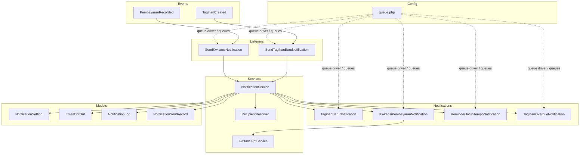
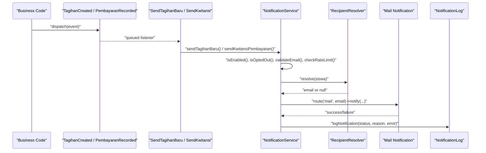
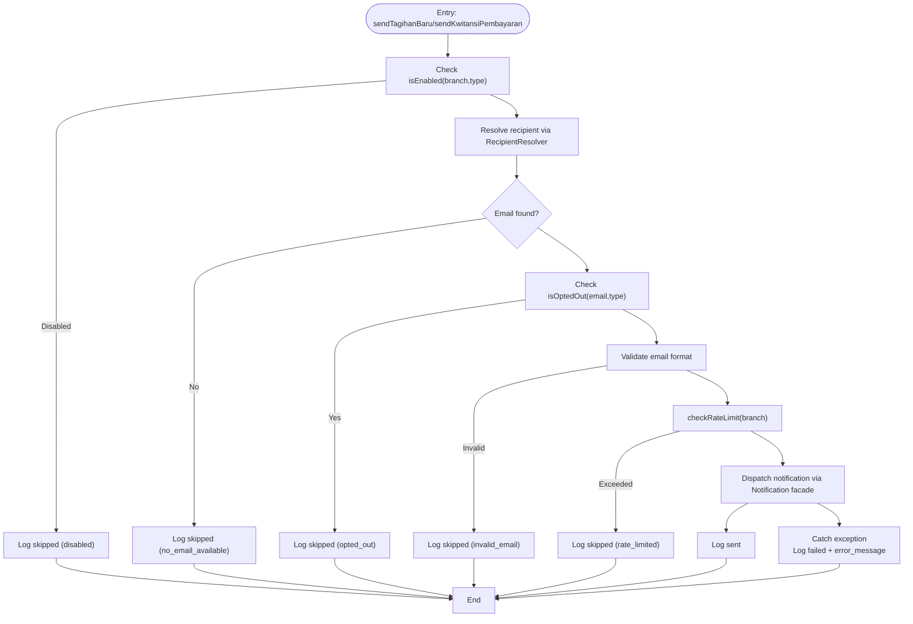
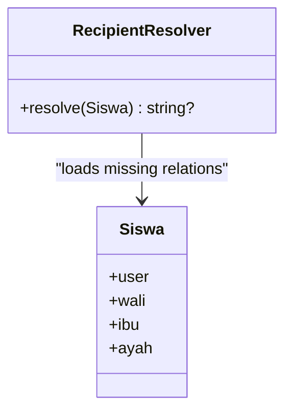
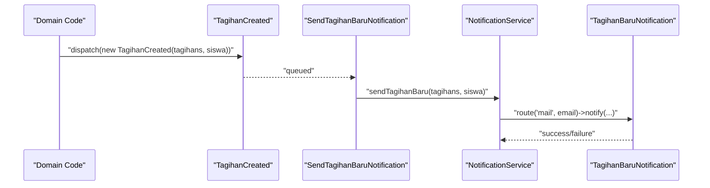
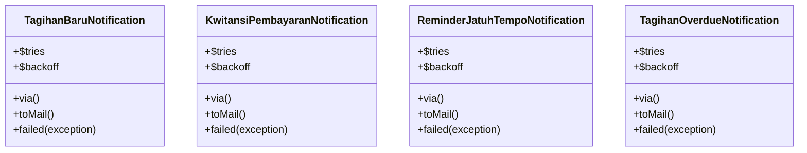
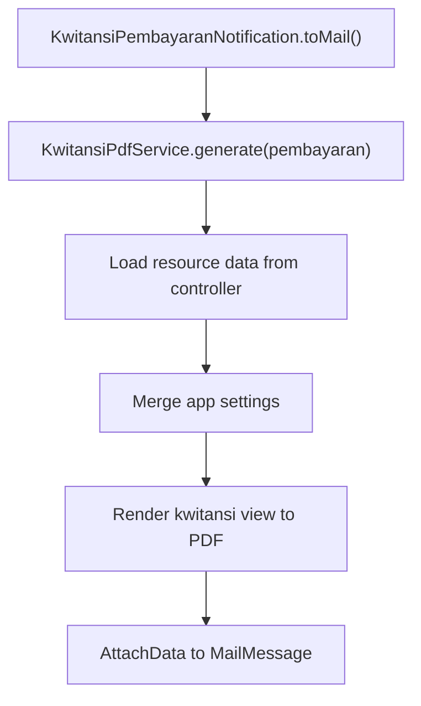
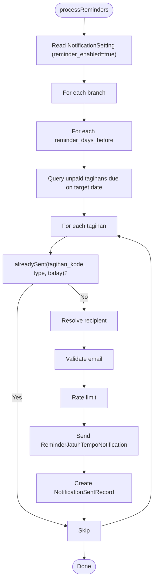
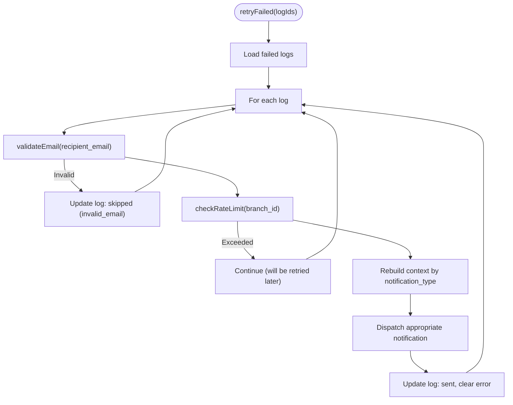
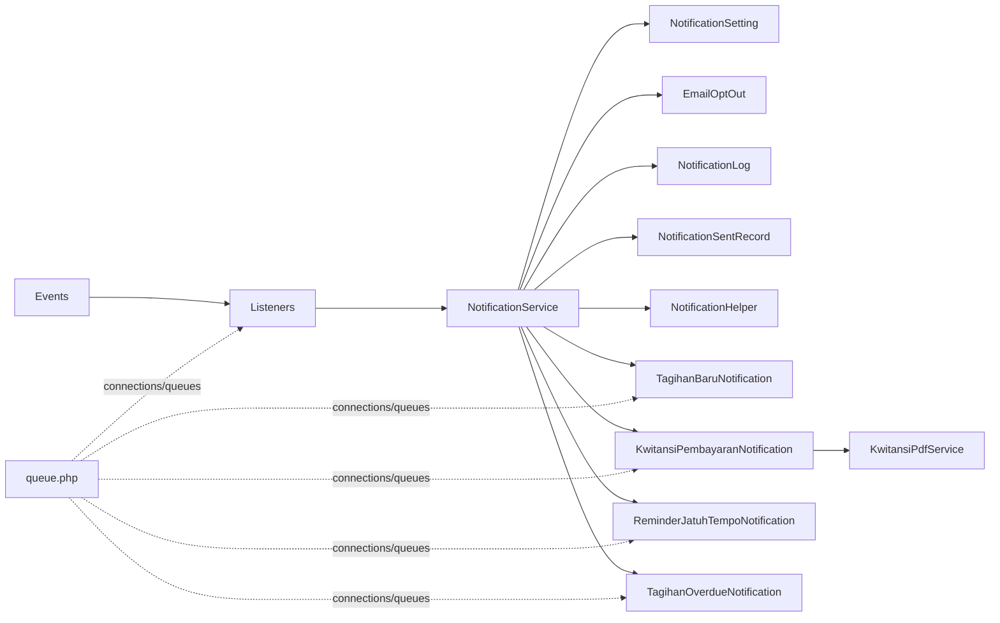

# Notification Architecture & Service Layer

<cite>
**Referenced Files in This Document**
- [NotificationService.php](file://backend/app/Services/Notifications/NotificationService.php)
- [RecipientResolver.php](file://backend/app/Services/Notifications/RecipientResolver.php)
- [SendKwitansiNotification.php](file://backend/app/Listeners/SendKwitansiNotification.php)
- [SendTagihanBaruNotification.php](file://backend/app/Listeners/SendTagihanBaruNotification.php)
- [TagihanCreated.php](file://backend/app/Events/TagihanCreated.php)
- [PembayaranRecorded.php](file://backend/app/Events/PembayaranRecorded.php)
- [KwitansiPembayaranNotification.php](file://backend/app/Notifications/KwitansiPembayaranNotification.php)
- [TagihanBaruNotification.php](file://backend/app/Notifications/TagihanBaruNotification.php)
- [ReminderJatuhTempoNotification.php](file://backend/app/Notifications/ReminderJatuhTempoNotification.php)
- [TagihanOverdueNotification.php](file://backend/app/Notifications/TagihanOverdueNotification.php)
- [NotificationSetting.php](file://backend/app/Models/NotificationSetting.php)
- [EmailOptOut.php](file://backend/app/Models/EmailOptOut.php)
- [NotificationLog.php](file://backend/app/Models/NotificationLog.php)
- [NotificationSentRecord.php](file://backend/app/Models/NotificationSentRecord.php)
- [NotificationHelper.php](file://backend/app/Helpers/NotificationHelper.php)
- [KwitansiPdfService.php](file://backend/app/Services/Notifications/KwitansiPdfService.php)
- [queue.php](file://backend/config/queue.php)
</cite>

## Table of Contents
1. [Introduction](#introduction)
2. [Project Structure](#project-structure)
3. [Core Components](#core-components)
4. [Architecture Overview](#architecture-overview)
5. [Detailed Component Analysis](#detailed-component-analysis)
6. [Dependency Analysis](#dependency-analysis)
7. [Performance Considerations](#performance-considerations)
8. [Troubleshooting Guide](#troubleshooting-guide)
9. [Conclusion](#conclusion)
10. [Appendices](#appendices)

## Introduction
This document explains the notification architecture and service layer in Handayani, focusing on how notifications are orchestrated, routed, and delivered via email. It covers:
- The NotificationService that coordinates recipient resolution, rate limiting, opt-out checks, logging, and dispatching.
- The event-driven flow using Laravel listeners to trigger notifications automatically when tagihan is created or payment is recorded.
- The RecipientResolver for determining recipients based on student relationships and user preferences.
- Queue configuration, retry mechanisms, and error handling patterns used across the system.
- Guidance for creating custom notification services, implementing notification chains, and managing dependencies.

## Project Structure
The notification subsystem spans several layers:
- Events: domain events emitted by business flows (e.g., new charge, payment recorded).
- Listeners: queueable listeners that react to events and delegate to the NotificationService.
- Services: orchestration logic (NotificationService) and helper utilities (RecipientResolver, KwitansiPdfService).
- Notifications: queueable mail notifications with retry/backoff and failure callbacks.
- Models: settings, logs, sent records, and opt-outs.
- Helpers: shared utilities like email validation.
- Configuration: queue backend and job behavior.

**Diagram sources**
- [TagihanCreated.php:1-20](file://backend/app/Events/TagihanCreated.php#L1-L20)
- [PembayaranRecorded.php:1-17](file://backend/app/Events/PembayaranRecorded.php#L1-L17)
- [SendTagihanBaruNotification.php:1-20](file://backend/app/Listeners/SendTagihanBaruNotification.php#L1-L20)
- [SendKwitansiNotification.php:1-20](file://backend/app/Listeners/SendKwitansiNotification.php#L1-L20)
- [NotificationService.php:1-713](file://backend/app/Services/Notifications/NotificationService.php#L1-L713)
- [RecipientResolver.php:1-46](file://backend/app/Services/Notifications/RecipientResolver.php#L1-L46)
- [KwitansiPdfService.php:1-67](file://backend/app/Services/Notifications/KwitansiPdfService.php#L1-L67)
- [TagihanBaruNotification.php:1-61](file://backend/app/Notifications/TagihanBaruNotification.php#L1-L61)
- [KwitansiPembayaranNotification.php:1-81](file://backend/app/Notifications/KwitansiPembayaranNotification.php#L1-L81)
- [ReminderJatuhTempoNotification.php:1-61](file://backend/app/Notifications/ReminderJatuhTempoNotification.php#L1-L61)
- [TagihanOverdueNotification.php:1-61](file://backend/app/Notifications/TagihanOverdueNotification.php#L1-L61)
- [NotificationSetting.php:1-36](file://backend/app/Models/NotificationSetting.php#L1-L36)
- [EmailOptOut.php:1-42](file://backend/app/Models/EmailOptOut.php#L1-L42)
- [NotificationLog.php:1-32](file://backend/app/Models/NotificationLog.php#L1-L32)
- [NotificationSentRecord.php:1-36](file://backend/app/Models/NotificationSentRecord.php#L1-L36)
- [queue.php:1-130](file://backend/config/queue.php#L1-L130)

**Section sources**
- [NotificationService.php:1-713](file://backend/app/Services/Notifications/NotificationService.php#L1-L713)
- [RecipientResolver.php:1-46](file://backend/app/Services/Notifications/RecipientResolver.php#L1-L46)
- [SendTagihanBaruNotification.php:1-20](file://backend/app/Listeners/SendTagihanBaruNotification.php#L1-L20)
- [SendKwitansiNotification.php:1-20](file://backend/app/Listeners/SendKwitansiNotification.php#L1-L20)
- [TagihanCreated.php:1-20](file://backend/app/Events/TagihanCreated.php#L1-L20)
- [PembayaranRecorded.php:1-17](file://backend/app/Events/PembayaranRecorded.php#L1-L17)
- [TagihanBaruNotification.php:1-61](file://backend/app/Notifications/TagihanBaruNotification.php#L1-L61)
- [KwitansiPembayaranNotification.php:1-81](file://backend/app/Notifications/KwitansiPembayaranNotification.php#L1-L81)
- [ReminderJatuhTempoNotification.php:1-61](file://backend/app/Notifications/ReminderJatuhTempoNotification.php#L1-L61)
- [TagihanOverdueNotification.php:1-61](file://backend/app/Notifications/TagihanOverdueNotification.php#L1-L61)
- [NotificationSetting.php:1-36](file://backend/app/Models/NotificationSetting.php#L1-L36)
- [EmailOptOut.php:1-42](file://backend/app/Models/EmailOptOut.php#L1-L42)
- [NotificationLog.php:1-32](file://backend/app/Models/NotificationLog.php#L1-L32)
- [NotificationSentRecord.php:1-36](file://backend/app/Models/NotificationSentRecord.php#L1-L36)
- [NotificationHelper.php:1-27](file://backend/app/Helpers/NotificationHelper.php#L1-L27)
- [KwitansiPdfService.php:1-67](file://backend/app/Services/Notifications/KwitansiPdfService.php#L1-L67)
- [queue.php:1-130](file://backend/config/queue.php#L1-L130)

## Core Components
- NotificationService: Central orchestrator for all notification workflows. Responsibilities include:
  - Branch-level enablement checks via NotificationSetting.
  - Opt-out checks via EmailOptOut.
  - Email validation via NotificationHelper.
  - Rate limiting per branch using Laravel’s RateLimiter.
  - Logging outcomes via NotificationLog.
  - Sending notifications through Laravel’s Notification facade.
  - Batch processing for reminders and overdue notices with deduplication via NotificationSentRecord.
  - Retry mechanism for failed logs.
- RecipientResolver: Determines the best email recipient for a student by checking the student’s user account, then wali, ibu, and ayah in priority order.
- Event Listeners: SendTagihanBaruNotification and SendKwitansiNotification are queueable and delegate to NotificationService methods.
- Mail Notifications: TagihanBaruNotification, KwitansiPembayaranNotification, ReminderJatuhTempoNotification, TagihanOverdueNotification implement ShouldQueue, define backoff and retries, and update logs on failure.
- Supporting Models: NotificationSetting, EmailOptOut, NotificationLog, NotificationSentRecord provide configuration, preference, audit, and deduplication data.
- PDF Generation: KwitansiPdfService generates the receipt PDF attached to payment confirmation emails.

**Section sources**
- [NotificationService.php:1-713](file://backend/app/Services/Notifications/NotificationService.php#L1-L713)
- [RecipientResolver.php:1-46](file://backend/app/Services/Notifications/RecipientResolver.php#L1-L46)
- [SendTagihanBaruNotification.php:1-20](file://backend/app/Listeners/SendTagihanBaruNotification.php#L1-L20)
- [SendKwitansiNotification.php:1-20](file://backend/app/Listeners/SendKwitansiNotification.php#L1-L20)
- [TagihanBaruNotification.php:1-61](file://backend/app/Notifications/TagihanBaruNotification.php#L1-L61)
- [KwitansiPembayaranNotification.php:1-81](file://backend/app/Notifications/KwitansiPembayaranNotification.php#L1-L81)
- [ReminderJatuhTempoNotification.php:1-61](file://backend/app/Notifications/ReminderJatuhTempoNotification.php#L1-L61)
- [TagihanOverdueNotification.php:1-61](file://backend/app/Notifications/TagihanOverdueNotification.php#L1-L61)
- [NotificationSetting.php:1-36](file://backend/app/Models/NotificationSetting.php#L1-L36)
- [EmailOptOut.php:1-42](file://backend/app/Models/EmailOptOut.php#L1-L42)
- [NotificationLog.php:1-32](file://backend/app/Models/NotificationLog.php#L1-L32)
- [NotificationSentRecord.php:1-36](file://backend/app/Models/NotificationSentRecord.php#L1-L36)
- [NotificationHelper.php:1-27](file://backend/app/Helpers/NotificationHelper.php#L1-L27)
- [KwitansiPdfService.php:1-67](file://backend/app/Services/Notifications/KwitansiPdfService.php#L1-L67)

## Architecture Overview
The notification system follows an event-driven pattern:
- Business code emits events (e.g., new tagihan, payment recorded).
- Queueable listeners handle events and call NotificationService.
- NotificationService applies policy checks (enabled, opted out, valid email), enforces rate limits, logs attempts, and dispatches mail notifications.
- Notifications are queued and executed asynchronously with retry/backoff; failures update logs.

**Diagram sources**
- [TagihanCreated.php:1-20](file://backend/app/Events/TagihanCreated.php#L1-L20)
- [PembayaranRecorded.php:1-17](file://backend/app/Events/PembayaranRecorded.php#L1-L17)
- [SendTagihanBaruNotification.php:1-20](file://backend/app/Listeners/SendTagihanBaruNotification.php#L1-L20)
- [SendKwitansiNotification.php:1-20](file://backend/app/Listeners/SendKwitansiNotification.php#L1-L20)
- [NotificationService.php:1-713](file://backend/app/Services/Notifications/NotificationService.php#L1-L713)
- [RecipientResolver.php:1-46](file://backend/app/Services/Notifications/RecipientResolver.php#L1-L46)
- [TagihanBaruNotification.php:1-61](file://backend/app/Notifications/TagihanBaruNotification.php#L1-L61)
- [KwitansiPembayaranNotification.php:1-81](file://backend/app/Notifications/KwitansiPembayaranNotification.php#L1-L81)
- [NotificationLog.php:1-32](file://backend/app/Models/NotificationLog.php#L1-L32)

## Detailed Component Analysis

### NotificationService
Responsibilities:
- Policy enforcement: isEnabled(branchId, type), isOptedOut(email, type), validateEmail(email).
- Rate limiting: checkRateLimit(branchId) uses a per-branch window to cap sends.
- Dispatching: constructs routes and notifies via Laravel’s Notification facade.
- Logging: logNotification writes structured entries for auditing and retries.
- Batch jobs: processReminders and processOverdue iterate configured branches and schedules appropriate notifications with deduplication.
- Retry: retryFailed re-dispatches previously failed notifications after validation and rate limit checks.

Key behaviors:
- For each send path, it performs: enabled check -> resolve recipient -> opt-out check -> email validation -> rate limit -> notify -> log success or failure.
- Reminders use NotificationSentRecord to avoid duplicates within the same day.
- Overdue uses interval-based deduplication based on last sent date.

**Diagram sources**
- [NotificationService.php:109-210](file://backend/app/Services/Notifications/NotificationService.php#L109-L210)
- [NotificationService.php:215-318](file://backend/app/Services/Notifications/NotificationService.php#L215-L318)
- [RecipientResolver.php:1-46](file://backend/app/Services/Notifications/RecipientResolver.php#L1-L46)
- [EmailOptOut.php:1-42](file://backend/app/Models/EmailOptOut.php#L1-L42)
- [NotificationHelper.php:1-27](file://backend/app/Helpers/NotificationHelper.php#L1-L27)
- [NotificationLog.php:1-32](file://backend/app/Models/NotificationLog.php#L1-L32)

**Section sources**
- [NotificationService.php:1-713](file://backend/app/Services/Notifications/NotificationService.php#L1-L713)

### RecipientResolver
Determines the most appropriate email recipient for a student:
- Priority: student user account email, wali, ibu, ayah.
- Returns null if none available.

**Diagram sources**
- [RecipientResolver.php:1-46](file://backend/app/Services/Notifications/RecipientResolver.php#L1-L46)

**Section sources**
- [RecipientResolver.php:1-46](file://backend/app/Services/Notifications/RecipientResolver.php#L1-L46)

### Event-Driven Flow (Listeners)
Two primary listeners bridge events to the service:
- SendTagihanBaruNotification handles TagihanCreated and calls NotificationService.sendTagihanBaru.
- SendKwitansiNotification handles PembayaranRecorded and calls NotificationService.sendKwitansiPembayaran.
Both implement ShouldQueue and target the 'notifications' queue.

**Diagram sources**
- [TagihanCreated.php:1-20](file://backend/app/Events/TagihanCreated.php#L1-L20)
- [SendTagihanBaruNotification.php:1-20](file://backend/app/Listeners/SendTagihanBaruNotification.php#L1-L20)
- [NotificationService.php:109-210](file://backend/app/Services/Notifications/NotificationService.php#L109-L210)
- [TagihanBaruNotification.php:1-61](file://backend/app/Notifications/TagihanBaruNotification.php#L1-L61)

**Section sources**
- [SendTagihanBaruNotification.php:1-20](file://backend/app/Listeners/SendTagihanBaruNotification.php#L1-L20)
- [SendKwitansiNotification.php:1-20](file://backend/app/Listeners/SendKwitansiNotification.php#L1-L20)
- [TagihanCreated.php:1-20](file://backend/app/Events/TagihanCreated.php#L1-L20)
- [PembayaranRecorded.php:1-17](file://backend/app/Events/PembayaranRecorded.php#L1-L17)

### Mail Notifications
All mail notifications implement ShouldQueue and configure:
- $tries = 3
- $backoff = [10, 30, 60]
- onQueue('notifications')
They render Blade views and attach unsubscribe links. On failure, they update the latest matching NotificationLog entry to failed with error details.

**Diagram sources**
- [TagihanBaruNotification.php:1-61](file://backend/app/Notifications/TagihanBaruNotification.php#L1-L61)
- [KwitansiPembayaranNotification.php:1-81](file://backend/app/Notifications/KwitansiPembayaranNotification.php#L1-L81)
- [ReminderJatuhTempoNotification.php:1-61](file://backend/app/Notifications/ReminderJatuhTempoNotification.php#L1-L61)
- [TagihanOverdueNotification.php:1-61](file://backend/app/Notifications/TagihanOverdueNotification.php#L1-L61)

**Section sources**
- [TagihanBaruNotification.php:1-61](file://backend/app/Notifications/TagihanBaruNotification.php#L1-L61)
- [KwitansiPembayaranNotification.php:1-81](file://backend/app/Notifications/KwitansiPembayaranNotification.php#L1-L81)
- [ReminderJatuhTempoNotification.php:1-61](file://backend/app/Notifications/ReminderJatuhTempoNotification.php#L1-L61)
- [TagihanOverdueNotification.php:1-61](file://backend/app/Notifications/TagihanOverdueNotification.php#L1-L61)

### PDF Attachment for Payment Receipts
KwitansiPdfService generates the receipt PDF by reusing existing controller/resource logic and DomPDF. It merges application settings into view data and returns raw bytes for attachment.

**Diagram sources**
- [KwitansiPembayaranNotification.php:1-81](file://backend/app/Notifications/KwitansiPembayaranNotification.php#L1-L81)
- [KwitansiPdfService.php:1-67](file://backend/app/Services/Notifications/KwitansiPdfService.php#L1-L67)

**Section sources**
- [KwitansiPdfService.php:1-67](file://backend/app/Services/Notifications/KwitansiPdfService.php#L1-L67)
- [KwitansiPembayaranNotification.php:1-81](file://backend/app/Notifications/KwitansiPembayaranNotification.php#L1-L81)

### Batch Processing: Reminders and Overdue
- processReminders:
  - Reads NotificationSetting for branches with reminders enabled.
  - Uses reminder_days_before array to compute target dates.
  - Queries unpaid tagihans due on those dates.
  - Deduplicates via NotificationSentRecord.alreadySent for the same day.
  - Resolves recipients, validates, rate-limits, and sends ReminderJatuhTempoNotification.
- processOverdue:
  - Reads NotificationSetting for branches with overdue enabled and interval days.
  - Finds unpaid tagihans past jatuh_tempo.
  - Checks last overdue notification date to respect intervals.
  - Sends TagihanOverdueNotification and records sent_date.

**Diagram sources**
- [NotificationService.php:324-448](file://backend/app/Services/Notifications/NotificationService.php#L324-L448)
- [NotificationSetting.php:1-36](file://backend/app/Models/NotificationSetting.php#L1-L36)
- [NotificationSentRecord.php:1-36](file://backend/app/Models/NotificationSentRecord.php#L1-L36)
- [ReminderJatuhTempoNotification.php:1-61](file://backend/app/Notifications/ReminderJatuhTempoNotification.php#L1-L61)

**Section sources**
- [NotificationService.php:324-448](file://backend/app/Services/Notifications/NotificationService.php#L324-L448)

### Retry Mechanism
retryFailed:
- Loads failed NotificationLog entries by IDs.
- Validates email and checks rate limit before retrying.
- Reconstructs context (tagihan/pembayaran) and re-dispatches the appropriate notification.
- Updates log status to sent on success; updates error_message on failure.

**Diagram sources**
- [NotificationService.php:592-711](file://backend/app/Services/Notifications/NotificationService.php#L592-L711)
- [NotificationLog.php:1-32](file://backend/app/Models/NotificationLog.php#L1-L32)

**Section sources**
- [NotificationService.php:592-711](file://backend/app/Services/Notifications/NotificationService.php#L592-L711)

## Dependency Analysis
High-level dependencies:
- Listeners depend on events and NotificationService.
- NotificationService depends on models for settings, opt-outs, logs, sent records, and helpers.
- Notifications depend on models for logging failures and on KwitansiPdfService for attachments.
- Queue configuration defines default connection and connections; notifications and listeners explicitly target the 'notifications' queue.

**Diagram sources**
- [SendTagihanBaruNotification.php:1-20](file://backend/app/Listeners/SendTagihanBaruNotification.php#L1-L20)
- [SendKwitansiNotification.php:1-20](file://backend/app/Listeners/SendKwitansiNotification.php#L1-L20)
- [NotificationService.php:1-713](file://backend/app/Services/Notifications/NotificationService.php#L1-L713)
- [NotificationSetting.php:1-36](file://backend/app/Models/NotificationSetting.php#L1-L36)
- [EmailOptOut.php:1-42](file://backend/app/Models/EmailOptOut.php#L1-L42)
- [NotificationLog.php:1-32](file://backend/app/Models/NotificationLog.php#L1-L32)
- [NotificationSentRecord.php:1-36](file://backend/app/Models/NotificationSentRecord.php#L1-L36)
- [NotificationHelper.php:1-27](file://backend/app/Helpers/NotificationHelper.php#L1-L27)
- [TagihanBaruNotification.php:1-61](file://backend/app/Notifications/TagihanBaruNotification.php#L1-L61)
- [KwitansiPembayaranNotification.php:1-81](file://backend/app/Notifications/KwitansiPembayaranNotification.php#L1-L81)
- [ReminderJatuhTempoNotification.php:1-61](file://backend/app/Notifications/ReminderJatuhTempoNotification.php#L1-L61)
- [TagihanOverdueNotification.php:1-61](file://backend/app/Notifications/TagihanOverdueNotification.php#L1-L61)
- [KwitansiPdfService.php:1-67](file://backend/app/Services/Notifications/KwitansiPdfService.php#L1-L67)
- [queue.php:1-130](file://backend/config/queue.php#L1-L130)

**Section sources**
- [queue.php:1-130](file://backend/config/queue.php#L1-L130)

## Performance Considerations
- Queue usage: All listeners and notifications target the 'notifications' queue, enabling asynchronous processing and scaling workers independently.
- Rate limiting: Per-branch limiter prevents overloading downstream mail providers.
- Deduplication: NotificationSentRecord avoids duplicate reminders and controls overdue frequency.
- Eager loading: NotificationService loads only necessary relationships to minimize queries.
- PDF generation: KwitansiPdfService reuses existing resource logic to reduce duplication and potential rendering differences.

[No sources needed since this section provides general guidance]

## Troubleshooting Guide
Common issues and diagnostics:
- No recipient resolved: Check RecipientResolver priority and ensure at least one of user/wali/ibu/ayah has an email.
- Opted out: Verify EmailOptOut entries for the email and notification type.
- Invalid email: Use NotificationHelper validation to confirm format.
- Rate limited: Inspect branch-level rate limit counters; consider adjusting worker throughput or throttling policies.
- Failed delivery: Review NotificationLog entries for status and error_message; use retryFailed to reattempt.
- Duplicate reminders: Ensure NotificationSentRecord exists for the same day/type combination.
- Queue backlog: Confirm queue workers are running and listening to the 'notifications' queue; verify queue connection settings.

**Section sources**
- [RecipientResolver.php:1-46](file://backend/app/Services/Notifications/RecipientResolver.php#L1-L46)
- [EmailOptOut.php:1-42](file://backend/app/Models/EmailOptOut.php#L1-L42)
- [NotificationHelper.php:1-27](file://backend/app/Helpers/NotificationHelper.php#L1-L27)
- [NotificationService.php:592-711](file://backend/app/Services/Notifications/NotificationService.php#L592-L711)
- [NotificationSentRecord.php:1-36](file://backend/app/Models/NotificationSentRecord.php#L1-L36)
- [queue.php:1-130](file://backend/config/queue.php#L1-L130)

## Conclusion
Handayani’s notification system is a robust, event-driven pipeline that centralizes policy checks, recipient resolution, rate limiting, and logging while leveraging Laravel’s queue and notification infrastructure. The design supports extensibility for new notification types, reliable retries, and consistent auditability.

[No sources needed since this section summarizes without analyzing specific files]

## Appendices

### Creating a Custom Notification Service
Steps:
- Define a new event and a corresponding queueable listener that delegates to a method in NotificationService (or a dedicated service).
- Implement the method in NotificationService following the established pattern: enabled check, recipient resolution, opt-out, validation, rate limit, dispatch, and logging.
- Create a new mail notification class implementing ShouldQueue with tries/backoff and a failed callback to update logs.
- Add any required models or settings to support the new notification type.

[No sources needed since this section provides general guidance]

### Implementing Notification Chains
To chain multiple notifications (e.g., reminder followed by overdue):
- Use NotificationSentRecord to track what has been sent and when.
- In batch processors, evaluate conditions and schedule subsequent notifications accordingly.
- Ensure each step respects opt-out and rate limits.

[No sources needed since this section provides general guidance]

### Handling Notification Dependencies
- External services (e.g., PDF generation) should be wrapped in try/catch and logged without failing the entire notification.
- Prefer idempotent operations and deduplication keys to tolerate retries safely.

[No sources needed since this section provides general guidance]