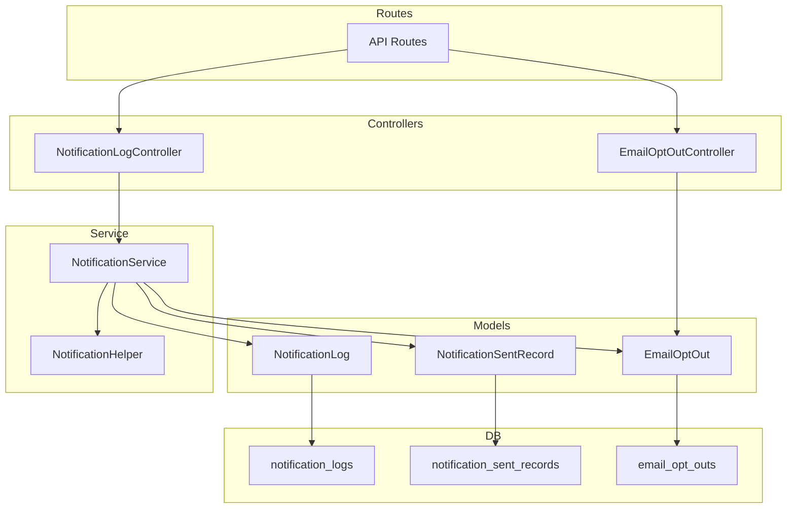
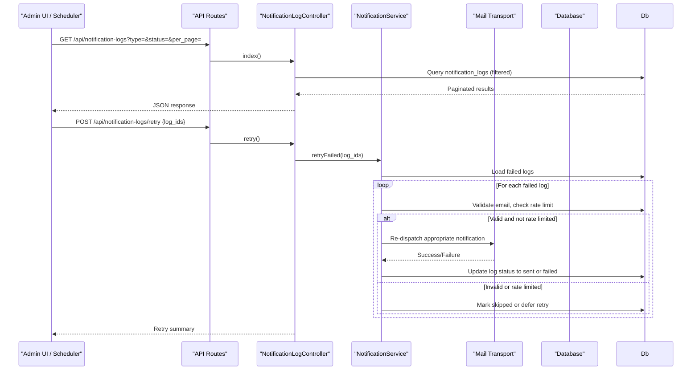
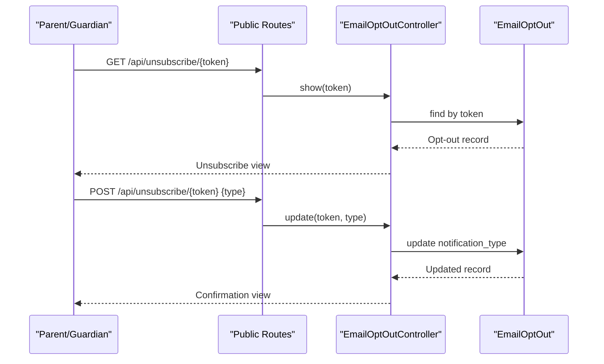
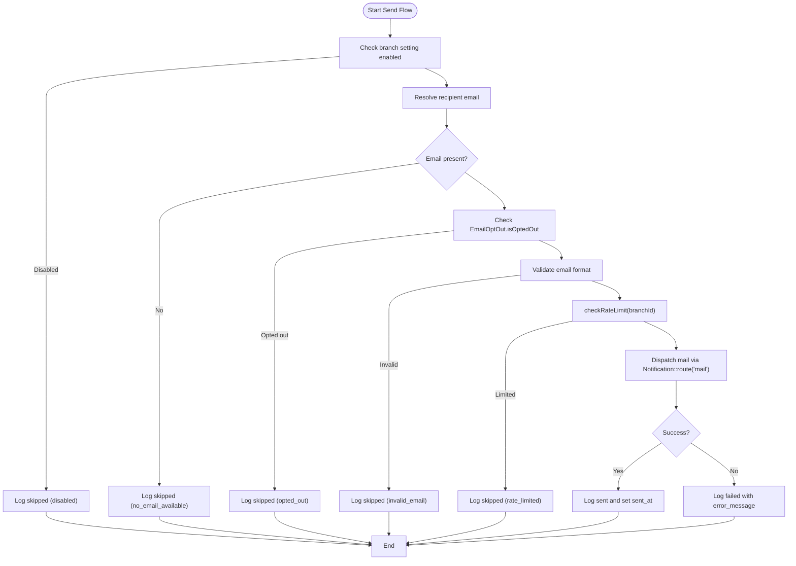
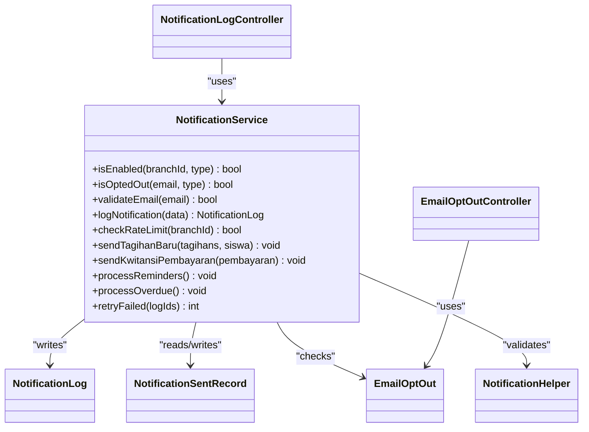

# Notification Logging & Tracking

<cite>
**Referenced Files in This Document**
- [NotificationLog.php](file://backend/app/Models/NotificationLog.php)
- [NotificationSentRecord.php](file://backend/app/Models/NotificationSentRecord.php)
- [EmailOptOut.php](file://backend/app/Models/EmailOptOut.php)
- [NotificationService.php](file://backend/app/Services/Notifications/NotificationService.php)
- [NotificationHelper.php](file://backend/app/Helpers/NotificationHelper.php)
- [NotificationLogController.php](file://backend/app/Http/Controllers/NotificationLogController.php)
- [EmailOptOutController.php](file://backend/app/Http/Controllers/EmailOptOutController.php)
- [KwitansiPembayaranNotification.php](file://backend/app/Notifications/KwitansiPembayaranNotification.php)
- [ReminderJatuhTempoNotification.php](file://backend/app/Notifications/ReminderJatuhTempoNotification.php)
- [TagihanOverdueNotification.php](file://backend/app/Notifications/TagihanOverdueNotification.php)
- [2026_05_27_100200_create_notification_logs_table.php](file://backend/database/migrations/2026_05_27_100200_create_notification_logs_table.php)
- [2026_05_27_100300_create_email_opt_outs_table.php](file://backend/database/migrations/2026_05_27_100300_create_email_opt_outs_table.php)
- [2026_05_27_100400_create_notification_sent_records_table.php](file://backend/database/migrations/2026_05_27_100400_create_notification_sent_records_table.php)
- [api.php](file://backend/routes/api.php)
</cite>

## Update Summary
**Changes Made**
- Updated notification type identifiers from verbose names to standardized forms throughout the documentation
- Corrected reminder processing logic documentation to reflect unified 'reminder' type usage
- Updated all references to notification types in examples and diagrams
- Fixed inconsistencies between service layer and notification class implementations

## Table of Contents
1. Introduction
2. Project Structure
3. Core Components
4. Architecture Overview
5. Detailed Component Analysis
6. Dependency Analysis
7. Performance Considerations
8. Troubleshooting Guide
9. Conclusion

## Introduction
This document explains the notification logging and tracking system used to record delivery attempts, track successful deliveries, and manage user email opt-out preferences. It covers:
- The NotificationLog model for storing delivery attempts, status, and error messages
- The NotificationSentRecord system for preventing duplicate sends and recording timestamps
- The EmailOptOut model for managing unsubscribe requests and preference checks
- Examples of querying history, building analytics, generating reports, and debugging failures via the controller interface
- Log retention considerations, performance guidance for high-volume scenarios, and operational best practices

**Updated** Standardized notification type identifiers have been implemented across the system, changing from verbose names ('kwitansi_pembayaran', 'reminder_jatuh_tempo', 'tagihan_overdue') to simplified forms ('kwitansi', 'reminder', 'overdue').

## Project Structure
The notification subsystem spans models, services, helpers, controllers, migrations, and API routes:
- Models: NotificationLog, NotificationSentRecord, EmailOptOut
- Service: NotificationService (orchestrates sending, logging, deduplication, rate limiting, retry)
- Helper: NotificationHelper (email validation)
- Controllers: NotificationLogController (list logs, retry), EmailOptOutController (unsubscribe flow)
- Migrations: schema definitions for logs, sent records, and opt-outs
- Routes: public unsubscribe endpoints and authenticated log management endpoints

**Diagram sources**
- [NotificationLog.php:1-32](file://backend/app/Models/NotificationLog.php#L1-L32)
- [NotificationSentRecord.php:1-36](file://backend/app/Models/NotificationSentRecord.php#L1-L36)
- [EmailOptOut.php:1-42](file://backend/app/Models/EmailOptOut.php#L1-L42)
- [NotificationService.php:1-713](file://backend/app/Services/Notifications/NotificationService.php#L1-L713)
- [NotificationHelper.php:1-27](file://backend/app/Helpers/NotificationHelper.php#L1-L27)
- [NotificationLogController.php:1-50](file://backend/app/Http/Controllers/NotificationLogController.php#L1-L50)
- [EmailOptOutController.php:1-48](file://backend/app/Http/Controllers/EmailOptOutController.php#L1-L48)
- [api.php:215-217](file://backend/routes/api.php#L215-L217)
- [2026_05_27_100200_create_notification_logs_table.php:1-38](file://backend/database/migrations/2026_05_27_100200_create_notification_logs_table.php#L1-L38)
- [2026_05_27_100400_create_notification_sent_records_table.php:1-33](file://backend/database/migrations/2026_05_27_100400_create_notification_sent_records_table.php#L1-L33)
- [2026_05_27_100300_create_email_opt_outs_table.php:1-33](file://backend/database/migrations/2026_05_27_100300_create_email_opt_outs_table.php#L1-L33)

**Section sources**
- [NotificationLog.php:1-32](file://backend/app/Models/NotificationLog.php#L1-L32)
- [NotificationSentRecord.php:1-36](file://backend/app/Models/NotificationSentRecord.php#L1-L36)
- [EmailOptOut.php:1-42](file://backend/app/Models/EmailOptOut.php#L1-L42)
- [NotificationService.php:1-713](file://backend/app/Services/Notifications/NotificationService.php#L1-L713)
- [NotificationHelper.php:1-27](file://backend/app/Helpers/NotificationHelper.php#L1-L27)
- [NotificationLogController.php:1-50](file://backend/app/Http/Controllers/NotificationLogController.php#L1-L50)
- [EmailOptOutController.php:1-48](file://backend/app/Http/Controllers/EmailOptOutController.php#L1-L48)
- [api.php:215-217](file://backend/routes/api.php#L215-L217)
- [2026_05_27_100200_create_notification_logs_table.php:1-38](file://backend/database/migrations/2026_05_27_100200_create_notification_logs_table.php#L1-L38)
- [2026_05_27_100400_create_notification_sent_records_table.php:1-33](file://backend/database/migrations/2026_05_27_100400_create_notification_sent_records_table.php#L1-L33)
- [2026_05_27_100300_create_email_opt_outs_table.php:1-33](file://backend/database/migrations/2026_05_27_100300_create_email_opt_outs_table.php#L1-L33)

## Core Components
- NotificationLog: Stores per-attempt details including branch, recipient, type, tagihan code, status (sent/failed/skipped), reason, error message, and sent timestamp. Indexed by branch_id, notification_type, status for efficient filtering.
- NotificationSentRecord: Deduplicates notifications by tagihan_kode + notification_type + sent_date with a unique constraint; provides an alreadySent helper to avoid re-sending on the same day or within configured intervals.
- EmailOptOut: Tracks opt-outs per email and notification_type (including 'all'); supports generating signed unsubscribe URLs and checking opt-out status.
- NotificationService: Central orchestration for enabling/disabling notifications per branch, resolving recipients, validating emails, enforcing rate limits, dispatching mail, writing logs, and retrying failed entries.
- NotificationHelper: Provides email validation utility used across the service.
- NotificationLogController: Exposes endpoints to list logs (with filters) and retry failed notifications.
- EmailOptOutController: Handles unsubscribe link display and confirmation updates.

**Updated** All notification types now use standardized identifiers: 'tagihan_baru', 'reminder', 'kwitansi', 'overdue', and 'all'.

**Section sources**
- [NotificationLog.php:1-32](file://backend/app/Models/NotificationLog.php#L1-L32)
- [NotificationSentRecord.php:1-36](file://backend/app/Models/NotificationSentRecord.php#L1-L36)
- [EmailOptOut.php:1-42](file://backend/app/Models/EmailOptOut.php#L1-L42)
- [NotificationService.php:1-713](file://backend/app/Services/Notifications/NotificationService.php#L1-L713)
- [NotificationHelper.php:1-27](file://backend/app/Helpers/NotificationHelper.php#L1-L27)
- [NotificationLogController.php:1-50](file://backend/app/Http/Controllers/NotificationLogController.php#L1-L50)
- [EmailOptOutController.php:1-48](file://backend/app/Http/Controllers/EmailOptOutController.php#L1-L48)

## Architecture Overview
High-level flow:
- Business triggers (e.g., new bill, payment recorded, scheduled reminders/overdue jobs) call NotificationService methods.
- NotificationService performs checks (branch settings, opt-out, email validity, rate limit), then dispatches mail and writes a NotificationLog entry.
- For reminders and overdue flows, NotificationSentRecord prevents duplicates based on date or interval rules.
- Admins can query logs and retry failed entries via NotificationLogController.
- Users can unsubscribe via EmailOptOutController using tokens generated by EmailOptOut.

**Diagram sources**
- [api.php:215-217](file://backend/routes/api.php#L215-L217)
- [NotificationLogController.php:1-50](file://backend/app/Http/Controllers/NotificationLogController.php#L1-L50)
- [NotificationService.php:586-713](file://backend/app/Services/Notifications/NotificationService.php#L586-L713)

## Detailed Component Analysis

### NotificationLog Model
- Purpose: Persist every attempt to send a notification with outcome and context.
- Key fields: branch_id, recipient_email, notification_type, tagihan_kode, status, reason, error_message, sent_at.
- Indexing: Composite index on (branch_id, notification_type, status) supports fast admin queries and analytics.
- Relationship: Belongs to Branch for multi-tenant scoping.

Operational usage:
- Write on success/failure/skip during all send paths.
- Read via controller for admin dashboards and reporting.

**Updated** Notification types are now standardized: 'tagihan_baru', 'reminder', 'kwitansi', 'overdue'.

**Section sources**
- [NotificationLog.php:1-32](file://backend/app/Models/NotificationLog.php#L1-L32)
- [2026_05_27_100200_create_notification_logs_table.php:1-38](file://backend/database/migrations/2026_05_27_100200_create_notification_logs_table.php#L1-L38)

### NotificationSentRecord System
- Purpose: Prevent duplicate notifications for the same tagihan and type on a given date (reminders) or enforce interval-based throttling (overdue).
- Unique constraint: (tagihan_kode, notification_type, sent_date).
- Helper: alreadySent(tagihanKode, notificationType, date?) returns boolean.

Usage patterns:
- Reminders: Check before sending; create record after successful send using unified 'reminder' type.
- Overdue: Check last sent date vs configured interval; create record when sending using 'overdue' type.

**Updated** Reminder processing now uses a single 'reminder' type instead of dynamic day-based types like 'reminder_{$daysBefore}d'.

**Section sources**
- [NotificationSentRecord.php:1-36](file://backend/app/Models/NotificationSentRecord.php#L1-L36)
- [2026_05_27_100400_create_notification_sent_records_table.php:1-33](file://backend/database/migrations/2026_05_27_100400_create_notification_sent_records_table.php#L1-L33)
- [NotificationService.php:324-448](file://backend/app/Services/Notifications/NotificationService.php#L324-L448)
- [NotificationService.php:454-584](file://backend/app/Services/Notifications/NotificationService.php#L454-L584)

### EmailOptOut Model and Flow
- Purpose: Manage user unsubscribe preferences per email and notification type (including 'all').
- Methods:
  - isOptedOut(email, type): true if opted out for specific type or 'all'.
  - generateUnsubscribeUrl(email, type='all'): creates or finds record and returns URL with token.
- Controller:
  - show(token): renders unsubscribe page with current preference.
  - update(token, type): validates allowed types and persists updated preference.

**Updated** Valid notification types for opt-out are now: 'tagihan_baru', 'reminder', 'kwitansi', 'overdue', 'all'.

**Diagram sources**
- [EmailOptOut.php:1-42](file://backend/app/Models/EmailOptOut.php#L1-L42)
- [EmailOptOutController.php:1-48](file://backend/app/Http/Controllers/EmailOptOutController.php#L1-L48)
- [api.php:44-45](file://backend/routes/api.php#L44-L45)
- [2026_05_27_100300_create_email_opt_outs_table.php:1-33](file://backend/database/migrations/2026_05_27_100300_create_email_opt_outs_table.php#L1-L33)

**Section sources**
- [EmailOptOut.php:1-42](file://backend/app/Models/EmailOptOut.php#L1-L42)
- [EmailOptOutController.php:1-48](file://backend/app/Http/Controllers/EmailOptOutController.php#L1-L48)
- [api.php:44-45](file://backend/routes/api.php#L44-L45)
- [2026_05_27_100300_create_email_opt_outs_table.php:1-33](file://backend/database/migrations/2026_05_27_100300_create_email_opt_outs_table.php#L1-L33)

### NotificationService Orchestration
Responsibilities:
- Enable/disable notifications per branch based on settings.
- Resolve recipients and validate emails.
- Enforce per-branch rate limits (max 100 emails per hour).
- Dispatch mail and write logs for sent/failed/skipped outcomes.
- Deduplicate reminders and throttle overdue notifications using NotificationSentRecord.
- Retry failed notifications by ID with proper re-dispatch logic.

Key flows:
- sendTagihanBaru(Collection, Siswa)
- sendKwitansiPembayaran(Pembayaran)
- processReminders()
- processOverdue()
- retryFailed(array $logIds)

**Updated** All notification type references now use standardized identifiers throughout the service methods.

**Diagram sources**
- [NotificationService.php:109-210](file://backend/app/Services/Notifications/NotificationService.php#L109-L210)
- [NotificationService.php:215-318](file://backend/app/Services/Notifications/NotificationService.php#L215-L318)
- [NotificationService.php:324-448](file://backend/app/Services/Notifications/NotificationService.php#L324-L448)
- [NotificationService.php:454-584](file://backend/app/Services/Notifications/NotificationService.php#L454-L584)
- [NotificationHelper.php:1-27](file://backend/app/Helpers/NotificationHelper.php#L1-L27)

**Section sources**
- [NotificationService.php:1-713](file://backend/app/Services/Notifications/NotificationService.php#L1-L713)
- [NotificationHelper.php:1-27](file://backend/app/Helpers/NotificationHelper.php#L1-L27)

### NotificationLogController Interface
Endpoints:
- GET /api/notification-logs: Lists logs filtered by type/status, scoped to the authenticated user's branch, paginated.
- POST /api/notification-logs/retry: Accepts array of log IDs, retries failed notifications via NotificationService.retryFailed.

Security and scope:
- Requires authentication (Sanctum).
- Filters logs by Auth::user()->branch_id to ensure branch isolation.

**Updated** Filter parameters now support standardized notification types: 'tagihan_baru', 'reminder', 'kwitansi', 'overdue'.

**Section sources**
- [NotificationLogController.php:1-50](file://backend/app/Http/Controllers/NotificationLogController.php#L1-L50)
- [api.php:215-217](file://backend/routes/api.php#L215-L217)

## Dependency Analysis
- NotificationService depends on:
  - EmailOptOut (opt-out checks)
  - NotificationLog (write logs)
  - NotificationSentRecord (dedupe/intervals)
  - NotificationSetting (branch enablement and schedules)
  - RecipientResolver (resolve parent/guardian email)
  - NotificationHelper (email validation)
  - Laravel Notification facade (dispatch mail)
  - RateLimiter (per-branch throttling)
- Controllers depend on their respective models/services.
- Routes expose both authenticated and public endpoints.

**Updated** Class diagram reflects standardized notification type usage throughout the system.

**Diagram sources**
- [NotificationService.php:1-713](file://backend/app/Services/Notifications/NotificationService.php#L1-L713)
- [NotificationLog.php:1-32](file://backend/app/Models/NotificationLog.php#L1-L32)
- [NotificationSentRecord.php:1-36](file://backend/app/Models/NotificationSentRecord.php#L1-L36)
- [EmailOptOut.php:1-42](file://backend/app/Models/EmailOptOut.php#L1-L42)
- [NotificationHelper.php:1-27](file://backend/app/Helpers/NotificationHelper.php#L1-L27)
- [NotificationLogController.php:1-50](file://backend/app/Http/Controllers/NotificationLogController.php#L1-L50)
- [EmailOptOutController.php:1-48](file://backend/app/Http/Controllers/EmailOptOutController.php#L1-L48)

**Section sources**
- [NotificationService.php:1-713](file://backend/app/Services/Notifications/NotificationService.php#L1-L713)
- [NotificationLogController.php:1-50](file://backend/app/Http/Controllers/NotificationLogController.php#L1-L50)
- [EmailOptOutController.php:1-48](file://backend/app/Http/Controllers/EmailOptOutController.php#L1-L48)

## Performance Considerations
- Indexing:
  - notification_logs has a composite index on (branch_id, notification_type, status) to support fast filtering and pagination.
- Rate Limiting:
  - Per-branch limiter at 100 emails/hour reduces load spikes and protects downstream mail providers.
- Deduplication:
  - Unique constraints on notification_sent_records prevent duplicate sends and reduce unnecessary work.
- Batch Processing:
  - Reminder and overdue processors iterate over sets; consider running as queued jobs or with chunking for large datasets.
- Pagination:
  - Logs endpoint uses pagination to keep responses small and responsive.

**Updated** Standardized notification types improve query performance by reducing type variations and improving index efficiency.

## Troubleshooting Guide
Common issues and how to investigate:
- Failed deliveries:
  - Use GET /api/notification-logs?status=failed&type=<type> to identify failures.
  - Inspect error_message and reason fields to determine root cause (invalid email, opt-out, rate limited, transport errors).
- Manual retry:
  - POST /api/notification-logs/retry with { log_ids: [...] } to re-dispatch selected failed logs.
  - The service validates email and rate limits before retrying and updates log status accordingly.
- Opt-out verification:
  - Confirm that EmailOptOut contains entries for the affected email/type; use EmailOptOut.isOptedOut(email, type) logic to verify.
- Duplicate prevention:
  - For reminders and overdue, check NotificationSentRecord to ensure no existing record exists for the same tagihan_kode + type + date or within interval.

**Updated** When troubleshooting, use standardized notification types: 'tagihan_baru', 'reminder', 'kwitansi', 'overdue'.

Operational tips:
- Ensure queue workers are running so mail dispatch proceeds asynchronously.
- Monitor rate limiter hits to detect capacity constraints.
- Add additional indexes if you frequently filter by created_at ranges or tagihan_kode.

**Section sources**
- [NotificationLogController.php:15-48](file://backend/app/Http/Controllers/NotificationLogController.php#L15-L48)
- [NotificationService.php:586-713](file://backend/app/Services/Notifications/NotificationService.php#L586-L713)
- [EmailOptOut.php:22-27](file://backend/app/Models/EmailOptOut.php#L22-L27)
- [NotificationSentRecord.php:26-34](file://backend/app/Models/NotificationSentRecord.php#L26-L34)

## Conclusion
The notification logging and tracking system provides robust observability and control:
- Every attempt is logged with actionable details for analysis and recovery.
- Successful deliveries are tracked to prevent duplicates and enforce scheduling policies.
- User preferences are respected through opt-out mechanisms.
- Admin interfaces allow inspection and remediation of failures.
Adhering to the performance and retention recommendations will help maintain reliability under high volume.

**Updated** The recent standardization of notification type identifiers improves system consistency, query performance, and maintainability while preserving all existing functionality.