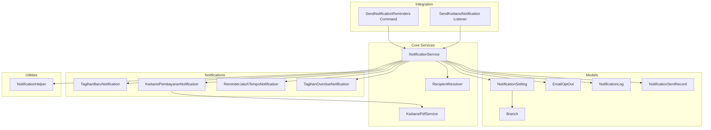
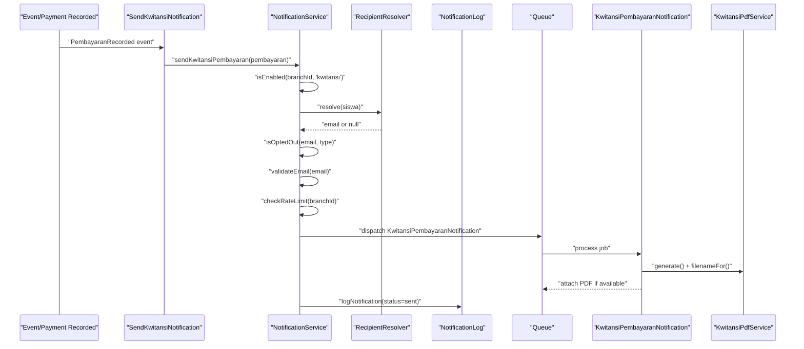
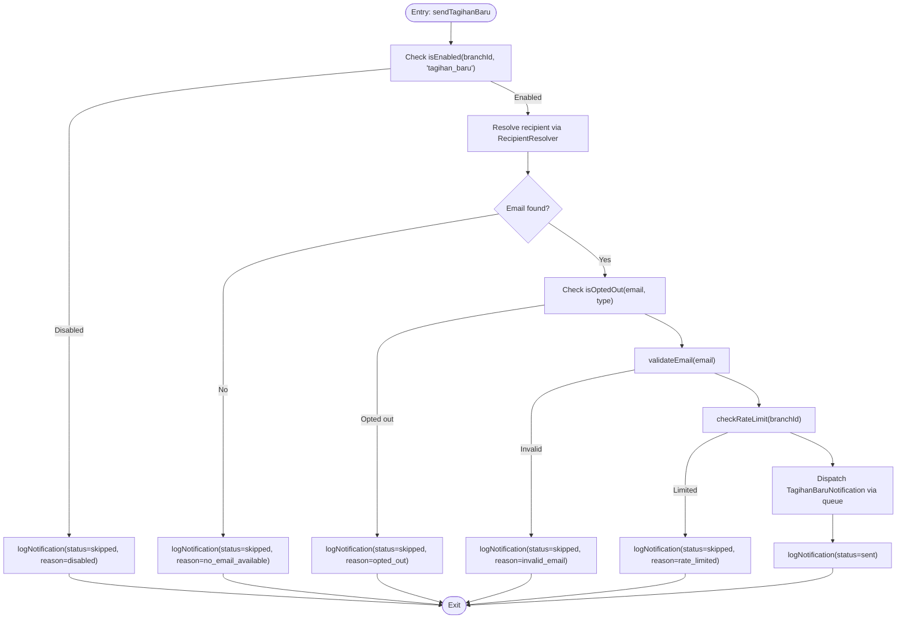
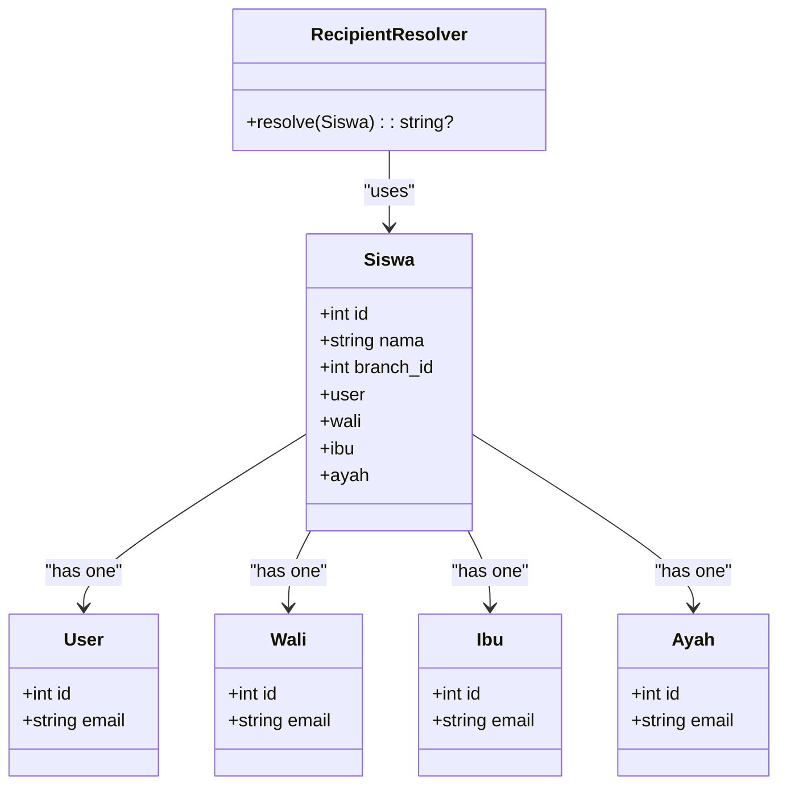
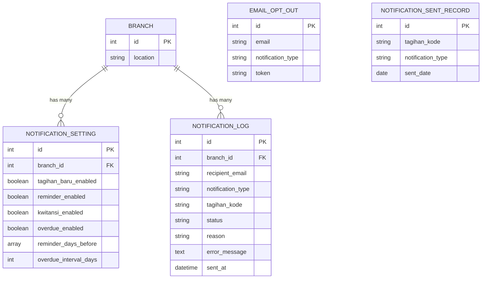
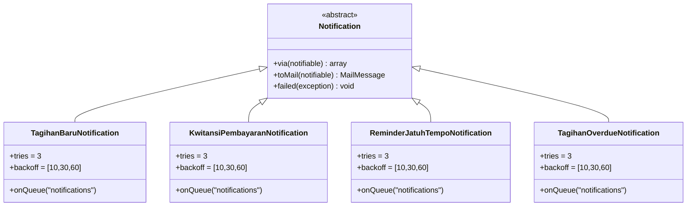
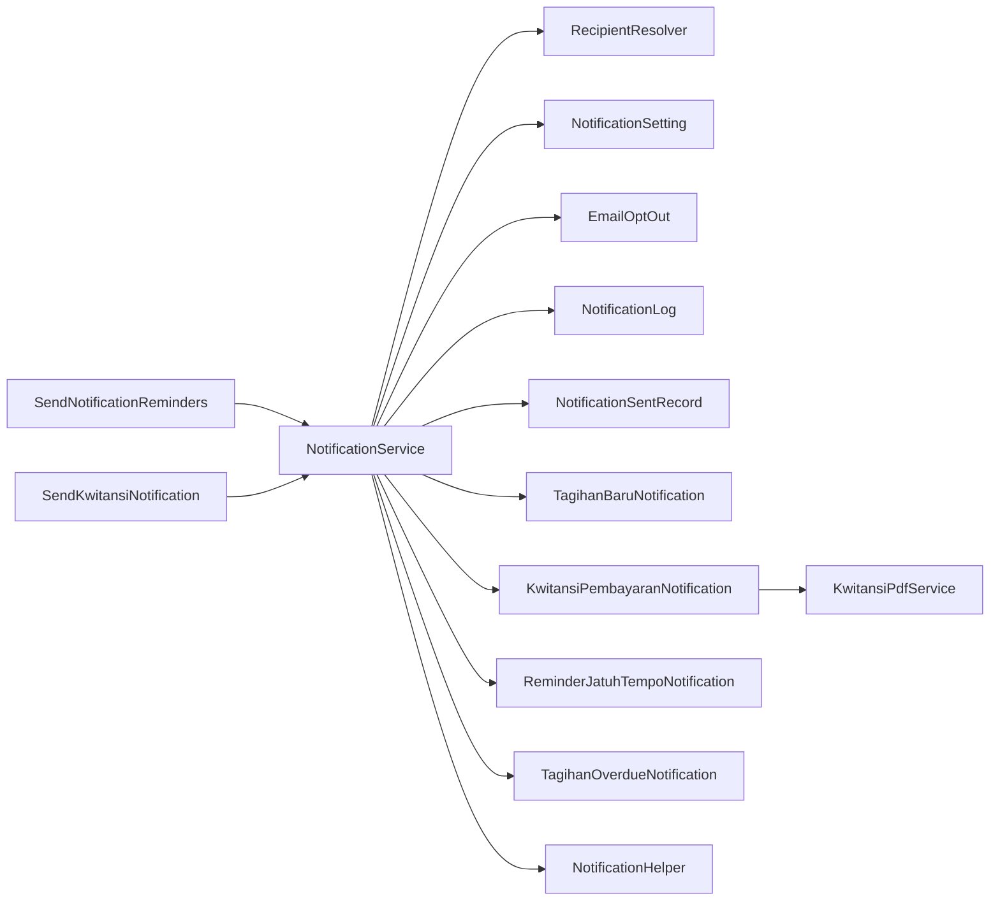

# Notification Architecture & Services

<cite>
**Referenced Files in This Document**
- [NotificationService.php](file://backend/app/Services/Notifications/NotificationService.php)
- [RecipientResolver.php](file://backend/app/Services/Notifications/RecipientResolver.php)
- [NotificationHelper.php](file://backend/app/Helpers/NotificationHelper.php)
- [NotificationSetting.php](file://backend/app/Models/NotificationSetting.php)
- [EmailOptOut.php](file://backend/app/Models/EmailOptOut.php)
- [NotificationLog.php](file://backend/app/Models/NotificationLog.php)
- [NotificationSentRecord.php](file://backend/app/Models/NotificationSentRecord.php)
- [Branch.php](file://backend/app/Models/Branch.php)
- [TagihanBaruNotification.php](file://backend/app/Notifications/TagihanBaruNotification.php)
- [KwitansiPembayaranNotification.php](file://backend/app/Notifications/KwitansiPembayaranNotification.php)
- [ReminderJatuhTempoNotification.php](file://backend/app/Notifications/ReminderJatuhTempoNotification.php)
- [TagihanOverdueNotification.php](file://backend/app/Notifications/TagihanOverdueNotification.php)
- [KwitansiPdfService.php](file://backend/app/Services/Notifications/KwitansiPdfService.php)
- [SendNotificationReminders.php](file://backend/app/Console/Commands/SendNotificationReminders.php)
- [SendKwitansiNotification.php](file://backend/app/Listeners/SendKwitansiNotification.php)
</cite>

## Table of Contents
1. Introduction
2. Project Structure
3. Core Components
4. Architecture Overview
5. Detailed Component Analysis
6. Dependency Analysis
7. Performance Considerations
8. Troubleshooting Guide
9. Conclusion

## Introduction
This document explains the notification system architecture and core services that orchestrate email delivery across branches. It focuses on:
- The NotificationService abstraction layer for branch-level configuration, recipient resolution, email validation, rate limiting, deduplication, logging, retries, and error handling.
- The RecipientResolver service that determines optimal recipients from student family relationships (wali, ibu, ayah) and linked user accounts.
- The NotificationHelper utility functions for email validation and common formatting operations.
- Practical guidance to extend channels, implement custom recipient logic, and configure branch-specific settings.
- Performance considerations, caching strategies, and scalability patterns used in the pipeline.

## Project Structure
The notification subsystem is implemented as a set of cohesive services, models, notifications, helpers, listeners, and console commands:
- Services: NotificationService orchestrates flows; RecipientResolver resolves recipients; KwitansiPdfService generates PDF attachments.
- Models: NotificationSetting, EmailOptOut, NotificationLog, NotificationSentRecord, Branch define configuration, preferences, audit logs, and deduplication records.
- Notifications: TagihanBaruNotification, KwitansiPembayaranNotification, ReminderJatuhTempoNotification, TagihanOverdueNotification implement queued mail delivery with retry/backoff and failure callbacks.
- Helpers: NotificationHelper provides email validation and formatting utilities.
- Integration points: SendKwitansiNotification listener reacts to payment events; SendNotificationReminders command triggers reminder and overdue processing.

**Diagram sources**
- [NotificationService.php:24-104](file://backend/app/Services/Notifications/NotificationService.php#L24-L104)
- [RecipientResolver.php:7-45](file://backend/app/Services/Notifications/RecipientResolver.php#L7-L45)
- [KwitansiPdfService.php:19-66](file://backend/app/Services/Notifications/KwitansiPdfService.php#L19-L66)
- [NotificationSetting.php:8-35](file://backend/app/Models/NotificationSetting.php#L8-L35)
- [EmailOptOut.php:8-41](file://backend/app/Models/EmailOptOut.php#L8-L41)
- [NotificationLog.php:8-31](file://backend/app/Models/NotificationLog.php#L8-L31)
- [NotificationSentRecord.php:8-35](file://backend/app/Models/NotificationSentRecord.php#L8-L35)
- [Branch.php:8-63](file://backend/app/Models/Branch.php#L8-L63)
- [TagihanBaruNotification.php:13-60](file://backend/app/Notifications/TagihanBaruNotification.php#L13-L60)
- [KwitansiPembayaranNotification.php:13-80](file://backend/app/Notifications/KwitansiPembayaranNotification.php#L13-L80)
- [ReminderJatuhTempoNotification.php:13-60](file://backend/app/Notifications/ReminderJatuhTempoNotification.php#L13-L60)
- [TagihanOverdueNotification.php:13-60](file://backend/app/Notifications/TagihanOverdueNotification.php#L13-L60)
- [SendNotificationReminders.php:8-24](file://backend/app/Console/Commands/SendNotificationReminders.php#L8-L24)
- [SendKwitansiNotification.php:9-19](file://backend/app/Listeners/SendKwitansiNotification.php#L9-L19)
- [NotificationHelper.php:5-26](file://backend/app/Helpers/NotificationHelper.php#L5-L26)

**Section sources**
- [NotificationService.php:24-104](file://backend/app/Services/Notifications/NotificationService.php#L24-L104)
- [RecipientResolver.php:7-45](file://backend/app/Services/Notifications/RecipientResolver.php#L7-L45)
- [NotificationHelper.php:5-26](file://backend/app/Helpers/NotificationHelper.php#L5-L26)
- [NotificationSetting.php:8-35](file://backend/app/Models/NotificationSetting.php#L8-L35)
- [EmailOptOut.php:8-41](file://backend/app/Models/EmailOptOut.php#L8-L41)
- [NotificationLog.php:8-31](file://backend/app/Models/NotificationLog.php#L8-L31)
- [NotificationSentRecord.php:8-35](file://backend/app/Models/NotificationSentRecord.php#L8-L35)
- [Branch.php:8-63](file://backend/app/Models/Branch.php#L8-L63)
- [TagihanBaruNotification.php:13-60](file://backend/app/Notifications/TagihanBaruNotification.php#L13-L60)
- [KwitansiPembayaranNotification.php:13-80](file://backend/app/Notifications/KwitansiPembayaranNotification.php#L13-L80)
- [ReminderJatuhTempoNotification.php:13-60](file://backend/app/Notifications/ReminderJatuhTempoNotification.php#L13-L60)
- [TagihanOverdueNotification.php:13-60](file://backend/app/Notifications/TagihanOverdueNotification.php#L13-L60)
- [KwitansiPdfService.php:19-66](file://backend/app/Services/Notifications/KwitansiPdfService.php#L19-L66)
- [SendNotificationReminders.php:8-24](file://backend/app/Console/Commands/SendNotificationReminders.php#L8-L24)
- [SendKwitansiNotification.php:9-19](file://backend/app/Listeners/SendKwitansiNotification.php#L9-L19)

## Core Components
- NotificationService: Central orchestrator providing:
  - Branch-level enablement checks per notification type.
  - Opt-out checks via EmailOptOut.
  - Email validation via NotificationHelper.
  - Rate limiting per branch using Laravel’s RateLimiter.
  - Logging via NotificationLog.
  - Deduplication via NotificationSentRecord for reminders and overdue.
  - Retry mechanism for failed logs.
  - Dispatching to queued notifications.
- RecipientResolver: Resolves the best email address by priority:
  - Student’s linked user account email.
  - Wali (guardian).
  - Ibu (mother).
  - Ayah (father).
- NotificationHelper: Utility methods for email validation and currency formatting.
- KwitansiPdfService: Generates receipt PDFs attached to payment confirmation emails.
- Notification classes: Queued mail notifications with retry/backoff and failure callbacks updating logs.
- Integration:
  - SendKwitansiNotification listener triggers kwitansi email upon payment recorded.
  - SendNotificationReminders command runs reminder and overdue processing.

**Section sources**
- [NotificationService.php:24-104](file://backend/app/Services/Notifications/NotificationService.php#L24-L104)
- [RecipientResolver.php:7-45](file://backend/app/Services/Notifications/RecipientResolver.php#L7-L45)
- [NotificationHelper.php:5-26](file://backend/app/Helpers/NotificationHelper.php#L5-L26)
- [KwitansiPdfService.php:19-66](file://backend/app/Services/Notifications/KwitansiPdfService.php#L19-L66)
- [TagihanBaruNotification.php:13-60](file://backend/app/Notifications/TagihanBaruNotification.php#L13-L60)
- [KwitansiPembayaranNotification.php:13-80](file://backend/app/Notifications/KwitansiPembayaranNotification.php#L13-L80)
- [ReminderJatuhTempoNotification.php:13-60](file://backend/app/Notifications/ReminderJatuhTempoNotification.php#L13-L60)
- [TagihanOverdueNotification.php:13-60](file://backend/app/Notifications/TagihanOverdueNotification.php#L13-L60)
- [SendKwitansiNotification.php:9-19](file://backend/app/Listeners/SendKwitansiNotification.php#L9-L19)
- [SendNotificationReminders.php:8-24](file://backend/app/Console/Commands/SendNotificationReminders.php#L8-L24)

## Architecture Overview
The notification pipeline follows a consistent flow:
- Entry points:
  - Event-driven: Payment recorded triggers kwitansi email.
  - Scheduled: Reminders and overdue processing run via command.
- Orchestration:
  - NotificationService validates configuration, resolves recipients, applies opt-outs, validates emails, enforces rate limits, and dispatches queued notifications.
- Delivery:
  - Queued notifications render views and optionally attach PDFs.
- Observability:
  - Logs capture sent/skipped/failed states.
  - Sent records prevent duplicates within configured windows.

**Diagram sources**
- [SendKwitansiNotification.php:9-19](file://backend/app/Listeners/SendKwitansiNotification.php#L9-L19)
- [NotificationService.php:215-318](file://backend/app/Services/Notifications/NotificationService.php#L215-L318)
- [RecipientResolver.php:7-45](file://backend/app/Services/Notifications/RecipientResolver.php#L7-L45)
- [KwitansiPembayaranNotification.php:13-80](file://backend/app/Notifications/KwitansiPembayaranNotification.php#L13-L80)
- [KwitansiPdfService.php:19-66](file://backend/app/Services/Notifications/KwitansiPdfService.php#L19-L66)
- [NotificationLog.php:8-31](file://backend/app/Models/NotificationLog.php#L8-L31)

## Detailed Component Analysis

### NotificationService Abstraction Layer
Responsibilities:
- Branch-level configuration: isEnabled(type) reads NotificationSetting flags per branch.
- Opt-out enforcement: isOptedOut(email, type) consults EmailOptOut.
- Email validation: validateEmail(email) delegates to NotificationHelper.
- Rate limiting: checkRateLimit(branchId) uses a per-branch counter with a 1-hour window.
- Logging: logNotification writes NotificationLog entries with status and reasons.
- Deduplication: processReminders and processOverdue use NotificationSentRecord to avoid duplicate sends.
- Retry: retryFailed re-dispatches based on stored metadata and updates logs.

Key flows:
- sendTagihanBaru: Validates config, resolves recipient, checks opt-out/email/rate limit, dispatches TagihanBaruNotification, logs result.
- sendKwitansiPembayaran: Similar flow for payment receipts, integrates PDF attachment via KwitansiPdfService.
- processReminders: Iterates enabled branches, computes target dates from reminder_days_before, queries due tagihans, resolves recipients, prevents duplicates, dispatches ReminderJatuhTempoNotification, records sent.
- processOverdue: Iterates enabled branches, finds past-due tagihans, respects overdue_interval_days, dispatches TagihanOverdueNotification, records sent.
- retryFailed: Re-validates and re-dispatches failed logs respecting rate limits.

**Diagram sources**
- [NotificationService.php:109-210](file://backend/app/Services/Notifications/NotificationService.php#L109-L210)
- [RecipientResolver.php:7-45](file://backend/app/Services/Notifications/RecipientResolver.php#L7-L45)
- [NotificationHelper.php:5-26](file://backend/app/Helpers/NotificationHelper.php#L5-L26)
- [NotificationLog.php:8-31](file://backend/app/Models/NotificationLog.php#L8-L31)

**Section sources**
- [NotificationService.php:33-96](file://backend/app/Services/Notifications/NotificationService.php#L33-L96)
- [NotificationService.php:109-210](file://backend/app/Services/Notifications/NotificationService.php#L109-L210)
- [NotificationService.php:215-318](file://backend/app/Services/Notifications/NotificationService.php#L215-L318)
- [NotificationService.php:324-448](file://backend/app/Services/Notifications/NotificationService.php#L324-L448)
- [NotificationService.php:454-584](file://backend/app/Services/Notifications/NotificationService.php#L454-L584)
- [NotificationService.php:592-711](file://backend/app/Services/Notifications/NotificationService.php#L592-L711)

### RecipientResolver Service
Determines the optimal recipient email for a student with clear priority:
1. Linked user account email (via siswa.user).
2. Wali (guardian) email.
3. Ibu (mother) email.
4. Ayah (father) email.
Returns null if none are available.

**Diagram sources**
- [RecipientResolver.php:7-45](file://backend/app/Services/Notifications/RecipientResolver.php#L7-L45)

**Section sources**
- [RecipientResolver.php:7-45](file://backend/app/Services/Notifications/RecipientResolver.php#L7-L45)

### NotificationHelper Utilities
- isValidEmail(email): Validates non-empty trimmed email using standard filter.
- formatRupiah(amount): Formats numeric amounts as Indonesian Rupiah strings.

These helpers are used by NotificationService for validation and formatting needs.

**Section sources**
- [NotificationHelper.php:5-26](file://backend/app/Helpers/NotificationHelper.php#L5-L26)

### Notification Models and Configuration
- NotificationSetting: Per-branch toggles and schedules for new invoices, reminders, receipts, and overdue notices; includes arrays and integers for scheduling parameters.
- EmailOptOut: Tracks unsubscribe preferences per email and notification type; supports “all” to block all types.
- NotificationLog: Audit trail for each attempt with status, reason, error messages, and timestamps.
- NotificationSentRecord: Deduplication table keyed by invoice code and notification type with date.
- Branch: Root entity for multi-branch isolation of settings and data.

**Diagram sources**
- [NotificationSetting.php:8-35](file://backend/app/Models/NotificationSetting.php#L8-L35)
- [EmailOptOut.php:8-41](file://backend/app/Models/EmailOptOut.php#L8-L41)
- [NotificationLog.php:8-31](file://backend/app/Models/NotificationLog.php#L8-L31)
- [NotificationSentRecord.php:8-35](file://backend/app/Models/NotificationSentRecord.php#L8-L35)
- [Branch.php:8-63](file://backend/app/Models/Branch.php#L8-L63)

**Section sources**
- [NotificationSetting.php:8-35](file://backend/app/Models/NotificationSetting.php#L8-L35)
- [EmailOptOut.php:8-41](file://backend/app/Models/EmailOptOut.php#L8-L41)
- [NotificationLog.php:8-31](file://backend/app/Models/NotificationLog.php#L8-L31)
- [NotificationSentRecord.php:8-35](file://backend/app/Models/NotificationSentRecord.php#L8-L35)
- [Branch.php:8-63](file://backend/app/Models/Branch.php#L8-L63)

### Notification Classes (Queued Mail)
All notification classes implement ShouldQueue and use Queueable with:
- tries = 3
- backoff = [10, 30, 60] seconds
- onQueue('notifications')
- toMail renders Blade templates with context and unsubscribe links.
- failed callback updates the latest matching NotificationLog entry to failed with error message.

Specifics:
- TagihanBaruNotification: Sends new invoice list for a student.
- KwitansiPembayaranNotification: Sends payment receipt with optional PDF attachment generated by KwitansiPdfService.
- ReminderJatuhTempoNotification: Sends upcoming due reminders with daysBefore context.
- TagihanOverdueNotification: Sends overdue notices with daysOverdue context.

**Diagram sources**
- [TagihanBaruNotification.php:13-60](file://backend/app/Notifications/TagihanBaruNotification.php#L13-L60)
- [KwitansiPembayaranNotification.php:13-80](file://backend/app/Notifications/KwitansiPembayaranNotification.php#L13-L80)
- [ReminderJatuhTempoNotification.php:13-60](file://backend/app/Notifications/ReminderJatuhTempoNotification.php#L13-L60)
- [TagihanOverdueNotification.php:13-60](file://backend/app/Notifications/TagihanOverdueNotification.php#L13-L60)

**Section sources**
- [TagihanBaruNotification.php:13-60](file://backend/app/Notifications/TagihanBaruNotification.php#L13-L60)
- [KwitansiPembayaranNotification.php:13-80](file://backend/app/Notifications/KwitansiPembayaranNotification.php#L13-L80)
- [ReminderJatuhTempoNotification.php:13-60](file://backend/app/Notifications/ReminderJatuhTempoNotification.php#L13-L60)
- [TagihanOverdueNotification.php:13-60](file://backend/app/Notifications/TagihanOverdueNotification.php#L13-L60)

### KwitansiPdfService
Generates receipt PDFs consistently with admin panel output by reusing controller resource data and rendering the same view. Integrates app settings into the PDF payload.

**Section sources**
- [KwitansiPdfService.php:19-66](file://backend/app/Services/Notifications/KwitansiPdfService.php#L19-L66)

### Integration Points
- SendKwitansiNotification Listener: Reacts to PembayaranRecorded events and invokes NotificationService.sendKwitansiPembayaran.
- SendNotificationReminders Command: Triggers NotificationService.processReminders and processOverdue for scheduled runs.

**Section sources**
- [SendKwitansiNotification.php:9-19](file://backend/app/Listeners/SendKwitansiNotification.php#L9-L19)
- [SendNotificationReminders.php:8-24](file://backend/app/Console/Commands/SendNotificationReminders.php#L8-L24)

## Dependency Analysis
High-level dependencies:
- NotificationService depends on:
  - RecipientResolver for recipient selection.
  - NotificationSetting for branch toggles and schedules.
  - EmailOptOut for unsubscribe checks.
  - NotificationLog for audit trails.
  - NotificationSentRecord for deduplication.
  - Notification classes for delivery.
  - NotificationHelper for validation/formatting.
  - Laravel RateLimiter for throttling.
- KwitansiPembayaranNotification depends on KwitansiPdfService for PDF generation.
- Commands and Listeners depend on NotificationService to coordinate flows.

**Diagram sources**
- [NotificationService.php:24-104](file://backend/app/Services/Notifications/NotificationService.php#L24-L104)
- [RecipientResolver.php:7-45](file://backend/app/Services/Notifications/RecipientResolver.php#L7-L45)
- [NotificationSetting.php:8-35](file://backend/app/Models/NotificationSetting.php#L8-L35)
- [EmailOptOut.php:8-41](file://backend/app/Models/EmailOptOut.php#L8-L41)
- [NotificationLog.php:8-31](file://backend/app/Models/NotificationLog.php#L8-L31)
- [NotificationSentRecord.php:8-35](file://backend/app/Models/NotificationSentRecord.php#L8-L35)
- [TagihanBaruNotification.php:13-60](file://backend/app/Notifications/TagihanBaruNotification.php#L13-L60)
- [KwitansiPembayaranNotification.php:13-80](file://backend/app/Notifications/KwitansiPembayaranNotification.php#L13-L80)
- [ReminderJatuhTempoNotification.php:13-60](file://backend/app/Notifications/ReminderJatuhTempoNotification.php#L13-L60)
- [TagihanOverdueNotification.php:13-60](file://backend/app/Notifications/TagihanOverdueNotification.php#L13-L60)
- [KwitansiPdfService.php:19-66](file://backend/app/Services/Notifications/KwitansiPdfService.php#L19-L66)
- [SendNotificationReminders.php:8-24](file://backend/app/Console/Commands/SendNotificationReminders.php#L8-L24)
- [SendKwitansiNotification.php:9-19](file://backend/app/Listeners/SendKwitansiNotification.php#L9-L19)

**Section sources**
- [NotificationService.php:24-104](file://backend/app/Services/Notifications/NotificationService.php#L24-L104)
- [KwitansiPembayaranNotification.php:13-80](file://backend/app/Notifications/KwitansiPembayaranNotification.php#L13-L80)
- [SendNotificationReminders.php:8-24](file://backend/app/Console/Commands/SendNotificationReminders.php#L8-L24)
- [SendKwitansiNotification.php:9-19](file://backend/app/Listeners/SendKwitansiNotification.php#L9-L19)

## Performance Considerations
- Rate Limiting: Per-branch throttling at 100 emails per hour reduces external provider pressure and protects deliverability.
- Deduplication: NotificationSentRecord prevents repeated sends for reminders and overdue within configured windows.
- Queuing: All notifications are queued on the 'notifications' queue with exponential backoff to handle transient failures gracefully.
- Batch Processing: processReminders and processOverdue iterate enabled branches and pre-load relationships to minimize N+1 queries.
- PDF Generation: KwitansiPdfService reuses existing controller resources and a single view to reduce duplication and potential divergence.

[No sources needed since this section provides general guidance]

## Troubleshooting Guide
Common issues and diagnostics:
- Skipped due to disabled branch setting: Check NotificationSetting flags for the branch and notification type.
- No email available: Ensure student has a linked user or parent record with an email.
- Opted out: Verify EmailOptOut entries for the email and notification type.
- Invalid email: Use NotificationHelper validation rules to ensure correct format.
- Rate limited: Reduce burst volume or increase time window; monitor RateLimiter keys.
- Failed delivery: Inspect NotificationLog for error messages; use retryFailed to reattempt.
- Duplicate reminders/overdue: Confirm NotificationSentRecord entries and interval configurations.

Operational tips:
- Use SendNotificationReminders command to trigger batch processing.
- Monitor queues and workers for the 'notifications' queue.
- Review logs and sent records to identify bottlenecks and anomalies.

**Section sources**
- [NotificationService.php:33-96](file://backend/app/Services/Notifications/NotificationService.php#L33-L96)
- [NotificationService.php:592-711](file://backend/app/Services/Notifications/NotificationService.php#L592-L711)
- [NotificationLog.php:8-31](file://backend/app/Models/NotificationLog.php#L8-L31)
- [NotificationSentRecord.php:8-35](file://backend/app/Models/NotificationSentRecord.php#L8-L35)
- [SendNotificationReminders.php:8-24](file://backend/app/Console/Commands/SendNotificationReminders.php#L8-L24)

## Conclusion
The notification system provides a robust, configurable, and scalable pipeline for delivering email notifications across branches. With clear separation of concerns—orchestration, recipient resolution, validation, rate limiting, deduplication, logging, and queuing—it supports reliable delivery and easy extension. The design enables adding new channels, customizing recipient logic, and tailoring branch-specific behavior while maintaining observability and performance.

[No sources needed since this section summarizes without analyzing specific files]