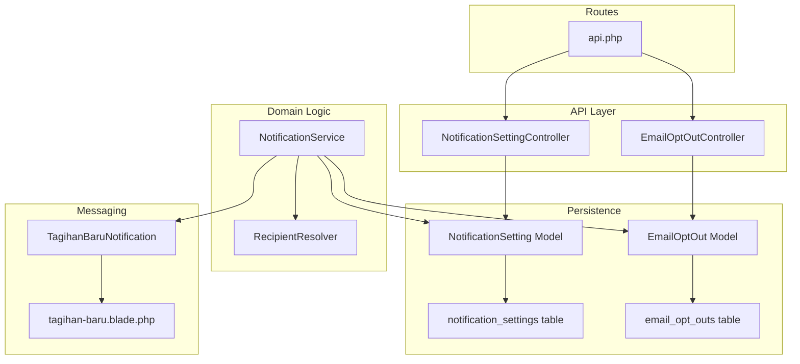
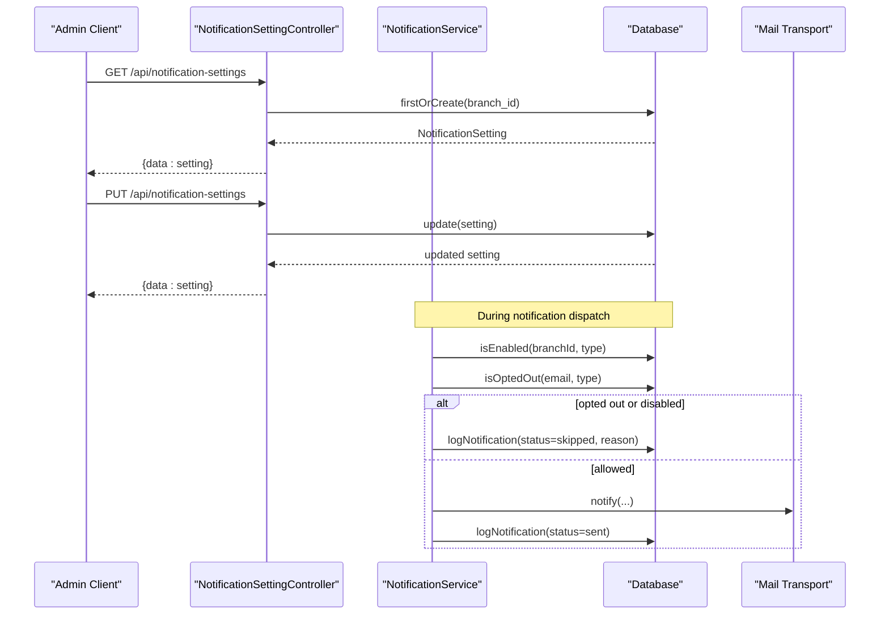
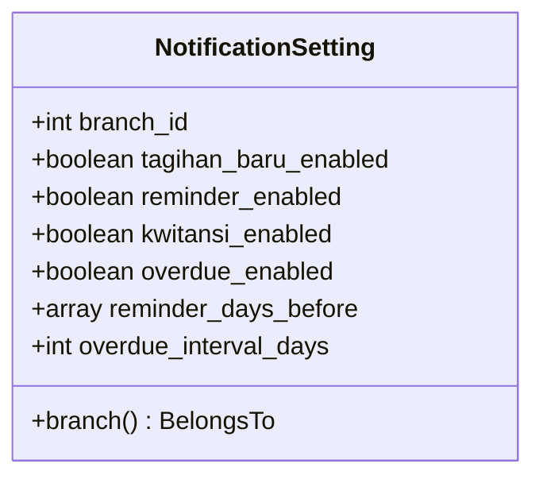
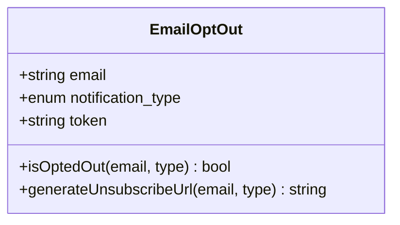
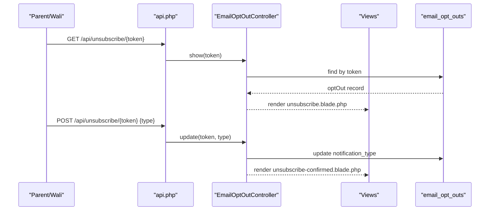
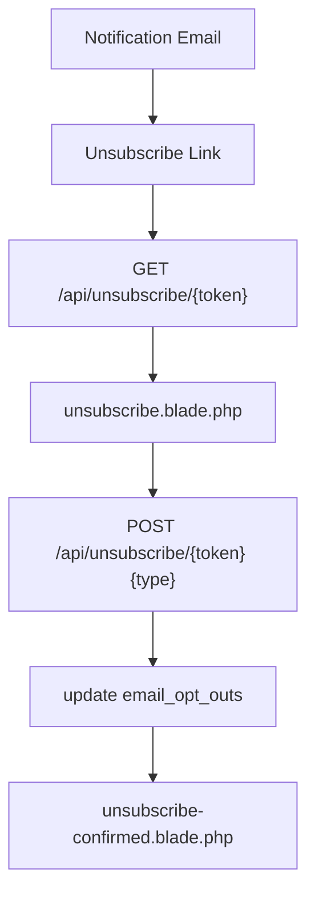
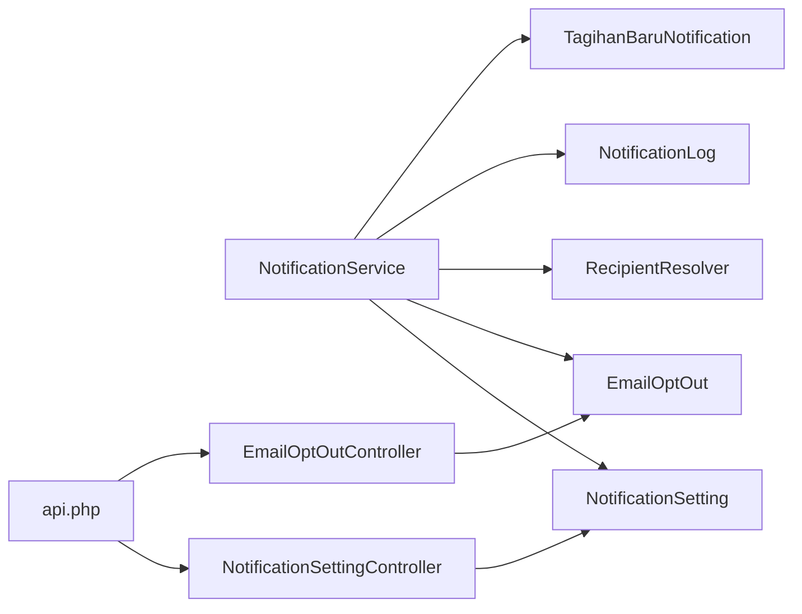

# Notification Preferences & Opt-out Management

<cite>
**Referenced Files in This Document**
- [NotificationSetting.php](file://backend/app/Models/NotificationSetting.php)
- [EmailOptOut.php](file://backend/app/Models/EmailOptOut.php)
- [NotificationSettingController.php](file://backend/app/Http/Controllers/NotificationSettingController.php)
- [EmailOptOutController.php](file://backend/app/Http/Controllers/EmailOptOutController.php)
- [NotificationService.php](file://backend/app/Services/Notifications/NotificationService.php)
- [RecipientResolver.php](file://backend/app/Services/Notifications/RecipientResolver.php)
- [2026_05_27_100100_create_notification_settings_table.php](file://backend/database/migrations/2026_05_27_100100_create_notification_settings_table.php)
- [2026_05_27_100300_create_email_opt_outs_table.php](file://backend/database/migrations/2026_05_27_100300_create_email_opt_outs_table.php)
- [api.php](file://backend/routes/api.php)
- [unsubscribe.blade.php](file://backend/resources/views/emails/unsubscribe.blade.php)
- [unsubscribe-confirmed.blade.php](file://backend/resources/views/emails/unsubscribe-confirmed.blade.php)
- [TagihanBaruNotification.php](file://backend/app/Notifications/TagihanBaruNotification.php)
- [tagihan-baru.blade.php](file://backend/resources/views/emails/notifications/tagihan-baru.blade.php)
</cite>

## Table of Contents
1. Introduction
2. Project Structure
3. Core Components
4. Architecture Overview
5. Detailed Component Analysis
6. Dependency Analysis
7. Performance Considerations
8. Troubleshooting Guide
9. Conclusion
10. Appendices

## Introduction
This document explains how notification preferences and opt-out management are implemented across the system. It covers:
- Branch-level notification configuration via the NotificationSetting model (enabled/disabled toggles and timing).
- Individual recipient preference management via the EmailOptOut model (opt-out/unsubscribe mechanisms and persistence).
- The preference checking workflow in the notification pipeline, ensuring opt-outs are respected for all notification types.
- Practical guidance for building user-facing preference interfaces, bulk updates, and migration strategies.
- Privacy compliance considerations and audit logging for notification preferences.

## Project Structure
The notification preference and opt-out features span models, controllers, services, routes, migrations, and email templates:
- Models define data structures and helper methods for preferences and opt-outs.
- Controllers expose API endpoints for branch settings and unsubscribe flows.
- Services implement the core logic to check settings, resolve recipients, enforce opt-outs, rate limits, and dispatch notifications.
- Routes wire public unsubscribe endpoints and authenticated setting endpoints.
- Migrations define database schema for settings and opt-outs.
- Views render unsubscribe pages and include unsubscribe links in emails.

**Diagram sources**
- [NotificationSettingController.php:1-47](file://backend/app/Http/Controllers/NotificationSettingController.php#L1-L47)
- [EmailOptOutController.php:1-48](file://backend/app/Http/Controllers/EmailOptOutController.php#L1-L48)
- [NotificationService.php:1-713](file://backend/app/Services/Notifications/NotificationService.php#L1-L713)
- [RecipientResolver.php:1-46](file://backend/app/Services/Notifications/RecipientResolver.php#L1-L46)
- [NotificationSetting.php:1-36](file://backend/app/Models/NotificationSetting.php#L1-L36)
- [EmailOptOut.php:1-42](file://backend/app/Models/EmailOptOut.php#L1-L42)
- [api.php:43-46](file://backend/routes/api.php#L43-L46)
- [TagihanBaruNotification.php:1-61](file://backend/app/Notifications/TagihanBaruNotification.php#L1-L61)
- [tagihan-baru.blade.php:1-53](file://backend/resources/views/emails/notifications/tagihan-baru.blade.php#L1-L53)
- [2026_05_27_100100_create_notification_settings_table.php:1-35](file://backend/database/migrations/2026_05_27_100100_create_notification_settings_table.php#L1-L35)
- [2026_05_27_100300_create_email_opt_outs_table.php:1-33](file://backend/database/migrations/2026_05_27_100300_create_email_opt_outs_table.php#L1-L33)

**Section sources**
- [NotificationSetting.php:1-36](file://backend/app/Models/NotificationSetting.php#L1-L36)
- [EmailOptOut.php:1-42](file://backend/app/Models/EmailOptOut.php#L1-L42)
- [NotificationSettingController.php:1-47](file://backend/app/Http/Controllers/NotificationSettingController.php#L1-L47)
- [EmailOptOutController.php:1-48](file://backend/app/Http/Controllers/EmailOptOutController.php#L1-L48)
- [NotificationService.php:1-713](file://backend/app/Services/Notifications/NotificationService.php#L1-L713)
- [RecipientResolver.php:1-46](file://backend/app/Services/Notifications/RecipientResolver.php#L1-L46)
- [api.php:43-46](file://backend/routes/api.php#L43-L46)
- [unsubscribe.blade.php:1-51](file://backend/resources/views/emails/unsubscribe.blade.php#L1-L51)
- [unsubscribe-confirmed.blade.php:1-33](file://backend/resources/views/emails/unsubscribe-confirmed.blade.php#L1-L33)
- [TagihanBaruNotification.php:1-61](file://backend/app/Notifications/TagihanBaruNotification.php#L1-L61)
- [tagihan-baru.blade.php:1-53](file://backend/resources/views/emails/notifications/tagihan-baru.blade.php#L1-L53)
- [2026_05_27_100100_create_notification_settings_table.php:1-35](file://backend/database/migrations/2026_05_27_100100_create_notification_settings_table.php#L1-L35)
- [2026_05_27_100300_create_email_opt_outs_table.php:1-33](file://backend/database/migrations/2026_05_27_100300_create_email_opt_outs_table.php#L1-L33)

## Core Components
- NotificationSetting (branch-level):
  - Stores per-branch toggles for tagihan_baru, reminder, kwitansi, overdue.
  - Configures reminder_days_before as an array and overdue_interval_days as integer.
  - Relationship to Branch ensures isolation by branch.
- EmailOptOut (recipient-level):
  - Tracks email + notification_type combinations with a unique token.
  - Provides isOptedOut(email, type) which matches both specific type and 'all'.
  - Provides generateUnsubscribeUrl(email, type) to create a signed link.
- NotificationService:
  - Central orchestration: isEnabled(branchId, type), isOptedOut(email, type), validateEmail, logNotification, checkRateLimit.
  - Enforces opt-outs and branch settings before dispatching each notification type.
  - Includes retryFailed to re-dispatch previously failed logs.
- RecipientResolver:
  - Resolves the final recipient email from Siswa with priority order: user.email, wali.email, ibu.email, ayah.email.
- Controllers:
  - NotificationSettingController: GET/PUT for branch settings; auto-creates defaults if missing.
  - EmailOptOutController: GET/POST for unsubscribe flow using token-based links.
- Routes:
  - Public unsubscribe endpoints under /api/unsubscribe/{token}.
  - Authenticated notification-settings endpoints under /api/notification-settings.
- Migrations:
  - notification_settings: branch_id unique, boolean flags, JSON reminder_days_before, integer overdue_interval_days.
  - email_opt_outs: email, enum notification_type, unique token, unique constraint on (email, notification_type).
- Email Templates:
  - Unsubscribe page and confirmation views.
  - Notification emails include an unsubscribe link placeholder.

**Section sources**
- [NotificationSetting.php:1-36](file://backend/app/Models/NotificationSetting.php#L1-L36)
- [EmailOptOut.php:1-42](file://backend/app/Models/EmailOptOut.php#L1-L42)
- [NotificationService.php:1-713](file://backend/app/Services/Notifications/NotificationService.php#L1-L713)
- [RecipientResolver.php:1-46](file://backend/app/Services/Notifications/RecipientResolver.php#L1-L46)
- [NotificationSettingController.php:1-47](file://backend/app/Http/Controllers/NotificationSettingController.php#L1-L47)
- [EmailOptOutController.php:1-48](file://backend/app/Http/Controllers/EmailOptOutController.php#L1-L48)
- [api.php:43-46](file://backend/routes/api.php#L43-L46)
- [2026_05_27_100100_create_notification_settings_table.php:1-35](file://backend/database/migrations/2026_05_27_100100_create_notification_settings_table.php#L1-L35)
- [2026_05_27_100300_create_email_opt_outs_table.php:1-33](file://backend/database/migrations/2026_05_27_100300_create_email_opt_outs_table.php#L1-L33)
- [unsubscribe.blade.php:1-51](file://backend/resources/views/emails/unsubscribe.blade.php#L1-L51)
- [unsubscribe-confirmed.blade.php:1-33](file://backend/resources/views/emails/unsubscribe-confirmed.blade.php#L1-L33)
- [TagihanBaruNotification.php:1-61](file://backend/app/Notifications/TagihanBaruNotification.php#L1-L61)
- [tagihan-baru.blade.php:1-53](file://backend/resources/views/emails/notifications/tagihan-baru.blade.php#L1-L53)

## Architecture Overview
End-to-end flows for preference checks and opt-out handling:

**Diagram sources**
- [NotificationSettingController.php:1-47](file://backend/app/Http/Controllers/NotificationSettingController.php#L1-L47)
- [NotificationService.php:1-713](file://backend/app/Services/Notifications/NotificationService.php#L1-L713)
- [api.php:211-214](file://backend/routes/api.php#L211-L214)

## Detailed Component Analysis

### NotificationSetting Model (Branch-Level Configuration)
- Purpose: Store per-branch toggles and timing parameters for notifications.
- Key fields:
  - Boolean flags: tagihan_baru_enabled, reminder_enabled, kwitansi_enabled, overdue_enabled.
  - Timing: reminder_days_before (array), overdue_interval_days (integer).
- Behavior:
  - Default values are created when missing via controller.
  - Relationship to Branch ensures isolation.

**Diagram sources**
- [NotificationSetting.php:1-36](file://backend/app/Models/NotificationSetting.php#L1-L36)
- [2026_05_27_100100_create_notification_settings_table.php:1-35](file://backend/database/migrations/2026_05_27_100100_create_notification_settings_table.php#L1-L35)

**Section sources**
- [NotificationSetting.php:1-36](file://backend/app/Models/NotificationSetting.php#L1-L36)
- [2026_05_27_100100_create_notification_settings_table.php:1-35](file://backend/database/migrations/2026_05_27_100100_create_notification_settings_table.php#L1-L35)

### EmailOptOut Model (Recipient-Level Preferences)
- Purpose: Persist individual opt-out preferences per email and notification type.
- Key fields:
  - email, notification_type (enum including 'all'), token (unique).
- Methods:
  - isOptedOut(email, type): returns true if record exists for exact type or 'all'.
  - generateUnsubscribeUrl(email, type): creates or finds record and returns URL.

**Diagram sources**
- [EmailOptOut.php:1-42](file://backend/app/Models/EmailOptOut.php#L1-L42)
- [2026_05_27_100300_create_email_opt_outs_table.php:1-33](file://backend/database/migrations/2026_05_27_100300_create_email_opt_outs_table.php#L1-L33)

**Section sources**
- [EmailOptOut.php:1-42](file://backend/app/Models/EmailOptOut.php#L1-L42)
- [2026_05_27_100300_create_email_opt_outs_table.php:1-33](file://backend/database/migrations/2026_05_27_100300_create_email_opt_outs_table.php#L1-L33)

### NotificationService (Preference Checking Workflow)
- Responsibilities:
  - isEnabled(branchId, type): reads NotificationSetting and returns enabled state.
  - isOptedOut(email, type): delegates to EmailOptOut.isOptedOut.
  - validateEmail(email): uses helper to ensure valid format.
  - logNotification(data): persists attempt outcomes.
  - checkRateLimit(branchId): enqueues guardrails per branch.
  - sendTagihanBaru, sendKwitansiPembayaran, processReminders, processOverdue: orchestrate recipient resolution, preference checks, rate limiting, dispatch, and logging.
  - retryFailed(logIds): re-dispatches based on stored metadata.

**Diagram sources**
- [NotificationService.php:30-96](file://backend/app/Services/Notifications/NotificationService.php#L30-L96)
- [NotificationService.php:109-210](file://backend/app/Services/Notifications/NotificationService.php#L109-L210)
- [NotificationService.php:215-318](file://backend/app/Services/Notifications/NotificationService.php#L215-L318)
- [NotificationService.php:324-448](file://backend/app/Services/Notifications/NotificationService.php#L324-L448)
- [NotificationService.php:454-584](file://backend/app/Services/Notifications/NotificationService.php#L454-L584)
- [RecipientResolver.php:1-46](file://backend/app/Services/Notifications/RecipientResolver.php#L1-L46)

**Section sources**
- [NotificationService.php:1-713](file://backend/app/Services/Notifications/NotificationService.php#L1-L713)
- [RecipientResolver.php:1-46](file://backend/app/Services/Notifications/RecipientResolver.php#L1-L46)

### Controllers and Routes
- NotificationSettingController:
  - GET /api/notification-settings: returns current branch settings, creating defaults if absent.
  - PUT /api/notification-settings: validates and updates settings.
- EmailOptOutController:
  - GET /api/unsubscribe/{token}: renders unsubscribe page with current preferences.
  - POST /api/unsubscribe/{token}: updates preference to selected type and shows confirmation.
- Routes:
  - Public unsubscribe endpoints without authentication.
  - Authenticated notification-settings endpoints within Sanctum group.

**Diagram sources**
- [EmailOptOutController.php:1-48](file://backend/app/Http/Controllers/EmailOptOutController.php#L1-L48)
- [api.php:43-46](file://backend/routes/api.php#L43-L46)
- [unsubscribe.blade.php:1-51](file://backend/resources/views/emails/unsubscribe.blade.php#L1-L51)
- [unsubscribe-confirmed.blade.php:1-33](file://backend/resources/views/emails/unsubscribe-confirmed.blade.php#L1-L33)

**Section sources**
- [NotificationSettingController.php:1-47](file://backend/app/Http/Controllers/NotificationSettingController.php#L1-L47)
- [EmailOptOutController.php:1-48](file://backend/app/Http/Controllers/EmailOptOutController.php#L1-L48)
- [api.php:211-214](file://backend/routes/api.php#L211-L214)
- [api.php:43-46](file://backend/routes/api.php#L43-L46)

### Email Templates and Unsubscribe Links
- Notification emails include an unsubscribe link placeholder.
- Unsubscribe page allows selecting one of the supported types or 'all'.
- Confirmation page acknowledges the change.

**Diagram sources**
- [TagihanBaruNotification.php:1-61](file://backend/app/Notifications/TagihanBaruNotification.php#L1-L61)
- [tagihan-baru.blade.php:1-53](file://backend/resources/views/emails/notifications/tagihan-baru.blade.php#L1-L53)
- [unsubscribe.blade.php:1-51](file://backend/resources/views/emails/unsubscribe.blade.php#L1-L51)
- [unsubscribe-confirmed.blade.php:1-33](file://backend/resources/views/emails/unsubscribe-confirmed.blade.php#L1-L33)

**Section sources**
- [TagihanBaruNotification.php:1-61](file://backend/app/Notifications/TagihanBaruNotification.php#L1-L61)
- [tagihan-baru.blade.php:1-53](file://backend/resources/views/emails/notifications/tagihan-baru.blade.php#L1-L53)
- [unsubscribe.blade.php:1-51](file://backend/resources/views/emails/unsubscribe.blade.php#L1-L51)
- [unsubscribe-confirmed.blade.php:1-33](file://backend/resources/views/emails/unsubscribe-confirmed.blade.php#L1-L33)

## Dependency Analysis
Key relationships and coupling:
- NotificationService depends on:
  - NotificationSetting (branch-level enablement).
  - EmailOptOut (recipient-level opt-out checks).
  - RecipientResolver (email resolution).
  - NotificationLog (audit trail).
  - Notification classes (dispatch).
- Controllers depend on their respective models and request validation.
- Routes connect public unsubscribe endpoints and authenticated setting endpoints.

**Diagram sources**
- [NotificationService.php:1-713](file://backend/app/Services/Notifications/NotificationService.php#L1-L713)
- [NotificationSetting.php:1-36](file://backend/app/Models/NotificationSetting.php#L1-L36)
- [EmailOptOut.php:1-42](file://backend/app/Models/EmailOptOut.php#L1-L42)
- [RecipientResolver.php:1-46](file://backend/app/Services/Notifications/RecipientResolver.php#L1-L46)
- [NotificationSettingController.php:1-47](file://backend/app/Http/Controllers/NotificationSettingController.php#L1-L47)
- [EmailOptOutController.php:1-48](file://backend/app/Http/Controllers/EmailOptOutController.php#L1-L48)
- [api.php:43-46](file://backend/routes/api.php#L43-L46)
- [api.php:211-214](file://backend/routes/api.php#L211-L214)

**Section sources**
- [NotificationService.php:1-713](file://backend/app/Services/Notifications/NotificationService.php#L1-L713)
- [NotificationSetting.php:1-36](file://backend/app/Models/NotificationSetting.php#L1-L36)
- [EmailOptOut.php:1-42](file://backend/app/Models/EmailOptOut.php#L1-L42)
- [RecipientResolver.php:1-46](file://backend/app/Services/Notifications/RecipientResolver.php#L1-L46)
- [NotificationSettingController.php:1-47](file://backend/app/Http/Controllers/NotificationSettingController.php#L1-L47)
- [EmailOptOutController.php:1-48](file://backend/app/Http/Controllers/EmailOptOutController.php#L1-L48)
- [api.php:43-46](file://backend/routes/api.php#L43-L46)
- [api.php:211-214](file://backend/routes/api.php#L211-L214)

## Performance Considerations
- Rate Limiting:
  - Per-branch limiter prevents excessive dispatches; adjust thresholds as needed.
- Batch Processing:
  - Reminder and overdue processors iterate branches and tagihans; consider indexing on branch_id, jatuh_tempo, and status.
- Queueing:
  - Notifications use queues; ensure workers are running and scaled appropriately.
- Logging Overhead:
  - Each attempt writes a log entry; monitor volume and consider partitioning or archival strategies.

[No sources needed since this section provides general guidance]

## Troubleshooting Guide
Common issues and diagnostics:
- Opt-out not respected:
  - Verify EmailOptOut records exist for the email and type (including 'all').
  - Confirm NotificationService.isOptedOut is called before dispatch.
- Branch settings not applied:
  - Ensure NotificationSetting exists for the branch; defaults are auto-created by controller.
  - Validate PUT payload against rules (booleans, arrays, integers).
- Unsubscribe link invalid:
  - Token must match a record in email_opt_outs; otherwise 404 is returned.
- Failed retries:
  - Use retryFailed to re-dispatch failed logs; ensure email validity and rate limit availability.

**Section sources**
- [EmailOptOutController.php:1-48](file://backend/app/Http/Controllers/EmailOptOutController.php#L1-L48)
- [NotificationService.php:592-711](file://backend/app/Services/Notifications/NotificationService.php#L592-L711)
- [NotificationSettingRequest.php:1-34](file://backend/app/Http/Requests/NotificationSettingRequest.php#L1-L34)

## Conclusion
The system implements robust, auditable notification preference management:
- Branch-level toggles and timing via NotificationSetting.
- Individual opt-outs via EmailOptOut with secure unsubscribe links.
- Centralized preference checks in NotificationService ensure consistent enforcement across all notification types.
- Clear audit trails via NotificationLog support observability and recovery.

[No sources needed since this section summarizes without analyzing specific files]

## Appendices

### API Reference Summary
- GET /api/notification-settings
  - Returns current branch notification settings; creates defaults if missing.
- PUT /api/notification-settings
  - Updates branch settings; validated fields include booleans, reminder_days_before array, overdue_interval_days integer.
- GET /api/unsubscribe/{token}
  - Renders unsubscribe page for the given token.
- POST /api/unsubscribe/{token}
  - Updates opt-out preference to selected type and confirms.

**Section sources**
- [api.php:43-46](file://backend/routes/api.php#L43-L46)
- [api.php:211-214](file://backend/routes/api.php#L211-L214)
- [NotificationSettingController.php:1-47](file://backend/app/Http/Controllers/NotificationSettingController.php#L1-L47)
- [EmailOptOutController.php:1-48](file://backend/app/Http/Controllers/EmailOptOutController.php#L1-L48)
- [NotificationSettingRequest.php:1-34](file://backend/app/Http/Requests/NotificationSettingRequest.php#L1-L34)

### Data Model Summary
- notification_settings
  - branch_id (unique), tagihan_baru_enabled, reminder_enabled, kwitansi_enabled, overdue_enabled, reminder_days_before (JSON), overdue_interval_days.
- email_opt_outs
  - email, notification_type (enum), token (unique), unique(email, notification_type).

**Section sources**
- [2026_05_27_100100_create_notification_settings_table.php:1-35](file://backend/database/migrations/2026_05_27_100100_create_notification_settings_table.php#L1-L35)
- [2026_05_27_100300_create_email_opt_outs_table.php:1-33](file://backend/database/migrations/2026_05_27_100300_create_email_opt_outs_table.php#L1-L33)

### Implementation Examples and Best Practices
- User-facing preference interface:
  - Build a UI that calls GET/PUT /api/notification-settings to manage branch-level toggles and timing.
  - For recipients, embed unsubscribe links in emails and provide a portal to manage preferences.
- Bulk preference updates:
  - Implement a service method to iterate recipients and update email_opt_outs in batches; respect existing tokens and avoid duplicates.
- Preference migration strategy:
  - If migrating from legacy flags, write a script to populate email_opt_outs based on historical opt-outs and set default NotificationSetting rows per branch.
- Privacy compliance:
  - Honor opt-outs immediately; persist changes with timestamps.
  - Provide clear consent language and easy re-subscribe options.
  - Retain minimal personal data necessary for unsubscribe functionality.
- Audit logging:
  - Ensure every dispatch attempt (sent, skipped, failed) is recorded with reason codes for traceability.

[No sources needed since this section provides general guidance]