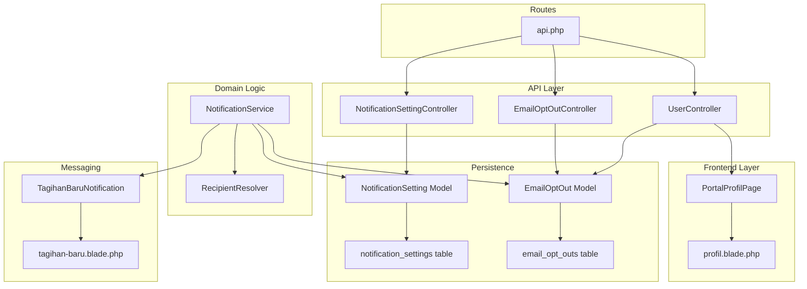
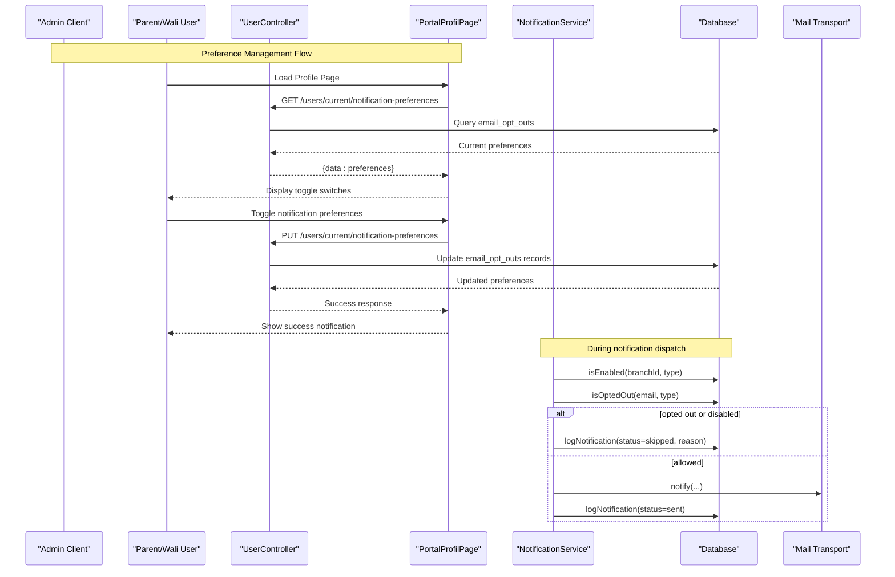
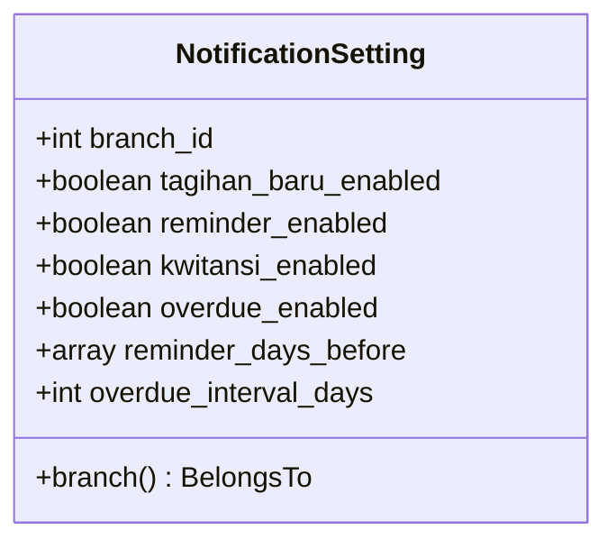
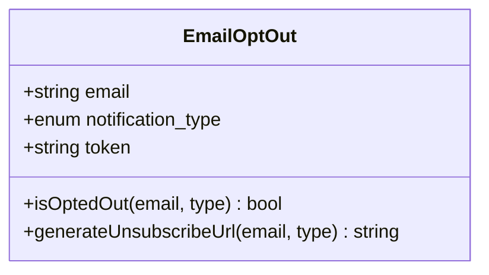
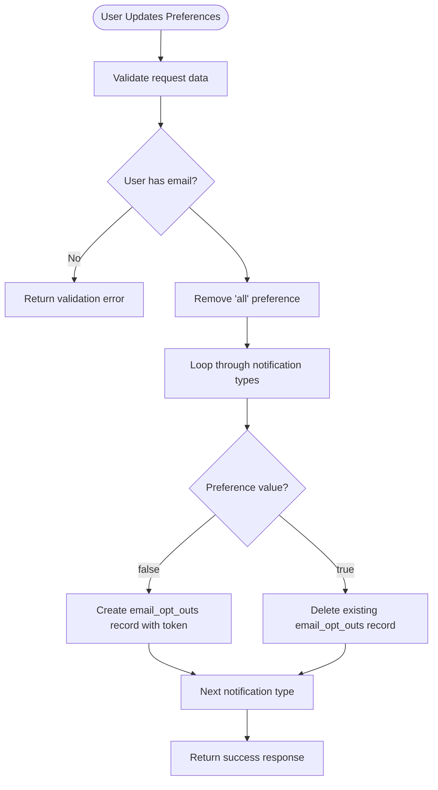
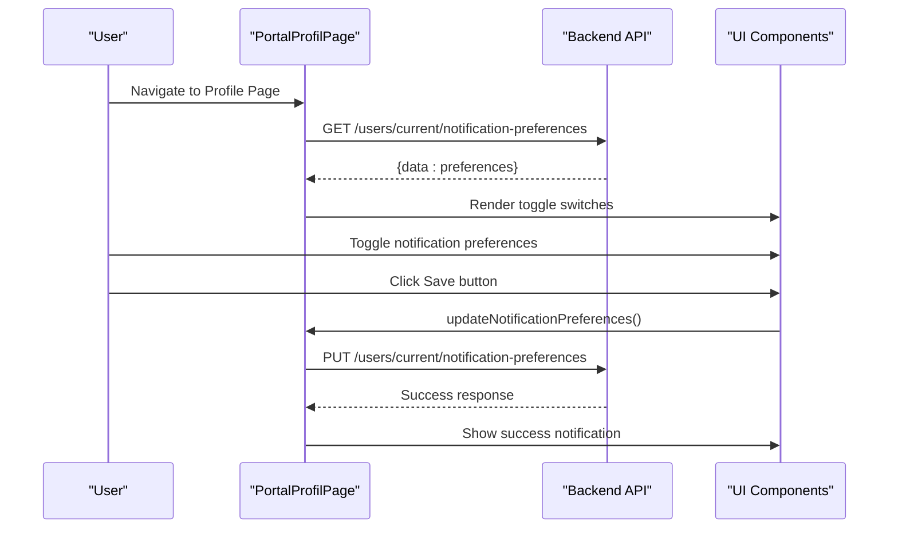
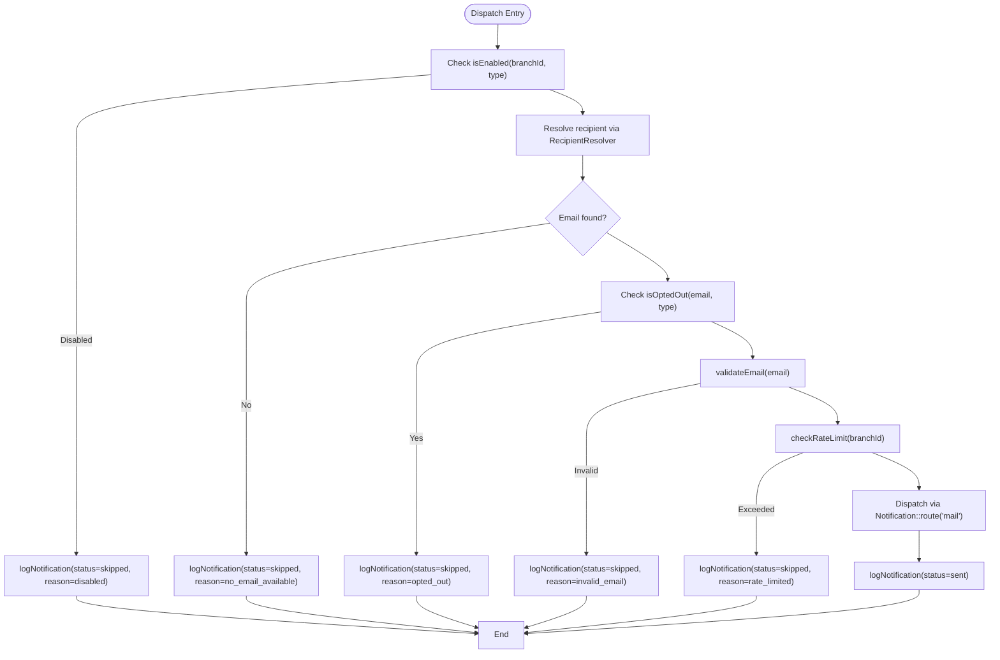
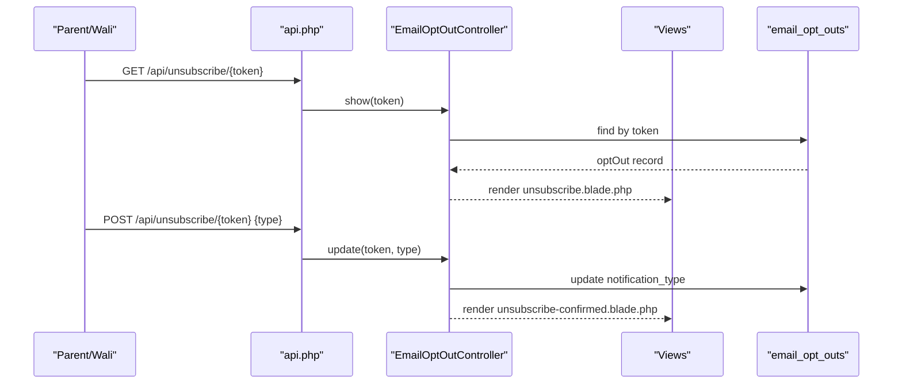
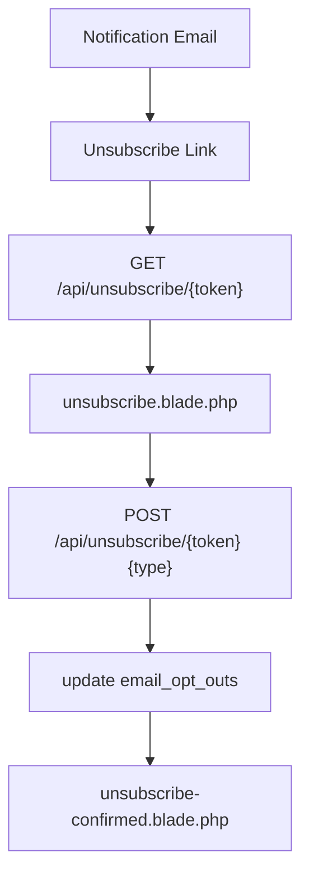
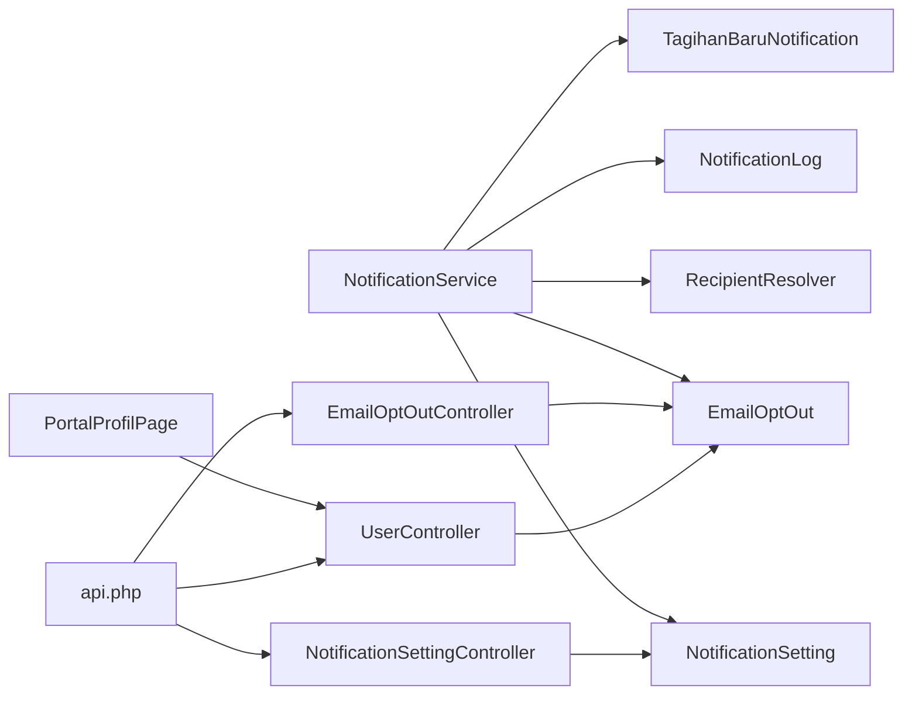

# Notification Preferences & Opt-out Management

<cite>
**Referenced Files in This Document**
- [NotificationSetting.php](file://backend/app/Models/NotificationSetting.php)
- [EmailOptOut.php](file://backend/app/Models/EmailOptOut.php)
- [NotificationSettingController.php](file://backend/app/Http/Controllers/NotificationSettingController.php)
- [EmailOptOutController.php](file://backend/app/Http/Controllers/EmailOptOutController.php)
- [UserController.php](file://backend/app/Http/Controllers/UserController.php)
- [PortalProfilPage.php](file://frontend-v2/app/Filament/Portal/Pages/PortalProfilPage.php)
- [NotificationService.php](file://backend/app/Services/Notifications/NotificationService.php)
- [RecipientResolver.php](file://backend/app/Services/Notifications/RecipientResolver.php)
- [2026_05_27_100100_create_notification_settings_table.php](file://backend/database/migrations/2026_05_27_100100_create_notification_settings_table.php)
- [2026_05_27_100300_create_email_opt_outs_table.php](file://backend/database/migrations/2026_05_27_100300_create_email_opt_outs_table.php)
- [api.php](file://backend/routes/api.php)
- [unsubscribe.blade.php](file://backend/resources/views/emails/unsubscribe.blade.php)
- [unsubscribe-confirmed.blade.php](file://backend/resources/views/emails/unsubscribe-confirmed.blade.php)
- [TagihanBaruNotification.php](file://backend/app/Notifications/TagihanBaruNotification.php)
- [tagihan-baru.blade.php](file://backend/resources/views/emails/notifications/tagihan-baru.blade.php)
- [profil.blade.php](file://frontend-v2/resources/views/filament/portal/pages/profil.blade.php)
</cite>

## Update Summary
**Changes Made**
- Added new user-facing API endpoints for managing notification preferences at the individual user level
- Integrated Filament portal frontend with user interface for toggling notification preferences
- Implemented automatic opt-out token management for user preference updates
- Enhanced EmailOptOut model to support both unsubscribe links and user-managed preferences
- Updated notification preference workflow to respect both branch-level settings and individual user preferences

## Table of Contents
1. Introduction
2. Project Structure
3. Core Components
4. Architecture Overview
5. Detailed Component Analysis
6. Dependency Analysis
7. Performance Considerations
8. Troubleshooting Guide
9. Conclusion
10. Appendices

## Introduction
This document explains how notification preferences and opt-out management are implemented across the system. It covers:
- Branch-level notification configuration via the NotificationSetting model (enabled/disabled toggles and timing).
- Individual recipient preference management via the EmailOptOut model (opt-out/unsubscribe mechanisms and persistence).
- **New**: User-facing API endpoints for managing notification types (tagihan_baru, reminder, kwitansi, overdue) with automatic opt-out token management.
- **New**: Frontend implementation in Filament portal with user interface for toggling notification preferences.
- The preference checking workflow in the notification pipeline, ensuring opt-outs are respected for all notification types.
- Practical guidance for building user-facing preference interfaces, bulk updates, and migration strategies.
- Privacy compliance considerations and audit logging for notification preferences.

## Project Structure
The notification preference and opt-out features span models, controllers, services, routes, migrations, views, and frontend components:
- Models define data structures and helper methods for preferences and opt-outs.
- Controllers expose API endpoints for branch settings, unsubscribe flows, and user preference management.
- Services implement the core logic to check settings, resolve recipients, enforce opt-outs, rate limits, and dispatch notifications.
- Routes wire public unsubscribe endpoints, authenticated setting endpoints, and user preference endpoints.
- Migrations define database schema for settings and opt-outs.
- Views render unsubscribe pages and include unsubscribe links in emails.
- **New**: Filament portal pages provide user interface for managing notification preferences.

**Diagram sources**
- [NotificationSettingController.php:1-47](file://backend/app/Http/Controllers/NotificationSettingController.php#L1-L47)
- [EmailOptOutController.php:1-48](file://backend/app/Http/Controllers/EmailOptOutController.php#L1-L48)
- [UserController.php:340-401](file://backend/app/Http/Controllers/UserController.php#L340-L401)
- [PortalProfilPage.php:1-260](file://frontend-v2/app/Filament/Portal/Pages/PortalProfilPage.php#L1-L260)
- [NotificationService.php:1-713](file://backend/app/Services/Notifications/NotificationService.php#L1-L713)
- [RecipientResolver.php:1-46](file://backend/app/Services/Notifications/RecipientResolver.php#L1-L46)
- [NotificationSetting.php:1-36](file://backend/app/Models/NotificationSetting.php#L1-L36)
- [EmailOptOut.php:1-42](file://backend/app/Models/EmailOptOut.php#L1-L42)
- [api.php:45-54](file://backend/routes/api.php#L45-L54)
- [TagihanBaruNotification.php:1-61](file://backend/app/Notifications/TagihanBaruNotification.php#L1-L61)
- [tagihan-baru.blade.php:1-53](file://backend/resources/views/emails/notifications/tagihan-baru.blade.php#L1-L53)
- [2026_05_27_100100_create_notification_settings_table.php:1-35](file://backend/database/migrations/2026_05_27_100100_create_notification_settings_table.php#L1-L35)
- [2026_05_27_100300_create_email_opt_outs_table.php:1-33](file://backend/database/migrations/2026_05_27_100300_create_email_opt_outs_table.php#L1-L33)

**Section sources**
- [NotificationSetting.php:1-36](file://backend/app/Models/NotificationSetting.php#L1-L36)
- [EmailOptOut.php:1-42](file://backend/app/Models/EmailOptOut.php#L1-L42)
- [NotificationSettingController.php:1-47](file://backend/app/Http/Controllers/NotificationSettingController.php#L1-L47)
- [EmailOptOutController.php:1-48](file://backend/app/Http/Controllers/EmailOptOutController.php#L1-L48)
- [UserController.php:340-401](file://backend/app/Http/Controllers/UserController.php#L340-L401)
- [PortalProfilPage.php:1-260](file://frontend-v2/app/Filament/Portal/Pages/PortalProfilPage.php#L1-L260)
- [NotificationService.php:1-713](file://backend/app/Services/Notifications/NotificationService.php#L1-L713)
- [RecipientResolver.php:1-46](file://backend/app/Services/Notifications/RecipientResolver.php#L1-L46)
- [api.php:45-54](file://backend/routes/api.php#L45-L54)
- [unsubscribe.blade.php:1-51](file://backend/resources/views/emails/unsubscribe.blade.php#L1-L51)
- [unsubscribe-confirmed.blade.php:1-33](file://backend/resources/views/emails/unsubscribe-confirmed.blade.php#L1-L33)
- [TagihanBaruNotification.php:1-61](file://backend/app/Notifications/TagihanBaruNotification.php#L1-L61)
- [tagihan-baru.blade.php:1-53](file://backend/resources/views/emails/notifications/tagihan-baru.blade.php#L1-L53)
- [profil.blade.php:43-90](file://frontend-v2/resources/views/filament/portal/pages/profil.blade.php#L43-L90)
- [2026_05_27_100100_create_notification_settings_table.php:1-35](file://backend/database/migrations/2026_05_27_100100_create_notification_settings_table.php#L1-L35)
- [2026_05_27_100300_create_email_opt_outs_table.php:1-33](file://backend/database/migrations/2026_05_27_100300_create_email_opt_outs_table.php#L1-L33)

## Core Components
- NotificationSetting (branch-level):
  - Stores per-branch toggles for tagihan_baru, reminder, kwitansi, overdue.
  - Configures reminder_days_before as an array and overdue_interval_days as integer.
  - Relationship to Branch ensures isolation by branch.
- EmailOptOut (recipient-level):
  - Tracks email + notification_type combinations with a unique token.
  - Provides isOptedOut(email, type) which matches both specific type and 'all'.
  - Provides generateUnsubscribeUrl(email, type) to create a signed link.
- **New**: UserController notification preference endpoints:
  - GET /users/current/notification-preferences: returns current user's notification preferences.
  - PUT /users/current/notification-preferences: updates user's notification preferences with automatic token management.
- **New**: PortalProfilPage Filament component:
  - Provides user interface with toggle switches for each notification type.
  - Automatically fetches and updates preferences through API calls.
  - Handles loading states and error notifications.
- NotificationService:
  - Central orchestration: isEnabled(branchId, type), isOptedOut(email, type), validateEmail, logNotification, checkRateLimit.
  - Enforces opt-outs and branch settings before dispatching each notification type.
  - Includes retryFailed to re-dispatch previously failed logs.
- RecipientResolver:
  - Resolves the final recipient email from Siswa with priority order: user.email, wali.email, ibu.email, ayah.email.
- Controllers:
  - NotificationSettingController: GET/PUT for branch settings; auto-creates defaults if missing.
  - EmailOptOutController: GET/POST for unsubscribe flow using token-based links.
- Routes:
  - Public unsubscribe endpoints under /api/unsubscribe/{token}.
  - Authenticated notification-settings endpoints under /api/notification-settings.
  - **New**: User preference endpoints under /users/current/notification-preferences.
- Migrations:
  - notification_settings: branch_id unique, boolean flags, JSON reminder_days_before, integer overdue_interval_days.
  - email_opt_outs: email, enum notification_type, unique token, unique constraint on (email, notification_type).
- Email Templates:
  - Unsubscribe page and confirmation views.
  - Notification emails include an unsubscribe link placeholder.

**Section sources**
- [NotificationSetting.php:1-36](file://backend/app/Models/NotificationSetting.php#L1-L36)
- [EmailOptOut.php:1-42](file://backend/app/Models/EmailOptOut.php#L1-L42)
- [UserController.php:340-401](file://backend/app/Http/Controllers/UserController.php#L340-L401)
- [PortalProfilPage.php:145-260](file://frontend-v2/app/Filament/Portal/Pages/PortalProfilPage.php#L145-L260)
- [NotificationService.php:1-713](file://backend/app/Services/Notifications/NotificationService.php#L1-L713)
- [RecipientResolver.php:1-46](file://backend/app/Services/Notifications/RecipientResolver.php#L1-L46)
- [NotificationSettingController.php:1-47](file://backend/app/Http/Controllers/NotificationSettingController.php#L1-L47)
- [EmailOptOutController.php:1-48](file://backend/app/Http/Controllers/EmailOptOutController.php#L1-L48)
- [api.php:45-54](file://backend/routes/api.php#L45-L54)
- [2026_05_27_100100_create_notification_settings_table.php:1-35](file://backend/database/migrations/2026_05_27_100100_create_notification_settings_table.php#L1-L35)
- [2026_05_27_100300_create_email_opt_outs_table.php:1-33](file://backend/database/migrations/2026_05_27_100300_create_email_opt_outs_table.php#L1-L33)
- [unsubscribe.blade.php:1-51](file://backend/resources/views/emails/unsubscribe.blade.php#L1-L51)
- [unsubscribe-confirmed.blade.php:1-33](file://backend/resources/views/emails/unsubscribe-confirmed.blade.php#L1-L33)
- [TagihanBaruNotification.php:1-61](file://backend/app/Notifications/TagihanBaruNotification.php#L1-L61)
- [tagihan-baru.blade.php:1-53](file://backend/resources/views/emails/notifications/tagihan-baru.blade.php#L1-L53)

## Architecture Overview
End-to-end flows for preference checks and opt-out handling, including the new user-facing preference management:

**Diagram sources**
- [UserController.php:340-401](file://backend/app/Http/Controllers/UserController.php#L340-L401)
- [PortalProfilPage.php:85-101](file://frontend-v2/app/Filament/Portal/Pages/PortalProfilPage.php#L85-L101)
- [PortalProfilPage.php:233-258](file://frontend-v2/app/Filament/Portal/Pages/PortalProfilPage.php#L233-L258)
- [NotificationService.php:1-713](file://backend/app/Services/Notifications/NotificationService.php#L1-L713)
- [api.php:52-53](file://backend/routes/api.php#L52-L53)

## Detailed Component Analysis

### NotificationSetting Model (Branch-Level Configuration)
- Purpose: Store per-branch toggles and timing parameters for notifications.
- Key fields:
  - Boolean flags: tagihan_baru_enabled, reminder_enabled, kwitansi_enabled, overdue_enabled.
  - Timing: reminder_days_before (array), overdue_interval_days (integer).
- Behavior:
  - Default values are created when missing via controller.
  - Relationship to Branch ensures isolation.

**Diagram sources**
- [NotificationSetting.php:1-36](file://backend/app/Models/NotificationSetting.php#L1-L36)
- [2026_05_27_100100_create_notification_settings_table.php:1-35](file://backend/database/migrations/2026_05_27_100100_create_notification_settings_table.php#L1-L35)

**Section sources**
- [NotificationSetting.php:1-36](file://backend/app/Models/NotificationSetting.php#L1-L36)
- [2026_05_27_100100_create_notification_settings_table.php:1-35](file://backend/database/migrations/2026_05_27_100100_create_notification_settings_table.php#L1-L35)

### EmailOptOut Model (Recipient-Level Preferences)
- Purpose: Persist individual opt-out preferences per email and notification type.
- Key fields:
  - email, notification_type (enum including 'all'), token (unique).
- Methods:
  - isOptedOut(email, type): returns true if record exists for exact type or 'all'.
  - generateUnsubscribeUrl(email, type): creates or finds record and returns URL.
- **Enhanced**: Now supports both unsubscribe link functionality and user-managed preferences through the same data structure.

**Diagram sources**
- [EmailOptOut.php:1-42](file://backend/app/Models/EmailOptOut.php#L1-L42)
- [2026_05_27_100300_create_email_opt_outs_table.php:1-33](file://backend/database/migrations/2026_05_27_100300_create_email_opt_outs_table.php#L1-L33)

**Section sources**
- [EmailOptOut.php:1-42](file://backend/app/Models/EmailOptOut.php#L1-L42)
- [2026_05_27_100300_create_email_opt_outs_table.php:1-33](file://backend/database/migrations/2026_05_27_100300_create_email_opt_outs_table.php#L1-L33)

### New: User Notification Preference Management
- **New**: UserController provides endpoints for individual users to manage their notification preferences:
  - GET /users/current/notification-preferences: Returns current preferences based on email_opt_outs records.
  - PUT /users/current/notification-preferences: Updates preferences by creating/deleting email_opt_outs records.
- **New**: Automatic token management: When users opt-out, random tokens are generated for potential future unsubscribe links.
- **New**: Normalization logic: Removes 'all' preference when updating individual preferences to maintain consistency.

**Diagram sources**
- [UserController.php:356-401](file://backend/app/Http/Controllers/UserController.php#L356-L401)

**Section sources**
- [UserController.php:340-401](file://backend/app/Http/Controllers/UserController.php#L340-L401)

### New: Filament Portal Integration
- **New**: PortalProfilPage provides a complete user interface for managing notification preferences:
  - Mount method fetches current preferences from API and populates form state.
  - notificationFormSchema defines toggle switches for each notification type with descriptive labels.
  - updateNotificationPreferences method handles form submission and API communication.
  - Automatic error handling and success notifications.
- **New**: profil.blade.php template renders the notification preferences section with proper styling and loading states.

**Diagram sources**
- [PortalProfilPage.php:85-101](file://frontend-v2/app/Filament/Portal/Pages/PortalProfilPage.php#L85-L101)
- [PortalProfilPage.php:145-163](file://frontend-v2/app/Filament/Portal/Pages/PortalProfilPage.php#L145-L163)
- [PortalProfilPage.php:233-258](file://frontend-v2/app/Filament/Portal/Pages/PortalProfilPage.php#L233-L258)
- [profil.blade.php:58-82](file://frontend-v2/resources/views/filament/portal/pages/profil.blade.php#L58-L82)

**Section sources**
- [PortalProfilPage.php:1-260](file://frontend-v2/app/Filament/Portal/Pages/PortalProfilPage.php#L1-L260)
- [profil.blade.php:43-90](file://frontend-v2/resources/views/filament/portal/pages/profil.blade.php#L43-L90)

### NotificationService (Preference Checking Workflow)
- Responsibilities:
  - isEnabled(branchId, type): reads NotificationSetting and returns enabled state.
  - isOptedOut(email, type): delegates to EmailOptOut.isOptedOut.
  - validateEmail(email): uses helper to ensure valid format.
  - logNotification(data): persists attempt outcomes.
  - checkRateLimit(branchId): enqueues guardrails per branch.
  - sendTagihanBaru, sendKwitansiPembayaran, processReminders, processOverdue: orchestrate recipient resolution, preference checks, rate limiting, dispatch, and logging.
  - retryFailed(logIds): re-dispatches based on stored metadata.

**Diagram sources**
- [NotificationService.php:30-96](file://backend/app/Services/Notifications/NotificationService.php#L30-L96)
- [NotificationService.php:109-210](file://backend/app/Services/Notifications/NotificationService.php#L109-L210)
- [NotificationService.php:215-318](file://backend/app/Services/Notifications/NotificationService.php#L215-L318)
- [NotificationService.php:324-448](file://backend/app/Services/Notifications/NotificationService.php#L324-L448)
- [NotificationService.php:454-584](file://backend/app/Services/Notifications/NotificationService.php#L454-L584)
- [RecipientResolver.php:1-46](file://backend/app/Services/Notifications/RecipientResolver.php#L1-L46)

**Section sources**
- [NotificationService.php:1-713](file://backend/app/Services/Notifications/NotificationService.php#L1-L713)
- [RecipientResolver.php:1-46](file://backend/app/Services/Notifications/RecipientResolver.php#L1-L46)

### Controllers and Routes
- NotificationSettingController:
  - GET /api/notification-settings: returns current branch settings, creating defaults if absent.
  - PUT /api/notification-settings: validates and updates settings.
- EmailOptOutController:
  - GET /api/unsubscribe/{token}: renders unsubscribe page with current preferences.
  - POST /api/unsubscribe/{token}: updates preference to selected type and shows confirmation.
- **New**: UserController:
  - GET /users/current/notification-preferences: returns current user's notification preferences.
  - PUT /users/current/notification-preferences: updates user's notification preferences.
- Routes:
  - Public unsubscribe endpoints without authentication.
  - Authenticated notification-settings endpoints within Sanctum group.
  - **New**: User preference endpoints under authenticated Sanctum middleware.

**Diagram sources**
- [EmailOptOutController.php:1-48](file://backend/app/Http/Controllers/EmailOptOutController.php#L1-L48)
- [api.php:45-54](file://backend/routes/api.php#L45-L54)
- [unsubscribe.blade.php:1-51](file://backend/resources/views/emails/unsubscribe.blade.php#L1-L51)
- [unsubscribe-confirmed.blade.php:1-33](file://backend/resources/views/emails/unsubscribe-confirmed.blade.php#L1-L33)

**Section sources**
- [NotificationSettingController.php:1-47](file://backend/app/Http/Controllers/NotificationSettingController.php#L1-L47)
- [EmailOptOutController.php:1-48](file://backend/app/Http/Controllers/EmailOptOutController.php#L1-L48)
- [UserController.php:340-401](file://backend/app/Http/Controllers/UserController.php#L340-L401)
- [api.php:45-54](file://backend/routes/api.php#L45-L54)
- [api.php:211-214](file://backend/routes/api.php#L211-L214)

### Email Templates and Unsubscribe Links
- Notification emails include an unsubscribe link placeholder.
- Unsubscribe page allows selecting one of the supported types or 'all'.
- Confirmation page acknowledges the change.

**Diagram sources**
- [TagihanBaruNotification.php:1-61](file://backend/app/Notifications/TagihanBaruNotification.php#L1-L61)
- [tagihan-baru.blade.php:1-53](file://backend/resources/views/emails/notifications/tagihan-baru.blade.php#L1-L53)
- [unsubscribe.blade.php:1-51](file://backend/resources/views/emails/unsubscribe.blade.php#L1-L51)
- [unsubscribe-confirmed.blade.php:1-33](file://backend/resources/views/emails/unsubscribe-confirmed.blade.php#L1-L33)

**Section sources**
- [TagihanBaruNotification.php:1-61](file://backend/app/Notifications/TagihanBaruNotification.php#L1-L61)
- [tagihan-baru.blade.php:1-53](file://backend/resources/views/emails/notifications/tagihan-baru.blade.php#L1-L53)
- [unsubscribe.blade.php:1-51](file://backend/resources/views/emails/unsubscribe.blade.php#L1-L51)
- [unsubscribe-confirmed.blade.php:1-33](file://backend/resources/views/emails/unsubscribe-confirmed.blade.php#L1-L33)

## Dependency Analysis
Key relationships and coupling:
- NotificationService depends on:
  - NotificationSetting (branch-level enablement).
  - EmailOptOut (recipient-level opt-out checks).
  - RecipientResolver (email resolution).
  - NotificationLog (audit trail).
  - Notification classes (dispatch).
- Controllers depend on their respective models and request validation.
- Routes connect public unsubscribe endpoints and authenticated setting endpoints.
- **New**: PortalProfilPage depends on ApiService for backend communication and Filament components for UI rendering.
- **New**: UserController integrates with EmailOptOut model for preference management.

**Diagram sources**
- [NotificationService.php:1-713](file://backend/app/Services/Notifications/NotificationService.php#L1-L713)
- [NotificationSetting.php:1-36](file://backend/app/Models/NotificationSetting.php#L1-L36)
- [EmailOptOut.php:1-42](file://backend/app/Models/EmailOptOut.php#L1-L42)
- [RecipientResolver.php:1-46](file://backend/app/Services/Notifications/RecipientResolver.php#L1-L46)
- [NotificationSettingController.php:1-47](file://backend/app/Http/Controllers/NotificationSettingController.php#L1-L47)
- [EmailOptOutController.php:1-48](file://backend/app/Http/Controllers/EmailOptOutController.php#L1-L48)
- [UserController.php:340-401](file://backend/app/Http/Controllers/UserController.php#L340-L401)
- [PortalProfilPage.php:1-260](file://frontend-v2/app/Filament/Portal/Pages/PortalProfilPage.php#L1-L260)
- [api.php:45-54](file://backend/routes/api.php#L45-L54)
- [api.php:211-214](file://backend/routes/api.php#L211-L214)

**Section sources**
- [NotificationService.php:1-713](file://backend/app/Services/Notifications/NotificationService.php#L1-L713)
- [NotificationSetting.php:1-36](file://backend/app/Models/NotificationSetting.php#L1-L36)
- [EmailOptOut.php:1-42](file://backend/app/Models/EmailOptOut.php#L1-L42)
- [RecipientResolver.php:1-46](file://backend/app/Services/Notifications/RecipientResolver.php#L1-L46)
- [NotificationSettingController.php:1-47](file://backend/app/Http/Controllers/NotificationSettingController.php#L1-L47)
- [EmailOptOutController.php:1-48](file://backend/app/Http/Controllers/EmailOptOutController.php#L1-L48)
- [UserController.php:340-401](file://backend/app/Http/Controllers/UserController.php#L340-L401)
- [PortalProfilPage.php:1-260](file://frontend-v2/app/Filament/Portal/Pages/PortalProfilPage.php#L1-L260)
- [api.php:45-54](file://backend/routes/api.php#L45-L54)
- [api.php:211-214](file://backend/routes/api.php#L211-L214)

## Performance Considerations
- Rate Limiting:
  - Per-branch limiter prevents excessive dispatches; adjust thresholds as needed.
- Batch Processing:
  - Reminder and overdue processors iterate branches and tagihans; consider indexing on branch_id, jatuh_tempo, and status.
- Queueing:
  - Notifications use queues; ensure workers are running and scaled appropriately.
- Logging Overhead:
  - Each attempt writes a log entry; monitor volume and consider partitioning or archival strategies.
- **New**: User Preference API:
  - Preference queries are optimized with direct email lookups.
  - Bulk operations are handled efficiently with single database transactions.
  - Filament portal uses efficient Livewire components with minimal re-renders.

## Troubleshooting Guide
Common issues and diagnostics:
- Opt-out not respected:
  - Verify EmailOptOut records exist for the email and type (including 'all').
  - Confirm NotificationService.isOptedOut is called before dispatch.
- Branch settings not applied:
  - Ensure NotificationSetting exists for the branch; defaults are auto-created by controller.
  - Validate PUT payload against rules (booleans, arrays, integers).
- Unsubscribe link invalid:
  - Token must match a record in email_opt_outs; otherwise 404 is returned.
- Failed retries:
  - Use retryFailed to re-dispatch failed logs; ensure email validity and rate limit availability.
- **New**: User preference updates failing:
  - Check if user has email set before attempting preference updates.
  - Verify API endpoint permissions and authentication status.
  - Inspect network requests in browser developer tools for detailed error information.
- **New**: Filament portal not displaying preferences:
  - Ensure ApiService client is properly configured and connected to backend.
  - Check that mount method successfully fetches initial preferences.
  - Verify toggle switches are properly bound to component properties.

**Section sources**
- [EmailOptOutController.php:1-48](file://backend/app/Http/Controllers/EmailOptOutController.php#L1-L48)
- [NotificationService.php:592-711](file://backend/app/Services/Notifications/NotificationService.php#L592-L711)
- [NotificationSettingRequest.php:1-34](file://backend/app/Http/Requests/NotificationSettingRequest.php#L1-L34)
- [UserController.php:356-401](file://backend/app/Http/Controllers/UserController.php#L356-L401)
- [PortalProfilPage.php:85-101](file://frontend-v2/app/Filament/Portal/Pages/PortalProfilPage.php#L85-L101)

## Conclusion
The system implements robust, auditable notification preference management with enhanced user-facing capabilities:
- Branch-level toggles and timing via NotificationSetting.
- Individual opt-outs via EmailOptOut with secure unsubscribe links.
- **New**: User-facing API endpoints for managing notification preferences with automatic token management.
- **New**: Filament portal integration providing intuitive user interface for preference management.
- Centralized preference checks in NotificationService ensure consistent enforcement across all notification types.
- Clear audit trails via NotificationLog support observability and recovery.

## Appendices

### API Reference Summary
- GET /api/notification-settings
  - Returns current branch notification settings; creates defaults if missing.
- PUT /api/notification-settings
  - Updates branch settings; validated fields include booleans, reminder_days_before array, overdue_interval_days integer.
- GET /api/unsubscribe/{token}
  - Renders unsubscribe page for the given token.
- POST /api/unsubscribe/{token}
  - Updates opt-out preference to selected type and confirms.
- **New**: GET /users/current/notification-preferences
  - Returns current user's notification preferences based on email_opt_outs records.
- **New**: PUT /users/current/notification-preferences
  - Updates user's notification preferences; validates boolean fields and manages email_opt_outs records automatically.

**Section sources**
- [api.php:45-54](file://backend/routes/api.php#L45-L54)
- [api.php:211-214](file://backend/routes/api.php#L211-L214)
- [NotificationSettingController.php:1-47](file://backend/app/Http/Controllers/NotificationSettingController.php#L1-L47)
- [EmailOptOutController.php:1-48](file://backend/app/Http/Controllers/EmailOptOutController.php#L1-L48)
- [UserController.php:340-401](file://backend/app/Http/Controllers/UserController.php#L340-L401)
- [NotificationSettingRequest.php:1-34](file://backend/app/Http/Requests/NotificationSettingRequest.php#L1-L34)

### Data Model Summary
- notification_settings
  - branch_id (unique), tagihan_baru_enabled, reminder_enabled, kwitansi_enabled, overdue_enabled, reminder_days_before (JSON), overdue_interval_days.
- email_opt_outs
  - email, notification_type (enum), token (unique), unique(email, notification_type).

**Section sources**
- [2026_05_27_100100_create_notification_settings_table.php:1-35](file://backend/database/migrations/2026_05_27_100100_create_notification_settings_table.php#L1-L35)
- [2026_05_27_100300_create_email_opt_outs_table.php:1-33](file://backend/database/migrations/2026_05_27_100300_create_email_opt_outs_table.php#L1-L33)

### Implementation Examples and Best Practices
- User-facing preference interface:
  - Build a UI that calls GET/PUT /api/notification-settings to manage branch-level toggles and timing.
  - For recipients, embed unsubscribe links in emails and provide a portal to manage preferences.
  - **New**: Use Filament portal components like PortalProfilPage for consistent user experience with proper loading states and error handling.
- Bulk preference updates:
  - Implement a service method to iterate recipients and update email_opt_outs in batches; respect existing tokens and avoid duplicates.
- Preference migration strategy:
  - If migrating from legacy flags, write a script to populate email_opt_outs based on historical opt-outs and set default NotificationSetting rows per branch.
- Privacy compliance:
  - Honor opt-outs immediately; persist changes with timestamps.
  - Provide clear consent language and easy re-subscribe options.
  - Retain minimal personal data necessary for unsubscribe functionality.
- Audit logging:
  - Ensure every dispatch attempt (sent, skipped, failed) is recorded with reason codes for traceability.
- **New**: Frontend best practices:
  - Use Livewire components for real-time preference updates without page reloads.
  - Implement proper error handling and user feedback for API failures.
  - Cache user preferences locally to improve performance and reduce API calls.