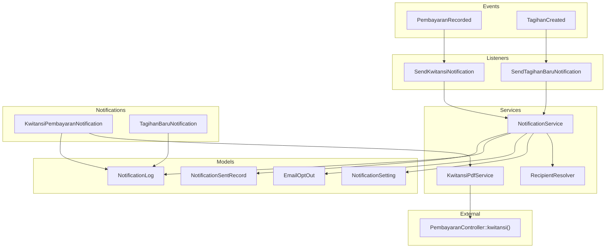
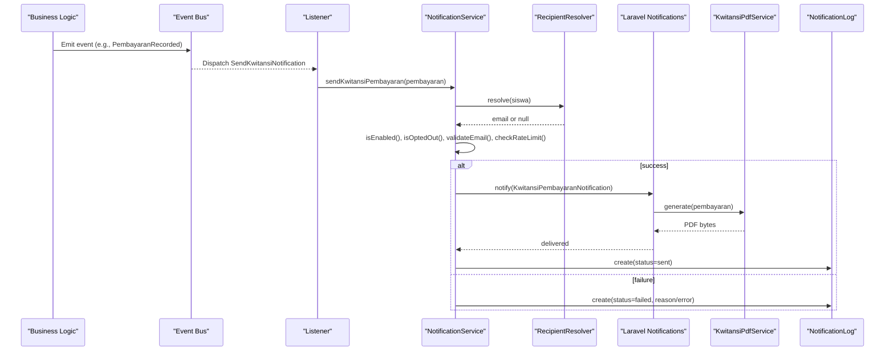
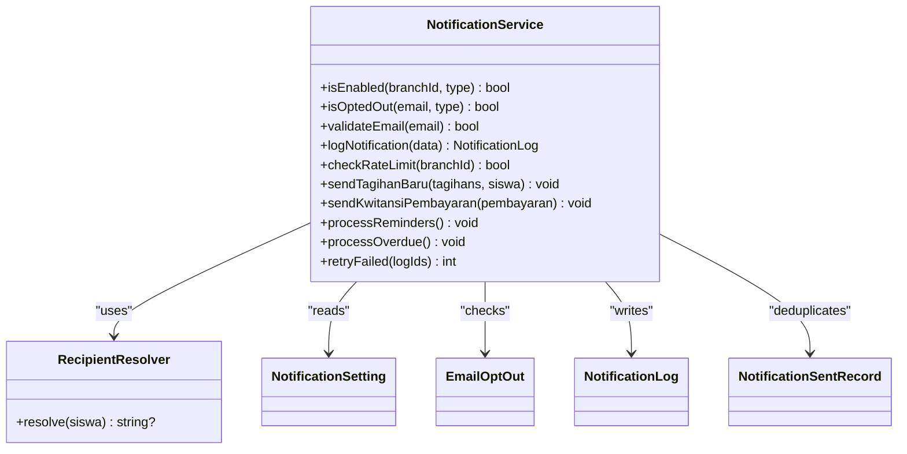
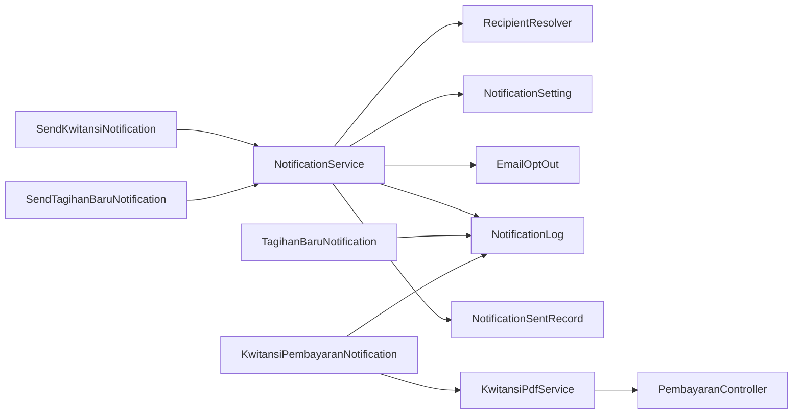
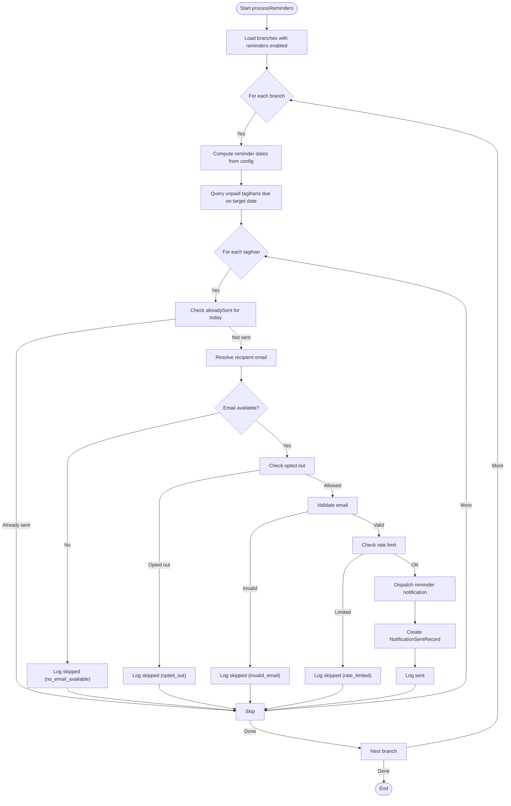

# Notification System

<cite>
**Referenced Files in This Document**
- [NotificationService.php](file://backend/app/Services/Notifications/NotificationService.php)
- [RecipientResolver.php](file://backend/app/Services/Notifications/RecipientResolver.php)
- [KwitansiPdfService.php](file://backend/app/Services/Notifications/KwitansiPdfService.php)
- [PembayaranRecorded.php](file://backend/app/Events/PembayaranRecorded.php)
- [TagihanCreated.php](file://backend/app/Events/TagihanCreated.php)
- [SendKwitansiNotification.php](file://backend/app/Listeners/SendKwitansiNotification.php)
- [SendTagihanBaruNotification.php](file://backend/app/Listeners/SendTagihanBaruNotification.php)
- [KwitansiPembayaranNotification.php](file://backend/app/Notifications/KwitansiPembayaranNotification.php)
- [TagihanBaruNotification.php](file://backend/app/Notifications/TagihanBaruNotification.php)
- [NotificationSetting.php](file://backend/app/Models/NotificationSetting.php)
- [EmailOptOut.php](file://backend/app/Models/EmailOptOut.php)
- [NotificationLog.php](file://backend/app/Models/NotificationLog.php)
- [NotificationSentRecord.php](file://backend/app/Models/NotificationSentRecord.php)
- [Notification.php](file://backend/app/Models/Notification.php)
- [PembayaranController.php](file://backend/app/Http/Controllers/PembayaranController.php)
</cite>

## Table of Contents
1. [Introduction](#introduction)
2. [Project Structure](#project-structure)
3. [Core Components](#core-components)
4. [Architecture Overview](#architecture-overview)
5. [Detailed Component Analysis](#detailed-component-analysis)
6. [Dependency Analysis](#dependency-analysis)
7. [Performance Considerations](#performance-considerations)
8. [Troubleshooting Guide](#troubleshooting-guide)
9. [Conclusion](#conclusion)
10. [Appendices](#appendices)

## Introduction
This document explains the Handayani platform’s notification system, focusing on multi-channel delivery (email and in-app), event-driven triggers, recipient resolution, email template management, preferences and opt-out handling, delivery tracking, and PDF receipt generation for payments. It also covers queuing, retry mechanisms, failure handling, and performance optimization strategies.

## Project Structure
The notification subsystem is implemented as a service-oriented layer with:
- Event-driven triggers for payment recorded and invoice created scenarios
- A central NotificationService orchestrating checks, routing, logging, and dispatching
- Dedicated notification classes implementing Laravel notifications with queue support
- A recipient resolver that selects the best email address per student
- A kwitansi (receipt) PDF generator that reuses controller logic to ensure consistency
- Models for settings, logs, sent records, and opt-outs

**Diagram sources**
- [PembayaranRecorded.php:1-17](file://backend/app/Events/PembayaranRecorded.php#L1-L17)
- [TagihanCreated.php:1-20](file://backend/app/Events/TagihanCreated.php#L1-L20)
- [SendKwitansiNotification.php:1-20](file://backend/app/Listeners/SendKwitansiNotification.php#L1-L20)
- [SendTagihanBaruNotification.php:1-20](file://backend/app/Listeners/SendTagihanBaruNotification.php#L1-L20)
- [NotificationService.php:1-713](file://backend/app/Services/Notifications/NotificationService.php#L1-L713)
- [RecipientResolver.php:1-46](file://backend/app/Services/Notifications/RecipientResolver.php#L1-L46)
- [KwitansiPdfService.php:1-67](file://backend/app/Services/Notifications/KwitansiPdfService.php#L1-L67)
- [KwitansiPembayaranNotification.php:1-81](file://backend/app/Notifications/KwitansiPembayaranNotification.php#L1-L81)
- [TagihanBaruNotification.php:1-61](file://backend/app/Notifications/TagihanBaruNotification.php#L1-L61)
- [NotificationSetting.php:1-36](file://backend/app/Models/NotificationSetting.php#L1-L36)
- [EmailOptOut.php:1-42](file://backend/app/Models/EmailOptOut.php#L1-L42)
- [NotificationLog.php:1-32](file://backend/app/Models/NotificationLog.php#L1-L32)
- [NotificationSentRecord.php:1-36](file://backend/app/Models/NotificationSentRecord.php#L1-L36)
- [PembayaranController.php](file://backend/app/Http/Controllers/PembayaranController.php)

**Section sources**
- [NotificationService.php:1-713](file://backend/app/Services/Notifications/NotificationService.php#L1-L713)
- [RecipientResolver.php:1-46](file://backend/app/Services/Notifications/RecipientResolver.php#L1-L46)
- [KwitansiPdfService.php:1-67](file://backend/app/Services/Notifications/KwitansiPdfService.php#L1-L67)
- [PembayaranRecorded.php:1-17](file://backend/app/Events/PembayaranRecorded.php#L1-L17)
- [TagihanCreated.php:1-20](file://backend/app/Events/TagihanCreated.php#L1-L20)
- [SendKwitansiNotification.php:1-20](file://backend/app/Listeners/SendKwitansiNotification.php#L1-L20)
- [SendTagihanBaruNotification.php:1-20](file://backend/app/Listeners/SendTagihanBaruNotification.php#L1-L20)
- [KwitansiPembayaranNotification.php:1-81](file://backend/app/Notifications/KwitansiPembayaranNotification.php#L1-L81)
- [TagihanBaruNotification.php:1-61](file://backend/app/Notifications/TagihanBaruNotification.php#L1-L61)
- [NotificationSetting.php:1-36](file://backend/app/Models/NotificationSetting.php#L1-L36)
- [EmailOptOut.php:1-42](file://backend/app/Models/EmailOptOut.php#L1-L42)
- [NotificationLog.php:1-32](file://backend/app/Models/NotificationLog.php#L1-L32)
- [NotificationSentRecord.php:1-36](file://backend/app/Models/NotificationSentRecord.php#L1-L36)
- [Notification.php:1-35](file://backend/app/Models/Notification.php#L1-L35)
- [PembayaranController.php](file://backend/app/Http/Controllers/PembayaranController.php)

## Core Components
- NotificationService: Central orchestration for enabling/disabling notifications by branch, resolving recipients, validating emails, rate limiting, sending via Laravel Notifications, and logging outcomes. Also includes batch processing for reminders and overdue notices, plus retry logic for failed logs.
- RecipientResolver: Determines the best email address for a student using a priority chain: student user account, wali, ibu, ayah.
- KwitansiPdfService: Generates the same kwitansi PDF used by the admin panel by reusing PembayaranController data and rendering the view into an A6 landscape PDF.
- Events and Listeners: TagihanCreated and PembayaranRecorded events are handled by queued listeners that call NotificationService methods.
- Notification Classes: TagihanBaruNotification and KwitansiPembayaranNotification implement mail channels, attach PDFs (for kwitansi), and handle job failures by updating logs.
- Settings and Opt-Out: NotificationSetting controls feature flags and scheduling parameters per branch; EmailOptOut supports unsubscribe tokens and type-specific opt-outs.
- Delivery Tracking: NotificationLog captures attempt status, reasons, and errors; NotificationSentRecord prevents duplicate sends for reminders and overdue cycles.

**Section sources**
- [NotificationService.php:1-713](file://backend/app/Services/Notifications/NotificationService.php#L1-L713)
- [RecipientResolver.php:1-46](file://backend/app/Services/Notifications/RecipientResolver.php#L1-L46)
- [KwitansiPdfService.php:1-67](file://backend/app/Services/Notifications/KwitansiPdfService.php#L1-L67)
- [TagihanCreated.php:1-20](file://backend/app/Events/TagihanCreated.php#L1-L20)
- [PembayaranRecorded.php:1-17](file://backend/app/Events/PembayaranRecorded.php#L1-L17)
- [SendTagihanBaruNotification.php:1-20](file://backend/app/Listeners/SendTagihanBaruNotification.php#L1-L20)
- [SendKwitansiNotification.php:1-20](file://backend/app/Listeners/SendKwitansiNotification.php#L1-L20)
- [TagihanBaruNotification.php:1-61](file://backend/app/Notifications/TagihanBaruNotification.php#L1-L61)
- [KwitansiPembayaranNotification.php:1-81](file://backend/app/Notifications/KwitansiPembayaranNotification.php#L1-L81)
- [NotificationSetting.php:1-36](file://backend/app/Models/NotificationSetting.php#L1-L36)
- [EmailOptOut.php:1-42](file://backend/app/Models/EmailOptOut.php#L1-L42)
- [NotificationLog.php:1-32](file://backend/app/Models/NotificationLog.php#L1-L32)
- [NotificationSentRecord.php:1-36](file://backend/app/Models/NotificationSentRecord.php#L1-L36)

## Architecture Overview
The system follows an event-driven architecture:
- Business actions emit events (e.g., payment recorded, invoice created).
- Queued listeners invoke NotificationService to perform checks and dispatch notifications.
- NotificationService uses RecipientResolver to find the target email, applies branch-level settings and opt-outs, enforces rate limits, and dispatches via Laravel Notifications.
- For kwitansi, the notification class generates a PDF attachment using KwitansiPdfService, which reuses controller-rendered data to keep outputs consistent.
- All attempts are logged; duplicates are prevented for scheduled reminders and overdue cycles.

**Diagram sources**
- [PembayaranRecorded.php:1-17](file://backend/app/Events/PembayaranRecorded.php#L1-L17)
- [SendKwitansiNotification.php:1-20](file://backend/app/Listeners/SendKwitansiNotification.php#L1-L20)
- [NotificationService.php:215-318](file://backend/app/Services/Notifications/NotificationService.php#L215-L318)
- [RecipientResolver.php:1-46](file://backend/app/Services/Notifications/RecipientResolver.php#L1-L46)
- [KwitansiPembayaranNotification.php:1-81](file://backend/app/Notifications/KwitansiPembayaranNotification.php#L1-L81)
- [KwitansiPdfService.php:1-67](file://backend/app/Services/Notifications/KwitansiPdfService.php#L1-L67)
- [NotificationLog.php:1-32](file://backend/app/Models/NotificationLog.php#L1-L32)

## Detailed Component Analysis

### NotificationService
Responsibilities:
- Branch-level enable/disable checks for tagihan_baru, reminder, kwitansi, and overdue types.
- Opt-out checks per email and notification type.
- Email validation helper usage.
- Rate limiting per branch (max attempts per hour).
- Sending notifications via Laravel Notifications and recording outcomes.
- Batch processing for reminders and overdue notifications with deduplication and interval control.
- Retry mechanism for previously failed logs.

Key behaviors:
- isEnabled(branchId, type): reads NotificationSetting and returns boolean.
- isOptedOut(email, type): consults EmailOptOut.
- validateEmail(email): delegates to helper.
- logNotification(data): persists NotificationLog entries.
- checkRateLimit(branchId): uses rate limiter with 1-hour window.
- sendTagihanBaru(Collection, Siswa): resolves recipient, validates, rate-limits, dispatches, logs.
- sendKwitansiPembayaran(Pembayaran): similar flow with kwitansi type.
- processReminders(): scans branches with reminders enabled, queries due invoices, avoids duplicates, dispatches, records sent date.
- processOverdue(): scans overdue invoices per branch, respects interval days, dispatches, records sent date.
- retryFailed(logIds): re-dispatches based on stored metadata and updates logs.

Complexity considerations:
- Batch processes iterate over sets of tagihans; use eager loading to minimize N+1 queries.
- Deduplication via NotificationSentRecord reduces redundant work.
- Rate limiting protects downstream mail providers.

Error handling:
- Try/catch around dispatch paths; logs failures with context.
- Failed jobs update logs to reflect final state.

**Section sources**
- [NotificationService.php:1-713](file://backend/app/Services/Notifications/NotificationService.php#L1-L713)
- [NotificationSetting.php:1-36](file://backend/app/Models/NotificationSetting.php#L1-L36)
- [EmailOptOut.php:1-42](file://backend/app/Models/EmailOptOut.php#L1-L42)
- [NotificationLog.php:1-32](file://backend/app/Models/NotificationLog.php#L1-L32)
- [NotificationSentRecord.php:1-36](file://backend/app/Models/NotificationSentRecord.php#L1-L36)

#### Class Diagram: NotificationService and Dependencies

**Diagram sources**
- [NotificationService.php:1-713](file://backend/app/Services/Notifications/NotificationService.php#L1-L713)
- [RecipientResolver.php:1-46](file://backend/app/Services/Notifications/RecipientResolver.php#L1-L46)
- [NotificationSetting.php:1-36](file://backend/app/Models/NotificationSetting.php#L1-L36)
- [EmailOptOut.php:1-42](file://backend/app/Models/EmailOptOut.php#L1-L42)
- [NotificationLog.php:1-32](file://backend/app/Models/NotificationLog.php#L1-L32)
- [NotificationSentRecord.php:1-36](file://backend/app/Models/NotificationSentRecord.php#L1-L36)

### RecipientResolver
Responsibilities:
- Resolve the most appropriate email for a student using a defined priority order:
  1) Student user account email
  2) Wali email
  3) Ibu email
  4) Ayah email
- Returns null if no email found.

Design notes:
- Uses lazy loading to avoid unnecessary relationships when not needed.
- Simple, deterministic priority ensures predictable behavior.

**Section sources**
- [RecipientResolver.php:1-46](file://backend/app/Services/Notifications/RecipientResolver.php#L1-L46)

### KwitansiPdfService
Responsibilities:
- Generate kwitansi PDF content identical to the admin panel output by reusing PembayaranController data.
- Merge application settings (school name, location, logo) into view data.
- Render to A6 landscape PDF and return raw bytes.
- Provide filename generation for attachments.

Customization options:
- View-based rendering allows styling changes without altering business logic.
- Data source reuse ensures consistency across UI and email attachments.

**Section sources**
- [KwitansiPdfService.php:1-67](file://backend/app/Services/Notifications/KwitansiPdfService.php#L1-L67)
- [PembayaranController.php](file://backend/app/Http/Controllers/PembayaranController.php)

### Notification Classes (Mail Channel)
- TagihanBaruNotification: Sends a mail message using a Blade view; queues with retries and backoff; updates logs on failure.
- KwitansiPembayaranNotification: Sends a mail message with an attached PDF generated by KwitansiPdfService; queues with retries and backoff; updates logs on failure.

Queue configuration:
- Both notifications set queue name and define tries/backoff for resilience.

Failure handling:
- On job failure, the latest matching log entry is updated to failed with error details.

**Section sources**
- [TagihanBaruNotification.php:1-61](file://backend/app/Notifications/TagihanBaruNotification.php#L1-L61)
- [KwitansiPembayaranNotification.php:1-81](file://backend/app/Notifications/KwitansiPembayaranNotification.php#L1-L81)

### Events and Listeners
- TagihanCreated: Emitted when new invoices are created; listener SendTagihanBaruNotification calls NotificationService.sendTagihanBaru.
- PembayaranRecorded: Emitted after payment is recorded; listener SendKwitansiNotification calls NotificationService.sendKwitansiPembayaran.

Queuing:
- Listeners implement ShouldQueue and specify a dedicated queue channel for notifications.

**Section sources**
- [TagihanCreated.php:1-20](file://backend/app/Events/TagihanCreated.php#L1-L20)
- [PembayaranRecorded.php:1-17](file://backend/app/Events/PembayaranRecorded.php#L1-L17)
- [SendTagihanBaruNotification.php:1-20](file://backend/app/Listeners/SendTagihanBaruNotification.php#L1-L20)
- [SendKwitansiNotification.php:1-20](file://backend/app/Listeners/SendKwitansiNotification.php#L1-L20)

### Email Template Management
- Notifications render Blade views under emails.notifications.* for each notification type.
- Unsubscribe links can be injected via unsubscribeUrl variables.
- Templates should reference provided variables (e.g., siswa, tagihans, pembayaran) and include unsubscribe handling.

Practical guidance:
- Keep templates minimal and rely on services for data preparation.
- Use consistent naming conventions for views and variables.

**Section sources**
- [TagihanBaruNotification.php:32-41](file://backend/app/Notifications/TagihanBaruNotification.php#L32-L41)
- [KwitansiPembayaranNotification.php:32-63](file://backend/app/Notifications/KwitansiPembayaranNotification.php#L32-L63)

### Notification Preferences and Opt-Out
- Branch-level toggles: NotificationSetting fields control whether specific notification types are enabled and how often reminders/overdue notices are sent.
- Per-email opt-outs: EmailOptOut tracks unsubscribes per notification type and supports a global “all” type.
- Unsubscribe URL generation: Helper creates signed URLs for safe opt-out flows.

Operational notes:
- Before sending, NotificationService checks isEnabled and isOptedOut.
- Logs skipped deliveries with reason codes for observability.

**Section sources**
- [NotificationSetting.php:1-36](file://backend/app/Models/NotificationSetting.php#L1-L36)
- [EmailOptOut.php:1-42](file://backend/app/Models/EmailOptOut.php#L1-L42)
- [NotificationService.php:33-56](file://backend/app/Services/Notifications/NotificationService.php#L33-L56)

### In-App Notifications
- The Notification model provides storage for in-app notifications with read status and associated data.
- While the current email-focused flow does not write to this table directly, it can be extended to persist in-app messages alongside email delivery.

Usage pattern:
- Create Notification entries from business logic or listeners when relevant.
- Frontend consumes these records for real-time or polling-based displays.

**Section sources**
- [Notification.php:1-35](file://backend/app/Models/Notification.php#L1-L35)

### Notification Delivery Tracking
- NotificationLog: Records branch, recipient, type, related invoice code, status, reason, error message, and sent timestamp.
- NotificationSentRecord: Prevents duplicate sends for reminders and overdue cycles by storing tagihan_kode, notification_type, and sent_date.

Retry workflow:
- retryFailed loads failed logs, validates email, checks rate limit, reconstructs payloads, re-dispatches, and updates logs accordingly.

**Section sources**
- [NotificationLog.php:1-32](file://backend/app/Models/NotificationLog.php#L1-L32)
- [NotificationSentRecord.php:1-36](file://backend/app/Models/NotificationSentRecord.php#L1-L36)
- [NotificationService.php:592-711](file://backend/app/Services/Notifications/NotificationService.php#L592-L711)

### Practical Examples

- Creating custom notifications:
  - Define a new event and listener, then add a corresponding method in NotificationService to handle checks, recipient resolution, and dispatch.
  - Implement a new Notification class for the mail channel and a Blade view for rendering.
  - Add a new type flag in NotificationSetting if required.

- Configuring email templates:
  - Create or update Blade views under emails.notifications.*.
  - Ensure variables match those passed by the notification class.
  - Include unsubscribe links using the unsubscribeUrl variable.

- Managing notification settings per user or institution:
  - Configure NotificationSetting per branch to toggle features and schedule reminders/overdue intervals.
  - Use EmailOptOut to manage per-email opt-outs and provide unsubscribe endpoints.

[No sources needed since this section provides general guidance]

## Dependency Analysis
High-level dependencies:
- NotificationService depends on RecipientResolver, NotificationSetting, EmailOptOut, NotificationLog, and NotificationSentRecord.
- KwitansiPdfService depends on PembayaranController for data and DomPDF for rendering.
- Notification classes depend on KwitansiPdfService (for kwitansi) and NotificationLog (on failure).
- Listeners depend on NotificationService and events.

**Diagram sources**
- [NotificationService.php:1-713](file://backend/app/Services/Notifications/NotificationService.php#L1-L713)
- [RecipientResolver.php:1-46](file://backend/app/Services/Notifications/RecipientResolver.php#L1-L46)
- [NotificationSetting.php:1-36](file://backend/app/Models/NotificationSetting.php#L1-L36)
- [EmailOptOut.php:1-42](file://backend/app/Models/EmailOptOut.php#L1-L42)
- [NotificationLog.php:1-32](file://backend/app/Models/NotificationLog.php#L1-L32)
- [NotificationSentRecord.php:1-36](file://backend/app/Models/NotificationSentRecord.php#L1-L36)
- [KwitansiPembayaranNotification.php:1-81](file://backend/app/Notifications/KwitansiPembayaranNotification.php#L1-L81)
- [TagihanBaruNotification.php:1-61](file://backend/app/Notifications/TagihanBaruNotification.php#L1-L61)
- [KwitansiPdfService.php:1-67](file://backend/app/Services/Notifications/KwitansiPdfService.php#L1-L67)
- [PembayaranController.php](file://backend/app/Http/Controllers/PembayaranController.php)
- [SendKwitansiNotification.php:1-20](file://backend/app/Listeners/SendKwitansiNotification.php#L1-L20)
- [SendTagihanBaruNotification.php:1-20](file://backend/app/Listeners/SendTagihanBaruNotification.php#L1-L20)

**Section sources**
- [NotificationService.php:1-713](file://backend/app/Services/Notifications/NotificationService.php#L1-L713)
- [KwitansiPdfService.php:1-67](file://backend/app/Services/Notifications/KwitansiPdfService.php#L1-L67)
- [KwitansiPembayaranNotification.php:1-81](file://backend/app/Notifications/KwitansiPembayaranNotification.php#L1-L81)
- [TagihanBaruNotification.php:1-61](file://backend/app/Notifications/TagihanBaruNotification.php#L1-L61)
- [SendKwitansiNotification.php:1-20](file://backend/app/Listeners/SendKwitansiNotification.php#L1-L20)
- [SendTagihanBaruNotification.php:1-20](file://backend/app/Listeners/SendTagihanBaruNotification.php#L1-L20)

## Performance Considerations
- Queue workers: Run dedicated workers for the notifications queue to avoid blocking request threads.
- Rate limiting: Enforced per branch to protect external mail providers and reduce load.
- Eager loading: Use with() to pre-load relationships (siswa.user/wali/ibu/ayah, jenis_tagihan) to prevent N+1 queries during batch processing.
- Deduplication: Leverage NotificationSentRecord to avoid repeated sends for reminders and overdue cycles.
- PDF generation: Reuse controller-rendered data to minimize computation and ensure cache-friendly patterns.
- Logging: Keep log writes lightweight; consider batching or async sinks if volume grows.

[No sources needed since this section provides general guidance]

## Troubleshooting Guide
Common issues and resolutions:
- No recipient email: Check RecipientResolver priority and ensure at least one of user/wali/ibu/ayah has an email.
- Opted out: Verify EmailOptOut entries; allow users to resubscribe via unsubscribe confirmation flow.
- Invalid email: Validate before sending; log reason as invalid_email.
- Rate limited: Throttle bursts or adjust worker concurrency; review branch activity.
- PDF generation failure: Inspect KwitansiPdfService and view assets; email still sends without attachment.
- Duplicate reminders/overdue: Confirm NotificationSentRecord entries and scheduled runs.
- Failed deliveries: Use NotificationLog to identify reasons and retry via retryFailed.

Operational tips:
- Monitor queue backlog and worker health.
- Periodically clean old logs and sent records according to retention policy.
- Use structured logging to correlate events, logs, and delivery outcomes.

**Section sources**
- [RecipientResolver.php:1-46](file://backend/app/Services/Notifications/RecipientResolver.php#L1-L46)
- [EmailOptOut.php:1-42](file://backend/app/Models/EmailOptOut.php#L1-L42)
- [NotificationService.php:592-711](file://backend/app/Services/Notifications/NotificationService.php#L592-L711)
- [KwitansiPdfService.php:1-67](file://backend/app/Services/Notifications/KwitansiPdfService.php#L1-L67)
- [NotificationLog.php:1-32](file://backend/app/Models/NotificationLog.php#L1-L32)
- [NotificationSentRecord.php:1-36](file://backend/app/Models/NotificationSentRecord.php#L1-L36)

## Conclusion
The Handayani notification system combines event-driven triggers, robust service orchestration, and resilient queuing to deliver timely, compliant, and trackable communications. With clear separation of concerns, configurable preferences, and consistent PDF generation, it scales well and remains maintainable. Extensibility points exist for additional channels and notification types while preserving reliability through logging, deduplication, and retry mechanisms.

[No sources needed since this section summarizes without analyzing specific files]

## Appendices

### Flowchart: Reminder Processing Decision

**Diagram sources**
- [NotificationService.php:324-448](file://backend/app/Services/Notifications/NotificationService.php#L324-L448)
- [NotificationSentRecord.php:1-36](file://backend/app/Models/NotificationSentRecord.php#L1-L36)