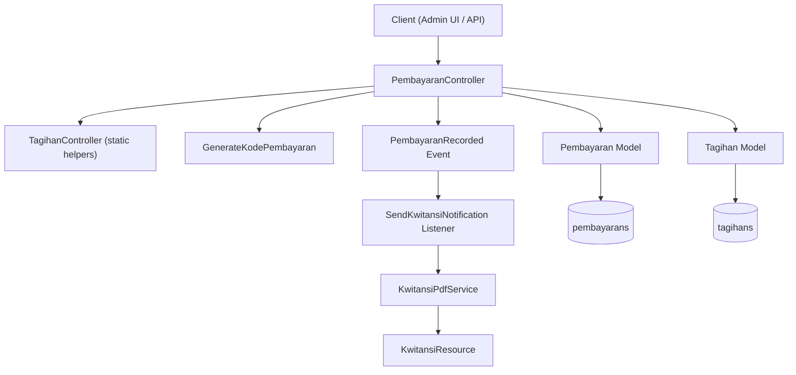
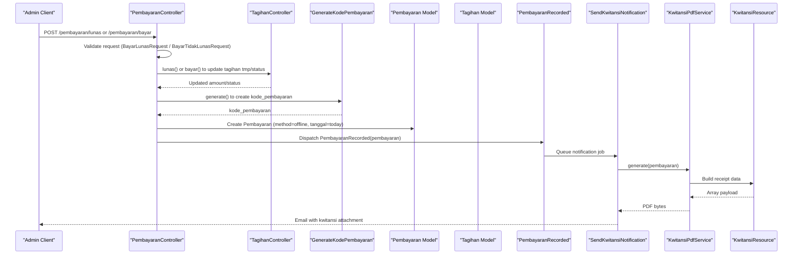
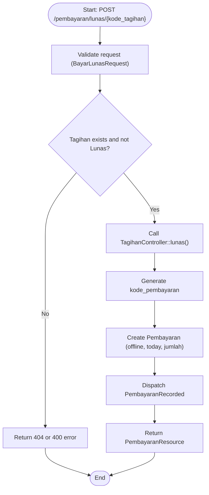
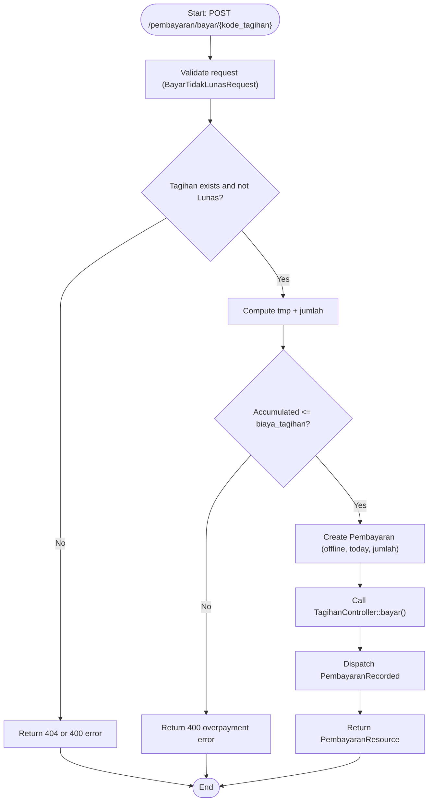
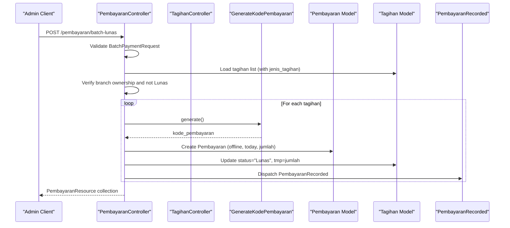
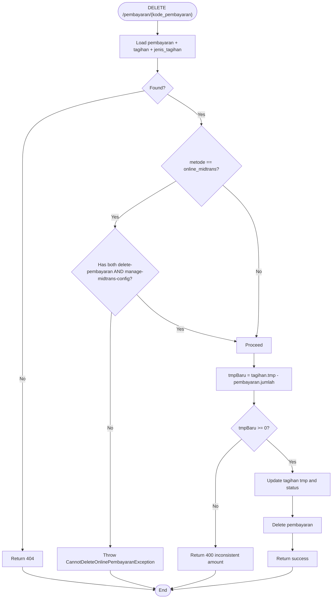
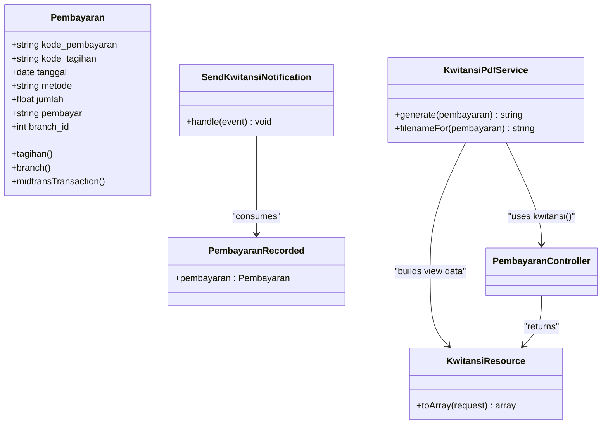
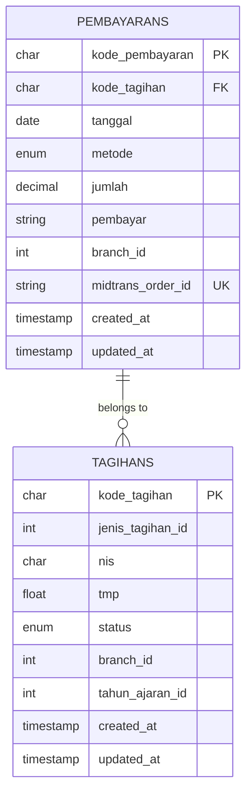
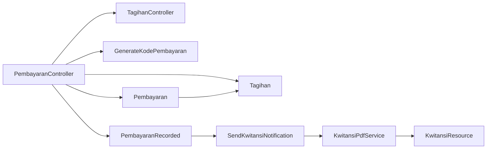

# Offline Payment Handling

<cite>
**Referenced Files in This Document**
- [PembayaranController.php](file://backend/app/Http/Controllers/PembayaranController.php)
- [BayarLunasRequest.php](file://backend/app/Http/Requests/BayarLunasRequest.php)
- [BayarTidakLunasRequest.php](file://backend/app/Http/Requests/BayarTidakLunasRequest.php)
- [TagihanController.php](file://backend/app/Http/Controllers/TagihanController.php)
- [Pembayaran.php](file://backend/app/Models/Pembayaran.php)
- [Tagihan.php](file://backend/app/Models/Tagihan.php)
- [GenerateKodePembayaran.php](file://backend/app/Services/GenerateKodePembayaran.php)
- [PembayaranRecorded.php](file://backend/app/Events/PembayaranRecorded.php)
- [SendKwitansiNotification.php](file://backend/app/Listeners/SendKwitansiNotification.php)
- [KwitansiPdfService.php](file://backend/app/Services/Notifications/KwitansiPdfService.php)
- [KwitansiResource.php](file://backend/app/Http/Resources/KwitansiResource.php)
- [2025_11_14_102319_create_pembayarans_table.php](file://backend/database/migrations/2025_11_14_102319_create_pembayarans_table.php)
- [2026_06_22_000003_add_midtrans_columns_to_pembayarans_table.php](file://backend/database/migrations/2026_06_22_000003_add_midtrans_columns_to_pembayarans_table.php)
</cite>

## Table of Contents
1. Introduction
2. Project Structure
3. Core Components
4. Architecture Overview
5. Detailed Component Analysis
6. Dependency Analysis
7. Performance Considerations
8. Troubleshooting Guide
9. Conclusion

## Introduction
This document explains the offline payment processing workflows for manual payment entry, validation, recording, approval considerations, receipt generation, and audit trail requirements. It focuses on:
- Manual payment entry via PembayaranController methods
- Request validation using BayarLunasRequest and BayarTidakLunasRequest
- Recording payments for cash, bank transfer, and other non-digital methods (metode = "offline")
- Approval processes and receipt generation
- Audit trail requirements for offline transactions
- Validation rules for amounts, dates, and payer information
- Examples for partial payments, full payments, corrections, and edge cases

## Project Structure
The offline payment flow is implemented primarily in the backend API layer with Eloquent models, request validators, services, events, listeners, and PDF resources. The key components are:
- Controllers: PembayaranController, TagihanController
- Requests: BayarLunasRequest, BayarTidakLunasRequest
- Models: Pembayaran, Tagihan
- Services: GenerateKodePembayaran, KwitansiPdfService
- Events/Listeners: PembayaranRecorded, SendKwitansiNotification
- Resources: KwitansiResource
- Database migrations: pembayarans table structure and extensions

**Diagram sources**
- [PembayaranController.php](file://backend/app/Http/Controllers/PembayaranController.php)
- [TagihanController.php](file://backend/app/Http/Controllers/TagihanController.php)
- [GenerateKodePembayaran.php](file://backend/app/Services/GenerateKodePembayaran.php)
- [Pembayaran.php](file://backend/app/Models/Pembayaran.php)
- [Tagihan.php](file://backend/app/Models/Tagihan.php)
- [PembayaranRecorded.php](file://backend/app/Events/PembayaranRecorded.php)
- [SendKwitansiNotification.php](file://backend/app/Listeners/SendKwitansiNotification.php)
- [KwitansiPdfService.php](file://backend/app/Services/Notifications/KwitansiPdfService.php)
- [KwitansiResource.php](file://backend/app/Http/Resources/KwitansiResource.php)

**Section sources**
- [PembayaranController.php](file://backend/app/Http/Controllers/PembayaranController.php)
- [TagihanController.php](file://backend/app/Http/Controllers/TagihanController.php)
- [Pembayaran.php](file://backend/app/Models/Pembayaran.php)
- [Tagihan.php](file://backend/app/Models/Tagihan.php)
- [GenerateKodePembayaran.php](file://backend/app/Services/GenerateKodePembayaran.php)
- [PembayaranRecorded.php](file://backend/app/Events/PembayaranRecorded.php)
- [SendKwitansiNotification.php](file://backend/app/Listeners/SendKwitansiNotification.php)
- [KwitansiPdfService.php](file://backend/app/Services/Notifications/KwitansiPdfService.php)
- [KwitansiResource.php](file://backend/app/Http/Resources/KwitansiResource.php)
- [2025_11_14_102319_create_pembayarans_table.php](file://backend/database/migrations/2025_11_14_102319_create_pembayarans_table.php)
- [2026_06_22_000003_add_midtrans_columns_to_pembayarans_table.php](file://backend/database/migrations/2026_06_22_000003_add_midtrans_columns_to_pembayarans_table.php)

## Core Components
- PembayaranController: Entry points for listing, creating, deleting, and generating receipts for payments; orchestrates offline payment flows.
- TagihanController: Provides static helpers to update tagihan state (tmp and status) when payments are recorded.
- BayarLunasRequest and BayarTidakLunasRequest: Validate input fields for full and partial payments respectively.
- GenerateKodePembayaran: Generates unique payment codes with database locking to avoid collisions.
- Pembayaran and Tagihan models: Represent payment records and invoice lines; define relationships and casts.
- PembayaranRecorded event and SendKwitansiNotification listener: Trigger asynchronous kwitansi email notifications.
- KwitansiPdfService and KwitansiResource: Generate consistent receipt data and PDF content.

Key responsibilities:
- Input validation and authorization checks
- Business rule enforcement (no overpayment, correct status transitions)
- Atomic updates to pembayaran and tagihan tables
- Receipt generation and notification dispatch
- Auditability through timestamps and structured responses

**Section sources**
- [PembayaranController.php](file://backend/app/Http/Controllers/PembayaranController.php)
- [TagihanController.php](file://backend/app/Http/Controllers/TagihanController.php)
- [BayarLunasRequest.php](file://backend/app/Http/Requests/BayarLunasRequest.php)
- [BayarTidakLunasRequest.php](file://backend/app/Http/Requests/BayarTidakLunasRequest.php)
- [GenerateKodePembayaran.php](file://backend/app/Services/GenerateKodePembayaran.php)
- [Pembayaran.php](file://backend/app/Models/Pembayaran.php)
- [Tagihan.php](file://backend/app/Models/Tagihan.php)
- [PembayaranRecorded.php](file://backend/app/Events/PembayaranRecorded.php)
- [SendKwitansiNotification.php](file://backend/app/Listeners/SendKwitansiNotification.php)
- [KwitansiPdfService.php](file://backend/app/Services/Notifications/KwitansiPdfService.php)
- [KwitansiResource.php](file://backend/app/Http/Resources/KwitansiResource.php)

## Architecture Overview
Offline payment flows follow a clear sequence: validate request, enforce business rules, record payment, update tagihan state, generate receipt, and notify stakeholders.

**Diagram sources**
- [PembayaranController.php](file://backend/app/Http/Controllers/PembayaranController.php)
- [TagihanController.php](file://backend/app/Http/Controllers/TagihanController.php)
- [GenerateKodePembayaran.php](file://backend/app/Services/GenerateKodePembayaran.php)
- [Pembayaran.php](file://backend/app/Models/Pembayaran.php)
- [Tagihan.php](file://backend/app/Models/Tagihan.php)
- [PembayaranRecorded.php](file://backend/app/Events/PembayaranRecorded.php)
- [SendKwitansiNotification.php](file://backend/app/Listeners/SendKwitansiNotification.php)
- [KwitansiPdfService.php](file://backend/app/Services/Notifications/KwitansiPdfService.php)
- [KwitansiResource.php](file://backend/app/Http/Resources/KwitansiResource.php)

## Detailed Component Analysis

### Manual Full Payment (lunas) Workflow
- Endpoint: PembayaranController::lunas
- Validation: BayarLunasRequest enforces required metode and pembayar; metode must be one of allowed values including offline.
- Business logic:
  - Ensure tagihan exists and is not already fully paid.
  - Delegate to TagihanController::lunas to set status to "Lunas" and tmp to total biaya_tagihan.
  - Create Pembayaran with generated kode_pembayaran, today's date, method "offline", jumlah from helper, and branch_id from current user.
  - Load relationships and dispatch PembayaranRecorded event.
- Output: PembayaranResource response.

**Diagram sources**
- [PembayaranController.php](file://backend/app/Http/Controllers/PembayaranController.php)
- [TagihanController.php](file://backend/app/Http/Controllers/TagihanController.php)
- [GenerateKodePembayaran.php](file://backend/app/Services/GenerateKodePembayaran.php)
- [Pembayaran.php](file://backend/app/Models/Pembayaran.php)
- [Tagihan.php](file://backend/app/Models/Tagihan.php)
- [PembayaranRecorded.php](file://backend/app/Events/PembayaranRecorded.php)

**Section sources**
- [PembayaranController.php](file://backend/app/Http/Controllers/PembayaranController.php)
- [TagihanController.php](file://backend/app/Http/Controllers/TagihanController.php)
- [BayarLunasRequest.php](file://backend/app/Http/Requests/BayarLunasRequest.php)
- [GenerateKodePembayaran.php](file://backend/app/Services/GenerateKodePembayaran.php)
- [Pembayaran.php](file://backend/app/Models/Pembayaran.php)
- [Tagihan.php](file://backend/app/Models/Tagihan.php)
- [PembayaranRecorded.php](file://backend/app/Events/PembayaranRecorded.php)

### Manual Partial Payment (bayar) Workflow
- Endpoint: PembayaranController::bayar
- Validation: BayarTidakLunasRequest enforces numeric jumlah with regex constraints, required metode and pembayar.
- Business logic:
  - Ensure tagihan exists and is not already fully paid.
  - Compute accumulated amount (tmp + jumlah) and compare against biaya_tagihan; reject if exceeds.
  - Create Pembayaran with generated kode_pembayaran, today's date, method "offline", jumlah from request.
  - Call TagihanController::bayar to update tmp and status ("Belum Lunas" unless fully paid).
  - Load relationships and dispatch PembayaranRecorded event.
- Output: PembayaranResource response.

**Diagram sources**
- [PembayaranController.php](file://backend/app/Http/Controllers/PembayaranController.php)
- [TagihanController.php](file://backend/app/Http/Controllers/TagihanController.php)
- [GenerateKodePembayaran.php](file://backend/app/Services/GenerateKodePembayaran.php)
- [Pembayaran.php](file://backend/app/Models/Pembayaran.php)
- [Tagihan.php](file://backend/app/Models/Tagihan.php)
- [PembayaranRecorded.php](file://backend/app/Events/PembayaranRecorded.php)

**Section sources**
- [PembayaranController.php](file://backend/app/Http/Controllers/PembayaranController.php)
- [TagihanController.php](file://backend/app/Http/Controllers/TagihanController.php)
- [BayarTidakLunasRequest.php](file://backend/app/Http/Requests/BayarTidakLunasRequest.php)
- [GenerateKodePembayaran.php](file://backend/app/Services/GenerateKodePembayaran.php)
- [Pembayaran.php](file://backend/app/Models/Pembayaran.php)
- [Tagihan.php](file://backend/app/Models/Tagihan.php)
- [PembayaranRecorded.php](file://backend/app/Events/PembayaranRecorded.php)

### Batch Full Payment (batchLunas) Workflow
- Endpoint: PembayaranController::batchLunas
- Validation: BatchPaymentRequest validates multiple kode_tagihan entries and common fields like metode and pembayar.
- Business logic:
  - Load all tagihan with jenis_tagihan and verify ownership by branch.
  - Ensure none are already "Lunas".
  - Within a DB transaction:
    - For each tagihan, compute jumlah = jenis_tagihan.jumlah - tagihan.tmp.
    - Create Pembayaran with generated kode_pembayaran, today's date, method "offline", jumlah, pembayar, branch_id.
    - Update tagihan status to "Lunas" and tmp to jenis_tagihan.jumlah.
  - Load relationships and dispatch PembayaranRecorded per record.
- Output: Collection of PembayaranResource.

**Diagram sources**
- [PembayaranController.php](file://backend/app/Http/Controllers/PembayaranController.php)
- [GenerateKodePembayaran.php](file://backend/app/Services/GenerateKodePembayaran.php)
- [Pembayaran.php](file://backend/app/Models/Pembayaran.php)
- [Tagihan.php](file://backend/app/Models/Tagihan.php)
- [PembayaranRecorded.php](file://backend/app/Events/PembayaranRecorded.php)

**Section sources**
- [PembayaranController.php](file://backend/app/Http/Controllers/PembayaranController.php)
- [GenerateKodePembayaran.php](file://backend/app/Services/GenerateKodePembayaran.php)
- [Pembayaran.php](file://backend/app/Models/Pembayaran.php)
- [Tagihan.php](file://backend/app/Models/Tagihan.php)
- [PembayaranRecorded.php](file://backend/app/Events/PembayaranRecorded.php)

### Payment Deletion and Corrections
- Endpoint: PembayaranController::delete
- Guard: Online Midtrans payments cannot be deleted unless specific permissions are held.
- Logic:
  - Load pembayaran with tagihan and jenis_tagihan.
  - Recompute tmpBaru = tagihan.tmp - pembayaran.jumlah; reject if negative.
  - Determine new status based on tmpBaru vs jenis_tagihan.jumlah.
  - Update tagihan tmp and status, then delete pembayaran.
- Use case: Correcting erroneous offline payments by removing incorrect entries and re-recording accurate ones.

**Diagram sources**
- [PembayaranController.php](file://backend/app/Http/Controllers/PembayaranController.php)

**Section sources**
- [PembayaranController.php](file://backend/app/Http/Controllers/PembayaranController.php)

### Receipt Generation (Kwitansi)
- Endpoint: PembayaranController::kwitansi returns KwitansiResource for a given kode_pembayaran.
- Service: KwitansiPdfService generates PDF by reusing the same resource data to ensure consistency between admin UI and email attachments.
- Notification: SendKwitansiNotification listens to PembayaranRecorded and sends kwitansi via NotificationService.

**Diagram sources**
- [PembayaranController.php](file://backend/app/Http/Controllers/PembayaranController.php)
- [KwitansiResource.php](file://backend/app/Http/Resources/KwitansiResource.php)
- [KwitansiPdfService.php](file://backend/app/Services/Notifications/KwitansiPdfService.php)
- [SendKwitansiNotification.php](file://backend/app/Listeners/SendKwitansiNotification.php)
- [PembayaranRecorded.php](file://backend/app/Events/PembayaranRecorded.php)
- [Pembayaran.php](file://backend/app/Models/Pembayaran.php)

**Section sources**
- [PembayaranController.php](file://backend/app/Http/Controllers/PembayaranController.php)
- [KwitansiResource.php](file://backend/app/Http/Resources/KwitansiResource.php)
- [KwitansiPdfService.php](file://backend/app/Services/Notifications/KwitansiPdfService.php)
- [SendKwitansiNotification.php](file://backend/app/Listeners/SendKwitansiNotification.php)
- [PembayaranRecorded.php](file://backend/app/Events/PembayaranRecorded.php)
- [Pembayaran.php](file://backend/app/Models/Pembayaran.php)

### Data Model and Schema Details
- pembayaran table:
  - Primary key: kode_pembayaran (char)
  - Foreign key: kode_tagihan references tagihans.kode_tagihan
  - Columns: tanggal (date), metode (enum: offline, online_midtrans), jumlah (decimal), pembayar (string), timestamps
  - Extension: midtrans_order_id (unique, nullable) and index on metode
- tagihan model:
  - Primary key: kode_tagihan
  - Fields include jenis_tagihan_id, nis, tmp (float), status, branch_id, tahun_ajaran_id
  - Relationships: jenis_tagihan, siswa, pembayaran, tahunAjaran, branch

**Diagram sources**
- [2025_11_14_102319_create_pembayarans_table.php](file://backend/database/migrations/2025_11_14_102319_create_pembayarans_table.php)
- [2026_06_22_000003_add_midtrans_columns_to_pembayarans_table.php](file://backend/database/migrations/2026_06_22_000003_add_midtrans_columns_to_pembayarans_table.php)
- [Pembayaran.php](file://backend/app/Models/Pembayaran.php)
- [Tagihan.php](file://backend/app/Models/Tagihan.php)

**Section sources**
- [2025_11_14_102319_create_pembayarans_table.php](file://backend/database/migrations/2025_11_14_102319_create_pembayarans_table.php)
- [2026_06_22_000003_add_midtrans_columns_to_pembayarans_table.php](file://backend/database/migrations/2026_06_22_000003_add_midtrans_columns_to_pembayarans_table.php)
- [Pembayaran.php](file://backend/app/Models/Pembayaran.php)
- [Tagihan.php](file://backend/app/Models/Tagihan.php)

## Dependency Analysis
- Controller dependencies:
  - PembayaranController depends on TagihanController static helpers for updating tagihan state.
  - PembayaranController uses GenerateKodePembayaran for unique identifiers.
  - PembayaranController creates Pembayaran records and loads relationships for responses.
- Event-driven dependencies:
  - PembayaranRecorded event triggers SendKwitansiNotification listener.
  - SendKwitansiNotification uses NotificationService to send kwitansi emails.
  - KwitansiPdfService reuses PembayaranController::kwitansi and KwitansiResource to build consistent PDF payloads.
- Model relationships:
  - Pembayaran belongsTo Tagihan; Tagihan hasMany Pembayaran.
  - Both models have branch relationships and appropriate casts.

**Diagram sources**
- [PembayaranController.php](file://backend/app/Http/Controllers/PembayaranController.php)
- [TagihanController.php](file://backend/app/Http/Controllers/TagihanController.php)
- [GenerateKodePembayaran.php](file://backend/app/Services/GenerateKodePembayaran.php)
- [Pembayaran.php](file://backend/app/Models/Pembayaran.php)
- [Tagihan.php](file://backend/app/Models/Tagihan.php)
- [PembayaranRecorded.php](file://backend/app/Events/PembayaranRecorded.php)
- [SendKwitansiNotification.php](file://backend/app/Listeners/SendKwitansiNotification.php)
- [KwitansiPdfService.php](file://backend/app/Services/Notifications/KwitansiPdfService.php)
- [KwitansiResource.php](file://backend/app/Http/Resources/KwitansiResource.php)

**Section sources**
- [PembayaranController.php](file://backend/app/Http/Controllers/PembayaranController.php)
- [TagihanController.php](file://backend/app/Http/Controllers/TagihanController.php)
- [GenerateKodePembayaran.php](file://backend/app/Services/GenerateKodePembayaran.php)
- [Pembayaran.php](file://backend/app/Models/Pembayaran.php)
- [Tagihan.php](file://backend/app/Models/Tagihan.php)
- [PembayaranRecorded.php](file://backend/app/Events/PembayaranRecorded.php)
- [SendKwitansiNotification.php](file://backend/app/Listeners/SendKwitansiNotification.php)
- [KwitansiPdfService.php](file://backend/app/Services/Notifications/KwitansiPdfService.php)
- [KwitansiResource.php](file://backend/app/Http/Resources/KwitansiResource.php)

## Performance Considerations
- Unique code generation:
  - GenerateKodePembayaran locks the pembayarans table during generation to prevent race conditions. This ensures uniqueness but may introduce contention under high concurrency. Consider queuing or application-level atomic sequences if scaling becomes an issue.
- Transactional batch operations:
  - batchLunas wraps multiple tagihan updates and pembayaran creations within a single DB transaction to maintain consistency.
- Eager loading:
  - Responses load necessary relationships (tagihan, jenis_tagihan, siswa) to minimize N+1 queries.
- Indexing:
  - metode column has an index for filtering; consider additional indexes for frequently queried columns such as tanggal and kode_tagihan.

[No sources needed since this section provides general guidance]

## Troubleshooting Guide
Common issues and resolutions:
- Overpayment errors:
  - When accumulating partial payments exceeds biaya_tagihan, the system returns a 400 error. Review the accumulated tmp and requested jumlah.
- Already paid tagihan:
  - Attempting to pay a tagihan with status "Lunas" results in a 400 error. Confirm tagihan status before proceeding.
- Missing tagihan:
  - A 404 indicates the tagihan does not exist. Verify kode_tagihan and branch ownership.
- Inconsistent deletion:
  - Deleting a pembayaran where tmpBaru would become negative returns a 400 error indicating inconsistency. Reconcile accumulated payments before deletion.
- Online payment deletion guard:
  - Deleting online_midtrans payments requires both delete-pembayaran and manage-midtrans-config permissions. Adjust user roles accordingly.
- Receipt generation failures:
  - If kwitansi PDF generation fails, check Pdf rendering configuration and app settings used by KwitansiPdfService.

**Section sources**
- [PembayaranController.php](file://backend/app/Http/Controllers/PembayaranController.php)
- [TagihanController.php](file://backend/app/Http/Controllers/TagihanController.php)
- [KwitansiPdfService.php](file://backend/app/Services/Notifications/KwitansiPdfService.php)

## Conclusion
The offline payment workflow is robustly implemented with clear separation of concerns: controllers orchestrate flows, request classes enforce input validation, services handle unique code generation and PDF creation, and events drive asynchronous notifications. Business rules protect financial integrity by preventing overpayments and ensuring correct status transitions. Receipt generation is consistent across admin and email channels, and deletions are guarded to maintain data consistency. For future enhancements, consider improving concurrency handling in code generation and expanding audit logging for offline transactions beyond timestamps.

[No sources needed since this section summarizes without analyzing specific files]