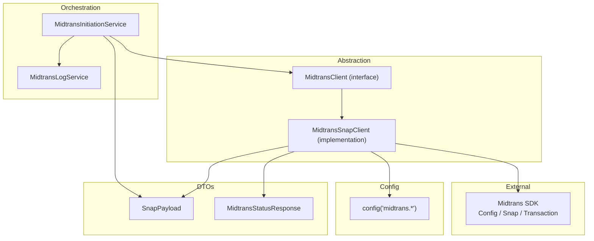
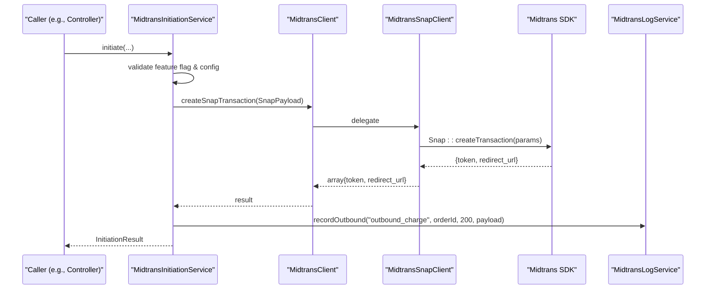
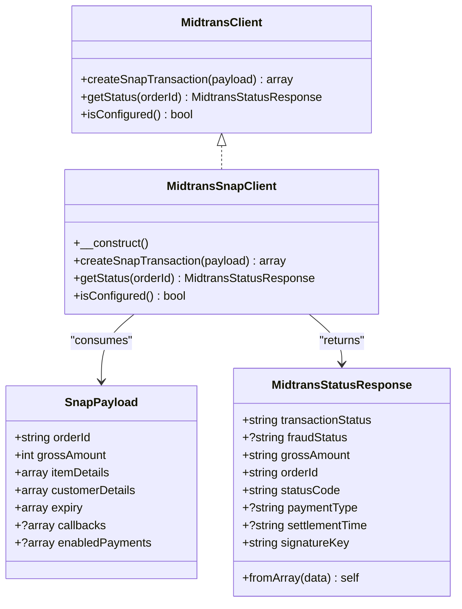
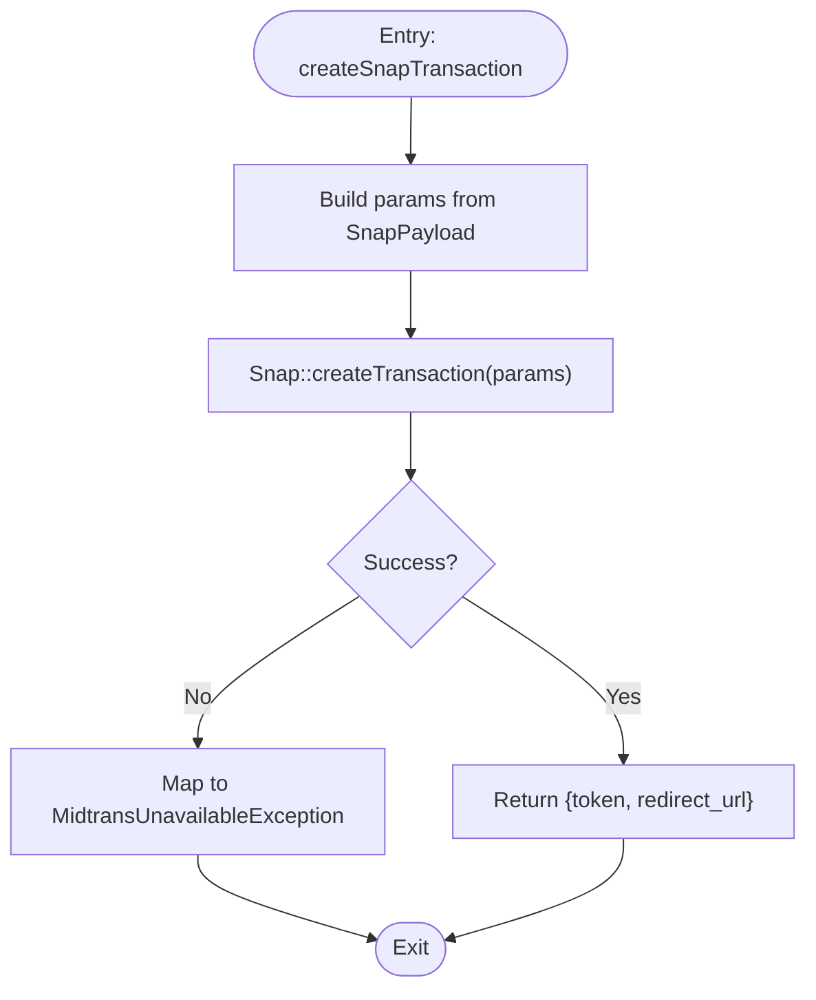
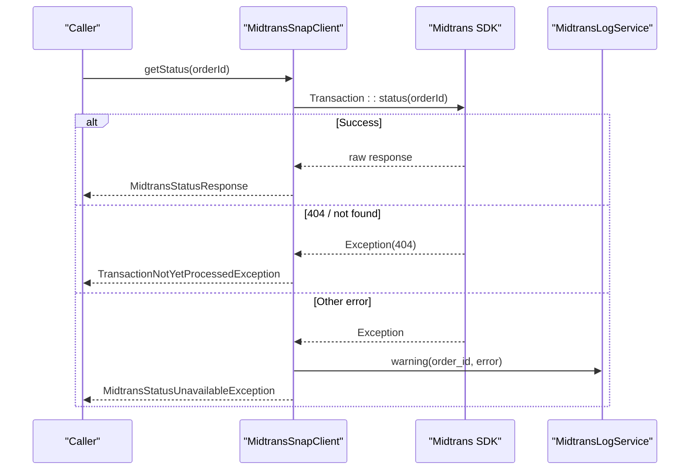
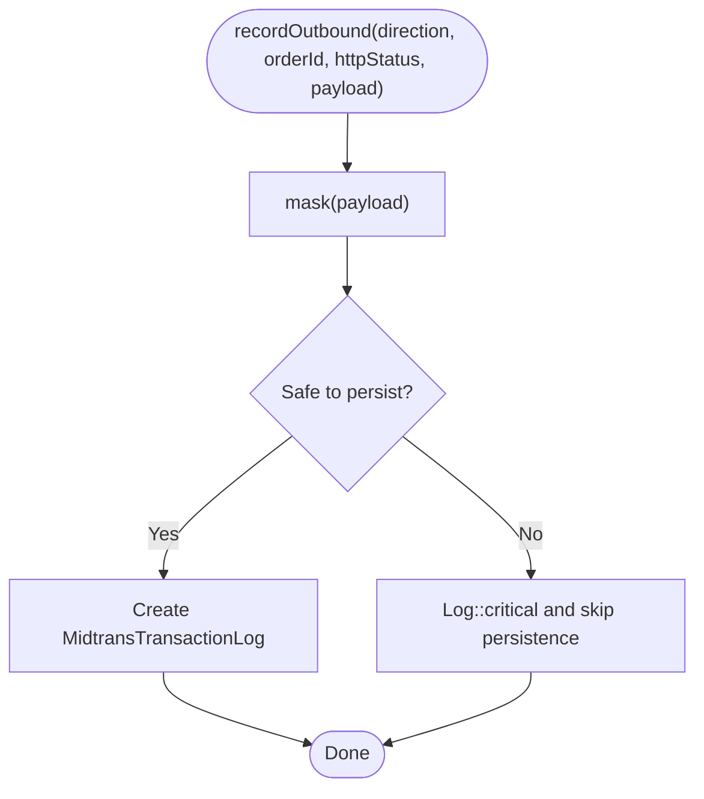
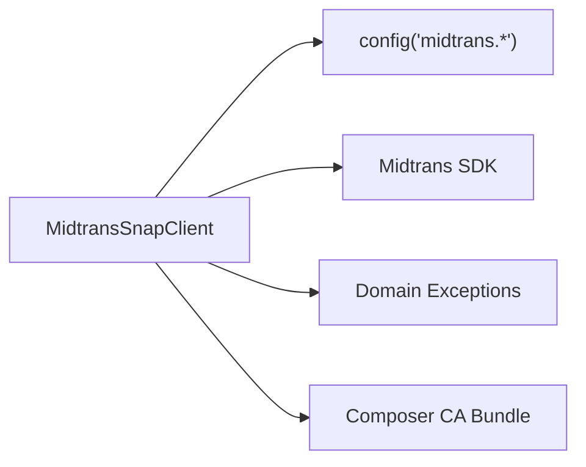

# Midtrans Client Abstraction Layer

<cite>
**Referenced Files in This Document**
- [MidtransClient.php](file://backend/app/Services/Midtrans/MidtransClient.php)
- [MidtransSnapClient.php](file://backend/app/Services/Midtrans/MidtransSnapClient.php)
- [midtrans.php](file://backend/config/midtrans.php)
- [SnapPayload.php](file://backend/app/Services/Midtrans/Dto/SnapPayload.php)
- [MidtransStatusResponse.php](file://backend/app/Services/Midtrans/Dto/MidtransStatusResponse.php)
- [MidtransInitiationService.php](file://backend/app/Services/Midtrans/MidtransInitiationService.php)
- [MidtransLogService.php](file://backend/app/Services/Midtrans/MidtransLogService.php)
- [MidtransUnavailableException.php](file://backend/app/Exceptions/Midtrans/MidtransUnavailableException.php)
- [MidtransStatusUnavailableException.php](file://backend/app/Exceptions/Midtrans/MidtransStatusUnavailableException.php)
- [api.php](file://backend/routes/api.php)
</cite>

## Table of Contents
1. [Introduction](#introduction)
2. [Project Structure](#project-structure)
3. [Core Components](#core-components)
4. [Architecture Overview](#architecture-overview)
5. [Detailed Component Analysis](#detailed-component-analysis)
6. [Dependency Analysis](#dependency-analysis)
7. [Performance Considerations](#performance-considerations)
8. [Troubleshooting Guide](#troubleshooting-guide)
9. [Conclusion](#conclusion)

## Introduction
This document explains the Midtrans client abstraction layer that provides a clean, testable interface to Midtrans APIs. It covers client initialization, configuration validation, HTTP communication patterns, and error transformation. It also details the createSnapTransaction method implementation, request/response handling, authentication, logging strategies, and how specialized Snap operations are handled by MidtransSnapClient. Usage examples and troubleshooting guidance are included for practical integration.

## Project Structure
The Midtrans integration is implemented as a small set of focused components:
- An interface defining the client contract
- A default implementation using the official Midtrans PHP SDK
- DTOs for structured payloads and responses
- Services orchestrating business logic around the client
- Configuration and logging utilities

**Diagram sources**
- [MidtransClient.php:8-26](file://backend/app/Services/Midtrans/MidtransClient.php#L8-L26)
- [MidtransSnapClient.php:13-122](file://backend/app/Services/Midtrans/MidtransSnapClient.php#L13-L122)
- [SnapPayload.php:5-23](file://backend/app/Services/Midtrans/Dto/SnapPayload.php#L5-L23)
- [MidtransStatusResponse.php:5-34](file://backend/app/Services/Midtrans/Dto/MidtransStatusResponse.php#L5-L34)
- [MidtransInitiationService.php:22-29](file://backend/app/Services/Midtrans/MidtransInitiationService.php#L22-L29)
- [MidtransLogService.php:8-10](file://backend/app/Services/Midtrans/MidtransLogService.php#L8-L10)
- [midtrans.php:15-35](file://backend/config/midtrans.php#L15-L35)

**Section sources**
- [MidtransClient.php:8-26](file://backend/app/Services/Midtrans/MidtransClient.php#L8-L26)
- [MidtransSnapClient.php:13-122](file://backend/app/Services/Midtrans/MidtransSnapClient.php#L13-L122)
- [SnapPayload.php:5-23](file://backend/app/Services/Midtrans/Dto/SnapPayload.php#L5-L23)
- [MidtransStatusResponse.php:5-34](file://backend/app/Services/Midtrans/Dto/MidtransStatusResponse.php#L5-L34)
- [MidtransInitiationService.php:22-29](file://backend/app/Services/Midtrans/MidtransInitiationService.php#L22-L29)
- [MidtransLogService.php:8-10](file://backend/app/Services/Midtrans/MidtransLogService.php#L8-L10)
- [midtrans.php:15-35](file://backend/config/midtrans.php#L15-L35)

## Core Components
- MidtransClient: Defines the contract for creating Snap transactions, retrieving transaction status, and checking configuration readiness.
- MidtransSnapClient: Default implementation wrapping the Midtrans PHP SDK with environment-aware configuration, SSL CA bundle setup, and robust error mapping.
- SnapPayload: Strongly typed payload for Snap creation requests.
- MidtransStatusResponse: Structured response from the Status API.
- MidtransInitiationService: Orchestrates initiation flows, builds SnapPayload, calls the client, and handles success/failure outcomes.
- MidtransLogService: Records inbound/outbound traffic with sensitive data masking and safety nets.

Key responsibilities:
- Initialization and configuration validation
- Secure HTTP communication via SDK
- Domain-specific exception mapping
- Logging with masking and safety checks

**Section sources**
- [MidtransClient.php:8-26](file://backend/app/Services/Midtrans/MidtransClient.php#L8-L26)
- [MidtransSnapClient.php:15-45](file://backend/app/Services/Midtrans/MidtransSnapClient.php#L15-L45)
- [SnapPayload.php:5-23](file://backend/app/Services/Midtrans/Dto/SnapPayload.php#L5-L23)
- [MidtransStatusResponse.php:5-34](file://backend/app/Services/Midtrans/Dto/MidtransStatusResponse.php#L5-L34)
- [MidtransInitiationService.php:22-29](file://backend/app/Services/Midtrans/MidtransInitiationService.php#L22-L29)
- [MidtransLogService.php:8-10](file://backend/app/Services/Midtrans/MidtransLogService.php#L8-L10)

## Architecture Overview
The abstraction isolates external dependencies behind a simple interface. Business services depend on the interface, enabling easy testing and future swaps. The default implementation uses the official SDK and centralizes configuration and error handling.

**Diagram sources**
- [MidtransInitiationService.php:197-236](file://backend/app/Services/Midtrans/MidtransInitiationService.php#L197-L236)
- [MidtransClient.php:10-20](file://backend/app/Services/Midtrans/MidtransClient.php#L10-L20)
- [MidtransSnapClient.php:50-80](file://backend/app/Services/Midtrans/MidtransSnapClient.php#L50-L80)
- [MidtransLogService.php:40-63](file://backend/app/Services/Midtrans/MidtransLogService.php#L40-L63)

## Detailed Component Analysis

### MidtransClient Interface
Defines three core methods:
- createSnapTransaction(SnapPayload): returns token and redirect URL
- getStatus(string $orderId): returns a structured status response
- isConfigured(): validates presence of required credentials

This interface enables dependency injection and testability.

**Section sources**
- [MidtransClient.php:8-26](file://backend/app/Services/Midtrans/MidtransClient.php#L8-L26)

### MidtransSnapClient Implementation
Responsibilities:
- Initializes SDK configuration from application config
- Ensures reliable HTTPS by pointing cURL at a known CA bundle
- Implements createSnapTransaction and getStatus
- Maps SDK exceptions to domain exceptions

Initialization highlights:
- Reads server_key, client_key, environment flags
- Enables sanitization and 3DS
- Configures CURLOPT_CAINFO/CURLOPT_CAPATH and an empty header array to avoid warnings

HTTP communication patterns:
- Uses Snap::createTransaction for payment initiation
- Uses Transaction::status for status polling
- Wraps all SDK errors into domain exceptions

Error transformation:
- General failures → MidtransUnavailableException
- Status API 404 or “Transaction doesn’t exist” → TransactionNotYetProcessedException
- Other status failures → MidtransStatusUnavailableException

Logging:
- Logs warnings for status API failures including order_id and error message

Configuration check:
- isConfigured() ensures server_key, client_key, merchant_id are present

**Section sources**
- [MidtransSnapClient.php:15-45](file://backend/app/Services/Midtrans/MidtransSnapClient.php#L15-L45)
- [MidtransSnapClient.php:50-80](file://backend/app/Services/Midtrans/MidtransSnapClient.php#L50-L80)
- [MidtransSnapClient.php:85-109](file://backend/app/Services/Midtrans/MidtransSnapClient.php#L85-L109)
- [MidtransSnapClient.php:114-121](file://backend/app/Services/Midtrans/MidtransSnapClient.php#L114-L121)
- [MidtransUnavailableException.php:5-14](file://backend/app/Exceptions/Midtrans/MidtransUnavailableException.php#L5-L14)
- [MidtransStatusUnavailableException.php:5-14](file://backend/app/Exceptions/Midtrans/MidtransStatusUnavailableException.php#L5-L14)

#### Class Diagram

**Diagram sources**
- [MidtransClient.php:8-26](file://backend/app/Services/Midtrans/MidtransClient.php#L8-L26)
- [MidtransSnapClient.php:13-122](file://backend/app/Services/Midtrans/MidtransSnapClient.php#L13-L122)
- [SnapPayload.php:5-23](file://backend/app/Services/Midtrans/Dto/SnapPayload.php#L5-L23)
- [MidtransStatusResponse.php:5-34](file://backend/app/Services/Midtrans/Dto/MidtransStatusResponse.php#L5-L34)

### createSnapTransaction Method Flow
End-to-end flow for creating a Snap transaction:
- Build parameters from SnapPayload
- Call SDK’s Snap::createTransaction
- Return token and redirect URL
- Map any SDK exception to MidtransUnavailableException

**Diagram sources**
- [MidtransSnapClient.php:50-80](file://backend/app/Services/Midtrans/MidtransSnapClient.php#L50-L80)

**Section sources**
- [MidtransSnapClient.php:50-80](file://backend/app/Services/Midtrans/MidtransSnapClient.php#L50-L80)

### Request/Response Handling and Error Transformation
- Outbound charge:
  - Success: return token and redirect URL; log outbound with masked payload
  - Failure: mark transaction as failure and throw MidtransUnavailableException
- Status retrieval:
  - Success: map raw response to MidtransStatusResponse
  - 404 or “Transaction doesn’t exist”: throw TransactionNotYetProcessedException
  - Other errors: log warning and throw MidtransStatusUnavailableException

**Diagram sources**
- [MidtransSnapClient.php:85-109](file://backend/app/Services/Midtrans/MidtransSnapClient.php#L85-L109)
- [MidtransLogService.php:40-63](file://backend/app/Services/Midtrans/MidtransLogService.php#L40-L63)

**Section sources**
- [MidtransSnapClient.php:85-109](file://backend/app/Services/Midtrans/MidtransSnapClient.php#L85-L109)
- [MidtransUnavailableException.php:5-14](file://backend/app/Exceptions/Midtrans/MidtransUnavailableException.php#L5-L14)
- [MidtransStatusUnavailableException.php:5-14](file://backend/app/Exceptions/Midtrans/MidtransStatusUnavailableException.php#L5-L14)

### Authentication Handling and Request Signing
- Authentication:
  - Server key and client key are read from config and set on SDK Config
  - Environment toggles production vs sandbox
- Request signing:
  - Handled internally by the Midtrans SDK when calling Snap and Transaction endpoints
  - Signature verification for webhooks is performed elsewhere; this client focuses on outbound calls

**Section sources**
- [MidtransSnapClient.php:15-22](file://backend/app/Services/Midtrans/MidtransSnapClient.php#L15-L22)
- [midtrans.php:15-35](file://backend/config/midtrans.php#L15-L35)

### Retry Logic
- No explicit retry logic is implemented in the client.
- Higher-level orchestration may implement retries for transient issues (e.g., database deadlocks in notification processing), but the client itself does not retry HTTP calls.

[No sources needed since this section provides general guidance]

### Logging Strategies
- Outbound logs:
  - Record direction, order ID, HTTP status, and masked payload
  - Masking removes sensitive keys and prevents literal server_key leakage
  - Safety net: if masking fails, do not persist and log critical incident
- Inbound logs:
  - Record webhook bodies with IP and masked payload
- Warning logs:
  - Status API failures include order_id and error message

**Diagram sources**
- [MidtransLogService.php:40-63](file://backend/app/Services/Midtrans/MidtransLogService.php#L40-L63)
- [MidtransLogService.php:71-107](file://backend/app/Services/Midtrans/MidtransLogService.php#L71-L107)

**Section sources**
- [MidtransLogService.php:8-10](file://backend/app/Services/Midtrans/MidtransLogService.php#L8-L10)
- [MidtransLogService.php:40-63](file://backend/app/Services/Midtrans/MidtransLogService.php#L40-L63)
- [MidtransLogService.php:71-107](file://backend/app/Services/Midtrans/MidtransLogService.php#L71-L107)

### Configuration Options
Key options used by the client and related services:
- Feature flags:
  - enabled: toggle online payments
  - webhook_enabled: toggle webhook processing
- Credentials:
  - server_key, client_key, merchant_id
- Environment:
  - environment: sandbox or production
- Transaction settings:
  - min_amount, expiry_hours, finish_url, log_retention_days
- Fee configuration:
  - fee_flat and per-channel fees

These values are consumed by the client during initialization and by orchestration services during payload building.

**Section sources**
- [midtrans.php:15-35](file://backend/config/midtrans.php#L15-L35)
- [midtrans.php:58-101](file://backend/config/midtrans.php#L58-L101)
- [midtrans.php:113-127](file://backend/config/midtrans.php#L113-L127)

### Usage Patterns and Examples
- Initiating a transaction:
  - Controllers accept validated input and call MidtransInitiationService
  - Service builds SnapPayload, calls client, updates DB, logs outbound, and returns result
- Batch initiation:
  - Similar flow with multiple tagihan items aggregated into one Snap checkout
- Status synchronization:
  - Admin sync endpoint delegates to service which calls client.getStatus and processes verified payload

Example paths:
- Route registration for Midtrans endpoints
- Controller initiating transactions
- Service orchestration and client usage

**Section sources**
- [api.php:321-344](file://backend/routes/api.php#L321-L344)
- [MidtransInitiationService.php:197-236](file://backend/app/Services/Midtrans/MidtransInitiationService.php#L197-L236)
- [MidtransInitiationService.php:395-417](file://backend/app/Services/Midtrans/MidtransInitiationService.php#L395-L417)

## Dependency Analysis
The client depends on:
- Application configuration for credentials and environment
- Midtrans SDK for HTTP calls
- Domain exceptions for error signaling
- Optional Composer CA bundle for reliable TLS

**Diagram sources**
- [MidtransSnapClient.php:15-45](file://backend/app/Services/Midtrans/MidtransSnapClient.php#L15-L45)
- [MidtransUnavailableException.php:5-14](file://backend/app/Exceptions/Midtrans/MidtransUnavailableException.php#L5-L14)
- [MidtransStatusUnavailableException.php:5-14](file://backend/app/Exceptions/Midtrans/MidtransStatusUnavailableException.php#L5-L14)

**Section sources**
- [MidtransSnapClient.php:15-45](file://backend/app/Services/Midtrans/MidtransSnapClient.php#L15-L45)

## Performance Considerations
- Avoid unnecessary retries at the client level; rely on idempotency and higher-level safeguards
- Keep logging non-blocking; masking failures should not disrupt main flows
- Use minimal payloads and only include optional fields when necessary
- Prefer batch operations where supported to reduce network overhead

[No sources needed since this section provides general guidance]

## Troubleshooting Guide
Common issues and resolutions:
- SSL certificate problems on Windows:
  - Ensure Composer CA bundle is available; the client auto-configures CURLOPT_CAINFO/CURLOPT_CAPATH
- Missing credentials:
  - Verify server_key, client_key, merchant_id are set; isConfigured() will return false if missing
- Midtrans unavailable:
  - Check network connectivity and environment; client maps SDK errors to MidtransUnavailableException
- Status not available:
  - If 404 or “Transaction doesn’t exist”, the transaction has not been registered yet; handle accordingly
- Logging anomalies:
  - If masking safety net triggers, logs are skipped; investigate payload content and server_key exposure

Actionable steps:
- Validate configuration via isConfigured() before initiating transactions
- Inspect logs for outbound_charge entries and warnings for status failures
- Confirm environment and CA bundle configuration for HTTPS stability

**Section sources**
- [MidtransSnapClient.php:15-45](file://backend/app/Services/Midtrans/MidtransSnapClient.php#L15-L45)
- [MidtransSnapClient.php:114-121](file://backend/app/Services/Midtrans/MidtransSnapClient.php#L114-L121)
- [MidtransUnavailableException.php:5-14](file://backend/app/Exceptions/Midtrans/MidtransUnavailableException.php#L5-L14)
- [MidtransStatusUnavailableException.php:5-14](file://backend/app/Exceptions/Midtrans/MidtransStatusUnavailableException.php#L5-L14)
- [MidtransLogService.php:71-107](file://backend/app/Services/Midtrans/MidtransLogService.php#L71-L107)

## Conclusion
The Midtrans client abstraction layer cleanly separates concerns between business logic and external payment integration. By encapsulating configuration, authentication, HTTP communication, and error mapping within MidtransSnapClient, it provides a stable interface for services like MidtransInitiationService. Robust logging with masking and safety nets ensures observability without compromising security. The design supports testing through dependency injection and offers clear pathways for troubleshooting and operational reliability.