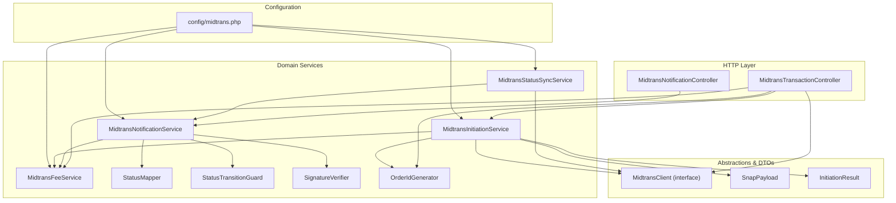
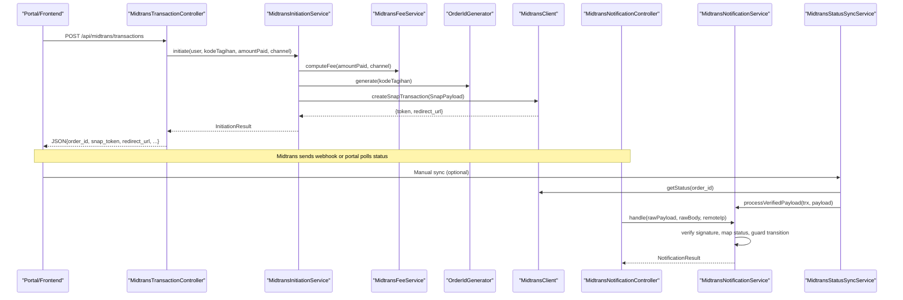
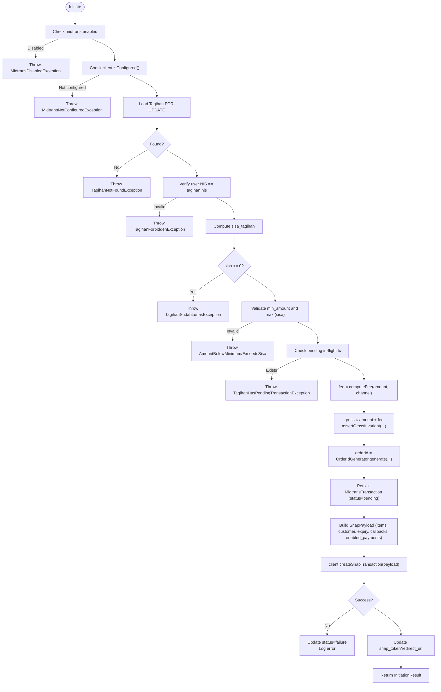
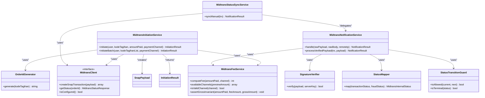

# Online Payment Integration

<cite>
**Referenced Files in This Document**
- [MidtransInitiationService.php](file://backend/app/Services/Midtrans/MidtransInitiationService.php)
- [MidtransClient.php](file://backend/app/Services/Midtrans/MidtransClient.php)
- [StatusMapper.php](file://backend/app/Services/Midtrans/StatusMapper.php)
- [MidtransFeeService.php](file://backend/app/Services/Midtrans/MidtransFeeService.php)
- [midtrans.php](file://backend/config/midtrans.php)
- [MidtransNotificationController.php](file://backend/app/Http/Controllers/MidtransNotificationController.php)
- [MidtransTransactionController.php](file://backend/app/Http/Controllers/MidtransTransactionController.php)
- [MidtransNotificationService.php](file://backend/app/Services/Midtrans/MidtransNotificationService.php)
- [MidtransStatusSyncService.php](file://backend/app/Services/Midtrans/MidtransStatusSyncService.php)
- [OrderIdGenerator.php](file://backend/app/Services/Midtrans/OrderIdGenerator.php)
- [SignatureVerifier.php](file://backend/app/Services/Midtrans/SignatureVerifier.php)
- [StatusTransitionGuard.php](file://backend/app/Services/Midtrans/StatusTransitionGuard.php)
- [SnapPayload.php](file://backend/app/Services/Midtrans/Dto/SnapPayload.php)
- [InitiationResult.php](file://backend/app/Services/Midtrans/Dto/InitiationResult.php)
</cite>

## Table of Contents
1. Introduction
2. Project Structure
3. Core Components
4. Architecture Overview
5. Detailed Component Analysis
6. Dependency Analysis
7. Performance Considerations
8. Troubleshooting Guide
9. Conclusion

## Introduction
This document explains the online payment integration with Midtrans, focusing on transaction initiation, client abstraction, status synchronization, fee calculation, configuration, webhook handling, and retry mechanisms. It is designed for both technical and non-technical readers to understand how payments are created, processed, reconciled, and recorded.

## Project Structure
The Midtrans integration is implemented as a set of services, DTOs, controllers, and configuration files under the backend application:
- Services orchestrate business logic (initiation, fees, notifications, status sync).
- DTOs encapsulate request/response shapes.
- Controllers expose HTTP endpoints for initiating transactions and receiving webhooks.
- Configuration centralizes environment-driven settings.

**Diagram sources**
- [MidtransTransactionController.php:1-127](file://backend/app/Http/Controllers/MidtransTransactionController.php#L1-L127)
- [MidtransNotificationController.php:1-35](file://backend/app/Http/Controllers/MidtransNotificationController.php#L1-L35)
- [MidtransInitiationService.php:1-473](file://backend/app/Services/Midtrans/MidtransInitiationService.php#L1-L473)
- [MidtransNotificationService.php:1-284](file://backend/app/Services/Midtrans/MidtransNotificationService.php#L1-L284)
- [MidtransStatusSyncService.php:1-73](file://backend/app/Services/Midtrans/MidtransStatusSyncService.php#L1-L73)
- [MidtransFeeService.php:1-144](file://backend/app/Services/Midtrans/MidtransFeeService.php#L1-L144)
- [StatusMapper.php:1-41](file://backend/app/Services/Midtrans/StatusMapper.php#L1-L41)
- [StatusTransitionGuard.php:1-77](file://backend/app/Services/Midtrans/StatusTransitionGuard.php#L1-L77)
- [SignatureVerifier.php:1-34](file://backend/app/Services/Midtrans/SignatureVerifier.php#L1-L34)
- [MidtransClient.php:1-27](file://backend/app/Services/Midtrans/MidtransClient.php#L1-L27)
- [SnapPayload.php:1-24](file://backend/app/Services/Midtrans/Dto/SnapPayload.php#L1-L24)
- [InitiationResult.php:1-19](file://backend/app/Services/Midtrans/Dto/InitiationResult.php#L1-L19)
- [midtrans.php:1-130](file://backend/config/midtrans.php#L1-L130)

**Section sources**
- [MidtransTransactionController.php:1-127](file://backend/app/Http/Controllers/MidtransTransactionController.php#L1-L127)
- [MidtransNotificationController.php:1-35](file://backend/app/Http/Controllers/MidtransNotificationController.php#L1-L35)
- [MidtransInitiationService.php:1-473](file://backend/app/Services/Midtrans/MidtransInitiationService.php#L1-L473)
- [MidtransNotificationService.php:1-284](file://backend/app/Services/Midtrans/MidtransNotificationService.php#L1-L284)
- [MidtransStatusSyncService.php:1-73](file://backend/app/Services/Midtrans/MidtransStatusSyncService.php#L1-L73)
- [MidtransFeeService.php:1-144](file://backend/app/Services/Midtrans/MidtransFeeService.php#L1-L144)
- [StatusMapper.php:1-41](file://backend/app/Services/Midtrans/StatusMapper.php#L1-L41)
- [StatusTransitionGuard.php:1-77](file://backend/app/Services/Midtrans/StatusTransitionGuard.php#L1-L77)
- [SignatureVerifier.php:1-34](file://backend/app/Services/Midtrans/SignatureVerifier.php#L1-L34)
- [MidtransClient.php:1-27](file://backend/app/Services/Midtrans/MidtransClient.php#L1-L27)
- [SnapPayload.php:1-24](file://backend/app/Services/Midtrans/Dto/SnapPayload.php#L1-L24)
- [InitiationResult.php:1-19](file://backend/app/Services/Midtrans/Dto/InitiationResult.php#L1-L19)
- [midtrans.php:1-130](file://backend/config/midtrans.php#L1-L130)

## Core Components
- MidtransInitiationService: Orchestrates single and batch Snap payment creation, including validation, fee computation, order ID generation, payload assembly, and client communication.
- MidtransClient: Abstraction over Midtrans API calls (create Snap transaction, get status, configuration check).
- StatusMapper: Maps Midtrans transaction/fraud statuses to internal states.
- MidtransFeeService: Computes admin fees per channel and validates gross amount invariants; exposes available channels with previews.
- MidtransNotificationService: Processes inbound webhooks and verified payloads, enforces transitions, records payments, and updates state.
- MidtransStatusSyncService: Manually syncs transaction status by querying Midtrans and delegates to notification processing.
- OrderIdGenerator: Produces unique, compliant order IDs.
- SignatureVerifier: Verifies webhook signatures using SHA-512.
- StatusTransitionGuard: Enforces allowed state transitions.
- DTOs: SnapPayload and InitiationResult define structured data for requests and responses.

**Section sources**
- [MidtransInitiationService.php:1-473](file://backend/app/Services/Midtrans/MidtransInitiationService.php#L1-L473)
- [MidtransClient.php:1-27](file://backend/app/Services/Midtrans/MidtransClient.php#L1-L27)
- [StatusMapper.php:1-41](file://backend/app/Services/Midtrans/StatusMapper.php#L1-L41)
- [MidtransFeeService.php:1-144](file://backend/app/Services/Midtrans/MidtransFeeService.php#L1-L144)
- [MidtransNotificationService.php:1-284](file://backend/app/Services/Midtrans/MidtransNotificationService.php#L1-L284)
- [MidtransStatusSyncService.php:1-73](file://backend/app/Services/Midtrans/MidtransStatusSyncService.php#L1-L73)
- [OrderIdGenerator.php:1-64](file://backend/app/Services/Midtrans/OrderIdGenerator.php#L1-L64)
- [SignatureVerifier.php:1-34](file://backend/app/Services/Midtrans/SignatureVerifier.php#L1-L34)
- [StatusTransitionGuard.php:1-77](file://backend/app/Services/Midtrans/StatusTransitionGuard.php#L1-L77)
- [SnapPayload.php:1-24](file://backend/app/Services/Midtrans/Dto/SnapPayload.php#L1-L24)
- [InitiationResult.php:1-19](file://backend/app/Services/Midtrans/Dto/InitiationResult.php#L1-L19)

## Architecture Overview
The system separates concerns across HTTP controllers, domain services, and an external gateway abstraction. Webhooks and manual sync flows converge into a shared notification processor that validates, maps, guards transitions, and persists results.

**Diagram sources**
- [MidtransTransactionController.php:1-127](file://backend/app/Http/Controllers/MidtransTransactionController.php#L1-L127)
- [MidtransInitiationService.php:1-473](file://backend/app/Services/Midtrans/MidtransInitiationService.php#L1-L473)
- [MidtransFeeService.php:1-144](file://backend/app/Services/Midtrans/MidtransFeeService.php#L1-L144)
- [MidtransClient.php:1-27](file://backend/app/Services/Midtrans/MidtransClient.php#L1-L27)
- [MidtransNotificationController.php:1-35](file://backend/app/Http/Controllers/MidtransNotificationController.php#L1-L35)
- [MidtransNotificationService.php:1-284](file://backend/app/Services/Midtrans/MidtransNotificationService.php#L1-L284)
- [MidtransStatusSyncService.php:1-73](file://backend/app/Services/Midtrans/MidtransStatusSyncService.php#L1-L73)

## Detailed Component Analysis

### MidtransInitiationService
Responsibilities:
- Validates feature flags, configuration, ownership, amounts, and pending transactions.
- Computes fees and gross amounts, asserts invariants.
- Generates order IDs and persists MidtransTransaction records.
- Builds SnapPayload with item details, customer details, expiry, callbacks, and enabled payments.
- Calls Midtrans via MidtransClient and logs outbound interactions.
- Supports single and batch initiation flows.

Key behaviors:
- Single flow: locks Tagihan FOR UPDATE, checks sisa_tagihan, validates min/max amounts, prevents concurrent in-flight transactions, computes fee, creates transaction, builds SnapPayload, calls Midtrans, updates token/redirect URL, returns InitiationResult.
- Batch flow: locks multiple Tagihan deterministically, aggregates amounts, applies a single fee, constructs multiple line items, and follows the same persistence and client call pattern.

Error handling:
- Throws specific exceptions for disabled/not configured, not found, forbidden, already paid, below minimum, exceeds remaining, pending transaction, and unavailable gateway.

**Diagram sources**
- [MidtransInitiationService.php:1-473](file://backend/app/Services/Midtrans/MidtransInitiationService.php#L1-L473)
- [MidtransFeeService.php:1-144](file://backend/app/Services/Midtrans/MidtransFeeService.php#L1-L144)
- [OrderIdGenerator.php:1-64](file://backend/app/Services/Midtrans/OrderIdGenerator.php#L1-L64)
- [MidtransClient.php:1-27](file://backend/app/Services/Midtrans/MidtransClient.php#L1-L27)
- [SnapPayload.php:1-24](file://backend/app/Services/Midtrans/Dto/SnapPayload.php#L1-L24)
- [InitiationResult.php:1-19](file://backend/app/Services/Midtrans/Dto/InitiationResult.php#L1-L19)

**Section sources**
- [MidtransInitiationService.php:1-473](file://backend/app/Services/Midtrans/MidtransInitiationService.php#L1-L473)

### MidtransClient (Abstraction Layer)
Interface contract:
- createSnapTransaction(SnapPayload): Returns token and redirect URL.
- getStatus(orderId): Returns structured status response.
- isConfigured(): Checks if credentials are fully configured.

Implementation notes:
- The interface decouples service code from concrete HTTP clients, enabling testing and swapping implementations.

**Section sources**
- [MidtransClient.php:1-27](file://backend/app/Services/Midtrans/MidtransClient.php#L1-L27)

### StatusMapper
Purpose:
- Maps Midtrans transaction_status and fraud_status to internal states.
- Special rule: capture without fraud accept maps to deny.

Mapping highlights:
- capture+accept → Capture
- settlement → Settlement
- pending → Pending
- deny/cancel/expire/failure/refund/partial_refund → respective internal states
- default → Pending

**Section sources**
- [StatusMapper.php:1-41](file://backend/app/Services/Midtrans/StatusMapper.php#L1-L41)

### MidtransFeeService
Capabilities:
- computeFee(amountPaid, channel): Supports flat and percent types; falls back to global flat when channel unknown.
- availableChannels(previewAmount): Returns channel metadata with optional fee/gross preview.
- isValidChannel(channel): Validates channel keys against config.
- assertGrossInvariant(amountPaid, feeAmount, grossAmount): Ensures consistency.

Complexity:
- O(1) per fee computation; O(n) for listing channels where n is number of configured channels.

**Section sources**
- [MidtransFeeService.php:1-144](file://backend/app/Services/Midtrans/MidtransFeeService.php#L1-L144)

### MidtransNotificationService
Responsibilities:
- Handle inbound webhooks: log, verify signature, load transaction, delegate to shared processing.
- Process verified payloads (used by manual sync): lock transaction, validate gross amount, map status, enforce transitions, update record, record Pembayaran(s), dispatch events.
- Idempotent recording: avoids duplicate Pembayaran entries.
- Overpayment protection: blocks if payment exceeds remaining balance.

Retry mechanism:
- DB::transaction(..., 2) retries up to two times on deadlock scenarios.

State management:
- Uses StatusMapper and StatusTransitionGuard to ensure valid transitions.
- Updates paid_at when settlement_time present and status is success.

**Section sources**
- [MidtransNotificationService.php:1-284](file://backend/app/Services/Midtrans/MidtransNotificationService.php#L1-L284)

### MidtransStatusSyncService
Responsibilities:
- Prevents calling Midtrans for terminal transactions.
- Queries Midtrans via MidtransClient.getStatus.
- Logs outbound status query.
- Delegates to MidtransNotificationService.processVerifiedPayload with synthesized payload shape.

**Section sources**
- [MidtransStatusSyncService.php:1-73](file://backend/app/Services/Midtrans/MidtransStatusSyncService.php#L1-L73)

### OrderIdGenerator
Behavior:
- Generates order IDs with configurable prefix, tagihan code, and epoch milliseconds.
- Validates length and character constraints to comply with Midtrans requirements.

**Section sources**
- [OrderIdGenerator.php:1-64](file://backend/app/Services/Midtrans/OrderIdGenerator.php#L1-L64)

### SignatureVerifier
Behavior:
- Computes expected signature using SHA-512(order_id + status_code + gross_amount + server_key).
- Verifies incoming webhook signature using constant-time comparison.

**Section sources**
- [SignatureVerifier.php:1-34](file://backend/app/Services/Midtrans/SignatureVerifier.php#L1-L34)

### StatusTransitionGuard
Behavior:
- Defines allowed transitions between internal states.
- Provides isAllowed(current, next) and isTerminal(status) helpers.

**Section sources**
- [StatusTransitionGuard.php:1-77](file://backend/app/Services/Midtrans/StatusTransitionGuard.php#L1-L77)

### DTOs
- SnapPayload: Encapsulates required fields for creating a Snap transaction (order id, gross amount, item details, customer details, expiry, callbacks, enabled payments).
- InitiationResult: Encapsulates outcome of initiation (order id, token, redirect URL, amounts, expiration).

**Section sources**
- [SnapPayload.php:1-24](file://backend/app/Services/Midtrans/Dto/SnapPayload.php#L1-L24)
- [InitiationResult.php:1-19](file://backend/app/Services/Midtrans/Dto/InitiationResult.php#L1-L19)

### HTTP Endpoints
- POST /api/midtrans/transactions: Initiates a single Snap payment.
- GET /api/midtrans/fee-channels: Lists available channels with optional fee preview.
- POST /api/midtrans/transactions/batch: Initiates a batch Snap payment covering multiple tagihan.
- GET /api/midtrans/transactions/{order_id}: Shows current transaction status for polling.
- POST /api/midtrans/notification: Receives Midtrans webhooks.

**Section sources**
- [MidtransTransactionController.php:1-127](file://backend/app/Http/Controllers/MidtransTransactionController.php#L1-L127)
- [MidtransNotificationController.php:1-35](file://backend/app/Http/Controllers/MidtransNotificationController.php#L1-L35)

## Dependency Analysis

**Diagram sources**
- [MidtransInitiationService.php:1-473](file://backend/app/Services/Midtrans/MidtransInitiationService.php#L1-L473)
- [MidtransClient.php:1-27](file://backend/app/Services/Midtrans/MidtransClient.php#L1-L27)
- [MidtransFeeService.php:1-144](file://backend/app/Services/Midtrans/MidtransFeeService.php#L1-L144)
- [MidtransNotificationService.php:1-284](file://backend/app/Services/Midtrans/MidtransNotificationService.php#L1-L284)
- [MidtransStatusSyncService.php:1-73](file://backend/app/Services/Midtrans/MidtransStatusSyncService.php#L1-L73)
- [StatusMapper.php:1-41](file://backend/app/Services/Midtrans/StatusMapper.php#L1-L41)
- [StatusTransitionGuard.php:1-77](file://backend/app/Services/Midtrans/StatusTransitionGuard.php#L1-L77)
- [SignatureVerifier.php:1-34](file://backend/app/Services/Midtrans/SignatureVerifier.php#L1-L34)
- [OrderIdGenerator.php:1-64](file://backend/app/Services/Midtrans/OrderIdGenerator.php#L1-L64)
- [SnapPayload.php:1-24](file://backend/app/Services/Midtrans/Dto/SnapPayload.php#L1-L24)
- [InitiationResult.php:1-19](file://backend/app/Services/Midtrans/Dto/InitiationResult.php#L1-L19)

**Section sources**
- [MidtransInitiationService.php:1-473](file://backend/app/Services/Midtrans/MidtransInitiationService.php#L1-L473)
- [MidtransNotificationService.php:1-284](file://backend/app/Services/Midtrans/MidtransNotificationService.php#L1-L284)
- [MidtransStatusSyncService.php:1-73](file://backend/app/Services/Midtrans/MidtransStatusSyncService.php#L1-L73)
- [MidtransFeeService.php:1-144](file://backend/app/Services/Midtrans/MidtransFeeService.php#L1-L144)
- [StatusMapper.php:1-41](file://backend/app/Services/Midtrans/StatusMapper.php#L1-L41)
- [StatusTransitionGuard.php:1-77](file://backend/app/Services/Midtrans/StatusTransitionGuard.php#L1-L77)
- [SignatureVerifier.php:1-34](file://backend/app/Services/Midtrans/SignatureVerifier.php#L1-L34)
- [MidtransClient.php:1-27](file://backend/app/Services/Midtrans/MidtransClient.php#L1-L27)
- [OrderIdGenerator.php:1-64](file://backend/app/Services/Midtrans/OrderIdGenerator.php#L1-L64)
- [SnapPayload.php:1-24](file://backend/app/Services/Midtrans/Dto/SnapPayload.php#L1-L24)
- [InitiationResult.php:1-19](file://backend/app/Services/Midtrans/Dto/InitiationResult.php#L1-L19)

## Performance Considerations
- Database locking: Use of lockForUpdate ensures consistent reads during critical sections, preventing race conditions in concurrent initiations and notifications.
- Transaction retries: Notification processing wraps operations in DB transactions with limited retries to mitigate deadlocks.
- Minimal I/O: Outbound logging is performed only once per operation to reduce overhead.
- Fee computation: Constant-time calculations per channel; avoid caching mutable runtime configs to reflect live changes.

[No sources needed since this section provides general guidance]

## Troubleshooting Guide
Common issues and resolutions:
- Invalid signature: Ensure server key is correctly configured and that the signature verification uses the correct fields.
- Amount mismatch: Verify gross amount in webhook matches persisted value; compare integer values due to decimal formatting.
- Overpayment blocked: System prevents payments exceeding remaining balance; review sisa_tagihan and adjust payment amounts.
- Terminal transaction sync: Manual sync is rejected for terminal statuses; re-check transaction state before attempting sync.
- Channel mapping: If a selected channel is unknown, fee falls back to global flat; confirm channel keys exist in configuration.
- Feature toggles: If midtrans.enabled is false, initiation will fail early; enable it to allow new transactions.
- Webhook disabled: When webhook_enabled is false, inbound notifications are rejected; enable it to process webhooks.

Operational tips:
- Use GET /api/midtrans/transactions/{order_id} to poll status when webhooks are delayed.
- Use GET /api/midtrans/fee-channels?amount=... to preview fees before checkout.
- Inspect logs for inbound/outbound records to diagnose discrepancies.

**Section sources**
- [MidtransNotificationService.php:1-284](file://backend/app/Services/Midtrans/MidtransNotificationService.php#L1-L284)
- [MidtransStatusSyncService.php:1-73](file://backend/app/Services/Midtrans/MidtransStatusSyncService.php#L1-L73)
- [MidtransTransactionController.php:1-127](file://backend/app/Http/Controllers/MidtransTransactionController.php#L1-L127)
- [midtrans.php:1-130](file://backend/config/midtrans.php#L1-L130)

## Conclusion
The integration cleanly separates concerns across initiation, fee calculation, client abstraction, and notification processing. Robust validations, state transition guards, and idempotent recording ensure reliability. Configuration-driven behavior allows flexible deployment across environments while maintaining safety and auditability.

[No sources needed since this section summarizes without analyzing specific files]