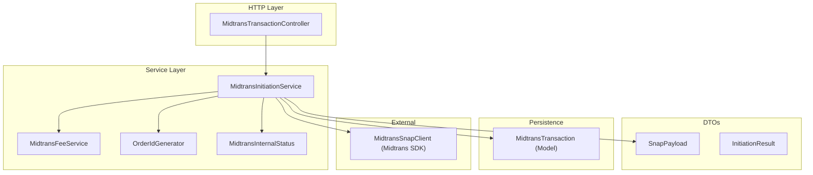
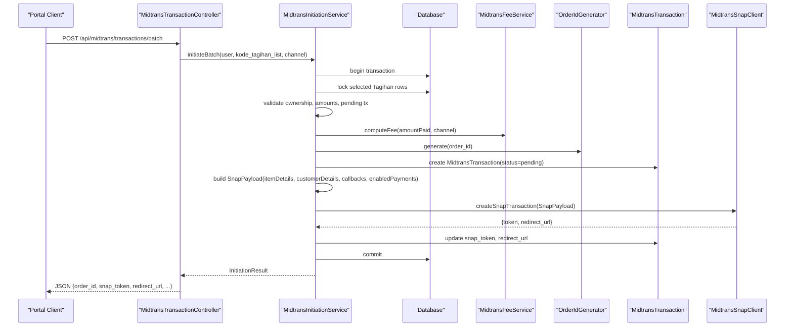
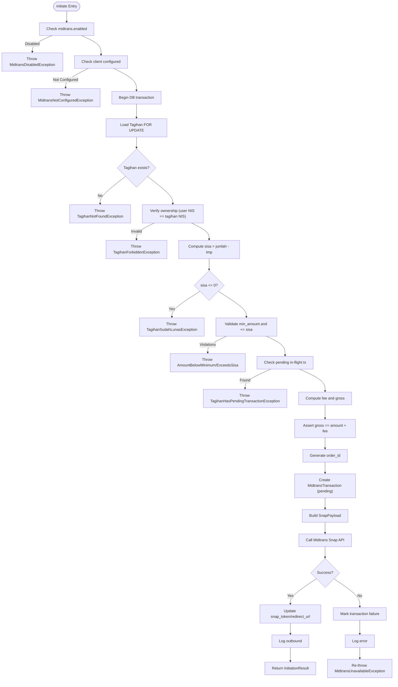
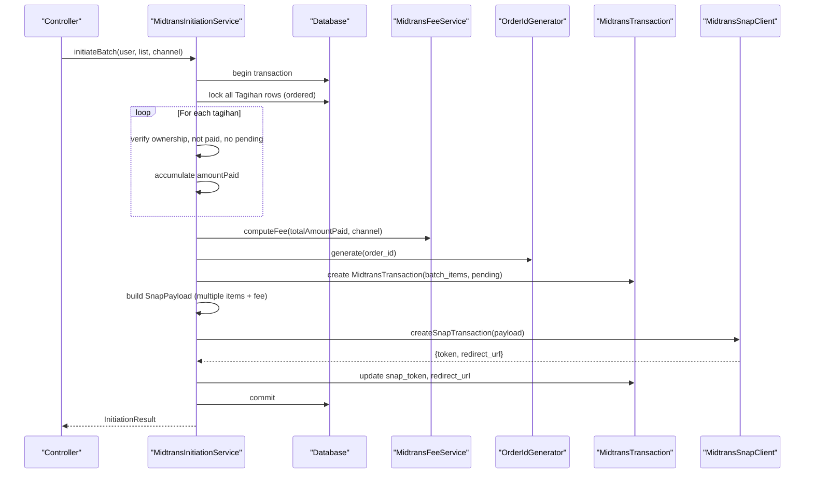
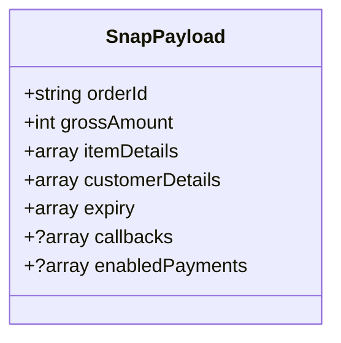
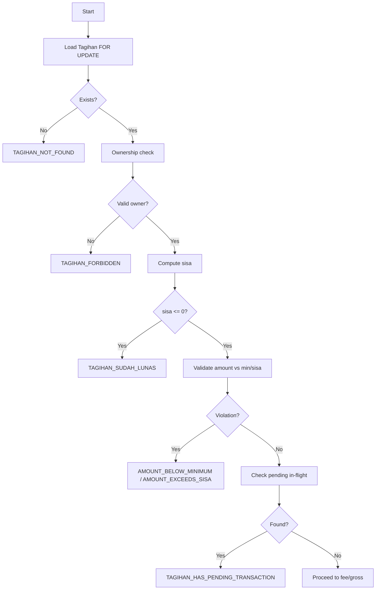
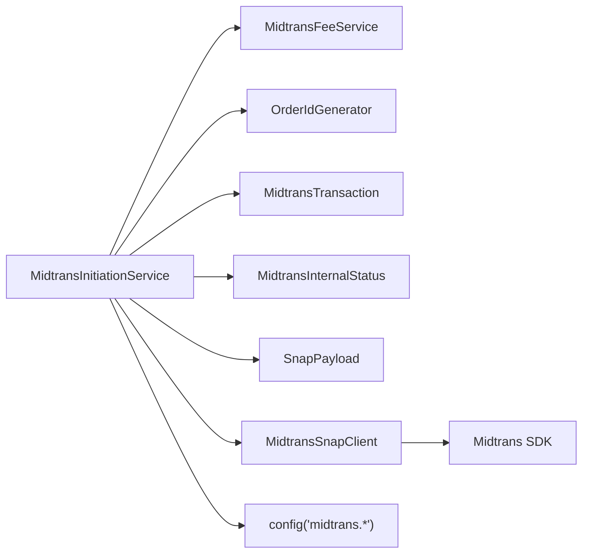

# Payment Initiation Service

<cite>
**Referenced Files in This Document**
- [MidtransInitiationService.php](file://backend/app/Services/Midtrans/MidtransInitiationService.php)
- [MidtransSnapClient.php](file://backend/app/Services/Midtrans/MidtransSnapClient.php)
- [MidtransClient.php](file://backend/app/Services/Midtrans/MidtransClient.php)
- [MidtransFeeService.php](file://backend/app/Services/Midtrans/MidtransFeeService.php)
- [OrderIdGenerator.php](file://backend/app/Services/Midtrans/OrderIdGenerator.php)
- [MidtransTransaction.php](file://backend/app/Models/MidtransTransaction.php)
- [MidtransInternalStatus.php](file://backend/app/Services/Midtrans/MidtransInternalStatus.php)
- [SnapPayload.php](file://backend/app/Services/Midtrans/Dto/SnapPayload.php)
- [InitiationResult.php](file://backend/app/Services/Midtrans/Dto/InitiationResult.php)
- [midtrans.php](file://backend/config/midtrans.php)
- [AmountBelowMinimumException.php](file://backend/app/Exceptions/Midtrans/AmountBelowMinimumException.php)
- [AmountExceedsSisaException.php](file://backend/app/Exceptions/Midtrans/AmountExceedsSisaException.php)
- [TagihanForbiddenException.php](file://backend/app/Exceptions/Midtrans/TagihanForbiddenException.php)
- [TagihanHasPendingTransactionException.php](file://backend/app/Exceptions/Midtrans/TagihanHasPendingTransactionException.php)
- [TagihanNotFoundException.php](file://backend/app/Exceptions/Midtrans/TagihanNotFoundException.php)
- [TagihanSudahLunasException.php](file://backend/app/Exceptions/Midtrans/TagihanSudahLunasException.php)
- [MidtransTransactionController.php](file://backend/app/Http/Controllers/MidtransTransactionController.php)
</cite>

## Table of Contents
1. Introduction
2. Project Structure
3. Core Components
4. Architecture Overview
5. Detailed Component Analysis
6. Dependency Analysis
7. Performance Considerations
8. Troubleshooting Guide
9. Conclusion

## Introduction
This document explains the Midtrans payment initiation flow for single and batch invoice payments. It focuses on the MidtransInitiationService, detailing how it validates transactions, enforces business rules, constructs Snap payloads, manages database transactions, handles errors, and integrates with the Midtrans API to return a token and redirect URL for checkout.

## Project Structure
The payment initiation logic is implemented in the backend service layer under app/Services/Midtrans, with supporting DTOs, fee computation, order ID generation, HTTP client wrapper, and domain exceptions. The controller exposes REST endpoints that orchestrate user input into service calls.

**Diagram sources**
- [MidtransTransactionController.php:67-90](file://backend/app/Http/Controllers/MidtransTransactionController.php#L67-L90)
- [MidtransInitiationService.php:22-237](file://backend/app/Services/Midtrans/MidtransInitiationService.php#L22-L237)
- [MidtransFeeService.php:28-37](file://backend/app/Services/Midtrans/MidtransFeeService.php#L28-L37)
- [OrderIdGenerator.php:24-34](file://backend/app/Services/Midtrans/OrderIdGenerator.php#L24-L34)
- [MidtransInternalStatus.php:5-16](file://backend/app/Services/Midtrans/MidtransInternalStatus.php#L5-L16)
- [SnapPayload.php:5-23](file://backend/app/Services/Midtrans/Dto/SnapPayload.php#L5-L23)
- [InitiationResult.php:7-18](file://backend/app/Services/Midtrans/Dto/InitiationResult.php#L7-L18)
- [MidtransTransaction.php:7-42](file://backend/app/Models/MidtransTransaction.php#L7-L42)
- [MidtransSnapClient.php:13-80](file://backend/app/Services/Midtrans/MidtransSnapClient.php#L13-L80)

**Section sources**
- [MidtransInitiationService.php:22-237](file://backend/app/Services/Midtrans/MidtransInitiationService.php#L22-L237)
- [MidtransTransactionController.php:67-90](file://backend/app/Http/Controllers/MidtransTransactionController.php#L67-L90)

## Core Components
- MidtransInitiationService: Orchestrates validation, fee calculation, transaction persistence, Snap payload construction, and API call.
- MidtransFeeService: Computes channel-specific fees and asserts gross amount invariant.
- OrderIdGenerator: Produces unique, Midtrans-compliant order IDs.
- MidtransSnapClient: Wraps Midtrans SDK to create Snap transactions and fetch status.
- DTOs: SnapPayload and InitiationResult define request/response contracts.
- Domain Exceptions: Typed exceptions for business rule violations and external failures.
- Configuration: Feature flags, credentials, minimum amount, expiry, and callback URLs.

Key responsibilities:
- Ownership verification between user and tagihan.
- Amount validation against minimum and remaining balance.
- Pending transaction idempotency guard.
- Fee computation and gross amount consistency.
- Atomic DB transaction wrapping all state changes.
- Robust error handling and logging.

**Section sources**
- [MidtransInitiationService.php:22-237](file://backend/app/Services/Midtrans/MidtransInitiationService.php#L22-L237)
- [MidtransFeeService.php:28-97](file://backend/app/Services/Midtrans/MidtransFeeService.php#L28-L97)
- [OrderIdGenerator.php:24-62](file://backend/app/Services/Midtrans/OrderIdGenerator.php#L24-L62)
- [MidtransSnapClient.php:50-80](file://backend/app/Services/Midtrans/MidtransSnapClient.php#L50-L80)
- [SnapPayload.php:5-23](file://backend/app/Services/Midtrans/Dto/SnapPayload.php#L5-L23)
- [InitiationResult.php:7-18](file://backend/app/Services/Midtrans/Dto/InitiationResult.php#L7-L18)
- [midtrans.php:15-127](file://backend/config/midtrans.php#L15-L127)

## Architecture Overview
End-to-end flow from request to Midtrans response:

**Diagram sources**
- [MidtransTransactionController.php:67-90](file://backend/app/Http/Controllers/MidtransTransactionController.php#L67-L90)
- [MidtransInitiationService.php:250-418](file://backend/app/Services/Midtrans/MidtransInitiationService.php#L250-L418)
- [MidtransFeeService.php:28-37](file://backend/app/Services/Midtrans/MidtransFeeService.php#L28-L37)
- [OrderIdGenerator.php:24-34](file://backend/app/Services/Midtrans/OrderIdGenerator.php#L24-L34)
- [MidtransTransaction.php:11-42](file://backend/app/Models/MidtransTransaction.php#L11-L42)
- [MidtransSnapClient.php:50-80](file://backend/app/Services/Midtrans/MidtransSnapClient.php#L50-L80)

## Detailed Component Analysis

### Single Invoice Initiation: initiate()
Responsibilities:
- Feature flag and configuration checks.
- Load and lock Tagihan row; verify ownership via user’s siswa NIS.
- Compute sisa (remaining balance) and enforce business rules:
  - Not already paid.
  - Amount within [min_amount, sisa].
  - No pending in-flight transaction for the same tagihan.
- Compute fee and gross amount; assert gross = amount + fee.
- Generate order ID; persist MidtransTransaction with status pending and expiry.
- Build SnapPayload:
  - Item details: one line for tagihan, one for admin fee.
  - Customer details: student name parts and optional valid email from wali.
  - Expiry window and callbacks resolved from config.
  - Enabled payments mapped from selected channel.
- Call Midtrans Snap API; on success, persist token and redirect URL; log outbound.
- On failure, mark transaction as failure, log, and rethrow.

Validation workflow highlights:
- Ownership: user->siswa->nis must match tagihan.nis.
- Amount calculations: sisa = jenis_tagihan.jumlah - tagihan.tmp.
- Pending check: scope pendingInFlight filters by status=pending and not expired.
- Business rules enforced via typed exceptions.

Error handling patterns:
- Early returns via exceptions for invalid inputs or state.
- External API failure path marks transaction as failure and logs before rethrowing.

Database transaction management:
- Entire flow wrapped in DB::transaction with FOR UPDATE locks to prevent races.

**Diagram sources**
- [MidtransInitiationService.php:44-237](file://backend/app/Services/Midtrans/MidtransInitiationService.php#L44-L237)
- [MidtransTransaction.php:55-59](file://backend/app/Models/MidtransTransaction.php#L55-L59)
- [midtrans.php:99-127](file://backend/config/midtrans.php#L99-L127)

**Section sources**
- [MidtransInitiationService.php:44-237](file://backend/app/Services/Midtrans/MidtransInitiationService.php#L44-L237)
- [AmountBelowMinimumException.php:5-14](file://backend/app/Exceptions/Midtrans/AmountBelowMinimumException.php#L5-L14)
- [AmountExceedsSisaException.php:5-14](file://backend/app/Exceptions/Midtrans/AmountExceedsSisaException.php#L5-L14)
- [TagihanForbiddenException.php:5-14](file://backend/app/Exceptions/Midtrans/TagihanForbiddenException.php#L5-L14)
- [TagihanHasPendingTransactionException.php:5-17](file://backend/app/Exceptions/Midtrans/TagihanHasPendingTransactionException.php#L5-L17)
- [TagihanNotFoundException.php:5-14](file://backend/app/Exceptions/Midtrans/TagihanNotFoundException.php#L5-L14)
- [TagihanSudahLunasException.php:5-14](file://backend/app/Exceptions/Midtrans/TagihanSudahLunasException.php#L5-L14)

### Batch Initiation: initiateBatch()
Responsibilities:
- Feature flag and configuration checks.
- Normalize and deduplicate list of tagihan codes.
- Lock all selected Tagihan rows deterministically to avoid deadlocks.
- For each tagihan:
  - Verify ownership.
  - Ensure not fully paid.
  - Reject if any has a pending in-flight transaction.
  - Accumulate total amount_paid across items.
- Enforce minimum amount on aggregated amount.
- Compute a single fee for the entire batch; assert gross invariant.
- Generate order ID based on primary tagihan; persist MidtransTransaction with batch_items array.
- Build SnapPayload with multiple item lines (one per tagihan) plus one fee line.
- Call Midtrans Snap API; on success, persist token and redirect URL; log outbound.
- On failure, mark transaction as failure, log, and rethrow.

Use cases:
- Parent pays multiple outstanding invoices in one checkout session.
- Consolidated admin fee applied once per batch.

**Diagram sources**
- [MidtransInitiationService.php:250-418](file://backend/app/Services/Midtrans/MidtransInitiationService.php#L250-L418)
- [MidtransFeeService.php:28-37](file://backend/app/Services/Midtrans/MidtransFeeService.php#L28-L37)
- [OrderIdGenerator.php:24-34](file://backend/app/Services/Midtrans/OrderIdGenerator.php#L24-L34)
- [MidtransTransaction.php:11-42](file://backend/app/Models/MidtransTransaction.php#L11-L42)
- [MidtransSnapClient.php:50-80](file://backend/app/Services/Midtrans/MidtransSnapClient.php#L50-L80)

**Section sources**
- [MidtransInitiationService.php:250-418](file://backend/app/Services/Midtrans/MidtransInitiationService.php#L250-L418)

### SnapPayload Construction
- Item details:
  - Single invoice: two items — tagihan line and FEE_MIDTRANS line.
  - Batch: one line per tagihan plus one FEE_MIDTRANS line.
- Customer details:
  - first_name, last_name derived from student name.
  - Optional email from wali if present and valid.
- Expiry:
  - start_time set to current time with timezone offset; unit hour; duration 24 hours.
- Callbacks:
  - finish/unfinish/error URLs resolved from configuration; null if not configured.
- Enabled payments:
  - Channel mapping restricts available channels in Snap UI.

**Diagram sources**
- [SnapPayload.php:5-23](file://backend/app/Services/Midtrans/Dto/SnapPayload.php#L5-L23)
- [MidtransInitiationService.php:135-195](file://backend/app/Services/Midtrans/MidtransInitiationService.php#L135-L195)
- [MidtransInitiationService.php:351-393](file://backend/app/Services/Midtrans/MidtransInitiationService.php#L351-L393)

**Section sources**
- [MidtransInitiationService.php:135-195](file://backend/app/Services/Midtrans/MidtransInitiationService.php#L135-L195)
- [MidtransInitiationService.php:351-393](file://backend/app/Services/Midtrans/MidtransInitiationService.php#L351-L393)
- [midtrans.php:125-127](file://backend/config/midtrans.php#L125-L127)

### Transaction Validation Workflow
- Ownership verification: user->siswa->nis must match tagihan.nis.
- Amount calculations:
  - sisa = jenis_tagihan.jumlah - tagihan.tmp.
  - amountPaid must be >= min_amount and <= sisa.
- Pending transaction checks:
  - pendingInFlight scope ensures only non-expired pending transactions block new initiations.
- Business rule enforcement:
  - Throws specific exceptions for each violation with appropriate HTTP status and error codes.

**Diagram sources**
- [MidtransInitiationService.php:56-107](file://backend/app/Services/Midtrans/MidtransInitiationService.php#L56-L107)
- [MidtransTransaction.php:55-59](file://backend/app/Models/MidtransTransaction.php#L55-L59)
- [AmountBelowMinimumException.php:5-14](file://backend/app/Exceptions/Midtrans/AmountBelowMinimumException.php#L5-L14)
- [AmountExceedsSisaException.php:5-14](file://backend/app/Exceptions/Midtrans/AmountExceedsSisaException.php#L5-L14)
- [TagihanForbiddenException.php:5-14](file://backend/app/Exceptions/Midtrans/TagihanForbiddenException.php#L5-L14)
- [TagihanHasPendingTransactionException.php:5-17](file://backend/app/Exceptions/Midtrans/TagihanHasPendingTransactionException.php#L5-L17)
- [TagihanNotFoundException.php:5-14](file://backend/app/Exceptions/Midtrans/TagihanNotFoundException.php#L5-L14)
- [TagihanSudahLunasException.php:5-14](file://backend/app/Exceptions/Midtrans/TagihanSudahLunasException.php#L5-L14)

**Section sources**
- [MidtransInitiationService.php:56-107](file://backend/app/Services/Midtrans/MidtransInitiationService.php#L56-L107)
- [MidtransTransaction.php:55-59](file://backend/app/Models/MidtransTransaction.php#L55-L59)

### Error Handling Patterns
- Domain exceptions carry errorCode and httpStatus for consistent JSON responses.
- External API failures:
  - MidtransUnavailableException thrown when Snap creation fails.
  - Transaction marked as failure and logged before rethrow.
- Status API errors:
  - MidtransSnapClient maps certain errors to actionable exceptions like TransactionNotYetProcessedException.

Common scenarios:
- Missing tagihan → TAGIHAN_NOT_FOUND (404).
- Wrong owner → TAGIHAN_FORBIDDEN (403).
- Already paid → TAGIHAN_SUDAH_LUNAS (422).
- Below minimum → AMOUNT_BELOW_MINIMUM (422).
- Exceeds sisa → AMOUNT_EXCEEDS_SISA (422).
- Pending in-flight → TAGIHAN_HAS_PENDING_TRANSACTION (409) with existing snap data.
- Midtrans unavailable → MidtransUnavailableException after marking failure.

**Section sources**
- [MidtransInitiationService.php:197-225](file://backend/app/Services/Midtrans/MidtransInitiationService.php#L197-L225)
- [MidtransSnapClient.php:70-109](file://backend/app/Services/Midtrans/MidtransSnapClient.php#L70-L109)
- [AmountBelowMinimumException.php:5-14](file://backend/app/Exceptions/Midtrans/AmountBelowMinimumException.php#L5-L14)
- [AmountExceedsSisaException.php:5-14](file://backend/app/Exceptions/Midtrans/AmountExceedsSisaException.php#L5-L14)
- [TagihanForbiddenException.php:5-14](file://backend/app/Exceptions/Midtrans/TagihanForbiddenException.php#L5-L14)
- [TagihanHasPendingTransactionException.php:5-17](file://backend/app/Exceptions/Midtrans/TagihanHasPendingTransactionException.php#L5-L17)
- [TagihanNotFoundException.php:5-14](file://backend/app/Exceptions/Midtrans/TagihanNotFoundException.php#L5-L14)
- [TagihanSudahLunasException.php:5-14](file://backend/app/Exceptions/Midtrans/TagihanSudahLunasException.php#L5-L14)

### Database Transaction Management
- All state mutations are wrapped in DB::transaction.
- Row-level locking with lockForUpdate prevents concurrent modifications.
- Deterministic ordering in batch mode avoids deadlocks.
- MidtransTransaction created with status pending and expired_at set according to configuration.

Best practices observed:
- Use scopes like pendingInFlight to simplify queries.
- Persist intermediate results (snap_token, redirect_url) only after successful external call.

**Section sources**
- [MidtransInitiationService.php:56-133](file://backend/app/Services/Midtrans/MidtransInitiationService.php#L56-L133)
- [MidtransInitiationService.php:266-349](file://backend/app/Services/Midtrans/MidtransInitiationService.php#L266-L349)
- [MidtransTransaction.php:55-59](file://backend/app/Models/MidtransTransaction.php#L55-L59)

### Integration Points and API Response
- Controller accepts requests and delegates to service methods.
- Returns JSON including order_id, snap_token, redirect_url, and financial breakdown.
- Client_key exposed for frontend Snap integration.

Integration pattern:
- Frontend receives redirect_url and opens Midtrans Snap page using snap_token and client_key.
- After completion, Midtrans redirects to configured finish URL.

**Section sources**
- [MidtransTransactionController.php:67-90](file://backend/app/Http/Controllers/MidtransTransactionController.php#L67-L90)
- [midtrans.php:125-127](file://backend/config/midtrans.php#L125-L127)

## Dependency Analysis
High-level dependencies among core components:

**Diagram sources**
- [MidtransInitiationService.php:22-29](file://backend/app/Services/Midtrans/MidtransInitiationService.php#L22-L29)
- [MidtransFeeService.php:28-37](file://backend/app/Services/Midtrans/MidtransFeeService.php#L28-L37)
- [OrderIdGenerator.php:24-34](file://backend/app/Services/Midtrans/OrderIdGenerator.php#L24-L34)
- [MidtransTransaction.php:7-42](file://backend/app/Models/MidtransTransaction.php#L7-L42)
- [MidtransInternalStatus.php:5-16](file://backend/app/Services/Midtrans/MidtransInternalStatus.php#L5-L16)
- [SnapPayload.php:5-23](file://backend/app/Services/Midtrans/Dto/SnapPayload.php#L5-L23)
- [MidtransSnapClient.php:13-80](file://backend/app/Services/Midtrans/MidtransSnapClient.php#L13-L80)
- [midtrans.php:15-127](file://backend/config/midtrans.php#L15-L127)

**Section sources**
- [MidtransInitiationService.php:22-29](file://backend/app/Services/Midtrans/MidtransInitiationService.php#L22-L29)
- [MidtransSnapClient.php:13-80](file://backend/app/Services/Midtrans/MidtransSnapClient.php#L13-L80)
- [midtrans.php:15-127](file://backend/config/midtrans.php#L15-L127)

## Performance Considerations
- Lock ordering: Batch mode orders tagihan by kode_tagihan to reduce deadlock risk.
- Minimal external calls: Only one Snap API call per initiation.
- Efficient queries: Uses eager loading (jenis_tagihan) and targeted scopes (pendingInFlight).
- Avoid unnecessary computations: Fee computed once per initiation/batch.

Recommendations:
- Keep min_amount and expiry_hours tuned to expected usage patterns.
- Monitor Midtrans API latency and consider retries at higher layers if needed.

[No sources needed since this section provides general guidance]

## Troubleshooting Guide
Common issues and resolutions:
- Midtrans disabled: Ensure feature flag enabled in configuration.
- Credentials missing: Verify server_key, client_key, merchant_id configured.
- Ownership mismatch: Confirm user belongs to the correct siswa linked to tagihan.
- Amount out of range: Adjust amount to satisfy min_amount and not exceed sisa.
- Pending transaction: Use provided snap_token and redirect_url to continue existing checkout.
- Midtrans unavailable: Check network connectivity and CA bundle configuration; review logs for outbound charge entries.

Operational tips:
- Inspect MidtransTransaction records for order_id, status, and timestamps.
- Review outbound logs for Snap API responses and errors.
- Use status sync endpoint to reconcile pending transactions.

**Section sources**
- [MidtransInitiationService.php:197-225](file://backend/app/Services/Midtrans/MidtransInitiationService.php#L197-L225)
- [MidtransSnapClient.php:70-109](file://backend/app/Services/Midtrans/MidtransSnapClient.php#L70-L109)
- [MidtransTransaction.php:11-42](file://backend/app/Models/MidtransTransaction.php#L11-L42)

## Conclusion
The MidtransInitiationService provides a robust, validated, and auditable pathway to initiate online payments for single and multiple invoices. It enforces strict business rules, maintains financial invariants, and integrates cleanly with Midtrans Snap while ensuring safe concurrency and comprehensive error handling.

[No sources needed since this section summarizes without analyzing specific files]