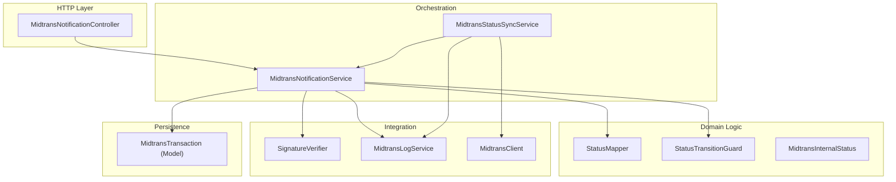
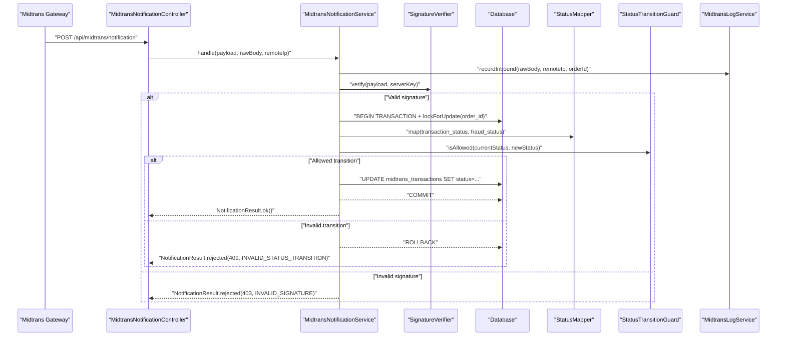
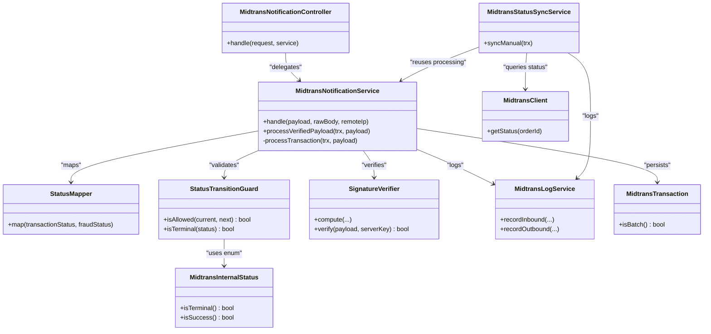

# Payment Status Synchronization

<cite>
**Referenced Files in This Document**
- [StatusMapper.php](file://backend/app/Services/Midtrans/StatusMapper.php)
- [StatusTransitionGuard.php](file://backend/app/Services/Midtrans/StatusTransitionGuard.php)
- [MidtransInternalStatus.php](file://backend/app/Services/Midtrans/MidtransInternalStatus.php)
- [MidtransNotificationService.php](file://backend/app/Services/Midtrans/MidtransNotificationService.php)
- [MidtransStatusSyncService.php](file://backend/app/Services/Midtrans/MidtransStatusSyncService.php)
- [MidtransNotificationController.php](file://backend/app/Http/Controllers/MidtransNotificationController.php)
- [SignatureVerifier.php](file://backend/app/Services/Midtrans/SignatureVerifier.php)
- [MidtransLogService.php](file://backend/app/Services/Midtrans/MidtransLogService.php)
- [MidtransClient.php](file://backend/app/Services/Midtrans/MidtransClient.php)
- [MidtransTransaction.php](file://backend/app/Models/MidtransTransaction.php)
- [NotificationResult.php](file://backend/app/Services/Midtrans/Dto/NotificationResult.php)
- [InvalidStatusTransitionException.php](file://backend/app/Exceptions/Midtrans/InvalidStatusTransitionException.php)
- [TransactionAlreadyFinalException.php](file://backend/app/Exceptions/Midtrans/TransactionAlreadyFinalException.php)
- [WebhookDisabledException.php](file://backend/app/Exceptions/Midtrans/WebhookDisabledException.php)
- [midtrans.php](file://backend/config/midtrans.php)
</cite>

## Table of Contents
1. [Introduction](#introduction)
2. [Project Structure](#project-structure)
3. [Core Components](#core-components)
4. [Architecture Overview](#architecture-overview)
5. [Detailed Component Analysis](#detailed-component-analysis)
6. [Dependency Analysis](#dependency-analysis)
7. [Performance Considerations](#performance-considerations)
8. [Troubleshooting Guide](#troubleshooting-guide)
9. [Conclusion](#conclusion)

## Introduction
This document explains the payment status synchronization system that keeps internal payment states consistent with Midtrans gateway states. It focuses on:
- Translating external statuses to internal representations via StatusMapper
- Enforcing allowed state transitions via StatusTransitionGuard
- The complete set of internal states defined by MidtransInternalStatus
- End-to-end flows for webhook and manual sync, including conflict resolution for delayed or duplicate notifications

## Project Structure
The synchronization logic is implemented as a cohesive set of services and models under the Midtrans integration layer:
- Controllers receive webhooks and delegate to service orchestration
- Services handle verification, mapping, transition validation, persistence, and side effects
- Models represent transaction records and relationships
- Configuration toggles enable/disable features without redeploy

**Diagram sources**
- [MidtransNotificationController.php:1-35](file://backend/app/Http/Controllers/MidtransNotificationController.php#L1-L35)
- [MidtransNotificationService.php:1-284](file://backend/app/Services/Midtrans/MidtransNotificationService.php#L1-L284)
- [MidtransStatusSyncService.php:1-73](file://backend/app/Services/Midtrans/MidtransStatusSyncService.php#L1-L73)
- [StatusMapper.php:1-41](file://backend/app/Services/Midtrans/StatusMapper.php#L1-L41)
- [StatusTransitionGuard.php:1-77](file://backend/app/Services/Midtrans/StatusTransitionGuard.php#L1-L77)
- [MidtransInternalStatus.php:1-45](file://backend/app/Services/Midtrans/MidtransInternalStatus.php#L1-L45)
- [SignatureVerifier.php:1-34](file://backend/app/Services/Midtrans/SignatureVerifier.php#L1-L34)
- [MidtransLogService.php:1-109](file://backend/app/Services/Midtrans/MidtransLogService.php#L1-L109)
- [MidtransClient.php:1-27](file://backend/app/Services/Midtrans/MidtransClient.php#L1-L27)
- [MidtransTransaction.php:1-85](file://backend/app/Models/MidtransTransaction.php#L1-L85)

**Section sources**
- [MidtransNotificationController.php:1-35](file://backend/app/Http/Controllers/MidtransNotificationController.php#L1-L35)
- [MidtransNotificationService.php:1-284](file://backend/app/Services/Midtrans/MidtransNotificationService.php#L1-L284)
- [MidtransStatusSyncService.php:1-73](file://backend/app/Services/Midtrans/MidtransStatusSyncService.php#L1-L73)
- [StatusMapper.php:1-41](file://backend/app/Services/Midtrans/StatusMapper.php#L1-L41)
- [StatusTransitionGuard.php:1-77](file://backend/app/Services/Midtrans/StatusTransitionGuard.php#L1-L77)
- [MidtransInternalStatus.php:1-45](file://backend/app/Services/Midtrans/MidtransInternalStatus.php#L1-L45)
- [SignatureVerifier.php:1-34](file://backend/app/Services/Midtrans/SignatureVerifier.php#L1-L34)
- [MidtransLogService.php:1-109](file://backend/app/Services/Midtrans/MidtransLogService.php#L1-L109)
- [MidtransClient.php:1-27](file://backend/app/Services/Midtrans/MidtransClient.php#L1-L27)
- [MidtransTransaction.php:1-85](file://backend/app/Models/MidtransTransaction.php#L1-L85)

## Core Components
- MidtransInternalStatus: Enumerates all supported internal states and provides helpers to determine terminal and success states.
- StatusMapper: Converts Midtrans transaction_status and fraud_status into an internal status using explicit mapping rules.
- StatusTransitionGuard: Validates whether a proposed next state is allowed from the current state based on a closed transition table.
- MidtransNotificationService: Orchestrates signature verification, amount checks, mapping, transition validation, persistence, and recording of payments.
- MidtransStatusSyncService: Provides manual reconciliation by querying Midtrans Status API and reusing the same processing pipeline.
- SignatureVerifier: Computes and verifies HMAC-style signatures for webhook payloads.
- MidtransLogService: Records inbound/outbound events with sensitive data masking and safety nets.
- MidtransClient: Interface for calling Midtrans APIs (e.g., getStatus).
- MidtransTransaction: Eloquent model representing a Midtrans transaction record and its relations.

Key responsibilities and interactions are detailed in the following sections.

**Section sources**
- [MidtransInternalStatus.php:1-45](file://backend/app/Services/Midtrans/MidtransInternalStatus.php#L1-L45)
- [StatusMapper.php:1-41](file://backend/app/Services/Midtrans/StatusMapper.php#L1-L41)
- [StatusTransitionGuard.php:1-77](file://backend/app/Services/Midtrans/StatusTransitionGuard.php#L1-L77)
- [MidtransNotificationService.php:1-284](file://backend/app/Services/Midtrans/MidtransNotificationService.php#L1-L284)
- [MidtransStatusSyncService.php:1-73](file://backend/app/Services/Midtrans/MidtransStatusSyncService.php#L1-L73)
- [SignatureVerifier.php:1-34](file://backend/app/Services/Midtrans/SignatureVerifier.php#L1-L34)
- [MidtransLogService.php:1-109](file://backend/app/Services/Midtrans/MidtransLogService.php#L1-L109)
- [MidtransClient.php:1-27](file://backend/app/Services/Midtrans/MidtransClient.php#L1-L27)
- [MidtransTransaction.php:1-85](file://backend/app/Models/MidtransTransaction.php#L1-L85)

## Architecture Overview
The system supports two entry points:
- Webhook flow: External Midtrans POSTs to the notification endpoint
- Manual sync flow: Internal operation queries Midtrans Status API and processes the response

Both flows converge on the same processing pipeline to ensure idempotency and consistency.

**Diagram sources**
- [MidtransNotificationController.php:1-35](file://backend/app/Http/Controllers/MidtransNotificationController.php#L1-L35)
- [MidtransNotificationService.php:1-284](file://backend/app/Services/Midtrans/MidtransNotificationService.php#L1-L284)
- [SignatureVerifier.php:1-34](file://backend/app/Services/Midtrans/SignatureVerifier.php#L1-L34)
- [StatusMapper.php:1-41](file://backend/app/Services/Midtrans/StatusMapper.php#L1-L41)
- [StatusTransitionGuard.php:1-77](file://backend/app/Services/Midtrans/StatusTransitionGuard.php#L1-L77)
- [MidtransLogService.php:1-109](file://backend/app/Services/Midtrans/MidtransLogService.php#L1-L109)

## Detailed Component Analysis

### MidtransInternalStatus
Defines the canonical internal states and utilities:
- States: pending, settlement, capture, deny, cancel, expire, failure, refund, partial_refund
- Terminal states: settlement, capture, deny, cancel, expire, failure, refund
- Success states: settlement, capture

These definitions drive both mapping and transition validation.

**Section sources**
- [MidtransInternalStatus.php:1-45](file://backend/app/Services/Midtrans/MidtransInternalStatus.php#L1-L45)

### StatusMapper
Translates external Midtrans fields to internal states:
- capture + fraud_status = accept → Capture
- capture + fraud_status != accept → Deny
- settlement → Settlement
- pending → Pending
- deny → Deny
- cancel → Cancel
- expire → Expire
- failure → Failure
- refund → Refund
- partial_refund → PartialRefund
- unknown → Pending (fallback)

This ensures a single source of truth for how gateway signals map to business semantics.

**Section sources**
- [StatusMapper.php:1-41](file://backend/app/Services/Midtrans/StatusMapper.php#L1-L41)

### StatusTransitionGuard
Enforces a closed transition table:
- From pending: can move to pending, settlement, capture, deny, cancel, expire, failure
- From settlement/capture: can move to self, refund, partial_refund
- From partial_refund: only self
- From terminal states (deny, cancel, expire, failure, refund): only self
- Unknown current states default to no allowed transitions

This prevents invalid state changes and guarantees deterministic behavior across retries and duplicates.

**Section sources**
- [StatusTransitionGuard.php:1-77](file://backend/app/Services/Midtrans/StatusTransitionGuard.php#L1-L77)

### MidtransNotificationService
End-to-end orchestration for webhook handling:
- Checks webhook enabled flag
- Logs inbound payload
- Verifies signature
- Opens a DB transaction with deadlock retry
- Locks the target transaction row
- Validates gross_amount against stored value
- Maps external status to internal status
- Validates transition
- Updates transaction and timestamps
- Records Pembayaran(s) when successful (single or batch), enforcing overpayment guards
- Returns structured result

Idempotency is achieved by:
- Same-status no-op
- Unique constraint on midtrans_order_id for Pembayaran
- Overpayment blocking exceptions

**Section sources**
- [MidtransNotificationService.php:1-284](file://backend/app/Services/Midtrans/MidtransNotificationService.php#L1-L284)
- [NotificationResult.php:1-29](file://backend/app/Services/Midtrans/Dto/NotificationResult.php#L1-L29)

### MidtransStatusSyncService
Manual reconciliation flow:
- Rejects if current status is terminal
- Calls Midtrans Status API via MidtransClient
- Logs outbound call details
- Reuses the shared processing pipeline through processVerifiedPayload

This allows operators to recover from missed or delayed webhooks.

**Section sources**
- [MidtransStatusSyncService.php:1-73](file://backend/app/Services/Midtrans/MidtransStatusSyncService.php#L1-L73)
- [MidtransClient.php:1-27](file://backend/app/Services/Midtrans/MidtransClient.php#L1-L27)

### SignatureVerifier
Computes and verifies signatures:
- Formula uses order_id, status_code, gross_amount, and server_key
- Uses constant-time comparison to prevent timing attacks

**Section sources**
- [SignatureVerifier.php:1-34](file://backend/app/Services/Midtrans/SignatureVerifier.php#L1-L34)

### MidtransLogService
Auditing and observability:
- Records inbound and outbound events
- Masks sensitive keys (server_key, signature_key)
- Safety net drops logs if the literal server_key remains present

**Section sources**
- [MidtransLogService.php:1-109](file://backend/app/Services/Midtrans/MidtransLogService.php#L1-L109)

### MidtransTransaction (Model)
Represents a Midtrans transaction:
- Fields include order_id, amounts, status, payment_type, timestamps, batch metadata
- Helpers for batch detection and pending-in-flight scope
- Relations to tagihan, pembayaran, logs, and initiator

**Section sources**
- [MidtransTransaction.php:1-85](file://backend/app/Models/MidtransTransaction.php#L1-L85)

### Controller and Configuration
- MidtransNotificationController receives webhooks and delegates to the service layer
- Configuration controls feature flags and credentials, including independent webhook toggle

**Section sources**
- [MidtransNotificationController.php:1-35](file://backend/app/Http/Controllers/MidtransNotificationController.php#L1-L35)
- [midtrans.php:1-130](file://backend/config/midtrans.php#L1-L130)

## Dependency Analysis
The following diagram shows key dependencies among components involved in status synchronization.

**Diagram sources**
- [MidtransNotificationController.php:1-35](file://backend/app/Http/Controllers/MidtransNotificationController.php#L1-L35)
- [MidtransNotificationService.php:1-284](file://backend/app/Services/Midtrans/MidtransNotificationService.php#L1-L284)
- [MidtransStatusSyncService.php:1-73](file://backend/app/Services/Midtrans/MidtransStatusSyncService.php#L1-L73)
- [StatusMapper.php:1-41](file://backend/app/Services/Midtrans/StatusMapper.php#L1-L41)
- [StatusTransitionGuard.php:1-77](file://backend/app/Services/Midtrans/StatusTransitionGuard.php#L1-L77)
- [MidtransInternalStatus.php:1-45](file://backend/app/Services/Midtrans/MidtransInternalStatus.php#L1-L45)
- [SignatureVerifier.php:1-34](file://backend/app/Services/Midtrans/SignatureVerifier.php#L1-L34)
- [MidtransLogService.php:1-109](file://backend/app/Services/Midtrans/MidtransLogService.php#L1-L109)
- [MidtransClient.php:1-27](file://backend/app/Services/Midtrans/MidtransClient.php#L1-L27)
- [MidtransTransaction.php:1-85](file://backend/app/Models/MidtransTransaction.php#L1-L85)

**Section sources**
- [MidtransNotificationService.php:1-284](file://backend/app/Services/Midtrans/MidtransNotificationService.php#L1-L284)
- [MidtransStatusSyncService.php:1-73](file://backend/app/Services/Midtrans/MidtransStatusSyncService.php#L1-L73)
- [StatusMapper.php:1-41](file://backend/app/Services/Midtrans/StatusMapper.php#L1-L41)
- [StatusTransitionGuard.php:1-77](file://backend/app/Services/Midtrans/StatusTransitionGuard.php#L1-L77)
- [MidtransInternalStatus.php:1-45](file://backend/app/Services/Midtrans/MidtransInternalStatus.php#L1-L45)
- [SignatureVerifier.php:1-34](file://backend/app/Services/Midtrans/SignatureVerifier.php#L1-L34)
- [MidtransLogService.php:1-109](file://backend/app/Services/Midtrans/MidtransLogService.php#L1-L109)
- [MidtransClient.php:1-27](file://backend/app/Services/Midtrans/MidtransClient.php#L1-L27)
- [MidtransTransaction.php:1-85](file://backend/app/Models/MidtransTransaction.php#L1-L85)

## Performance Considerations
- Database locking: Using row-level locks per order_id avoids race conditions during concurrent webhook deliveries.
- Deadlock retries: Short retry loops reduce transient failures under high concurrency.
- Idempotent updates: Same-status no-ops and unique constraints minimize redundant writes.
- Logging overhead: Masking and JSON encoding add CPU cost; consider batching or sampling in high-throughput environments.
- Manual sync throttling: Avoid excessive polling; rely on scheduled jobs or event-driven triggers.

[No sources needed since this section provides general guidance]

## Troubleshooting Guide
Common issues and resolutions:
- Invalid signature: Ensure server_key matches configuration and payload integrity is intact.
- Amount mismatch: Verify gross_amount normalization and integer comparison logic.
- Invalid status transition: Check current vs. requested state against the allowed transitions table.
- Transaction already final: Manual sync should not be invoked on terminal states.
- Webhook disabled: Confirm webhook_enabled flag and environment settings.
- Duplicate notifications: System is designed to be idempotent; repeated valid notifications will not alter state beyond the first application.

Operational tips:
- Use manual sync to reconcile missed webhooks for non-terminal transactions.
- Inspect inbound/outbound logs for exact payloads and HTTP responses.
- Monitor overpayment blocks and adjust business rules if necessary.

**Section sources**
- [InvalidStatusTransitionException.php:1-15](file://backend/app/Exceptions/Midtrans/InvalidStatusTransitionException.php#L1-L15)
- [TransactionAlreadyFinalException.php:1-15](file://backend/app/Exceptions/Midtrans/TransactionAlreadyFinalException.php#L1-L15)
- [WebhookDisabledException.php:1-15](file://backend/app/Exceptions/Midtrans/WebhookDisabledException.php#L1-L15)
- [MidtransNotificationService.php:1-284](file://backend/app/Services/Midtrans/MidtransNotificationService.php#L1-L284)
- [MidtransStatusSyncService.php:1-73](file://backend/app/Services/Midtrans/MidtransStatusSyncService.php#L1-L73)
- [MidtransLogService.php:1-109](file://backend/app/Services/Midtrans/MidtransLogService.php#L1-L109)
- [midtrans.php:1-130](file://backend/config/midtrans.php#L1-L130)

## Conclusion
The payment status synchronization system provides a robust, idempotent pipeline for reconciling Midtrans gateway states with internal records. StatusMapper centralizes translation rules, while StatusTransitionGuard enforces a strict state machine. The dual entry points (webhook and manual sync) share the same core logic, ensuring consistency even under network delays or duplicate notifications. Proper logging, signature verification, and database locking further strengthen reliability and auditability.