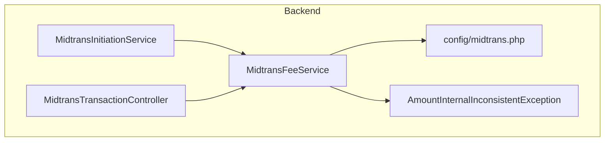
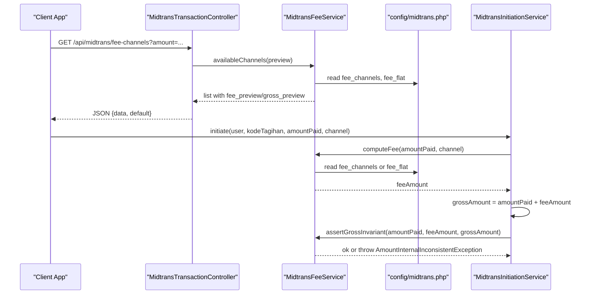
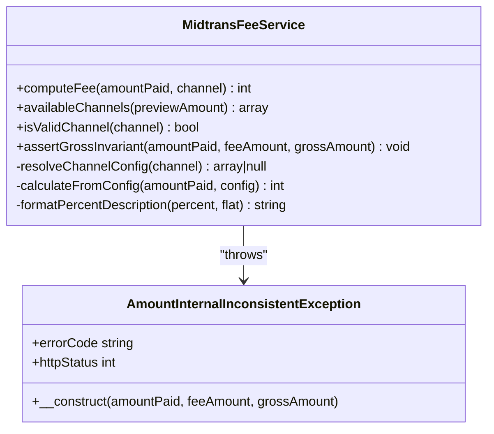
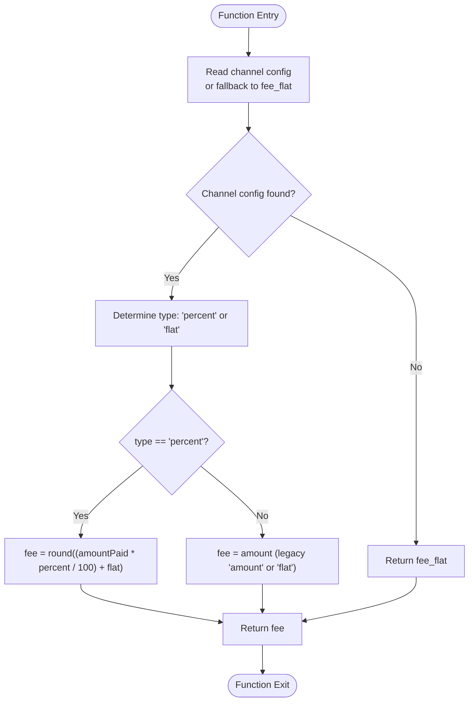
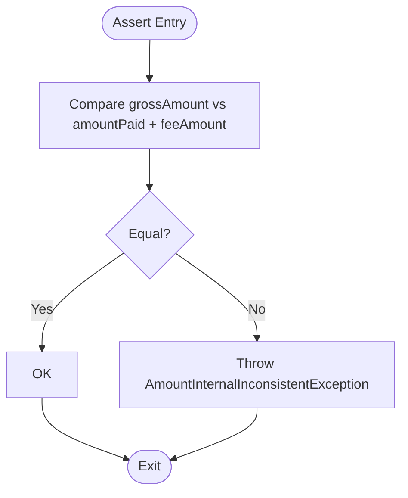
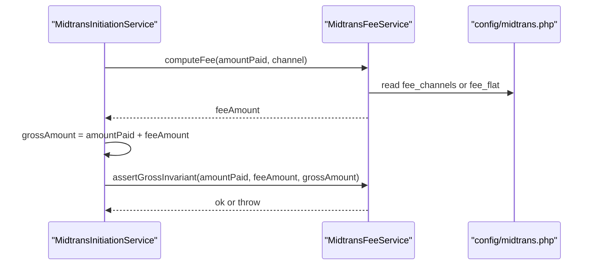
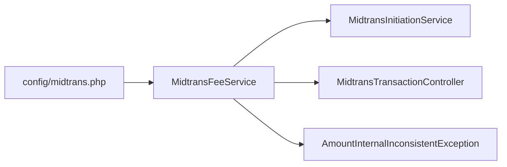

# Transaction Fee Calculation Service

<cite>
**Referenced Files in This Document**
- [MidtransFeeService.php](file://backend/app/Services/Midtrans/MidtransFeeService.php)
- [midtrans.php](file://backend/config/midtrans.php)
- [AmountInternalInconsistentException.php](file://backend/app/Exceptions/Midtrans/AmountInternalInconsistentException.php)
- [MidtransInitiationService.php](file://backend/app/Services/Midtrans/MidtransInitiationService.php)
- [MidtransTransactionController.php](file://backend/app/Http/Controllers/MidtransTransactionController.php)
</cite>

## Table of Contents
1. [Introduction](#introduction)
2. [Project Structure](#project-structure)
3. [Core Components](#core-components)
4. [Architecture Overview](#architecture-overview)
5. [Detailed Component Analysis](#detailed-component-analysis)
6. [Dependency Analysis](#dependency-analysis)
7. [Performance Considerations](#performance-considerations)
8. [Troubleshooting Guide](#troubleshooting-guide)
9. [Conclusion](#conclusion)
10. [Appendices](#appendices)

## Introduction
This document explains the MidtransFeeService, which calculates transaction fees for Midtrans payments based on payment channels and amounts. It covers fee algorithms, channel-specific structures, minimum/maximum constraints, computeFee implementation, validation rules, gross amount calculations, and the assertGrossInvariant method. It also documents supported channels, fee policies, configuration options, example scenarios, edge cases, and debugging guidance.

## Project Structure
The fee calculation logic is implemented as a dedicated service class with configuration-driven behavior:
- Service: MidtransFeeService (fee computation, channel metadata, validation helpers)
- Configuration: midtrans.php (channel fee policies, defaults, min amount, expiry)
- Exception: AmountInternalInconsistentException (gross invariant violation)
- Integration points: MidtransInitiationService (uses fee service), MidtransTransactionController (exposes available channels to frontend)

**Diagram sources**
- [MidtransFeeService.php:1-144](file://backend/app/Services/Midtrans/MidtransFeeService.php#L1-L144)
- [midtrans.php:1-130](file://backend/config/midtrans.php#L1-L130)
- [MidtransInitiationService.php:1-200](file://backend/app/Services/Midtrans/MidtransInitiationService.php#L1-L200)
- [MidtransTransactionController.php:40-127](file://backend/app/Http/Controllers/MidtransTransactionController.php#L40-L127)
- [AmountInternalInconsistentException.php:1-15](file://backend/app/Exceptions/Midtrans/AmountInternalInconsistentException.php#L1-L15)

**Section sources**
- [MidtransFeeService.php:1-144](file://backend/app/Services/Midtrans/MidtransFeeService.php#L1-L144)
- [midtrans.php:1-130](file://backend/config/midtrans.php#L1-L130)
- [MidtransInitiationService.php:1-200](file://backend/app/Services/Midtrans/MidtransInitiationService.php#L1-L200)
- [MidtransTransactionController.php:40-127](file://backend/app/Http/Controllers/MidtransTransactionController.php#L40-L127)
- [AmountInternalInconsistentException.php:1-15](file://backend/app/Exceptions/Midtrans/AmountInternalInconsistentException.php#L1-L15)

## Core Components
- MidtransFeeService
  - computeFee(amountPaid, channel): computes admin fee using channel config or fallback flat fee.
  - availableChannels(previewAmount): returns channel metadata and optional fee/gross previews.
  - isValidChannel(channel): validates if a channel exists in configuration.
  - assertGrossInvariant(amountPaid, feeAmount, grossAmount): enforces mathematical correctness.
  - Internal helpers: resolveChannelConfig, calculateFromConfig, formatPercentDescription.
- Configuration (midtrans.php)
  - Global settings: enabled, webhook_enabled, environment, credentials, order_prefix, finish_url, log_retention_days.
  - Fee policy: fee_flat (fallback), fee_channels (per-channel type, percent, flat, label).
  - Business rules: default_channel, min_amount, expiry_hours.
- Exceptions
  - AmountInternalInconsistentException: thrown when gross != amount_paid + fee_amount.

Key responsibilities:
- Centralize fee calculation logic.
- Provide preview data for UI.
- Enforce gross amount invariant across services.

**Section sources**
- [MidtransFeeService.php:1-144](file://backend/app/Services/Midtrans/MidtransFeeService.php#L1-L144)
- [midtrans.php:1-130](file://backend/config/midtrans.php#L1-L130)
- [AmountInternalInconsistentException.php:1-15](file://backend/app/Exceptions/Midtrans/AmountInternalInconsistentException.php#L1-L15)

## Architecture Overview
The fee service is used during initiation and exposed via an API endpoint for frontend previews. The gross amount invariant is enforced at initiation time.

**Diagram sources**
- [MidtransTransactionController.php:40-127](file://backend/app/Http/Controllers/MidtransTransactionController.php#L40-L127)
- [MidtransFeeService.php:1-144](file://backend/app/Services/Midtrans/MidtransFeeService.php#L1-L144)
- [midtrans.php:1-130](file://backend/config/midtrans.php#L1-L130)
- [MidtransInitiationService.php:1-200](file://backend/app/Services/Midtrans/MidtransInitiationService.php#L1-L200)

## Detailed Component Analysis

### MidtransFeeService
Responsibilities:
- Compute fee per channel using configuration.
- Provide channel metadata and previews.
- Validate channel presence.
- Assert gross amount invariant.

Algorithm summary:
- If no channel provided or unknown, use global fee_flat.
- For percent channels: fee = round((amountPaid * percent / 100) + flat).
- For flat channels: fee = configured amount.
- Gross invariant: gross must equal amountPaid + feeAmount; otherwise throw AmountInternalInconsistentException.

**Diagram sources**
- [MidtransFeeService.php:1-144](file://backend/app/Services/Midtrans/MidtransFeeService.php#L1-L144)
- [AmountInternalInconsistentException.php:1-15](file://backend/app/Exceptions/Midtrans/AmountInternalInconsistentException.php#L1-L15)

**Section sources**
- [MidtransFeeService.php:1-144](file://backend/app/Services/Midtrans/MidtransFeeService.php#L1-L144)
- [AmountInternalInconsistentException.php:1-15](file://backend/app/Exceptions/Midtrans/AmountInternalInconsistentException.php#L1-L15)

### Fee Calculation Algorithm

**Diagram sources**
- [MidtransFeeService.php:105-133](file://backend/app/Services/Midtrans/MidtransFeeService.php#L105-L133)

**Section sources**
- [MidtransFeeService.php:105-133](file://backend/app/Services/Midtrans/MidtransFeeService.php#L105-L133)

### Gross Invariant Assertion
Purpose:
- Ensure gross_amount equals amount_paid plus fee_amount.
- Prevent inconsistent financial state by throwing a domain exception on mismatch.

**Diagram sources**
- [MidtransFeeService.php:92-97](file://backend/app/Services/Midtrans/MidtransFeeService.php#L92-L97)
- [AmountInternalInconsistentException.php:1-15](file://backend/app/Exceptions/Midtrans/AmountInternalInconsistentException.php#L1-L15)

**Section sources**
- [MidtransFeeService.php:92-97](file://backend/app/Services/Midtrans/MidtransFeeService.php#L92-L97)
- [AmountInternalInconsistentException.php:1-15](file://backend/app/Exceptions/Midtrans/AmountInternalInconsistentException.php#L1-L15)

### Channel Metadata and Preview
- availableChannels returns:
  - key, label, type
  - percent and flat for percent-type channels
  - amount for flat-type channels
  - description strings for user-facing info
  - optional fee_preview and gross_preview when preview amount is provided

Integration:
- Exposed via controller endpoint for frontend selection and live preview.

**Section sources**
- [MidtransFeeService.php:44-76](file://backend/app/Services/Midtrans/MidtransFeeService.php#L44-L76)
- [MidtransTransactionController.php:40-59](file://backend/app/Http/Controllers/MidtransTransactionController.php#L40-L59)

### Usage in Initiation Flow
- MidtransInitiationService calls computeFee and then asserts the gross invariant before persisting transaction details and calling Midtrans Snap.

**Diagram sources**
- [MidtransInitiationService.php:109-112](file://backend/app/Services/Midtrans/MidtransInitiationService.php#L109-L112)
- [MidtransFeeService.php:28-37](file://backend/app/Services/Midtrans/MidtransFeeService.php#L28-L37)
- [midtrans.php:58-95](file://backend/config/midtrans.php#L58-L95)

**Section sources**
- [MidtransInitiationService.php:109-112](file://backend/app/Services/Midtrans/MidtransInitiationService.php#L109-L112)
- [MidtransFeeService.php:28-37](file://backend/app/Services/Midtrans/MidtransFeeService.php#L28-L37)

## Dependency Analysis
- MidtransFeeService depends on:
  - Configuration values from midtrans.php (fee_flat, fee_channels, default_channel, min_amount, expiry_hours).
  - Throws AmountInternalInconsistentException on invariant violations.
- Consumers:
  - MidtransInitiationService uses computeFee and assertGrossInvariant during transaction creation.
  - MidtransTransactionController exposes availableChannels for UI previews.

**Diagram sources**
- [midtrans.php:1-130](file://backend/config/midtrans.php#L1-L130)
- [MidtransFeeService.php:1-144](file://backend/app/Services/Midtrans/MidtransFeeService.php#L1-L144)
- [MidtransInitiationService.php:1-200](file://backend/app/Services/Midtrans/MidtransInitiationService.php#L1-L200)
- [MidtransTransactionController.php:40-127](file://backend/app/Http/Controllers/MidtransTransactionController.php#L40-L127)
- [AmountInternalInconsistentException.php:1-15](file://backend/app/Exceptions/Midtrans/AmountInternalInconsistentException.php#L1-L15)

**Section sources**
- [midtrans.php:1-130](file://backend/config/midtrans.php#L1-L130)
- [MidtransFeeService.php:1-144](file://backend/app/Services/Midtrans/MidtransFeeService.php#L1-L144)
- [MidtransInitiationService.php:1-200](file://backend/app/Services/Midtrans/MidtransInitiationService.php#L1-L200)
- [MidtransTransactionController.php:40-127](file://backend/app/Http/Controllers/MidtransTransactionController.php#L40-L127)
- [AmountInternalInconsistentException.php:1-15](file://backend/app/Exceptions/Midtrans/AmountInternalInconsistentException.php#L1-L15)

## Performance Considerations
- Fee calculation is O(1) per call with minimal arithmetic and config lookups.
- availableChannels iterates over configured channels once; complexity proportional to number of channels.
- No caching layer inside the service; it reads config at call time to reflect runtime changes.

[No sources needed since this section provides general guidance]

## Troubleshooting Guide
Common issues and resolutions:
- Unexpected fee value:
  - Verify selected channel exists in fee_channels and its type/percent/flat fields are correct.
  - Confirm fee_flat fallback is not being used due to null/unknown channel.
- Gross amount mismatch error:
  - Occurs when gross_amount != amount_paid + fee_amount.
  - Recompute fee using the same algorithm and ensure rounding matches expected integer IDR.
- Frontend preview differs from backend:
  - Ensure preview amount is passed to availableChannels and that client-side preview logic mirrors backend percent+flat formula.
- Minimum amount validation:
  - Check min_amount configuration and business rule enforcement in initiation flow.

Operational checks:
- Inspect configuration keys: fee_flat, fee_channels, default_channel, min_amount, expiry_hours.
- Review logs around initiation to confirm feeAmount and grossAmount values.
- Validate channel keys used match those defined in fee_channels.

**Section sources**
- [MidtransFeeService.php:28-97](file://backend/app/Services/Midtrans/MidtransFeeService.php#L28-L97)
- [midtrans.php:58-101](file://backend/config/midtrans.php#L58-L101)
- [MidtransInitiationService.php:84-112](file://backend/app/Services/Midtrans/MidtransInitiationService.php#L84-L112)
- [AmountInternalInconsistentException.php:1-15](file://backend/app/Exceptions/Midtrans/AmountInternalInconsistentException.php#L1-L15)

## Conclusion
MidtransFeeService centralizes fee computation and validation, providing predictable, configurable, and auditable fee calculations across payment channels. Its integration with initiation and controller layers ensures consistent gross amount handling and transparent previews for users.

[No sources needed since this section summarizes without analyzing specific files]

## Appendices

### Supported Payment Channels and Fee Policies
- QRIS: percent-based with optional flat component.
- Bank Transfer / Virtual Account: flat fee.
- GoPay: percent-based with optional flat component.
- ShopeePay: percent-based with optional flat component.
- Credit Card: percent-based with optional flat component.
- Other: flat fee fallback.

Configuration keys:
- fee_flat: fallback flat fee when channel is unknown.
- fee_channels.<key>.type: "flat" or "percent".
- fee_channels.<key>.percent: percentage rate (for percent type).
- fee_channels.<key>.flat: additional flat component (for percent type).
- fee_channels.<key>.amount: fixed fee (for flat type).
- default_channel: default channel key for UI.
- min_amount: minimum allowed payment amount.
- expiry_hours: transaction expiration window.

**Section sources**
- [midtrans.php:58-95](file://backend/config/midtrans.php#L58-L95)

### Example Scenarios
- Flat fee:
  - Channel: bank_transfer (type=flat, amount=4000)
  - amountPaid=50000 → fee=4000, gross=54000
- Percent-only:
  - Channel: qris (type=percent, percent=0.7, flat=0)
  - amountPaid=50000 → fee=round(50000*0.7/100)=350, gross=50350
- Percent + flat:
  - Channel: credit_card (type=percent, percent=2.9, flat=2000)
  - amountPaid=50000 → fee=round(50000*2.9/100)+2000=3450, gross=53450
- Unknown channel:
  - Channel=null or not in fee_channels → fee=fee_flat (e.g., 4000)

Note: These examples illustrate the algorithmic behavior; actual values depend on current configuration.

**Section sources**
- [MidtransFeeService.php:120-133](file://backend/app/Services/Midtrans/MidtransFeeService.php#L120-L133)
- [midtrans.php:58-95](file://backend/config/midtrans.php#L58-L95)

### Edge Cases
- Zero or negative amountPaid:
  - Should be prevented upstream by min_amount and business validations.
- Rounding differences:
  - Percent calculation rounds to nearest integer Rupiah; ensure consistent rounding in any client-side preview.
- Large percentages or flat components:
  - Ensure resulting fee does not exceed business limits; validate against policy if required.
- Channel misconfiguration:
  - Missing percent or amount fields will fall back to zero where applicable; verify configuration completeness.

**Section sources**
- [MidtransFeeService.php:120-133](file://backend/app/Services/Midtrans/MidtransFeeService.php#L120-L133)
- [midtrans.php:58-95](file://backend/config/midtrans.php#L58-L95)