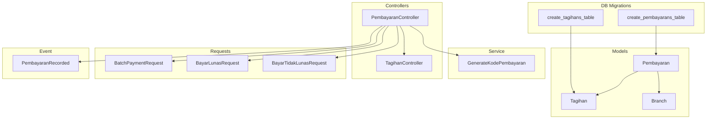
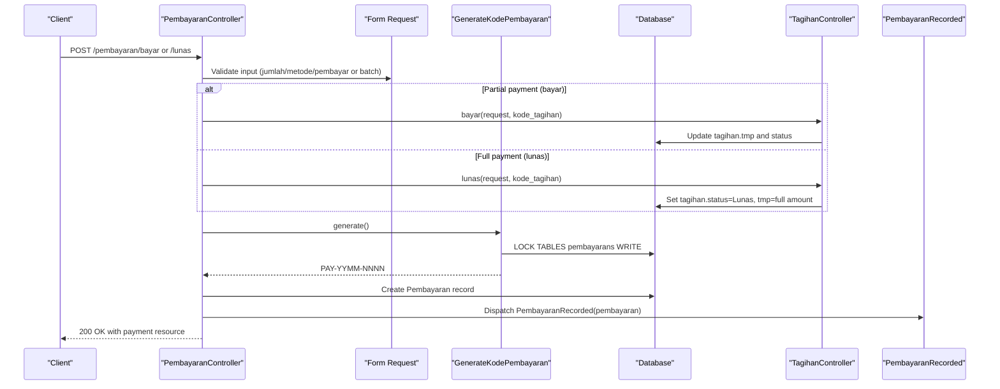
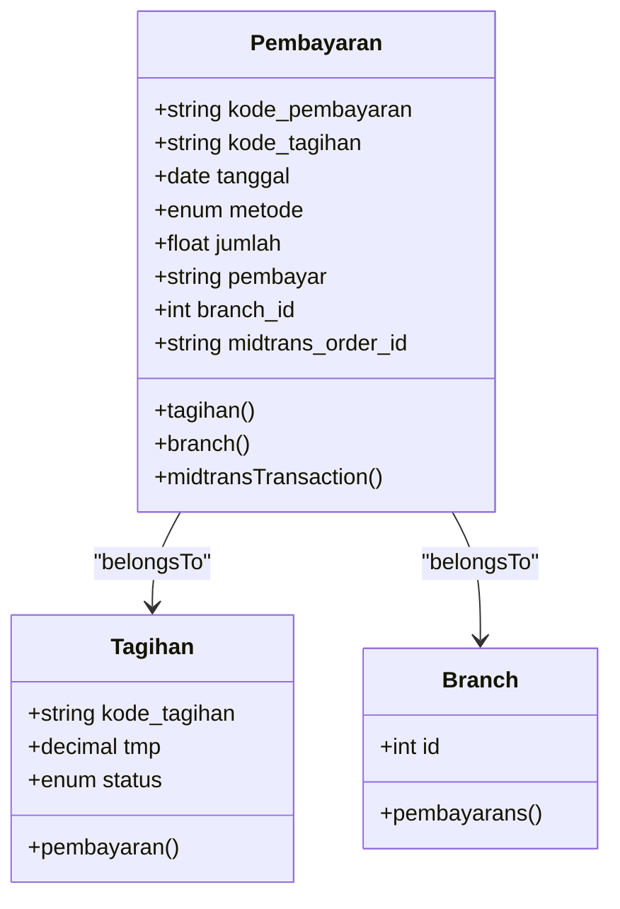
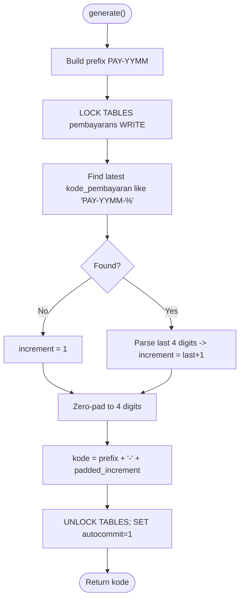
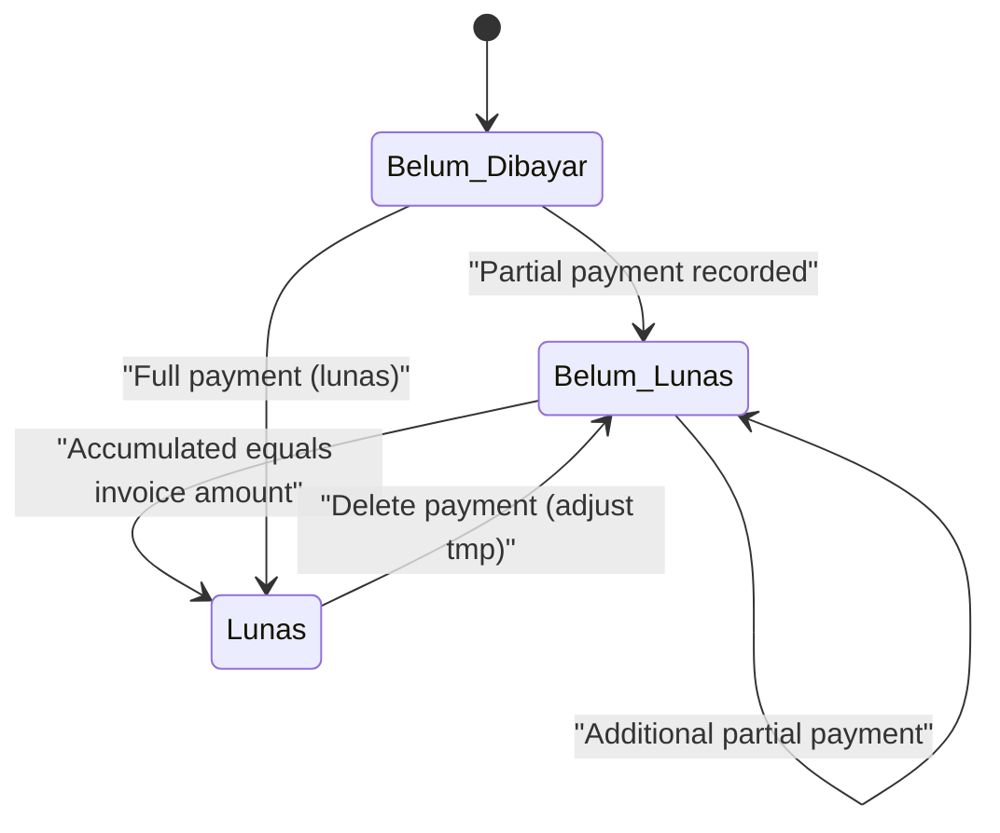
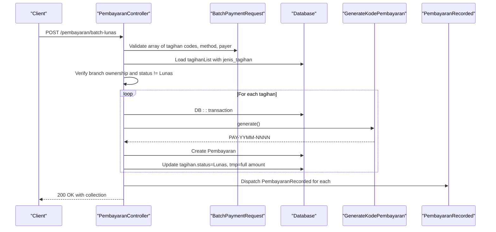
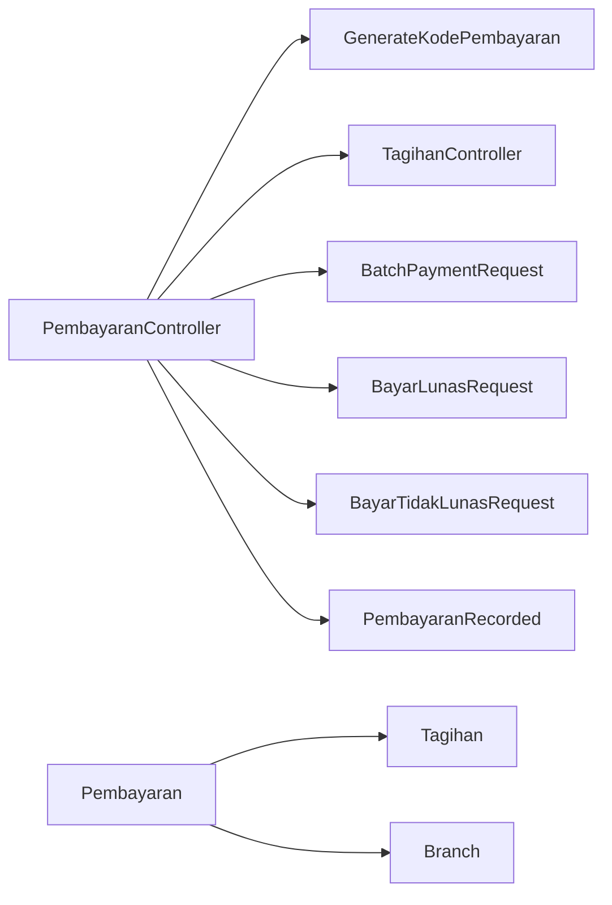

# Payment Models & Workflows

<cite>
**Referenced Files in This Document**
- [Pembayaran.php](file://backend/app/Models/Pembayaran.php)
- [Tagihan.php](file://backend/app/Models/Tagihan.php)
- [Branch.php](file://backend/app/Models/Branch.php)
- [2025_11_14_102319_create_pembayarans_table.php](file://backend/database/migrations/2025_11_14_102319_create_pembayarans_table.php)
- [2025_11_14_094745_create_tagihans_table.php](file://backend/database/migrations/2025_11_14_094745_create_tagihans_table.php)
- [GenerateKodePembayaran.php](file://backend/app/Services/GenerateKodePembayaran.php)
- [PembayaranController.php](file://backend/app/Http/Controllers/PembayaranController.php)
- [TagihanController.php](file://backend/app/Http/Controllers/TagihanController.php)
- [BatchPaymentRequest.php](file://backend/app/Http/Requests/BatchPaymentRequest.php)
- [BayarLunasRequest.php](file://backend/app/Http/Requests/BayarLunasRequest.php)
- [BayarTidakLunasRequest.php](file://backend/app/Http/Requests/BayarTidakLunasRequest.php)
- [PembayaranRecorded.php](file://backend/app/Events/PembayaranRecorded.php)
</cite>

## Table of Contents
1. Introduction
2. Project Structure
3. Core Components
4. Architecture Overview
5. Detailed Component Analysis
6. Dependency Analysis
7. Performance Considerations
8. Troubleshooting Guide
9. Conclusion

## Introduction
This document explains the payment models and workflow system for recording, validating, and managing payments (pembayaran) against invoices (tagihan). It covers:
- Pembayaran model structure, primary key design, relationships, and validation rules
- Payment code generation via GenerateKodePembayaran service, including format patterns and uniqueness constraints
- The complete payment lifecycle from creation through completion, including status transitions and business rule enforcement
- Controller methods for CRUD operations, batch processing, and error handling strategies
- Practical examples for creating payments, updating status, and querying records with filters

## Project Structure
The payment domain spans models, services, controllers, request validators, events, and database migrations. Key files include:
- Models: Pembayaran, Tagihan, Branch
- Service: GenerateKodePembayaran
- Controllers: PembayaranController, TagihanController
- Requests: BatchPaymentRequest, BayarLunasRequest, BayarTidakLunasRequest
- Event: PembayaranRecorded
- Migrations: pembayaran table, tagihan table

**Diagram sources**
- [Pembayaran.php:1-53](file://backend/app/Models/Pembayaran.php#L1-L53)
- [Tagihan.php:1-60](file://backend/app/Models/Tagihan.php#L1-L60)
- [Branch.php:1-64](file://backend/app/Models/Branch.php#L1-L64)
- [GenerateKodePembayaran.php:1-48](file://backend/app/Services/GenerateKodePembayaran.php#L1-L48)
- [PembayaranController.php:1-496](file://backend/app/Http/Controllers/PembayaranController.php#L1-L496)
- [TagihanController.php:322-357](file://backend/app/Http/Controllers/TagihanController.php#L322-L357)
- [BatchPaymentRequest.php:1-76](file://backend/app/Http/Requests/BatchPaymentRequest.php#L1-L76)
- [BayarLunasRequest.php:1-56](file://backend/app/Http/Requests/BayarLunasRequest.php#L1-L56)
- [BayarTidakLunasRequest.php:1-64](file://backend/app/Http/Requests/BayarTidakLunasRequest.php#L1-L64)
- [PembayaranRecorded.php:1-17](file://backend/app/Events/PembayaranRecorded.php#L1-L17)
- [2025_11_14_102319_create_pembayarans_table.php:1-34](file://backend/database/migrations/2025_11_14_102319_create_pembayarans_table.php#L1-L34)
- [2025_11_14_094745_create_tagihans_table.php:1-33](file://backend/database/migrations/2025_11_14_094745_create_tagihans_table.php#L1-L33)

**Section sources**
- [Pembayaran.php:1-53](file://backend/app/Models/Pembayaran.php#L1-L53)
- [Tagihan.php:1-60](file://backend/app/Models/Tagihan.php#L1-L60)
- [Branch.php:1-64](file://backend/app/Models/Branch.php#L1-L64)
- [GenerateKodePembayaran.php:1-48](file://backend/app/Services/GenerateKodePembayaran.php#L1-L48)
- [PembayaranController.php:1-496](file://backend/app/Http/Controllers/PembayaranController.php#L1-L496)
- [TagihanController.php:322-357](file://backend/app/Http/Controllers/TagihanController.php#L322-L357)
- [BatchPaymentRequest.php:1-76](file://backend/app/Http/Requests/BatchPaymentRequest.php#L1-L76)
- [BayarLunasRequest.php:1-56](file://backend/app/Http/Requests/BayarLunasRequest.php#L1-L56)
- [BayarTidakLunasRequest.php:1-64](file://backend/app/Http/Requests/BayarTidakLunasRequest.php#L1-L64)
- [PembayaranRecorded.php:1-17](file://backend/app/Events/PembayaranRecorded.php#L1-L17)
- [2025_11_14_102319_create_pembayarans_table.php:1-34](file://backend/database/migrations/2025_11_14_102319_create_pembayarans_table.php#L1-L34)
- [2025_11_14_094745_create_tagihans_table.php:1-33](file://backend/database/migrations/2025_11_14_094745_create_tagihans_table.php#L1-L33)

## Core Components
- Pembayaran model
  - Primary key: kode_pembayaran (string, non-auto-increment)
  - Relationships: belongsTo Tagihan (via kode_tagihan), belongsTo Branch (branch_id), belongsTo MidtransTransaction (midtrans_order_id)
  - Fillable fields: kode_pembayaran, kode_tagihan, tanggal, metode, jumlah, pembayar, branch_id, midtrans_order_id
  - Casts: jumlah as float, branch_id as int, metode as string
- Tagihan model
  - Primary key: kode_tagihan (string, non-auto-increment)
  - Status enum: Lunas, Belum Lunas, Belum Dibayar
  - Accumulated paid amount tracked in tmp; final amount defined by related JenisTagihan
  - Relationships: hasMany Pembayaran, belongsTo Siswa, JenisTagihan, TahunAjaran, Branch
- Branch model
  - One-to-many with users, siswas, kelas, kategoris, jenis_tagihans, tagihans, tahunAjarans, pembayarans, pengeluarans, app_settings
- Payment code generator
  - Format: PAY-YYMM-NNNN (e.g., PAY-2506-0001)
  - Uniqueness enforced by table lock and suffix increment within month prefix

**Section sources**
- [Pembayaran.php:1-53](file://backend/app/Models/Pembayaran.php#L1-L53)
- [Tagihan.php:1-60](file://backend/app/Models/Tagihan.php#L1-L60)
- [Branch.php:1-64](file://backend/app/Models/Branch.php#L1-L64)
- [GenerateKodePembayaran.php:1-48](file://backend/app/Services/GenerateKodePembayaran.php#L1-L48)
- [2025_11_14_102319_create_pembayarans_table.php:1-34](file://backend/database/migrations/2025_11_14_102319_create_pembayarans_table.php#L1-L34)
- [2025_11_14_094745_create_tagihans_table.php:1-33](file://backend/database/migrations/2025_11_14_094745_create_tagihans_table.php#L1-L33)

## Architecture Overview
The payment flow integrates controller actions, request validation, business logic in TagihanController, code generation service, and event dispatching.

**Diagram sources**
- [PembayaranController.php:302-397](file://backend/app/Http/Controllers/PembayaranController.php#L302-L397)
- [TagihanController.php:322-357](file://backend/app/Http/Controllers/TagihanController.php#L322-L357)
- [GenerateKodePembayaran.php:14-45](file://backend/app/Services/GenerateKodePembayaran.php#L14-L45)
- [PembayaranRecorded.php:1-17](file://backend/app/Events/PembayaranRecorded.php#L1-L17)

## Detailed Component Analysis

### Pembayaran Model
- Primary key design: String-based kode_pembayaran; non-incrementing; timestamps enabled
- Relationships:
  - tagihan(): belongsTo(Tagihan, 'kode_tagihan', 'kode_tagihan')
  - branch(): belongsTo(Branch, 'branch_id')
  - midtransTransaction(): belongsTo(MidtransTransaction, 'midtrans_order_id', 'order_id')
- Data casts: jumlah=float, branch_id=int, metode=string
- Database schema highlights:
  - kode_pembayaran char(30) primary key
  - kode_tagihan foreign key to tagihans.kode_tagihan
  - tanggal date default now()
  - metode enum('offline','online_midtrans')
  - jumlah decimal(12,2)
  - pembayar varchar(100)

**Diagram sources**
- [Pembayaran.php:1-53](file://backend/app/Models/Pembayaran.php#L1-L53)
- [Tagihan.php:1-60](file://backend/app/Models/Tagihan.php#L1-L60)
- [Branch.php:1-64](file://backend/app/Models/Branch.php#L1-L64)
- [2025_11_14_102319_create_pembayarans_table.php:14-23](file://backend/database/migrations/2025_11_14_102319_create_pembayarans_table.php#L14-L23)
- [2025_11_14_094745_create_tagihans_table.php:14-22](file://backend/database/migrations/2025_11_14_094745_create_tagihans_table.php#L14-L22)

**Section sources**
- [Pembayaran.php:1-53](file://backend/app/Models/Pembayaran.php#L1-L53)
- [2025_11_14_102319_create_pembayarans_table.php:14-23](file://backend/database/migrations/2025_11_14_102319_create_pembayarans_table.php#L14-L23)
- [2025_11_14_094745_create_tagihans_table.php:14-22](file://backend/database/migrations/2025_11_14_094745_create_tagihans_table.php#L14-L22)

### Payment Code Generation (GenerateKodePembayaran)
- Pattern: PAY-YYMM-NNNN where YY is two-digit year, MM is month, NNNN is zero-padded sequential number per month
- Uniqueness strategy:
  - Disables autocommit and locks the pembayarans table for write
  - Finds latest code matching current prefix and increments last four digits
  - Unlocks and restores autocommit after generating the new code
- Usage: Called before creating a Pembayaran record to ensure unique identifiers

**Diagram sources**
- [GenerateKodePembayaran.php:14-45](file://backend/app/Services/GenerateKodePembayaran.php#L14-L45)

**Section sources**
- [GenerateKodePembayaran.php:1-48](file://backend/app/Services/GenerateKodePembayaran.php#L1-L48)

### Payment Lifecycle and Business Rules
- Creation paths:
  - Partial payment (bayar): Validates amount, ensures cumulative total does not exceed invoice amount, updates tagihan.tmp and status, creates Pembayaran, dispatches event
  - Full payment (lunas): Forces status to Lunas and sets tmp to full amount, creates Pembayaran, dispatches event
  - Batch payment (batchLunas): Processes multiple tagihan in one transaction, validates ownership and status, computes amounts from JenisTagihan, updates all tagihan to Lunas, creates multiple Pembayaran records, dispatches events
- Deletion guard:
  - Online Midtrans payments cannot be deleted unless user has both delete-pembayaran and manage-midtrans-config permissions
  - Deleting offline payments adjusts tagihan.tmp and recalculates status based on remaining balance
- Status transitions:
  - From Belum Dibayar or Belum Lunas to Lunas when accumulated equals invoice amount
  - Back to Belum Lunas or Belum Dibayar when payments are removed or adjusted

**Diagram sources**
- [PembayaranController.php:302-397](file://backend/app/Http/Controllers/PembayaranController.php#L302-L397)
- [TagihanController.php:322-357](file://backend/app/Http/Controllers/TagihanController.php#L322-L357)
- [PembayaranController.php:244-299](file://backend/app/Http/Controllers/PembayaranController.php#L244-L299)

**Section sources**
- [PembayaranController.php:170-241](file://backend/app/Http/Controllers/PembayaranController.php#L170-L241)
- [PembayaranController.php:302-397](file://backend/app/Http/Controllers/PembayaranController.php#L302-L397)
- [PembayaranController.php:244-299](file://backend/app/Http/Controllers/PembayaranController.php#L244-L299)
- [TagihanController.php:322-357](file://backend/app/Http/Controllers/TagihanController.php#L322-L357)

### Controller Methods and Validation
- PembayaranController
  - index(): Paginated list with search across payment code, student name/NIS; branch-scoped; supports sorting
  - grouped(): Grouped view by siswa with filters (search, jenjang, kelas_id, metode, tahun_ajaran_id); supports sort by latest/oldest payment
  - siswaView(): Portal-friendly listing for logged-in siswa; includes pending Midtrans transactions as pseudo-rows on first page
  - bayar(): Partial payment; validates amount vs remaining; updates tagihan; creates Pembayaran; dispatches event
  - lunas(): Full payment; delegates to TagihanController.lunas; creates Pembayaran; dispatches event
  - batchLunas(): Batch full payment; validates existence and ownership; enforces none already Lunas; uses DB::transaction; creates multiple Pembayaran; dispatches events
  - delete(): Deletes payment; guards online Midtrans deletions; recalculates tagihan.tmp and status
  - kwitansi(): Returns receipt data for a given payment code
- Request validations
  - BatchPaymentRequest: Array of kode_tagihan (1–50), each must exist; metode in allowed set; pembayar required and max length
  - BayarLunasRequest: metode and pembayar required; metode in allowed set
  - BayarTidakLunasRequest: jumlah numeric with regex constraint; metode and pembayar required; metode in allowed set

**Diagram sources**
- [PembayaranController.php:170-241](file://backend/app/Http/Controllers/PembayaranController.php#L170-L241)
- [BatchPaymentRequest.php:25-49](file://backend/app/Http/Requests/BatchPaymentRequest.php#L25-L49)
- [GenerateKodePembayaran.php:14-45](file://backend/app/Services/GenerateKodePembayaran.php#L14-L45)
- [PembayaranRecorded.php:1-17](file://backend/app/Events/PembayaranRecorded.php#L1-L17)

**Section sources**
- [PembayaranController.php:124-165](file://backend/app/Http/Controllers/PembayaranController.php#L124-L165)
- [PembayaranController.php:36-117](file://backend/app/Http/Controllers/PembayaranController.php#L36-L117)
- [PembayaranController.php:421-494](file://backend/app/Http/Controllers/PembayaranController.php#L421-L494)
- [PembayaranController.php:343-397](file://backend/app/Http/Controllers/PembayaranController.php#L343-L397)
- [PembayaranController.php:302-340](file://backend/app/Http/Controllers/PembayaranController.php#L302-L340)
- [PembayaranController.php:170-241](file://backend/app/Http/Controllers/PembayaranController.php#L170-L241)
- [PembayaranController.php:244-299](file://backend/app/Http/Controllers/PembayaranController.php#L244-L299)
- [BatchPaymentRequest.php:25-49](file://backend/app/Http/Requests/BatchPaymentRequest.php#L25-L49)
- [BayarLunasRequest.php:25-37](file://backend/app/Http/Requests/BayarLunasRequest.php#L25-L37)
- [BayarTidakLunasRequest.php:25-42](file://backend/app/Http/Requests/BayarTidakLunasRequest.php#L25-L42)

### Data Validation Rules Summary
- Metode: Must be offline or online_midtrans
- Jumlah: Numeric, up to 11 integer digits and 2 decimals (regex validated)
- Pembayar: Required string, max 100 characters
- Kode tagihan (batch): Required array, min 1, max 50 items; each must exist in tagihans
- Ownership checks: All tagihan entries must belong to the authenticated user’s branch
- Overpayment prevention: Cumulative tmp cannot exceed invoice amount; full payment forces Lunas

**Section sources**
- [BatchPaymentRequest.php:25-49](file://backend/app/Http/Requests/BatchPaymentRequest.php#L25-L49)
- [BayarLunasRequest.php:25-37](file://backend/app/Http/Requests/BayarLunasRequest.php#L25-L37)
- [BayarTidakLunasRequest.php:25-42](file://backend/app/Http/Requests/BayarTidakLunasRequest.php#L25-L42)
- [PembayaranController.php:343-397](file://backend/app/Http/Controllers/PembayaranController.php#L343-L397)
- [PembayaranController.php:170-241](file://backend/app/Http/Controllers/PembayaranController.php#L170-L241)

## Dependency Analysis
- Pembayaran depends on Tagihan and Branch via Eloquent relationships
- PembayaranController orchestrates:
  - Request validation (BatchPaymentRequest, BayarLunasRequest, BayarTidakLunasRequest)
  - Code generation (GenerateKodePembayaran)
  - Business logic delegation (TagihanController.lunas, TagihanController.bayar)
  - Event dispatching (PembayaranRecorded)
- Database constraints:
  - Foreign key from pembayaran.kode_tagihan to tagihan.kode_tagihan
  - Enum constraints on metode and status
  - Unique constraints on tagihan.nis (subject to later migration changes)

**Diagram sources**
- [PembayaranController.php:1-496](file://backend/app/Http/Controllers/PembayaranController.php#L1-L496)
- [GenerateKodePembayaran.php:1-48](file://backend/app/Services/GenerateKodePembayaran.php#L1-L48)
- [TagihanController.php:322-357](file://backend/app/Http/Controllers/TagihanController.php#L322-L357)
- [BatchPaymentRequest.php:1-76](file://backend/app/Http/Requests/BatchPaymentRequest.php#L1-L76)
- [BayarLunasRequest.php:1-56](file://backend/app/Http/Requests/BayarLunasRequest.php#L1-L56)
- [BayarTidakLunasRequest.php:1-64](file://backend/app/Http/Requests/BayarTidakLunasRequest.php#L1-L64)
- [PembayaranRecorded.php:1-17](file://backend/app/Events/PembayaranRecorded.php#L1-L17)
- [Pembayaran.php:1-53](file://backend/app/Models/Pembayaran.php#L1-L53)
- [Tagihan.php:1-60](file://backend/app/Models/Tagihan.php#L1-L60)
- [Branch.php:1-64](file://backend/app/Models/Branch.php#L1-L64)

**Section sources**
- [PembayaranController.php:1-496](file://backend/app/Http/Controllers/PembayaranController.php#L1-L496)
- [Pembayaran.php:1-53](file://backend/app/Models/Pembayaran.php#L1-L53)
- [Tagihan.php:1-60](file://backend/app/Models/Tagihan.php#L1-L60)
- [Branch.php:1-64](file://backend/app/Models/Branch.php#L1-L64)

## Performance Considerations
- Use eager loading for tagihan, jenis_tagihan, and siswa in list endpoints to avoid N+1 queries
- Apply pagination consistently and cap per_page to prevent large payloads
- Leverage indexes on tanggal, kode_pembayaran, and kode_tagihan for faster filtering and joins
- Avoid unnecessary relationship loads in bulk operations; load only what is needed for responses
- Consider caching grouped views if frequently accessed and data changes infrequently

## Troubleshooting Guide
Common issues and resolutions:
- Overpayment errors: Ensure cumulative tmp does not exceed invoice amount; adjust partial payments accordingly
- Already paid: Prevent re-payment attempts on tagihan with status Lunas
- Online deletion restrictions: Delete online Midtrans payments requires both delete-pembayaran and manage-midtrans-config permissions
- Batch validation failures: Confirm all provided kode_tagihan exist and belong to the user’s branch; limit batch size to 50
- Duplicate payment codes: The generator locks the table during generation; verify database connectivity and lock behavior under high concurrency

**Section sources**
- [PembayaranController.php:343-397](file://backend/app/Http/Controllers/PembayaranController.php#L343-L397)
- [PembayaranController.php:170-241](file://backend/app/Http/Controllers/PembayaranController.php#L170-L241)
- [PembayaranController.php:244-299](file://backend/app/Http/Controllers/PembayaranController.php#L244-L299)
- [BatchPaymentRequest.php:25-49](file://backend/app/Http/Requests/BatchPaymentRequest.php#L25-L49)
- [GenerateKodePembayaran.php:14-45](file://backend/app/Services/GenerateKodePembayaran.php#L14-L45)

## Conclusion
The payment system centers on a robust Pembayaran model with a human-readable, globally unique code scheme, strong validation, and clear business rules enforced at the controller layer. The integration with TagihanController ensures consistent status transitions and prevents overpayments. Batch operations provide efficient multi-tagihan processing while maintaining transactional integrity. Proper use of requests, events, and database constraints yields a reliable and auditable payment workflow.