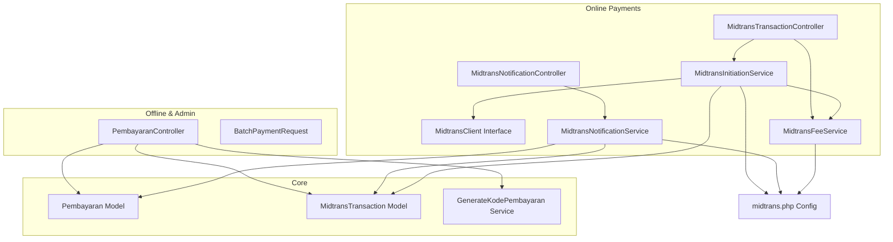
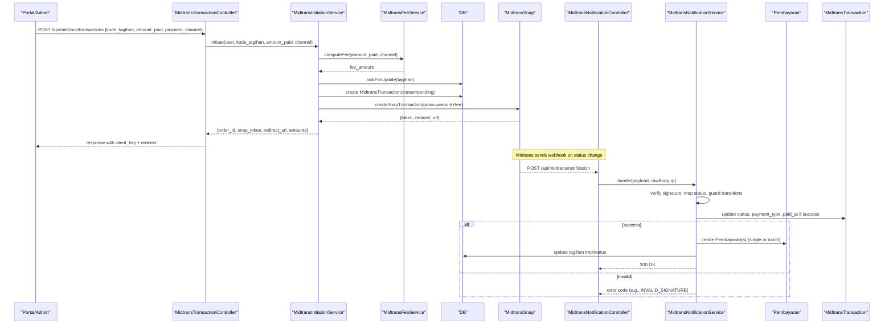
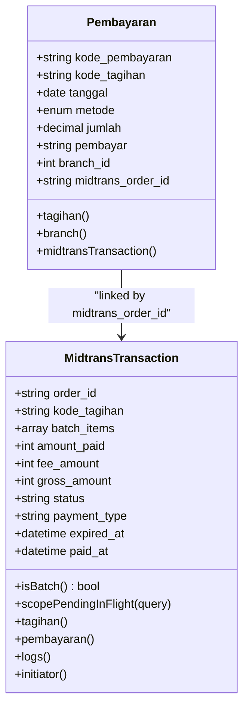
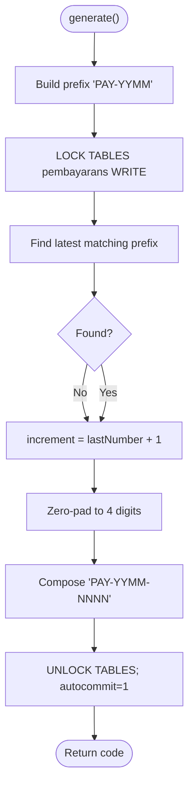
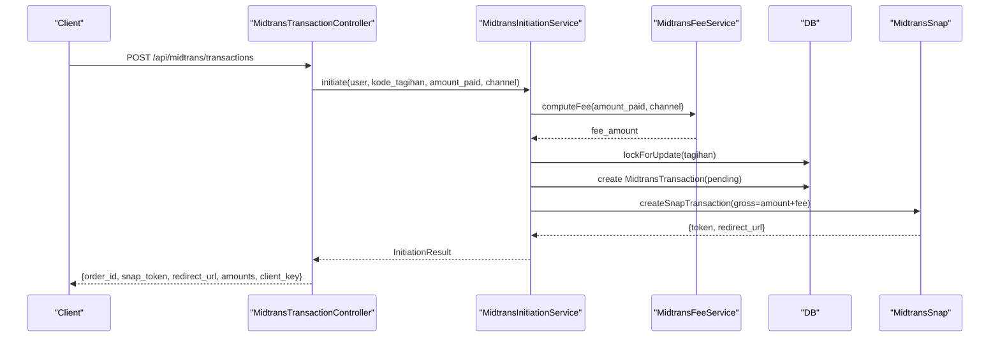
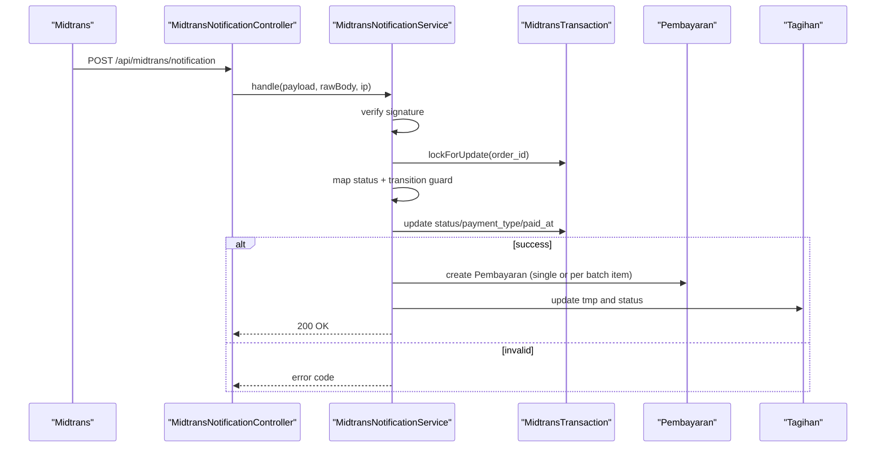
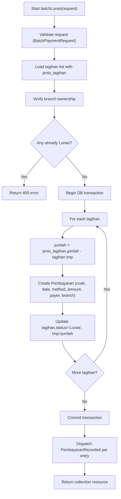
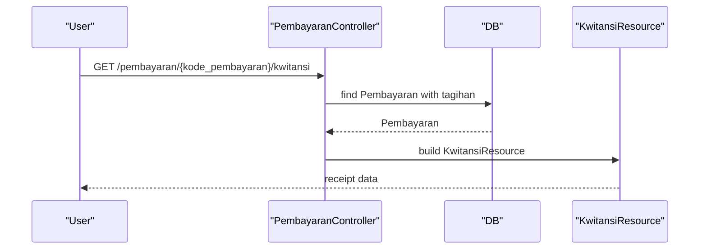
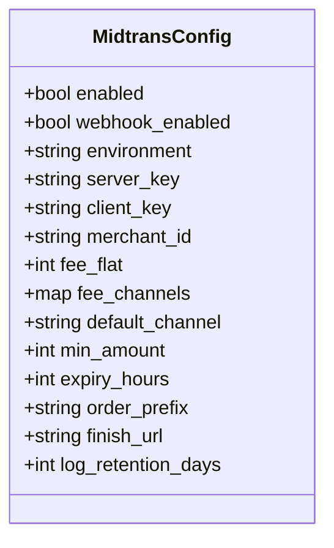
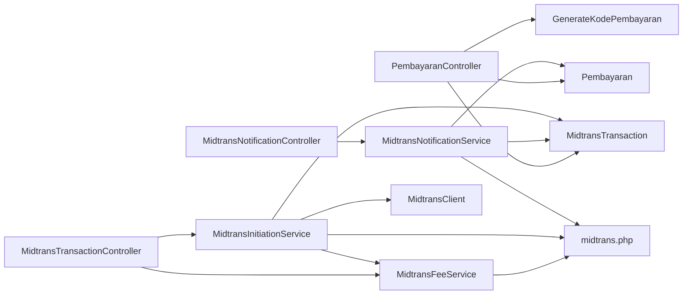

# Payment Processing System

<cite>
**Referenced Files in This Document**
- [Pembayaran.php](file://backend/app/Models/Pembayaran.php)
- [2025_11_14_102319_create_pembayarans_table.php](file://backend/database/migrations/2025_11_14_102319_create_pembayarans_table.php)
- [2026_06_22_000003_add_midtrans_columns_to_pembayarans_table.php](file://backend/database/migrations/2026_06_22_000003_add_midtrans_columns_to_pembayarans_table.php)
- [GenerateKodePembayaran.php](file://backend/app/Services/GenerateKodePembayaran.php)
- [MidtransTransaction.php](file://backend/app/Models/MidtransTransaction.php)
- [midtrans.php](file://backend/config/midtrans.php)
- [MidtransClient.php](file://backend/app/Services/Midtrans/MidtransClient.php)
- [MidtransInitiationService.php](file://backend/app/Services/Midtrans/MidtransInitiationService.php)
- [MidtransNotificationService.php](file://backend/app/Services/Midtrans/MidtransNotificationService.php)
- [MidtransFeeService.php](file://backend/app/Services/Midtrans/MidtransFeeService.php)
- [MidtransTransactionController.php](file://backend/app/Http/Controllers/MidtransTransactionController.php)
- [MidtransNotificationController.php](file://backend/app/Http/Controllers/MidtransNotificationController.php)
- [PembayaranController.php](file://backend/app/Http/Controllers/PembayaranController.php)
- [BatchPaymentRequest.php](file://backend/app/Http/Requests/BatchPaymentRequest.php)
- [PembayaranRecorded.php](file://backend/app/Events/PembayaranRecorded.php)
</cite>

## Table of Contents
1. Introduction
2. Project Structure
3. Core Components
4. Architecture Overview
5. Detailed Component Analysis
6. Dependency Analysis
7. Performance Considerations
8. Troubleshooting Guide
9. Conclusion

## Introduction
This document explains the Handayani payment processing system, covering:
- The Pembayaran (payment) model and schema
- Online and offline payment methods
- Payment code generation
- End-to-end workflows from initiation to completion
- Status transitions and reconciliation
- Midtrans integration for online payments
- Fee calculation and channel configuration
- Batch payments and receipt generation
- Guidelines for adding new payment methods

## Project Structure
The payment subsystem spans models, services, controllers, requests, events, config, and migrations. Key areas:
- Models: Pembayaran, MidtransTransaction
- Services: MidtransInitiationService, MidtransNotificationService, MidtransFeeService, GenerateKodePembayaran
- Controllers: PembayaranController, MidtransTransactionController, MidtransNotificationController
- Config: midtrans.php
- Migrations: pembayaran table creation and Midtrans columns addition
- Events: PembayaranRecorded

**Diagram sources**
- [Pembayaran.php:1-53](file://backend/app/Models/Pembayaran.php#L1-L53)
- [MidtransTransaction.php:1-85](file://backend/app/Models/MidtransTransaction.php#L1-L85)
- [GenerateKodePembayaran.php:1-48](file://backend/app/Services/GenerateKodePembayaran.php#L1-L48)
- [MidtransClient.php:1-27](file://backend/app/Services/Midtrans/MidtransClient.php#L1-L27)
- [MidtransInitiationService.php:1-473](file://backend/app/Services/Midtrans/MidtransInitiationService.php#L1-L473)
- [MidtransNotificationService.php:1-284](file://backend/app/Services/Midtrans/MidtransNotificationService.php#L1-L284)
- [MidtransFeeService.php:1-144](file://backend/app/Services/Midtrans/MidtransFeeService.php#L1-L144)
- [MidtransTransactionController.php:1-127](file://backend/app/Http/Controllers/MidtransTransactionController.php#L1-L127)
- [MidtransNotificationController.php:1-35](file://backend/app/Http/Controllers/MidtransNotificationController.php#L1-L35)
- [PembayaranController.php:1-496](file://backend/app/Http/Controllers/PembayaranController.php#L1-L496)
- [BatchPaymentRequest.php:1-76](file://backend/app/Http/Requests/BatchPaymentRequest.php#L1-L76)
- [midtrans.php:1-130](file://backend/config/midtrans.php#L1-L130)

**Section sources**
- [Pembayaran.php:1-53](file://backend/app/Models/Pembayaran.php#L1-L53)
- [MidtransTransaction.php:1-85](file://backend/app/Models/MidtransTransaction.php#L1-L85)
- [GenerateKodePembayaran.php:1-48](file://backend/app/Services/GenerateKodePembayaran.php#L1-L48)
- [midtrans.php:1-130](file://backend/config/midtrans.php#L1-L130)

## Core Components
- Pembayaran model: Represents a single payment record with fields for payment code, tagihan reference, date, method, amount, payer name, branch, and optional Midtrans order id. It defines relationships to Tagihan, Branch, and MidtransTransaction.
- MidtransTransaction model: Tracks online transactions with order id, amounts, status, payment type, Snap token/redirect, expiry/paid timestamps, batch items, and audit logs.
- GenerateKodePembayaran service: Generates unique payment codes per month with table locking to avoid collisions.
- Midtrans fee service: Computes admin fees per channel (flat or percent+flat), exposes available channels with previews, and asserts gross amount invariants.
- Midtrans initiation service: Orchestrates online payment initiation, validates ownership and amounts, computes fees, persists transaction, calls Midtrans Snap, and returns redirect info.
- Midtrans notification service: Verifies webhook signatures, maps statuses, enforces state transitions, updates transaction, records Pembayaran(s), reconciles tagihan tmp/status, and dispatches events.
- Controllers: Expose APIs for initiating online payments, listing fee channels, handling webhooks, and recording offline payments; also provide grouped/list views and receipts.

**Section sources**
- [Pembayaran.php:1-53](file://backend/app/Models/Pembayaran.php#L1-L53)
- [MidtransTransaction.php:1-85](file://backend/app/Models/MidtransTransaction.php#L1-L85)
- [GenerateKodePembayaran.php:1-48](file://backend/app/Services/GenerateKodePembayaran.php#L1-L48)
- [MidtransFeeService.php:1-144](file://backend/app/Services/Midtrans/MidtransFeeService.php#L1-L144)
- [MidtransInitiationService.php:1-473](file://backend/app/Services/Midtrans/MidtransInitiationService.php#L1-L473)
- [MidtransNotificationService.php:1-284](file://backend/app/Services/Midtrans/MidtransNotificationService.php#L1-L284)
- [MidtransTransactionController.php:1-127](file://backend/app/Http/Controllers/MidtransTransactionController.php#L1-L127)
- [MidtransNotificationController.php:1-35](file://backend/app/Http/Controllers/MidtransNotificationController.php#L1-L35)
- [PembayaranController.php:1-496](file://backend/app/Http/Controllers/PembayaranController.php#L1-L496)

## Architecture Overview
End-to-end flows:
- Offline payments: Admin records one or multiple payments, generating payment codes and updating tagihan totals and status.
- Online payments: Client initiates via API, service calculates fees, creates MidtransTransaction, calls Midtrans Snap, then waits for webhook to reconcile and create Pembayaran records.

**Diagram sources**
- [MidtransTransactionController.php:1-127](file://backend/app/Http/Controllers/MidtransTransactionController.php#L1-L127)
- [MidtransInitiationService.php:1-473](file://backend/app/Services/Midtrans/MidtransInitiationService.php#L1-L473)
- [MidtransFeeService.php:1-144](file://backend/app/Services/Midtrans/MidtransFeeService.php#L1-L144)
- [MidtransNotificationController.php:1-35](file://backend/app/Http/Controllers/MidtransNotificationController.php#L1-L35)
- [MidtransNotificationService.php:1-284](file://backend/app/Services/Midtrans/MidtransNotificationService.php#L1-L284)
- [Pembayaran.php:1-53](file://backend/app/Models/Pembayaran.php#L1-L53)
- [MidtransTransaction.php:1-85](file://backend/app/Models/MidtransTransaction.php#L1-L85)

## Detailed Component Analysis

### Pembayaran Model and Schema
- Primary key is a string payment code generated by GenerateKodePembayaran.
- Fields include tagihan link, date, method enum (offline, online_midtrans), amount, payer, branch, and optional midtrans_order_id for traceability.
- Relationships: belongsTo Tagihan, Branch; hasOne MidtransTransaction via midtrans_order_id.

**Diagram sources**
- [Pembayaran.php:1-53](file://backend/app/Models/Pembayaran.php#L1-L53)
- [MidtransTransaction.php:1-85](file://backend/app/Models/MidtransTransaction.php#L1-L85)

**Section sources**
- [Pembayaran.php:1-53](file://backend/app/Models/Pembayaran.php#L1-L53)
- [2025_11_14_102319_create_pembayarans_table.php:1-34](file://backend/database/migrations/2025_11_14_102319_create_pembayarans_table.php#L1-L34)
- [2026_06_22_000003_add_midtrans_columns_to_pembayarans_table.php:1-37](file://backend/database/migrations/2026_06_22_000003_add_midtrans_columns_to_pembayarans_table.php#L1-L37)

### Payment Code Generation
- Generates codes like PAY-YYMM-NNNN using current year/month prefix and zero-padded sequence.
- Uses explicit table write lock to ensure uniqueness across concurrent requests.

**Diagram sources**
- [GenerateKodePembayaran.php:1-48](file://backend/app/Services/GenerateKodePembayaran.php#L1-L48)

**Section sources**
- [GenerateKodePembayaran.php:1-48](file://backend/app/Services/GenerateKodePembayaran.php#L1-L48)

### Online Payment Initiation Flow
- Validates feature flags and configuration.
- Loads and locks target tagihan, verifies user ownership, computes remaining balance, checks minimum amount and no pending transaction.
- Calculates fee based on selected channel, persists MidtransTransaction, builds Snap payload, calls Midtrans Snap, and returns redirect info.

**Diagram sources**
- [MidtransTransactionController.php:1-127](file://backend/app/Http/Controllers/MidtransTransactionController.php#L1-L127)
- [MidtransInitiationService.php:1-473](file://backend/app/Services/Midtrans/MidtransInitiationService.php#L1-L473)
- [MidtransFeeService.php:1-144](file://backend/app/Services/Midtrans/MidtransFeeService.php#L1-L144)

**Section sources**
- [MidtransTransactionController.php:1-127](file://backend/app/Http/Controllers/MidtransTransactionController.php#L1-L127)
- [MidtransInitiationService.php:1-473](file://backend/app/Services/Midtrans/MidtransInitiationService.php#L1-L473)
- [MidtransFeeService.php:1-144](file://backend/app/Services/Midtrans/MidtransFeeService.php#L1-L144)

### Webhook Handling and Reconciliation
- Verifies signature, loads transaction, maps external status to internal states, enforces allowed transitions, updates transaction, and on success records Pembayaran(s).
- For batch transactions, creates one Pembayaran per item and updates each tagihan’s tmp and status accordingly.
- Dispatches PembayaranRecorded event for notifications.

**Diagram sources**
- [MidtransNotificationController.php:1-35](file://backend/app/Http/Controllers/MidtransNotificationController.php#L1-L35)
- [MidtransNotificationService.php:1-284](file://backend/app/Services/Midtrans/MidtransNotificationService.php#L1-L284)
- [MidtransTransaction.php:1-85](file://backend/app/Models/MidtransTransaction.php#L1-L85)
- [Pembayaran.php:1-53](file://backend/app/Models/Pembayaran.php#L1-L53)

**Section sources**
- [MidtransNotificationController.php:1-35](file://backend/app/Http/Controllers/MidtransNotificationController.php#L1-L35)
- [MidtransNotificationService.php:1-284](file://backend/app/Services/Midtrans/MidtransNotificationService.php#L1-L284)

### Offline Payments and Batch Recording
- Single offline payment: validate tagihan, prevent overpayment, create Pembayaran, update tagihan tmp/status, dispatch event.
- Batch offline payment: validate list, ensure none are already Lunas, loop through tagihan creating Pembayaran entries, set all to Lunas, dispatch events.

**Diagram sources**
- [PembayaranController.php:170-241](file://backend/app/Http/Controllers/PembayaranController.php#L170-L241)
- [BatchPaymentRequest.php:1-76](file://backend/app/Http/Requests/BatchPaymentRequest.php#L1-L76)

**Section sources**
- [PembayaranController.php:170-241](file://backend/app/Http/Controllers/PembayaranController.php#L170-L241)
- [BatchPaymentRequest.php:1-76](file://backend/app/Http/Requests/BatchPaymentRequest.php#L1-L76)

### Receipt Generation
- Kwitansi endpoint retrieves a Pembayaran by code and returns structured data suitable for receipt rendering.

**Diagram sources**
- [PembayaranController.php:400-410](file://backend/app/Http/Controllers/PembayaranController.php#L400-L410)

**Section sources**
- [PembayaranController.php:400-410](file://backend/app/Http/Controllers/PembayaranController.php#L400-L410)

### Midtrans Configuration and Channels
- Feature toggles: enable/disable gateway and webhooks independently.
- Credentials: server_key, client_key, merchant_id.
- Transaction settings: default channel, min amount, expiry hours, order prefix, finish URL, log retention.
- Fee channels: per-channel flat or percent+flat with environment overrides.

**Diagram sources**
- [midtrans.php:1-130](file://backend/config/midtrans.php#L1-L130)

**Section sources**
- [midtrans.php:1-130](file://backend/config/midtrans.php#L1-L130)

### Practical Examples

- Process an online payment:
  - Call initiation endpoint with kode_tagihan, amount_paid, and optional payment_channel.
  - Use returned snap_token and redirect_url to open Midtrans Snap.
  - On webhook success, check Pembayaran created and tagihan status updated.

- Process an offline payment:
  - Call single payment endpoint with kode_tagihan, jumlah, metode, pembayar.
  - Verify response includes new Pembayaran and updated tagihan status.

- Process batch offline payments:
  - Submit array of kode_tagihan with shared metode and pembayar.
  - All selected tagihan become Lunas and multiple Pembayaran records are created.

- Handle failures:
  - Inspect controller/service exceptions for reasons such as insufficient remaining balance, below minimum amount, forbidden access, or Midtrans unavailability.
  - For webhooks, invalid signature or amount mismatch will return specific error codes.

- Generate a receipt:
  - Request kwitansi by kode_pembayaran to retrieve receipt-ready data.

[No sources needed since this section provides general guidance]

### Adding New Payment Methods
- Offline methods:
  - Extend the metode enum in the pembayaran migration to include the new method.
  - Update validation rules in BatchPaymentRequest and any other request classes that validate metode.
  - Ensure controllers accept and persist the new method value.

- Online methods (Midtrans):
  - Add a new channel entry under fee_channels in midtrans.php with label, type, and fee parameters.
  - If restricting Snap UI to a specific channel, extend resolveEnabledPayments mapping in MidtransInitiationService.
  - Optionally add environment variables for per-channel fee overrides.

**Section sources**
- [2025_11_14_102319_create_pembayarans_table.php:1-34](file://backend/database/migrations/2025_11_14_102319_create_pembayarans_table.php#L1-L34)
- [BatchPaymentRequest.php:1-76](file://backend/app/Http/Requests/BatchPaymentRequest.php#L1-L76)
- [midtrans.php:1-130](file://backend/config/midtrans.php#L1-L130)
- [MidtransInitiationService.php:450-471](file://backend/app/Services/Midtrans/MidtransInitiationService.php#L450-L471)

## Dependency Analysis
Key dependencies and interactions:
- Controllers depend on services for business logic.
- Services depend on config and models.
- Notification service depends on signature verification, status mapping, and transition guards.
- Fee service reads runtime config to compute fees and expose channel metadata.

**Diagram sources**
- [PembayaranController.php:1-496](file://backend/app/Http/Controllers/PembayaranController.php#L1-L496)
- [MidtransTransactionController.php:1-127](file://backend/app/Http/Controllers/MidtransTransactionController.php#L1-L127)
- [MidtransNotificationController.php:1-35](file://backend/app/Http/Controllers/MidtransNotificationController.php#L1-L35)
- [MidtransInitiationService.php:1-473](file://backend/app/Services/Midtrans/MidtransInitiationService.php#L1-L473)
- [MidtransNotificationService.php:1-284](file://backend/app/Services/Midtrans/MidtransNotificationService.php#L1-L284)
- [MidtransFeeService.php:1-144](file://backend/app/Services/Midtrans/MidtransFeeService.php#L1-L144)
- [midtrans.php:1-130](file://backend/config/midtrans.php#L1-L130)

**Section sources**
- [PembayaranController.php:1-496](file://backend/app/Http/Controllers/PembayaranController.php#L1-L496)
- [MidtransTransactionController.php:1-127](file://backend/app/Http/Controllers/MidtransTransactionController.php#L1-L127)
- [MidtransNotificationController.php:1-35](file://backend/app/Http/Controllers/MidtransNotificationController.php#L1-L35)
- [MidtransInitiationService.php:1-473](file://backend/app/Services/Midtrans/MidtransInitiationService.php#L1-L473)
- [MidtransNotificationService.php:1-284](file://backend/app/Services/Midtrans/MidtransNotificationService.php#L1-L284)
- [MidtransFeeService.php:1-144](file://backend/app/Services/Midtrans/MidtransFeeService.php#L1-L144)
- [midtrans.php:1-130](file://backend/config/midtrans.php#L1-L130)

## Performance Considerations
- Use database transactions for batch operations to ensure consistency and reduce round-trips.
- Prefer selective field loading and eager loading only where necessary to minimize query overhead.
- Leverage indexes on frequently filtered columns (e.g., metode, kode_pembayaran, kode_tagihan).
- Avoid unnecessary recomputation by caching or reading config once per request when appropriate.
- For high concurrency, rely on row-level locking (lockForUpdate) and short transactions to reduce contention.

[No sources needed since this section provides general guidance]

## Troubleshooting Guide
Common issues and resolutions:
- Invalid signature on webhook:
  - Ensure server_key matches Midtrans configuration and payload integrity is intact.
- Amount mismatch:
  - Verify gross_amount equals amount_paid + fee_amount and that fee computation aligns with configured channels.
- Overpayment blocked:
  - Confirm sisa_tagihan before recording; adjust payment amount or reverse prior payments if needed.
- Forbidden access:
  - Validate user’s siswa NIS matches the tagihan.nis for online initiation and status queries.
- Pending transaction exists:
  - Wait for existing transaction to complete or expire before initiating a new one.
- Midtrans unavailable:
  - Retry after backoff; inspect logs for outbound charge errors.

**Section sources**
- [MidtransNotificationService.php:1-284](file://backend/app/Services/Midtrans/MidtransNotificationService.php#L1-L284)
- [MidtransInitiationService.php:1-473](file://backend/app/Services/Midtrans/MidtransInitiationService.php#L1-L473)
- [MidtransTransactionController.php:1-127](file://backend/app/Http/Controllers/MidtransTransactionController.php#L1-L127)

## Conclusion
The Handayani payment system cleanly separates offline and online flows while maintaining consistent reconciliation and auditability. Online payments integrate with Midtrans via robust initiation, fee calculation, and webhook processing. Offline payments support efficient batch recording. Extensibility is straightforward through configuration and minimal code changes for new methods.