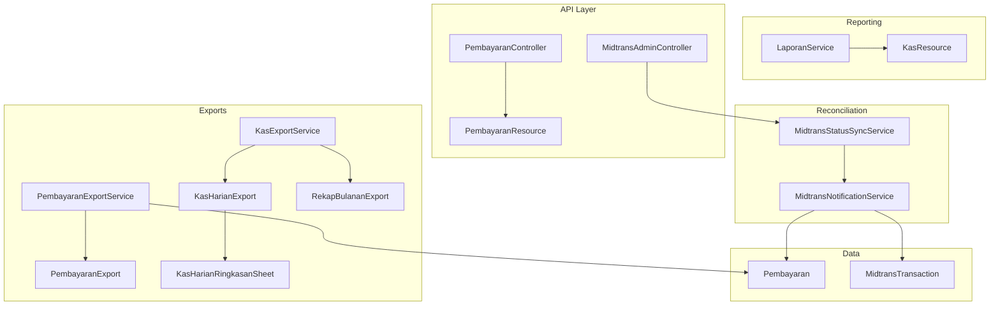
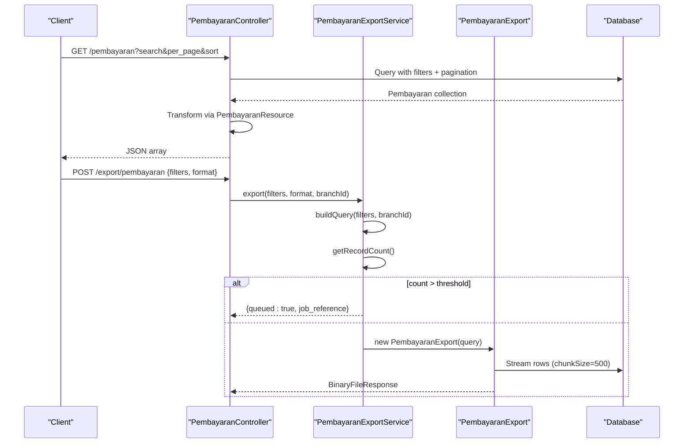
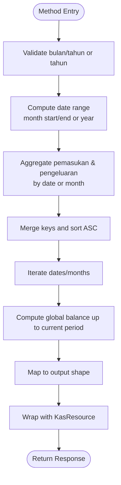
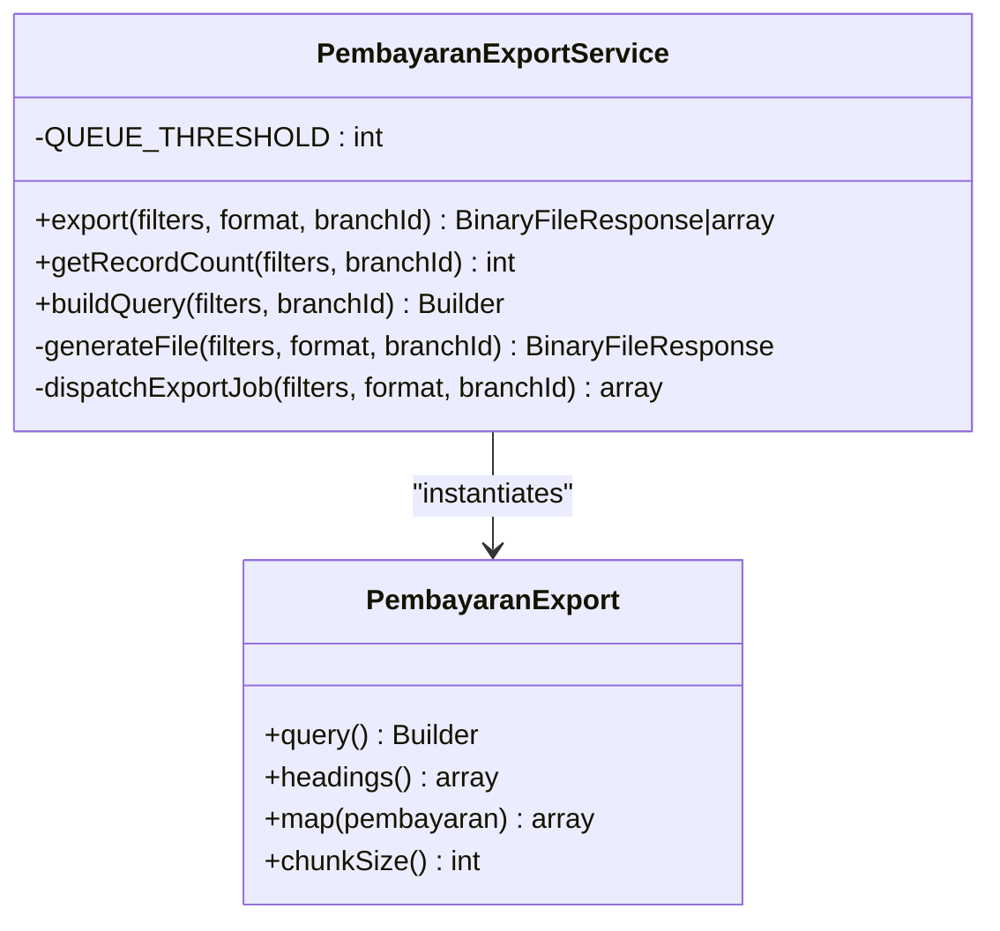
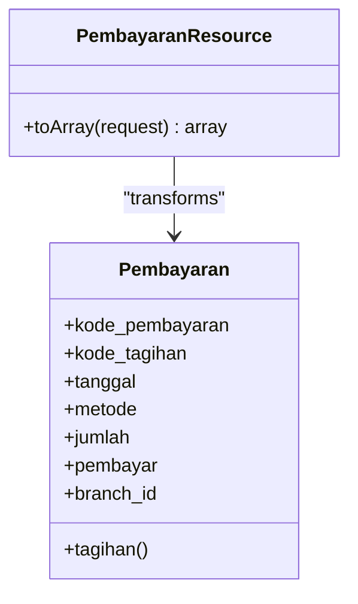
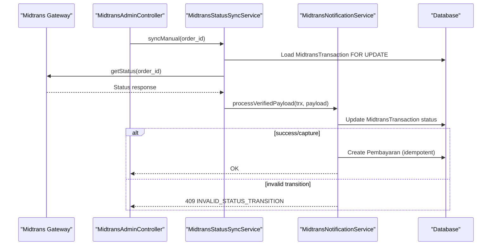
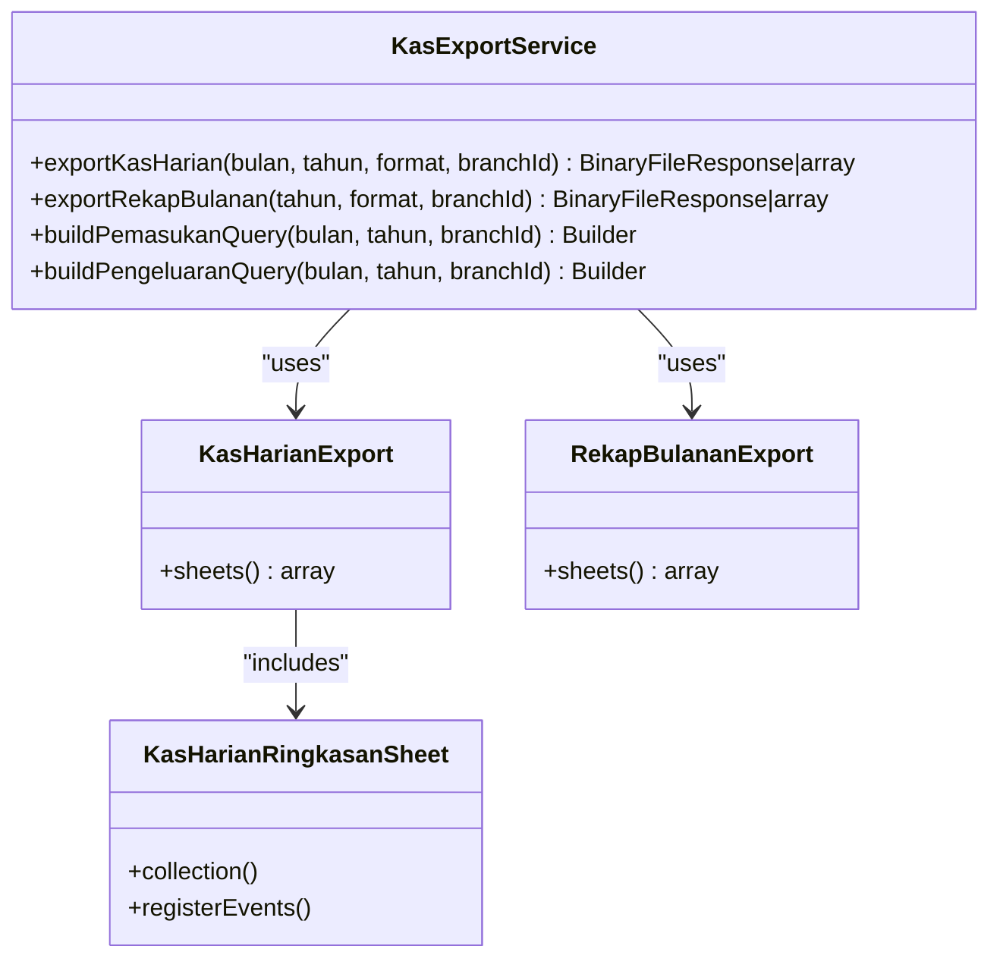
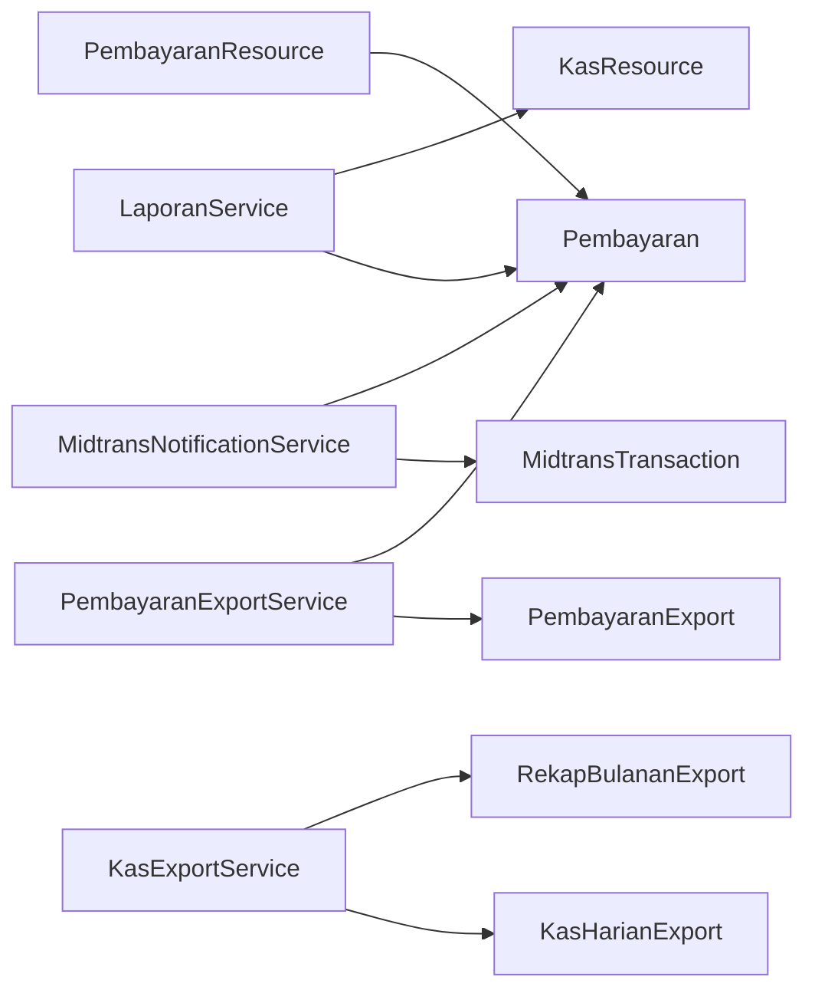

# Payment Reconciliation & Reporting

<cite>
**Referenced Files in This Document**
- [LaporanService.php](file://backend/app/Services/LaporanService.php)
- [KasResource.php](file://backend/app/Http/Resources/KasResource.php)
- [PembayaranExportService.php](file://backend/app/Services/ImportExport/PembayaranExportService.php)
- [PembayaranExport.php](file://backend/app/Exports/PembayaranExport.php)
- [PembayaranResource.php](file://backend/app/Http/Resources/PembayaranResource.php)
- [PembayaranController.php](file://backend/app/Http/Controllers/PembayaranController.php)
- [MidtransNotificationService.php](file://backend/app/Services/Midtrans/MidtransNotificationService.php)
- [MidtransStatusSyncService.php](file://backend/app/Services/Midtrans/MidtransStatusSyncService.php)
- [MidtransAdminController.php](file://backend/app/Http/Controllers/MidtransAdminController.php)
- [MidtransTransaction.php](file://backend/app/Models/MidtransTransaction.php)
- [Pembayaran.php](file://backend/app/Models/Pembayaran.php)
- [KasExportService.php](file://backend/app/Services/ImportExport/KasExportService.php)
- [KasHarianExport.php](file://backend/app/Exports/KasHarianExport.php)
- [RekapBulananExport.php](file://backend/app/Exports/RekapBulananExport.php)
- [KasHarianRingkasanSheet.php](file://backend/app/Exports/Sheets/KasHarianRingkasanSheet.php)
</cite>

## Table of Contents
1. Introduction
2. Project Structure
3. Core Components
4. Architecture Overview
5. Detailed Component Analysis
6. Dependency Analysis
7. Performance Considerations
8. Troubleshooting Guide
9. Conclusion

## Introduction
This document explains the payment reconciliation and reporting system with a focus on:
- LaporanService methods for generating daily summaries and monthly recaps
- PembayaranExport service for exporting payment data to Excel/CSV with filtering and aggregation
- PembayaranResource for API responses, including data transformation and relationship loading
- Reconciliation processes that match internal payment records with external payment gateway statements (Midtrans)
- Reporting templates, export configurations, and performance optimization techniques for large datasets

The goal is to provide both high-level understanding and code-level traceability for developers and operators.

## Project Structure
The relevant parts of the backend are organized by feature areas:
- Services: business logic for reports and exports
- Exports: Maatwebsite Excel exporters and sheet definitions
- Resources: JSON response transformers for API endpoints
- Controllers: HTTP endpoints for admin and portal usage
- Models: Eloquent entities for payments and Midtrans transactions

**Diagram sources**
- [LaporanService.php:14-130](file://backend/app/Services/LaporanService.php#L14-L130)
- [KasResource.php:15-24](file://backend/app/Http/Resources/KasResource.php#L15-L24)
- [PembayaranExportService.php:29-91](file://backend/app/Services/ImportExport/PembayaranExportService.php#L29-L91)
- [PembayaranExport.php:11-59](file://backend/app/Exports/PembayaranExport.php#L11-L59)
- [KasExportService.php:35-75](file://backend/app/Services/ImportExport/KasExportService.php#L35-L75)
- [KasHarianExport.php:11-28](file://backend/app/Exports/KasHarianExport.php#L11-L28)
- [RekapBulananExport.php:11-28](file://backend/app/Exports/RekapBulananExport.php#L11-L28)
- [KasHarianRingkasanSheet.php:12-124](file://backend/app/Exports/Sheets/KasHarianRingkasanSheet.php#L12-L124)
- [PembayaranController.php:124-165](file://backend/app/Http/Controllers/PembayaranController.php#L124-L165)
- [PembayaranResource.php:15-26](file://backend/app/Http/Resources/PembayaranResource.php#L15-L26)
- [MidtransAdminController.php:137-144](file://backend/app/Http/Controllers/MidtransAdminController.php#L137-L144)
- [MidtransStatusSyncService.php:25-71](file://backend/app/Services/Midtrans/MidtransStatusSyncService.php#L25-L71)
- [MidtransNotificationService.php:31-150](file://backend/app/Services/Midtrans/MidtransNotificationService.php#L31-L150)
- [Pembayaran.php:8-52](file://backend/app/Models/Pembayaran.php#L8-L52)
- [MidtransTransaction.php:7-84](file://backend/app/Models/MidtransTransaction.php#L7-L84)

**Section sources**
- [LaporanService.php:14-232](file://backend/app/Services/LaporanService.php#L14-L232)
- [PembayaranExportService.php:29-141](file://backend/app/Services/ImportExport/PembayaranExportService.php#L29-L141)
- [PembayaranExport.php:11-59](file://backend/app/Exports/PembayaranExport.php#L11-L59)
- [PembayaranResource.php:15-26](file://backend/app/Http/Resources/PembayaranResource.php#L15-L26)
- [PembayaranController.php:124-165](file://backend/app/Http/Controllers/PembayaranController.php#L124-L165)
- [MidtransNotificationService.php:31-150](file://backend/app/Services/Midtrans/MidtransNotificationService.php#L31-L150)
- [MidtransStatusSyncService.php:25-71](file://backend/app/Services/Midtrans/MidtransStatusSyncService.php#L25-L71)
- [MidtransAdminController.php:137-144](file://backend/app/Http/Controllers/MidtransAdminController.php#L137-L144)
- [Pembayaran.php:8-52](file://backend/app/Models/Pembayaran.php#L8-L52)
- [MidtransTransaction.php:7-84](file://backend/app/Models/MidtransTransaction.php#L7-L84)
- [KasExportService.php:35-75](file://backend/app/Services/ImportExport/KasExportService.php#L35-L75)
- [KasHarianExport.php:11-28](file://backend/app/Exports/KasHarianExport.php#L11-L28)
- [RekapBulananExport.php:11-28](file://backend/app/Exports/RekapBulananExport.php#L11-L28)
- [KasHarianRingkasanSheet.php:12-124](file://backend/app/Exports/Sheets/KasHarianRingkasanSheet.php#L12-L124)

## Core Components
- LaporanService: Generates KasHarian (daily cash report) and RekapBulanan (monthly recap) with running balances scoped to the authenticated user’s branch.
- PembayaranExportService: Builds filtered queries for pembayaran exports, supports sync or queued generation based on dataset size, and returns either a file download or job reference.
- PembayaranExport: Defines headings, mapping, chunked reading, and eager loading for efficient export.
- PembayaranResource: Transforms Pembayaran model into API-friendly arrays, conditionally loading related Tagihan.
- MidtransNotificationService: Processes webhooks and manual syncs, validates signatures, enforces status transitions, and creates Pembayaran records idempotently.
- MidtransStatusSyncService: Manually fetches transaction status from the gateway and delegates processing to the notification service.
- MidtransAdminController: Admin endpoints to list, view details, inspect logs, and trigger manual sync.
- KasExportService: Orchestrates kas harian and rekap bulanan exports, including multi-sheet Excel and CSV formats.

**Section sources**
- [LaporanService.php:14-232](file://backend/app/Services/LaporanService.php#L14-L232)
- [PembayaranExportService.php:29-141](file://backend/app/Services/ImportExport/PembayaranExportService.php#L29-L141)
- [PembayaranExport.php:11-59](file://backend/app/Exports/PembayaranExport.php#L11-L59)
- [PembayaranResource.php:15-26](file://backend/app/Http/Resources/PembayaranResource.php#L15-L26)
- [MidtransNotificationService.php:31-150](file://backend/app/Services/Midtrans/MidtransNotificationService.php#L31-L150)
- [MidtransStatusSyncService.php:25-71](file://backend/app/Services/Midtrans/MidtransStatusSyncService.php#L25-L71)
- [MidtransAdminController.php:137-144](file://backend/app/Http/Controllers/MidtransAdminController.php#L137-L144)
- [KasExportService.php:35-75](file://backend/app/Services/ImportExport/KasExportService.php#L35-L75)

## Architecture Overview
The system integrates three major flows:
- Reporting: LaporanService computes daily/monthly summaries; KasExportService generates multi-sheet Excel or single-file CSV exports.
- Exporting: PembayaranExportService builds queries, decides sync vs queue, and uses PembayaranExport for streaming/chunked writes.
- Reconciliation: MidtransNotificationService handles webhooks and manual sync via MidtransStatusSyncService, creating Pembayaran records and updating tagihan state.

**Diagram sources**
- [PembayaranController.php:124-165](file://backend/app/Http/Controllers/PembayaranController.php#L124-L165)
- [PembayaranResource.php:15-26](file://backend/app/Http/Resources/PembayaranResource.php#L15-L26)
- [PembayaranExportService.php:29-91](file://backend/app/Services/ImportExport/PembayaranExportService.php#L29-L91)
- [PembayaranExport.php:11-59](file://backend/app/Exports/PembayaranExport.php#L11-L59)

## Detailed Component Analysis

### LaporanService: Daily Summaries and Monthly Recaps
Responsibilities:
- KasHarian(Request): Validates month/year, aggregates pemasukan and pengeluaran per day, computes global running balance up to each date, and returns formatted results via KasResource.
- RekapBulanan(Request): Validates year, aggregates per month, computes global balance at month-end, and returns formatted results via KasResource.

Key behaviors:
- Branch scoping using Auth::user()->branch_id
- Date range computation for month boundaries
- Running balance computed by summing all payments and expenses up to the current date/month boundary
- Output normalized through KasResource for consistent float formatting

**Diagram sources**
- [LaporanService.php:14-130](file://backend/app/Services/LaporanService.php#L14-L130)
- [LaporanService.php:131-232](file://backend/app/Services/LaporanService.php#L131-L232)
- [KasResource.php:15-24](file://backend/app/Http/Resources/KasResource.php#L15-L24)

**Section sources**
- [LaporanService.php:14-130](file://backend/app/Services/LaporanService.php#L14-L130)
- [LaporanService.php:131-232](file://backend/app/Services/LaporanService.php#L131-L232)
- [KasResource.php:15-24](file://backend/app/Http/Resources/KasResource.php#L15-L24)

### PembayaranExportService: Filtering, Aggregation, and Export Orchestration
Responsibilities:
- export(filters, format, branchId): Decides sync vs queue based on record count threshold
- buildQuery(filters, branchId): Applies branch scope, optional date range, and optional academic year filter; defaults to active period when no filters provided
- generateFile(): Synchronous export using PembayaranExport
- dispatchExportJob(): Asynchronous export with job tracking and polling support

Filtering options:
- tanggal_mulai, tanggal_selesai: date range on pembayaran.tanggal
- tahun_ajaran_id: filter through related tagihan; if absent and no date filter, default to active academic year

Performance:
- Queue threshold constant controls async behavior
- Uses Maatwebsite Excel with chunked reading in PembayaranExport

**Diagram sources**
- [PembayaranExportService.php:29-141](file://backend/app/Services/ImportExport/PembayaranExportService.php#L29-L141)
- [PembayaranExport.php:11-59](file://backend/app/Exports/PembayaranExport.php#L11-L59)

**Section sources**
- [PembayaranExportService.php:29-141](file://backend/app/Services/ImportExport/PembayaranExportService.php#L29-L141)
- [PembayaranExport.php:11-59](file://backend/app/Exports/PembayaranExport.php#L11-L59)

### PembayaranResource: API Data Transformation
Responsibilities:
- Normalizes Pembayaran fields for API consumers
- Conditionally loads and includes Tagihan resource when available

Relationship handling:
- Uses whenLoaded('tagihan') to avoid N+1 when not requested
- Returns key fields: kode_pembayaran, kode_tagihan, tanggal, metode, jumlah, pembayar, branch_id

**Diagram sources**
- [PembayaranResource.php:15-26](file://backend/app/Http/Resources/PembayaranResource.php#L15-L26)
- [Pembayaran.php:8-52](file://backend/app/Models/Pembayaran.php#L8-L52)

**Section sources**
- [PembayaranResource.php:15-26](file://backend/app/Http/Resources/PembayaranResource.php#L15-L26)
- [Pembayaran.php:8-52](file://backend/app/Models/Pembayaran.php#L8-L52)

### Reconciliation: Webhook and Manual Sync Flows
Responsibilities:
- MidtransNotificationService:
  - Verifies webhook signature
  - Enforces gross amount consistency
  - Maps external statuses to internal states
  - Guards valid transitions
  - Idempotently creates Pembayaran records for successful settlements
- MidtransStatusSyncService:
  - Prevents calls for terminal transactions
  - Fetches latest status from gateway
  - Delegates to notification service for unified processing
- MidtransAdminController:
  - Provides admin endpoints to list, view, log, and manually sync transactions

**Diagram sources**
- [MidtransAdminController.php:137-144](file://backend/app/Http/Controllers/MidtransAdminController.php#L137-L144)
- [MidtransStatusSyncService.php:25-71](file://backend/app/Services/Midtrans/MidtransStatusSyncService.php#L25-L71)
- [MidtransNotificationService.php:31-150](file://backend/app/Services/Midtrans/MidtransNotificationService.php#L31-L150)
- [MidtransTransaction.php:7-84](file://backend/app/Models/MidtransTransaction.php#L7-L84)
- [Pembayaran.php:8-52](file://backend/app/Models/Pembayaran.php#L8-L52)

**Section sources**
- [MidtransNotificationService.php:31-150](file://backend/app/Services/Midtrans/MidtransNotificationService.php#L31-L150)
- [MidtransStatusSyncService.php:25-71](file://backend/app/Services/Midtrans/MidtransStatusSyncService.php#L25-L71)
- [MidtransAdminController.php:137-144](file://backend/app/Http/Controllers/MidtransAdminController.php#L137-L144)
- [MidtransTransaction.php:7-84](file://backend/app/Models/MidtransTransaction.php#L7-L84)
- [Pembayaran.php:8-52](file://backend/app/Models/Pembayaran.php#L8-L52)

### Reporting Templates and Export Configuration
- KasHarianExport: Multi-sheet Excel with Ringkasan, Pemasukan, Pengeluaran sheets
- RekapBulananExport: Multi-sheet Excel with Ringkasan, Pemasukan, Pengeluaran sheets
- KasHarianRingkasanSheet: Aggregates daily totals and provides line-item breakdown in Keterangan column with wrap-text formatting
- KasExportService: Orchestrates export selection (xlsx/csv), builds queries, and manages queueing for large datasets

**Diagram sources**
- [KasExportService.php:35-75](file://backend/app/Services/ImportExport/KasExportService.php#L35-L75)
- [KasHarianExport.php:11-28](file://backend/app/Exports/KasHarianExport.php#L11-L28)
- [RekapBulananExport.php:11-28](file://backend/app/Exports/RekapBulananExport.php#L11-L28)
- [KasHarianRingkasanSheet.php:12-124](file://backend/app/Exports/Sheets/KasHarianRingkasanSheet.php#L12-L124)

**Section sources**
- [KasExportService.php:35-75](file://backend/app/Services/ImportExport/KasExportService.php#L35-L75)
- [KasHarianExport.php:11-28](file://backend/app/Exports/KasHarianExport.php#L11-L28)
- [RekapBulananExport.php:11-28](file://backend/app/Exports/RekapBulananExport.php#L11-L28)
- [KasHarianRingkasanSheet.php:12-124](file://backend/app/Exports/Sheets/KasHarianRingkasanSheet.php#L12-L124)

## Dependency Analysis
Key relationships:
- LaporanService depends on Pembayaran and Pengeluaran models and outputs via KasResource
- PembayaranExportService composes query builders and instantiates PembayaranExport
- PembayaranResource transforms Pembayaran and optionally loads Tagihan
- MidtransNotificationService updates MidtransTransaction and creates Pembayaran records
- KasExportService coordinates multiple exporters and sheet classes

**Diagram sources**
- [LaporanService.php:14-130](file://backend/app/Services/LaporanService.php#L14-L130)
- [PembayaranExportService.php:29-91](file://backend/app/Services/ImportExport/PembayaranExportService.php#L29-L91)
- [PembayaranExport.php:11-59](file://backend/app/Exports/PembayaranExport.php#L11-L59)
- [PembayaranResource.php:15-26](file://backend/app/Http/Resources/PembayaranResource.php#L15-L26)
- [MidtransNotificationService.php:31-150](file://backend/app/Services/Midtrans/MidtransNotificationService.php#L31-L150)
- [KasExportService.php:35-75](file://backend/app/Services/ImportExport/KasExportService.php#L35-L75)

**Section sources**
- [LaporanService.php:14-130](file://backend/app/Services/LaporanService.php#L14-L130)
- [PembayaranExportService.php:29-91](file://backend/app/Services/ImportExport/PembayaranExportService.php#L29-L91)
- [PembayaranExport.php:11-59](file://backend/app/Exports/PembayaranExport.php#L11-L59)
- [PembayaranResource.php:15-26](file://backend/app/Http/Resources/PembayaranResource.php#L15-L26)
- [MidtransNotificationService.php:31-150](file://backend/app/Services/Midtrans/MidtransNotificationService.php#L31-L150)
- [KasExportService.php:35-75](file://backend/app/Services/ImportExport/KasExportService.php#L35-L75)

## Performance Considerations
- Chunked export: PembayaranExport implements WithChunkReading with chunkSize=500 to reduce memory pressure during large exports.
- Queue-based generation: Both PembayaranExportService and KasExportService use a threshold to dispatch background jobs for large datasets, returning job references for polling.
- Efficient queries:
  - LaporanService aggregates at SQL level (GROUP BY DATE/MONTH) and computes running balances with targeted sums.
  - PembayaranExportService applies selective where clauses and eager loads only necessary relations for export mapping.
- Avoid over-fetching:
  - PembayaranResource uses whenLoaded to prevent unnecessary relation loading.
  - KasHarianRingkasanSheet clones queries and selects minimal columns for detail sheets.

Recommendations:
- Keep chunk sizes tuned to server memory and I/O capacity
- Use database indexes on frequently filtered columns (e.g., tanggal, branch_id, midtrans_order_id)
- Prefer aggregated queries for summary reports instead of in-memory calculations
- Monitor queue worker throughput and adjust batch sizes accordingly

[No sources needed since this section provides general guidance]

## Troubleshooting Guide
Common issues and diagnostics:
- Invalid signature on webhook: The notification service rejects payloads with invalid signatures and logs warnings. Check server_key configuration and ensure correct signing algorithm.
- Amount mismatch: If gross_amount does not match expected value, the handler rejects with an error code. Verify fee calculation and gross amount in initiation.
- Overpayment blocked: When accumulated payments exceed tagihan cost, the system blocks and throws an exception. Review partial payments and tagihan amounts.
- Transaction already final: Manual sync attempts on terminal transactions are rejected without calling the gateway. Ensure only pending/in-flight transactions are synced.
- Export timeouts or memory errors: For large datasets, rely on queued exports and monitor job status. Adjust QUEUE_THRESHOLD and chunkSize if needed.

Operational tips:
- Use MidtransAdminController logs endpoint to inspect inbound/outbound payloads with sensitive fields masked
- Use manual sync endpoint to reconcile stuck transactions after network failures
- Validate date ranges and academic year filters before exporting to limit result sets

**Section sources**
- [MidtransNotificationService.php:31-150](file://backend/app/Services/Midtrans/MidtransNotificationService.php#L31-L150)
- [MidtransStatusSyncService.php:25-71](file://backend/app/Services/Midtrans/MidtransStatusSyncService.php#L25-L71)
- [MidtransAdminController.php:109-144](file://backend/app/Http/Controllers/MidtransAdminController.php#L109-L144)
- [PembayaranExportService.php:29-141](file://backend/app/Services/ImportExport/PembayaranExportService.php#L29-L141)

## Conclusion
The system provides robust reporting and export capabilities alongside reliable reconciliation with Midtrans. LaporanService delivers accurate daily and monthly summaries with running balances. PembayaranExportService and associated exporters handle large datasets efficiently through chunking and queuing. PembayaranResource ensures clean API responses with controlled relationship loading. Reconciliation services enforce strict validation, idempotency, and financial invariants while exposing admin tools for monitoring and recovery.

[No sources needed since this section summarizes without analyzing specific files]