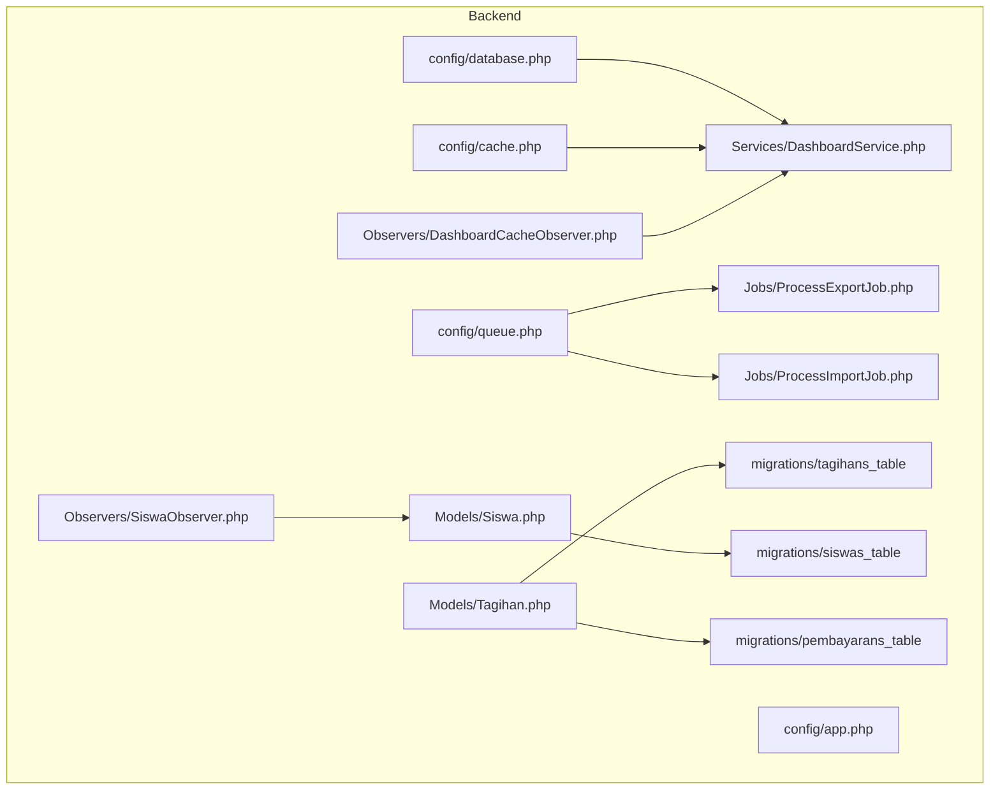
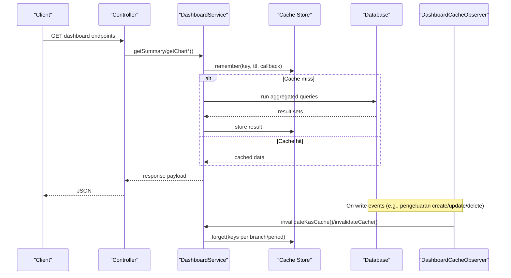
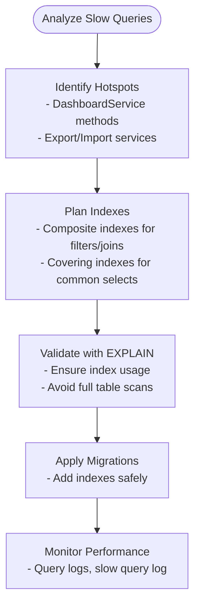
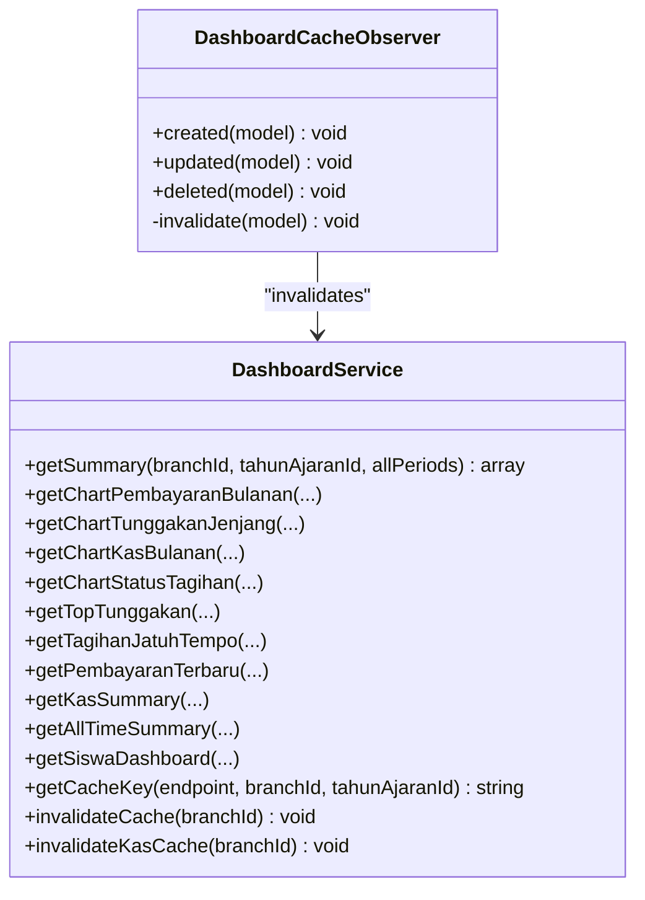
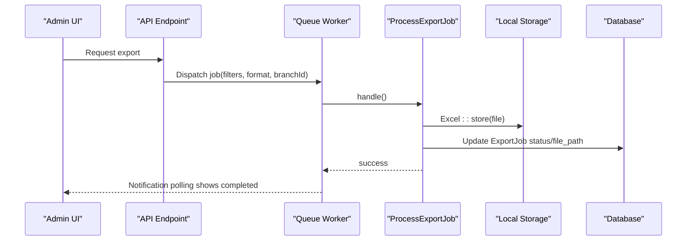
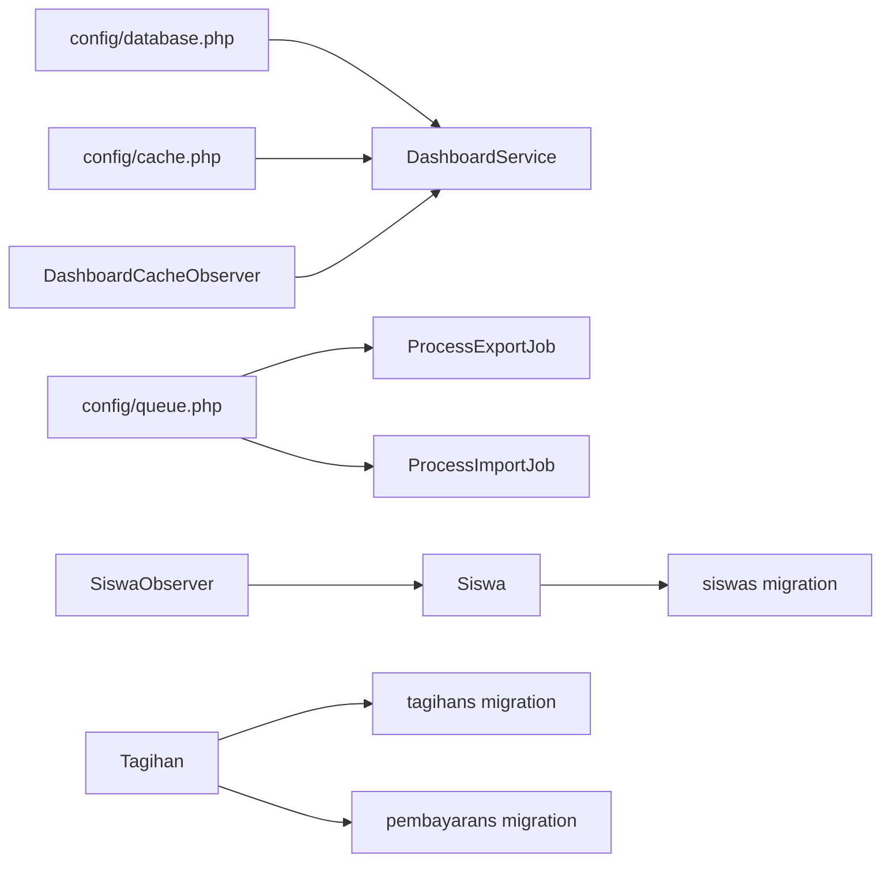

# Performance Optimization

<cite>
**Referenced Files in This Document**
- [database.php](file://backend/config/database.php)
- [cache.php](file://backend/config/cache.php)
- [queue.php](file://backend/config/queue.php)
- [app.php](file://backend/config/app.php)
- [handayani.php](file://frontend-v2/config/handayani.php)
- [DashboardService.php](file://backend/app/Services/DashboardService.php)
- [DashboardCacheObserver.php](file://backend/app/Observers/DashboardCacheObserver.php)
- [SiswaObserver.php](file://backend/app/Observers/SiswaObserver.php)
- [ProcessExportJob.php](file://backend/app/Jobs/ProcessExportJob.php)
- [ProcessImportJob.php](file://backend/app/Jobs/ProcessImportJob.php)
- [Siswa.php](file://backend/app/Models/Siswa.php)
- [Tagihan.php](file://backend/app/Models/Tagihan.php)
- [siswas_table migration](file://backend/database/migrations/2025_11_08_090937_create_siswas_table.php)
- [tagihans_table migration](file://backend/database/migrations/2025_11_14_094745_create_tagihans_table.php)
- [pembayarans_table migration](file://backend/database/migrations/2025_11_14_102319_create_pembayarans_table.php)
</cite>

## Table of Contents
1. [Introduction](#introduction)
2. [Project Structure](#project-structure)
3. [Core Components](#core-components)
4. [Architecture Overview](#architecture-overview)
5. [Detailed Component Analysis](#detailed-component-analysis)
6. [Dependency Analysis](#dependency-analysis)
7. [Performance Considerations](#performance-considerations)
8. [Troubleshooting Guide](#troubleshooting-guide)
9. [Conclusion](#conclusion)
10. [Appendices](#appendices)

## Introduction
This document provides a comprehensive performance optimization guide for the Handayani system, focusing on database query optimization, indexing strategies, Eloquent best practices, caching (including cache observers and Redis configuration), queue processing, memory usage, asset optimization, CDN configuration, frontend tuning, scalability, load balancing, and production monitoring. It maps recommendations to actual code and configuration files in the repository.

## Project Structure
The backend is a Laravel application with:
- Configuration under config/ for database, cache, queue, and app settings
- Service layer for dashboard analytics with caching
- Observers for cache invalidation and account lifecycle
- Queue jobs for import/export operations
- Models and migrations defining core entities and indexes

**Diagram sources**
- [database.php:1-184](file://backend/config/database.php#L1-L184)
- [cache.php:1-118](file://backend/config/cache.php#L1-L118)
- [queue.php:1-130](file://backend/config/queue.php#L1-L130)
- [app.php:1-127](file://backend/config/app.php#L1-L127)
- [DashboardService.php:1-711](file://backend/app/Services/DashboardService.php#L1-L711)
- [DashboardCacheObserver.php:1-41](file://backend/app/Observers/DashboardCacheObserver.php#L1-L41)
- [SiswaObserver.php:1-28](file://backend/app/Observers/SiswaObserver.php#L1-L28)
- [ProcessExportJob.php:1-137](file://backend/app/Jobs/ProcessExportJob.php#L1-L137)
- [ProcessImportJob.php:1-91](file://backend/app/Jobs/ProcessImportJob.php#L1-L91)
- [Siswa.php:1-117](file://backend/app/Models/Siswa.php#L1-L117)
- [Tagihan.php:1-60](file://backend/app/Models/Tagihan.php#L1-L60)
- [siswas_table migration:1-47](file://backend/database/migrations/2025_11_08_090937_create_siswas_table.php#L1-L47)
- [tagihans_table migration:1-33](file://backend/database/migrations/2025_11_14_094745_create_tagihans_table.php#L1-L33)
- [pembayarans_table migration:1-34](file://backend/database/migrations/2025_11_14_102319_create_pembayarans_table.php#L1-L34)

**Section sources**
- [database.php:1-184](file://backend/config/database.php#L1-L184)
- [cache.php:1-118](file://backend/config/cache.php#L1-L118)
- [queue.php:1-130](file://backend/config/queue.php#L1-L130)
- [app.php:1-127](file://backend/config/app.php#L1-L127)

## Core Components
- DashboardService: Centralized dashboard analytics with caching and period-aware queries. Uses Cache::remember and explicit invalidation helpers.
- DashboardCacheObserver: Invalidates dashboard caches when related data changes (e.g., pengeluaran).
- SiswaObserver: Reacts to student status changes to activate/deactivate accounts via service.
- ProcessExportJob / ProcessImportJob: Background jobs for heavy export/import tasks with retries, timeouts, and persistence of results.

Key performance characteristics:
- Caching strategy with TTL and targeted invalidation
- Period filtering helper to avoid unnecessary joins/filters
- Raw SQL for complex aggregations where appropriate
- Queue-backed background processing for I/O-heavy workloads

**Section sources**
- [DashboardService.php:1-711](file://backend/app/Services/DashboardService.php#L1-L711)
- [DashboardCacheObserver.php:1-41](file://backend/app/Observers/DashboardCacheObserver.php#L1-L41)
- [SiswaObserver.php:1-28](file://backend/app/Observers/SiswaObserver.php#L1-L28)
- [ProcessExportJob.php:1-137](file://backend/app/Jobs/ProcessExportJob.php#L1-L137)
- [ProcessImportJob.php:1-91](file://backend/app/Jobs/ProcessImportJob.php#L1-L91)

## Architecture Overview
The dashboard pipeline combines cached aggregation services with event-driven invalidation and queue-based background jobs.

**Diagram sources**
- [DashboardService.php:1-711](file://backend/app/Services/DashboardService.php#L1-L711)
- [DashboardCacheObserver.php:1-41](file://backend/app/Observers/DashboardCacheObserver.php#L1-L41)

## Detailed Component Analysis

### Database Query Optimization and Indexing Strategy
- Primary keys and unique constraints:
  - siswas.nis is unique; tagihans.kode_tagihan is primary key; pembayarans.kode_pembayaran is primary key and indexed.
- Recommended composite indexes for frequent filters and joins:
  - tagihans: (branch_id, tahun_ajaran_id), (nis, branch_id), (status, branch_id)
  - pembayarans: (kode_tagihan), (tanggal), (metode)
  - siswas: (branch_id, status), (jenjang)
- Use selective columns and aggregates in queries to reduce row transfer and CPU overhead.
- Prefer raw SQL for complex multi-table aggregations when Eloquent becomes too heavy or generates inefficient plans.

**Section sources**
- [siswas_table migration:1-47](file://backend/database/migrations/2025_11_08_090937_create_siswas_table.php#L1-L47)
- [tagihans_table migration:1-33](file://backend/database/migrations/2025_11_14_094745_create_tagihans_table.php#L1-L33)
- [pembayarans_table migration:1-34](file://backend/database/migrations/2025_11_14_102319_create_pembayarans_table.php#L1-L34)
- [DashboardService.php:1-711](file://backend/app/Services/DashboardService.php#L1-L711)

### Eloquent Query Best Practices
- Always scope by branch_id to limit dataset size.
- Use select() to fetch only needed columns.
- Leverage whereHas() and exists() instead of loading large relations.
- Apply period filters consistently using helpers like applyPeriodFilter to avoid redundant conditions.
- For heavy aggregations, prefer DB::raw with carefully constructed bindings.

**Section sources**
- [DashboardService.php:1-711](file://backend/app/Services/DashboardService.php#L1-L711)
- [Siswa.php:1-117](file://backend/app/Models/Siswa.php#L1-L117)
- [Tagihan.php:1-60](file://backend/app/Models/Tagihan.php#L1-L60)

### Caching Strategies and Invalidation
- Cache stores: default configured to database; Redis available via redis store and connections.
- Key prefixing and separate Redis connections for cache and general use are supported.
- DashboardService uses Cache::remember with TTL and explicit invalidation helpers keyed by branch and period.
- DashboardCacheObserver invalidates relevant caches on model mutations.

**Diagram sources**
- [DashboardService.php:1-711](file://backend/app/Services/DashboardService.php#L1-L711)
- [DashboardCacheObserver.php:1-41](file://backend/app/Observers/DashboardCacheObserver.php#L1-L41)

**Section sources**
- [cache.php:1-118](file://backend/config/cache.php#L1-L118)
- [database.php:145-181](file://backend/config/database.php#L145-L181)
- [DashboardService.php:1-711](file://backend/app/Services/DashboardService.php#L1-L711)
- [DashboardCacheObserver.php:1-41](file://backend/app/Observers/DashboardCacheObserver.php#L1-L41)

### Redis Configuration
- Redis client and options defined under database.php with default and cache connections.
- Cache store supports redis driver with connection selection and lock connection.
- Recommended:
  - Set CACHE_STORE=redis in production
  - Configure REDIS_* env variables for host, port, password, and DB
  - Use separate Redis databases for cache vs other services if needed

**Section sources**
- [database.php:145-181](file://backend/config/database.php#L145-L181)
- [cache.php:75-79](file://backend/config/cache.php#L75-L79)

### Queue Processing Optimization and Background Jobs
- Default queue driver is database; Redis and others are available.
- Jobs:
  - ProcessExportJob: long-running exports with timeout and retry; updates ExportJob records on completion/failure.
  - ProcessImportJob: validates preview cache, enforces active academic year, processes rows, updates ImportBatch status.
- Recommendations:
  - Use Redis queue driver for higher throughput
  - Tune retry_after and worker concurrency based on workload
  - Separate queues for heavy I/O vs lightweight tasks
  - Monitor failed_jobs and set up alerting

**Diagram sources**
- [ProcessExportJob.php:1-137](file://backend/app/Jobs/ProcessExportJob.php#L1-L137)
- [queue.php:1-130](file://backend/config/queue.php#L1-L130)

**Section sources**
- [queue.php:1-130](file://backend/config/queue.php#L1-L130)
- [ProcessExportJob.php:1-137](file://backend/app/Jobs/ProcessExportJob.php#L1-L137)
- [ProcessImportJob.php:1-91](file://backend/app/Jobs/ProcessImportJob.php#L1-L91)

### Memory Usage Optimization
- Use chunked processing for large imports/exports to avoid loading entire datasets into memory.
- Prefer streaming writes for CSV exports when possible.
- Reduce object hydration by selecting only required fields.
- Clear temporary caches after job completion.

**Section sources**
- [ProcessExportJob.php:1-137](file://backend/app/Jobs/ProcessExportJob.php#L1-L137)
- [ProcessImportJob.php:1-91](file://backend/app/Jobs/ProcessImportJob.php#L1-L91)

### Practical Examples: Profiling, Large Datasets, Pagination
- Profiling slow queries:
  - Enable query logging in development and analyze DashboardService methods that perform joins/aggregations.
  - Use EXPLAIN on raw SQL used in top tunggakan endpoint.
- Optimizing large dataset operations:
  - Chunk imports/exports; batch commits; avoid N+1 relationships.
- Efficient pagination:
  - Use cursor or keyset pagination for large lists; ensure proper indexes on sort/filter columns.

[No sources needed since this section provides general guidance]

### Asset Optimization, CDN, and Frontend Performance Tuning
- Backend serves Blade views and static assets; consider:
  - Enabling HTTP caching headers for public assets
  - Using a CDN for static assets (images, CSS, JS)
  - Minifying and concatenating assets during build
- Feature toggles for SPA loading indicators and animations can be controlled via handayani.php features.

**Section sources**
- [handayani.php:1-53](file://frontend-v2/config/handayani.php#L1-L53)

### Scalability, Load Balancing, and Monitoring
- Horizontal scaling:
  - Stateless workers behind a load balancer
  - Shared Redis for cache and queue coordination
  - Centralized storage for exports (e.g., S3-compatible)
- Monitoring:
  - Track queue lengths, job failures, and execution times
  - Monitor cache hit ratios and eviction rates
  - Database metrics: slow queries, connection pool saturation, replication lag

[No sources needed since this section provides general guidance]

## Dependency Analysis
High-level dependencies between configuration, services, observers, and jobs.

**Diagram sources**
- [database.php:1-184](file://backend/config/database.php#L1-L184)
- [cache.php:1-118](file://backend/config/cache.php#L1-L118)
- [queue.php:1-130](file://backend/config/queue.php#L1-L130)
- [DashboardService.php:1-711](file://backend/app/Services/DashboardService.php#L1-L711)
- [DashboardCacheObserver.php:1-41](file://backend/app/Observers/DashboardCacheObserver.php#L1-L41)
- [SiswaObserver.php:1-28](file://backend/app/Observers/SiswaObserver.php#L1-L28)
- [Siswa.php:1-117](file://backend/app/Models/Siswa.php#L1-L117)
- [Tagihan.php:1-60](file://backend/app/Models/Tagihan.php#L1-L60)
- [siswas_table migration:1-47](file://backend/database/migrations/2025_11_08_090937_create_siswas_table.php#L1-L47)
- [tagihans_table migration:1-33](file://backend/database/migrations/2025_11_14_094745_create_tagihans_table.php#L1-L33)
- [pembayarans_table migration:1-34](file://backend/database/migrations/2025_11_14_102319_create_pembayarans_table.php#L1-L34)

**Section sources**
- [database.php:1-184](file://backend/config/database.php#L1-L184)
- [cache.php:1-118](file://backend/config/cache.php#L1-L118)
- [queue.php:1-130](file://backend/config/queue.php#L1-L130)
- [DashboardService.php:1-711](file://backend/app/Services/DashboardService.php#L1-L711)
- [DashboardCacheObserver.php:1-41](file://backend/app/Observers/DashboardCacheObserver.php#L1-L41)
- [SiswaObserver.php:1-28](file://backend/app/Observers/SiswaObserver.php#L1-L28)
- [Siswa.php:1-117](file://backend/app/Models/Siswa.php#L1-L117)
- [Tagihan.php:1-60](file://backend/app/Models/Tagihan.php#L1-L60)
- [siswas_table migration:1-47](file://backend/database/migrations/2025_11_08_090937_create_siswas_table.php#L1-L47)
- [tagihans_table migration:1-33](file://backend/database/migrations/2025_11_14_094745_create_tagihans_table.php#L1-L33)
- [pembayarans_table migration:1-34](file://backend/database/migrations/2025_11_14_102319_create_pembayarans_table.php#L1-L34)

## Performance Considerations
- Database
  - Add composite indexes aligned with frequent WHERE/JOIN patterns
  - Keep statistics updated; partition very large tables if necessary
- Caching
  - Prefer Redis in production; tune TTLs based on data volatility
  - Use granular invalidation to minimize cache churn
- Queues
  - Use Redis driver; scale workers horizontally
  - Separate high-priority queues for time-sensitive jobs
- Application
  - Select only needed columns; avoid eager loading unnecessary relations
  - Batch operations and transactions to reduce round-trips
- Frontend
  - Enable CDN, minification, and browser caching
  - Defer non-critical scripts and images

[No sources needed since this section provides general guidance]

## Troubleshooting Guide
- Stale dashboard data
  - Verify observer triggers and cache invalidation paths
  - Check cache store connectivity and TTL behavior
- Queue backlogs and failures
  - Inspect failed_jobs and job logs
  - Adjust retry_after and worker concurrency
- High memory usage
  - Profile export/import jobs; implement chunking/streaming
  - Review relation loading patterns in services

**Section sources**
- [DashboardCacheObserver.php:1-41](file://backend/app/Observers/DashboardCacheObserver.php#L1-L41)
- [DashboardService.php:1-711](file://backend/app/Services/DashboardService.php#L1-L711)
- [ProcessExportJob.php:1-137](file://backend/app/Jobs/ProcessExportJob.php#L1-L137)
- [ProcessImportJob.php:1-91](file://backend/app/Jobs/ProcessImportJob.php#L1-L91)

## Conclusion
Handayani’s performance hinges on disciplined indexing, efficient queries, robust caching with precise invalidation, and scalable queue processing. By applying the strategies outlined here—grounded in the existing codebase—you can achieve responsive dashboards, reliable background processing, and predictable resource usage across environments.

## Appendices

### Appendix A: Environment and Runtime Settings
- App environment and debug mode impact logging verbosity and error detail.
- Maintenance mode driver/store affects availability checks.

**Section sources**
- [app.php:1-127](file://backend/config/app.php#L1-L127)