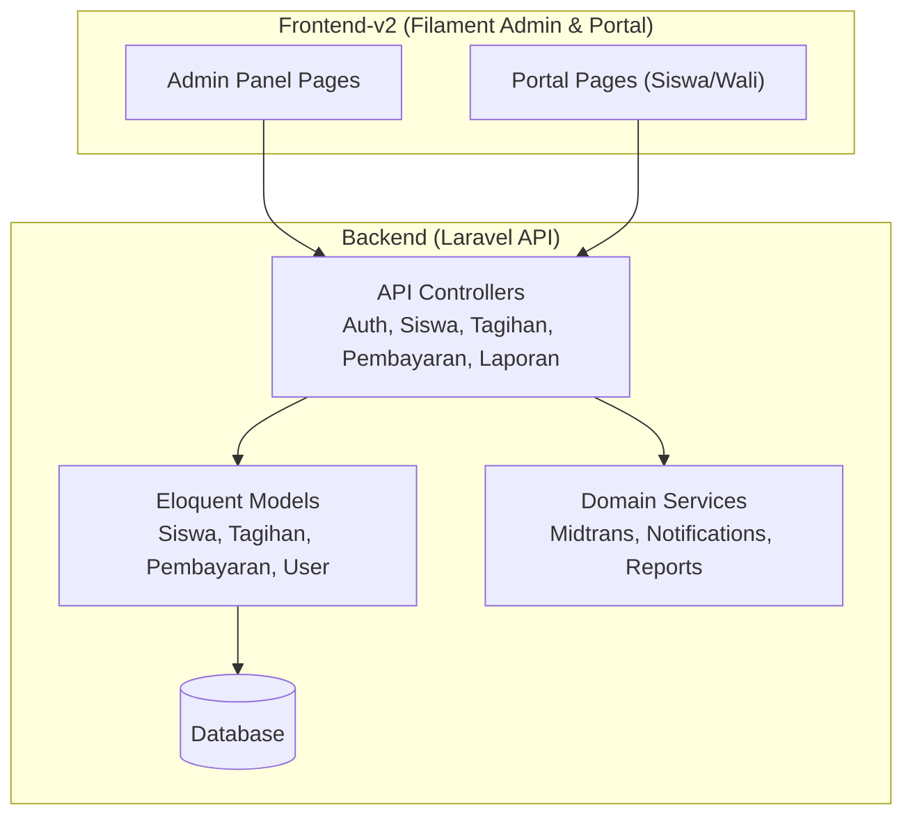
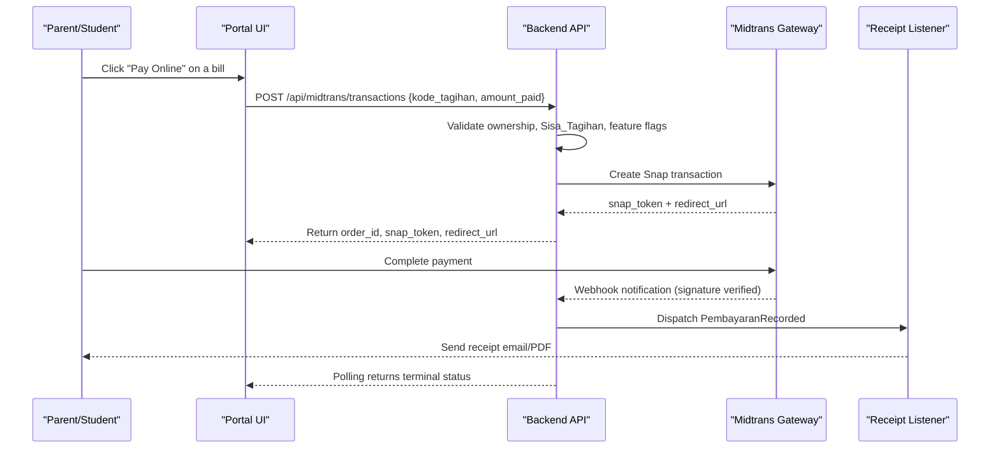
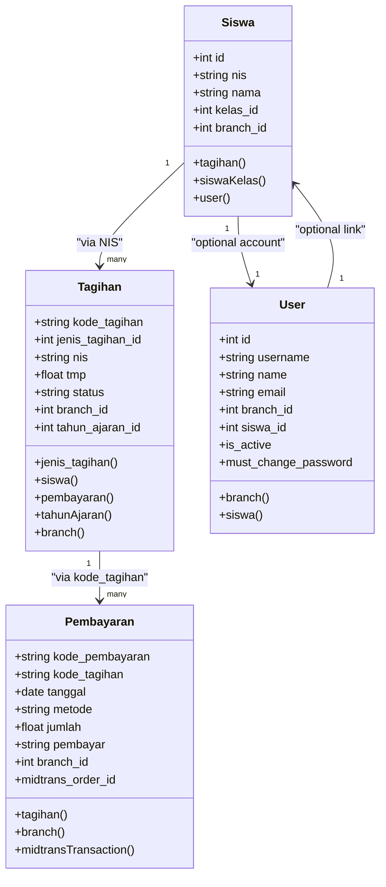
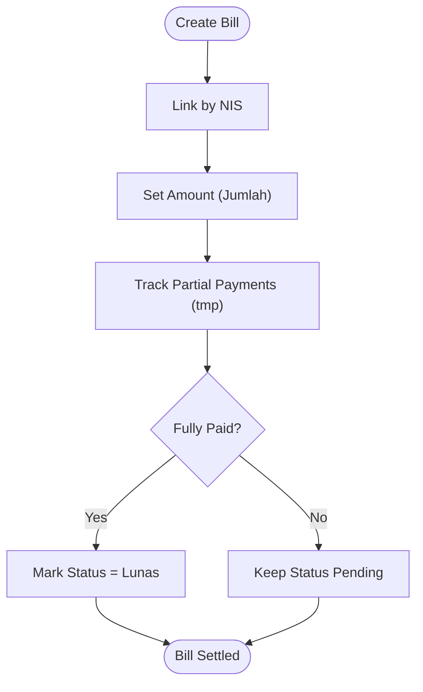
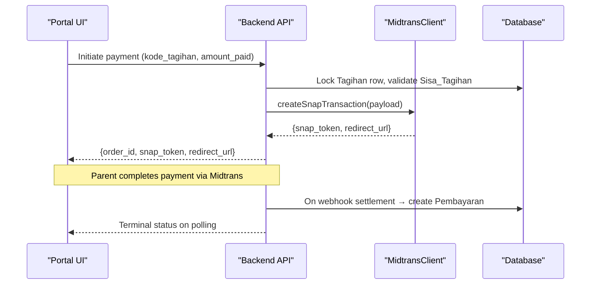
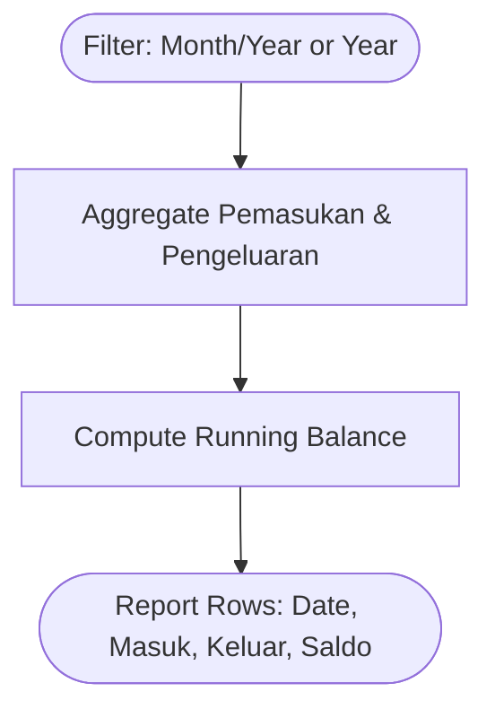
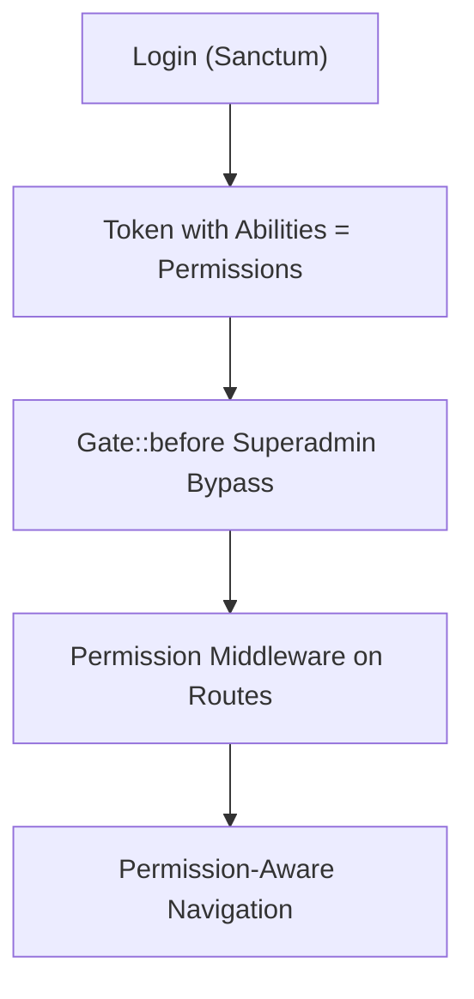
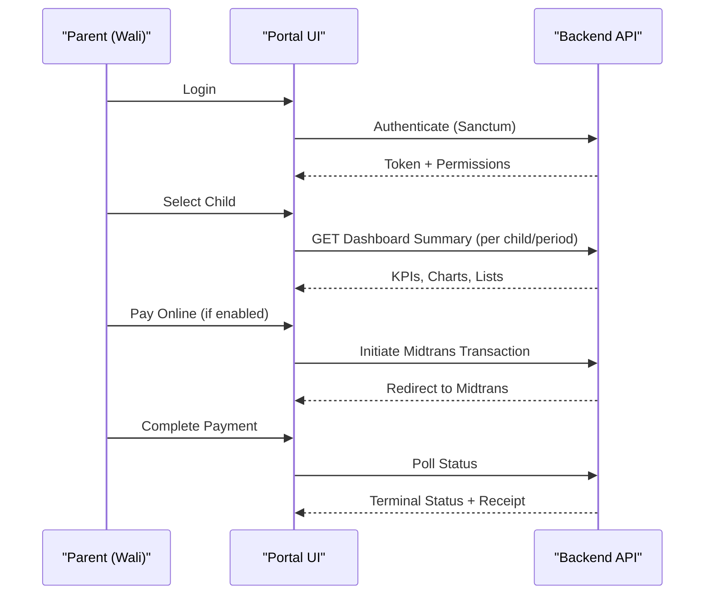
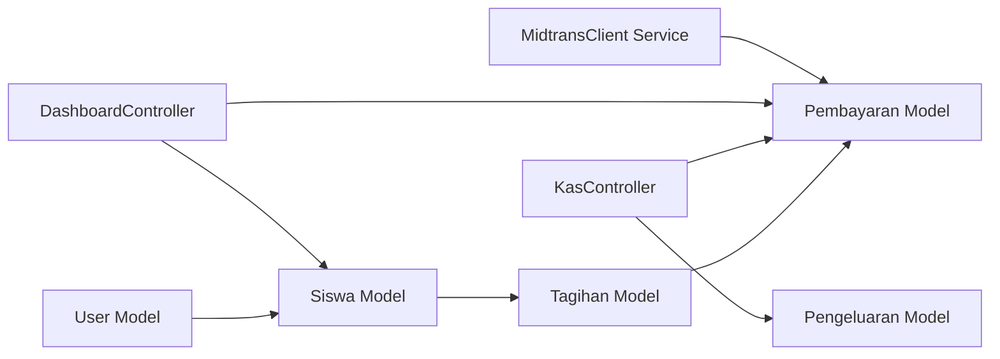

# Core Features Overview

<cite>
**Referenced Files in This Document**
- [AGENTS.md](file://AGENTS.md)
- [Siswa.php](file://backend/app/Models/Siswa.php)
- [Tagihan.php](file://backend/app/Models/Tagihan.php)
- [Pembayaran.php](file://backend/app/Models/Pembayaran.php)
- [User.php](file://backend/app/Models/User.php)
- [KasController.php](file://backend/app/Http/Controllers/KasController.php)
- [DashboardController.php](file://backend/app/Http/Controllers/DashboardController.php)
- [MidtransClient.php](file://backend/app/Services/Midtrans/MidtransClient.php)
- [RoleController.php](file://backend/app/Http/Controllers/RoleController.php)
- [PortalBerandaPage.php](file://frontend-v2/app/Filament/Portal/Pages/PortalBerandaPage.php)
- [beranda.blade.php](file://frontend-v2/resources/views/filament/portal/pages/beranda.blade.php)
</cite>

## Table of Contents
1. Introduction
2. Project Structure
3. Core Components
4. Architecture Overview
5. Detailed Component Analysis
6. Dependency Analysis
7. Performance Considerations
8. Troubleshooting Guide
9. Conclusion

## Introduction
This document provides a comprehensive overview of the Handayani School Management System’s core features, tailored for Indonesian educational institutions. It explains how student information management, automated billing, payment processing (including online payments via Midtrans), financial reporting, and administrative controls work together to deliver a complete school management solution. The content is designed for both technical and non-technical stakeholders, with clear user workflows for administrators, parents, and students.

## Project Structure
The system follows a monorepo layout:
- Backend: Laravel 12 API that owns the database schema, business logic, authentication, and integrations.
- Frontend-v2: Filament-based admin and portal UIs that call the backend API.
- Portal-reference: A standalone React reference site used as design inspiration only.

Key architectural notes:
- Authentication uses Sanctum tokens; permissions are enforced at the API level and reflected in the UI.
- Multi-branch scoping applies across most entities.
- Academic periods (Tahun Ajaran) scope financial and academic data.

**Diagram sources**
- [AGENTS.md:135-190](file://AGENTS.md#L135-L190)

**Section sources**
- [AGENTS.md:135-190](file://AGENTS.md#L135-L190)

## Core Components
- Student Information Management: Centralized student records linked to families and classes, with relationships to bills and payments.
- Automated Billing System: Bills (Tagihan) created per student and type, with status tracking and partial payments.
- Payment Processing: Offline and online channels; online payments integrate with Midtrans Snap, including webhook handling and idempotent state transitions.
- Financial Reporting: Daily cashbook and monthly recap endpoints with running balances and drill-down details.
- Administrative Controls: Role-based access control (RBAC), permission-driven navigation, and multi-branch isolation.

These components interact through well-defined APIs and services, ensuring consistent data flow and secure access.

**Section sources**
- [Siswa.php:70-86](file://backend/app/Models/Siswa.php#L70-L86)
- [Tagihan.php:36-57](file://backend/app/Models/Tagihan.php#L36-L57)
- [Pembayaran.php:38-51](file://backend/app/Models/Pembayaran.php#L38-L51)
- [KasController.php:20-127](file://backend/app/Http/Controllers/KasController.php#L20-L127)
- [DashboardController.php:20-68](file://backend/app/Http/Controllers/DashboardController.php#L20-L68)
- [MidtransClient.php:8-26](file://backend/app/Services/Midtrans/MidtransClient.php#L8-L26)
- [RoleController.php:199-235](file://backend/app/Http/Controllers/RoleController.php#L199-L235)

## Architecture Overview
High-level flows:
- Authentication and authorization: Users authenticate via Sanctum; permissions determine access to routes and UI elements.
- Data scoping: Branch_id scopes all financial and academic data; Tahun Ajaran scopes historical views.
- Online payments: Initiation creates a Midtrans transaction; webhooks update internal state and create Pembayaran records; existing listeners generate receipts.

**Diagram sources**
- [MidtransClient.php:8-26](file://backend/app/Services/Midtrans/MidtransClient.php#L8-L26)
- [AGENTS.md:177-183](file://AGENTS.md#L177-L183)

## Detailed Component Analysis

### Student Information Management
- Students are modeled by Siswa with relationships to parents/guardians, class, category, branch, and user accounts.
- Bills link to students via NIS, ensuring stable linkage even if internal IDs change.
- Student dashboards aggregate tagihan and pembayaran for personal or wali views.

**Diagram sources**
- [Siswa.php:50-86](file://backend/app/Models/Siswa.php#L50-L86)
- [Tagihan.php:36-57](file://backend/app/Models/Tagihan.php#L36-L57)
- [Pembayaran.php:38-51](file://backend/app/Models/Pembayaran.php#L38-L51)
- [User.php:44-52](file://backend/app/Models/User.php#L44-L52)

**Section sources**
- [Siswa.php:70-86](file://backend/app/Models/Siswa.php#L70-L86)
- [Tagihan.php:41-57](file://backend/app/Models/Tagihan.php#L41-L57)
- [Pembayaran.php:38-51](file://backend/app/Models/Pembayaran.php#L38-L51)
- [User.php:44-52](file://backend/app/Models/User.php#L44-L52)

### Automated Billing System
- Bills (Tagihan) are keyed by kode_tagihan and associated to students by NIS.
- Status and partial payment tracking (tmp) enable flexible settlement workflows.
- Grouped views support batch operations and accurate rekap calculations.

**Diagram sources**
- [Tagihan.php:17-34](file://backend/app/Models/Tagihan.php#L17-L34)
- [Siswa.php:70-73](file://backend/app/Models/Siswa.php#L70-L73)

**Section sources**
- [Tagihan.php:17-34](file://backend/app/Models/Tagihan.php#L17-L34)
- [Siswa.php:70-73](file://backend/app/Models/Siswa.php#L70-L73)

### Payment Processing (Online via Midtrans)
- Online payments use Midtrans Snap; initiation validates ownership and remaining balance.
- Webhooks are signature-verified and idempotent; successful settlements create Pembayaran records and trigger receipt generation.
- Feature flags allow controlled rollout and safe rollback.

**Diagram sources**
- [MidtransClient.php:8-26](file://backend/app/Services/Midtrans/MidtransClient.php#L8-L26)
- [AGENTS.md:177-183](file://AGENTS.md#L177-L183)

**Section sources**
- [MidtransClient.php:8-26](file://backend/app/Services/Midtrans/MidtransClient.php#L8-L26)
- [AGENTS.md:177-183](file://AGENTS.md#L177-L183)

### Financial Reporting
- Daily cashbook (Kas Harian) shows running balance per date with pemasukan and pengeluaran totals.
- Monthly recap (Rekap Bulanan) aggregates yearly income and expenses with cumulative balances.
- Detail endpoints provide drill-down into transactions for auditability.

**Diagram sources**
- [KasController.php:20-127](file://backend/app/Http/Controllers/KasController.php#L20-L127)
- [KasController.php:131-222](file://backend/app/Http/Controllers/KasController.php#L131-L222)

**Section sources**
- [KasController.php:20-127](file://backend/app/Http/Controllers/KasController.php#L20-L127)
- [KasController.php:131-222](file://backend/app/Http/Controllers/KasController.php#L131-L222)

### Administrative Controls (RBAC and Navigation)
- Permissions are defined centrally and enforced via middleware on API routes.
- Roles include superadmin, admin, user, and siswa; superadmin bypasses gates but still requires synced permissions.
- UI visibility is driven by session-stored permissions after login.

**Diagram sources**
- [RoleController.php:199-235](file://backend/app/Http/Controllers/RoleController.php#L199-L235)
- [AGENTS.md:157-163](file://AGENTS.md#L157-L163)

**Section sources**
- [RoleController.php:199-235](file://backend/app/Http/Controllers/RoleController.php#L199-L235)
- [AGENTS.md:157-163](file://AGENTS.md#L157-L163)

### User Workflows by Role

- Administrator
  - Manages users, roles, and permissions; monitors dashboard KPIs; reviews daily/monthly reports; oversees branches and branding.
  - Interacts with Admin Panel pages and report endpoints.

- Parent (Wali)
  - Logs into the portal, selects child(ren), views outstanding bills, pays online/offline, and downloads receipts.
  - Uses Portal Beranda and related tables/widgets.

- Student (Siswa)
  - Logs in with shared account, views personal tagihan and payment history, and pays online when enabled.

**Diagram sources**
- [PortalBerandaPage.php:42-52](file://frontend-v2/app/Filament/Portal/Pages/PortalBerandaPage.php#L42-L52)
- [beranda.blade.php:36-61](file://frontend-v2/resources/views/filament/portal/pages/beranda.blade.php#L36-L61)
- [DashboardController.php:206-301](file://backend/app/Http/Controllers/DashboardController.php#L206-L301)

**Section sources**
- [PortalBerandaPage.php:42-52](file://frontend-v2/app/Filament/Portal/Pages/PortalBerandaPage.php#L42-L52)
- [beranda.blade.php:36-61](file://frontend-v2/resources/views/filament/portal/pages/beranda.blade.php#L36-L61)
- [DashboardController.php:206-301](file://backend/app/Http/Controllers/DashboardController.php#L206-L301)

## Dependency Analysis
Core dependencies:
- Eloquent models define relationships between Siswa, Tagihan, Pembayaran, and User.
- Controllers orchestrate requests and delegate to services for complex operations (e.g., Midtrans).
- UI layers depend on API responses and session permissions to render appropriate actions.

**Diagram sources**
- [Siswa.php:70-86](file://backend/app/Models/Siswa.php#L70-L86)
- [Tagihan.php:36-57](file://backend/app/Models/Tagihan.php#L36-L57)
- [Pembayaran.php:38-51](file://backend/app/Models/Pembayaran.php#L38-L51)
- [KasController.php:20-127](file://backend/app/Http/Controllers/KasController.php#L20-L127)
- [DashboardController.php:20-68](file://backend/app/Http/Controllers/DashboardController.php#L20-L68)
- [MidtransClient.php:8-26](file://backend/app/Services/Midtrans/MidtransClient.php#L8-L26)

**Section sources**
- [Siswa.php:70-86](file://backend/app/Models/Siswa.php#L70-L86)
- [Tagihan.php:36-57](file://backend/app/Models/Tagihan.php#L36-L57)
- [Pembayaran.php:38-51](file://backend/app/Models/Pembayaran.php#L38-L51)
- [KasController.php:20-127](file://backend/app/Http/Controllers/KasController.php#L20-L127)
- [DashboardController.php:20-68](file://backend/app/Http/Controllers/DashboardController.php#L20-L68)
- [MidtransClient.php:8-26](file://backend/app/Services/Midtrans/MidtransClient.php#L8-L26)

## Performance Considerations
- Use query grouping and date-range filters to minimize overhead in reports.
- Prefer eager loading for nested relations in detail endpoints.
- Cache frequently accessed dashboard summaries where appropriate.
- Ensure proper indexing on foreign keys and filter columns (e.g., branch_id, tanggal, nis).

[No sources needed since this section provides general guidance]

## Troubleshooting Guide
- Authentication issues: Verify Sanctum token presence and expiration; ensure permissions are synced after changes.
- Permission errors: Confirm route middleware alignment with permission names; check superadmin bypass behavior.
- Payment discrepancies: Inspect Midtrans logs and verify signature validation; confirm gross_amount invariants and idempotency.
- Report mismatches: Validate date ranges and branch scoping; ensure running balance computations include prior-period transactions.

**Section sources**
- [AGENTS.md:157-163](file://AGENTS.md#L157-L163)
- [AGENTS.md:177-183](file://AGENTS.md#L177-L183)
- [KasController.php:20-127](file://backend/app/Http/Controllers/KasController.php#L20-L127)

## Conclusion
Handayani integrates student data, billing, payments, reporting, and administration into a cohesive platform optimized for Indonesian schools. Its RBAC model, multi-branch scoping, and robust payment integration ensure secure, scalable operations. Administrators gain oversight through dashboards and reports, while parents and students enjoy a streamlined portal experience for managing tuition and payments.

[No sources needed since this section summarizes without analyzing specific files]