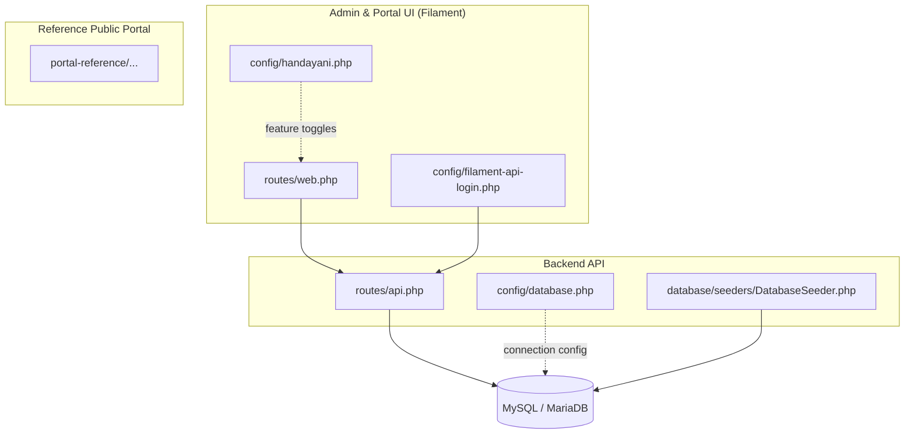
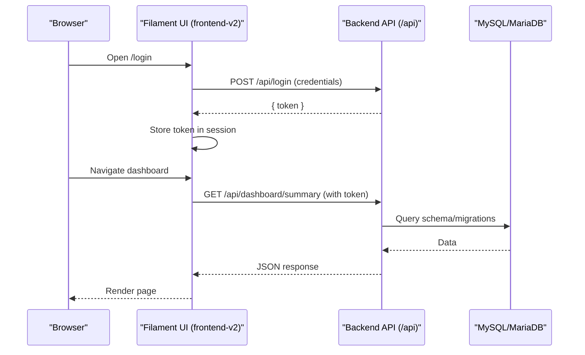
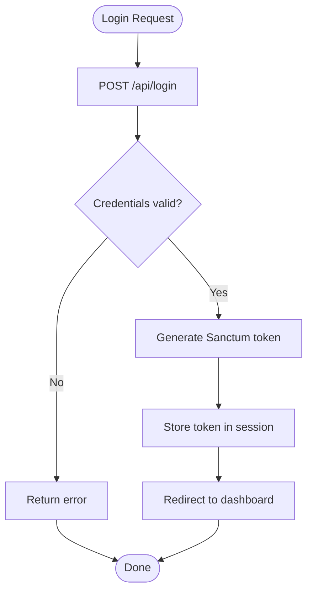
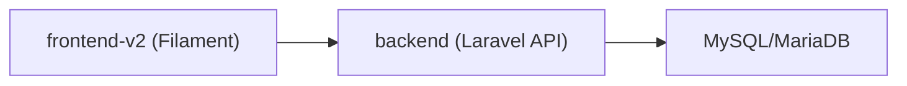

# Getting Started

<cite>
**Referenced Files in This Document**
- [AGENTS.md](file://AGENTS.md)
- [backend/composer.json](file://backend/composer.json)
- [backend/config/app.php](file://backend/config/app.php)
- [backend/config/database.php](file://backend/config/database.php)
- [backend/routes/api.php](file://backend/routes/api.php)
- [backend/database/seeders/DatabaseSeeder.php](file://backend/database/seeders/DatabaseSeeder.php)
- [frontend-v2/config/handayani.php](file://frontend-v2/config/handayani.php)
- [frontend-v2/config/filament-api-login.php](file://frontend-v2/config/filament-api-login.php)
- [frontend-v2/routes/web.php](file://frontend-v2/routes/web.php)
</cite>

## Table of Contents
1. Introduction
2. Project Structure
3. Core Components
4. Architecture Overview
5. Detailed Component Analysis
6. Dependency Analysis
7. Performance Considerations
8. Troubleshooting Guide
9. Conclusion

## Introduction
This guide helps you install and run the Handayani School Management System quickly. It covers environment requirements, database configuration, initial setup, and first-time tasks for both development and production. The system is a multi-application monorepo:
- Backend API (Laravel 12) under backend/
- Filament Admin Panel and Portal UI (Laravel + Filament) under frontend-v2/
- A reference public portal (React/TanStack) under portal-reference/ (read-only reference)

You will set up a shared MySQL/MariaDB database, initialize the backend API, then run the Filament admin panel that consumes the API.

## Project Structure
The repository contains three independent applications sharing one database owned by the backend.

**Diagram sources**
- [backend/routes/api.php:1-345](file://backend/routes/api.php#L1-L345)
- [backend/config/database.php:1-184](file://backend/config/database.php#L1-L184)
- [backend/database/seeders/DatabaseSeeder.php:1-450](file://backend/database/seeders/DatabaseSeeder.php#L1-L450)
- [frontend-v2/routes/web.php:1-23](file://frontend-v2/routes/web.php#L1-L23)
- [frontend-v2/config/handayani.php:1-53](file://frontend-v2/config/handayani.php#L1-L53)
- [frontend-v2/config/filament-api-login.php:1-41](file://frontend-v2/config/filament-api-login.php#L1-L41)

**Section sources**
- [AGENTS.md:1-209](file://AGENTS.md#L1-L209)

## Core Components
- Backend API
  - Laravel 12 application providing JSON endpoints under /api.
  - Sanctum-based authentication with role/permission middleware.
  - Database migrations and seeders create roles, branches, users, classes, academic years, students, bills, payments, and more.
- Filament Admin Panel and Portal
  - Filament-powered UI that authenticates against the backend API and stores tokens in session.
  - Feature toggles and portal behavior controlled via configuration.
- Shared Database
  - Single MySQL/MariaDB database used by both backend and frontend-v2.

Key environment and configuration points:
- PHP 8.2+ required by both backend and frontend-v2.
- Default app timezone is Asia/Jakarta; APP_URL should match your server URL.
- Database defaults to SQLite if not configured; configure MySQL/MariaDB for production.

**Section sources**
- [backend/composer.json:1-97](file://backend/composer.json#L1-L97)
- [backend/config/app.php:1-127](file://backend/config/app.php#L1-L127)
- [backend/config/database.php:1-184](file://backend/config/database.php#L1-L184)
- [frontend-v2/config/handayani.php:1-53](file://frontend-v2/config/handayani.php#L1-L53)

## Architecture Overview
High-level flow for login and data access:

**Diagram sources**
- [backend/routes/api.php:36-77](file://backend/routes/api.php#L36-L77)
- [frontend-v2/routes/web.php:10-22](file://frontend-v2/routes/web.php#L10-L22)

## Detailed Component Analysis

### Environment Requirements
- PHP 8.2+
- MySQL or MariaDB
- Node.js (for asset builds)
- Composer and npm/yarn/bun

Install steps are provided per application below.

**Section sources**
- [backend/composer.json:11-22](file://backend/composer.json#L11-L22)
- [frontend-v2/composer.json:8-17](file://frontend-v2/composer.json#L8-L17)
- [AGENTS.md:17-22](file://AGENTS.md#L17-L22)

### Database Configuration
- Create a single database (e.g., handayani).
- Configure backend/.env and frontend-v2/.env to point to the same database.
- Backend owns all migrations; run them from backend/.

Relevant settings include DB_CONNECTION, DB_HOST, DB_PORT, DB_DATABASE, DB_USERNAME, DB_PASSWORD, and charset/collation.

**Section sources**
- [backend/config/database.php:19-64](file://backend/config/database.php#L19-L64)
- [AGENTS.md:126-133](file://AGENTS.md#L126-L133)

### Initial Setup — Development
Run these steps inside each application directory as noted.

Backend API
1. Install dependencies: composer install && npm install
2. Copy environment file and generate key: copy .env.example .env && php artisan key:generate
3. Run migrations and seeders: php artisan migrate && php artisan db:seed
4. Start API on port 8080: php artisan serve --port=8080
5. Start queue worker: php artisan queue:listen --tries=1

Frontend-v2 (Filament Admin & Portal)
1. Install dependencies: composer install && npm install
2. Copy environment file and generate key: copy .env.example .env && php artisan key:generate
3. Build assets: npm run build
4. Start dev server: composer dev (or php artisan serve + npm run dev)
5. Ensure API_URL points to http://127.0.0.1:8080/api

Verification
- Visit http://127.0.0.1:8000 for the Filament admin panel.
- Login with default credentials seeded by the database seeder.

**Section sources**
- [AGENTS.md:27-98](file://AGENTS.md#L27-L98)
- [backend/database/seeders/DatabaseSeeder.php:44-50](file://backend/database/seeders/DatabaseSeeder.php#L44-L50)

### Initial Setup — Production
- Use a real MySQL/MariaDB instance and secure credentials in .env files.
- Set APP_ENV=production and APP_DEBUG=false.
- Set APP_URL to your domain.
- Build assets: npm run build in both backend and frontend-v2.
- Run migrations once from backend: php artisan migrate --force
- Seed only when needed: php artisan db:seed
- Start services:
  - Backend API on port 8080 behind a reverse proxy
  - Queue workers: php artisan queue:listen
  - Frontend-v2 on port 8000 behind a reverse proxy
- Ensure CORS/session cookie policies allow cross-origin if served from different domains.

**Section sources**
- [backend/config/app.php:28-55](file://backend/config/app.php#L28-L55)
- [AGENTS.md:126-133](file://AGENTS.md#L126-L133)

### Multi-Application Structure Notes
- backend: Headless API, owns database schema and business logic.
- frontend-v2: Filament UI that calls backend via ApiService and stores tokens in session.
- portal-reference: Read-only design reference; do not modify.

**Section sources**
- [AGENTS.md:5-14](file://AGENTS.md#L5-L14)

### First-Time User Tasks

Create an admin account
- After seeding, an admin user exists. If you need additional admins, use the user management routes or Filament pages after logging in.

Configure basic settings
- Update school profile and logo via the App Setting endpoints or Filament settings page.
- Toggle features like portal visibility and Midtrans integration via configuration.

Add sample student data
- The seeder creates branches, classes, academic years, notification settings, and sample students with associated parents/guardians and billing records.

Default admin credentials
- Username: admin123
- Password: admin123

**Section sources**
- [backend/database/seeders/DatabaseSeeder.php:31-76](file://backend/database/seeders/DatabaseSeeder.php#L31-L76)
- [backend/routes/api.php:207-214](file://backend/routes/api.php#L207-L214)
- [frontend-v2/config/handayani.php:14-29](file://frontend-v2/config/handayani.php#L14-L29)
- [AGENTS.md:126-133](file://AGENTS.md#L126-L133)

### Authentication Flow Details
- Login endpoint: POST /api/login
- Protected routes require auth:sanctum and permissions.
- Filament UI posts credentials to the API, stores the token in session, and includes it on subsequent requests.

**Diagram sources**
- [backend/routes/api.php:36-47](file://backend/routes/api.php#L36-L47)
- [frontend-v2/routes/web.php:10-22](file://frontend-v2/routes/web.php#L10-L22)

**Section sources**
- [backend/routes/api.php:36-77](file://backend/routes/api.php#L36-L77)
- [frontend-v2/routes/web.php:10-22](file://frontend-v2/routes/web.php#L10-L22)

## Dependency Analysis
- Backend requires PHP 8.2+, Laravel 12, Sanctum, Spatie Permission, Scramble, Excel, DOMPDF, Midtrans SDK.
- Frontend-v2 requires PHP 8.2+, Laravel 12, Filament 4, Livewire 3, Rappasoft Tables, WireUI icons.
- Both apps share a single database; backend owns migrations.

**Diagram sources**
- [backend/composer.json:11-22](file://backend/composer.json#L11-L22)
- [frontend-v2/composer.json:8-17](file://frontend-v2/composer.json#L8-L17)

**Section sources**
- [backend/composer.json:11-22](file://backend/composer.json#L11-L22)
- [frontend-v2/composer.json:8-17](file://frontend-v2/composer.json#L8-L17)
- [AGENTS.md:17-22](file://AGENTS.md#L17-L22)

## Performance Considerations
- Use a proper queue driver (database, Redis, etc.) and keep the queue worker running for exports, imports, notifications, and reminders.
- Enable caching and optimize autoloader in production.
- Prebuild assets and serve static files via your web server.
- Keep APP_DEBUG=false and tune log levels appropriately.

[No sources needed since this section provides general guidance]

## Troubleshooting Guide
Common issues and checks:
- Cannot connect to database
  - Verify DB_* variables in both backend/.env and frontend-v2/.env.
  - Confirm the database exists and credentials are correct.
- API returns 401/403
  - Ensure the backend is running on port 8080 and API_URL in frontend-v2/.env points to http://127.0.0.1:8080/api.
  - Check that permissions are synced after adding new permission cases.
- Assets not loading
  - Rebuild assets in both backend and frontend-v2: npm run build.
- Queue jobs not processing
  - Start the queue worker: php artisan queue:listen --tries=1.
- Midtrans not working
  - Enable feature flag and set client key in configuration.
  - Ensure webhook endpoint is reachable: POST /api/midtrans/notification.

Verification checklist:
- Backend API responds at http://127.0.0.1:8080/api
- Filament admin panel loads at http://127.0.0.1:8000
- Login succeeds with seeded admin credentials
- Dashboard summary endpoints return data
- Queue worker is running

**Section sources**
- [backend/config/database.php:19-64](file://backend/config/database.php#L19-L64)
- [backend/routes/api.php:321-344](file://backend/routes/api.php#L321-L344)
- [frontend-v2/config/handayani.php:39-51](file://frontend-v2/config/handayani.php#L39-L51)
- [AGENTS.md:126-133](file://AGENTS.md#L126-L133)

## Conclusion
You now have the essential steps to install, configure, and verify the Handayani School Management System. Use the quick start commands for development, apply production hardening, and leverage the built-in seeders to explore the system. For ongoing maintenance, keep permissions synced, rebuild assets after changes, and ensure the queue worker remains active.

[No sources needed since this section summarizes without analyzing specific files]