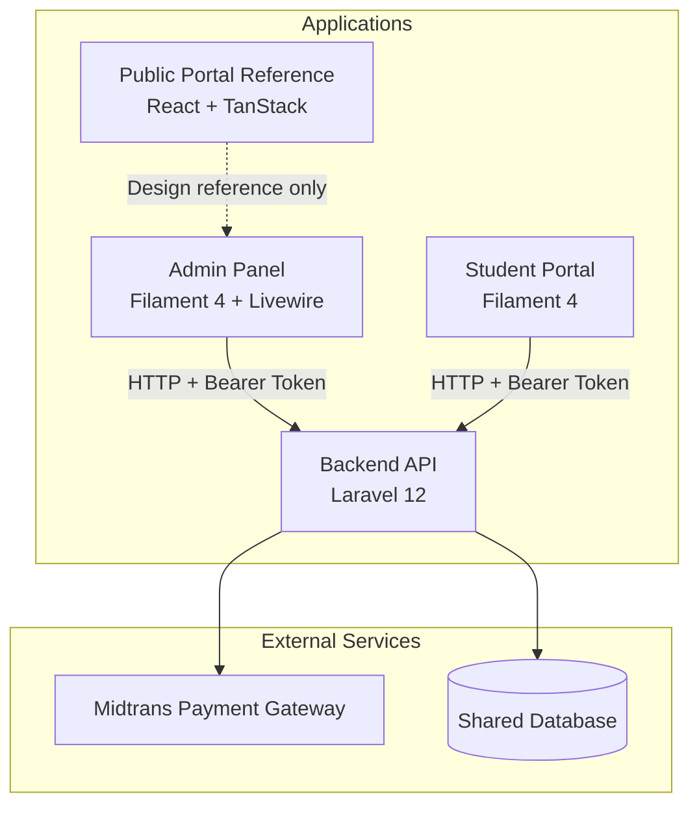
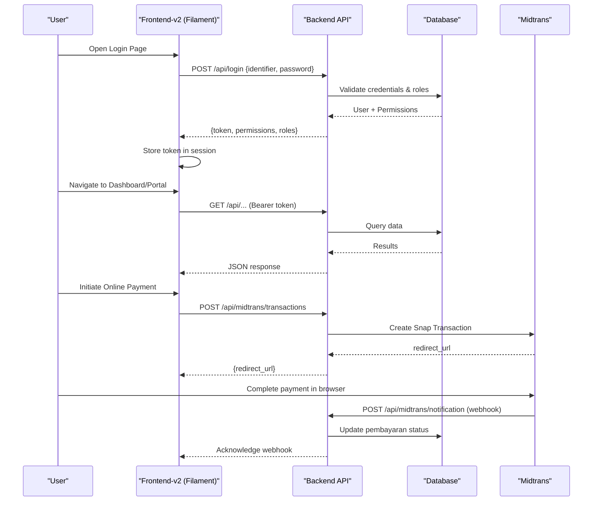
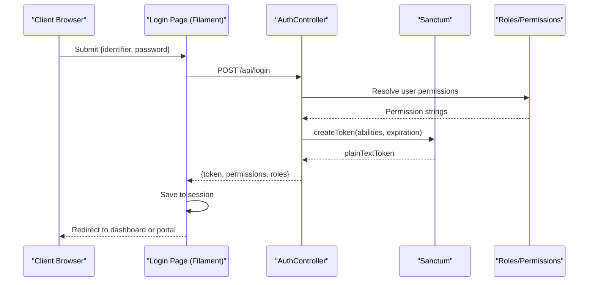
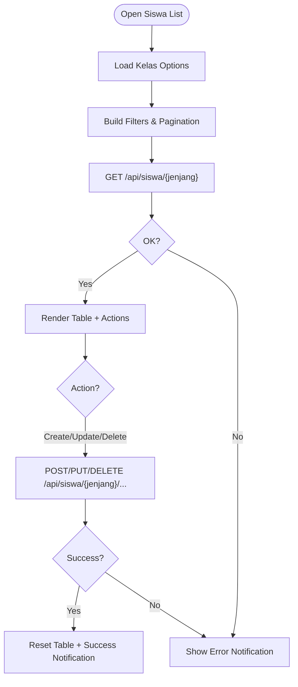
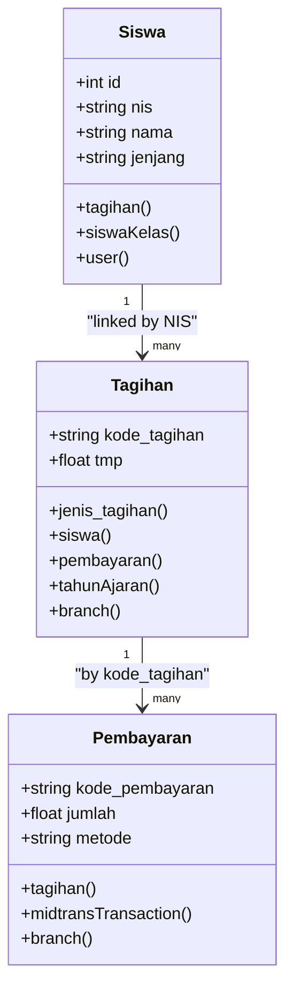
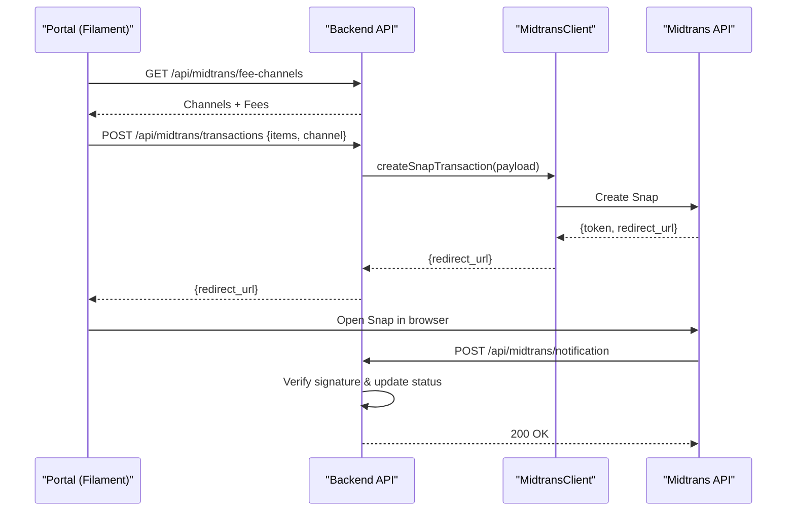
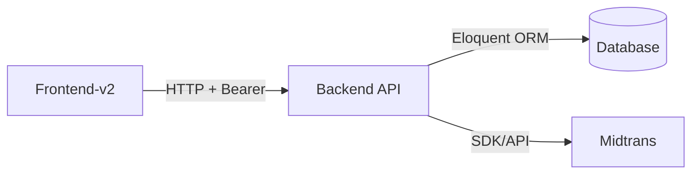

# Project Overview

<cite>
**Referenced Files in This Document**
- [AGENTS.md](file://AGENTS.md)
- [backend/composer.json](file://backend/composer.json)
- [frontend-v2/composer.json](file://frontend-v2/composer.json)
- [frontend/package.json](file://frontend/package.json)
- [backend/routes/api.php](file://backend/routes/api.php)
- [frontend-v2/routes/web.php](file://frontend-v2/routes/web.php)
- [backend/app/Http/Controllers/AuthController.php](file://backend/app/Http/Controllers/AuthController.php)
- [frontend-v2/app/Filament/Pages/Auth/Login.php](file://frontend-v2/app/Filament/Pages/Auth/Login.php)
- [frontend-v2/app/Services/ApiService.php](file://frontend-v2/app/Services/ApiService.php)
- [backend/app/Models/Siswa.php](file://backend/app/Models/Siswa.php)
- [backend/app/Models/Tagihan.php](file://backend/app/Models/Tagihan.php)
- [backend/app/Models/Pembayaran.php](file://backend/app/Models/Pembayaran.php)
- [backend/app/Services/Midtrans/MidtransClient.php](file://backend/app/Services/Midtrans/MidtransClient.php)
- [backend/config/midtrans.php](file://backend/config/midtrans.php)
- [frontend-v2/app/Livewire/DataSiswa.php](file://frontend-v2/app/Livewire/DataSiswa.php)
- [backend/app/Http/Controllers/SiswaController.php](file://backend/app/Http/Controllers/SiswaController.php)
</cite>

## Table of Contents
1. Introduction
2. Project Structure
3. Core Components
4. Architecture Overview
5. Detailed Component Analysis
6. Dependency Analysis
7. Performance Considerations
8. Troubleshooting Guide
9. Conclusion

## Introduction
Handayani School Management System is a complete school management solution designed for the Indonesian educational context. It provides end-to-end capabilities for student administration, class and academic year management, billing (tagihan), payments (pembayaran), financial reports, notifications, and online payment processing via Midtrans. The system follows a multi-application architecture:
- Backend API: Laravel 12.x headless API that owns the database schema, business logic, authentication, and integrations.
- Admin Panel: Filament 4.x admin portal built on Laravel 12 with Livewire components, consuming the backend API.
- Student Portal: A Filament-based portal experience for students and parents to view bills and pay online.
- Reference Public Portal: A React/TanStack reference site used as a design guide; not wired to the API.

This document explains both conceptual overviews for beginners and technical details for experienced developers, using terminology consistent with Indonesian schools (e.g., siswa, wali, tagihan, pembayaran, tahun ajaran).

## Project Structure
The repository is a monorepo with three independent applications sharing a single database owned by the backend:
- backend: Laravel 12 API with Sanctum, Spatie permissions, Scramble docs, Maatwebsite Excel, DOMPDF, and Midtrans SDK.
- frontend-v2: Laravel 12 + Filament 4 admin/portal UI. No migrations; calls backend through ApiService and stores the Sanctum token in session.
- portal-reference/handayani-joyful-portal: Standalone React + TanStack Start landing/profile reference built with Lovable. Not connected to the API.

**Diagram sources**
- [AGENTS.md:135-149](file://AGENTS.md#L135-L149)
- [backend/routes/api.php:1-30](file://backend/routes/api.php#L1-L30)
- [frontend-v2/app/Services/ApiService.php:1-25](file://frontend-v2/app/Services/ApiService.php#L1-L25)

**Section sources**
- [AGENTS.md:1-209](file://AGENTS.md#L1-L209)

## Core Components
- Authentication and Authorization
  - Backend login issues a Sanctum token with abilities equal to user permissions.
  - Frontend stores token in session and forwards it on every request via ApiService.
  - Roles include superadmin, admin, user, siswa; superadmin bypasses gates but still requires synced permissions.
- Academic Domain
  - Tahun Ajaran defines the active academic period. SiswaKelas records class history per period.
  - Jenjang options are KB, TK, MI.
- Financial Domain
  - Tagihan (bills) keyed by kode_tagihan and linked to students by NIS.
  - Pembayaran records payments against a tagihan.
  - Online payments use Midtrans Snap with configurable fees and channels.
- Notifications and Reports
  - Email notifications for kwitansi, new bills, reminders, and overdue notices.
  - Kas harian and rekap bulanan endpoints for daily cash and monthly recap reports.

Practical examples:
- Student management: Create/update/delete siswa across jenjangs, manage wali/ayah/ibu data, and sync current kelas based on active tahun ajaran.
- Billing and payments: Generate tagihan, record pembayaran, print kwitansi, initiate Midtrans transactions, and process webhooks.

**Section sources**
- [backend/app/Http/Controllers/AuthController.php:41-94](file://backend/app/Http/Controllers/AuthController.php#L41-L94)
- [frontend-v2/app/Filament/Pages/Auth/Login.php:56-136](file://frontend-v2/app/Filament/Pages/Auth/Login.php#L56-L136)
- [frontend-v2/app/Services/ApiService.php:16-23](file://frontend-v2/app/Services/ApiService.php#L16-L23)
- [backend/app/Models/Siswa.php:70-86](file://backend/app/Models/Siswa.php#L70-L86)
- [backend/app/Models/Tagihan.php:36-57](file://backend/app/Models/Tagihan.php#L36-L57)
- [backend/app/Models/Pembayaran.php:38-51](file://backend/app/Models/Pembayaran.php#L38-L51)
- [backend/config/midtrans.php:15-101](file://backend/config/midtrans.php#L15-L101)

## Architecture Overview
High-level responsibilities:
- Backend is the only app that talks to the database and exposes JSON APIs under /api.
- Frontend-v2 is stateless from a persistence perspective; it authenticates against the backend, stores the Sanctum token in session, and forwards it on requests.
- Public landing page lives in frontend-v2 as Blade + Tailwind v4 + Alpine.js, separate from Filament pages.

**Diagram sources**
- [backend/routes/api.php:36-34](file://backend/routes/api.php#L36-L34)
- [backend/routes/api.php:326-344](file://backend/routes/api.php#L326-L344)
- [backend/config/midtrans.php:125-126](file://backend/config/midtrans.php#L125-L126)
- [frontend-v2/app/Filament/Pages/Auth/Login.php:66-106](file://frontend-v2/app/Filament/Pages/Auth/Login.php#L66-L106)
- [frontend-v2/app/Services/ApiService.php:16-23](file://frontend-v2/app/Services/ApiService.php#L16-L23)

## Detailed Component Analysis

### Authentication Flow
- Backend AuthController validates identifier (email/NIS/username), checks account activity, revokes expired tokens, creates Sanctum token with abilities derived from permissions, and returns token metadata.
- Frontend-v2 Login page posts credentials to backend, stores token and permissions in session, logs into Filament auth for UI features, and redirects based on role.

**Diagram sources**
- [backend/app/Http/Controllers/AuthController.php:41-94](file://backend/app/Http/Controllers/AuthController.php#L41-L94)
- [frontend-v2/app/Filament/Pages/Auth/Login.php:56-136](file://frontend-v2/app/Filament/Pages/Auth/Login.php#L56-L136)

**Section sources**
- [backend/app/Http/Controllers/AuthController.php:1-103](file://backend/app/Http/Controllers/AuthController.php#L1-L103)
- [frontend-v2/app/Filament/Pages/Auth/Login.php:1-174](file://frontend-v2/app/Filament/Pages/Auth/Login.php#L1-L174)

### Student Management (Siswa)
- DataSiswa Livewire component fetches siswa lists, filters, and actions via ApiService to backend routes like /siswa/{jenjang}.
- SiswaController handles CRUD, supports jenjang-specific fields (wali for TK/KB; ayah/ibu for MI), and syncs SiswaKelas for the active tahun ajaran when kelas_id changes.

**Diagram sources**
- [frontend-v2/app/Livewire/DataSiswa.php:51-129](file://frontend-v2/app/Livewire/DataSiswa.php#L51-L129)
- [backend/app/Http/Controllers/SiswaController.php:42-81](file://backend/app/Http/Controllers/SiswaController.php#L42-L81)
- [backend/app/Http/Controllers/SiswaController.php:84-174](file://backend/app/Http/Controllers/SiswaController.php#L84-L174)
- [backend/app/Http/Controllers/SiswaController.php:297-319](file://backend/app/Http/Controllers/SiswaController.php#L297-L319)

**Section sources**
- [frontend-v2/app/Livewire/DataSiswa.php:1-800](file://frontend-v2/app/Livewire/DataSiswa.php#L1-L800)
- [backend/app/Http/Controllers/SiswaController.php:1-321](file://backend/app/Http/Controllers/SiswaController.php#L1-L321)
- [backend/app/Models/Siswa.php:1-117](file://backend/app/Models/Siswa.php#L1-L117)

### Billing and Payments (Tagihan and Pembayaran)
- Tagihan models link to siswa via NIS and to jenis_tagihan and tahun_ajaran. Pembayaran links to tagihan and optionally to Midtrans transaction order_id.
- API exposes grouped views, export PDF, and payment operations including batch mark-as-paid and individual payment.

**Diagram sources**
- [backend/app/Models/Siswa.php:70-86](file://backend/app/Models/Siswa.php#L70-L86)
- [backend/app/Models/Tagihan.php:36-57](file://backend/app/Models/Tagihan.php#L36-L57)
- [backend/app/Models/Pembayaran.php:38-51](file://backend/app/Models/Pembayaran.php#L38-L51)

**Section sources**
- [backend/app/Models/Tagihan.php:1-60](file://backend/app/Models/Tagihan.php#L1-L60)
- [backend/app/Models/Pembayaran.php:1-53](file://backend/app/Models/Pembayaran.php#L1-L53)
- [backend/routes/api.php:156-176](file://backend/routes/api.php#L156-L176)

### Online Payment Processing (Midtrans Integration)
- Configuration includes toggles for enabling Midtrans and webhook, environment, keys, fee structure per channel, minimum amount, expiry hours, finish URL, and log retention.
- Client interface abstracts creating Snap transactions and fetching status.

**Diagram sources**
- [backend/config/midtrans.php:15-101](file://backend/config/midtrans.php#L15-L101)
- [backend/config/midtrans.php:125-126](file://backend/config/midtrans.php#L125-L126)
- [backend/app/Services/Midtrans/MidtransClient.php:8-26](file://backend/app/Services/Midtrans/MidtransClient.php#L8-L26)
- [backend/routes/api.php:326-344](file://backend/routes/api.php#L326-L344)

**Section sources**
- [backend/config/midtrans.php:1-130](file://backend/config/midtrans.php#L1-L130)
- [backend/app/Services/Midtrans/MidtransClient.php:1-27](file://backend/app/Services/Midtrans/MidtransClient.php#L1-L27)
- [backend/routes/api.php:321-344](file://backend/routes/api.php#L321-L344)

### Technology Stack
- Backend: PHP 8.2+, Laravel 12, Sanctum, Spatie laravel-permission, Scramble API docs, Maatwebsite Excel, DOMPDF, Midtrans PHP SDK.
- Frontend-v2: PHP 8.2+, Laravel 12, Filament 4, Livewire 3, rappasoft/laravel-livewire-tables, Tailwind CSS 4, Vite.
- Portal-reference: React 19, TypeScript, TanStack Router/Start, Vite, Tailwind CSS 4, Radix UI, shadcn-style components.
- Legacy frontend (reference): React 18, React Router, Vite, Tailwind CSS 3.

**Section sources**
- [AGENTS.md:17-21](file://AGENTS.md#L17-L21)
- [backend/composer.json:11-22](file://backend/composer.json#L11-L22)
- [frontend-v2/composer.json:8-17](file://frontend-v2/composer.json#L8-L17)
- [frontend/package.json:12-18](file://frontend/package.json#L12-L18)

## Dependency Analysis
- Backend depends on Laravel framework, Sanctum for token-based auth, Spatie permission for RBAC, Scramble for API docs, Maatwebsite Excel for imports/exports, DOMPDF for PDF generation, and Midtrans SDK for payments.
- Frontend-v2 depends on Filament 4, Livewire tables, modal package, and phosphoricons.
- Communication between apps is HTTP-based with Bearer tokens stored in session; no shared code beyond configuration and conventions.

**Diagram sources**
- [backend/composer.json:11-22](file://backend/composer.json#L11-L22)
- [frontend-v2/composer.json:8-17](file://frontend-v2/composer.json#L8-L17)
- [frontend-v2/app/Services/ApiService.php:16-23](file://frontend-v2/app/Services/ApiService.php#L16-L23)

**Section sources**
- [backend/composer.json:1-97](file://backend/composer.json#L1-L97)
- [frontend-v2/composer.json:1-94](file://frontend-v2/composer.json#L1-L94)

## Performance Considerations
- Use pagination and filtering on siswa/tagihan/pembayaran endpoints to reduce payload sizes.
- Queue long-running tasks (imports/exports, email notifications) to avoid blocking requests.
- Cache frequently accessed settings and branding data where appropriate.
- Tune Midtrans fee calculations and channel selection to minimize unnecessary API calls.

[No sources needed since this section provides general guidance]

## Troubleshooting Guide
- Authentication failures: Check backend login endpoint responses and ensure API_URL and port are correct in frontend-v2.
- Permission mismatches: After adding or renaming permissions, run the permissions sync command in backend.
- Midtrans issues: Verify enabled flags, server/client keys, merchant ID, and webhook URL; check logs and retention settings.
- Connection errors: Ensure queue worker is running for background jobs and that the backend is reachable from frontend-v2.

**Section sources**
- [AGENTS.md:197-209](file://AGENTS.md#L197-L209)
- [backend/config/midtrans.php:15-101](file://backend/config/midtrans.php#L15-L101)

## Conclusion
Handayani School Management System delivers a robust, modular platform tailored for Indonesian schools. Its clear separation of concerns—headless API, Filament admin/portal, and a public portal reference—enables scalable development and deployment. With strong RBAC, comprehensive academic and financial domains, and integrated online payments, it supports day-to-day school operations while providing extensibility for future enhancements.

[No sources needed since this section summarizes without analyzing specific files]