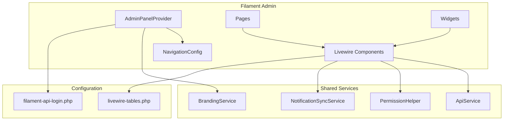
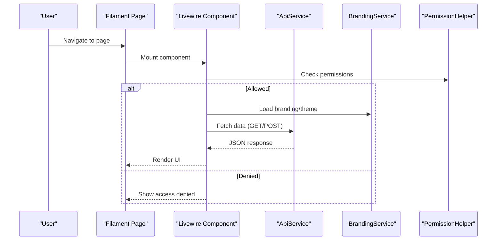
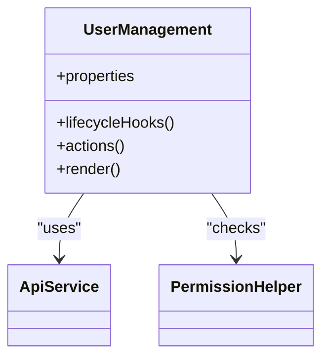
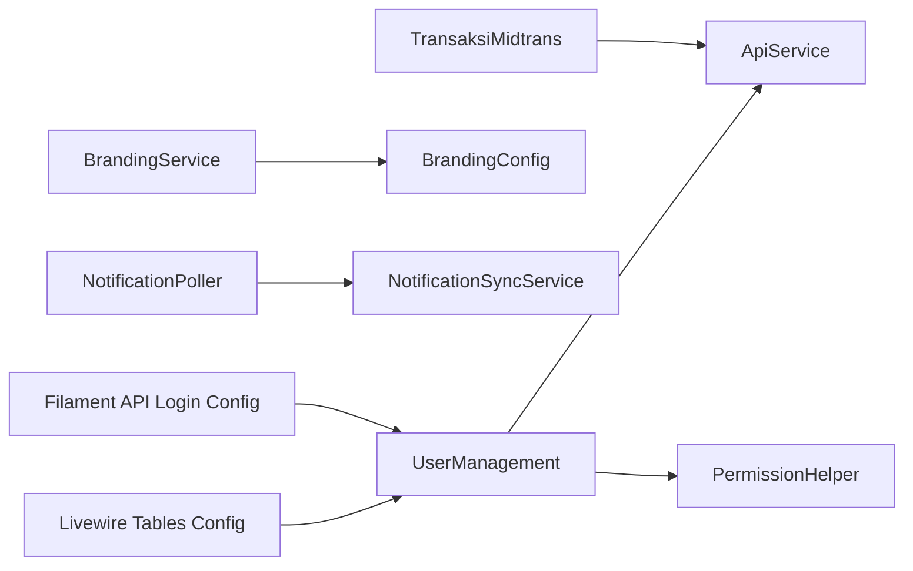

# Admin Panel Components

<cite>
**Referenced Files in This Document**
- [composer.json](file://frontend-v2/composer.json)
- [NavigationConfig.php](file://frontend-v2/app/Config/NavigationConfig.php)
- [PermissionHelper.php](file://frontend-v2/app/Helpers/PermissionHelper.php)
- [ApiService.php](file://frontend-v2/app/Services/ApiService.php)
- [BrandingConfig.php](file://frontend-v2/app/Services/BrandingConfig.php)
- [BrandingService.php](file://frontend-v2/app/Services/BrandingService.php)
- [NotificationSyncService.php](file://frontend-v2/app/Services/NotificationSyncService.php)
- [UserManagement.php](file://frontend-v2/app/Livewire/UserManagement.php)
- [BranchManagement.php](file://frontend-v2/app/Livewire/BranchManagement.php)
- [DataSiswa.php](file://frontend-v2/app/Livewire/DataSiswa.php)
- [DataKelas.php](file://frontend-v2/app/Livewire/DataKelas.php)
- [DataWali.php](file://frontend-v2/app/Livewire/DataWali.php)
- [DetailSiswa.php](file://frontend-v2/app/Livewire/DetailSiswa.php)
- [DetailWali.php](file://frontend-v2/app/Livewire/DetailWali.php)
- [JenisTagihan.php](file://frontend-v2/app/Livewire/JenisTagihan.php)
- [KasHarian.php](file://frontend-v2/app/Livewire/KasHarian.php)
- [KenaikanKelas.php](file://frontend-v2/app/Livewire/KenaikanKelas.php)
- [KenaikanKelasBatchDetailTable.php](file://frontend-v2/app/Livewire/KenaikanKelasBatchDetailTable.php)
- [LaporanDetailPemasukan.php](file://frontend-v2/app/Livewire/LaporanDetailPemasukan.php)
- [LaporanDetailPengeluaran.php](file://frontend-v2/app/Livewire/LaporanDetailPengeluaran.php)
- [NotificationPoller.php](file://frontend-v2/app/Livewire/NotificationPoller.php)
- [PembayaranCardView.php](file://frontend-v2/app/Livewire/PembayaranCardView.php)
- [PengeluaranRequest.php](file://frontend-v2/app/Livewire/PengeluaranRequest.php)
- [PortalSiswaPembayaranTable.php](file://frontend-v2/app/Livewire/PortalSiswaPembayaranTable.php)
- [PortalSiswaTagihanTable.php](file://frontend-v2/app/Livewire/PortalSiswaTagihanTable.php)
- [RekapBulanan.php](file://frontend-v2/app/Livewire/RekapBulanan.php)
- [RoleManagement.php](file://frontend-v2/app/Livewire/RoleManagement.php)
- [Setting.php](file://frontend-v2/app/Livewire/Setting.php)
- [SiswaDashboard.php](file://frontend-v2/app/Livewire/SiswaDashboard.php)
- [TagihanCardView.php](file://frontend-v2/app/Livewire/TagihanCardView.php)
- [TagihanSiswa.php](file://frontend-v2/app/Livewire/TagihanSiswa.php)
- [TahunAjaranManagement.php](file://frontend-v2/app/Livewire/TahunAjaranManagement.php)
- [TransaksiMidtrans.php](file://frontend-v2/app/Livewire/TransaksiMidtrans.php)
- [TransaksiMidtransDetail.php](file://frontend-v2/app/Livewire/TransaksiMidtransDetail.php)
- [AkunSiswaCredentialsTable.php](file://frontend-v2/app/Livewire/AkunSiswaCredentialsTable.php)
- [AppServiceProvider.php](file://frontend-v2/app/Providers/AppServiceProvider.php)
- [filament-api-login.php](file://frontend-v2/config/filament-api-login.php)
- [livewire-tables.php](file://frontend-v2/config/livewire-tables.php)
- [dashboard.blade.php](file://frontend-v2/resources/views/filament/pages/dashboard.blade.php)
</cite>

## Table of Contents
1. [Introduction](#introduction)
2. [Project Structure](#project-structure)
3. [Core Components](#core-components)
4. [Architecture Overview](#architecture-overview)
5. [Detailed Component Analysis](#detailed-component-analysis)
6. [Dependency Analysis](#dependency-analysis)
7. [Performance Considerations](#performance-considerations)
8. [Troubleshooting Guide](#troubleshooting-guide)
9. [Conclusion](#conclusion)
10. [Appendices](#appendices)

## Introduction
This document explains the Filament admin panel components implemented in the frontend-v2 application. It covers the Livewire component architecture, page structure, widget system, dashboard components, data tables, form builders, and custom pages. It also documents branding service usage, theme customization, responsive design considerations, relationships between Livewire components, Filament resources, and external APIs, as well as real-time updates, loading states, error handling patterns, permission-based UI rendering, and role-specific features.

## Project Structure
The admin panel is built with Laravel + Filament v4 and uses Livewire for interactive components. The key directories are:
- app/Filament: Filament panels, pages, widgets, and concerns
- app/Livewire: Livewire components used by pages and widgets
- app/Services: Shared services (API, branding, notifications)
- config: Configuration for Filament plugins and Livewire tables
- resources/views/filament: Blade views for pages and layouts

**Diagram sources**
- [NavigationConfig.php](file://frontend-v2/app/Config/NavigationConfig.php)
- [UserManagement.php](file://frontend-v2/app/Livewire/UserManagement.php)
- [ApiService.php](file://frontend-v2/app/Services/ApiService.php)
- [BrandingService.php](file://frontend-v2/app/Services/BrandingService.php)
- [PermissionHelper.php](file://frontend-v2/app/Helpers/PermissionHelper.php)
- [NotificationSyncService.php](file://frontend-v2/app/Services/NotificationSyncService.php)
- [filament-api-login.php](file://frontend-v2/config/filament-api-login.php)
- [livewire-tables.php](file://frontend-v2/config/livewire-tables.php)

**Section sources**
- [composer.json:1-94](file://frontend-v2/composer.json#L1-L94)
- [NavigationConfig.php](file://frontend-v2/app/Config/NavigationConfig.php)
- [livewire-tables.php](file://frontend-v2/config/livewire-tables.php)
- [filament-api-login.php](file://frontend-v2/config/filament-api-login.php)

## Core Components
This section outlines the primary building blocks of the admin panel.

- Livewire Components
  - Data management and UI state reside in Livewire classes under app/Livewire. Examples include user management, branch management, student data, class data, parent data, detail views, tagihan and payment card views, reports, and Midtrans transaction flows.
  - Common responsibilities:
    - State properties for filters, pagination, and selected records
    - Lifecycle hooks to load data and handle mutations
    - Actions to perform create/update/delete operations
    - Integration with ApiService for HTTP calls
    - Permission checks via PermissionHelper
    - Real-time polling or event-driven updates where applicable

- Pages and Widgets
  - Filament pages compose one or more Livewire components to render dashboards, lists, forms, and details.
  - Widgets provide reusable dashboard cards and charts, often driven by Livewire components.

- Branding Service
  - Centralized configuration and runtime access to brand assets, colors, and labels.
  - Used by panels and pages to apply consistent theming.

- API Integration
  - ApiService encapsulates HTTP requests, headers, retries, and error mapping.
  - Some components integrate with external payment APIs through dedicated services.

- Permissions and Roles
  - PermissionHelper provides helpers to check roles and permissions for conditional UI rendering and action gating.

**Section sources**
- [UserManagement.php](file://frontend-v2/app/Livewire/UserManagement.php)
- [BranchManagement.php](file://frontend-v2/app/Livewire/BranchManagement.php)
- [DataSiswa.php](file://frontend-v2/app/Livewire/DataSiswa.php)
- [DataKelas.php](file://frontend-v2/app/Livewire/DataKelas.php)
- [DataWali.php](file://frontend-v2/app/Livewire/DataWali.php)
- [DetailSiswa.php](file://frontend-v2/app/Livewire/DetailSiswa.php)
- [DetailWali.php](file://frontend-v2/app/Livewire/DetailWali.php)
- [JenisTagihan.php](file://frontend-v2/app/Livewire/JenisTagihan.php)
- [KasHarian.php](file://frontend-v2/app/Livewire/KasHarian.php)
- [KenaikanKelas.php](file://frontend-v2/app/Livewire/KenaikanKelas.php)
- [KenaikanKelasBatchDetailTable.php](file://frontend-v2/app/Livewire/KenaikanKelasBatchDetailTable.php)
- [LaporanDetailPemasukan.php](file://frontend-v2/app/Livewire/LaporanDetailPemasukan.php)
- [LaporanDetailPengeluaran.php](file://frontend-v2/app/Livewire/LaporanDetailPengeluaran.php)
- [NotificationPoller.php](file://frontend-v2/app/Livewire/NotificationPoller.php)
- [PembayaranCardView.php](file://frontend-v2/app/Livewire/PembayaranCardView.php)
- [PengeluaranRequest.php](file://frontend-v2/app/Livewire/PengeluaranRequest.php)
- [PortalSiswaPembayaranTable.php](file://frontend-v2/app/Livewire/PortalSiswaPembayaranTable.php)
- [PortalSiswaTagihanTable.php](file://frontend-v2/app/Livewire/PortalSiswaTagihanTable.php)
- [RekapBulanan.php](file://frontend-v2/app/Livewire/RekapBulanan.php)
- [RoleManagement.php](file://frontend-v2/app/Livewire/RoleManagement.php)
- [Setting.php](file://frontend-v2/app/Livewire/Setting.php)
- [SiswaDashboard.php](file://frontend-v2/app/Livewire/SiswaDashboard.php)
- [TagihanCardView.php](file://frontend-v2/app/Livewire/TagihanCardView.php)
- [TagihanSiswa.php](file://frontend-v2/app/Livewire/TagihanSiswa.php)
- [TahunAjaranManagement.php](file://frontend-v2/app/Livewire/TahunAjaranManagement.php)
- [TransaksiMidtrans.php](file://frontend-v2/app/Livewire/TransaksiMidtrans.php)
- [TransaksiMidtransDetail.php](file://frontend-v2/app/Livewire/TransaksiMidtransDetail.php)
- [AkunSiswaCredentialsTable.php](file://frontend-v2/app/Livewire/AkunSiswaCredentialsTable.php)
- [ApiService.php](file://frontend-v2/app/Services/ApiService.php)
- [BrandingService.php](file://frontend-v2/app/Services/BrandingService.php)
- [PermissionHelper.php](file://frontend-v2/app/Helpers/PermissionHelper.php)
- [NotificationSyncService.php](file://frontend-v2/app/Services/NotificationSyncService.php)

## Architecture Overview
The admin panel follows a layered approach:
- Presentation: Filament pages and widgets render Blade views and embed Livewire components.
- Interaction: Livewire components manage state and actions, calling shared services.
- Services: ApiService handles REST calls; BrandingService supplies theme data; NotificationSyncService coordinates background sync.
- Configuration: filament-api-login and livewire-tables configure authentication and table behavior.

**Diagram sources**
- [UserManagement.php](file://frontend-v2/app/Livewire/UserManagement.php)
- [ApiService.php](file://frontend-v2/app/Services/ApiService.php)
- [BrandingService.php](file://frontend-v2/app/Services/BrandingService.php)
- [PermissionHelper.php](file://frontend-v2/app/Helpers/PermissionHelper.php)

## Detailed Component Analysis

### User Management Component
- Purpose: Manage users within the admin panel, including listing, creating, editing, and deleting users.
- Key responsibilities:
  - Stateful properties for search, filters, and pagination
  - Actions to persist changes and refresh state
  - Permission checks before exposing destructive actions
  - Optional integration with external APIs via ApiService

**Diagram sources**
- [UserManagement.php](file://frontend-v2/app/Livewire/UserManagement.php)
- [ApiService.php](file://frontend-v2/app/Services/ApiService.php)
- [PermissionHelper.php](file://frontend-v2/app/Helpers/PermissionHelper.php)

**Section sources**
- [UserManagement.php](file://frontend-v2/app/Livewire/UserManagement.php)

### Branch Management Component
- Purpose: Configure and maintain branch entities.
- Highlights:
  - CRUD operations with validation
  - Conditional UI based on permissions
  - Reusable table columns and filters

**Section sources**
- [BranchManagement.php](file://frontend-v2/app/Livewire/BranchManagement.php)

### Student Data Component
- Purpose: List and manage student records.
- Highlights:
  - Advanced filtering and sorting
  - Bulk actions and export capabilities
  - Integration with ApiService for remote data

**Section sources**
- [DataSiswa.php](file://frontend-v2/app/Livewire/DataSiswa.php)

### Class Data Component
- Purpose: Manage class configurations and assignments.
- Highlights:
  - Hierarchical data display
  - Relationship-aware filters

**Section sources**
- [DataKelas.php](file://frontend-v2/app/Livewire/DataKelas.php)

### Parent Data Component
- Purpose: Manage parent/guardian records linked to students.
- Highlights:
  - Search by child or parent attributes
  - Editable fields with validation

**Section sources**
- [DataWali.php](file://frontend-v2/app/Livewire/DataWali.php)

### Detail Views (Student and Parent)
- Purpose: Provide detailed read-only or editable views for individual records.
- Highlights:
  - Route-bound identifiers
  - Permission-gated edit modes
  - Related data aggregation

**Section sources**
- [DetailSiswa.php](file://frontend-v2/app/Livewire/DetailSiswa.php)
- [DetailWali.php](file://frontend-v2/app/Livewire/DetailWali.php)

### Tagihan and Payment Card Views
- Purpose: Display tagihan and payment information in card layouts.
- Highlights:
  - Responsive grid layout
  - Status indicators and quick actions
  - Real-time status updates via polling or events

**Section sources**
- [TagihanCardView.php](file://frontend-v2/app/Livewire/TagihanCardView.php)
- [PembayaranCardView.php](file://frontend-v2/app/Livewire/PembayaranCardView.php)

### Reports and Summaries
- Purpose: Generate daily cash flow and monthly summaries.
- Highlights:
  - Aggregated queries and exports
  - Date range filters and drill-downs

**Section sources**
- [KasHarian.php](file://frontend-v2/app/Livewire/KasHarian.php)
- [RekapBulanan.php](file://frontend-v2/app/Livewire/RekapBulanan.php)
- [LaporanDetailPemasukan.php](file://frontend-v2/app/Livewire/LaporanDetailPemasukan.php)
- [LaporanDetailPengeluaran.php](file://frontend-v2/app/Livewire/LaporanDetailPengeluaran.php)

### Promotion and Academic Year Management
- Purpose: Handle student promotions and academic year settings.
- Highlights:
  - Batch processing support
  - Validation rules and rollback strategies

**Section sources**
- [KenaikanKelas.php](file://frontend-v2/app/Livewire/KenaikanKelas.php)
- [KenaikanKelasBatchDetailTable.php](file://frontend-v2/app/Livewire/KenaikanKelasBatchDetailTable.php)
- [TahunAjaranManagement.php](file://frontend-v2/app/Livewire/TahunAjaranManagement.php)

### Role and Permission Management
- Purpose: Manage roles and assign permissions to users.
- Highlights:
  - Tree-like permission selection
  - Sync commands and caching

**Section sources**
- [RoleManagement.php](file://frontend-v2/app/Livewire/RoleManagement.php)

### Settings and Configuration
- Purpose: Application-wide settings and branding configuration.
- Highlights:
  - Form builder integration
  - Live preview of branding changes

**Section sources**
- [Setting.php](file://frontend-v2/app/Livewire/Setting.php)

### Dashboard Components
- Purpose: Provide overview metrics and quick links.
- Highlights:
  - Widget composition
  - Data fetching and caching

**Section sources**
- [SiswaDashboard.php](file://frontend-v2/app/Livewire/SiswaDashboard.php)
- [dashboard.blade.php](file://frontend-v2/resources/views/filament/pages/dashboard.blade.php)

### Portal Tables (Student Portal)
- Purpose: Student-facing tables for payments and charges.
- Highlights:
  - Role-restricted access
  - Simplified interactions

**Section sources**
- [PortalSiswaPembayaranTable.php](file://frontend-v2/app/Livewire/PortalSiswaPembayaranTable.php)
- [PortalSiswaTagihanTable.php](file://frontend-v2/app/Livewire/PortalSiswaTagihanTable.php)

### Midtrans Transaction Flows
- Purpose: Initiate and track online payments via Midtrans.
- Highlights:
  - Transaction initiation and status polling
  - Error handling and retry logic

**Section sources**
- [TransaksiMidtrans.php](file://frontend-v2/app/Livewire/TransaksiMidtrans.php)
- [TransaksiMidtransDetail.php](file://frontend-v2/app/Livewire/TransaksiMidtransDetail.php)

### Expense Request Management
- Purpose: Create and approve expense requests.
- Highlights:
  - Workflow steps and approvals
  - Audit logs and notifications

**Section sources**
- [PengeluaranRequest.php](file://frontend-v2/app/Livewire/PengeluaranRequest.php)

### Notification Poller
- Purpose: Periodically fetch and display notifications.
- Highlights:
  - Polling interval configuration
  - Debounced updates to avoid excessive requests

**Section sources**
- [NotificationPoller.php](file://frontend-v2/app/Livewire/NotificationPoller.php)

### Credentials Table (Student Accounts)
- Purpose: Manage student account credentials.
- Highlights:
  - Secure handling and masking
  - Bulk reset operations

**Section sources**
- [AkunSiswaCredentialsTable.php](file://frontend-v2/app/Livewire/AkunSiswaCredentialsTable.php)

### Type of Charge Management
- Purpose: Define charge types for billing.
- Highlights:
  - CRUD with validation
  - Reference integrity checks

**Section sources**
- [JenisTagihan.php](file://frontend-v2/app/Livewire/JenisTagihan.php)

### Student Charges View
- Purpose: View and filter charges per student.
- Highlights:
  - Contextual navigation from student detail
  - Export options

**Section sources**
- [TagihanSiswa.php](file://frontend-v2/app/Livewire/TagihanSiswa.php)

## Dependency Analysis
The following diagram shows how core components depend on shared services and configuration.

**Diagram sources**
- [UserManagement.php](file://frontend-v2/app/Livewire/UserManagement.php)
- [ApiService.php](file://frontend-v2/app/Services/ApiService.php)
- [BrandingService.php](file://frontend-v2/app/Services/BrandingService.php)
- [BrandingConfig.php](file://frontend-v2/app/Services/BrandingConfig.php)
- [NotificationPoller.php](file://frontend-v2/app/Livewire/NotificationPoller.php)
- [NotificationSyncService.php](file://frontend-v2/app/Services/NotificationSyncService.php)
- [livewire-tables.php](file://frontend-v2/config/livewire-tables.php)
- [filament-api-login.php](file://frontend-v2/config/filament-api-login.php)

**Section sources**
- [ApiService.php](file://frontend-v2/app/Services/ApiService.php)
- [BrandingService.php](file://frontend-v2/app/Services/BrandingService.php)
- [BrandingConfig.php](file://frontend-v2/app/Services/BrandingConfig.php)
- [NotificationSyncService.php](file://frontend-v2/app/Services/NotificationSyncService.php)
- [livewire-tables.php](file://frontend-v2/config/livewire-tables.php)
- [filament-api-login.php](file://frontend-v2/config/filament-api-login.php)

## Performance Considerations
- Use lazy loading for large datasets and paginate aggressively.
- Cache frequently accessed branding and configuration data.
- Debounce search inputs and polling intervals to reduce network overhead.
- Prefer server-side filtering and sorting for large tables.
- Minimize reactivity scope by isolating state within components.

[No sources needed since this section provides general guidance]

## Troubleshooting Guide
Common issues and resolutions:
- Authentication failures: Verify filament-api-login configuration and session settings.
- Table rendering errors: Check livewire-tables configuration and column definitions.
- Permission denials: Ensure roles and permissions are correctly assigned and cached.
- API timeouts: Inspect ApiService retry policies and backend health.
- Real-time update lag: Adjust polling intervals and debounce timers.

**Section sources**
- [filament-api-login.php](file://frontend-v2/config/filament-api-login.php)
- [livewire-tables.php](file://frontend-v2/config/livewire-tables.php)
- [ApiService.php](file://frontend-v2/app/Services/ApiService.php)
- [PermissionHelper.php](file://frontend-v2/app/Helpers/PermissionHelper.php)

## Conclusion
The Filament admin panel leverages Livewire components for interactivity, shared services for API and branding, and configuration files to tailor behavior. By organizing components around clear responsibilities and using permission helpers, the system supports scalable feature development, consistent theming, and robust integrations with external APIs.

[No sources needed since this section summarizes without analyzing specific files]

## Appendices

### Branding Service and Theme Customization
- BrandingService centralizes theme values and assets.
- BrandingConfig holds static defaults and overrides.
- Panels and pages consume branding to render consistent UI.

**Section sources**
- [BrandingService.php](file://frontend-v2/app/Services/BrandingService.php)
- [BrandingConfig.php](file://frontend-v2/app/Services/BrandingConfig.php)

### Responsive Design Considerations
- Use Filament’s responsive utilities and Tailwind classes.
- Ensure tables collapse gracefully on small screens.
- Optimize images and assets for mobile bandwidth.

[No sources needed since this section provides general guidance]

### Relationships Between Livewire Components, Filament Resources, and External APIs
- Livewire components drive UI state and actions.
- Filament pages orchestrate components and layouts.
- ApiService abstracts external endpoints and error handling.

**Section sources**
- [UserManagement.php](file://frontend-v2/app/Livewire/UserManagement.php)
- [ApiService.php](file://frontend-v2/app/Services/ApiService.php)

### Real-Time Updates, Loading States, and Error Handling Patterns
- Implement polling or event listeners for live updates.
- Show loading spinners during async operations.
- Normalize API errors and present user-friendly messages.

**Section sources**
- [NotificationPoller.php](file://frontend-v2/app/Livewire/NotificationPoller.php)
- [ApiService.php](file://frontend-v2/app/Services/ApiService.php)

### Permission-Based UI Rendering and Role-Specific Features
- Wrap sensitive actions with permission checks.
- Conditionally render menus and buttons based on roles.
- Validate permissions server-side to prevent bypasses.

**Section sources**
- [PermissionHelper.php](file://frontend-v2/app/Helpers/PermissionHelper.php)
- [RoleManagement.php](file://frontend-v2/app/Livewire/RoleManagement.php)